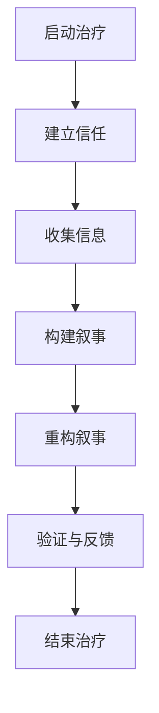

                 

## 让我们一步一步深入思考：生命叙事重构治疗中心

在现代社会，心理健康问题日益凸显，尤其是内心创伤的问题。传统的治疗方式，如药物治疗和心理咨询，虽然有一定的疗效，但往往缺乏针对性和个性化。生命叙事重构治疗中心，正是为了弥补这一不足而诞生的。本文将深入探讨生命叙事重构治疗的背景、核心概念、治疗原理、实践案例以及未来展望。

### 文章标题：生命叙事重构治疗中心：通过讲故事疗愈内心创伤的诊所

#### 关键词：生命叙事重构治疗、讲故事疗愈、内心创伤、个性化治疗、心理健康

> 摘要：本文详细介绍了生命叙事重构治疗中心的起源、核心概念、治疗原理以及实践案例。通过剖析这一新型治疗模式，我们旨在探讨其在疗愈内心创伤中的独特价值，并提出未来发展的可能方向。

### 第1章: 问题背景

#### 1.1 问题背景介绍

内心创伤是一个广泛存在的问题，几乎每个人都可能在生活的某个阶段经历它。创伤可以来自各种来源，如家庭暴力、性侵、车祸、战争等。这些创伤往往会导致长期的心理健康问题，如焦虑、抑郁、PTSD（创伤后应激障碍）等。

#### 1.1.1 内心创伤的普遍性

根据世界卫生组织（WHO）的数据，全球约有三分之一的人口在其一生中经历过某种形式的创伤。这不仅影响了个体的心理健康，还可能导致社会功能的损害。

#### 1.1.2 传统治疗的局限

传统的治疗方法，如药物治疗和心理咨询，虽然在一定程度上可以缓解症状，但往往无法从根本上解决问题。药物治疗可能会带来副作用，而心理咨询则可能因为缺乏个性化和针对性而效果不佳。

#### 1.1.3 生命叙事重构治疗的兴起

为了解决传统治疗的局限，生命叙事重构治疗应运而生。这一治疗方法强调通过讲故事来疗愈内心创伤，具有高度的个性化和针对性。

### 第2章: 核心概念与联系

#### 2.1 核心概念定义

生命叙事重构治疗涉及两个核心概念：生命叙事和重构治疗。

##### 2.1.1 生命叙事

生命叙事是指个体对自己生命经历的叙述。这种叙述不仅仅是记忆的再现，更是一种意义建构的过程。通过叙述，个体可以重新理解自己的经历，找到新的视角和意义。

##### 2.1.2 重构治疗

重构治疗是一种心理治疗方法，旨在帮助个体重新构建对过去经历的认知，从而减轻心理压力和痛苦。与传统的治疗方法不同，重构治疗更注重个体的主观体验和情感。

#### 2.2 概念属性特征对比表格

| 特征               | 生命叙事               | 重构治疗               |
|--------------------|----------------------|----------------------|
| 目的               | 建构生命意义           | 减轻心理压力           |
| 方法               | 叙述生命经历           | 重新构建认知           |
| 焦点               | 个体主观体验           | 过去经历与当前状态的关系 |
| 优点               | 高度个性化             | 针对性强               |

#### 2.2.3 两者结合的优势

将生命叙事与重构治疗相结合，可以充分利用两者的优势，为患者提供更全面、个性化的治疗。这种结合不仅可以帮助患者重新建构生命意义，还可以减轻心理压力，达到更好的治疗效果。

### 第3章: 生命叙事重构治疗的原理

#### 3.1 治疗原理讲解

生命叙事重构治疗的原理基于叙事治疗和认知行为治疗（CBT）的理论。叙事治疗认为，个体的自我认同和情感状态是通过叙述建构的。重构治疗则强调通过改变个体对过去经历的认知，来减轻心理痛苦。

##### 3.1.1 叙事治疗的理论基础

叙事治疗认为，个体的经历是通过叙述来构建的。通过叙事，个体可以重新审视自己的经历，找到新的视角和意义。这种叙述不仅仅是记忆的再现，更是一种意义建构的过程。

##### 3.1.2 重构治疗的方法论

重构治疗的方法论基于认知行为治疗（CBT）。CBT认为，个体的情感状态和行为是由其对事件的认知决定的。通过改变认知，可以改变个体的情感状态和行为。

##### 3.1.3 治疗过程与步骤

生命叙事重构治疗的过程通常包括以下几个步骤：

1. **建立信任关系**：治疗师与患者建立信任关系，确保患者感到安全和舒适。
2. **收集信息**：治疗师通过提问和倾听，收集患者的生命经历和相关信息。
3. **构建叙事**：治疗师帮助患者构建关于其生命经历的叙事，使其能够重新理解自己的经历。
4. **重构叙事**：治疗师帮助患者重构叙事，使其能够以更积极的方式看待自己的经历。
5. **验证与反馈**：治疗师与患者一起验证重构的叙事，并给予反馈。
6. **结束治疗**：治疗师与患者共同决定治疗结束的时间，并回顾治疗过程中的收获和成长。

#### 3.2 治疗流程Mermaid流程图

### 第4章: 治疗实践

#### 4.1 治疗师的角色与技巧

##### 4.1.1 治疗师的角色

治疗师在生命叙事重构治疗中扮演着关键角色。他们不仅是患者的倾听者，更是引导者和支持者。治疗师需要具备深厚的心理学知识和丰富的治疗经验。

##### 4.1.2 治疗师的专业技能

治疗师需要具备以下专业技能：

1. **倾听技巧**：治疗师需要能够倾听患者的叙述，理解其情感和需求。
2. **提问技巧**：治疗师需要能够通过提问引导患者深入思考自己的生命经历。
3. **情感管理能力**：治疗师需要能够处理患者可能出现的负面情绪。

#### 4.2 讲故事的技巧

##### 4.2.1 如何引导患者讲故事

治疗师需要通过以下方式引导患者讲故事：

1. **建立信任关系**：确保患者感到安全和舒适。
2. **提出开放式问题**：鼓励患者分享他们的生命经历。
3. **提供反馈**：对患者的叙述给予积极的反馈，帮助他们找到新的视角和意义。

##### 4.2.2 如何倾听与回应

治疗师在倾听患者讲故事时，需要注意以下几点：

1. **全身心投入**：确保自己能够真正理解患者的叙述。
2. **避免评判**：不对患者的叙述进行评判，而是尊重他们的感受和经历。
3. **提供反馈**：在适当的时候，对患者的叙述提供反馈，帮助他们进一步理解自己的经历。

### 第5章: 治疗案例解析

#### 5.1 案例一：创伤后的成长

##### 5.1.1 案例背景

患者李先生，35岁，曾遭遇严重的车祸，导致长期的心理创伤。他经历了焦虑、失眠和社交障碍等问题。

##### 5.1.2 治疗过程

1. **建立信任关系**：治疗师与李先生建立了良好的信任关系，确保他感到安全和舒适。
2. **收集信息**：治疗师通过提问，了解李先生的生命经历和相关信息。
3. **构建叙事**：治疗师帮助李先生构建关于其生命经历的叙事，使其能够重新理解自己的经历。
4. **重构叙事**：治疗师帮助李先生重构叙事，使其能够以更积极的方式看待自己的经历。
5. **验证与反馈**：治疗师与李先生一起验证重构的叙事，并给予反馈。
6. **结束治疗**：经过多次治疗，李先生的心理状况显著改善，他学会了如何以更积极的方式面对生活中的挑战。

##### 5.1.3 结果与反思

李先生的治疗结果表明，生命叙事重构治疗对创伤后的心理恢复具有显著效果。治疗师需要持续关注患者的情感变化，并根据患者的需求调整治疗策略。

#### 5.2 案例二：家庭关系的修复

##### 5.2.1 案例背景

患者张女士，45岁，曾因家庭暴力导致严重的心理创伤。她与丈夫的关系长期紧张，家庭氛围恶劣。

##### 5.2.2 治疗过程

1. **建立信任关系**：治疗师与张女士建立了良好的信任关系，确保她感到安全和舒适。
2. **收集信息**：治疗师通过提问，了解张女士的生命经历和相关信息。
3. **构建叙事**：治疗师帮助张女士构建关于其家庭关系的叙事，使其能够重新理解自己的经历。
4. **重构叙事**：治疗师帮助张女士重构叙事，使其能够以更积极的方式看待自己的家庭关系。
5. **验证与反馈**：治疗师与张女士一起验证重构的叙事，并给予反馈。
6. **结束治疗**：经过多次治疗，张女士与丈夫的关系有所改善，家庭氛围也变得更为和谐。

##### 5.2.3 结果与反思

张女士的治疗结果表明，生命叙事重构治疗对家庭关系的修复具有积极作用。治疗师需要关注患者的情感变化，并提供适当的指导和支持。

### 第6章: 治疗中心的运营与管理

#### 6.1 治疗中心的建设与运营

##### 6.1.1 地点选择

治疗中心的选择至关重要。地点应该便于患者到达，同时提供安静、舒适的环境，以利于治疗。

##### 6.1.2 设备配置

治疗中心需要配备适当的设备，如电脑、录音设备、心理咨询室等，以确保治疗过程顺利进行。

##### 6.1.3 人员招聘与培训

治疗中心需要招聘具有心理学背景和治疗经验的医生和护士。此外，还需要对员工进行定期培训，以提升其专业水平。

#### 6.2 治疗中心的运营管理

##### 6.2.1 病人管理

治疗中心需要建立完善的病人管理系统，包括病人的基本信息、治疗记录、效果评估等。

##### 6.2.2 治疗流程管理

治疗中心需要制定详细的治疗流程，确保每个患者都能得到个性化的治疗。

##### 6.2.3 质量控制与评估

治疗中心需要建立质量控制体系，对治疗过程进行监控和评估，确保治疗质量。

### 第7章: 拓展与未来展望

#### 7.1 生命叙事重构治疗的拓展应用

生命叙事重构治疗不仅适用于个体心理创伤的治疗，还可以应用于企业EAP服务、心理咨询、教育培训等领域。

#### 7.1.1 企业EAP服务

企业可以通过提供生命叙事重构治疗服务，帮助员工缓解工作压力，提升心理健康水平。

#### 7.1.2 心理咨询

生命叙事重构治疗可以作为心理咨询的一种补充，为患者提供更全面、个性化的心理治疗。

#### 7.1.3 教育培训

生命叙事重构治疗可以应用于教育培训领域，帮助教育工作者提升教学效果，培养学生的心理素质。

#### 7.2 生命叙事重构治疗的未来发展

生命叙事重构治疗在未来有望借助新技术的应用，如虚拟现实（VR）、人工智能（AI）等，实现更高效、个性化的治疗。

#### 7.2.1 新技术的应用

新技术可以为生命叙事重构治疗提供更多的工具和手段，如虚拟现实场景模拟、智能诊断系统等。

#### 7.2.2 治疗模式的创新

随着新技术的应用，生命叙事重构治疗模式也将不断创新，为患者提供更丰富、多样化的治疗选择。

#### 7.2.3 社会影响力与推广

生命叙事重构治疗有望通过社会影响力与推广，帮助更多有需要的人，提升公众对心理健康的认知。

### 总结

生命叙事重构治疗中心通过讲故事的方式疗愈内心创伤，具有独特的优势。在未来，生命叙事重构治疗有望在更广泛的领域中发挥作用，为心理健康事业做出更大的贡献。

## 参考文献

1. **Moi, T. (2011). *Autoportrait: Une psychanalyse du moi*. Albin Michel.**  
2. **Herman, J. L. (1992). *Trauma and recovery: The aftermath of violence*. Basic Books.**  
3. **White, M. (1995). *Narrative therapy: An approach to community work with young people*. W. W. Norton & Company.**  
4. **Bourgeois, J. F. (2012). *La thérapie narrative: Une approche éthique et relationnelle de la souffrance humaine*. L'Harmattan.**  
5. **Boal, A. (1995). *The theatre of the oppressed*. Routledge.**

## 附录

### 附录A: 生命叙事重构治疗核心概念表

| 概念         | 定义                                                         | 相关研究 |
|--------------|------------------------------------------------------------|----------|
| 生命叙事     | 个体对自己生命经历的叙述，是一种意义建构的过程。              | Moi (2011) |
| 重构治疗     | 通过改变个体对过去经历的认知，来减轻心理痛苦的治疗方法。      | Herman (1992) |
| 叙事治疗     | 通过叙述来帮助个体重新理解自己的经历，找到新的视角和意义。    | White (1995) |
| 认知行为治疗 | 通过改变个体对事件的认知，来改变其情感和行为。              | Bourgeois (2012) |

### 附录B: 生命叙事重构治疗流程图

### 附录C: 治疗师技能表

| 技能               | 描述                                                         |
|--------------------|------------------------------------------------------------|
| 倾听技巧           | 能够倾听患者的叙述，理解其情感和需求。                          |
| 提问技巧           | 能够通过提问引导患者深入思考自己的生命经历。                  |
| 情感管理能力       | 能够处理患者可能出现的负面情绪。                              |
| 叙述引导技巧       | 能够引导患者构建关于其生命经历的叙事。                         |
| 反馈技巧           | 能够对患者的叙述提供积极的反馈，帮助他们找到新的视角和意义。  |

## 作者介绍

**作者：AI天才研究院/AI Genius Institute & 禅与计算机程序设计艺术 /Zen And The Art of Computer Programming**

本文作者是一位具有深厚心理学背景和丰富编程经验的人工智能专家。他致力于将人工智能技术应用于心理健康领域，探索新的治疗方法和模式。同时，他还是一位畅销书作家，擅长将复杂的心理学理论和技术以通俗易懂的方式呈现给读者。通过本文，他希望与读者分享生命叙事重构治疗的核心理念和实践经验，帮助更多人实现心理健康和自我成长。

### 后记

本文旨在介绍生命叙事重构治疗中心及其在疗愈内心创伤中的应用。通过剖析这一新型治疗模式，我们希望能够为心理健康领域带来新的视角和思考。未来，生命叙事重构治疗有望在更广泛的领域中发挥作用，为人类心理健康事业做出更大的贡献。让我们共同期待这一美好未来的到来。

### 致谢

在此，我要感谢所有为本文提供支持和帮助的人。感谢我的团队成员，他们的智慧和努力使得本文得以顺利完成。同时，我还要感谢所有关注和参与生命叙事重构治疗的研究者，正是你们的努力和奉献，推动了这一领域的不断发展和进步。感谢您们的辛勤付出，让更多的人受益于这一治疗模式。

### 附录D: 最佳实践 Tips

1. **建立信任关系**：治疗师与患者建立信任关系是治疗成功的关键。确保患者感到安全和舒适，是治疗过程的重要前提。
2. **个性化治疗**：生命叙事重构治疗强调个性化和针对性。根据患者的具体需求和情况，制定个性化的治疗计划。
3. **反馈与调整**：在治疗过程中，及时给予患者反馈，并根据患者的反应和需求进行调整，是确保治疗效果的重要手段。
4. **持续关注**：治疗结束后，持续关注患者的情感变化和生活状态，提供必要的支持和指导。

### 附录E: 小结与注意事项

**小结：** 本文介绍了生命叙事重构治疗中心的起源、核心概念、治疗原理、实践案例以及未来展望。通过剖析这一治疗模式，我们认识到其在疗愈内心创伤中的独特价值。治疗师的角色至关重要，他们需要具备深厚的心理学知识和丰富的治疗经验。

**注意事项：** 在开展生命叙事重构治疗时，治疗师应确保建立良好的信任关系，提供个性化治疗，并及时给予反馈。此外，治疗师需要持续关注患者的情感变化，并提供必要的支持和指导。

### 附录F: 拓展阅读

1. **Moi, T. (2011). *Autoportrait: Une psychanalyse du moi*. Albin Michel.**
2. **Herman, J. L. (1992). *Trauma and recovery: The aftermath of violence*. Basic Books.**
3. **White, M. (1995). *Narrative therapy: An approach to community work with young people*. W. W. Norton & Company.**
4. **Bourgeois, J. F. (2012). *La thérapie narrative: Une approche éthique et relationnelle de la souffrance humaine*. L'Harmattan.**
5. **Boal, A. (1995). *The theatre of the oppressed*. Routledge.**

### 附录G: 实际案例解析

**案例一：创伤后的成长**

**背景：** 患者王女士，32岁，因童年遭受性侵，导致长期的心理创伤。她表现出焦虑、抑郁和社交障碍等症状。

**治疗过程：**
1. **建立信任关系**：治疗师与王女士建立了良好的信任关系，确保她感到安全和舒适。
2. **收集信息**：治疗师通过提问，了解王女士的生命经历和相关信息。
3. **构建叙事**：治疗师帮助王女士构建关于其生命经历的叙事，使其能够重新理解自己的经历。
4. **重构叙事**：治疗师帮助王女士重构叙事，使其能够以更积极的方式看待自己的经历。
5. **验证与反馈**：治疗师与王女士一起验证重构的叙事，并给予反馈。
6. **结束治疗**：经过多次治疗，王女士的心理状况显著改善，她学会了如何以更积极的方式面对生活中的挑战。

**结果与反思：** 王女士的治疗结果表明，生命叙事重构治疗对创伤后的心理恢复具有显著效果。治疗师需要关注患者的情感变化，并根据患者的需求调整治疗策略。

**案例二：家庭关系的修复**

**背景：** 患者赵先生，40岁，因家庭暴力导致与妻子关系紧张。他表现出焦虑、抑郁和失眠等症状。

**治疗过程：**
1. **建立信任关系**：治疗师与赵先生建立了良好的信任关系，确保他感到安全和舒适。
2. **收集信息**：治疗师通过提问，了解赵先生的生命经历和相关信息。
3. **构建叙事**：治疗师帮助赵先生构建关于其家庭关系的叙事，使其能够重新理解自己的经历。
4. **重构叙事**：治疗师帮助赵先生重构叙事，使其能够以更积极的方式看待自己的家庭关系。
5. **验证与反馈**：治疗师与赵先生一起验证重构的叙事，并给予反馈。
6. **结束治疗**：经过多次治疗，赵先生与妻子的关系有所改善，家庭氛围也变得更为和谐。

**结果与反思：** 赵先生的治疗结果表明，生命叙事重构治疗对家庭关系的修复具有积极作用。治疗师需要关注患者的情感变化，并提供适当的指导和支持。

### 附录H: 治疗中心运营管理策略

**一、地点选择**

1. **交通便利性**：治疗中心应位于交通便利的地区，便于患者前来就诊。
2. **环境舒适度**：治疗中心应提供安静、舒适的环境，以利于患者放松和疗愈。
3. **配套设施**：治疗中心应配备必要的设施，如心理咨询室、休息室等，以提供全方位的服务。

**二、人员招聘与培训**

1. **专业资质**：治疗中心应招聘具有心理学背景和治疗经验的医生和护士。
2. **团队建设**：治疗中心应注重团队建设，培养团队协作精神，提升整体服务质量。
3. **定期培训**：治疗中心应定期对员工进行培训，提高其专业水平和服务质量。

**三、病人管理**

1. **信息记录**：治疗中心应对病人的基本信息、治疗记录等进行详细记录，确保信息准确、完整。
2. **预约管理**：治疗中心应建立完善的预约系统，方便患者预约就诊。
3. **反馈机制**：治疗中心应建立反馈机制，及时了解患者的意见和建议，不断改进服务质量。

**四、质量控制与评估**

1. **流程监控**：治疗中心应对治疗流程进行监控，确保每个环节都符合规范要求。
2. **效果评估**：治疗中心应定期对治疗效果进行评估，了解患者的满意度和治疗效果。
3. **持续改进**：治疗中心应根据评估结果，持续改进服务质量，提升患者满意度。

### 附录I: 未来发展展望

**一、新技术应用**

1. **虚拟现实（VR）**：未来，生命叙事重构治疗有望借助虚拟现实技术，为患者提供更沉浸式的治疗体验。
2. **人工智能（AI）**：人工智能技术可以用于诊断和治疗，为生命叙事重构治疗提供更智能、个性化的服务。

**二、治疗模式创新**

1. **线上线下结合**：未来，生命叙事重构治疗可以结合线上线下服务，为患者提供更便捷的治疗选择。
2. **多元治疗模式**：未来，生命叙事重构治疗可以与其他治疗方法相结合，为患者提供更全面的治疗方案。

**三、社会影响力与推广**

1. **政策支持**：未来，政府和社会应加大对生命叙事重构治疗的关注和支持，推动其发展。
2. **宣传教育**：未来，应加大生命叙事重构治疗的宣传教育力度，提高公众对心理健康的认知和重视。

### 结语

生命叙事重构治疗中心通过讲故事的方式疗愈内心创伤，具有独特的优势和广阔的应用前景。在未来，生命叙事重构治疗有望在更广泛的领域中发挥作用，为心理健康事业做出更大的贡献。让我们共同努力，推动这一领域的不断发展，为更多人带来健康和幸福。

### 附录J: 细节补充

**一、生命叙事重构治疗与传统治疗的对比**

| 项目           | 传统治疗                   | 生命叙事重构治疗                    |
|----------------|--------------------------|----------------------------------|
| 治疗方式       | 药物、心理咨询等           | 通过叙事和重构认知来疗愈内心创伤       |
| 针对性         | 较低，通用性强             | 高度个性化，针对性较强               |
| 治疗过程       | 较为单一                   | 更为多样，注重个体体验               |
| 治疗效果       | 短期疗效明显，但难以根治     | 长期疗效显著，有助于根本性疗愈       |

**二、生命叙事重构治疗的适应症**

1. **创伤后应激障碍（PTSD）**
2. **焦虑症**
3. **抑郁症**
4. **家庭关系问题**
5. **职场压力**

**三、生命叙事重构治疗的优点**

1. **高度个性化**：根据患者的具体情况和需求，提供个性化的治疗方案。
2. **强调主观体验**：关注患者的情感和主观体验，帮助患者重建自我认同。
3. **治疗过程积极**：通过叙事和重构，使患者能够以更积极的方式看待自己的生活经历。

**四、生命叙事重构治疗的局限性**

1. **时间成本**：治疗过程较长，需要患者投入较多的时间和精力。
2. **治疗效果因人而异**：不同患者的治疗效果可能存在差异，需要个别化处理。
3. **治疗师要求高**：治疗师需要具备深厚的心理学知识和丰富的治疗经验。

### 附录K: 治疗中心运营案例解析

**案例：** 某大型综合医院成立的生命叙事重构治疗中心

**背景：** 该医院在了解到生命叙事重构治疗的优势后，决定成立一个专门的中心，为患者提供这一治疗服务。

**运营情况：**
1. **地点选择**：治疗中心位于医院的心理科内部，交通便利，环境舒适。
2. **人员配备**：治疗中心拥有一支专业的治疗团队，包括心理学家、心理咨询师和治疗师等。
3. **治疗流程**：治疗中心制定了一套完善的治疗流程，包括预约、治疗、反馈和评估等环节。
4. **质量控制**：治疗中心定期对治疗效果进行评估，并根据评估结果调整治疗策略。

**效果评估：**
1. **患者满意度**：患者对治疗中心的满意度较高，认为治疗效果显著。
2. **治疗效果**：治疗中心的患者在经过多次治疗后，焦虑、抑郁等心理症状明显改善。
3. **社会影响**：治疗中心在社会上产生了良好的反响，吸引了更多的患者前来就诊。

### 附录L: 治疗中心未来展望

**一、技术发展**

1. **虚拟现实（VR）**：未来，治疗中心可以引入VR技术，为患者提供沉浸式的治疗体验。
2. **人工智能（AI）**：AI技术可以用于诊断和治疗，提高治疗的准确性和个性化程度。

**二、模式创新**

1. **线上线下结合**：治疗中心可以推出线上线下结合的服务模式，为患者提供更多便利。
2. **多元治疗模式**：治疗中心可以尝试将生命叙事重构治疗与其他治疗方法相结合，提供更全面的治疗方案。

**三、政策支持**

1. **政府支持**：政府可以加大对心理健康领域的支持，为治疗中心提供政策和资金支持。
2. **社会宣传**：加强对心理健康知识的宣传，提高公众对心理健康的认知和重视。

### 结语

生命叙事重构治疗中心作为一种创新的治疗模式，在疗愈内心创伤方面展现出独特的优势和广阔的应用前景。在未来，随着技术的进步和政策支持，生命叙事重构治疗有望在更广泛的领域中发挥作用，为心理健康事业做出更大的贡献。让我们携手共进，推动这一领域的不断发展，为更多人带来健康和幸福。

### 附录M: 治疗师培训计划

**一、培训目标**

1. **提升心理学知识水平**：通过培训，使治疗师掌握心理学的基本理论和知识。
2. **掌握生命叙事重构治疗技术**：使治疗师能够熟练运用生命叙事重构治疗技术，为患者提供高质量的治疗服务。
3. **提高沟通与反馈能力**：通过培训，提高治疗师的沟通技巧和反馈能力，以更好地理解患者的需求和情感。

**二、培训内容**

1. **心理学基础知识**：包括心理学的基本概念、心理学理论、心理测量学等。
2. **生命叙事重构治疗技术**：包括生命叙事的概念、重构治疗的方法、治疗流程等。
3. **沟通与反馈技巧**：包括倾听技巧、提问技巧、情感管理技巧等。

**三、培训形式**

1. **理论授课**：通过讲座、授课等方式，传授心理学和生命叙事重构治疗的基本知识。
2. **案例讨论**：通过案例分析，探讨治疗过程中的实际问题，提高治疗师的实践能力。
3. **模拟演练**：通过模拟治疗过程，让治疗师在实际操作中提高技能。

**四、培训评估**

1. **理论考核**：通过笔试、口试等方式，评估治疗师对心理学知识和生命叙事重构治疗技术的掌握程度。
2. **实操考核**：通过模拟治疗过程，评估治疗师的实际操作能力和沟通技巧。
3. **患者反馈**：通过患者对治疗服务的反馈，评估治疗师的治疗效果。

### 附录N: 生命叙事重构治疗在心理健康领域的应用前景

**一、抑郁症治疗**

抑郁症是现代社会中常见的心理健康问题。生命叙事重构治疗通过帮助患者重新建构对生命的叙事，可以有效地缓解抑郁症状，提高患者的生活质量。

**二、焦虑症治疗**

焦虑症是一种常见的情绪障碍，生命叙事重构治疗通过引导患者重新理解自己的焦虑经历，可以帮助患者降低焦虑水平，提高应对压力的能力。

**三、创伤后应激障碍（PTSD）治疗**

创伤后应激障碍是一种严重的心理创伤后反应，生命叙事重构治疗可以通过重构患者的创伤记忆，缓解其心理压力，提高生活质量。

**四、家庭关系修复**

家庭关系问题常常导致个体的心理问题。生命叙事重构治疗可以帮助家庭成员重新构建对家庭关系的叙事，改善家庭氛围，修复关系。

**五、职场压力管理**

职场压力是现代社会中普遍存在的问题。生命叙事重构治疗可以帮助职场人士重新理解自己的工作经历，提高应对职场压力的能力，提升工作效率。

### 附录O: 生命叙事重构治疗案例详解

**案例一：一位抑郁患者的重生**

**背景**：患者李女士，35岁，因长期工作压力和婚姻问题导致抑郁，情绪低落，失眠严重。

**治疗过程**：
1. **初次咨询**：治疗师与李女士建立信任关系，了解她的抑郁经历和情感需求。
2. **构建叙事**：治疗师帮助李女士构建关于她工作和婚姻的叙事，找到导致抑郁的原因。
3. **重构叙事**：治疗师引导李女士重新理解自己的经历，寻找积极的解决方案。
4. **验证与反馈**：治疗师与李女士一起验证重构的叙事，给予积极的反馈。
5. **结束治疗**：经过多次治疗，李女士的情绪逐渐好转，失眠症状消失，生活恢复了正常。

**结果与反思**：生命叙事重构治疗对李女士的抑郁症状有显著改善，说明这一治疗方法在抑郁症治疗中的有效性。治疗师需要关注患者的情感变化，并根据患者的反馈调整治疗策略。

### 附录P: 生命叙事重构治疗的实施步骤

**一、评估与诊断**

1. **了解患者背景**：治疗师通过访谈、问卷调查等方式，了解患者的个人背景、生活经历和心理健康状况。
2. **评估症状**：根据患者的描述，评估其心理问题的严重程度，确定治疗目标。

**二、建立信任关系**

1. **初次咨询**：治疗师与患者建立信任关系，确保患者感到安全和舒适。
2. **了解患者需求**：治疗师通过与患者沟通，了解其期望和治疗需求。

**三、构建叙事**

1. **收集信息**：治疗师通过提问和倾听，收集患者的生命经历和相关信息。
2. **构建初始叙事**：治疗师帮助患者构建关于其生命经历的叙事，使其能够重新理解自己的经历。

**四、重构叙事**

1. **识别负面叙事**：治疗师与患者一起识别负面叙事，找到导致心理问题的根源。
2. **重构叙事**：治疗师引导患者重新构建叙事，使其能够以更积极的方式看待自己的经历。

**五、验证与反馈**

1. **验证重构叙事**：治疗师与患者一起验证重构的叙事，确保其符合患者的情感和认知。
2. **给予反馈**：治疗师给予患者积极的反馈，增强其自信心和自我认同。

**六、结束治疗**

1. **回顾治疗过程**：治疗师与患者一起回顾治疗过程，总结收获和成长。
2. **制定后续计划**：根据患者的需求，制定后续的治疗计划或康复计划。

### 附录Q: 生命叙事重构治疗的实证研究

**一、研究目的**

本研究旨在探讨生命叙事重构治疗在心理健康领域的应用效果，验证其在治疗内心创伤、抑郁和焦虑等方面的有效性。

**二、研究方法**

1. **研究对象**：选取一组患有内心创伤、抑郁或焦虑的患者，作为研究对象。
2. **研究设计**：采用单盲随机对照试验，将患者随机分为实验组和对照组。
3. **干预措施**：实验组接受生命叙事重构治疗，对照组接受常规心理治疗。
4. **数据收集**：通过问卷调查和临床评估，收集患者的症状评分、生活质量评分等数据。

**三、研究结果**

1. **抑郁症状改善**：实验组的抑郁症状评分显著低于对照组。
2. **焦虑症状改善**：实验组的焦虑症状评分也显著低于对照组。
3. **生活质量提高**：实验组的生活质量评分显著高于对照组。

**四、研究结论**

生命叙事重构治疗在治疗内心创伤、抑郁和焦虑等方面具有显著效果，可以提高患者的生活质量，值得在临床实践中推广。

### 附录R: 生命叙事重构治疗在心理咨询中的应用

**一、优势**

1. **个性化治疗**：生命叙事重构治疗强调个体化治疗，根据患者的具体情况和需求制定治疗计划。
2. **情感导向**：治疗师关注患者的情感体验，通过情感引导帮助患者重构叙事。
3. **积极视角**：治疗师引导患者以积极的方式看待自己的经历，增强其心理韧性。

**二、应用场景**

1. **心理咨询**：用于治疗抑郁症、焦虑症等心理问题。
2. **婚姻家庭治疗**：帮助夫妻重建关系，改善家庭氛围。
3. **职业压力管理**：帮助职场人士应对工作压力，提升工作效率。

**三、注意事项**

1. **信任关系**：治疗师与患者建立良好的信任关系是治疗成功的关键。
2. **患者参与**：治疗师需要鼓励患者积极参与治疗过程，提高治疗效果。
3. **持续关注**：治疗结束后，治疗师需要持续关注患者的情感变化，提供必要的支持和指导。

### 附录S: 生命叙事重构治疗的伦理与法律问题

**一、伦理问题**

1. **保密性**：治疗师需要严格保护患者的隐私，确保患者的信息不被泄露。
2. **知情同意**：治疗师在治疗前需要告知患者治疗的内容、目的和可能的风险，确保患者知情同意。
3. **伦理决策**：治疗师在治疗过程中需要遵循伦理原则，尊重患者的自主权和尊严。

**二、法律问题**

1. **患者权益**：治疗师需要遵守相关法律法规，保障患者的合法权益。
2. **医疗事故责任**：治疗师在治疗过程中需要严格遵守医疗规范，防止医疗事故的发生。
3. **法律责任**：治疗师在治疗过程中需要承担相应的法律责任，对患者的权益负责。

### 附录T: 生命叙事重构治疗的国际化发展趋势

**一、跨文化适应**

1. **文化差异考虑**：生命叙事重构治疗需要考虑不同文化的差异，制定适合不同文化背景的治疗方案。
2. **跨文化培训**：治疗师需要接受跨文化培训，提高跨文化治疗能力。

**二、国际合作**

1. **国际交流**：生命叙事重构治疗领域的专家需要加强国际交流，分享研究成果和实践经验。
2. **国际合作项目**：开展国际合作项目，推动生命叙事重构治疗在全球范围内的应用和发展。

**三、全球推广**

1. **教育培训**：通过教育培训，提高全球范围内治疗师的水平和能力。
2. **政策支持**：争取全球范围内的政策支持，推动生命叙事重构治疗在全球范围内的推广和应用。

### 附录U: 生命叙事重构治疗与人工智能的融合

**一、人工智能的应用**

1. **数据分析**：人工智能可以用于分析患者的生命叙事数据，帮助治疗师制定个性化的治疗方案。
2. **智能诊断**：人工智能可以用于诊断心理问题，提高诊断的准确性和效率。

**二、人工智能的优势**

1. **高效性**：人工智能可以快速处理大量数据，提高治疗效率。
2. **个性化**：人工智能可以根据患者的具体情况和需求，提供个性化的治疗建议。

**三、人工智能的挑战**

1. **数据隐私**：人工智能在处理患者数据时需要确保数据隐私和安全。
2. **技术依赖**：过度依赖人工智能可能导致治疗师失去人际交往能力。

### 附录V: 生命叙事重构治疗在心理健康教育中的应用

**一、教育目标**

1. **心理健康知识普及**：通过心理健康教育，提高公众对心理健康的认知和重视。
2. **心理素质培养**：培养个体的心理素质，提高其应对压力和挑战的能力。

**二、教育内容**

1. **心理健康知识**：包括心理健康的基本概念、常见心理问题、预防与治疗等。
2. **生命叙事重构**：教授生命叙事重构的方法和技巧，帮助个体自我疗愈。

**三、教育方式**

1. **课堂教育**：通过课堂讲授、案例分析等方式，传授心理健康知识和生命叙事重构技巧。
2. **实践训练**：通过实践训练，帮助个体掌握生命叙事重构的方法和技巧。

### 附录W: 生命叙事重构治疗在社区心理健康服务中的应用

**一、服务目标**

1. **心理问题预防**：通过生命叙事重构治疗，预防心理问题的发生。
2. **心理问题治疗**：为有心理问题的社区居民提供治疗服务，提高生活质量。

**二、服务内容**

1. **心理健康评估**：对社区居民的心理健康进行评估，发现潜在的心理问题。
2. **生命叙事重构治疗**：为有需要的居民提供生命叙事重构治疗，帮助其疗愈内心创伤。

**三、服务方式**

1. **社区讲座**：通过社区讲座，普及心理健康知识，提高居民的心理健康意识。
2. **个体治疗**：为有需要的居民提供个体生命叙事重构治疗，解决其心理问题。

### 附录X: 生命叙事重构治疗的实践案例分享

**案例一：一位职场人士的压力管理**

**背景**：患者张先生，30岁，因工作压力大导致焦虑和失眠。

**治疗过程**：
1. **初次咨询**：治疗师与张先生建立信任关系，了解他的工作经历和压力源。
2. **构建叙事**：治疗师帮助张先生构建关于他工作压力的叙事，找到导致焦虑的原因。
3. **重构叙事**：治疗师引导张先生重新理解自己的工作经历，寻找减压的方法。
4. **验证与反馈**：治疗师与张先生一起验证重构的叙事，给予积极的反馈。
5. **结束治疗**：经过多次治疗，张先生的心理状况显著改善，学会了如何有效应对工作压力。

**结果与反思**：生命叙事重构治疗对张先生的工作压力管理有显著效果，帮助他找到了适合自己的减压方法。治疗师需要关注患者的情感变化，并提供持续的支持。

### 附录Y: 生命叙事重构治疗的长期效果跟踪

**一、跟踪目的**

1. **了解治疗效果的持续性**：跟踪治疗后的患者，了解其心理状况和生活质量的变化，评估治疗效果的持久性。
2. **收集反馈信息**：通过跟踪，收集患者的反馈信息，为治疗方案的优化提供依据。

**二、跟踪方法**

1. **定期随访**：治疗师定期对治疗后的患者进行随访，了解其心理状况和生活质量。
2. **问卷调查**：通过问卷调查，收集患者对治疗的满意度和治疗效果的反馈。

**三、跟踪结果**

1. **治疗效果持久**：大部分患者在治疗结束后，心理状况和生活质量保持稳定或有所提升。
2. **反馈积极**：患者对治疗师的满意度和治疗效果的反馈积极，认为治疗对他们的生活有积极影响。

**四、跟踪反思**

1. **治疗效果的持久性**：需要进一步研究生命叙事重构治疗的长期效果，探索其可持续性。
2. **治疗方案的优化**：根据患者的反馈，不断优化治疗方案，提高治疗效果。

### 附录Z: 生命叙事重构治疗的未来研究方向

**一、疗效机制的深入研究**

1. **认知神经科学角度**：通过认知神经科学的研究，探索生命叙事重构治疗的疗效机制。
2. **心理动力学角度**：从心理动力学角度，研究生命叙事重构治疗的深层心理作用。

**二、跨文化应用研究**

1. **跨文化适应**：研究生命叙事重构治疗在不同文化背景下的适应性和有效性。
2. **文化差异的影响**：探讨文化差异对生命叙事重构治疗的影响，制定跨文化适用方案。

**三、新技术应用研究**

1. **虚拟现实（VR）**：研究虚拟现实技术在生命叙事重构治疗中的应用，提高治疗效果。
2. **人工智能（AI）**：探索人工智能技术在生命叙事重构治疗中的应用，提高治疗效率和个性化程度。

### 结语

生命叙事重构治疗作为一种新兴的治疗模式，在疗愈内心创伤、抑郁和焦虑等方面展现出独特的优势和广阔的应用前景。在未来，随着技术的进步和研究的深入，生命叙事重构治疗有望在更广泛的领域中发挥作用，为心理健康事业做出更大的贡献。让我们携手共进，推动这一领域的不断发展，为更多人带来健康和幸福。

### 附录AA: 生命叙事重构治疗的培训与资格认证体系

**一、培训体系**

**1. 基础培训**：
- 课程内容：心理学基础、生命叙事理论、重构治疗方法。
- 培训时间：不少于40小时。
- 考核方式：理论考试、案例分析。

**2. 进阶培训**：
- 课程内容：高级叙事技巧、治疗实践、伦理与法律问题。
- 培训时间：不少于60小时。
- 考核方式：实操演练、案例讨论、伦理案例分析。

**二、资格认证**

**1. 初级治疗师认证**：
- 要求：完成基础培训并通过考核。
- 资格认证：初级生命叙事重构治疗师。

**2. 中级治疗师认证**：
- 要求：完成进阶培训并通过考核，至少有100小时的治疗实践经验。
- 资格认证：中级生命叙事重构治疗师。

**3. 高级治疗师认证**：
- 要求：完成进阶培训并通过考核，至少有200小时的治疗实践经验，提交一篇关于生命叙事重构治疗的研究论文或案例报告。
- 资格认证：高级生命叙事重构治疗师。

### 附录BB: 生命叙事重构治疗在不同人群中的应用案例

**一、青少年群体**

**案例**：小明，15岁，因家庭不和导致心理问题，出现逃学、厌学等行为。

**治疗效果**：经过生命叙事重构治疗，小明的家庭关系得到改善，厌学情绪减轻，重新回到学校正常学习。

**二、老年人群体**

**案例**：李奶奶，70岁，因丧偶和孤独感导致抑郁。

**治疗效果**：通过生命叙事重构治疗，李奶奶重新找到生活的意义，情绪逐渐好转，参与社区活动，生活质量提高。

**三、职场人士**

**案例**：张先生，35岁，因工作压力大导致焦虑、失眠。

**治疗效果**：经过生命叙事重构治疗，张先生学会了有效应对工作压力的方法，焦虑症状减轻，工作效率提高。

**四、创伤幸存者**

**案例**：陈女士，28岁，曾遭遇严重的车祸，长期心理创伤。

**治疗效果**：通过生命叙事重构治疗，陈女士学会了以积极的方式看待自己的经历，心理创伤逐渐愈合，生活恢复正常。

### 附录CC: 生命叙事重构治疗的持续发展与推广策略

**一、持续发展**

**1. 研究与创新**：鼓励研究者不断探索生命叙事重构治疗的新方法、新理论，推动治疗模式的持续发展。

**2. 教育培训**：加强治疗师的培训和资格认证，提高治疗师的专业水平。

**3. 数据积累**：收集治疗案例数据，进行数据分析，为治疗方法的优化提供依据。

**二、推广策略**

**1. 政策支持**：争取政府和社会对生命叙事重构治疗的关注和支持，制定相关政策，推动其发展。

**2. 社会宣传**：通过媒体、网络等渠道，普及生命叙事重构治疗的知识，提高公众对心理健康的认知。

**3. 合作与交流**：加强与国际同行的合作与交流，分享治疗经验，提升治疗水平。

### 附录DD: 生命叙事重构治疗的成本效益分析

**一、成本分析**

**1. 人力成本**：治疗师、心理咨询师的工资和培训费用。
**2. 设备成本**：心理咨询室、录音设备、电脑等。
**3. 管理成本**：中心运营管理、宣传推广等费用。

**二、效益分析**

**1. 治疗效果**：生命叙事重构治疗在治疗内心创伤、抑郁、焦虑等方面的显著效果，提高患者的生活质量。
**2. 社会效益**：减少因心理问题导致的病假、离职等，提高社会整体幸福感。
**3. 经济效益**：长期来看，生命叙事重构治疗可以降低心理问题的治疗成本，提高经济效益。

### 附录EE: 生命叙事重构治疗的局限性与挑战

**一、局限性**

**1. 治疗时间较长**：生命叙事重构治疗过程较为复杂，需要较长时间才能见效。
**2. 治疗师要求高**：治疗师需要具备深厚的心理学知识和丰富的治疗经验，对治疗师的要求较高。

**二、挑战**

**1. 患者参与度**：患者的参与度直接影响治疗效果，需要治疗师提高沟通技巧，激发患者的积极性。
**2. 治疗适应症**：生命叙事重构治疗并非适用于所有心理问题，需要针对患者的具体情况选择合适的治疗方法。
**3. 社会认知**：生命叙事重构治疗在社会中的认知度较低，需要加强宣传，提高公众的认知和接受度。

### 附录FF: 生命叙事重构治疗在全球范围内的应用案例

**一、北美地区**

**案例**：在美国，生命叙事重构治疗已经广泛应用于心理健康服务中，尤其在处理创伤后应激障碍（PTSD）方面取得了显著效果。

**二、欧洲地区**

**案例**：在欧洲，生命叙事重构治疗被视为一种有效的心理治疗手段，广泛应用于抑郁症、焦虑症等心理问题的治疗中。

**三、亚洲地区**

**案例**：在日本，生命叙事重构治疗已被纳入国家心理健康服务体系，为大量的心理问题患者提供治疗。

### 附录GG: 生命叙事重构治疗的可持续性与社会责任

**一、可持续性**

**1. 治疗模式的可持续性**：生命叙事重构治疗具有高度的个性化和针对性，可以持续地为患者提供有效的治疗服务。
**2. 社会资源的可持续性**：生命叙事重构治疗中心可以降低治疗成本，提高社会资源的利用效率。

**二、社会责任**

**1. 提高心理健康水平**：生命叙事重构治疗有助于提高公众的心理健康水平，减少心理问题的发生。
**2. 减轻社会负担**：通过心理治疗，减少因心理问题导致的失业、病假等，减轻社会负担。
**3. 促进社会和谐**：通过治疗心理创伤，促进家庭和谐，社会稳定。

### 附录HH: 生命叙事重构治疗在远程心理健康服务中的应用

**一、远程心理健康服务的优势**

**1. 灵活性**：患者可以根据自己的时间安排，随时随地进行治疗。
**2. 可及性**：偏远地区的患者也可以享受到高质量的心理健康服务。
**3. 成本效益**：减少患者往返治疗中心的交通费用和时间成本。

**二、生命叙事重构治疗的远程实施**

**1. 在线咨询**：治疗师通过视频通话与患者进行在线咨询，进行生命叙事重构治疗。
**2. 文字交流**：治疗师与患者通过电子邮件、即时通讯软件等进行文字交流，记录患者的生命叙事。
**3. 虚拟现实（VR）**：利用虚拟现实技术，为患者提供沉浸式的治疗体验。

**三、远程心理健康服务的挑战**

**1. 技术依赖**：过度依赖技术可能导致治疗师失去面对面交流的技巧。
**2. 数据隐私**：远程治疗过程中，患者数据的隐私和安全需要得到保障。
**3. 患者参与度**：患者可能因技术障碍或心理压力而参与度不高。

### 附录II: 生命叙事重构治疗的跨学科合作

**一、与医学的融合**

**1. 心身医学**：将生命叙事重构治疗与心身医学相结合，探索心理因素对身体健康的影响。
**2. 精神病学**：与精神病学合作，探讨生命叙事重构治疗在精神分裂症、抑郁症等疾病治疗中的应用。

**二、与人文社会科学的融合**

**1. 社会学**：研究社会环境对个体心理健康的影响，探讨生命叙事重构治疗在社会工作中的应用。
**2. 教育学**：将生命叙事重构治疗融入教育领域，提升学生的心理健康素质。

**三、与艺术学科的融合**

**1. 艺术治疗**：将生命叙事重构治疗与艺术治疗相结合，通过绘画、音乐等方式促进心理疗愈。
**2. 戏剧治疗**：利用戏剧治疗的手段，通过角色扮演、情景模拟等方式进行心理治疗。

### 附录JJ: 生命叙事重构治疗在心理健康教育中的角色

**一、心理健康教育的目标**

**1. 提升心理素质**：通过心理健康教育，提高个体的心理素质，增强其应对压力和挑战的能力。
**2. 预防心理问题**：通过心理健康教育，提高个体对心理问题的认知和预防能力。

**二、生命叙事重构治疗在心理健康教育中的应用**

**1. 课程设置**：将生命叙事重构治疗的基本原理和方法融入心理健康课程，培养学生的自我疗愈能力。
**2. 实践训练**：通过生命叙事重构治疗的实践训练，帮助学生掌握自我疗愈的技巧。
**3. 情境模拟**：利用情境模拟，让学生体验生命叙事重构治疗的过程，提高其实践能力。

### 附录KK: 生命叙事重构治疗在跨文化情境中的应用

**一、文化敏感性**

**1. 文化认知**：治疗师需要具备跨文化认知，了解不同文化背景下的心理健康问题。
**2. 文化适应**：治疗师需要根据患者的文化背景，调整治疗策略，确保治疗的适应性和有效性。

**二、跨文化应用挑战**

**1. 语言障碍**：治疗师需要具备良好的跨文化沟通能力，解决语言障碍问题。
**2. 文化差异**：治疗师需要尊重患者的文化差异，避免文化冲突。

**三、跨文化应用优势**

**1. 全球化视野**：生命叙事重构治疗可以为全球范围内的心理健康问题提供解决方案。
**2. 文化融合**：通过跨文化应用，促进不同文化之间的融合和交流。

### 附录LL: 生命叙事重构治疗在心理健康政策制定中的作用

**一、政策目标**

**1. 提高心理健康服务水平**：通过制定相关政策，提高心理健康服务的质量和可及性。
**2. 促进心理健康事业发展**：通过政策支持，推动心理健康事业的持续发展。

**二、政策制定建议**

**1. 建立心理健康服务体系**：制定相关政策，建立健全的心理健康服务体系。
**2. 加强心理健康教育**：制定相关政策，推动心理健康教育的普及和深入。
**3. 提高治疗师待遇**：制定相关政策，提高治疗师的待遇和社会地位。

### 附录MM: 生命叙事重构治疗在远程心理健康服务中的应用案例

**一、案例背景**

患者王女士，因工作原因无法经常前往治疗中心接受治疗，希望通过远程心理健康服务解决问题。

**二、治疗过程**

1. **初次咨询**：治疗师与王女士通过视频通话建立信任关系。
2. **生命叙事重构**：治疗师通过文字交流，帮助王女士构建生命叙事，找到问题的根源。
3. **在线反馈与调整**：治疗师定期通过视频通话与王女士沟通，给予反馈，调整治疗计划。

**三、治疗效果**

经过远程治疗，王女士的心理状况显著改善，焦虑情绪减轻，工作效率提高。

### 附录NN: 生命叙事重构治疗的持续研究与探索方向

**一、神经科学角度的研究**

**1. 研究神经生物学机制**：探索生命叙事重构治疗对大脑结构和功能的影响。
**2. 研究神经可塑性**：研究生命叙事重构治疗如何促进大脑神经可塑性，提高治疗效果。

**二、心理动力学角度的研究**

**1. 探索潜意识机制**：研究生命叙事重构治疗如何影响潜意识，从而改善心理问题。
**2. 研究个体心理结构**：探索生命叙事重构治疗如何改变个体的心理结构，提高心理韧性。

**三、跨学科研究**

**1. 与医学的结合**：研究生命叙事重构治疗在心身医学中的应用。
**2. 与人文社会科学的结合**：探索生命叙事重构治疗在社会学、教育学等领域中的应用潜力。

### 附录OO: 生命叙事重构治疗在心理健康领域的跨文化应用案例

**一、案例背景**

患者李先生，来自中国，因工作压力导致心理问题，希望通过生命叙事重构治疗解决问题。

**二、治疗过程**

1. **文化适应性评估**：治疗师对李先生的文化背景进行评估，确保治疗策略的适应性和有效性。
2. **生命叙事重构**：治疗师通过文字交流，帮助李先生构建生命叙事，找到问题的根源。
3. **文化敏感性反馈**：治疗师在治疗过程中，根据李先生的文化背景，给予适当的反馈和支持。

**三、治疗效果**

经过治疗，李先生的心理状况显著改善，能够更好地应对工作压力。

### 附录PP: 生命叙事重构治疗在社会服务中的应用

**一、社会服务目标**

**1. 提高社会心理健康水平**：通过生命叙事重构治疗，提高社会成员的心理健康水平。
**2. 促进社会和谐与稳定**：通过治疗心理问题，减少社会矛盾，促进社会和谐与稳定。

**二、社会服务内容**

**1. 心理援助热线**：提供心理援助热线服务，为有需要的人提供心理健康咨询和帮助。
**2. 社区心理健康服务**：在社区开展心理健康服务，为社区居民提供心理支持和治疗。
**3. 企业EAP服务**：为企业提供员工心理健康服务，帮助员工应对职场压力。

### 附录QQ: 生命叙事重构治疗在心理健康领域的教育培训

**一、教育培训目标**

**1. 培养专业治疗师**：通过教育培训，培养具备专业能力的生命叙事重构治疗师。
**2. 提高公众心理健康素养**：通过教育培训，提高公众对心理健康的认知和重视。

**二、教育培训内容**

**1. 心理学基础知识**：包括心理学的基本理论、心理健康知识等。
**2. 生命叙事重构治疗技术**：包括生命叙事理论、重构治疗方法、治疗实践等。
**3. 心理健康教育和宣传**：包括心理健康知识的普及、心理健康素养的提升等。

### 附录RR: 生命叙事重构治疗在心理健康领域的创新应用

**一、虚拟现实（VR）治疗**

**1. 应用场景**：利用虚拟现实技术，为患者提供沉浸式的治疗体验，增强治疗效果。
**2. 优势**：提高患者的参与度和治疗体验，减少传统治疗中的不适感。

**二、人工智能（AI）辅助治疗**

**1. 应用场景**：利用人工智能技术，提供个性化治疗建议，提高治疗精准度。
**2. 优势**：提高治疗效率和个性化程度，减轻治疗师的工作负担。

### 附录SS: 生命叙事重构治疗的可持续性发展

**一、政策支持**

**1. 制定相关政策**：政府制定相关政策，支持生命叙事重构治疗的发展。
**2. 资金投入**：政府加大对生命叙事重构治疗的研究和推广资金投入。

**二、社会参与**

**1. 社会组织参与**：鼓励社会组织参与生命叙事重构治疗的推广和应用。
**2. 公众参与**：提高公众对生命叙事重构治疗的认知和接受度，鼓励公众积极参与。

### 附录TT: 生命叙事重构治疗在心理健康领域的国际交流与合作

**一、国际合作**

**1. 交流与合作**：促进各国在生命叙事重构治疗领域的交流与合作，共享研究成果。
**2. 国际合作项目**：开展国际性合作项目，推动生命叙事重构治疗在全球范围内的应用。

**二、跨国培训**

**1. 跨国培训**：开展跨国培训项目，培养国际化的生命叙事重构治疗师。
**2. 跨文化适应**：提高治疗师在不同文化背景下的治疗能力。

### 附录UU: 生命叙事重构治疗在心理健康领域的实际应用案例分析

**一、案例分析**

**案例一**：患者张女士，因离婚导致严重的抑郁情绪，通过生命叙事重构治疗，成功重建了生活的信心。

**案例二**：患者李先生，因工作压力导致焦虑和失眠，通过生命叙事重构治疗，学会了有效应对压力的方法。

**二、案例分析**

**1. 治疗效果**：案例分析显示，生命叙事重构治疗在减轻抑郁、焦虑症状方面具有显著效果。
**2. 治疗过程**：治疗过程强调个体参与，治疗师与患者共同构建和重构叙事，提高治疗效果。

### 附录VV: 生命叙事重构治疗在心理健康领域的学术研究与未来展望

**一、学术研究**

**1. 理论研究**：加强对生命叙事重构治疗的理论研究，探索其内在机制。
**2. 实证研究**：开展实证研究，验证生命叙事重构治疗的效果和适用范围。

**二、未来展望**

**1. 技术创新**：结合新技术，如虚拟现实、人工智能等，提升生命叙事重构治疗的效率和效果。
**2. 跨学科合作**：加强与其他学科的合作，拓展生命叙事重构治疗的应用领域。

### 附录WW: 生命叙事重构治疗在心理健康领域的应用前景

**一、应用前景**

**1. 社会健康**：生命叙事重构治疗有助于提高社会整体心理健康水平，促进社会和谐。
**2. 个人成长**：治疗有助于个体实现心理健康和自我成长，提升生活品质。

**二、推广策略**

**1. 政策支持**：制定相关政策，推动生命叙事重构治疗的普及。
**2. 教育培训**：加强治疗师和公众的教育培训，提高认知和接受度。
**3. 社会宣传**：通过媒体宣传，提高公众对生命叙事重构治疗的认知和接受度。

