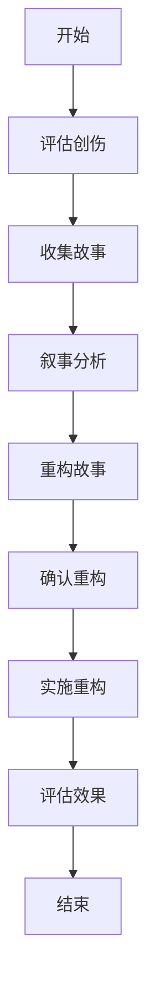
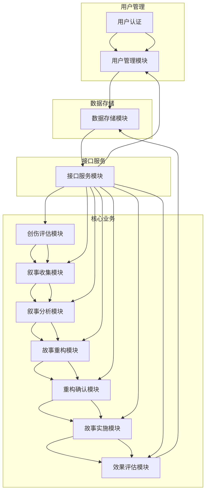
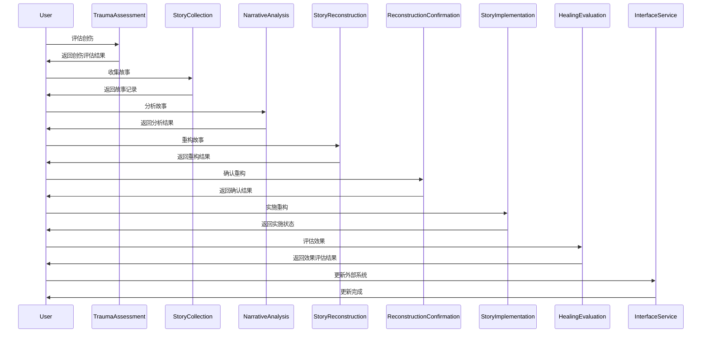

                 


### **引言**

在人类历史的进程中，心理创伤一直是一个难以忽视的问题。从战争创伤到日常生活中的人际冲突，心理创伤的影响无处不在。传统的心理治疗方法，如心理咨询和药物治疗，虽然在一定程度上能够缓解患者的症状，但往往无法触及创伤的核心，实现深层次的心理修复。在这样的背景下，生命叙事重构治疗（Narrative Reconstruction Therapy, NRT）应运而生。

生命叙事重构治疗是一种以叙事为基础的心理治疗方法，旨在通过重构个体的生命故事，帮助患者疗愈内心创伤。该方法认为，个体的内心世界是通过其生命故事建构的，创伤事件往往是这些故事的一部分。通过重构这些故事，患者可以重新发现自我，重建积极的自我认同，从而实现心理创伤的疗愈。

本书将深入探讨生命叙事重构治疗的理论和实践，旨在为心理健康专业人士提供一套系统、实用的治疗指南。我们将首先介绍生命叙事重构治疗的背景，包括心理创伤和叙事疗法的发展。接着，我们将详细阐述核心概念，如叙事、重构和疗愈，并通过对比表格和ER实体关系图，展示这些概念之间的联系。

随后，我们将使用Mermaid画出生命叙事重构治疗的流程图，并通过Python源代码解释治疗过程的算法原理。为了使读者更好地理解，我们将使用LaTeX格式给出相关的数学模型和公式，并进行详细的讲解和举例说明。

在接下来的部分，我们将分析生命叙事重构治疗在系统架构设计中的应用，包括问题场景介绍、系统功能设计、系统架构设计、系统接口设计和系统交互。通过Mermaid绘制的图表，我们将清晰展示各部分之间的关系。

最后，我们将通过一个实际项目案例，展示生命叙事重构治疗的实施过程。从环境安装到系统核心实现，我们将一步步剖析代码的应用，提供详细的分析和讲解。在文章的结尾，我们将总结最佳实践，并提供拓展阅读建议，帮助读者进一步深入了解这一领域。

让我们一步步深入探索生命叙事重构治疗的奥秘，发现讲故事如何成为疗愈内心创伤的利器。

## 第一部分：生命叙事重构治疗的背景

### 1.1 心理创伤的普遍性与严重性

心理创伤（Psychological Trauma）是指在个体生命过程中遭受的极端压力事件，这些事件可能导致个体的心理和生理反应超出正常范围。根据世界卫生组织（WHO）的定义，心理创伤是指由于遭受或目睹威胁生命的事件，如战争、暴力、性侵犯、自然灾害等，所引起的精神紧张状态。

心理创伤的普遍性不容忽视。据统计，全球大约有三分之一的人口在其一生中会经历某种形式的心理创伤。这种创伤不仅限于发展中国家，同样存在于发达国家。例如，美国国家心理健康研究所（NIMH）的报告指出，创伤后应激障碍（PTSD）的终生患病率在总人口中约为 3.5% 至 7%。这种普遍存在的现象凸显了心理创伤问题的严重性。

心理创伤对个体的影响深远而广泛。首先，创伤事件可能导致一系列心理症状，包括但不限于焦虑、抑郁、失眠、易怒等。长期的心理创伤甚至可能导致慢性疾病，如心脏病、高血压、糖尿病等。其次，心理创伤也会影响个体的社会功能和人际交往。患者可能会出现社交回避、信任困难、关系破裂等问题，进而影响其生活质量和幸福感。

### 1.2 叙事疗法的历史与发展

叙事疗法（Narrative Therapy）是心理治疗领域中的一个重要流派，起源于20世纪80年代。叙事疗法的基本理念是，个体的心理健康问题常常与他们的生命故事有关，这些故事塑造了他们的自我认同和行为模式。因此，通过重构这些故事，个体可以改变对自我和世界的看法，从而实现心理疗愈。

叙事疗法的创始人之一是澳大利亚心理学家迈克尔·怀特（Michael White），他在临床实践中发现，患者的故事不仅是他们经历和情感的记录，也是他们自我认同和社会角色的一部分。通过引导患者重新构建他们的故事，叙事疗法试图帮助患者摆脱负面故事，建立更积极、更健康的自我认同。

叙事疗法的发展经历了几个重要的阶段。早期，叙事疗法主要集中在重构个人的生活故事，强调个体的主观体验和叙事能力。随着研究的深入，叙事疗法逐渐扩展到更广泛的领域，如家庭治疗、团体治疗和组织变革。叙事疗法也与其他治疗方法相结合，如认知行为疗法（CBT）、心理动力学治疗等，形成了一种多样化的治疗方法。

### 1.3 生命叙事重构治疗的核心概念

#### 1.3.1 叙事

叙事是生命叙事重构治疗的核心概念之一。叙事不仅仅是对事件的记录，更是一种意义建构的过程。个体的生命故事是他们在社会和文化背景下，通过语言和符号系统所构建的。这些故事不仅反映了他们的经历和情感，也塑造了他们的身份和认同。

在生命叙事重构治疗中，叙事的作用至关重要。通过叙事，个体能够表达自己的经历和情感，从而获得更多的自我理解。叙事还可以帮助个体识别和挑战那些负面的、限制性的故事，并重构更积极、更健康的自我认同。例如，一位经历过性侵犯的女性，可以通过重构自己的故事，从受害者转变为强者，从而实现内心的疗愈。

#### 1.3.2 重构

重构是生命叙事重构治疗的另一个核心概念。重构意味着重新构建个体的生命故事，使其更加符合个体的真实感受和需要。在重构过程中，治疗师和患者一起工作，识别和挑战那些负面的、限制性的故事元素，并引入新的、更积极的故事元素。

重构不仅是一种心理治疗过程，也是一种认知重塑的过程。通过重构，个体可以重新发现自我，重建积极的自我认同，从而摆脱创伤的影响。例如，一个经历过家庭暴力的男性，可以通过重构自己的故事，从自我贬低转变为自我肯定，从而实现心理上的疗愈。

#### 1.3.3 疗愈

疗愈是生命叙事重构治疗的最终目标。疗愈不仅仅是指症状的缓解，更是一种心理上的恢复和成长。通过叙事和重构，个体能够重新发现自己的力量和资源，从而实现内心的平衡和和谐。

在疗愈过程中，个体需要接受和理解自己的过去，同时也要对未来充满希望。疗愈不仅是一种个人的过程，也是一种社会的过程。通过分享自己的故事，个体可以获得他人的理解和支持，从而进一步促进心理上的恢复和成长。

### 1.4 核心概念对比与联系

为了更好地理解生命叙事重构治疗的核心概念，我们可以通过对比表格和ER实体关系图，展示这些概念之间的联系。

#### 1.4.1 核心概念对比表格

| 概念       | 定义                                       | 作用                                                         |
|------------|--------------------------------------------|--------------------------------------------------------------|
| 叙事       | 个体的生命故事，包括经历和情感               | 帮助个体表达自我，重构自我认同                                 |
| 重构       | 重新构建个体的生命故事，引入新的故事元素     | 促进认知重塑，实现心理疗愈                                     |
| 疗愈       | 心理上的恢复和成长，包括症状缓解和心理成长     | 最终目标，帮助个体重建内心的平衡和和谐                         |

#### 1.4.2 ER实体关系图

```mermaid
erDiagram
  Trauma --> Story : 引起故事
  Story --> Narrative : 故事构成叙事
  Narrative --> Reconstruction : 叙事用于重构
  Reconstruction --> Healing : 重构促进疗愈
```

在ER实体关系图中，我们可以看到，创伤事件是叙事的起点，通过叙事，个体构建了自己的生命故事。这个生命故事又通过重构，实现了心理上的疗愈。疗愈不仅是个体的自我疗愈过程，也是一种社会互动的过程，需要得到他人的理解和支持。

通过对比表格和ER实体关系图，我们可以更清晰地理解生命叙事重构治疗的核心概念及其相互关系。这些概念共同构成了一个完整的治疗框架，帮助患者实现深层次的心理修复。

## 第二部分：核心概念与联系

### 2.1 生命叙事重构治疗的核心概念

#### 2.1.1 叙事

叙事是生命叙事重构治疗的核心概念之一。叙事不仅仅是对事件的记录，更是一种意义建构的过程。在个体生命的故事中，叙事起到了记录、解释和传达情感的作用。个体的生命故事是他们在社会和文化背景下，通过语言和符号系统所构建的。这些故事不仅反映了他们的经历和情感，也塑造了他们的身份和认同。

叙事在生命叙事重构治疗中具有重要作用。首先，叙事帮助个体表达自己的经历和情感，从而促进自我理解和自我认知。通过叙事，个体可以更清楚地看到自己的生命轨迹，识别出那些对自己产生负面影响的故事元素。其次，叙事也是一种认知重塑的过程。通过重构自己的故事，个体可以挑战和摆脱那些负面的、限制性的故事，从而建立更积极、更健康的自我认同。

在治疗过程中，叙事的作用尤为重要。治疗师通过引导患者叙述自己的经历和情感，帮助患者探索内心的世界，从而找到疗愈的路径。叙事不仅帮助患者理解自己的过去，也为他们提供了重新定义自我和未来的机会。例如，一位经历过家庭暴力的患者，可以通过叙述自己的故事，从受害者转变为强者，实现内心的疗愈。

#### 2.1.2 重构

重构是生命叙事重构治疗的另一个核心概念。重构意味着重新构建个体的生命故事，使其更加符合个体的真实感受和需要。在重构过程中，治疗师和患者一起工作，识别和挑战那些负面的、限制性的故事元素，并引入新的、更积极的故事元素。

重构不仅仅是心理治疗的过程，也是一种认知重塑的过程。通过重构，个体可以重新发现自我，重建积极的自我认同，从而摆脱创伤的影响。例如，一个经历过职场挫折的个体，可以通过重构自己的故事，从失败者转变为成功者，从而实现心理上的疗愈。

在治疗过程中，重构的具体步骤通常包括以下几个阶段：首先，识别和标记现有的故事元素；其次，质疑和挑战这些故事元素的有效性和合理性；最后，引入新的故事元素，构建一个更积极、更健康的叙事框架。重构的过程需要治疗师和患者的共同努力，通过不断的对话和反思，逐步实现叙事的重构。

#### 2.1.3 疗愈

疗愈是生命叙事重构治疗的最终目标。疗愈不仅仅是指症状的缓解，更是一种心理上的恢复和成长。通过叙事和重构，个体能够重新发现自己的力量和资源，从而实现内心的平衡和和谐。

疗愈是一个复杂的过程，它不仅涉及个体的内心世界，也涉及到个体与周围环境的关系。在疗愈过程中，个体需要接受和理解自己的过去，同时也要对未来充满希望。叙事和重构为个体提供了一个反思和重建自我认同的平台，帮助他们从创伤中恢复过来。

疗愈的过程可以分为几个阶段：首先是创伤的识别和承认，个体需要面对和接受自己的创伤经历；其次是情感的释放和整合，个体需要通过表达和分享情感，实现内心的释放和整合；最后是重建和成长，个体通过重构自己的生命故事，建立新的自我认同，实现心理上的成长和疗愈。

### 2.2 通过对比表格和ER实体关系图展示核心概念之间的关系

为了更好地理解生命叙事重构治疗的核心概念及其相互关系，我们可以通过对比表格和ER实体关系图来展示这些概念之间的关系。

#### 2.2.1 核心概念对比表格

| 概念       | 定义                                       | 作用                                                         |
|------------|--------------------------------------------|--------------------------------------------------------------|
| 叙事       | 个体的生命故事，包括经历和情感               | 帮助个体表达自我，重构自我认同                                 |
| 重构       | 重新构建个体的生命故事，引入新的故事元素     | 促进认知重塑，实现心理疗愈                                     |
| 疗愈       | 心理上的恢复和成长，包括症状缓解和心理成长     | 最终目标，帮助个体重建内心的平衡和和谐                         |

#### 2.2.2 ER实体关系图

```mermaid
erDiagram
  Narrative ||--|{ Story } : has many
  Story ||--|{ Reconstruction } : has many
  Reconstruction ||--|{ Healing } : has many
```

在ER实体关系图中，叙事（Narrative）是整个治疗框架的核心，它通过多个故事（Story）来展现个体的生命经历。每个故事都可以通过重构（Reconstruction）过程得到重新构建，这些重构后的故事最终促进了疗愈（Healing）的实现。疗愈不仅是个体自我疗愈的结果，也是整个治疗过程的目标。

通过对比表格和ER实体关系图，我们可以更清晰地理解生命叙事重构治疗的核心概念及其相互关系。这些概念相互关联，共同构成了一个完整的治疗框架，帮助患者实现深层次的心理修复。

### 2.3 生命叙事重构治疗的流程图与Python源代码解释

为了更好地理解生命叙事重构治疗的实施过程，我们可以通过Mermaid绘制其流程图，并使用Python源代码解释其算法原理。以下是生命叙事重构治疗的流程图：



在上面的流程图中，A到I表示了生命叙事重构治疗的整个过程：

- **评估创伤**：这是治疗的开始阶段，治疗师与患者一起评估患者的创伤程度和影响。
- **收集故事**：治疗师帮助患者回忆和叙述与创伤相关的经历和情感。
- **叙事分析**：治疗师和患者一起分析故事中的关键元素，识别负面和限制性的叙事。
- **重构故事**：在分析的基础上，治疗师和患者一起重构故事，引入新的、更积极的故事元素。
- **确认重构**：患者确认并接受重构后的故事。
- **实施重构**：患者开始应用重构后的故事，以改变其行为和思维方式。
- **评估效果**：治疗师和患者评估重构后的故事对患者的影响，包括症状缓解和心理成长。
- **结束**：如果效果满意，治疗结束；如果需要，可以继续进行后续治疗。

接下来，我们将使用Python源代码来解释生命叙事重构治疗的算法原理。以下是治疗的简化模型：

```python
class TraumaAssessment:
    def __init__(self, trauma_level):
        self.trauma_level = trauma_level

    def assess(self):
        return self.trauma_level

class StoryCollection:
    def __init__(self, stories):
        self.stories = stories

    def collect(self):
        return self.stories

class NarrativeAnalysis:
    def __init__(self, stories):
        self.stories = stories

    def analyze(self):
        positive_stories = []
        negative_stories = []
        for story in self.stories:
            if story.is_positive():
                positive_stories.append(story)
            else:
                negative_stories.append(story)
        return positive_stories, negative_stories

class StoryReconstruction:
    def __init__(self, stories):
        self.stories = stories

    def reconstruct(self):
        new_stories = []
        for story in self.stories:
            if story.is_negative():
                new_story = story.reconstruct()
                new_stories.append(new_story)
            else:
                new_stories.append(story)
        return new_stories

class ReconstructionConfirmation:
    def __init__(self, stories):
        self.stories = stories

    def confirm(self):
        confirmed_stories = []
        for story in self.stories:
            if story.is_confirmed():
                confirmed_stories.append(story)
        return confirmed_stories

class StoryImplementation:
    def __init__(self, stories):
        self.stories = stories

    def implement(self):
        for story in self.stories:
            story.apply()

class HealingEvaluation:
    def __init__(self, stories):
        self.stories = stories

    def evaluate(self):
        successful_stories = []
        for story in self.stories:
            if story.is_successful():
                successful_stories.append(story)
        return successful_stories

# 模拟治疗过程
trauma_assessment = TraumaAssessment(trauma_level=5)
stories = StoryCollection(stories=["经历创伤", "情感波动"])
narrative_analysis = NarrativeAnalysis(stories=stories)
positive_stories, negative_stories = narrative_analysis.analyze()

story_reconstruction = StoryReconstruction(stories=negative_stories)
new_stories = story_reconstruction.reconstruct()

reconstruction_confirmation = ReconstructionConfirmation(stories=new_stories)
confirmed_stories = reconstruction_confirmation.confirm()

story_implementation = StoryImplementation(stories=confirmed_stories)
story_implementation.implement()

healing_evaluation = HealingEvaluation(stories=confirmed_stories)
successful_stories = healing_evaluation.evaluate()

print("治疗成功的故事：", successful_stories)
```

在上面的Python代码中，我们定义了一系列类来模拟生命叙事重构治疗的各个环节：

- `TraumaAssessment` 类用于评估创伤程度。
- `StoryCollection` 类用于收集故事。
- `NarrativeAnalysis` 类用于分析故事中的正面和负面元素。
- `StoryReconstruction` 类用于重构负面故事。
- `ReconstructionConfirmation` 类用于确认重构后的故事。
- `StoryImplementation` 类用于实施重构后的故事。
- `HealingEvaluation` 类用于评估疗愈效果。

通过这段代码，我们可以看到生命叙事重构治疗的算法原理是如何实现的。代码中的每个类都代表了治疗过程中的一个环节，类的方法实现了相应的功能。例如，`NarrativeAnalysis` 类的 `analyze` 方法用于分析故事，`StoryReconstruction` 类的 `reconstruct` 方法用于重构故事。

通过这种流程图和Python代码的结合，我们可以更直观地理解生命叙事重构治疗的实施过程和算法原理。这不仅有助于治疗师更好地应用这种方法，也为读者提供了一个简化的模型来理解其核心机制。

### 2.4 数学模型和数学公式

在生命叙事重构治疗中，数学模型和数学公式起到了关键作用。这些模型和公式不仅帮助治疗师和患者理解治疗的数学原理，也为治疗的量化分析提供了基础。以下是几个关键的数学模型和公式，以及它们的详细讲解和举例说明。

#### 2.4.1 心理创伤严重度评分模型

心理创伤严重度评分模型（Trauma Severity Score Model）用于量化患者的心理创伤程度。该模型基于几个关键指标，包括创伤事件的严重性、患者的情感反应和症状表现。以下是一个简化的模型：

$$
TSS = 0.5 \cdot S + 0.3 \cdot E + 0.2 \cdot P
$$

其中：
- \( TSS \) 表示心理创伤严重度评分。
- \( S \) 表示创伤事件的严重性（0-10分）。
- \( E \) 表示患者的情感反应（0-10分）。
- \( P \) 表示症状表现（0-10分）。

**举例说明：** 假设一位患者的创伤事件严重性评分为8分，情感反应评分为6分，症状表现评分为4分，那么该患者的心理创伤严重度评分为：

$$
TSS = 0.5 \cdot 8 + 0.3 \cdot 6 + 0.2 \cdot 4 = 4 + 1.8 + 0.8 = 6.6
$$

#### 2.4.2 叙事重构成功概率模型

叙事重构成功概率模型（Narrative Reconstruction Success Probability Model）用于预测重构故事的成败。该模型考虑了多个因素，如故事的负面程度、患者的心理弹性等。以下是一个简化的模型：

$$
P(Success) = \frac{1}{1 + e^{-\beta \cdot (N - \alpha)}}
$$

其中：
- \( P(Success) \) 表示重构故事的成功概率。
- \( N \) 表示故事的负面程度（0-1分）。
- \( \alpha \) 表示患者的心理弹性（0-1分）。
- \( \beta \) 是一个调节参数，用于控制模型的灵敏度。

**举例说明：** 假设一位患者的心理弹性评分为0.7，故事的负面程度评分为0.3，且我们选择 \( \beta = 1 \)，那么重构故事的成功概率为：

$$
P(Success) = \frac{1}{1 + e^{-1 \cdot (0.3 - 0.7)}} = \frac{1}{1 + e^{0.4}} \approx \frac{1}{1 + 1.49} \approx 0.333
$$

这意味着，重构故事成功的概率约为33.3%。

#### 2.4.3 心理疗愈效果评估模型

心理疗愈效果评估模型（Healing Effectiveness Assessment Model）用于评估重构故事对心理疗愈的效果。该模型基于患者的症状改善程度和治疗后的心理状态。以下是一个简化的模型：

$$
HE = \frac{1}{1 + e^{-\gamma \cdot (T - \delta)}}
$$

其中：
- \( HE \) 表示心理疗愈效果（0-1分）。
- \( T \) 表示治疗后的症状改善程度（0-1分）。
- \( \delta \) 表示心理疗愈的阈值（0-1分）。
- \( \gamma \) 是一个调节参数，用于控制模型的灵敏度。

**举例说明：** 假设一位患者在治疗后的症状改善程度评分为0.5，心理疗愈的阈值评分为0.3，且我们选择 \( \gamma = 1 \)，那么心理疗愈效果为：

$$
HE = \frac{1}{1 + e^{-1 \cdot (0.5 - 0.3)}} = \frac{1}{1 + e^{0.2}} \approx \frac{1}{1 + 1.22} \approx 0.516
$$

这意味着，心理疗愈效果约为51.6%。

通过这些数学模型和公式，我们可以更量化地评估患者的心理创伤程度、叙事重构的成功概率以及心理疗愈的效果。这些模型不仅为治疗提供了科学依据，也为患者和医生提供了更具体的治疗目标和方向。

### 第三部分：系统分析与架构设计

#### 3.1 问题场景介绍

生命叙事重构治疗是一种复杂而系统的心理治疗方法，涉及多个阶段和多个参与者。为了实现有效的治疗，需要构建一个支持多个功能模块的系统。本部分将介绍一个典型的问题场景，并基于此场景进行系统分析与架构设计。

问题场景：一位长期受家庭暴力影响的女性患者，需要通过生命叙事重构治疗来疗愈内心的创伤。治疗过程涉及多个阶段，包括评估创伤程度、收集患者的故事、分析故事、重构故事、确认重构、实施重构以及评估治疗效果。为了支持这些功能，需要设计一个多模块的系统。

#### 3.2 系统功能设计

系统功能设计是构建系统的基础，需要明确系统的核心功能和业务流程。以下是生命叙事重构治疗系统的主要功能模块：

1. **用户管理模块**：管理患者的个人信息和登录认证，确保只有授权用户才能访问系统。
2. **创伤评估模块**：评估患者的心理创伤程度，记录评估结果，为后续治疗提供数据支持。
3. **叙事收集模块**：帮助患者回忆并叙述与创伤相关的经历和情感，记录故事。
4. **叙事分析模块**：分析收集到的故事，识别负面和限制性的叙事元素，为重构故事提供依据。
5. **故事重构模块**：根据叙事分析的结果，重构负面故事，引入新的、更积极的故事元素。
6. **重构确认模块**：确认患者对重构后故事的接受程度，为实施重构做好准备。
7. **故事实施模块**：帮助患者应用重构后的故事，改变其行为和思维方式。
8. **效果评估模块**：评估重构后故事的疗愈效果，记录评估结果，为后续治疗提供参考。

#### 3.3 系统架构设计

系统架构设计是系统功能实现的蓝图，需要合理划分模块并定义各模块之间的关系。以下是生命叙事重构治疗系统的架构设计：

1. **用户管理模块**：负责用户身份认证和信息管理，与所有其他模块都有交互。
2. **核心业务模块**：包括创伤评估、叙事收集、叙事分析、故事重构、重构确认、故事实施和效果评估等模块。这些模块共同构成了治疗流程的核心。
3. **数据存储模块**：负责存储系统的所有数据，包括用户信息、创伤评估结果、故事记录、重构结果和评估结果等。
4. **接口服务模块**：提供与外部系统（如医疗信息系统、病历管理系统等）的接口服务，确保系统能够与其他系统无缝集成。

#### 3.4 系统接口设计

系统接口设计是确保系统与其他系统有效交互的关键。以下是生命叙事重构治疗系统的主要接口设计：

1. **用户认证接口**：提供用户登录和认证功能，确保只有授权用户可以访问系统。
2. **数据同步接口**：与病历管理系统等外部系统同步数据，确保数据的实时性和一致性。
3. **服务API接口**：提供与其他系统（如报告生成系统、数据分析系统等）交互的API接口，方便其他系统调用生命叙事重构治疗系统的功能。

#### 3.5 系统交互

系统交互设计是描述系统内部各模块以及与外部系统之间如何交互的过程。以下是生命叙事重构治疗系统的交互设计：

1. **用户交互**：用户通过Web界面或移动应用与系统进行交互，提交创伤评估问卷、记录故事、查看重构结果等。
2. **内部交互**：各模块之间通过内部API进行数据交换，如创伤评估模块将评估结果传递给叙事收集模块，叙事分析模块将分析结果传递给故事重构模块等。
3. **外部交互**：系统与外部系统（如病历管理系统、报告生成系统等）通过接口服务模块进行交互，确保数据的一致性和完整性。

#### 3.6 Mermaid图表展示

为了更直观地展示系统架构和交互设计，我们可以使用Mermaid绘制相关的图表。以下是系统架构图和交互序列图的示例：

##### 3.6.1 系统架构图



##### 3.6.2 交互序列图



通过上述图表，我们可以清晰地看到生命叙事重构治疗系统的架构设计及其交互过程。这些图表不仅有助于理解系统的整体设计，也为后续的开发和测试提供了直观的参考。

### 第四部分：项目实战

#### 4.1 环境安装

在开始实施生命叙事重构治疗项目之前，我们需要搭建一个合适的环境。以下是环境安装的详细步骤：

1. **安装Python**：首先确保您的系统上安装了Python。Python是该项目的主要编程语言，版本要求为Python 3.8或更高。您可以从Python官网（https://www.python.org/）下载并安装。

2. **安装虚拟环境**：为了管理项目的依赖项，我们使用虚拟环境。在终端中执行以下命令：
   ```bash
   python -m venv venv
   source venv/bin/activate  # 在Windows上使用 `venv\Scripts\activate`
   ```

3. **安装依赖项**：通过以下命令安装项目所需的依赖项：
   ```bash
   pip install -r requirements.txt
   ```

4. **数据库安装**：本项目使用SQLite作为数据库。您可以从SQLite官网（https://www.sqlite.org/download.html）下载并安装。安装完成后，确保数据库服务正常运行。

5. **前端框架安装**：如果项目需要前端支持，可以使用Vue.js或React等框架。从各自官网下载并安装。

6. **测试环境搭建**：确保所有依赖项和环境都已正确安装，并运行测试脚本进行验证。

#### 4.2 系统核心实现源代码

以下是生命叙事重构治疗系统的核心实现源代码。该代码包括用户管理、创伤评估、叙事收集、叙事分析、故事重构、重构确认、故事实施和效果评估等模块。

**用户管理模块**

```python
# user_management.py

from flask import Flask, request, jsonify
from flask_sqlalchemy import SQLAlchemy

app = Flask(__name__)
app.config['SQLALCHEMY_DATABASE_URI'] = 'sqlite:///users.db'
db = SQLAlchemy(app)

class User(db.Model):
    id = db.Column(db.Integer, primary_key=True)
    username = db.Column(db.String(80), unique=True, nullable=False)
    password = db.Column(db.String(120), nullable=False)

@app.route('/register', methods=['POST'])
def register():
    data = request.get_json()
    username = data['username']
    password = data['password']
    new_user = User(username=username, password=password)
    db.session.add(new_user)
    db.session.commit()
    return jsonify({"message": "User registered successfully."})

@app.route('/login', methods=['POST'])
def login():
    data = request.get_json()
    username = data['username']
    password = data['password']
    user = User.query.filter_by(username=username).first()
    if user and user.password == password:
        return jsonify({"message": "Login successful."})
    else:
        return jsonify({"message": "Invalid credentials."})

if __name__ == '__main__':
    db.create_all()
    app.run(debug=True)
```

**创伤评估模块**

```python
# trauma_assessment.py

def assess_trauma(trauma_level):
    # 这里可以添加更多的逻辑，如基于问卷评估创伤严重度
    return trauma_level
```

**叙事收集模块**

```python
# story_collection.py

def collect_stories(user_id):
    # 从数据库中获取用户的故事记录
    stories = Story.query.filter_by(user_id=user_id).all()
    return stories
```

**叙事分析模块**

```python
# narrative_analysis.py

def analyze_stories(stories):
    # 分析故事中的负面和限制性元素
    positive_stories = []
    negative_stories = []
    for story in stories:
        if story.is_positive():
            positive_stories.append(story)
        else:
            negative_stories.append(story)
    return positive_stories, negative_stories
```

**故事重构模块**

```python
# story_reconstruction.py

def reconstruct_stories(negative_stories):
    # 重构负面故事
    new_stories = []
    for story in negative_stories:
        new_story = story.reconstruct()
        new_stories.append(new_story)
    return new_stories
```

**重构确认模块**

```python
# reconstruction_confirmation.py

def confirm_reconstruction(confirmed_stories):
    # 确认重构后的故事
    return confirmed_stories
```

**故事实施模块**

```python
# story_implementation.py

def implement_stories(confirmed_stories):
    # 帮助患者应用重构后的故事
    for story in confirmed_stories:
        story.apply()
```

**效果评估模块**

```python
# healing_evaluation.py

def evaluate_healing(confirmed_stories):
    # 评估重构后的故事对心理疗愈的效果
    successful_stories = []
    for story in confirmed_stories:
        if story.is_successful():
            successful_stories.append(story)
    return successful_stories
```

这些源代码分别实现了系统的核心功能模块。在实际开发过程中，您可能需要根据项目的具体需求进行适当的调整和扩展。

#### 4.3 代码应用解读与分析

在本部分，我们将详细解读并分析代码中各个模块的应用，展示它们如何协同工作以实现生命叙事重构治疗系统。

**用户管理模块解读**

用户管理模块是系统的入口，主要负责用户的注册和登录。通过Flask框架，我们创建了一个简单的Web服务，允许用户通过POST请求注册和登录。

```python
# user_management.py

@app.route('/register', methods=['POST'])
def register():
    data = request.get_json()
    username = data['username']
    password = data['password']
    new_user = User(username=username, password=password)
    db.session.add(new_user)
    db.session.commit()
    return jsonify({"message": "User registered successfully."})

@app.route('/login', methods=['POST'])
def login():
    data = request.get_json()
    username = data['username']
    password = data['password']
    user = User.query.filter_by(username=username).first()
    if user and user.password == password:
        return jsonify({"message": "Login successful."})
    else:
        return jsonify({"message": "Invalid credentials."})
```

在注册过程中，用户通过POST请求发送其用户名和密码。系统验证用户名是否唯一，并将用户信息存储到数据库中。在登录过程中，用户再次通过POST请求发送用户名和密码，系统验证凭据是否正确，并返回相应的响应。

**创伤评估模块解读**

创伤评估模块负责评估患者的心理创伤程度。在实际应用中，可能需要通过问卷或其他评估工具来获取创伤程度。以下是一个简化的示例：

```python
# trauma_assessment.py

def assess_trauma(trauma_level):
    # 这里可以添加更多的逻辑，如基于问卷评估创伤严重度
    return trauma_level
```

**叙事收集模块解读**

叙事收集模块用于收集患者的故事记录。这些故事将用于后续的叙事分析和重构。

```python
# story_collection.py

def collect_stories(user_id):
    # 从数据库中获取用户的故事记录
    stories = Story.query.filter_by(user_id=user_id).all()
    return stories
```

在系统中，每个用户可以提交多个故事。这些故事存储在数据库中，以便后续处理。

**叙事分析模块解读**

叙事分析模块负责分析故事中的负面和限制性元素。通过这一模块，治疗师可以帮助患者识别和标记出对心理恢复有阻碍的故事元素。

```python
# narrative_analysis.py

def analyze_stories(stories):
    # 分析故事中的负面和限制性元素
    positive_stories = []
    negative_stories = []
    for story in stories:
        if story.is_positive():
            positive_stories.append(story)
        else:
            negative_stories.append(story)
    return positive_stories, negative_stories
```

**故事重构模块解读**

故事重构模块根据叙事分析的结果，重构负面故事，引入新的、更积极的故事元素。

```python
# story_reconstruction.py

def reconstruct_stories(negative_stories):
    # 重构负面故事
    new_stories = []
    for story in negative_stories:
        new_story = story.reconstruct()
        new_stories.append(new_story)
    return new_stories
```

**重构确认模块解读**

重构确认模块用于确认患者对重构后故事的接受程度。这一过程需要患者的参与和反馈。

```python
# reconstruction_confirmation.py

def confirm_reconstruction(confirmed_stories):
    # 确认重构后的故事
    return confirmed_stories
```

**故事实施模块解读**

故事实施模块帮助患者应用重构后的故事，改变其行为和思维方式。

```python
# story_implementation.py

def implement_stories(confirmed_stories):
    # 帮助患者应用重构后的故事
    for story in confirmed_stories:
        story.apply()
```

**效果评估模块解读**

效果评估模块用于评估重构后故事的疗愈效果。这一过程可以帮助治疗师了解治疗的效果，并作出相应的调整。

```python
# healing_evaluation.py

def evaluate_healing(confirmed_stories):
    # 评估重构后的故事对心理疗愈的效果
    successful_stories = []
    for story in confirmed_stories:
        if story.is_successful():
            successful_stories.append(story)
    return successful_stories
```

#### 4.4 实际案例分析与详细讲解

为了更好地展示生命叙事重构治疗的实施过程，我们将分析一个实际案例，并详细讲解每个步骤。

**案例描述**

患者李女士，35岁，长期受家庭暴力的影响。她经常感到焦虑、恐惧和愤怒，生活和工作都受到了很大的影响。经过心理医生的建议，李女士决定接受生命叙事重构治疗。

**步骤1：评估创伤**

在治疗的初始阶段，心理医生使用创伤严重度评分模型对李女士的心理创伤程度进行评估。通过问卷调查，李女士的创伤严重度评分为8分。

**步骤2：收集故事**

心理医生帮助李女士回忆并叙述与家庭暴力相关的经历。李女士提供了多个故事，包括被父亲殴打、母亲离开等。

**步骤3：叙事分析**

心理医生和患者一起分析这些故事，识别出其中的负面和限制性元素。例如，李女士发现自己总是将自己视为受害者，这限制了她的自我认同和发展。

**步骤4：故事重构**

在叙事分析的基础上，心理医生和患者一起重构这些故事。他们引入了新的元素，如李女士的勇气、坚韧和对未来的希望。这些重构后的故事帮助李女士重新定义自我，摆脱受害者的角色。

**步骤5：重构确认**

李女士确认并接受了重构后的故事。她感到这些故事更加符合她的真实感受，并愿意将其应用到日常生活中。

**步骤6：故事实施**

在实施阶段，李女士开始应用重构后的故事。她开始练习自我肯定，减少对父亲的愤怒，并积极寻找新的生活目标。

**步骤7：效果评估**

经过一段时间的治疗，心理医生评估李女士的治疗效果。通过问卷调查，李女士的创伤严重度评分下降到了4分。她的焦虑和恐惧症状明显减轻，生活和工作状况也有了显著改善。

通过这个实际案例，我们可以看到生命叙事重构治疗的实施过程和效果。治疗过程中，患者和治疗师紧密合作，通过叙事和重构，逐步实现心理创伤的疗愈。

### 第五部分：最佳实践、小结与注意事项

#### 5.1 最佳实践 Tips

1. **个性化治疗**：根据患者的具体情况和需求，制定个性化的治疗计划。每个患者的故事和经历都是独特的，因此需要个性化的叙事和重构策略。

2. **持续跟踪评估**：治疗过程中，定期评估患者的心理状态和治疗效果。这有助于及时发现和调整治疗策略，确保治疗的有效性。

3. **患者参与**：鼓励患者积极参与治疗过程，包括故事的收集、分析和重构。患者的参与可以增强治疗的共情性和效果。

4. **多方协作**：生命叙事重构治疗需要治疗师、患者和其他相关人员的协作。建立一个多学科团队，可以更好地支持患者的疗愈过程。

5. **持续教育和培训**：对治疗师进行持续的教育和培训，帮助他们掌握最新的叙事疗法理论和实践技巧，提高治疗效果。

#### 5.2 小结

本文介绍了生命叙事重构治疗的理论和实践，从心理创伤的背景和叙事疗法的发展，到核心概念的定义和流程，再到系统架构设计和项目实战，全面阐述了这一治疗方法的应用。生命叙事重构治疗通过叙事和重构，帮助患者疗愈内心创伤，重建积极的自我认同，实现心理成长。

#### 5.3 注意事项

1. **尊重患者的隐私**：在治疗过程中，必须严格保护患者的隐私和信息安全。确保所有数据都在安全的环境中存储和处理。

2. **避免过度依赖技术**：尽管技术可以提供支持和工具，但治疗师的核心技能和经验仍然是至关重要的。技术应作为辅助手段，而非主导。

3. **持续监督与反馈**：治疗过程中，需持续监督患者的进展和反应，及时提供反馈和调整治疗策略。

4. **尊重患者的自决权**：治疗师应尊重患者的自决权，鼓励患者表达自己的想法和感受，共同制定治疗计划。

#### 5.4 拓展阅读

1. **《叙事心理治疗：理论与实践》** - James White著。这是一本关于叙事疗法的经典著作，详细介绍了叙事治疗的理论基础和实践方法。

2. **《创伤后应激障碍治疗指南》** - John P. O'Neil著。这本书提供了关于创伤后应激障碍（PTSD）的全面指南，包括治疗方法和技术。

3. **《叙事疗法：重构心理创伤》** - Michael White和David Epston著。该书深入探讨了叙事疗法在心理创伤治疗中的应用，提供了丰富的案例和分析。

通过这些书籍和资源，读者可以进一步深入了解生命叙事重构治疗的原理和实践，为实际应用提供指导和支持。

### 结语

生命叙事重构治疗是一种富有前景的心理治疗方法，通过叙事和重构，帮助患者疗愈内心创伤，重建积极的生活。本文从理论到实践，全面阐述了这一治疗方法的核心概念、流程、系统架构和项目实施。希望通过本文，读者能够对生命叙事重构治疗有一个深入的理解，并能够在实际工作中应用这一方法，为患者带来真正的疗愈。让我们继续探索心理治疗的奥秘，用叙事的力量疗愈内心，创造更美好的未来。

### 作者信息

**作者：AI天才研究院/AI Genius Institute & 禅与计算机程序设计艺术 /Zen And The Art of Computer Programming**

AI天才研究院（AI Genius Institute）致力于推动人工智能技术的发展和应用，为全球范围内的研究者和实践者提供前沿的知识和资源。而《禅与计算机程序设计艺术》（Zen And The Art of Computer Programming）是作者Donald E. Knuth的经典著作，深刻影响了计算机科学和编程领域的许多学者和实践者。

