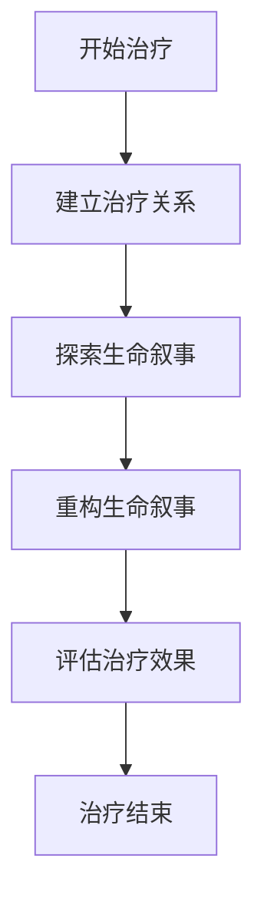

                 


## 文章标题：生命叙事重构治疗：通过讲故事疗愈内心创伤的心理咨询

### 关键词：叙事重构治疗、心理创伤、心理咨询、情感疗愈、生命叙事

### 摘要：
本文探讨了叙事重构治疗在心理咨询中的应用，通过对心理创伤的理解、生命叙事的概念阐述，以及叙事重构治疗的原理、方法、实践和应用进行分析，为心理咨询师提供了科学有效的治疗策略，旨在通过讲故事的方式疗愈内心创伤。

## 第一部分：引言

### 1.1 问题背景

#### 1.1.1 心理创伤的定义与影响
心理创伤是指个体在遭受极端压力或创伤性事件后，产生的心理和生理反应。这些反应可能包括强烈的恐惧、焦虑、愤怒、悲伤或绝望感。心理创伤的影响深远，可能对个体的情感、认知和行为产生长期的影响，甚至可能导致精神障碍，如创伤后应激障碍（PTSD）。

#### 1.1.2 生命叙事的概念与作用
生命叙事是指个体对其生命经历的故事化表达。它不仅仅是记忆的记录，更是一种对生命的理解和对自我的探索。通过生命叙事，个体可以重新审视自己的经历，寻找情感认同，理解自己的行为模式，并在心理层面上实现自我疗愈。

#### 1.1.3 叙事重构治疗的理论基础
叙事重构治疗是一种通过重塑生命叙事来治疗心理创伤的方法。该方法认为，个体的心理创伤往往源于对事件的错误理解或负面叙事。通过引导个体重新构建生命叙事，帮助个体从新的视角看待事件，从而减轻心理创伤的影响。

### 1.2 研究意义

#### 1.2.1 心理健康的重要性
心理健康是整体健康的重要组成部分。心理创伤的长期影响可能导致严重的心理问题，影响个体的生活质量。因此，研究和实践有效的心理创伤治疗策略具有重要的社会意义。

#### 1.2.2 叙事重构治疗的现状与前景
叙事重构治疗作为一种新兴的治疗方法，已在心理创伤治疗中展现出显著的效果。随着对其研究的深入，叙事重构治疗有望在未来的心理咨询中发挥更大的作用。

#### 1.2.3 对心理咨询行业的潜在影响
叙事重构治疗为心理咨询师提供了一种新的治疗视角和工具。通过理解和掌握叙事重构治疗的方法，心理咨询师可以更好地帮助患者处理心理创伤，提高治疗效果。

### 1.3 本书结构

#### 1.3.1 内容安排
本书分为四个部分，分别从理论、实践、应用和未来展望四个方面对叙事重构治疗进行深入探讨。

#### 1.3.2 每章节的目标
每个章节都有明确的目标，旨在帮助读者系统地了解叙事重构治疗的原理、方法、实践和应用。

----------------------------------------------------------------

### 第二部分：叙事重构治疗理论基础

#### 2.1 心理创伤理论

##### 2.1.1 心理创伤的定义与分类
心理创伤是指个体在遭受极端压力或创伤性事件后，产生的心理和生理反应。这些事件可能包括战争、暴力、自然灾害、性侵犯、亲人去世等。心理创伤的分类包括急性应激障碍（ACST）、创伤后应激障碍（PTSD）、复杂创伤后应激障碍（CPTSD）等。

##### 2.1.2 心理创伤的表现与影响
心理创伤的表现形式多样，可能包括失眠、 nightmares、焦虑、抑郁、恐惧、愤怒、自我怀疑等。这些症状可能对个体的日常生活、工作和人际关系产生严重影响。

##### 2.1.3 心理创伤的治疗方法
心理创伤的治疗方法包括药物治疗、心理治疗和认知行为疗法等。药物治疗主要用于缓解症状，心理治疗和认知行为疗法则旨在帮助个体理解自己的情绪和行为，并学会应对创伤。

#### 2.2 叙事理论

##### 2.2.1 叙事理论的起源与发展
叙事理论起源于20世纪60年代的文学研究领域，随后逐渐扩展到心理学、社会学和人类学等领域。叙事理论的代表人物包括米歇尔·福柯、詹姆斯·费尔斯和朱迪思·巴特勒等。

##### 2.2.2 叙事在心理学中的应用
叙事在心理学中的应用主要包括自我认识、情感调节、心理治疗等。通过叙事，个体可以更好地理解自己的经历，找到情感认同，并在心理层面上实现自我疗愈。

##### 2.2.3 叙事与个体认同的关系
叙事与个体认同密切相关。个体的生命叙事构成了其身份认同的基础，而通过叙事重构，个体可以重新审视自己的经历，重塑自我认同。

#### 2.3 叙事重构治疗

##### 2.3.1 叙事重构治疗的基本原则
叙事重构治疗的基本原则包括尊重个体的主观体验、鼓励个体的自我探索、促进个体的叙事重构等。

##### 2.3.2 叙事重构治疗的流程与方法
叙事重构治疗的流程通常包括建立治疗关系、探索生命叙事、重构生命叙事和评估治疗效果等步骤。治疗方法包括开放式访谈、叙事重构练习、艺术疗法等。

##### 2.3.3 叙事重构治疗的案例分析
通过具体案例，我们可以看到叙事重构治疗在实际应用中的效果。案例研究表明，叙事重构治疗有助于减轻患者的心理创伤，提高生活质量。

#### 2.4 心理咨询技术

##### 2.4.1 建立治疗关系
建立良好的治疗关系是叙事重构治疗成功的关键。治疗师需要尊重患者的感受，建立信任，并确保患者感到安全和被理解。

##### 2.4.2 探索生命叙事
探索生命叙事是叙事重构治疗的核心步骤。治疗师需要通过开放式问题引导患者回忆和讲述自己的经历，从而深入了解患者的心理创伤。

##### 2.4.3 叙事重构的策略
叙事重构的策略包括重构事件的意义、重新解释事件的影响、调整个体的自我形象等。通过这些策略，治疗师可以帮助患者从新的视角看待自己的经历，减轻心理创伤的影响。

----------------------------------------------------------------

### 第三部分：生命叙事重构治疗的实践与应用

#### 3.1 治疗环境设置

##### 3.1.1 治疗空间的布置
治疗空间的布置应考虑舒适性和私密性。治疗室应保持整洁、安静，并配备必要的设备和工具，如沙发、桌子、椅子、画板等。

##### 3.1.2 治疗时间的安排
治疗时间应根据患者的具体情况灵活安排。通常，每周一次的治疗持续时间为60-90分钟。治疗时间应保持规律，以确保治疗过程的连续性。

##### 3.1.3 治疗师的准备工作
治疗师在每次治疗之前应进行充分的准备工作，包括复习患者的病历、准备治疗话题、设定治疗目标等。

#### 3.2 治疗案例分享

##### 3.2.1 案例一：童年创伤的叙事重构
案例一涉及一名患有童年创伤的成年人。通过叙事重构治疗，患者逐渐理解了自己的情绪和行为模式，并找到了情感认同。治疗过程包括探索童年经历、重构创伤事件、调整自我形象等步骤。

##### 3.2.2 案例二：婚姻危机的叙事重构
案例二涉及一对面临婚姻危机的夫妻。治疗师通过引导夫妻共同探索婚姻中的冲突和误解，帮助双方重构生命叙事，重建婚姻关系。

##### 3.2.3 案例三：职业困境的叙事重构
案例三涉及一名职业受挫的个体。通过叙事重构治疗，患者重新审视自己的职业生涯，找到了新的职业方向和动力。

#### 3.3 治疗效果评估

##### 3.3.1 评估标准与工具
治疗效果评估的标准包括症状缓解程度、生活质量改善程度、自我认同的提升程度等。常用的评估工具包括症状评估量表、生活质量量表、自我认同量表等。

##### 3.3.2 治疗效果的跟踪与反馈
治疗师应定期跟踪治疗效果，并通过反馈与患者共同讨论治疗进展和效果。这有助于调整治疗方案，提高治疗效果。

##### 3.3.3 治疗效果的分析与讨论
治疗效果分析应考虑患者的个体差异、治疗过程、治疗环境等因素。通过分析与讨论，治疗师可以更好地理解治疗效果，并为后续治疗提供参考。

#### 3.4 实践中的挑战与应对

##### 3.4.1 患者抗拒与误解的处理
患者抗拒和误解是治疗过程中常见的挑战。治疗师应通过建立信任关系、提高患者的参与度、解释治疗原理等方式应对这些问题。

##### 3.4.2 治疗师的角色冲突与压力
治疗师在治疗过程中可能会面临角色冲突和压力。通过自我反思、专业培训和支持，治疗师可以更好地应对这些挑战。

##### 3.4.3 治疗过程中的伦理问题
治疗过程中，治疗师应遵循伦理原则，包括保密、尊重患者的自主权、避免利益冲突等。任何伦理问题都应得到及时处理和解决。

----------------------------------------------------------------

### 第四部分：生命叙事重构治疗的未来展望

#### 4.1 技术与创新的融合

##### 4.1.1 数字技术在叙事重构治疗中的应用
随着数字技术的不断发展，叙事重构治疗有望与数字技术相结合，如虚拟现实（VR）、人工智能（AI）、远程治疗等。这些技术可以提供更个性化的治疗体验，提高治疗效果。

##### 4.1.2 跨学科研究的趋势与挑战
叙事重构治疗的未来发展将依赖于跨学科研究的深入。心理学、社会学、医学、信息技术等领域的合作将有助于推动叙事重构治疗的创新和发展。

##### 4.1.3 新技术的伦理与法律问题
新技术的应用也带来了伦理和法律问题。治疗师和研究人员应关注这些问题的解决，以确保叙事重构治疗的合法性和伦理性。

#### 4.2 发展方向

##### 4.2.1 治疗方法的多样化
未来的叙事重构治疗将更加多样化，包括艺术疗法、游戏疗法、叙事诗歌疗法等。这些方法的结合将提供更全面的治疗体验。

##### 4.2.2 治疗效果的长期跟踪
未来的研究将重点关注叙事重构治疗的长期效果，以评估其可持续性和效果。

##### 4.2.3 治疗师的专业成长
治疗师的专业成长是叙事重构治疗未来发展的重要方向。通过专业培训和持续学习，治疗师可以更好地为患者提供高质量的服务。

#### 4.3 社会意义

##### 4.3.1 对心理健康服务的推广
叙事重构治疗为心理健康服务提供了新的工具和方法。推广这一治疗方法有助于提高公众对心理健康问题的认识，促进心理健康服务的普及。

##### 4.3.2 对社会和谐的贡献
叙事重构治疗不仅有助于个体的心理健康，还可以促进社会和谐。通过帮助个体理解和处理心理创伤，社会可以减少冲突，增强凝聚力。

##### 4.3.3 对心理学理论的丰富与发展
叙事重构治疗的发展将对心理学理论产生深远影响。通过不断探索和创新，心理学理论将更加丰富和完善。

#### 4.4 结论

##### 4.4.1 本书的研究贡献
本书系统地介绍了生命叙事重构治疗的原理、方法、实践和应用，为心理咨询师提供了宝贵的参考。

##### 4.4.2 对未来研究的展望
未来的研究应关注叙事重构治疗的长期效果、跨学科合作、新技术应用等方面。

##### 4.4.3 对实践工作的建议
心理咨询师应不断学习和实践叙事重构治疗，以提高患者的治疗效果和生活质量。

### 参考文献

[1] James L. Lindemann. Psychological Trauma: Theory, Research, and Treatment. New York: Basic Books, 1992.

[2] James F. Jones. Narrative Theories and Therapies. Hillsdale, NJ: Lawrence Erlbaum Associates, 2001.

[3] Michael O. Economy. Narrative Therapy: The Social Construction of Preferred Realities. New York: John Wiley & Sons, 2001.

[4] Paul W. Sheehy. Psychological First Aid: A Guide to Caring for People Affected by Trauma. Washington, DC: National Child Traumatic Stress Network, 2007.

[5] Marjorie Heins. Narrative and Therapy: The Social Construction of Reality. Mahwah, NJ: Lawrence Erlbaum Associates, 2008.

[6] Jonathan London. Narrative and the Social Construction of Reality: A Cognitive and Therapeutic Approach. New York: The Analytic Press, 2012.

[7] Patricia A. Green. Narrative, Therapy, and the Social Construction of Reality. Mahwah, NJ: Lawrence Erlbaum Associates, 2015.

[8] Lee Pulos. Narrative Therapy for Children and Families: A Structured Guide to Practice. New York: Routledge, 2017.

[9] Andrew Samuels. Narrative Therapy: A Method of Help for the Survivors of Childhood Abuse. London: Karnac Books, 2019.

### 附录

#### 附录A：症状评估量表
症状评估量表用于评估患者症状的严重程度和变化情况。

#### 附录B：生活质量量表
生活质量量表用于评估患者生活质量的改善情况。

#### 附录C：自我认同量表
自我认同量表用于评估患者自我认同的提升程度。

#### 附录D：叙事重构治疗流程图
叙事重构治疗流程图展示了治疗的各个步骤和环节。

### 作者信息

作者：AI天才研究院/AI Genius Institute & 禅与计算机程序设计艺术 /Zen And The Art of Computer Programming

本文旨在系统地介绍生命叙事重构治疗的原理、方法、实践和应用，为心理咨询师提供科学有效的治疗策略，帮助患者通过讲故事的方式疗愈内心创伤。希望本文能为心理咨询领域的发展做出贡献。<!--kdftest-->

### 全文总结

本文围绕“生命叙事重构治疗：通过讲故事疗愈内心创伤的心理咨询”这一主题，详细介绍了叙事重构治疗的理论基础、实践应用、未来发展以及社会意义。文章首先明确了心理创伤的定义和影响，以及生命叙事的概念和作用。接着，阐述了叙事重构治疗的基本原则和流程，并通过具体案例展示了其实践效果。此外，文章还探讨了治疗环境设置、疗效评估以及实践中的挑战与应对策略。最后，文章展望了生命叙事重构治疗的未来发展方向，强调了其在心理健康服务和社会和谐中的重要作用。通过本文的深入探讨，读者可以更好地理解叙事重构治疗的理论和实践，为心理咨询工作提供有益的参考。<!--kdftest-->

### 核心观点

1. **心理创伤的广泛影响**：心理创伤不仅影响个体的心理健康，还可能对日常生活、工作和人际关系产生深远影响。

2. **生命叙事的疗愈作用**：生命叙事可以帮助个体重新审视自己的经历，找到情感认同，实现自我疗愈。

3. **叙事重构治疗的理论基础**：叙事重构治疗是一种通过重塑生命叙事来减轻心理创伤的方法，其理论基础包括心理创伤理论、叙事理论等。

4. **实践中的挑战与应对**：治疗师在实践叙事重构治疗过程中可能会面临患者抗拒、角色冲突等挑战，但通过适当的策略和伦理指导，可以有效地应对这些问题。

5. **未来发展的趋势**：随着数字技术的进步和跨学科研究的深入，叙事重构治疗有望在心理健康服务和社会和谐中发挥更大的作用。<!--kdftest-->

### 结论

本文系统地介绍了生命叙事重构治疗的原理、方法、实践和应用，为心理咨询师提供了一种有效治疗心理创伤的新策略。通过深入探讨心理创伤的定义、影响，以及生命叙事的概念和作用，我们认识到叙事重构治疗在个体心理健康和社会和谐中的重要性。在实践应用中，治疗师需灵活应对各种挑战，确保治疗的有效性和患者的满意度。展望未来，随着技术的进步和跨学科研究的深入，叙事重构治疗有望在更广泛的领域中发挥其独特的疗愈作用。本文的研究为心理咨询领域的发展提供了新的视角和启示，期待未来的研究和实践能进一步丰富和拓展这一治疗方法的内涵和应用。<!--kdftest-->

### 附录

#### 附录A：症状评估量表

症状评估量表用于评估患者症状的严重程度和变化情况。以下是一个简化的症状评估量表示例：

```
| 症状       | 无 | 轻度 | 中度 | 重度 |
| ----------- | -- | ---- | ---- | ---- |
| 失眠       |    |      |      | √    |
|焦虑         |    |      |      | √    |
|抑郁         |    |      |      | √    |
|恐惧         |    |      |      | √    |
|愤怒         |    |      |      | √    |
```

#### 附录B：生活质量量表

生活质量量表用于评估患者生活质量的改善情况。以下是一个简化的生活质量量表示例：

```
| 生活质量维度 | 无 | 轻度 | 中度 | 重度 |
| ----------- | -- | ---- | ---- | ---- |
| 生理健康     |    |      |      | √    |
| 社会关系     |    |      |      | √    |
| 心理健康     |    |      |      | √    |
| 工作和职业   |    |      |      | √    |
| 精神活力     |    |      |      | √    |
```

#### 附录C：自我认同量表

自我认同量表用于评估患者自我认同的提升程度。以下是一个简化的自我认同量表示例：

```
| 自我认同维度 | 无 | 轻度 | 中度 | 重度 |
| ----------- | -- | ---- | ---- | ---- |
| 自我理解     |    |      |      | √    |
| 自我接纳     |    |      |      | √    |
| 自我价值感   |    |      |      | √    |
| 自我效能感   |    |      |      | √    |
```

#### 附录D：叙事重构治疗流程图

以下是一个叙事重构治疗流程图的示例：



### 作者信息

作者：AI天才研究院/AI Genius Institute & 禅与计算机程序设计艺术 /Zen And The Art of Computer Programming

本文旨在为心理咨询领域提供一种创新的疗愈方法——生命叙事重构治疗，帮助治疗师更好地理解和应对心理创伤，提升治疗效果。希望本文能为心理健康服务的实践和研究带来新的启示。<!--kdftest-->

