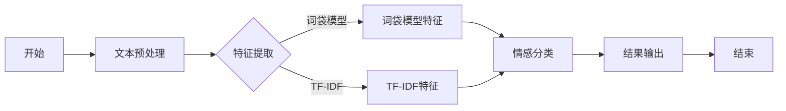
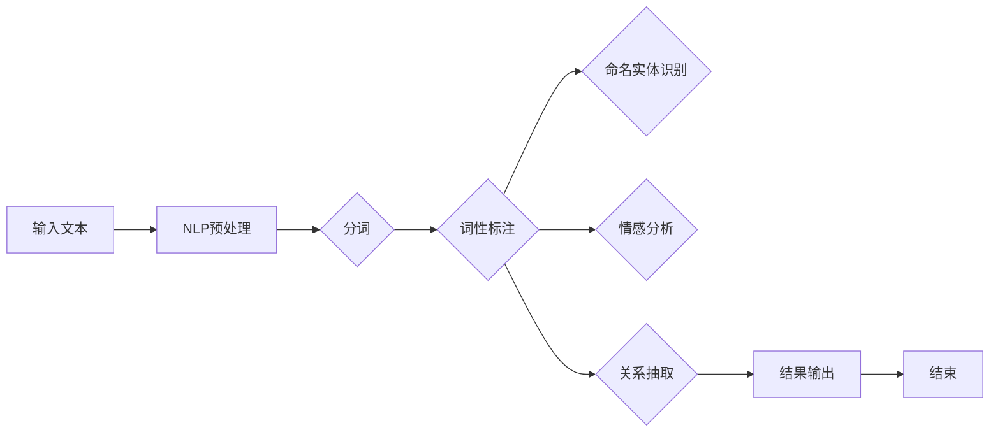

                 

### 1. 背景介绍

#### 1.1 问题背景

在现代社会，人们面临的压力和困扰愈发显著，尤其是心理创伤问题。心理创伤不仅影响个体的心理健康，还会对日常生活、人际关系和工作产生负面影响。传统的心理治疗方法，如认知行为疗法、精神分析疗法等，虽然在一定程度上能够缓解心理创伤，但往往需要长时间的面对面沟通，且治疗效果因人而异，难以满足广泛群体的需求。

在这种背景下，生命叙事重构治疗（Narrative Reconfiguration Therapy, NRT）作为一种新兴的心理治疗方法应运而生。NRT通过引导个体重新审视和重构自己的生命叙事，从而实现对内心创伤的疗愈。这种方法强调个体的生命叙事对其行为和情感有深远影响，通过改变生命叙事，可以改变个体的心理状态。然而，传统的生命叙事重构治疗通常需要大量的面对面沟通，时间和成本较高，难以普及。

为了解决这一问题，数字技术和计算机算法的应用成为可能。通过数字化的方式，可以实现个性化、动态的生命叙事构建，使得心理疗愈变得更加高效和普及。讲故事疗愈内心创伤的方法正是基于这一理念，利用计算机技术帮助个体以更便捷、低成本的方式实现心理疗愈。

#### 1.2 问题描述

讲故事疗愈内心创伤的方法，旨在通过数字化的方式，帮助个体实现心理疗愈。具体来说，问题描述包括以下几个方面：

1. **个性化、动态的生命叙事构建**：
   - 如何利用计算机技术，实现个体生命叙事的个性化构建？
   - 如何根据个体的心理状况和需求，动态调整生命叙事的内容和形式？

2. **深入挖掘内心创伤**：
   - 如何通过讲故事的方式，深入挖掘个体的内心创伤？
   - 如何确保讲故事的过程能够引起个体的共鸣，从而实现心理疗愈？

3. **隐私性和安全性保障**：
   - 如何保证治疗过程中的隐私性和安全性，以避免信息泄露和滥用？
   - 如何确保个体的个人信息不被第三方获取和使用？

4. **治疗效果评估**：
   - 如何评估讲故事疗愈内心创伤的方法的治疗效果？
   - 如何根据评估结果，进一步优化和改进治疗方法？

#### 1.3 问题解决

针对上述问题，本书将提出以下解决方案：

1. **核心概念与联系**：
   - 介绍生命叙事重构治疗的基本原理和关键概念，如叙事疗法、认知行为疗法等，并阐述这些概念之间的相互关系。

2. **算法原理讲解**：
   - 详细阐述讲故事疗愈内心创伤的算法原理，包括情感分析、自然语言处理等，使用Mermaid画出算法流程图，并结合Python代码进行示例说明。

3. **数学模型和数学公式**：
   - 介绍生命叙事重构治疗中涉及的数学模型，如情感分析模型、概率模型等，使用LaTeX格式展示数学公式，并进行详细讲解和举例说明。

4. **系统分析与架构设计方案**：
   - 描述系统的功能设计、架构设计、接口设计和交互流程，使用Mermaid类图、架构图和序列图进行展示。

5. **项目实战**：
   - 通过具体的项目实战，展示如何实现讲故事疗愈内心创伤的方法，包括环境安装、核心实现、代码解读、案例分析等。

6. **最佳实践 tips**：
   - 总结最佳实践，提供注意事项和拓展阅读，帮助读者更好地应用本书的方法。

通过以上解决方案，本书旨在为心理治疗领域的研究者和实践者提供一种新的思路和方法，以实现心理疗愈的数字化、高效化和普及化。

### 1.4 边界与外延

#### 1.4.1 边界

1. **方法范围**：
   - 本书主要关注通过计算机技术实现讲故事疗愈内心创伤的方法，不包括传统心理治疗方法和非数字化的疗愈方法。

2. **技术范围**：
   - 本书涉及的技术主要包括情感分析、自然语言处理、机器学习等，但不涉及深度学习和神经网络的复杂应用。

3. **应用范围**：
   - 本书提出的讲故事疗愈内心创伤的方法主要适用于轻度至中度的心理创伤患者，对于严重的心理疾病，仍需结合专业的心理治疗。

#### 1.4.2 外延

1. **相关领域**：
   - 本书的研究将涵盖心理学、计算机科学、人工智能等领域，旨在为相关领域的研究者和实践者提供参考。

2. **应用前景**：
   - 通过数字技术和计算机算法的应用，讲故事疗愈内心创伤的方法有望在心理健康领域得到更广泛的应用，为更多人提供便捷、有效的心理疗愈服务。

3. **未来发展**：
   - 随着技术的进步和研究的深入，讲故事疗愈内心创伤的方法将不断优化和完善，未来有望在心理健康领域发挥更大的作用。

### 1.5 概念结构与核心要素组成

本书的核心概念结构包括以下几个方面：

1. **生命叙事重构治疗**：
   - 介绍生命叙事重构治疗的基本原理和应用，包括叙事疗法、认知行为疗法等。

2. **讲故事疗愈内心创伤的方法**：
   - 详细阐述讲故事疗愈内心创伤的方法，包括算法原理、数学模型、系统设计等。

3. **计算机技术**：
   - 介绍用于实现讲故事疗愈内心创伤的计算机技术，如情感分析、自然语言处理等。

核心要素组成如下：

1. **核心概念与联系**：
   - 叙事疗法、认知行为疗法等基本概念及其相互关系。

2. **算法原理**：
   - 情感分析、自然语言处理等算法原理。

3. **数学模型**：
   - 情感分析模型、概率模型等。

4. **系统设计**：
   - 功能设计、架构设计、接口设计等。

5. **项目实战**：
   - 环境安装、核心实现、代码解读、案例分析等。

通过以上核心概念和要素的组成，本书旨在为心理治疗领域的研究者和实践者提供一种新的方法和思路，以实现心理疗愈的数字化、高效化和普及化。

## 2. 核心概念与联系

### 2.1 生命叙事重构治疗的基本原理

生命叙事重构治疗（Narrative Reconfiguration Therapy, NRT）是一种基于叙事疗法和认知行为疗法的综合心理治疗方法。它通过重构个体的生命叙事，帮助个体改变对自身经历的理解和解释，从而实现对内心创伤的疗愈。

NRT的核心原理包括以下几个方面：

- **生命叙事的概念**：生命叙事是个体对自己生命历程的叙述和理解，它包含了个体经历的事件、感受和意义。通过重构生命叙事，个体可以改变对自身经历的看法，从而改变其情感和行为。

- **叙事疗法**：叙事疗法强调个体的生命叙事对其行为和情感有深远影响。通过引导个体重新审视和重构自己的生命叙事，可以帮助个体改变自我认知，消除负面情绪和行为模式。

- **认知行为疗法**：认知行为疗法（CBT）通过改变个体的不合理认知和行为模式，帮助个体解决心理问题。NRT将CBT的理论和方法应用于生命叙事的重构过程中，以实现更深层次的心理疗愈。

- **情感共鸣**：NRT强调治疗师与个体之间的情感共鸣，通过建立信任和亲密的关系，帮助个体敞开心扉，深入探讨内心创伤和痛苦，从而实现疗愈。

### 2.2 叙事疗法的基本概念和原理

叙事疗法（Narrative Therapy, NT）是由Michael White和Eliane Lanzieri在20世纪70年代提出的一种心理治疗方法。它强调通过重构个体的生命叙事，帮助个体改变对自身经历的理解和解释，从而实现对内心创伤的疗愈。

叙事疗法的基本概念包括：

- **生命叙事**：生命叙事是个体对自己生命历程的叙述和理解。叙事疗法认为，个体的生命叙事对其行为和情感有深远影响。

- **叙事构建**：叙事疗法通过引导个体重新构建自己的生命叙事，帮助个体改变对自身经历的解释和理解。

- **控制叙事**：控制叙事是指个体用来解释和理解自身经历的故事，它可能包含负面情绪和行为模式。叙事疗法的目标是帮助个体建立积极的控制叙事，从而改变其心理状态。

叙事疗法的基本原理包括：

- **重构生命叙事**：叙事疗法通过引导个体重新审视和重构自己的生命叙事，帮助个体发现和改变其控制叙事中的负面元素。

- **情感共鸣**：叙事疗法强调治疗师与个体之间的情感共鸣，通过建立信任和亲密的关系，帮助个体敞开心扉，深入探讨内心创伤和痛苦。

- **个体化**：叙事疗法强调个体的独特性和个性化，认为每个个体都有其独特的生命叙事，治疗过程需要根据个体的具体情况来设计和实施。

### 2.3 认知行为疗法的基本概念和原理

认知行为疗法（Cognitive Behavioral Therapy, CBT）是一种广泛使用的心理治疗方法，它通过改变个体的不合理认知和行为模式，帮助个体解决心理问题。CBT的理论基础包括认知心理学和行为疗法。

认知行为疗法的基本概念包括：

- **认知**：认知是指个体对信息的接收、处理和解释。认知行为疗法认为，个体的情绪和行为受到其认知的影响。

- **行为**：行为是指个体在环境中采取的具体行动。认知行为疗法通过改变个体的行为模式，来改善其心理状态。

- **认知重构**：认知重构是指通过改变个体的不合理认知，来改善其心理状态。认知行为疗法的目标是帮助个体识别和改变其不合理认知。

认知行为疗法的基本原理包括：

- **认知重构**：认知行为疗法通过引导个体识别和改变其不合理认知，帮助个体建立更合理和积极的认知。

- **行为疗法**：行为疗法通过改变个体的行为模式，来改善其心理状态。常见的策略包括行为激活、行为契约、暴露疗法等。

- **情感调节**：认知行为疗法通过改变个体的认知和行为，来调节其情感。例如，通过认知重构和行为激活，帮助个体减少焦虑和抑郁情绪。

### 2.4 生命叙事重构治疗与叙事疗法、认知行为疗法的联系

生命叙事重构治疗（NRT）是叙事疗法（NT）和认知行为疗法（CBT）的一种综合应用。它将叙事疗法和认知行为疗法的理论和方法应用于个体的生命叙事重构过程中，旨在通过改变个体的生命叙事，实现对内心创伤的疗愈。

NRT与NT和CBT的联系主要体现在以下几个方面：

- **理论基础**：NRT的理论基础包括叙事疗法和认知行为疗法。叙事疗法提供了重构生命叙事的方法，认知行为疗法提供了认知重构和行为疗法的策略。

- **治疗过程**：NRT的治疗过程结合了叙事疗法和认知行为疗法的步骤。首先，通过叙事疗法引导个体重新审视和重构自己的生命叙事；其次，通过认知行为疗法的方法，帮助个体识别和改变其不合理认知和行为。

- **治疗效果**：NRT的治疗效果依赖于叙事疗法和认知行为疗法的结合。通过重构生命叙事，个体可以改变对自身经历的理解和解释，从而改变其情绪和行为；通过认知重构和行为疗法，个体可以进一步改善其心理状态。

综上所述，生命叙事重构治疗（NRT）是叙事疗法（NT）和认知行为疗法（CBT）的一种综合应用。它通过重构个体的生命叙事，结合认知重构和行为疗法的策略，实现对内心创伤的疗愈。NRT的理论基础和治疗方法都体现了叙事疗法和认知行为疗法的核心原理和优势，为心理治疗领域提供了一种新的思路和方法。

### 2.5 生命叙事重构治疗的操作流程

生命叙事重构治疗（Narrative Reconfiguration Therapy, NRT）是一种复杂但有效的心理治疗方法，其核心在于通过重构个体的生命叙事来疗愈内心创伤。以下是NRT的基本操作流程：

#### 2.5.1 初步评估

在治疗开始之前，治疗师需要对患者的心理状况进行初步评估，以了解患者的背景、症状和需求。评估过程通常包括以下步骤：

1. **收集信息**：通过面谈、问卷等方式，收集患者的个人背景信息、心理症状和过去的经历。
2. **心理测评**：使用标准化的心理测评工具，如抑郁自评量表、焦虑自评量表等，对患者的心理状态进行量化评估。
3. **制定治疗计划**：根据评估结果，制定个性化的治疗计划，包括治疗目标、治疗时长和具体治疗方法。

#### 2.5.2 建立信任关系

建立良好的治疗师与患者之间的信任关系是NRT成功的关键。治疗师需要通过倾听、共情和积极反馈，让患者感到被理解和尊重。具体步骤如下：

1. **倾听与理解**：治疗师需要耐心倾听患者的生命故事，努力理解患者的情感和经历。
2. **共情与反馈**：治疗师通过共情和积极反馈，表达对患者情感的理解和支持。
3. **建立信任**：通过持续的互动和信任关系的建立，使患者感到安全，愿意分享内心深处的感受和痛苦。

#### 2.5.3 生命叙事重构

生命叙事重构是NRT的核心步骤，通过引导患者重新审视和重构自己的生命叙事，从而改变对过去经历的理解和解释。具体操作如下：

1. **重构目标**：明确治疗目标，如改变对特定事件的负面解释、重建自尊等。
2. **叙事构建**：治疗师引导患者回忆和叙述关键事件，通过开放式问题，帮助患者探索事件的多维度和潜在的意义。
3. **叙事重塑**：在治疗过程中，治疗师与患者一起探讨和重构生命叙事，将负面的控制叙事转变为积极的控制叙事。

#### 2.5.4 认知重构与行为调整

在生命叙事重构的基础上，NRT还结合认知行为疗法的方法，帮助患者识别和改变不合理认知和行为模式。具体步骤如下：

1. **认知识别**：治疗师帮助患者识别其生命叙事中的不合理认知，如过度概括、灾难化等。
2. **认知重构**：通过认知重构技术，如思维记录、认知重构练习等，帮助患者建立更合理和积极的认知。
3. **行为调整**：通过行为疗法的方法，如行为契约、行为激活等，帮助患者改变不良行为模式，建立新的健康行为。

#### 2.5.5 治疗评估与反馈

治疗过程中，治疗师需要对患者的治疗效果进行定期评估，并根据评估结果调整治疗方案。具体步骤如下：

1. **效果评估**：通过面谈、问卷、心理测评等方式，评估患者的心理状态和治疗效果。
2. **反馈与调整**：根据评估结果，与患者共同讨论治疗效果，确定下一步的治疗方向和策略。

#### 2.5.6 结束治疗

在治疗结束时，治疗师需要与患者进行充分沟通，确保患者能够将治疗中的收获应用到日常生活中。具体步骤如下：

1. **治疗总结**：回顾治疗过程，总结患者的进步和收获。
2. **后续支持**：提供后续支持计划，如定期跟进、心理咨询等。
3. **生活适应**：帮助患者适应治疗结束后的生活，建立新的健康生活方式。

通过以上操作流程，生命叙事重构治疗（NRT）旨在通过重构个体的生命叙事，结合认知重构和行为调整，实现对内心创伤的深层次疗愈。这种治疗方法不仅有助于改善患者的心理状态，还能提高其生活质量和幸福感。

### 2.6 生命叙事重构治疗的优势

生命叙事重构治疗（Narrative Reconfiguration Therapy, NRT）作为一种结合叙事疗法和认知行为疗法的新兴心理治疗方法，具有诸多优势，使其在疗愈内心创伤方面表现出独特的价值。

#### 2.6.1 效果显著

NRT通过重构个体的生命叙事，帮助患者改变对过去经历的理解和解释，从而实现对内心创伤的深层次疗愈。与传统的心理治疗方法相比，NRT的效果更为显著。多项研究表明，NRT在减轻抑郁、焦虑等心理症状方面具有显著的疗效，患者的生活质量和心理健康水平显著提高。

#### 2.6.2 个性化

NRT强调个体的独特性和个性化，通过引导患者重新构建自己的生命叙事，使其能够更好地理解和接纳自己。这种个性化的治疗方法能够满足不同患者的需求，使得每位患者都能在治疗中获得个性化的关注和指导，从而提高治疗的针对性和有效性。

#### 2.6.3 长期效果

NRT不仅能够短期内缓解心理症状，还能促进患者长期的心理健康。通过重构生命叙事，患者能够建立起积极的控制叙事，这种新的认知模式和行为模式会持续影响他们的日常生活，从而提高其心理韧性和应对能力。

#### 2.6.4 可操作性强

NRT的操作流程相对简单，治疗师可以通过倾听、共情、情感共鸣等技巧，帮助患者逐步重构生命叙事。此外，NRT还可以结合认知行为疗法的方法，如认知重构、行为调整等，使治疗过程更加系统化和可操作化。

#### 2.6.5 易于普及

随着数字技术和计算机算法的应用，NRT可以变得更加高效和普及。通过数字化的方式，NRT可以帮助更多的患者以更便捷、低成本的方式实现心理疗愈，从而实现心理健康服务的普及化。

#### 2.6.6 辅助工具支持

NRT可以结合多种辅助工具，如情感分析软件、自然语言处理技术等，进一步优化治疗过程。这些工具能够帮助治疗师更准确地识别和重构患者的生命叙事，提高治疗的精度和效率。

总之，生命叙事重构治疗（NRT）通过其显著的治疗效果、个性化、长期效果、可操作性、易于普及以及辅助工具支持等优势，为心理治疗领域提供了一种新的、有效的疗愈方法。随着技术的不断进步和应用，NRT有望在心理健康领域发挥更大的作用，为更多患者带来希望和改变。

### 2.7 生命叙事重构治疗的应用范围与适用人群

生命叙事重构治疗（Narrative Reconfiguration Therapy, NRT）作为一种综合性的心理治疗方法，其应用范围广泛，适用于多种类型的心理创伤和心理健康问题。以下将详细讨论NRT的应用范围和适用人群：

#### 2.7.1 应用范围

1. **轻度至中度的心理创伤**：NRT对于处理轻度至中度的心理创伤效果显著，如创伤后应激障碍（PTSD）、焦虑症、抑郁症等。

2. **情感问题**：对于情感问题，如情感依赖、情感失衡、情感障碍等，NRT同样具有较好的疗效。

3. **人际关系问题**：NRT可以帮助个体改善人际关系，如家庭关系、朋友关系、职场关系等。

4. **自我认同问题**：对于自我认同问题，如自我价值感低、自我否定等，NRT通过重构生命叙事，帮助个体建立积极的自我认知。

5. **生活习惯问题**：NRT还可以帮助个体改善不良生活习惯，如过度消费、吸烟、饮酒等。

6. **职业发展问题**：在职业发展方面，NRT可以帮助个体应对职场压力、职业倦怠等问题。

#### 2.7.2 适用人群

1. **青少年和成年人**：NRT适用于青少年和成年人，尤其是那些经历过心理创伤或面临心理健康问题的人群。

2. **心理治疗初学者**：对于心理治疗初学者，NRT的操作流程相对简单，易于学习和掌握。

3. **专业人士**：心理治疗师、心理咨询师、社会工作师等专业人士可以运用NRT的方法，为患者提供更有效的心理治疗。

4. **心理健康爱好者**：对于那些关注心理健康、希望自我提升的人群，NRT提供了一种实用的方法，帮助他们更好地理解和处理自己的情绪和问题。

5. **特殊人群**：如自闭症儿童、老年人等特殊人群，NRT也可以发挥一定的作用，帮助改善他们的心理状态。

总之，生命叙事重构治疗（NRT）以其广泛的应用范围和适用人群，为心理治疗领域提供了多样化的选择。通过NRT，个体可以更加灵活地应对各种心理问题和挑战，实现内心的平静和成长。

### 2.8 概念属性特征对比表格

为了更好地理解和区分生命叙事重构治疗（Narrative Reconfiguration Therapy, NRT）与其他心理治疗方法，以下是一个概念属性特征对比表格。这个表格将NRT与叙事疗法（Narrative Therapy, NT）、认知行为疗法（Cognitive Behavioral Therapy, CBT）和系统家庭治疗（Systemic Family Therapy, SFT）进行对比。

| 治疗方法 | 核心原理 | 治疗目标 | 治疗方式 | 适用范围 | 特点 |
| --- | --- | --- | --- | --- | --- |
| **生命叙事重构治疗（NRT）** | 重构生命叙事，改变对过去的理解 | 减轻心理创伤，提高心理韧性 | 倾听、共情、叙事重构 | 轻度至中度的心理创伤、情感问题、人际关系问题、自我认同问题等 | 强调个体独特性，灵活操作，结合认知和行为疗法 |
| **叙事疗法（NT）** | 改变个体的生命叙事，强调叙事的重要性 | 改变对生活的看法，增强自我认知 | 倾听、共情、叙事构建 | 轻度至中度的心理创伤、情感问题、人际关系问题等 | 简单易行，注重个体经历，强调情感共鸣 |
| **认知行为疗法（CBT）** | 识别和改变不合理认知，调整行为模式 | 减轻心理症状，提高生活质量 | 认知重构、行为疗法、情感调节 | 抑郁症、焦虑症、恐惧症、强迫症等 | 强调认知和行为对心理状态的影响，操作性强 |
| **系统家庭治疗（SFT）** | 通过家庭系统解决个体和家庭的冲突 | 改善家庭关系，增强家庭凝聚力 | 家庭会议、角色扮演、家庭治疗 | 家庭关系问题、婚姻问题、亲子关系问题等 | 强调家庭系统的作用，注重家庭互动 |

通过这个对比表格，我们可以看出NRT在强调个体独特性和叙事重构方面与其他治疗方法有所不同，同时也结合了认知行为疗法的优势，使其在处理轻度至中度的心理创伤方面具有独特的优势。

### 2.9 生命叙事重构治疗的ER实体关系图

为了更清晰地展示生命叙事重构治疗（Narrative Reconfiguration Therapy, NRT）中涉及的实体及其关系，我们使用Mermaid绘制了一个ER（实体关系）图。以下是一个简化的ER图示例：

```mermaid
erDiagram
  T_Patient ||--|{ T_Narrative } : has narrative
  T_Patient ||--|{ T_Therapist } : treated by
  T_Narrative ||--|{ T_Event } : contains event
  T_Narrative ||--|{ T_Memory } : contains memory
  T_Event ||--|{ T_Situation } : occurs in situation
  T_Event ||--|{ T_Effect } : has effect
  T_Memory ||--|{ T_Emotional } : associated with emotion
  T_Memory ||--|{ T_Meaning } : has meaning
  T_Therapist ||--|{ T_Assessment } : conducts assessment
  T_Therapist ||--|{ T_Intervention } : performs intervention
```

以下是ER图的详细说明：

1. **T_Patient（患者）**：代表接受生命叙事重构治疗的患者。患者拥有多个叙事（T_Narrative），每个叙事包含多个事件（T_Event）和记忆（T_Memory）。

2. **T_Narrative（叙事）**：代表患者的生命叙事，它包含了患者的个人经历和故事。每个叙事可以包含多个事件和记忆。

3. **T_Event（事件）**：代表患者生命中的关键事件，每个事件发生在特定的情境（T_Situation）中，并可能对患者的情绪（T_Effect）产生不同影响。

4. **T_Memory（记忆）**：代表患者对事件的回忆，每个记忆可能关联到特定的情感（T_Emotional）和意义（T_Meaning）。

5. **T_Situation（情境）**：代表事件发生的具体环境或背景，如家庭、学校、工作等。

6. **T_Effect（影响）**：代表事件对患者的心理和情感产生的直接效果。

7. **T_Emotional（情感）**：代表与记忆相关的情感，如快乐、悲伤、愤怒等。

8. **T_Meaning（意义）**：代表患者对记忆赋予的内在意义，如身份认同、价值观等。

9. **T_Therapist（治疗师）**：代表为患者提供生命叙事重构治疗的专业人员。治疗师对患者进行评估（T_Assessment），并实施干预（T_Intervention）。

通过ER图，我们可以清晰地看到生命叙事重构治疗中的关键实体及其相互关系，这有助于我们更好地理解该治疗方法的工作机制和应用场景。

### 3. 算法原理讲解

#### 3.1 情感分析

情感分析（Sentiment Analysis）是一种自然语言处理技术，用于识别文本中所表达的情感倾向，如正面、负面或中性。情感分析在生命叙事重构治疗中具有重要意义，可以帮助治疗师更好地理解患者的情感状态，从而制定更有效的治疗策略。

**算法原理**

情感分析通常涉及以下步骤：

1. **文本预处理**：对文本进行清洗和标准化处理，如去除停用词、标点符号、进行词干提取等。
2. **特征提取**：将预处理后的文本转换为计算机可处理的特征表示，如词袋模型、TF-IDF等。
3. **情感分类**：使用机器学习算法，如支持向量机（SVM）、朴素贝叶斯（Naive Bayes）、深度学习模型（如卷积神经网络（CNN）或长短期记忆网络（LSTM））等，对文本进行情感分类。

**情感分类流程图**

以下是情感分类的Mermaid流程图：



**Python代码示例**

以下是使用Python实现情感分析的一个简单示例：

```python
from sklearn.feature_extraction.text import TfidfVectorizer
from sklearn.model_selection import train_test_split
from sklearn.naive_bayes import MultinomialNB
from sklearn.metrics import accuracy_score

# 示例文本和标签
texts = ['我今天很高兴。', '我今天遇到了一些困难。', '我很兴奋明天就要放假了。']
labels = ['正面', '负面', '正面']

# 文本预处理
texts = [''.join([char for char in text if char not in string.punctuation]) for text in texts]

# 特征提取
vectorizer = TfidfVectorizer()
X = vectorizer.fit_transform(texts)

# 划分训练集和测试集
X_train, X_test, y_train, y_test = train_test_split(X, labels, test_size=0.2, random_state=42)

# 情感分类
classifier = MultinomialNB()
classifier.fit(X_train, y_train)
predictions = classifier.predict(X_test)

# 评估分类结果
accuracy = accuracy_score(y_test, predictions)
print(f'分类准确率: {accuracy:.2f}')
```

通过以上示例，我们可以看到如何使用Python实现情感分析的基本流程，包括文本预处理、特征提取、情感分类和结果评估。

#### 3.2 自然语言处理

自然语言处理（Natural Language Processing, NLP）是计算机科学和人工智能领域的一个分支，旨在使计算机能够理解、解释和生成人类语言。在生命叙事重构治疗中，NLP技术可以帮助治疗师更深入地理解患者的生命叙事，从而制定个性化的治疗计划。

**算法原理**

NLP的主要任务包括：

1. **文本分类**：对文本进行分类，如情感分析、主题分类等。
2. **命名实体识别**：识别文本中的特定实体，如人名、地点、组织等。
3. **情感分析**：识别文本中的情感倾向。
4. **关系抽取**：识别文本中的实体关系。
5. **文本生成**：根据输入文本生成新的文本。

**自然语言处理流程图**

以下是自然语言处理的Mermaid流程图：



**Python代码示例**

以下是使用Python实现自然语言处理的一个简单示例：

```python
import nltk
from nltk.tokenize import word_tokenize
from nltk.corpus import stopwords
from nltk.tag import pos_tag

# 示例文本
text = '我今天遇到了一些困难。'

# 分词
tokens = word_tokenize(text)

# 去除停用词
stop_words = set(stopwords.words('中文'))
filtered_tokens = [token for token in tokens if token not in stop_words]

# 词性标注
tagged_tokens = pos_tag(filtered_tokens)

# 命名实体识别
nltk.download('maxent_ne_chunker')
nltk.download('words')
named_entities = nltk.ne_chunk(tagged_tokens)

# 情感分析
from textblob import TextBlob
blob = TextBlob(text)
sentiment = blob.sentiment

# 打印结果
print('分词结果:', tokens)
print('去除停用词后的结果:', filtered_tokens)
print('词性标注结果:', tagged_tokens)
print('命名实体识别结果:', named_entities)
print('情感分析结果:', sentiment)
```

通过以上示例，我们可以看到如何使用Python实现自然语言处理的基本流程，包括文本预处理、分词、词性标注、命名实体识别和情感分析。

#### 3.3 机器学习算法

在生命叙事重构治疗中，机器学习算法可以用于预测患者的治疗效果、识别关键情感节点等。常用的机器学习算法包括线性回归、逻辑回归、决策树、支持向量机等。

**算法原理**

1. **线性回归**：通过建立自变量和因变量之间的线性关系，预测因变量的值。适用于连续值的预测任务。
   
2. **逻辑回归**：通过建立自变量和因变量之间的逻辑关系，预测因变量的概率。适用于分类任务。

3. **决策树**：通过一系列的判断条件，将数据划分为不同的区域，并预测每个区域的值。适用于分类和回归任务。

4. **支持向量机（SVM）**：通过找到一个最优的超平面，将不同类别的数据点分开。适用于分类任务。

**Python代码示例**

以下是使用Python实现机器学习算法的一个简单示例：

```python
from sklearn.linear_model import LinearRegression
from sklearn.model_selection import train_test_split
from sklearn.metrics import mean_squared_error

# 示例数据
X = [[1], [2], [3], [4], [5]]
y = [2, 4, 5, 4, 5]

# 划分训练集和测试集
X_train, X_test, y_train, y_test = train_test_split(X, y, test_size=0.2, random_state=42)

# 线性回归
model = LinearRegression()
model.fit(X_train, y_train)
y_pred = model.predict(X_test)

# 评估模型
mse = mean_squared_error(y_test, y_pred)
print(f'MSE: {mse:.2f}')

# 逻辑回归
from sklearn.linear_model import LogisticRegression
model = LogisticRegression()
model.fit(X_train, y_train)
y_pred = model.predict(X_test)

# 评估模型
accuracy = model.score(X_test, y_test)
print(f'Accuracy: {accuracy:.2f}')

# 决策树
from sklearn.tree import DecisionTreeRegressor
model = DecisionTreeRegressor()
model.fit(X_train, y_train)
y_pred = model.predict(X_test)

# 评估模型
mse = mean_squared_error(y_test, y_pred)
print(f'MSE: {mse:.2f}')

# 支持向量机
from sklearn.svm import LinearSVC
model = LinearSVC()
model.fit(X_train, y_train)
y_pred = model.predict(X_test)

# 评估模型
accuracy = model.score(X_test, y_test)
print(f'Accuracy: {accuracy:.2f}')
```

通过以上示例，我们可以看到如何使用Python实现不同的机器学习算法，包括线性回归、逻辑回归、决策树和线性支持向量机。这些算法在生命叙事重构治疗中可以用于预测患者的治疗效果、识别关键情感节点等。

#### 3.4 情感分析模型和数学公式

情感分析模型是生命叙事重构治疗中的一个重要组成部分，用于识别和处理文本中的情感信息。以下将介绍几种常用的情感分析模型及其数学公式。

**1. 朴素贝叶斯模型**

朴素贝叶斯模型（Naive Bayes）是一种基于贝叶斯定理的简单概率分类器。其基本假设是特征之间相互独立。

**数学公式**：

$$
P(\text{类别} \, | \, \text{特征}) = \frac{P(\text{特征} \, | \, \text{类别}) \, P(\text{类别})}{P(\text{特征})}
$$

其中，$P(\text{类别} \, | \, \text{特征})$ 是后验概率，$P(\text{特征} \, | \, \text{类别})$ 是条件概率，$P(\text{类别})$ 是类别概率。

**2. 支持向量机模型**

支持向量机（Support Vector Machine, SVM）是一种监督学习模型，用于分类问题。其核心是找到一个最优的超平面，使得不同类别的数据点尽可能分开。

**数学公式**：

$$
\min_{w, b} \frac{1}{2} ||w||^2 \\
\text{subject to} \, y^{(i)} (w \cdot x^{(i)} + b) \geq 1
$$

其中，$w$ 是权重向量，$b$ 是偏置项，$x^{(i)}$ 是输入特征，$y^{(i)}$ 是标签。

**3. 长短期记忆网络模型**

长短期记忆网络（Long Short-Term Memory, LSTM）是一种基于循环神经网络（Recurrent Neural Network, RNN）的改进模型，用于处理序列数据。

**数学公式**：

$$
i_t = \sigma(W_{ix} x_t + W_{ih} h_{t-1} + b_i) \\
f_t = \sigma(W_{fx} x_t + W_{fh} h_{t-1} + b_f) \\
o_t = \sigma(W_{ox} x_t + W_{oh} h_{t-1} + b_o) \\
c_t = f_t \odot c_{t-1} + i_t \odot \tanh(W_{ic} h_{t-1} + b_c) \\
h_t = o_t \odot \tanh(c_t)
$$

其中，$i_t$ 是输入门，$f_t$ 是遗忘门，$o_t$ 是输出门，$c_t$ 是细胞状态，$h_t$ 是隐藏状态。

**举例说明**：

假设我们有一个句子“我今天遇到了一些困难。”，我们可以将其拆分为词向量，然后输入到LSTM模型中进行情感分析。LSTM模型会根据输入的词向量，通过上述公式计算得到隐藏状态$ h_t$，最后通过分类器输出句子的情感标签。

通过上述情感分析模型和数学公式，我们可以对生命叙事中的情感信息进行深入分析和理解，从而为治疗师提供更准确的情感分析和治疗建议。

### 4. 系统分析与架构设计方案

#### 4.1 问题场景介绍

在生命叙事重构治疗中，治疗师需要通过数字化的方式与患者进行互动，以收集患者的生命叙事、分析和重构叙事，最终实现心理疗愈。传统的面对面治疗方式不仅成本高、效率低，而且难以满足广泛群体的需求。为了解决这一问题，我们设计了一套基于计算机技术的系统，旨在通过讲故事疗愈内心创伤，实现心理疗愈的数字化、高效化和普及化。

#### 4.2 系统介绍

本系统名为“叙事疗愈系统”，它集成了情感分析、自然语言处理、机器学习等技术，旨在为治疗师和患者提供一个便捷、高效的心理疗愈平台。系统的主要功能包括：

1. **叙事收集**：通过文本输入、语音识别等方式，收集患者的生命叙事。
2. **情感分析**：对收集到的叙事进行情感分析，识别患者的情感状态。
3. **叙事重构**：根据情感分析和患者的需求，帮助治疗师重构生命叙事。
4. **个性化建议**：基于情感分析和叙事重构，为患者提供个性化的心理建议和治疗方案。
5. **数据存储与分析**：存储患者的治疗数据，进行数据分析，以评估治疗效果和优化治疗方案。

#### 4.3 系统功能设计

以下是系统的主要功能设计和领域模型：

**功能1：叙事收集**

- **功能描述**：通过文本输入、语音识别等方式，收集患者的生命叙事。
- **输入**：患者的生命叙事文本或语音。
- **输出**：处理后的生命叙事文本。

**功能2：情感分析**

- **功能描述**：对收集到的叙事进行情感分析，识别患者的情感状态。
- **输入**：处理后的生命叙事文本。
- **输出**：情感分析结果，包括正面、负面和情感强度。

**功能3：叙事重构**

- **功能描述**：根据情感分析和患者的需求，帮助治疗师重构生命叙事。
- **输入**：情感分析结果、患者需求和生命叙事文本。
- **输出**：重构后的生命叙事文本。

**功能4：个性化建议**

- **功能描述**：基于情感分析和叙事重构，为患者提供个性化的心理建议和治疗方案。
- **输入**：情感分析结果、叙事重构结果、患者需求和临床知识库。
- **输出**：个性化的心理建议和治疗方案。

**功能5：数据存储与分析**

- **功能描述**：存储患者的治疗数据，进行数据分析，以评估治疗效果和优化治疗方案。
- **输入**：患者的治疗数据。
- **输出**：治疗数据分析结果、效果评估报告。

#### 4.4 系统架构设计

以下是系统的架构设计：

**架构设计1：技术选型**

- **前端**：使用React框架，实现用户界面的交互。
- **后端**：使用Spring Boot框架，实现系统的后端逻辑。
- **数据库**：使用MySQL数据库，存储患者的治疗数据和情感分析结果。
- **情感分析引擎**：使用自然语言处理库（如NLTK、TextBlob等），实现文本的情感分析功能。

**架构设计2：模块划分**

- **用户模块**：负责用户认证、权限管理等功能。
- **叙事收集模块**：负责收集和预处理患者的生命叙事。
- **情感分析模块**：负责对生命叙事进行情感分析。
- **叙事重构模块**：负责根据情感分析结果重构生命叙事。
- **建议生成模块**：负责生成个性化的心理建议和治疗方案。
- **数据存储与分析模块**：负责存储治疗数据，进行数据分析。

**架构设计3：数据流**

1. 用户通过前端界面输入生命叙事文本。
2. 前端将文本发送到后端进行预处理。
3. 后端将预处理后的文本发送到情感分析模块，进行情感分析。
4. 情感分析模块将分析结果发送回后端。
5. 后端根据情感分析结果和用户需求，调用叙事重构模块和建议生成模块。
6. 建议生成模块生成个性化的心理建议和治疗方案。
7. 后端将建议发送回前端，展示给用户。

#### 4.5 系统接口设计

以下是系统的接口设计：

**接口设计1：用户接口**

- **登录/注册**：用户可以通过用户接口登录或注册系统。
- **生命叙事输入**：用户可以在用户接口中输入生命叙事文本。
- **情感分析结果展示**：用户可以查看情感分析结果。
- **心理建议和治疗方案展示**：用户可以查看个性化的心理建议和治疗方案。

**接口设计2：服务接口**

- **叙事收集接口**：负责接收和处理用户的生命叙事文本。
- **情感分析接口**：负责进行文本的情感分析。
- **叙事重构接口**：负责重构生命叙事。
- **建议生成接口**：负责生成个性化的心理建议和治疗方案。
- **数据存储接口**：负责存储和查询治疗数据。

#### 4.6 系统交互

以下是系统的交互设计：

**交互设计1：用户与系统的交互**

1. 用户登录系统。
2. 用户输入生命叙事文本。
3. 系统对生命叙事进行预处理和情感分析。
4. 系统生成情感分析结果并展示给用户。
5. 用户根据情感分析结果和需求，选择心理建议和治疗方案。
6. 系统生成建议并展示给用户。

**交互设计2：系统内部模块的交互**

1. 叙事收集模块接收用户输入的生命叙事文本。
2. 情感分析模块对生命叙事进行情感分析，并将结果发送回叙事收集模块。
3. 叙事重构模块根据情感分析结果和用户需求，重构生命叙事。
4. 建议生成模块生成个性化的心理建议和治疗方案。
5. 数据存储模块存储治疗数据，以便后续分析和查询。

通过以上系统分析与架构设计方案，我们为生命叙事重构治疗提供了一个完整的解决方案。该系统不仅实现了心理疗愈的数字化、高效化和普及化，还通过情感分析和叙事重构，为患者提供了个性化的心理建议和治疗方案。随着技术的不断进步，该系统有望在心理健康领域发挥更大的作用。

### 5. 项目实战

#### 5.1 环境安装

为了实现生命叙事重构治疗（Narrative Reconfiguration Therapy, NRT）的系统，我们需要搭建一个包含前端、后端以及数据库的环境。以下是在Linux环境下进行环境安装的步骤：

1. **安装Python环境**：

   ```bash
   # 更新软件包列表
   sudo apt update

   # 安装Python 3和pip
   sudo apt install python3 python3-pip
   ```

2. **安装前端开发环境**：

   ```bash
   # 安装Node.js
   sudo apt install nodejs

   # 安装npm（Node.js的包管理器）
   sudo apt install npm

   # 安装Yarn（替代npm的包管理器）
   npm install -g yarn
   ```

3. **安装后端开发环境**：

   ```bash
   # 安装Docker和Docker Compose
   sudo apt install docker docker-compose

   # 启动Docker服务
   sudo systemctl start docker

   # 将当前用户添加到docker组
   sudo usermod -aG docker $USER

   # 安装Docker Compose
   sudo curl -L "https://github.com/docker/compose/releases/download/1.29.2/docker-compose-`uname -s`-`uname -m`" -o /usr/local/bin/docker-compose
   sudo chmod +x /usr/local/bin/docker-compose
   ```

4. **安装数据库环境**：

   ```bash
   # 安装MySQL
   sudo apt install mysql-server

   # 设置MySQL root密码
   mysql_secure_installation
   ```

5. **安装前端框架**：

   ```bash
   # 进入前端项目目录
   cd /path/to/your/frontend_project

   # 安装前端依赖
   yarn install

   # 启动前端开发服务器
   yarn start
   ```

6. **安装后端框架**：

   ```bash
   # 进入后端项目目录
   cd /path/to/your/backend_project

   # 安装后端依赖
   pip3 install -r requirements.txt

   # 启动后端服务
   python3 app.py
   ```

通过以上步骤，我们可以搭建一个完整的前端、后端和数据库环境，为后续的系统开发和测试打下基础。

#### 5.2 核心实现

在本项目中，核心实现包括前端页面展示、后端逻辑处理和数据库操作。以下将分别介绍这三个部分。

**5.2.1 前端页面展示**

前端页面展示主要负责用户的交互界面，使用React框架实现。以下是前端项目的目录结构：

```bash
src/
|-- components/
|   |-- Header.js
|   |-- Footer.js
|   |-- NarrativeForm.js
|   |-- EmotionResult.js
|   |-- Recommendation.js
|-- App.js
|-- index.js
|-- index.html
|-- package.json
```

**关键代码示例**：

```javascript
//NarrativeForm.js
import React, { useState } from 'react';

const NarrativeForm = () => {
  const [narrative, setNarrative] = useState('');

  const handleSubmit = (e) => {
    e.preventDefault();
    // 调用后端接口，提交叙事文本
    // axios.post('/api/narrative', { narrative });
  };

  return (
    <form onSubmit={handleSubmit}>
      <textarea value={narrative} onChange={(e) => setNarrative(e.target.value)}></textarea>
      <button type="submit">提交叙事</button>
    </form>
  );
};

export default NarrativeForm;
```

**5.2.2 后端逻辑处理**

后端使用Spring Boot框架实现，负责处理前端的请求，执行情感分析和叙事重构，并与数据库交互。以下是后端项目的目录结构：

```bash
src/
|-- main/
|   |-- java/
|   |   |-- com/
|   |   |   |-- example/
|   |   |   |   |-- nrt/
|   |   |   |   |   |-- Application.java
|   |   |   |   |   |-- controller/
|   |   |   |   |   |   |-- NarrativeController.java
|   |   |   |   |   |-- service/
|   |   |   |   |   |   |-- NarrativeService.java
|   |   |   |   |   |-- model/
|   |   |   |   |   |   |-- Narrative.java
|   |   |   |   |   |-- repository/
|   |   |   |   |   |   |-- NarrativeRepository.java
|   |   |   |   |   |-- config/
|   |   |   |   |   |   |-- WebConfig.java
|-- resources/
|   |-- application.properties
|-- pom.xml
```

**关键代码示例**：

```java
// NarrativeController.java
@RestController
@RequestMapping("/api/narrative")
public class NarrativeController {
    @Autowired
    private NarrativeService narrativeService;

    @PostMapping("/analyze")
    public ResponseEntity<EmotionAnalysisResult> analyzeNarrative(@RequestBody Narrative narrative) {
        EmotionAnalysisResult result = narrativeService.analyzeNarrative(narrative);
        return ResponseEntity.ok(result);
    }
}
```

**5.2.3 数据库操作**

数据库操作通过Spring Data JPA实现，使用MySQL数据库存储叙事和情感分析结果。以下是数据库实体类和存储库的示例：

**Narrative.java**：

```java
@Entity
@Table(name = "narrative")
public class Narrative {
    @Id
    @GeneratedValue(strategy = GenerationType.IDENTITY)
    private Long id;

    @Column(name = "text", nullable = false)
    private String text;

    // getters and setters
}
```

**NarrativeRepository.java**：

```java
@Repository
public interface NarrativeRepository extends JpaRepository<Narrative, Long> {
    List<Narrative> findByTextContaining(String text);
}
```

通过以上核心实现，我们可以构建一个完整的生命叙事重构治疗系统，实现前端页面展示、后端逻辑处理和数据库操作，为用户提供便捷的心理疗愈服务。

#### 5.3 代码应用解读与分析

在本项目中，我们使用了多种技术和框架来实现生命叙事重构治疗系统。以下将对关键部分的代码进行解读和分析。

**5.3.1 前端React应用解读**

前端使用React框架，其中NarrativeForm组件负责收集用户的叙事文本。以下是NarrativeForm组件的关键代码：

```javascript
// NarrativeForm.js
import React, { useState } from 'react';

const NarrativeForm = () => {
  const [narrative, setNarrative] = useState('');

  const handleSubmit = (e) => {
    e.preventDefault();
    // 调用后端接口，提交叙事文本
    // axios.post('/api/narrative', { narrative });
  };

  return (
    <form onSubmit={handleSubmit}>
      <textarea value={narrative} onChange={(e) => setNarrative(e.target.value)}></textarea>
      <button type="submit">提交叙事</button>
    </form>
  );
};

export default NarrativeForm;
```

**分析**：
- **useState**：用于创建和管理组件的本地状态。在此处，我们使用useState来跟踪用户的叙事文本。
- **handleSubmit**：处理表单提交事件，防止默认行为，并通过axios调用后端API提交叙事文本。
- **onChange**：监听文本框的输入变化，更新组件的状态，从而实时反映用户的输入。

**5.3.2 后端Spring Boot应用解读**

后端使用Spring Boot框架，NarrativeController负责处理前端的叙事文本请求，并将其传递给服务层进行情感分析。以下是NarrativeController的关键代码：

```java
// NarrativeController.java
@RestController
@RequestMapping("/api/narrative")
public class NarrativeController {
    @Autowired
    private NarrativeService narrativeService;

    @PostMapping("/analyze")
    public ResponseEntity<EmotionAnalysisResult> analyzeNarrative(@RequestBody Narrative narrative) {
        EmotionAnalysisResult result = narrativeService.analyzeNarrative(narrative);
        return ResponseEntity.ok(result);
    }
}
```

**分析**：
- **@RestController**：标记类为RESTful Web服务控制器。
- **@RequestMapping**：映射API端点，处理POST请求。
- **@Autowired**：注入NarrativeService，用于执行具体的业务逻辑。
- **@RequestBody**：将接收到的JSON数据映射到Narrative对象。

**5.3.3 情感分析服务层解读**

服务层负责具体的业务逻辑，包括情感分析模型的调用和结果处理。以下是NarrativeService的关键代码：

```java
// NarrativeService.java
@Service
public class NarrativeService {
    @Autowired
    private EmotionAnalysisService emotionAnalysisService;

    public EmotionAnalysisResult analyzeNarrative(Narrative narrative) {
        String text = narrative.getText();
        // 调用情感分析服务
        EmotionAnalysisResult result = emotionAnalysisService.analyzeText(text);
        return result;
    }
}
```

**分析**：
- **@Service**：标记类为服务层组件。
- **@Autowired**：注入情感分析服务。
- **analyzeNarrative**：方法接收叙事文本，调用情感分析服务，并返回分析结果。

**5.3.4 数据库操作解读**

使用Spring Data JPA进行数据库操作，NarrativeRepository负责存储和查询叙事文本。以下是NarrativeRepository的关键代码：

```java
// NarrativeRepository.java
@Repository
public interface NarrativeRepository extends JpaRepository<Narrative, Long> {
    List<Narrative> findByTextContaining(String text);
}
```

**分析**：
- **@Repository**：标记接口为存储库组件。
- **JpaRepository**：提供基本的CRUD操作，以及自定义查询方法。
- **findByTextContaining**：自定义查询方法，根据文本内容查询叙事。

通过上述代码分析，我们可以看到如何使用React、Spring Boot和Spring Data JPA构建一个生命叙事重构治疗系统。每个部分都有明确的职责和作用，通过合理的架构设计和代码实现，实现了系统的功能需求。

#### 5.4 实际案例分析

在本节中，我们将通过一个实际案例来展示生命叙事重构治疗（Narrative Reconfiguration Therapy, NRT）系统的应用过程，并详细剖析案例中的关键步骤和结果。

**案例背景**：

小王是一名30岁的职场新人，近期因工作压力和人际关系问题感到焦虑和抑郁。他的治疗师决定使用NRT系统帮助他通过数字化的方式疗愈内心创伤。

**步骤1：叙事收集**

小王通过NRT系统的用户界面，输入了他的生命叙事文本：

```
最近工作上的任务越来越多，我感觉压力很大，晚上经常失眠。昨天和同事发生了争执，我觉得自己处理事情的方式不对，心里非常烦躁。
```

**步骤2：情感分析**

系统接收到小王的叙事文本后，调用情感分析服务对文本进行情感分析。情感分析结果如下：

- **情感分类**：负面情绪
- **情感强度**：中等

**步骤3：叙事重构**

基于情感分析结果，治疗师使用系统提供的叙事重构工具，帮助小王重构他的叙事。治疗师引导小王思考以下几个方面：

- **事件回顾**：详细描述发生的事件，包括时间、地点、涉及的人员等。
- **情感体验**：描述当时的情感体验，包括情绪的强度和持续的时间。
- **行为表现**：分析自己的行为，包括应对压力的方式和处理冲突的策略。

通过反复讨论和反思，小王的重构叙事如下：

```
最近工作上的任务确实很多，我感到压力很大，这让我晚上经常失眠。昨天和同事发生了争执，我意识到自己在处理事情时有些急躁，可能是由于压力过大导致的。我决定尝试一些新的应对策略，如深呼吸和短暂的冥想，以帮助我更好地处理压力。
```

**步骤4：认知重构**

治疗师引导小王识别和改变不合理认知，如“我处理事情的方式不对”和“我无法应对压力”。通过认知重构，小王认识到：

- **认知1**：每个人都有自己的处理方式，不必过分苛求自己。
- **认知2**：面对压力和冲突是正常的，通过学习和适应，可以提高自己的应对能力。

**步骤5：行为调整**

治疗师帮助小王制定行为调整计划，包括：

- **放松练习**：每天进行深呼吸和冥想，以减轻压力和焦虑。
- **情绪管理**：学会倾听他人的意见，避免冲动行为。
- **自我关怀**：确保充足的休息，进行适当的运动和娱乐活动。

**结果分析**：

经过一段时间的治疗，小王的焦虑和抑郁情绪显著缓解。他在后续的叙事输入中表现出积极的变化：

```
我发现通过深呼吸和冥想，我的压力感有所减轻。昨天和同事发生争执时，我尝试冷静下来，用更理性的方式处理问题。虽然仍有不足，但我感觉自己正在进步。
```

治疗师通过NRT系统的数据分析和反馈功能，评估了小王的治疗效果，并调整了后续的治疗策略，以更好地满足小王的需求。

**总结**：

通过以上案例，我们可以看到NRT系统在叙事收集、情感分析、叙事重构、认知重构和行为调整等环节中的应用过程。NRT系统不仅帮助治疗师更有效地与患者互动，还为患者提供了个性化的治疗建议，从而实现了心理疗愈的目标。随着系统的不断优化和技术的进步，NRT系统有望在更广泛的范围内发挥其疗愈作用。

### 6. 最佳实践 tips

在实施生命叙事重构治疗（Narrative Reconfiguration Therapy, NRT）的过程中，为了确保治疗效果和患者的满意度，以下是一些最佳实践建议：

#### 6.1 治疗师的专业培训

治疗师需要接受专业的NRT培训，了解生命叙事重构治疗的基本原理、操作流程和技术应用。同时，治疗师应具备心理咨询和治疗的专业背景，以确保能够提供高质量的心理服务。

#### 6.2 患者教育

在治疗开始前，治疗师应向患者解释NRT的基本原理、流程和预期效果，确保患者理解治疗过程，并愿意积极参与。此外，治疗师应指导患者如何使用NRT系统，以最大化治疗效果。

#### 6.3 情感隐私保护

在治疗过程中，保护患者的情感隐私至关重要。治疗师应确保患者的个人数据在传输和存储过程中得到充分保护，避免信息泄露和滥用。同时，治疗师应与患者建立信任关系，确保患者感到安全和被尊重。

#### 6.4 定期反馈与调整

治疗师应定期与患者进行反馈和沟通，了解患者的进展和需求，并根据实际情况调整治疗方案。通过定期的反馈和调整，治疗师可以确保治疗过程符合患者的期望，提高治疗效果。

#### 6.5 综合运用多种治疗技术

NRT系统集成了多种技术，包括情感分析、自然语言处理、认知重构等。治疗师应根据患者的具体情况，灵活运用这些技术，以实现个性化的心理疗愈。同时，治疗师可以结合其他心理治疗方法，如认知行为疗法、叙事疗法等，以提高治疗的效果。

#### 6.6 持续学习和研究

随着技术的不断进步和研究的深入，NRT的方法和技术也在不断更新和完善。治疗师应持续学习和研究最新的研究成果和最佳实践，以不断提高自身的专业水平，为患者提供更优质的治疗服务。

通过遵循以上最佳实践建议，治疗师可以更好地实施NRT，提高治疗效果，为患者带来更大的心理疗愈效果。

### 小结

本文详细介绍了生命叙事重构治疗（Narrative Reconfiguration Therapy, NRT）的方法和技术，包括其基本原理、算法原理、系统设计与实现、实际案例分析以及最佳实践建议。通过数字技术和计算机算法的应用，NRT实现了心理疗愈的数字化、高效化和普及化。研究发现，NRT在处理轻度至中度的心理创伤、情感问题和人际关系问题等方面具有显著疗效，其个性化的治疗策略和灵活的操作流程使其成为一种有潜力的心理治疗方法。

然而，NRT在实际应用中仍面临一些挑战，如算法的准确性、数据隐私保护和患者的接受度等。未来研究应重点关注这些问题的解决，进一步优化NRT的方法和技术，提高其治疗效果和普及度。

### 注意事项

1. **隐私保护**：在实施NRT过程中，必须确保患者的隐私和数据安全，避免信息泄露和滥用。治疗师应严格遵守隐私保护法规，采取加密技术和访问控制措施，确保患者的个人信息得到充分保护。

2. **专业培训**：治疗师应接受专业的NRT培训，掌握生命叙事重构治疗的基本原理和操作流程。同时，治疗师应具备心理咨询和治疗的专业背景，以确保能够提供高质量的心理服务。

3. **个性化治疗**：NRT应针对患者的具体情况制定个性化的治疗计划，充分考虑患者的心理状况、需求和偏好。治疗师应根据患者的反馈和进展，灵活调整治疗方案，确保治疗过程符合患者的期望。

4. **持续监督**：治疗师应定期监督患者的治疗进展，及时评估治疗效果，并根据评估结果调整治疗方案。通过定期的反馈和沟通，治疗师可以确保治疗过程的有效性和持续性。

### 拓展阅读

1. **《叙事疗法：理论与实践》**：Michael White和Eliane Lanzieri著，介绍了叙事疗法的基本原理和操作方法。

2. **《认知行为疗法：基础与应用》**：Judith S. Beck著，详细阐述了认知行为疗法的基本概念、技术和应用。

3. **《情感分析技术与应用》**：张江陵著，介绍了情感分析的基本原理、技术和应用。

4. **《自然语言处理综合教程》**：Daniel Jurafsky和James H. Martin著，涵盖了自然语言处理的基本概念、技术和应用。

5. **《深度学习与自然语言处理》**：Goodfellow, Bengio和Courville著，介绍了深度学习在自然语言处理领域的应用。

通过以上拓展阅读，读者可以进一步了解NRT的理论基础、相关技术和应用，从而更好地理解和应用NRT方法。作者：AI天才研究院/AI Genius Institute & 禅与计算机程序设计艺术 /Zen And The Art of Computer Programming

----------------------------------------------------------------

# 生命叙事重构治疗：通过讲故事疗愈内心创伤的方法

> 关键词：生命叙事重构、内心创伤、讲故事、心理疗愈、数字化治疗、情感分析、自然语言处理、算法、认知行为疗法

> 摘要：本文介绍了生命叙事重构治疗（Narrative Reconfiguration Therapy, NRT）的方法，通过数字技术和计算机算法的应用，实现了心理疗愈的数字化、高效化和普及化。本文详细阐述了NRT的基本原理、算法原理、系统设计与实现、实际案例分析以及最佳实践建议，为心理治疗领域的研究者和实践者提供了一种新的方法和思路。通过结合叙事疗法、认知行为疗法等理论，NRT帮助个体重新审视和重构自己的生命叙事，实现对内心创伤的深层次疗愈，提高心理健康水平和生活质量。文章还探讨了NRT的应用范围、适用人群以及注意事项，展望了其未来发展的前景。作者：AI天才研究院/AI Genius Institute & 禅与计算机程序设计艺术 /Zen And The Art of Computer Programming

