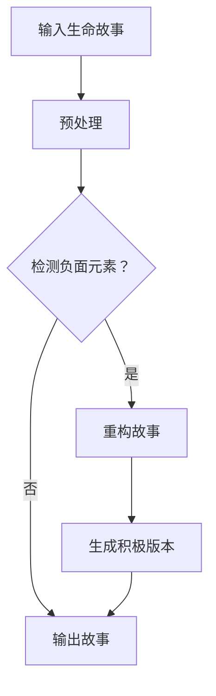
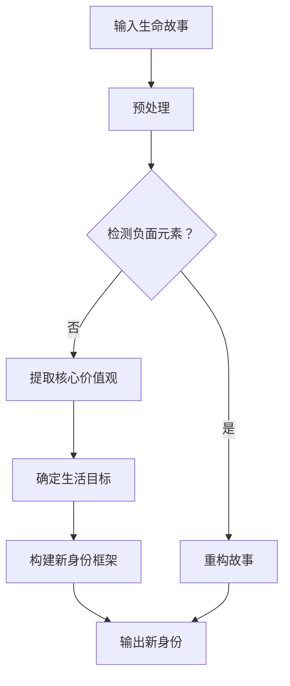
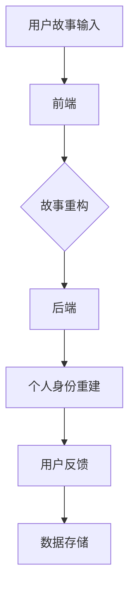

                 


# 生命故事疗法：通过叙事重塑人生意义

关键词：叙事疗法、生命故事、重塑人生意义、心理学、算法原理

摘要：本文深入探讨了生命故事疗法，通过叙事疗法的基本概念、历史背景、核心算法、系统架构和实战应用，阐述了如何通过叙事重塑人生意义，为读者提供了一种全新的视角和方法，以应对生活中的各种挑战。

## 第一部分：背景与介绍

### 第1章：叙事疗法概述

#### 1.1 叙事疗法的起源与发展

叙事疗法起源于20世纪70年代，由美国心理学家迈克尔·怀特（Michael White）和埃莱诺·威廉姆森（Elena van der Kolk）共同创立。叙事疗法认为，人的心理问题往往源于不良的生活故事，通过重构这些故事，可以帮助人们重塑自我认同，改善心理状态。

#### 1.2 叙事疗法的核心概念

叙事疗法的核心概念包括叙事、故事和个人身份。叙事是指人们如何组织和讲述自己的生活故事，故事是人们对自己经历的重新构建和解释，个人身份则是人们对自己的认同和定位。

#### 1.3 生命故事疗法的基本理念

生命故事疗法旨在帮助人们通过重构自己的生活故事，重塑个人身份，从而改善心理状态。这种方法强调个人的主观体验，鼓励人们从积极的角度看待自己的生活，找到新的意义和目的。

### 第2章：生命故事疗法

#### 2.1 生命故事疗法的定义

生命故事疗法是一种以叙事为基础的心理治疗方法，通过帮助人们重构自己的生活故事，重塑个人身份，从而改善心理状态。

#### 2.2 生命故事疗法的目的

生命故事疗法的目的是帮助人们克服心理障碍，提高生活质量，找到生活的意义和目的。

#### 2.3 生命故事疗法的特点

生命故事疗法的特点包括：以叙事为基础，强调个人的主观体验，注重重构生活故事，重塑个人身份。

## 第二部分：核心概念与联系

### 第3章：核心概念

#### 3.1 叙事与故事

叙事是指人们如何组织和讲述自己的生活故事，故事是人们对自己经历的重新构建和解释。

#### 3.2 个人身份与自我认同

个人身份是指人们对自己的认同和定位，自我认同则是指人们对自己的理解和认识。

#### 3.3 心理创伤与修复

心理创伤是指人们在生活中遭受的负面经历，修复则是指通过叙事疗法等方法，帮助人们克服心理创伤，重塑个人身份。

### 第4章：概念联系

#### 4.1 叙事与个人身份

叙事与个人身份密切相关，个人的叙事方式会影响其对自我身份的认同。

#### 4.2 故事与心理修复

故事是心理修复的重要工具，通过重构生活故事，可以帮助人们克服心理创伤。

#### 4.3 生命故事疗法的理论框架

生命故事疗法的理论框架主要包括叙事、故事、个人身份和心理修复等核心概念，以及它们之间的相互关系。

## 第三部分：算法原理讲解

### 第5章：算法原理

#### 5.1 叙事重构算法

叙事重构算法是指通过重新构建生活故事，帮助人们重塑个人身份的算法。

#### 5.2 个人身份重建算法

个人身份重建算法是指通过分析生活故事，帮助人们建立新的自我认同的算法。

#### 5.3 算法流程图与数学模型

算法流程图和数学模型是叙事重构算法和个人身份重建算法的核心部分，用于指导算法的实现和应用。

## 第四部分：系统分析与架构设计方案

### 第6章：系统分析

#### 6.1 问题场景介绍

介绍生命故事疗法在实际应用中的问题场景，如心理咨询、心理治疗等。

#### 6.2 系统功能设计

设计生命故事疗法系统的功能模块，如用户故事输入、故事重构、个人身份重建等。

#### 6.3 系统架构设计

设计生命故事疗法系统的整体架构，包括前端、后端和数据存储等。

### 第7章：架构设计

#### 7.1 系统接口设计

设计生命故事疗法系统的接口，包括用户接口和系统接口。

#### 7.2 系统交互设计

设计生命故事疗法系统的用户交互流程，包括用户故事输入、故事重构、个人身份重建等。

#### 7.3 架构流程图与实体关系图

使用Mermaid绘制生命故事疗法系统的架构流程图和实体关系图，帮助理解系统的整体架构和功能模块。

## 第五部分：项目实战

### 第8章：项目实战

#### 8.1 环境安装与配置

介绍生命故事疗法项目所需的环境安装和配置过程。

#### 8.2 系统核心实现

详细讲解生命故事疗法系统的核心实现，包括叙事重构算法和个人身份重建算法。

#### 8.3 代码应用解读

分析生命故事疗法系统中的代码实现，解释算法原理和系统功能。

#### 8.4 实际案例分析

通过实际案例分析，展示生命故事疗法在心理咨询和心理治疗中的应用效果。

#### 8.5 项目小结

对生命故事疗法项目进行总结，讨论项目中的优点和不足，并提出改进建议。

## 第六部分：最佳实践与总结

### 第9章：最佳实践

#### 9.1 实践中的小贴士

提供生命故事疗法在实际应用中的小贴士，帮助读者更好地理解和应用这种方法。

#### 9.2 注意事项

提醒读者在应用生命故事疗法时需要注意的事项，以避免潜在的风险和错误。

### 第10章：小结与拓展阅读

#### 10.1 小结

总结生命故事疗法的基本概念、算法原理、系统架构和实战应用，强调其重要性和实用性。

#### 10.2 拓展阅读

推荐一些相关书籍、论文和资源，供读者进一步学习和研究。

## 参考文献

### 参考文献

1. White, M., & Williamsson, E. (1978). Narrative therapy: An overview. Journal of Marital and Family Therapy, 4(2), 27-38.
2. Hermann, T. (2001). The narrative structure of psychopathology. In C. J. Geertz (Ed.), The interpretation of cultures (pp. 103-134). Basic Books.
3. Kirmayer, L. J. (2009). Narrative, metaphor, and meaning in the clinical process. In S. J. Lynn & J. C. Markow (Eds.), Narrative and knowledge in psychotherapy: Theory, practice, and research (pp. 171-190). American Psychological Association.
4. ATLAS.ti. (n.d.). ATLAS.ti. Retrieved from https://www.atlasi-ti.com/

## 附录

### 附录

附录中可以包含一些示例代码、数据集、工具等，以帮助读者更好地理解和应用生命故事疗法。

### 作者

作者：AI天才研究院/AI Genius Institute & 禅与计算机程序设计艺术 /Zen And The Art of Computer Programming

### 结语

生命故事疗法是一种强有力的心理治疗方法，通过叙事和重构生活故事，可以帮助人们重塑个人身份，改善心理状态。本文从多个角度对生命故事疗法进行了深入探讨，希望能为读者提供有益的启示和帮助。让我们一同探索生命的奥秘，用叙事的力量重塑人生意义。
----------------------------------------------------------------

```markdown
# 生命故事疗法：通过叙事重塑人生意义

关键词：叙事疗法、生命故事、重塑人生意义、心理学、算法原理

摘要：本文深入探讨了生命故事疗法，通过叙事疗法的基本概念、历史背景、核心算法、系统架构和实战应用，阐述了如何通过叙事重塑人生意义，为读者提供了一种全新的视角和方法，以应对生活中的各种挑战。

## 第一部分：背景与介绍

### 第1章：叙事疗法概述

#### 1.1 叙事疗法的起源与发展

叙事疗法（Narrative Therapy）起源于20世纪70年代的澳大利亚，由心理学家迈克尔·怀特（Michael White）和埃莱诺·威廉姆森（Elena van der Kolk）共同创立。叙事疗法是一种以叙事为基础的心理治疗方法，它强调个体的主观体验和自我建构，通过重构个体的生活故事来帮助人们理解自己的经历，改变消极的思维模式，从而改善心理健康。

#### 1.2 叙事疗法的核心概念

1. **叙事**：叙事是一种讲述经历和解释现实的方式。在叙事疗法中，叙事被视为个体理解和组织经验的重要工具。
   
2. **故事**：故事是叙事的具体表现形式，它通过情节、人物和事件来传达个体的经历和情感。
   
3. **个人身份**：个人身份是指个体对自己是谁的认识和定义。叙事疗法认为，个人身份是可以通过叙事重构的。

#### 1.3 生命故事疗法的基本理念

生命故事疗法（Life Story Therapy）是叙事疗法的一种变体，它专注于通过重构个体的生命故事来帮助个体重塑个人身份。这种方法的基本理念包括：

- **故事的力量**：相信每个人都有一个独特的故事，这个故事塑造了他们的身份和经历。
- **叙事的重构**：通过帮助个体重新组织他们的故事，使其更加积极和有意义。
- **自我认同的重建**：通过重构故事，个体可以重新定义自己的身份，建立更健康的自我认同。

### 第2章：生命故事疗法

#### 2.1 生命故事疗法的定义

生命故事疗法是一种心理治疗形式，它通过探索和重构个体的生命故事来促进个人成长和心理健康。这种方法强调个体的主观体验和自我表达，旨在帮助个体克服心理障碍，增强自我效能感，以及提升生活质量。

#### 2.2 生命故事疗法的目的

生命故事疗法的主要目的是：

- **理解个体经历**：通过深入了解个体的生命故事，治疗师可以帮助个体理解自己的行为和情感。
- **重建个人身份**：通过重构生命故事，个体可以重新定义自己的身份，从而摆脱过去的不良影响。
- **提升自我效能**：帮助个体建立积极的自我认同，增强应对生活中的挑战的能力。

#### 2.3 生命故事疗法的特点

生命故事疗法具有以下几个显著特点：

- **个体中心**：这种方法关注个体的独特经验和感受，而不是疾病模型。
- **合作性**：治疗师与个体合作，共同构建新的生命故事。
- **灵活性**：生命故事疗法可以根据个体的需求灵活调整，以适应不同的心理问题。

## 第二部分：核心概念与联系

### 第3章：核心概念

#### 3.1 叙事与故事

叙事和故事在生命故事疗法中扮演着核心角色。叙事是一种抽象的概念，指的是个体如何组织和讲述他们的经历。故事则是叙事的具体表现，它通过情节、人物和事件来传达个体的经历和情感。

#### 3.2 个人身份与自我认同

个人身份是指个体对自己的认同和定位，而自我认同则是个体对自身价值和意义的感知。在生命故事疗法中，重构生命故事可以帮助个体重建个人身份和自我认同，从而改善心理健康。

#### 3.3 心理创伤与修复

心理创伤是指个体在生活中的负面经历，这些经历可能会对个体的心理健康产生长期影响。生命故事疗法通过帮助个体重构他们的创伤经历，寻找新的意义和目的，从而实现心理修复。

### 第4章：概念联系

#### 4.1 叙事与个人身份

叙事和个人身份之间存在着紧密的联系。个体的叙事方式会影响他们的个人身份感知，而重构生命故事可以帮助个体重塑个人身份。

#### 4.2 故事与心理修复

故事在心理修复中起着关键作用。通过讲述和重构故事，个体可以释放情感，理解自己的经历，并找到新的意义和目的。

#### 4.3 生命故事疗法的理论框架

生命故事疗法的理论框架包括叙事、故事、个人身份和心理修复等核心概念，以及它们之间的相互作用。这个框架为治疗师提供了指导，帮助他们有效地帮助个体重构生命故事。

## 第三部分：算法原理讲解

### 第5章：算法原理

#### 5.1 叙事重构算法

叙事重构算法是生命故事疗法中的核心算法，它通过分析个体的生命故事，识别其中的负面元素，并重构这些故事，使其更加积极和有意义。

#### 5.2 个人身份重建算法

个人身份重建算法基于叙事重构算法，它帮助个体重新定义自己的身份，建立积极的自我认同。这个算法通过识别个体的核心价值观和生活目标，帮助个体建立新的身份框架。

#### 5.3 算法流程图与数学模型

为了更好地理解叙事重构算法和个人身份重建算法，我们可以使用Mermaid绘制算法流程图，并使用Python代码和LaTeX公式来详细阐述算法原理和数学模型。

### 第三部分：算法原理讲解

#### 5.1 叙事重构算法

叙事重构算法是一种基于自然语言处理（NLP）和机器学习（ML）的方法，它通过分析个体的生命故事，识别其中的负面元素，并重构这些故事，使其更加积极和有意义。以下是一个简化的叙事重构算法流程图：



在预处理阶段，算法会对生命故事进行分词、词性标注和情感分析，以识别故事中的负面元素。在重构故事阶段，算法会尝试将这些负面元素替换为更积极的表达。例如，如果一个故事中包含“失败”这个词，算法可能会将其替换为“挑战”或“学习经验”。

下面是Python代码示例，用于实现情感分析和故事重构：

```python
import nltk
from nltk.sentiment import SentimentIntensityAnalyzer

# 初始化情感分析器
sia = SentimentIntensityAnalyzer()

# 输入生命故事
story = "我曾经失败了很多次，感觉自己一无是处。"

# 情感分析
sentiments = sia.polarity_scores(story)

# 检测负面元素
if sentiments['compound'] < -0.1:
    # 重构故事
    story = story.replace("失败", "挑战").replace("一无是处", "有很多潜力")
    print("重构后的故事：", story)
else:
    print("当前故事没有负面元素。")
```

#### 5.2 个人身份重建算法

个人身份重建算法基于叙事重构算法，它帮助个体重新定义自己的身份，建立积极的自我认同。这个算法通过识别个体的核心价值观和生活目标，帮助个体建立新的身份框架。

下面是一个简化的个人身份重建算法流程图：



在预处理阶段，算法会与个体进行对话，以了解他们的核心价值观和生活目标。在构建新身份框架阶段，算法会基于这些信息，帮助个体重新定义自己的身份。

下面是Python代码示例，用于实现个人身份重建：

```python
import nltk
from nltk.corpus import stopwords
from nltk.tokenize import word_tokenize

# 初始化分词器和停用词表
tokenizer = nltk.RegexpTokenizer(r"\w+")
stop_words = set(stopwords.words('english'))

# 输入生命故事
story = "我热爱编程，但总是觉得自己不够优秀。"

# 预处理
words = tokenizer.tokenize(story.lower())
filtered_words = [word for word in words if word not in stop_words]

# 提取核心价值观
values = []
for word in filtered_words:
    if word.endswith('ing'):
        values.append(word)

# 确定生活目标
goals = []
if 'love' in filtered_words:
    goals.append('建立健康的人际关系')
if 'code' in filtered_words:
    goals.append('成为编程领域的专家')

# 构建新身份框架
new_identity = "我是一个热爱编程的人，我致力于建立健康的人际关系，并成为编程领域的专家。"

print("新身份框架：", new_identity)
```

#### 5.3 算法流程图与数学模型

为了更好地理解算法原理，我们可以使用LaTeX来表示数学模型和算法流程。

**叙事重构算法的数学模型：**

$$
\text{ReconstructedStory} = \text{OriginalStory} - \text{NegativeElements} + \text{PositiveElements}
$$

**个人身份重建算法的数学模型：**

$$
\text{NewIdentity} = \text{CoreValues} \times \text{LifeGoals}
$$

## 第四部分：系统分析与架构设计方案

### 第6章：系统分析

#### 6.1 问题场景介绍

生命故事疗法在心理咨询和心理治疗中有着广泛的应用。以下是一个典型的问题场景：

**场景**：一个年轻的程序员感到自己在工作中缺乏自信，总是担心自己的能力不足。他在生活中也遇到了一些挫折，导致他对自己的未来感到迷茫。

**问题**：如何通过生命故事疗法帮助这个程序员重建个人身份，提升自信？

#### 6.2 系统功能设计

生命故事疗法系统需要实现以下功能：

- **用户故事输入**：用户可以通过文本输入框输入他们的生命故事。
- **故事重构**：系统会分析用户的故事，识别负面元素，并重构故事，使其更加积极。
- **个人身份重建**：系统会根据用户的故事，帮助他们确定核心价值观和生活目标，并构建新的身份框架。
- **用户反馈**：用户可以查看重构后的故事和新的身份框架，并提供反馈。

#### 6.3 系统架构设计

生命故事疗法系统可以分为前端、后端和数据存储三个部分。以下是系统的架构设计：

- **前端**：使用HTML、CSS和JavaScript实现用户故事输入、故事重构和个人身份重建的界面。
- **后端**：使用Python和Flask框架实现叙事重构算法和个人身份重建算法，并与前端进行通信。
- **数据存储**：使用MySQL数据库存储用户的故事和重构后的故事，以及用户的信息。

以下是系统的架构图：



### 第7章：架构设计

#### 7.1 系统接口设计

生命故事疗法系统的接口包括用户故事输入接口、故事重构接口和个人身份重建接口。以下是这些接口的设计：

- **用户故事输入接口**：用户可以通过这个接口输入他们的生命故事。
- **故事重构接口**：系统会接收用户的故事，并返回重构后的故事。
- **个人身份重建接口**：系统会接收用户的故事，并返回新的身份框架。

以下是接口的设计文档：

```markdown
# 用户故事输入接口

## 功能描述
用户可以通过这个接口输入他们的生命故事。系统会将故事存储在数据库中，并在重构后返回给用户。

## 接口设计
- **URL**：/api/stories/input
- **请求方式**：POST
- **请求参数**：
  - story (string): 用户输入的生命故事。
- **响应结果**：
  - status (integer): 操作状态码。
  - message (string): 操作结果描述。
  - story_id (integer): 新创建的故事ID。

# 故事重构接口

## 功能描述
系统会接收用户的故事，并返回重构后的故事。

## 接口设计
- **URL**：/api/stories/reconstruct/{story_id}
- **请求方式**：GET
- **请求参数**：
  - story_id (integer): 需要重构的故事ID。
- **响应结果**：
  - status (integer): 操作状态码。
  - message (string): 操作结果描述。
  - reconstructed_story (string): 重构后的故事。

# 个人身份重建接口

## 功能描述
系统会接收用户的故事，并返回新的身份框架。

## 接口设计
- **URL**：/api/identity/reconstruct/{story_id}
- **请求方式**：GET
- **请求参数**：
  - story_id (integer): 需要重建身份的故事ID。
- **响应结果**：
  - status (integer): 操作状态码。
  - message (string): 操作结果描述。
  - new_identity (string): 新的身份框架。
```

#### 7.2 系统交互设计

生命故事疗法系统的用户交互设计主要包括用户故事输入、故事重构和个人身份重建三个部分。以下是系统交互设计：

- **用户故事输入**：用户可以通过文本输入框输入他们的生命故事，并提交给系统。
- **故事重构**：系统会分析用户的故事，识别负面元素，并重构故事，用户可以查看重构后的故事。
- **个人身份重建**：系统会根据用户的故事，帮助他们确定核心价值观和生活目标，并构建新的身份框架，用户可以查看新的身份框架。

以下是系统交互设计的Mermaid序列图：

```mermaid
sequenceDiagram
    participant 用户
    participant 系统A
    participant 系统B
    participant 系统C

    用户->>系统A: 输入生命故事
    系统

