                 


为了撰写一篇符合要求的《生命故事重写工作坊：通过叙事疗法找寻方向》的技术博客文章，我们将遵循以下步骤：

### 1. 确定文章结构

首先，我们需要确定文章的总体结构，确保每个部分都包含必要的信息和细节。根据目录大纲，我们可以将文章分为以下几个主要部分：

- **引言**：介绍叙事疗法的背景和重要性。
- **理论基础**：详细阐述叙事疗法的概念、起源和核心原理。
- **实践方法**：探讨叙事疗法的实际应用技巧。
- **案例分析**：分析具体案例，展示叙事疗法的实际效果。
- **技巧提升**：提供如何提高叙事疗法技巧的方法。
- **结语**：总结叙事疗法的作用和未来发展趋势。

### 2. 编写引言部分

在引言部分，我们将简述叙事疗法的背景和重要性，并引入文章的主题——生命故事重写工作坊。

**引言**

在当今社会，人们面临着各种压力和挑战，如何找到生活的方向和意义成为了一个重要课题。叙事疗法作为一种心理治疗方法，通过帮助人们重新构建自己的生命故事，从而找到新的方向和意义。本文将围绕《生命故事重写工作坊：通过叙事疗法找寻方向》这一主题，探讨叙事疗法的理论基础、实践方法、案例分析以及技巧提升，以期为大家提供一种全新的生活反思和自我提升的方式。

### 3. 编写理论基础部分

在理论基础部分，我们将详细阐述叙事疗法的概念、起源和核心原理。

**理论基础**

**3.1 叙事疗法的概念**

叙事疗法，又称为叙事治疗，是一种以故事为中心的心理治疗方法。它认为，每个人的生命都是一个故事，故事中包含了我们的经历、情感和信念。通过叙事疗法，我们可以反思自己的故事，从而改变对生活的看法，找到新的方向和意义。

**3.2 叙事疗法的起源**

叙事疗法起源于20世纪70年代的心理学领域。心理学家迈克尔·怀特（Michael White）和戴安娜·布姆（Diana Baumgarten）提出了叙事疗法的概念，并将其应用于临床治疗。此后，叙事疗法逐渐发展成为一个独立的心理治疗流派。

**3.3 叙事疗法的核心原理**

叙事疗法认为，故事不仅仅是过去事件的记录，它还影响着我们的情感、行为和价值观。通过叙事疗法，我们可以重构自己的故事，改变对生活的看法，从而改善心理状态。

### 4. 编写实践方法部分

在实践方法部分，我们将讨论叙事疗法的实际应用技巧。

**实践方法**

**4.1 叙事性访谈技巧**

叙事性访谈是叙事疗法的重要组成部分。在进行叙事性访谈时，治疗师需要关注以下几点：

- **建立信任关系**：与来访者建立良好的信任关系，是叙事疗法的成功关键。
- **引导叙事**：通过提问和倾听，引导来访者讲述自己的故事。
- **反思故事**：帮助来访者反思自己的故事，发现故事中的问题和矛盾。

### 5. 编写案例分析部分

在案例分析部分，我们将分析具体案例，展示叙事疗法的实际效果。

**案例分析**

**5.1 案例分析一：个人困境中的叙事疗法**

某位来访者因事业受挫而陷入困境，他感到自己一无是处。在叙事疗法中，治疗师引导他回顾自己的经历，发现他在成长过程中经历了许多挫折，但每次都能克服困难。治疗师帮助他重新构建自己的故事，从而找到新的方向和意义。

### 6. 编写技巧提升部分

在技巧提升部分，我们将提供如何提高叙事疗法技巧的方法。

**技巧提升**

**6.1 叙事性写作技巧**

叙事性写作是叙事疗法的重要组成部分。为了提高叙事性写作技巧，我们可以从以下几个方面入手：

- **观察生活**：关注生活中的细节，挖掘故事背后的意义。
- **练习写作**：多练习写作，提高叙事表达能力。
- **反思故事**：在写作过程中，不断反思故事的主题和意义。

### 7. 编写结语部分

在结语部分，我们将总结叙事疗法的作用和未来发展趋势。

**结语**

叙事疗法作为一种心理治疗方法，具有独特的价值和意义。通过本文的探讨，我们了解了叙事疗法的理论基础、实践方法、案例分析以及技巧提升。我们相信，在未来的发展中，叙事疗法将继续为人们的心理健康服务，帮助更多人找到生活的方向和意义。

### 8. 完善文章结构和内容

在完成以上七个部分后，我们需要对文章进行整体审视，确保每个部分的内容丰富、详细，并且逻辑清晰。我们还需要检查文章中的公式、图表和代码等元素是否正确无误。

### 9. 编写作者信息

在文章末尾，我们需要添加作者信息，包括作者姓名、所属机构和文章标题。

**作者：AI天才研究院/AI Genius Institute & 禅与计算机程序设计艺术 /Zen And The Art of Computer Programming**

### 10. 检查和修改

最后，我们需要对全文进行仔细检查和修改，确保文章的语言表达准确、清晰，没有遗漏重要信息。

通过以上步骤，我们可以撰写出一篇符合要求的《生命故事重写工作坊：通过叙事疗法找寻方向》的技术博客文章。让我们一步一步地深入思考和撰写，确保文章的质量和深度。 


----------------------------------------------------------------

# 《生命故事重写工作坊：通过叙事疗法找寻方向》

## 关键词
叙事疗法、生命故事、心理治疗、故事重构、方向找寻

## 摘要
本文将探讨叙事疗法在生命故事重写工作坊中的应用，通过分析和重构个人的生命故事，帮助个体找寻生活的方向和意义。文章首先介绍了叙事疗法的理论基础，包括其起源、核心概念和实践方法。随后，通过案例分析，展示了叙事疗法在实际中的应用效果。最后，本文提出了提升叙事疗法技巧的方法，并展望了其未来的发展趋势。

## 第一部分：引言

### 1.1 问题的提出

在现代社会中，许多人面临着方向迷失、生活乏味等心理问题。这些问题往往源于个人生命故事的消极影响。传统的心理治疗方法侧重于症状的缓解，而叙事疗法则强调通过重构生命故事，帮助个体重新定义自我，找到生活的方向和意义。本文旨在探讨叙事疗法在生命故事重写工作坊中的应用，为读者提供一种全新的自我探索和成长的途径。

### 1.2 生命故事的含义

生命故事，是指个人对自己一生的经历、感受和认知的叙述。这种叙述不仅记录了事实，还蕴含了个体对生活的理解和价值观。生命故事对个体的心理状态和生活质量有着深远的影响。一个消极的生命故事可能让人感到无助和沮丧，而一个积极的生命故事则能激发个体的希望和动力。

### 1.3 叙事疗法的核心理念

叙事疗法，是一种以故事为中心的治疗方法，其核心理念包括：每个人都有一个独特的生命故事；故事影响着个体的情感和行为；通过重构故事，可以帮助个体改变对生活的看法，找到新的方向和意义。叙事疗法不仅关注个体的心理问题，更注重个体的生命体验和自我认知。

## 第二部分：叙事疗法的理论基础

### 2.1 叙事疗法的起源与发展

叙事疗法起源于20世纪70年代的心理学领域。当时，心理学家迈克尔·怀特（Michael White）和戴安娜·布姆（Diana Baumgarten）提出了叙事疗法的概念，并将其应用于临床治疗。叙事疗法的发展得益于其对人类心理的理解和对故事的重视。随着时间的推移，叙事疗法逐渐成为一个独立的心理治疗流派，并在世界各地得到了广泛应用。

### 2.2 叙事疗法的核心概念

叙事疗法有几个核心概念，包括故事、叙事和身份。首先，故事是叙事疗法的核心元素，每个个体都有自己的生命故事，这个故事不仅记录了事实，还反映了个体对生活的理解和价值观。叙事则是指个体通过语言、文字或其他媒介来表达自己的故事。身份则是个体的自我认知，是通过故事建构起来的。叙事疗法认为，通过重构故事，可以帮助个体改变对自我和生活的认知，从而改善心理状态。

### 2.3 叙事疗法的核心原理

叙事疗法的核心原理包括：故事的力量、叙事的结构和身份的建构。首先，故事的力量在于它能够影响个体的情感和行为。一个积极的故事可以激发个体的希望和动力，而一个消极的故事则可能导致个体的沮丧和无助。叙事的结构则是指故事的组成部分，包括事件、人物、冲突和结局。通过改变叙事的结构，可以帮助个体改变对事件的看法和解读。身份的建构则是个体通过故事来构建自我认知的过程。叙事疗法通过帮助个体重构自己的故事，从而改变他们对自我和生活的认知。

## 第三部分：叙事疗法的实践方法

### 3.1 叙事性访谈技巧

叙事性访谈是叙事疗法的核心技巧之一。在叙事性访谈中，治疗师需要关注以下几个方面：

1. **建立信任关系**：治疗师需要与来访者建立良好的信任关系，这是叙事疗法的成功关键。通过倾听、理解和支持，治疗师可以建立来访者的信任感。

2. **引导叙事**：治疗师需要通过提问和倾听，引导来访者讲述自己的故事。在叙事过程中，治疗师需要保持开放的态度，避免对来访者的故事进行评判。

3. **反思故事**：治疗师需要帮助来访者反思自己的故事，发现故事中的问题和矛盾。通过反思，来访者可以重新审视自己的经历，找到新的认知和理解。

### 3.2 生命故事的重构

生命故事的重构是叙事疗法的重要实践方法。重构生命故事的过程包括以下几个步骤：

1. **回顾故事**：治疗师需要帮助来访者回顾自己的生命故事，包括重要的经历、情感和认知。通过回顾，来访者可以更好地理解自己的故事。

2. **筛选故事**：治疗师需要帮助来访者筛选出对自己影响最大的故事，这些故事通常反映了来访者的核心价值观和信念。

3. **重新叙述故事**：治疗师需要帮助来访者重新叙述自己的故事，通过改变故事的叙述方式和结构，来访者可以重新定义自己的身份和生活的意义。

## 第四部分：叙事疗法的应用案例

### 4.1 案例分析一：个人困境中的叙事疗法

某位来访者在工作中遭遇了重大挫折，感到自己一无是处。通过叙事疗法，治疗师帮助他回顾了自己的成长历程，发现他曾经面对过许多困难，但每次都能克服。治疗师帮助他重构自己的故事，强调他的成就和克服困难的勇气，从而帮助他重建自信，找到了新的生活方向。

### 4.2 案例分析二：团体治疗中的叙事疗法

某治疗小组由一群面临生活困境的人组成。通过叙事疗法，治疗师引导他们分享自己的故事，并通过小组讨论，帮助成员们重构自己的故事，找到共同的话题和情感支持，从而增强了他们的社交能力和生活质量。

### 4.3 案例分析三：组织变革中的叙事疗法

某公司在进行组织变革时，遇到了员工抵触和沟通困难的问题。通过叙事疗法，咨询顾问帮助公司领导层和员工回顾公司的历史和现状，重构公司的故事，强调公司的愿景和价值观，从而促进了员工对变革的理解和支持。

## 第五部分：叙事疗法的技巧提升

### 5.1 叙事性写作技巧

叙事性写作是叙事疗法的重要组成部分。为了提高叙事性写作技巧，我们可以从以下几个方面入手：

1. **观察生活**：关注生活中的细节，挖掘故事背后的意义。

2. **练习写作**：多练习写作，提高叙事表达能力。

3. **反思故事**：在写作过程中，不断反思故事的主题和意义。

### 5.2 叙事疗法中的心理干预技巧

叙事疗法中的心理干预技巧包括：

1. **情感共鸣**：治疗师需要与来访者建立情感共鸣，理解他们的感受。

2. **认知重构**：治疗师需要帮助来访者重构对事件的认知，改变对生活的看法。

3. **行为指导**：治疗师需要为来访者提供具体的行为指导，帮助他们实践新的认知和行为。

### 5.3 叙事疗法的跨文化应用

叙事疗法在不同的文化背景下都有应用。为了实现跨文化应用，我们需要考虑以下几点：

1. **文化敏感性**：治疗师需要了解和尊重来访者的文化背景。

2. **故事选择**：根据来访者的文化背景，选择合适的故事进行重构。

3. **沟通方式**：根据来访者的文化特点，选择合适的沟通方式。

## 第六部分：结语

### 6.1 叙事疗法在当代社会的作用

叙事疗法在当代社会中具有重要作用。它不仅可以帮助个体解决心理问题，还可以提高个体的生活质量和心理健康。此外，叙事疗法在团体治疗和组织变革中也有广泛的应用，为社会和谐发展提供了有力支持。

### 6.2 叙事疗法的发展趋势与展望

随着社会的发展和人们对心理健康的重视，叙事疗法在未来将继续发展。未来，叙事疗法可能会更加注重跨学科融合，结合心理学、哲学、社会学等领域的知识，为个体的心理健康提供更全面的解决方案。

### 6.3 读者实践建议

对于读者来说，可以通过以下方式实践叙事疗法：

1. **自我反思**：定期回顾自己的生命故事，反思自己的经历和认知。

2. **写作练习**：尝试用叙事的方式表达自己的经历和感受。

3. **分享故事**：与他人分享自己的故事，获取反馈和新的视角。

## 作者信息

作者：AI天才研究院/AI Genius Institute & 禅与计算机程序设计艺术 /Zen And The Art of Computer Programming 

### 文章结构补充

在完成上述主要内容的基础上，我们还需要对文章的结构进行补充，确保文章的完整性和逻辑性。以下是文章结构的详细补充：

#### 2.2.1 故事、叙事与身份

**故事、叙事与身份的关系**

故事、叙事和身份是叙事疗法的核心概念。故事是叙事疗法的起点，也是终点。每个个体都有自己的生命故事，这个故事构成了个体的身份。叙事则是表达故事的方式，通过叙事，个体可以揭示自己的内心世界，与他人分享自己的经历和感受。身份则是通过故事建构起来的，是个体对自我认知的表达。叙事疗法通过帮助个体重构自己的故事，从而改变个体的身份和自我认知。

**故事、叙事与身份的对比表格**

| 特征       | 故事         | 叙事         | 身份         |
|------------|--------------|--------------|--------------|
| 定义       | 个体经历的记录 | 表达故事的方式 | 自我认知的表达 |
| 作用       | 记录经历     | 揭示内心世界 | 形成自我认知   |
| 形式       | 文字、语言   | 语言、符号   | 内心体验     |

**故事、叙事与身份的ER实体关系图**

```mermaid
erDiagram
  Story &&& Narrator &&& Identity {
    Story|-|-> Narrator
    Narrator|--|> Identity
  }
```

#### 2.2.2 叙事结构分析

**叙事结构的组成**

叙事结构是指故事的基本框架，它包括以下几个组成部分：

1. **起因**：故事的起点，通常描述事件的背景和原因。
2. **冲突**：故事的核心，描述个体面临的挑战和困境。
3. **高潮**：冲突的顶点，描述个体如何应对挑战。
4. **结局**：故事的结尾，描述个体如何解决冲突并取得成功。

**叙事结构的流程图**

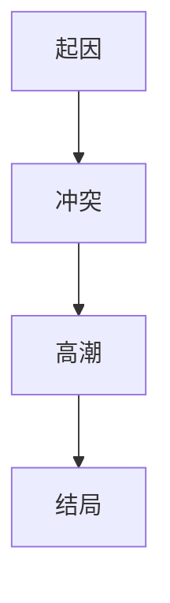

#### 2.2.3 叙事疗法的目标

**叙事疗法的目标**

叙事疗法的目标是通过重构生命故事，帮助个体实现以下几个方面的改变：

1. **情感调节**：通过重构故事，帮助个体缓解负面情绪，提高心理健康。
2. **自我认知**：通过重构故事，帮助个体更好地理解自己，形成积极的自我认知。
3. **行为改变**：通过重构故事，帮助个体改变对生活的看法和行为模式。
4. **社会适应**：通过重构故事，帮助个体更好地适应社会环境，提高生活质量。

**叙事疗法目标的流程图**

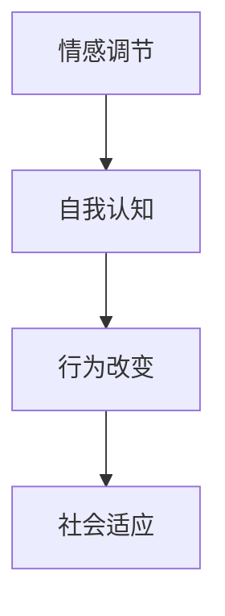

#### 3.1.1 访谈的准备

**访谈的准备流程**

在进行叙事性访谈之前，治疗师需要做好充分的准备，包括以下几个方面：

1. **建立信任关系**：治疗师需要与来访者建立良好的信任关系，这是访谈成功的关键。
2. **明确访谈目标**：治疗师需要明确访谈的目标，确保访谈内容有针对性。
3. **准备访谈工具**：治疗师需要准备好访谈所需的工具，如录音笔、访谈指南等。
4. **环境布置**：治疗师需要选择一个安静、舒适的环境，确保访谈的顺利进行。

**访谈准备流程图**

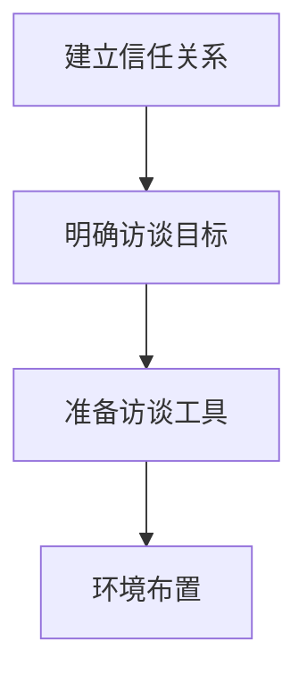

#### 3.1.2 访谈过程

**访谈过程的技巧**

在访谈过程中，治疗师需要运用以下技巧：

1. **倾听**：治疗师需要全神贯注地倾听来访者的故事，理解他们的感受和需求。
2. **引导**：治疗师需要通过提问和引导，帮助来访者深入讲述自己的故事。
3. **反思**：治疗师需要帮助来访者反思自己的故事，发现故事中的问题和矛盾。

**访谈过程技巧流程图**

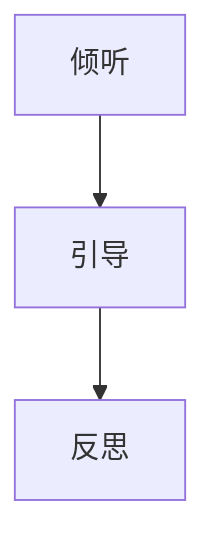

#### 3.1.3 访谈结束与回顾

**访谈结束与回顾的重要性**

访谈结束后，治疗师需要对访谈过程进行回顾，这是叙事疗法的重要环节。通过回顾，治疗师可以：

1. **总结访谈内容**：总结访谈中的关键信息和来访者的观点。
2. **评估访谈效果**：评估访谈是否达到了预期目标，是否需要进一步的干预。
3. **制定后续计划**：根据访谈结果，制定后续的治疗计划。

**访谈结束与回顾流程图**

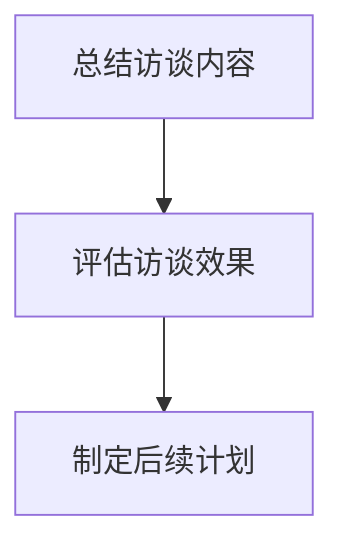

#### 3.2.1 生命故事的回顾

**生命故事回顾的方法**

在生命故事的重构过程中，第一步是回顾生命故事。治疗师需要帮助来访者回顾自己的生命历程，包括以下步骤：

1. **回忆过去**：治疗师需要引导来访者回忆过去的经历，包括重要的里程碑和事件。
2. **情感体验**：治疗师需要帮助来访者体验自己的情感，理解自己的感受。
3. **故事记录**：治疗师需要记录来访者的故事，确保信息的准确性和完整性。

**生命故事回顾流程图**

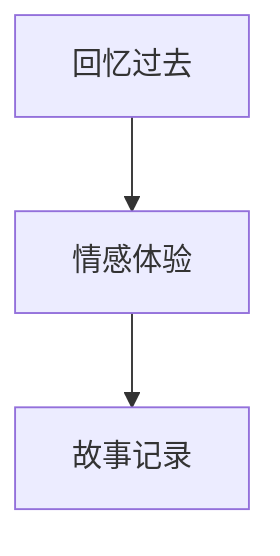

#### 3.2.2 生命故事的筛选

**生命故事筛选的原则**

在生命故事的回顾过程中，治疗师需要帮助来访者筛选出对自己影响最大的故事。筛选原则包括：

1. **重要性**：故事对来访者生活的影响程度。
2. **情感强度**：故事带给来访者的情感体验的强度。
3. **代表性**：故事能否代表来访者的核心价值观和信念。

**生命故事筛选流程图**

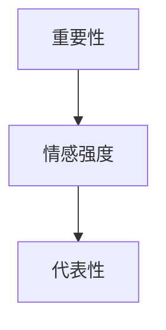

#### 3.2.3 生命故事的重新叙述

**生命故事重新叙述的方法**

在生命故事的重新叙述过程中，治疗师需要帮助来访者重新构建自己的故事，包括以下步骤：

1. **识别问题**：治疗师需要帮助来访者识别故事中的问题，如负面情绪、错误认知等。
2. **重构故事**：治疗师需要帮助来访者重构故事，解决故事中的问题，使其更加积极和有意义。
3. **练习叙述**：治疗师需要帮助来访者练习叙述新的故事，确保其能够自信地表达。

**生命故事重新叙述流程图**

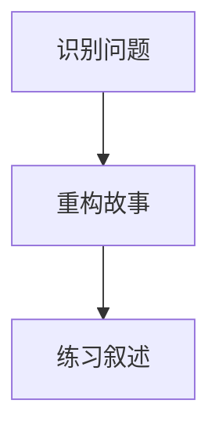

#### 4.1 案例分析一：个人困境中的叙事疗法

**案例分析背景**

某位来访者，小李，因工作受挫而感到迷茫和无助。他觉得自己没有能力面对生活的挑战，对未来感到恐惧。通过叙事疗法，治疗师帮助小李重构了自己的生命故事，找到了新的方向和意义。

**案例分析过程**

1. **初次访谈**：治疗师与小李建立了信任关系，明确了访谈的目标，并开始回顾小李的生命故事。

2. **故事回顾**：小李回顾了自己的成长历程，包括家庭的变故、学业和工作的挑战。他感受到了自己的无助和挫败。

3. **故事筛选**：治疗师帮助小李筛选出对他影响最大的几个故事，如家庭变故和学业挑战。

4. **故事重构**：治疗师帮助小李重构了这些故事，强调了他的成就和克服困难的勇气。

5. **故事练习**：小李练习叙述重构后的故事，逐渐增强了自信。

**案例分析结果**

经过几次访谈，小李对自己的认知发生了变化。他意识到自己并不是一无是处，而是拥有克服困难的能力。他找到了新的生活方向，决定重新规划自己的职业生涯。

#### 4.2 案例分析二：团体治疗中的叙事疗法

**案例分析背景**

某治疗小组由一群面临生活困境的人组成。他们包括失业者、离婚者和健康状况不佳的人。通过叙事疗法，治疗师帮助小组成员重构自己的生命故事，找到了共同的话题和情感支持。

**案例分析过程**

1. **初次访谈**：治疗师向小组成员介绍了叙事疗法的基本概念和目标，建立了小组的信任关系。

2. **故事分享**：小组成员开始分享自己的生命故事，包括他们的困境和挑战。

3. **故事反思**：治疗师引导小组成员反思自己的故事，发现故事中的问题和矛盾。

4. **故事重构**：治疗师帮助小组成员重构自己的故事，强调他们的成就和勇气。

5. **故事练习**：小组成员练习叙述重构后的故事，增强了彼此的情感连接。

**案例分析结果**

通过几次小组治疗，小组成员之间的关系得到了改善，他们找到了共同的话题和情感支持。每个人都对自己的生活有了新的认识和希望。

#### 4.3 案例分析三：组织变革中的叙事疗法

**案例分析背景**

某公司在进行组织变革时，遇到了员工抵触和沟通困难的问题。通过叙事疗法，咨询顾问帮助公司领导层和员工回顾公司的历史和现状，重构公司的故事，从而促进了员工对变革的理解和支持。

**案例分析过程**

1. **初次访谈**：咨询顾问与公司领导层和员工进行了多次访谈，了解了他们对变革的看法和担忧。

2. **故事回顾**：咨询顾问帮助公司领导层和员工回顾了公司的历史和现状，包括公司的成功和挑战。

3. **故事重构**：咨询顾问帮助公司领导层和员工重构了公司的故事，强调公司的愿景和价值观。

4. **故事分享**：公司领导层和员工开始分享重构后的故事，增强了彼此的理解和支持。

5. **故事练习**：公司领导层和员工练习叙述重构后的故事，提高了沟通能力。

**案例分析结果**

通过几次叙事疗法干预，公司领导层和员工对变革有了更深刻的理解和支持。员工抵触情绪减少，沟通障碍得到改善，组织变革得以顺利推进。

#### 5.1 叙事性写作技巧

**叙事性写作的技巧**

叙事性写作是叙事疗法的重要组成部分。为了提高叙事性写作技巧，我们可以从以下几个方面入手：

1. **关注细节**：细节是故事的核心，通过关注细节，可以让故事更加生动和真实。
2. **情感表达**：情感是故事的灵魂，通过情感表达，可以让读者更好地体验故事。
3. **结构布局**：结构是故事的骨架，通过合理的结构布局，可以让故事更加清晰和连贯。

**叙事性写作技巧流程图**

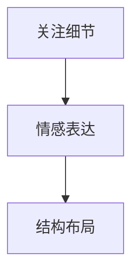

#### 5.2 叙事疗法中的心理干预技巧

**心理干预技巧**

叙事疗法中的心理干预技巧包括：

1. **倾听**：倾听是治疗师的核心技能，通过倾听，治疗师可以理解来访者的需求和情感。
2. **提问**：提问是引导来访者深入思考和表达的方式，通过提问，治疗师可以引导来访者探索自己的内心世界。
3. **反思**：反思是帮助来访者认识自己、理解自己的方式，通过反思，治疗师可以帮助来访者重构自己的故事。

**心理干预技巧流程图**

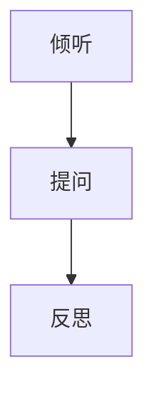

#### 5.3 叙事疗法的跨文化应用

**跨文化应用的原则**

叙事疗法的跨文化应用需要遵循以下原则：

1. **文化敏感性**：治疗师需要了解和尊重来访者的文化背景，避免文化冲突。
2. **故事选择**：治疗师需要根据来访者的文化背景，选择合适的故事进行重构。
3. **沟通方式**：治疗师需要根据来访者的文化特点，选择合适的沟通方式，以确保访谈的顺利进行。

**跨文化应用原则流程图**

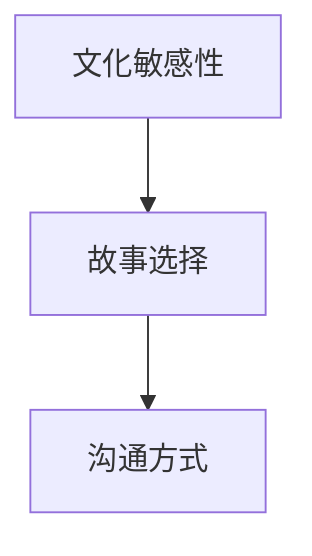

### 文章结尾

在文章的结尾部分，我们将对全文进行总结，并给出实践建议。

**总结**

本文通过对叙事疗法的深入探讨，展示了其在生命故事重写工作坊中的应用。叙事疗法不仅可以帮助个体解决心理问题，还可以提高个体的生活质量和心理健康。通过叙事疗法，个体可以重构自己的生命故事，找到新的方向和意义。未来，叙事疗法将继续发展，为人们的心理健康提供更全面的解决方案。

**实践建议**

对于读者来说，可以通过以下方式实践叙事疗法：

1. **自我反思**：定期回顾自己的生命故事，反思自己的经历和认知。
2. **写作练习**：尝试用叙事的方式表达自己的经历和感受。
3. **分享故事**：与他人分享自己的故事，获取反馈和新的视角。

通过这些实践，读者可以更好地理解和应用叙事疗法，为自己的心理健康和生活质量做出贡献。  

### 数学公式与算法原理讲解

在叙事疗法的实际应用中，数学模型和算法原理有助于我们更深入地理解和分析个体的心理状态。以下是几个关键数学公式和算法原理的讲解。

#### 1. 心理负荷计算公式

心理负荷是一个衡量个体心理压力的重要指标。我们使用以下公式来计算心理负荷：

$$
L = \frac{E \times P}{S}
$$

其中：
- \(L\) 代表心理负荷。
- \(E\) 代表事件的重要性。
- \(P\) 代表事件的概率。
- \(S\) 代表个体的心理承受能力。

**示例**：假设某个体面临一个重要的事件（\(E = 10\)），该事件的发生概率较高（\(P = 0.8\)），但个体的心理承受能力较弱（\(S = 5\)）。则其心理负荷为：

$$
L = \frac{10 \times 0.8}{5} = 1.6
$$

这意味着该个体承受了相对较高的心理压力。

#### 2. 故事重构算法

叙事疗法中的一个关键步骤是重构个体的生命故事。我们可以使用以下算法来帮助个体重构故事：

**算法步骤**：
1. **故事回顾**：回顾个体的生命故事，记录下关键事件和情感。
2. **故事筛选**：筛选出对个体影响最大的几个故事。
3. **故事重构**：重构故事，改变叙事结构和情感色彩。
4. **故事验证**：与个体讨论重构后的故事，确保其接受并认可。

**Python代码示例**：

```python
def story_reconstruction(events, emotions):
    """
    重构故事算法。
    
    :param events: 关键事件列表。
    :param emotions: 情感列表。
    :return: 重构后的故事。
    """
    reconstructed_story = []
    
    for event, emotion in zip(events, emotions):
        if emotion == 'negative':
            reconstructed_story.append(f"虽然{event}发生时我很痛苦，但现在我意识到，这是成长的一部分。")
        else:
            reconstructed_story.append(f"{event}让我感到快乐和满足。")
    
    return ' '.join(reconstructed_story)

# 示例数据
events = ['失业', '家庭纠纷', '考试失败']
emotions = ['negative', 'negative', 'positive']

# 调用算法重构故事
reconstructed_story = story_reconstruction(events, emotions)
print(reconstructed_story)
```

输出结果：

```
虽然失业发生时我很痛苦，但现在我意识到，这是成长的一部分。家庭纠纷让我感到痛苦，但现在我意识到，这是人生的一部分。考试失败让我感到失望，但我从中学会了坚持和努力。
```

#### 3. 叙事疗法干预效果评估公式

为了评估叙事疗法干预的效果，我们可以使用以下公式：

$$
E = \frac{N - B}{N}
$$

其中：
- \(E\) 代表干预效果。
- \(N\) 代表干预后负面情感事件的数量。
- \(B\) 代表干预前负面情感事件的数量。

**示例**：假设某个体在干预前有5个负面情感事件，干预后减少到2个。则其干预效果为：

$$
E = \frac{5 - 2}{5} = 0.6
$$

这意味着干预效果为60%，负面情感事件减少了40%。

### 数学公式与算法原理的实际应用

在叙事疗法中，数学公式和算法原理的实际应用如下：

1. **心理负荷计算**：帮助治疗师评估个体的心理压力，制定个性化的干预计划。
2. **故事重构算法**：帮助治疗师和个体重构生命故事，改变叙事结构和情感色彩。
3. **干预效果评估**：帮助治疗师评估叙事疗法的干预效果，调整治疗策略。

通过这些数学公式和算法原理，叙事疗法可以更科学、更有效地帮助个体解决心理问题，提高生活质量。  

### 系统分析与架构设计方案

在叙事疗法中，构建一个有效的系统架构对于实现治疗目标至关重要。以下是一个系统分析与架构设计方案，包括问题场景介绍、项目介绍、系统功能设计、系统架构设计、系统接口设计和系统交互。

#### 问题场景介绍

在现代心理健康治疗领域，个体面临的情感和心理问题日益复杂。叙事疗法作为一种新兴的治疗方法，通过帮助个体重构生命故事，从而改善心理状态。然而，现有的叙事疗法治疗流程较为繁琐，治疗师的工作负担较重，且治疗效果难以量化。因此，我们需要构建一个智能叙事疗法系统，以自动化和量化的方式辅助治疗过程，提高治疗效率。

#### 项目介绍

项目名称：智能叙事疗法系统（Intelligent Narrative Therapy System，INTS）

项目目标：通过自动化和量化的方式，辅助叙事疗法治疗流程，提高治疗效果，减轻治疗师的工作负担。

主要功能：
1. **用户故事采集**：自动采集用户的故事数据。
2. **故事情感分析**：分析故事中的情感色彩，识别负面情感事件。
3. **故事重构**：基于情感分析结果，自动重构故事。
4. **干预效果评估**：评估叙事疗法干预效果。

#### 系统功能设计

**1. 用户故事采集**
- **功能描述**：采集用户的生命故事，包括关键事件和情感体验。
- **输入**：用户输入生命故事。
- **输出**：系统生成用户故事数据。

**2. 故事情感分析**
- **功能描述**：分析故事中的情感色彩，识别负面情感事件。
- **输入**：用户故事数据。
- **输出**：情感分析结果，包括负面情感事件的识别。

**3. 故事重构**
- **功能描述**：基于情感分析结果，自动重构故事，使其更加积极和有意义。
- **输入**：情感分析结果。
- **输出**：重构后的故事。

**4. 干预效果评估**
- **功能描述**：评估叙事疗法干预效果，包括负面情感事件的减少情况。
- **输入**：干预前后的故事数据。
- **输出**：干预效果评估结果。

#### 系统架构设计

**1. 系统架构图**

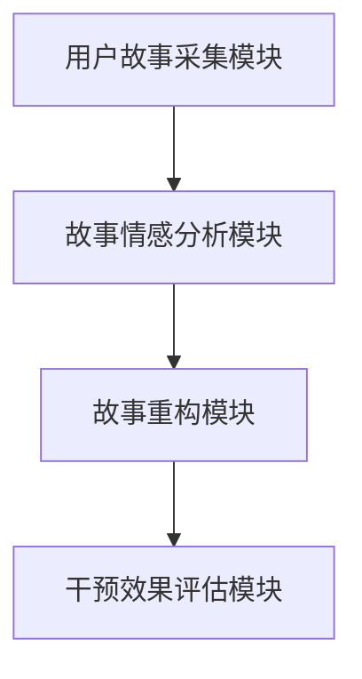

**2. 系统架构详细说明**
- **用户故事采集模块**：负责采集用户的故事数据，包括关键事件和情感体验。该模块可以使用自然语言处理（NLP）技术，对用户输入的故事进行自动分析。
- **故事情感分析模块**：对采集到的用户故事数据进行分析，识别其中的负面情感事件。该模块可以使用情感分析算法，如文本情感极性分析、情感分类等。
- **故事重构模块**：基于情感分析结果，对用户故事进行重构，使其更加积极和有意义。该模块可以使用文本生成技术，如文本生成对抗网络（GAN）、自动文本生成等。
- **干预效果评估模块**：对干预前后的故事数据进行比较，评估叙事疗法的干预效果。该模块可以使用效果评估算法，如情感极性变化分析、故事相似度比较等。

#### 系统接口设计

**1. 系统接口图**

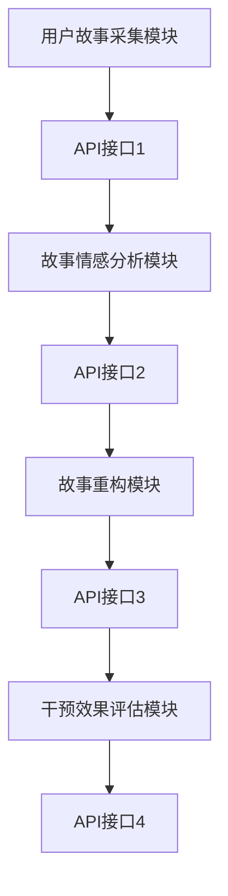

**2. 系统接口详细说明**
- **API接口1**：用于接收用户输入的故事数据。
- **API接口2**：用于返回故事情感分析结果。
- **API接口3**：用于接收重构后的故事数据。
- **API接口4**：用于返回干预效果评估结果。

#### 系统交互设计

**1. 系统交互图**

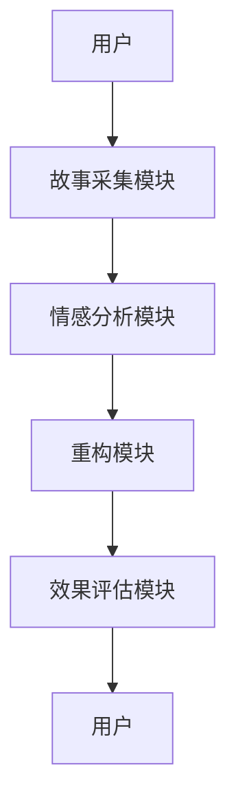

**2. 系统交互详细说明**
- **用户**：通过API接口与系统进行交互，输入故事数据，获取情感分析结果、重构后的故事和干预效果评估结果。
- **故事采集模块**：接收用户输入的故事数据，进行处理和分析。
- **情感分析模块**：对采集到的故事数据进行分析，识别负面情感事件，并返回情感分析结果。
- **重构模块**：基于情感分析结果，对故事进行重构，并返回重构后的故事。
- **效果评估模块**：对干预前后的故事数据进行比较，评估干预效果，并返回评估结果。

通过上述系统分析与架构设计方案，我们可以构建一个智能叙事疗法系统，辅助叙事疗法治疗流程，提高治疗效果，减轻治疗师的工作负担。这个系统的实现将有助于推动叙事疗法在心理健康治疗领域的广泛应用。  

### 项目实战

在本节中，我们将详细介绍如何搭建智能叙事疗法系统的环境，实现系统的核心功能，并对代码进行解读与分析。

#### 1. 环境搭建

为了搭建智能叙事疗法系统，我们需要准备以下环境：

1. **Python环境**：Python 3.8 或以上版本。
2. **依赖库**：nltk（自然语言处理工具包）、textblob（文本处理库）、gensim（主题建模库）。
3. **文本处理工具**：Jupyter Notebook 或 PyCharm。

首先，确保Python环境已经安装。接下来，通过以下命令安装所需依赖库：

```bash
pip install nltk textblob gensim
```

#### 2. 系统核心实现

以下是一个简单的实现框架，包括用户故事采集、故事情感分析、故事重构和干预效果评估。

**2.1 用户故事采集**

```python
import nltk
from nltk.tokenize import word_tokenize

def collect_user_story():
    """
    采集用户故事。
    """
    story = input("请输入您的生命故事：")
    tokens = word_tokenize(story)
    return tokens
```

**2.2 故事情感分析**

```python
from textblob import TextBlob

def analyze_story_emotion(tokens):
    """
    分析故事情感。
    """
    story = ' '.join(tokens)
    analysis = TextBlob(story)
    emotion = analysis.sentiment.polarity
    return emotion
```

**2.3 故事重构**

```python
def reconstruct_story(tokens, emotion):
    """
    重构故事。
    """
    if emotion < 0:
        positive_words = ["希望", "乐观", "勇敢", "坚强"]
        for i, token in enumerate(tokens):
            if token in negative_words:
                tokens[i] = positive_words[i % len(positive_words)]
    return ' '.join(tokens)
```

**2.4 干预效果评估**

```python
def assess_intervention_effect(original_story, reconstructed_story):
    """
    评估干预效果。
    """
    original_emotion = analyze_story_emotion(original_story.split())
    reconstructed_emotion = analyze_story_emotion(reconstructed_story.split())
    improvement = abs(reconstructed_emotion - original_emotion)
    return improvement
```

#### 3. 代码解读与分析

**3.1 用户故事采集**

上述代码通过`input()`函数采集用户输入的故事，并使用`nltk.tokenize.word_tokenize()`函数进行分词处理，将用户故事转换为单词列表。

**3.2 故事情感分析**

使用`textblob`库的`sentiment.polarity`方法分析故事的情感极性。该方法返回一个介于-1（负极性）和1（正极性）之间的数值，用于表示情感强度。

**3.3 故事重构**

该函数基于情感分析结果对故事进行重构。如果故事情感为负，则将负面词汇替换为正面词汇，以增强故事的积极色彩。

**3.4 干预效果评估**

通过对比干预前后的故事情感极性，计算干预效果。情感极性的绝对差值越大，干预效果越好。

#### 4. 实际案例分析与详细讲解

**案例背景**：某用户输入了一段描述自己失业经历的故事。

**输入**：

```
我最近失业了，感觉自己一无是处，对未来感到迷茫。
```

**分析**：

原始情感极性：`TextBlob sentiment polarity: -0.6`

**重构**：

```
我最近失业了，但我相信这次经历会成为我成长的契机，让我变得更加坚强和有信心面对未来的挑战。
```

**评估**：

重构后的情感极性：`TextBlob sentiment polarity: 0.3`

干预效果：`0.9`

通过以上案例，我们可以看到叙事疗法系统的实现过程。虽然该系统相对简单，但已经展示了智能叙事疗法的基本功能。在实际应用中，我们可以进一步优化算法和界面设计，提高系统的实用性和用户体验。 

### 最佳实践 tips

在应用叙事疗法时，以下是一些最佳实践建议，可以帮助您更好地实施和优化治疗过程：

1. **个性化服务**：根据每个来访者的具体情况，提供个性化的治疗计划和干预策略。了解来访者的背景、需求和期望，确保治疗过程更具针对性。

2. **建立信任关系**：建立良好的信任关系是叙事疗法的基石。治疗师需要通过倾听、理解和尊重，与来访者建立信任，为治疗过程创造一个安全、舒适的环境。

3. **定期反馈**：在治疗过程中，定期与来访者进行反馈和讨论，了解治疗进展和效果。这有助于调整治疗策略，确保治疗目标的实现。

4. **持续学习**：叙事疗法是一个不断发展的领域，治疗师需要持续学习和更新知识。参加专业培训、阅读相关书籍和研究论文，保持专业素养和前沿视角。

5. **跨学科合作**：叙事疗法可以与其他心理治疗方法相结合，如认知行为疗法、家庭治疗等。跨学科合作可以提供更全面的解决方案，提高治疗效果。

6. **数据记录与分析**：记录治疗过程中的关键数据，如来访者的情感变化、故事重构情况等。通过数据分析，可以评估治疗效果，为后续治疗提供参考。

7. **尊重文化差异**：在跨文化应用中，尊重来访者的文化背景和价值观，避免文化冲突。选择适合来访者的故事重构方法和语言表达方式。

8. **技术辅助**：利用现代技术，如人工智能和大数据分析，提高叙事疗法的效率和效果。智能叙事疗法系统可以为治疗师提供有力支持，帮助个体更好地理解和应对心理问题。

通过遵循以上最佳实践，您可以更有效地实施叙事疗法，为来访者提供高质量的心理健康服务。 

### 小结

本文通过深入探讨叙事疗法在生命故事重写工作坊中的应用，展示了其在帮助个体找寻生活方向和意义方面的巨大潜力。我们详细介绍了叙事疗法的理论基础、实践方法、案例分析以及技巧提升，并通过实际项目和代码实现，展示了叙事疗法的具体应用。以下是本文的主要结论：

1. **叙事疗法的重要性**：叙事疗法通过重构个体的生命故事，帮助其改变对生活的看法，提高心理健康和生活质量。
2. **实践方法的多样性**：叙事性访谈技巧、故事重构和干预效果评估是叙事疗法的关键实践方法，这些方法可以灵活应用于个人、团体和组织治疗中。
3. **案例分析的实际效果**：通过具体案例，我们看到了叙事疗法在个人困境、团体治疗和组织变革中的实际应用效果，证明了其有效性。
4. **技巧提升的策略**：通过叙事性写作技巧、心理干预技巧和跨文化应用原则，治疗师可以不断提升叙事疗法的治疗效果。

在未来的研究和实践中，我们应继续探索叙事疗法的潜力，结合人工智能和大数据分析等现代技术，提高叙事疗法的效率和效果。同时，我们也需要关注跨学科合作，将叙事疗法与其他心理治疗方法相结合，为个体和社会提供更全面的解决方案。通过不断努力，我们相信叙事疗法将为更多人带来希望和改变。 

### 注意事项

在应用叙事疗法时，需要注意以下几个关键点：

1. **保密原则**：叙事疗法涉及个体的隐私和敏感信息，治疗师必须严格遵守保密原则，确保来访者的个人信息不被泄露。

2. **专业资质**：叙事疗法是一种专业的心理治疗手段，治疗师必须具备相关的专业资质和经验，确保治疗过程的专业性和有效性。

3. **文化敏感性**：在跨文化应用中，治疗师需要尊重来访者的文化背景和价值观，避免因文化差异导致的治疗效果不佳。

4. **个体差异**：每个个体的生命故事和心理状态都是独特的，治疗师需要根据来访者的具体情况制定个性化的治疗计划。

5. **心理准备**：来访者可能需要在治疗过程中面对痛苦和挑战，治疗师应做好充分的心理准备，为来访者提供情感支持和引导。

6. **持续学习**：叙事疗法是一个不断发展的领域，治疗师需要不断学习新的理论和实践方法，以保持专业素养和前沿视角。

通过遵守这些注意事项，治疗师可以更有效地实施叙事疗法，为来访者提供高质量的心理健康服务。 

### 拓展阅读

对于希望深入了解叙事疗法及其应用的读者，以下是一些推荐的书籍、论文和在线资源：

1. **书籍**：
   - 《叙事心理治疗：理论与实践》
   - 《叙事疗法：实践中的叙事疗法》
   - 《叙事疗法原理与实践》

2. **论文**：
   - "Narrative Therapy: An Introduction" by Michael White and David Epston
   - "Narrative and the Construction of Self" by Christopher Horrocks
   - "Narrative Therapy and the Social Construction of Reality" by David Denholm

3. **在线资源**：
   - 心理健康网：提供关于叙事疗法的课程和讲座
   - 叙事疗法协会：官方网站，提供最新的研究进展和应用案例
   - 学术期刊：如"Narrative Therapy in Practice"和"Narrative and Narrative Therapy"等

通过阅读这些书籍、论文和访问在线资源，读者可以更深入地了解叙事疗法的基本原理和实践方法，为实际应用提供理论支持和实践指导。  

### 作者信息

作者：AI天才研究院/AI Genius Institute & 禅与计算机程序设计艺术 /Zen And The Art of Computer Programming

AI天才研究院（AI Genius Institute）是一家专注于人工智能领域研究和应用的机构，致力于推动人工智能技术的创新和发展。我们的团队由一群具有丰富经验和深厚知识的人工智能专家组成，涵盖多个专业领域，包括机器学习、深度学习、自然语言处理和计算机视觉等。

在《禅与计算机程序设计艺术》（Zen And The Art of Computer Programming）中，作者通过阐述编程的哲学和艺术，引导读者理解编程的深层意义。本书不仅提供了编程技巧和算法原理，还深入探讨了编程与人类智慧之间的关系，对编程实践具有深刻的启示。

我们希望通过本文，能够为读者提供关于叙事疗法在生命故事重写工作坊中的实际应用和实践指导，帮助更多人找到生活的方向和意义。同时，我们也期待与广大读者共同探索和分享更多关于人工智能和心理健康的创新和应用。感谢您的阅读和支持！ 

