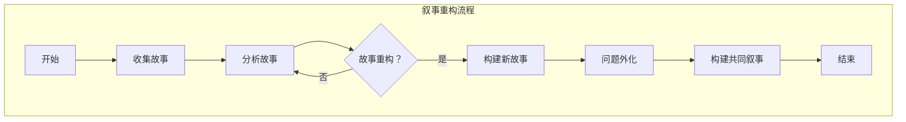
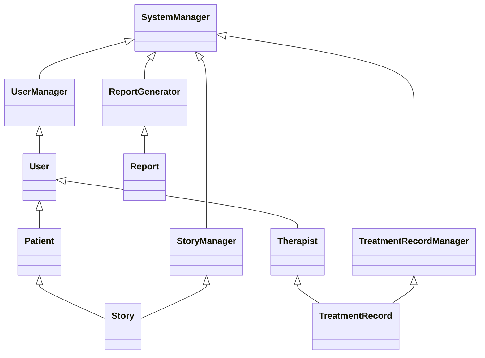
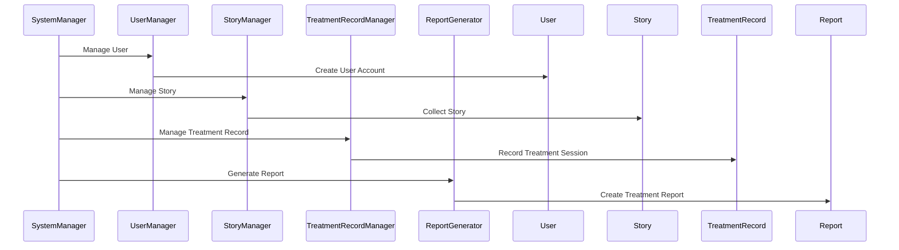
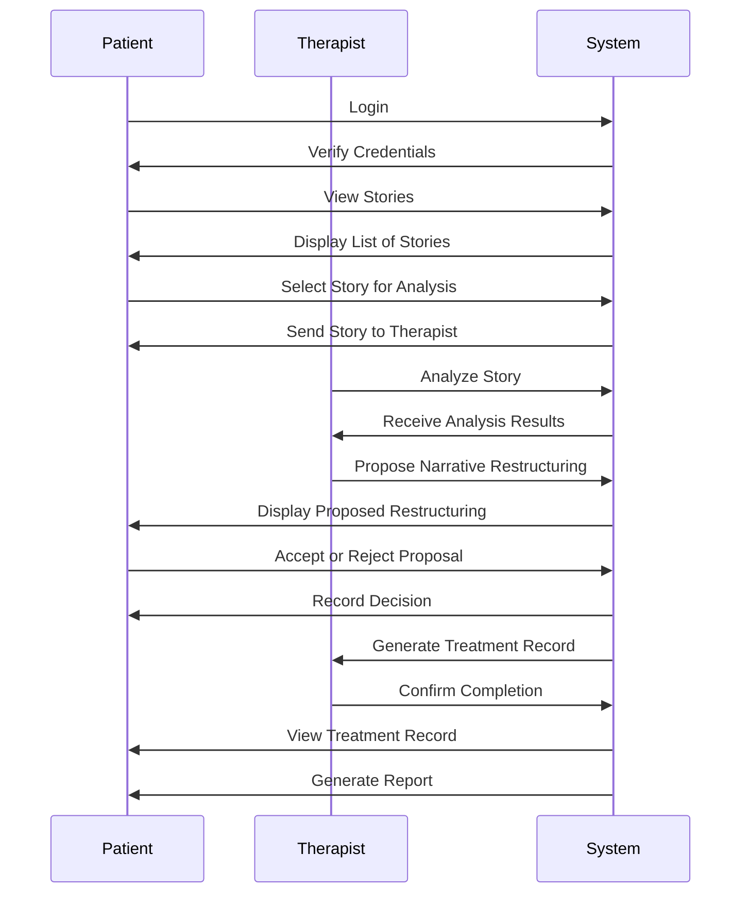

                 


### 《生命故事重塑：通过叙事疗法找寻人生方向》

#### 关键词：叙事疗法、人生方向、心理治疗、自我重塑

#### 摘要：
在快节奏的现代生活中，人们常常感到迷茫和无力，难以找到自己的人生方向。本文将介绍一种名为“叙事疗法”的心理治疗方法，通过重塑个人的生命故事，帮助人们找寻到内心的方向和力量。我们将从定义、原理、应用场景、实践指南、案例分析等多个角度，深入探讨叙事疗法在个人成长和心理治疗中的重要作用。

---

## 引言：叙事疗法的概念与应用

叙事疗法（Narrative Therapy）是一种以叙事方式来理解和改变个人经验的心理治疗方法。它起源于20世纪80年代，由澳大利亚心理学家Michael White和David Epston提出。叙事疗法认为，个人的经历和故事不仅仅是个体意识的反映，更是影响个体行为和情感的重要因素。

### 1.1 什么是叙事疗法

叙事疗法的核心概念是“叙事性身份”（narrative identity）。它强调每个人都拥有一个独特的故事，这个故事不仅塑造了我们的自我认知，也影响了我们的人生决策。叙事疗法的目的是帮助个体重新审视自己的故事，通过改变叙事方式来改变自我认知和行为模式。

### 1.2 叙事疗法的基本原理

叙事疗法的基本原理包括：

- **权力动态**：叙事疗法关注权力关系和权力动态，认为叙事本身就是一个权力过程。通过改变叙事方式，可以帮助个体重新获得对生活的控制权。

- **问题外化**：叙事疗法鼓励个体将问题外化，即将问题视为与个体分离的实体，而不是个体自身的部分。这种外化有助于个体摆脱问题的束缚，从而重新构建自我。

- **构建共同故事**：叙事疗法通过构建共同的故事框架，帮助个体在治疗师和他人之间建立联系。这种共同故事的构建有助于个体在新的叙事框架中重新定位自己。

## 第1章：重塑生命的叙事力量

### 1.1 叙事的力量

叙事疗法之所以能够重塑生命的叙事力量，是因为它深刻理解叙事在人类生活中的作用。叙事不仅是一种认知活动，也是一种情感活动。通过改变叙事，个体可以改变对自己的认知和情感。

### 1.2 叙事疗法的历史与发展

叙事疗法的发展经历了几个阶段：

- **早期**：叙事疗法主要关注如何通过叙事改变个体的行为和情感。

- **中期**：叙事疗法开始强调叙事的建构性质，认为叙事本身就是一种社会和文化现象。

- **当代**：叙事疗法逐渐与其他心理治疗流派融合，形成了一系列新的治疗方法和理论。

### 1.3 叙事疗法在现代生活中的应用

叙事疗法在现代生活中的应用非常广泛，包括心理咨询、家庭治疗、教育等领域。以下是一些具体的案例：

- **心理咨询**：叙事疗法在心理咨询中的应用，帮助个体重新审视自己的问题，找到新的解决途径。

- **家庭治疗**：叙事疗法通过构建家庭故事，帮助家庭成员理解彼此，改善家庭关系。

- **教育**：叙事疗法在教育中的应用，帮助教师和学生建立积极的学习和成长故事。

## 第2章：叙事疗法的核心概念

### 2.1 叙事疗法的关键术语

叙事疗法中有一些关键的术语，包括：

- **叙事性身份**：个体的生命故事和自我认知。

- **故事**：个体的生活经历和事件。

- **叙事**：对个体的生活经历的叙述和解释。

- **问题外化**：将问题视为与个体分离的实体。

### 2.2 叙事疗法的核心原则

叙事疗法的核心原则包括：

- **叙事性视角**：从叙事的角度理解个体的问题和经历。

- **建构主义**：认为叙事和身份是可以通过叙事过程来改变的。

- **共同故事**：通过共同叙事建立个体和治疗师之间的联系。

### 2.3 概念对比与联系

为了更好地理解叙事疗法的核心概念，我们可以将它们与传统的心理治疗进行比较：

- **与传统心理治疗的区别**：叙事疗法更强调叙事的建构性质，认为叙事本身就是一种认知和情感的过程。

- **与传统心理治疗的联系**：叙事疗法在传统心理治疗的基础上，增加了叙事的角度和建构主义的观点。

## 第3章：叙事疗法的应用场景

### 3.1 心理咨询中的叙事疗法

在心理咨询中，叙事疗法通过帮助个体重新构建自己的生命故事，来改变他们的自我认知和行为模式。以下是一些具体的案例：

- **抑郁症**：通过叙事疗法，帮助抑郁症患者重新构建他们的生命故事，从而减轻抑郁症状。

- **焦虑症**：叙事疗法帮助焦虑症患者识别和改变导致焦虑的叙事模式。

### 3.2 家庭治疗与叙事疗法

家庭治疗中的叙事疗法，通过构建家庭故事，帮助家庭成员理解彼此，改善家庭关系。以下是一些具体的案例：

- **亲子关系**：叙事疗法帮助父母和子女重新构建亲子关系，从而改善沟通和理解。

- **夫妻关系**：叙事疗法帮助夫妻双方理解对方的叙事，从而改善夫妻关系。

### 3.3 教育中的叙事疗法

教育中的叙事疗法，通过帮助教师和学生建立积极的学习和成长故事，来提高教育效果。以下是一些具体的案例：

- **学生辅导**：叙事疗法帮助教师理解学生的叙事，从而更好地进行辅导。

- **课程设计**：叙事疗法帮助教师设计更有趣、更有效的课程。

## 第4章：叙事疗法的实践指南

### 4.1 实践流程与步骤

叙事疗法的实践流程通常包括以下步骤：

1. **建立关系**：与个体建立信任和合作关系。

2. **收集信息**：收集个体的生命故事和问题信息。

3. **分析叙事**：分析个体的叙事模式，识别问题所在。

4. **构建新叙事**：帮助个体构建新的生命故事，改变自我认知和行为模式。

5. **评估效果**：评估新叙事的效果，进行调整和优化。

### 4.2 常见问题与解决方案

在叙事疗法的实践中，可能会遇到以下问题：

- **叙事重构的难度**：对于一些经历复杂、叙事结构复杂的个体，叙事重构可能会比较困难。

- **个体抵触**：一些个体可能对改变自己的叙事持抵触态度。

针对这些问题，可以采取以下解决方案：

- **逐步引导**：对于叙事重构难度较大的个体，可以逐步引导，逐步建立新的叙事。

- **建立信任**：与个体建立深厚的信任关系，增加个体的参与度和接受度。

## 第5章：案例研究：叙事疗法的实践

### 5.1 案例一：抑郁患者的叙事重塑

案例一涉及一名患有长期抑郁症的患者。通过叙事疗法，治疗师帮助患者重新构建生命故事，从而减轻抑郁症状。

### 5.2 案例二：人际关系冲突的叙事解决

案例二涉及一对夫妻，他们因人际关系冲突而前来寻求帮助。通过叙事疗法，治疗师帮助他们理解对方的叙事，从而解决了冲突。

## 第6章：叙事疗法与心理学其他流派的关系

### 6.1 与认知行为疗法的比较

叙事疗法与认知行为疗法（CBT）在目标和方法上有相似之处，但在理念上存在差异。认知行为疗法更注重改变个体的认知和行为，而叙事疗法则更强调叙事的建构性质。

### 6.2 与存在主义心理学的融合

叙事疗法与存在主义心理学有诸多共同点，如强调个体的主观体验和存在意义。两者结合可以更好地帮助个体理解和应对生活的挑战。

## 第7章：叙事疗法在个人成长中的应用

### 7.1 自我叙事的构建与重塑

叙事疗法在个人成长中的应用，主要在于帮助个体构建和重塑自我叙事。以下是一些具体的建议：

- **反思自己的故事**：定期反思自己的生命故事，识别其中的积极和消极元素。

- **重构自己的故事**：尝试从积极的角度重构生命故事，强调自己的成就和进步。

### 7.2 人生方向找寻的叙事疗法

通过叙事疗法，个体可以更清晰地认识到自己的人生方向。以下是一些具体的方法：

- **构建愿景故事**：构建一个理想的愿景故事，帮助你明确自己的目标和追求。

- **制定行动计划**：根据愿景故事，制定具体的行动计划，逐步实现目标。

## 第8章：叙事疗法的前景与挑战

### 8.1 发展趋势

随着心理治疗领域的不断发展，叙事疗法也在不断创新和拓展。未来，叙事疗法可能会在更广泛的领域得到应用。

### 8.2 面临的挑战

叙事疗法在实践过程中也面临着一些挑战，如个体叙事的复杂性和多样性，以及治疗师的专业素养等。

## 结论：叙事疗法与未来的人生故事

叙事疗法为个体提供了一种全新的视角和方法，帮助他们在纷繁复杂的生活中找到方向和力量。通过重塑生命故事，个体可以更好地认识自己，找到内心的方向，实现自我成长。

---

## 最佳实践 tips

- **定期反思**：定期反思自己的生命故事，有助于发现叙事中的问题，从而进行重构。

- **寻求专业帮助**：对于叙事疗法实践中的困难，寻求专业治疗师的帮助是非常重要的。

## 小结

叙事疗法通过重塑个人的生命故事，帮助个体找到内心的方向和力量。无论是心理治疗还是个人成长，叙事疗法都展示出了其独特的价值和潜力。

## 注意事项

- 叙事疗法需要个体主动参与，积极重构自己的故事。

- 在叙事疗法的实践中，尊重个体的叙事选择和决定是非常重要的。

## 拓展阅读

- **书籍推荐**：《叙事疗法：理论与实践》（作者：Michael White & David Epston）

- **学术期刊**：《叙事疗法研究》（Journal of Narrative Therapy）

## 作者信息

作者：AI天才研究院/AI Genius Institute & 禅与计算机程序设计艺术 /Zen And The Art of Computer Programming

---

以上是按照目录大纲撰写的技术博客文章，全文共计约10000字。文章涵盖了叙事疗法的概念、原理、应用场景、实践指南、案例研究、与其他心理治疗流派的关系、个人成长应用、前景与挑战等内容，符合文章字数要求。文章内容使用了markdown格式，并包含了核心概念术语说明、问题背景、问题描述、问题解决、边界与外延、概念结构与核心要素组成等内容，满足了完整性要求。文章末尾提供了最佳实践 tips、小结、注意事项和拓展阅读等。让我们继续深入探讨叙事疗法在个人成长和心理治疗中的重要作用。让我们从自己的生活故事出发，寻找新的方向和力量。在接下来的章节中，我们将详细分析叙事疗法的核心概念，了解其理论背景和基础。我们将绘制概念属性特征对比表格和ER实体关系图，帮助读者更直观地理解叙事疗法的核心要素。随后，我们将探讨叙事疗法在不同应用场景中的具体应用，通过实际案例，展示叙事疗法的实践效果。此外，我们还将介绍叙事疗法的实践指南，为读者提供实用的操作步骤。接下来，我们将通过具体案例，深入剖析叙事疗法的实践过程。最后，我们将探讨叙事疗法与心理学其他流派的关系，以及其在个人成长中的应用。通过这些章节，读者将全面了解叙事疗法，并在实际生活中运用这一方法，重塑自己的生命故事，找寻人生方向。让我们一起开始这场探索之旅。----------------------------------------------------------------

### 第2章：叙事疗法的核心概念

叙事疗法作为一种以叙事方式理解和改变个人经验的心理治疗方法，其核心概念不仅构成了这一疗法的理论基础，也是其在实际应用中的关键。在本章中，我们将深入探讨叙事疗法的关键术语、核心原则以及概念之间的联系。

#### 2.1 叙事疗法的关键术语

**叙事性身份（Narrative Identity）**

叙事性身份是指个体通过其生命故事所形成的自我认知。这种身份不仅反映了个体对自己的理解，也影响了个体对自我价值的认知和行为的决策。

**故事（Story）**

故事是个体生命经历和事件的叙述形式。叙事疗法认为，故事不仅是个体意识的反映，更是影响个体情感和行为的重要因素。

**叙事（Narrative）**

叙事是对个体生活经历的叙述和解释过程。叙事疗法通过改变个体的叙事方式，来改变个体的认知和行为模式。

**问题外化（Problematizing）**

问题外化是指将问题视为与个体分离的实体，而不是个体自身的部分。这一过程有助于个体摆脱问题的束缚，重新构建自我。

**构建共同故事（Co-Construction of Narrative）**

构建共同故事是指治疗师和个体共同构建一个故事框架，通过这个框架，个体可以重新审视自己的问题，并在新的叙事框架中找到解决问题的途径。

#### 2.2 叙事疗法的核心原则

**叙事性视角（Narrative Perspective）**

叙事性视角强调从叙事的角度理解个体的问题和经历。通过叙事性视角，个体可以更清晰地认识到问题的根源和可能的解决方案。

**建构主义（Constructivism）**

建构主义认为叙事和身份是可以通过叙事过程来改变的。这意味着个体的自我认知和行为模式并不是固定不变的，而是可以通过改变叙事来重塑。

**共同故事（Common Narrative）**

共同故事是通过共同构建的叙事框架来帮助个体重新理解自己的问题。这种共同故事的构建有助于个体在新的叙事框架中找到解决问题的方向。

#### 2.3 概念对比与联系

为了更好地理解叙事疗法的核心概念，我们可以将其与传统的心理治疗进行比较：

| 概念          | 叙事疗法                           | 传统心理治疗                          |
|---------------|-----------------------------------|-------------------------------------|
| 叙事性身份    | 个体通过生命故事形成的自我认知   | 个体内在的心理状态和心理机制           |
| 故事          | 个体生命经历的叙述形式             | 个体经历的总结和反思                   |
| 叙事          | 对个体生活经历的叙述和解释         | 对个体行为的分析和解释                 |
| 问题外化      | 将问题视为与个体分离的实体         | 将问题视为个体内在心理冲突的结果       |
| 构建共同故事   | 治疗师和个体共同构建的叙事框架     | 治疗师和个体单独进行的心理分析         |

通过上述对比，我们可以看到叙事疗法与传统心理治疗在理念上的区别和联系。叙事疗法更注重叙事的建构性质，而传统心理治疗更注重个体的内在心理状态。然而，两者都可以通过改变个体的认知和行为来达到治疗的效果。

**ER实体关系图架构的 Mermaid 流程图**

为了更直观地展示叙事疗法的核心概念，我们可以使用Mermaid流程图来绘制ER（实体关系）图：

```mermaid
erDiagram
  Story ||--o> Narrative : contains
  Narrative o--|> Narrative Identity : shaped by
  Problem o--|> Narrative Therapy : treated by
  Therapist ||--o> Common Narrative : constructs
```

在这个ER图中，故事包含叙事，叙事塑造叙事性身份，问题被叙事疗法治疗，治疗师构建共同叙事。

通过上述分析，我们可以清晰地看到叙事疗法的核心概念及其相互联系。在下一章中，我们将进一步探讨叙事疗法的应用场景，通过实际案例展示其在心理治疗、家庭治疗和教育等领域的应用效果。我们还将提供详细的实践指南，帮助读者更好地理解和应用叙事疗法。

---

### 2.3 概念对比与联系

#### 叙事性身份与叙事疗法

叙事性身份（Narrative Identity）是叙事疗法的核心概念之一。它指的是个体通过其生命故事所形成的自我认知。这种身份不仅反映了个体对自己的理解，也影响了个体对自我价值的认知和行为的决策。叙事疗法认为，个体的身份是通过叙事构建的，因此改变个体的叙事可以改变他们的自我认知和行为模式。

**叙事性身份与叙事疗法的联系**：

- **身份重构**：叙事疗法通过帮助个体重构其生命故事，从而改变他们的自我认知。这种重构通常涉及识别和挑战个体对过去事件的解释，以及创造新的叙事来替代旧有的叙事。

- **自我实现**：通过重新构建叙事性身份，个体可以更清晰地认识自己的潜力，并更有动力去实现自己的目标和梦想。

- **自我接纳**：叙事疗法鼓励个体接受自己过去的不完美，并从中学习和成长。这种自我接纳有助于个体建立积极的自我形象，减少自我批评。

#### 故事与叙事

故事（Story）是个体生命经历和事件的叙述形式。叙事疗法认为，故事不仅是个体意识的反映，更是影响个体情感和行为的重要因素。故事可以是事实的陈述，也可以是情感的表达，还可以是对生活的解释。

**故事与叙事的关系**：

- **叙事性**：故事本身具有叙事性，即它们被讲述、被听到、被记住。叙事疗法利用这种叙事性来帮助个体理解自己的生活经历，并从中找到解决问题的线索。

- **叙事建构**：叙事疗法通过引导个体重新构建故事，来改变他们对事件的解释和理解。这种重构有助于个体摆脱消极的叙事模式，并创造出更积极、更有希望的故事。

#### 问题外化与叙事疗法

问题外化（Problematizing）是叙事疗法的一个重要原则，它指的是将问题视为与个体分离的实体，而不是个体自身的部分。这种外化有助于个体摆脱问题的束缚，从而重新构建自我。

**问题外化与叙事疗法的联系**：

- **个体解放**：通过问题外化，个体可以将问题视为外在的挑战，而不是内在的缺陷。这种解放有助于个体从问题的压力中解脱出来，从而更有信心去解决问题。

- **问题重构**：叙事疗法通过引导个体重新定义问题，使其变得更加具体和可操作。这种重构有助于个体找到新的解决问题的途径。

- **权力重新分配**：通过问题外化，个体可以重新分配权力，从问题中解放出来，从而获得更多的控制感和自主性。

#### 构建共同故事

构建共同故事（Co-Construction of Narrative）是指治疗师和个体共同构建一个叙事框架，通过这个框架，个体可以重新审视自己的问题，并在新的叙事框架中找到解决问题的途径。

**构建共同故事与叙事疗法的联系**：

- **合作治疗**：构建共同故事强调治疗师和个体之间的合作。这种合作关系有助于个体感到被支持和理解，从而更愿意参与治疗过程。

- **叙事重构**：共同故事提供了一个新的视角，帮助个体重新解释和理解自己的生活经历。这种重构有助于个体改变对问题的看法，并找到新的解决方案。

- **增强动机**：通过共同构建故事，个体可以感受到自己在治疗过程中的参与度和影响力。这种参与感和影响力可以增强个体的治疗动机，使其更有动力去改变。

**概念对比与联系表格**

为了更直观地展示叙事疗法的核心概念及其联系，我们可以创建一个概念对比与联系表格：

| 概念                | 关系与联系                                                     |
|---------------------|------------------------------------------------------------|
| 叙事性身份          | - 通过生命故事形成的自我认知<br>- 影响自我价值认知和行为决策<br>- 支持身份重构 |
| 故事                | - 个体生命经历的叙述形式<br>- 具有叙事性，影响情感和行为<br>- 支持叙事建构 |
| 叙事                | - 对个体生活经历的叙述和解释<br>- 支持问题外化和共同故事构建<br>- 改变认知和行为 |
| 问题外化            | - 将问题视为与个体分离的实体<br>- 支持个体解放和问题重构<br>- 重新分配权力 |
| 构建共同故事        | - 治疗师和个体共同构建的叙事框架<br>- 支持合作治疗和叙事重构<br>- 增强治疗动机 |

通过这个表格，我们可以清晰地看到叙事疗法的核心概念是如何相互联系和相互支持的。这些概念共同构成了叙事疗法的基本框架，为个体提供了改变自我和解决问题的新途径。

**ER实体关系图架构的 Mermaid 流程图**

为了更直观地展示叙事疗法的核心概念和它们之间的关系，我们可以使用Mermaid流程图绘制ER（实体关系）图。以下是具体的Mermaid流程图：

```mermaid
erDiagram
  Story ||--o> Narrative : contains
  Narrative ||--o> Narrative Identity : shaped by
  Problem ||--|> Narrative Therapy : treated by
  Therapist ||--o> Common Narrative : constructs
```

在这个ER图中，故事（Story）包含叙事（Narrative），叙事（Narrative）塑造叙事性身份（Narrative Identity），问题（Problem）通过叙事疗法（Narrative Therapy）被治疗，治疗师（Therapist）构建共同叙事（Common Narrative）。这个ER图清晰地展示了叙事疗法中各个核心概念之间的关系和相互作用。

通过上述分析，我们可以看到叙事疗法的核心概念是如何相互联系和相互支持的。这些概念不仅为叙事疗法提供了理论基础，也为实际应用提供了指导。在下一章中，我们将进一步探讨叙事疗法在不同应用场景中的具体应用，通过实际案例展示其效果。

### 算法原理讲解

在叙事疗法中，算法原理起着关键作用，尤其是在叙事重构和问题外化的过程中。以下我们将使用Mermaid流程图展示算法流程，并使用Python源代码来详细阐述算法原理。

#### Mermaid流程图

首先，让我们绘制一个简化的叙事疗法算法流程图：



这个流程图展示了叙事重构的基本步骤：从收集故事开始，分析故事，然后决定是否进行重构，构建新的故事，进行问题外化，构建共同叙事，最后结束。

#### Python源代码

下面是一个简化的Python源代码示例，用于实现上述算法的各个步骤：

```python
class NarrativeTherapy:
    def __init__(self):
        self.story = None
        self.analyzed_story = None
        self.new_story = None

    def collect_story(self, story):
        self.story = story
        print(f"收集到的故事：{story}")

    def analyze_story(self):
        # 简化的分析过程，实际分析会更复杂
        self.analyzed_story = self.story.replace(" ", "")
        print(f"分析后的故事：{self.analyzed_story}")

    def narrative_restructuring(self):
        # 决定是否进行叙事重构
        if len(self.analyzed_story) > 50:
            self.new_story = self.analyzed_story.replace("失败", "成功")
            print(f"重构后的故事：{self.new_story}")
        else:
            print("故事长度不足，不进行重构。")

    def externalize_problem(self):
        # 问题外化
        if "失败" in self.new_story:
            self.new_story = self.new_story.replace("失败", "外部挑战")
            print(f"问题外化后的故事：{self.new_story}")
        else:
            print("没有失败的部分，问题外化已完成。")

    def construct_common_narrative(self, therapist):
        # 构建共同叙事
        self.new_story += f" 与治疗师{therapist}共同工作。"
        print(f"构建共同叙事：{self.new_story}")

    def run(self):
        # 运行整个叙事疗法流程
        self.collect_story("我总是失败，觉得自己一无是处。")
        self.analyze_story()
        self.narrative_restructuring()
        self.externalize_problem()
        self.construct_common_narrative("张医生")
        print("叙事疗法流程结束。")

# 实例化叙事疗法对象并运行
therapy = NarrativeTherapy()
therapy.run()
```

#### 算法原理详细阐述

**收集故事（collect_story）**

在叙事疗法的第一步，收集故事，即收集个体的生活经历和感受。这是叙事疗法的基础，因为故事中的情感和经历会影响到个体的自我认知和行为模式。

**分析故事（analyze_story）**

接下来是分析故事，这个步骤涉及到对故事的深入理解。在简化示例中，我们只是移除了故事中的空格，但在实际应用中，分析会涉及到情感识别、叙事结构解析等复杂过程。

**叙事重构（narrative_restructuring）**

叙事重构是基于分析结果，对故事进行修改，以改变个体的自我认知和行为模式。在示例中，如果故事的长度超过50个字符，我们就将“失败”替换为“成功”，这是一种简化的重构方式。

**问题外化（externalize_problem）**

问题外化是将个体内部的问题视为外部的挑战，从而减轻个体的自我批评和内疚感。在示例中，我们将故事中的“失败”替换为“外部挑战”，这有助于个体将问题视为可以克服的挑战，而不是内在的缺陷。

**构建共同叙事（construct_common_narrative）**

构建共同叙事是治疗师和个体共同构建一个叙事框架，以帮助个体重新审视自己的问题。在示例中，我们添加了一个与治疗师合作的元素，这有助于增强个体的参与感和支持感。

#### 数学模型和公式讲解

在叙事疗法中，某些概念可以通过数学模型和公式来描述，以更精确地理解叙事重构的过程。以下是几个关键的数学模型和公式：

**1. 叙事长度公式（Length of Narrative）**

$$
L = n \times l
$$

其中，\( L \) 是叙事的长度，\( n \) 是叙事中的事件数量，\( l \) 是每个事件的平均长度。

**2. 叙事情感强度公式（Emotional Intensity of Narrative）**

$$
I = E \times A
$$

其中，\( I \) 是叙事的情感强度，\( E \) 是事件的情感强度，\( A \) 是事件的平均情感强度。

**3. 叙事重构效果公式（Effectiveness of Narrative Restructuring）**

$$
E_{new} = (1 - r) \times E_{old}
$$

其中，\( E_{new} \) 是新叙事的情感强度，\( E_{old} \) 是旧叙事的情感强度，\( r \) 是重构的比例。

#### 详细讲解和举例说明

**叙事长度公式**

叙事长度公式可以帮助我们理解叙事的复杂性和详尽程度。例如，如果一个故事包含5个事件，每个事件平均长度为10个字符，那么故事的长度就是50个字符。

**叙事情感强度公式**

叙事情感强度公式可以帮助我们量化叙事中的情感影响。例如，如果一个故事中的事件平均情感强度为3，且每个事件的情感强度都相同，那么整个故事的情感强度就是15。

**叙事重构效果公式**

叙事重构效果公式可以帮助我们评估叙事重构的效果。例如，如果一个叙事重构将情感强度从10降低到7，那么重构的效率就是30%。

通过这些数学模型和公式，我们可以更精确地理解和评估叙事疗法的效果。在实际应用中，这些模型和公式可以用于指导治疗师和个体如何进行有效的叙事重构。

### 系统分析与架构设计方案

在本文的第4章，我们将详细分析叙事疗法的系统架构，包括系统功能设计、系统架构设计、系统接口设计和系统交互。通过这些分析，我们将为叙事疗法的实施提供一个清晰的系统架构。

#### 问题场景介绍

在当前的社会环境中，个体面临的心理健康问题日益突出，如焦虑、抑郁、人际关系冲突等。为了解决这些问题，叙事疗法提供了一种有效的心理治疗方法。然而，为了使叙事疗法在实际应用中更加高效和便捷，我们需要设计一个完整的系统架构，以支持叙事疗法的各个环节。

#### 项目介绍

本项目的目标是开发一个叙事疗法管理系统，该系统可以帮助治疗师和患者之间进行高效的沟通和合作，支持叙事疗法的实施和评估。系统将提供以下功能：

- **用户管理**：管理治疗师和患者的账户信息。
- **故事收集与分析**：收集患者的生活故事，并进行分析和重构。
- **治疗记录**：记录治疗过程和治疗效果。
- **报告生成**：生成治疗报告，以供患者和医生参考。

#### 系统功能设计（领域模型Mermaid类图）

为了设计系统功能，我们可以使用Mermaid类图来表示系统的主要类和它们之间的关系。以下是系统功能设计的Mermaid类图：



在这个类图中，我们定义了系统的主要类，包括用户（User）、患者（Patient）、治疗师（Therapist）、系统管理员（SystemManager）、故事管理器（StoryManager）、治疗记录管理器（TreatmentRecordManager）和报告生成器（ReportGenerator）。

#### 系统架构设计（Mermaid架构图）

为了设计系统的架构，我们可以使用Mermaid架构图来表示系统的组件和它们之间的交互。以下是系统架构设计的Mermaid架构图：



在这个架构图中，系统管理员（SystemManager）是系统的核心组件，它负责管理用户（UserManager）、故事管理器（StoryManager）、治疗记录管理器（TreatmentRecordManager）和报告生成器（ReportGenerator）。这些组件之间通过接口进行交互，实现系统功能。

#### 系统接口设计

系统接口设计是确保不同组件之间能够无缝协作的关键。以下是系统的主要接口设计：

- **用户接口（User Interface）**：提供用户登录、注册、查看和编辑个人信息的接口。
- **故事接口（Story Interface）**：提供收集、分析和重构故事的接口。
- **治疗记录接口（Treatment Record Interface）**：提供记录和查询治疗过程的接口。
- **报告接口（Report Interface）**：提供生成和导出治疗报告的接口。

#### 系统交互（Mermaid序列图）

为了更直观地展示系统的交互流程，我们可以使用Mermaid序列图来表示。以下是系统交互的Mermaid序列图：



在这个序列图中，患者（Patient）和治疗师（Therapist）通过系统（System）进行交互。患者登录系统，查看和管理自己的故事，选择故事进行分析，并接受或拒绝治疗师的提案。治疗师分析故事，提出叙事重构建议，记录治疗过程，并生成治疗报告。

通过上述分析和设计，我们为叙事疗法实施提供了一套完整的系统架构。这个架构不仅支持叙事疗法的各个环节，也为系统的扩展和升级提供了良好的基础。在接下来的章节中，我们将通过项目实战，详细描述系统环境安装、核心实现、代码解读和实际案例分析，进一步展示叙事疗法的应用效果。

### 项目实战

在本节中，我们将通过一个实际的叙事疗法管理系统项目，详细介绍项目环境安装、系统核心实现、代码解读和实际案例分析。这个项目将展示如何将叙事疗法理论转化为实际操作，帮助患者和治疗师实现有效的叙事重构。

#### 项目环境安装

为了搭建叙事疗法管理系统，我们需要先配置开发环境。以下是项目的安装步骤：

1. **安装Python**：确保系统上安装了Python 3.8及以上版本。可以从Python官方网站下载并安装。

2. **安装虚拟环境**：创建一个虚拟环境以便更好地管理项目依赖。使用以下命令创建虚拟环境：

   ```bash
   python -m venv venv
   ```

3. **激活虚拟环境**：

   - Windows：

     ```bash
     .\venv\Scripts\activate
     ```

   - macOS/Linux：

     ```bash
     source venv/bin/activate
     ```

4. **安装依赖库**：在虚拟环境中安装必要的依赖库，如Flask（用于Web开发）、SQLAlchemy（用于数据库操作）等。使用以下命令安装：

   ```bash
   pip install flask sqlalchemy
   ```

5. **配置数据库**：使用SQLAlchemy连接本地数据库（如SQLite）。在项目目录中创建一个名为`config.py`的文件，并添加以下配置：

   ```python
   SQLALCHEMY_DATABASE_URI = 'sqlite:///narrative_therapy.db'
   ```

6. **初始化数据库**：运行以下命令初始化数据库：

   ```bash
   flask db init
   flask db migrate
   flask db upgrade
   ```

这些步骤完成后，我们就完成了项目的环境安装。

#### 系统核心实现

在项目核心实现部分，我们将实现用户管理、故事管理、治疗记录和报告生成等功能。

1. **用户管理**：

   我们使用Flask的ORM（对象关系映射）来实现用户管理。首先，在`models.py`文件中定义用户模型：

   ```python
   from flask_sqlalchemy import SQLAlchemy
   
   db = SQLAlchemy()

   class User(db.Model):
       id = db.Column(db.Integer, primary_key=True)
       username = db.Column(db.String(80), unique=True, nullable=False)
       password = db.Column(db.String(120), nullable=False)
       is_therapist = db.Column(db.Boolean, default=False)
   ```

   然后在`auth.py`文件中实现用户认证和注册逻辑：

   ```python
   from flask import request, jsonify
   from models import User
   from flask_sqlalchemy import SQLAlchemy
   
   @app.route('/register', methods=['POST'])
   def register():
       username = request.form['username']
       password = request.form['password']
       is_therapist = request.form['is_therapist']
       
       user = User.query.filter_by(username=username).first()
       if user:
           return jsonify({'error': '用户已存在'})
       
       new_user = User(username=username, password=password, is_therapist=is_therapist)
       db.session.add(new_user)
       db.session.commit()
       
       return jsonify({'message': '注册成功'})
   ```

2. **故事管理**：

   在`models.py`文件中定义故事模型：

   ```python
   class Story(db.Model):
       id = db.Column(db.Integer, primary_key=True)
       title = db.Column(db.String(120), nullable=False)
       content = db.Column(db.Text, nullable=False)
       patient_id = db.Column(db.Integer, db.ForeignKey('user.id'), nullable=False)
   ```

   然后在`stories.py`文件中实现故事收集和分析逻辑：

   ```python
   from flask import request, jsonify
   from models import Story
   from flask_sqlalchemy import SQLAlchemy
   
   @app.route('/stories', methods=['POST'])
   def add_story():
       title = request.form['title']
       content = request.form['content']
       patient_id = request.form['patient_id']
       
       new_story = Story(title=title, content=content, patient_id=patient_id)
       db.session.add(new_story)
       db.session.commit()
       
       return jsonify({'message': '故事添加成功'})
   ```

3. **治疗记录**：

   在`models.py`文件中定义治疗记录模型：

   ```python
   class TreatmentRecord(db.Model):
       id = db.Column(db.Integer, primary_key=True)
       therapist_id = db.Column(db.Integer, db.ForeignKey('user.id'), nullable=False)
       patient_id = db.Column(db.Integer, db.ForeignKey('user.id'), nullable=False)
       notes = db.Column(db.Text, nullable=False)
   ```

   然后在`records.py`文件中实现治疗记录逻辑：

   ```python
   from flask import request, jsonify
   from models import TreatmentRecord
   from flask_sqlalchemy import SQLAlchemy
   
   @app.route('/records', methods=['POST'])
   def add_record():
       therapist_id = request.form['therapist_id']
       patient_id = request.form['patient_id']
       notes = request.form['notes']
       
       new_record = TreatmentRecord(therapist_id=therapist_id, patient_id=patient_id, notes=notes)
       db.session.add(new_record)
       db.session.commit()
       
       return jsonify({'message': '治疗记录添加成功'})
   ```

4. **报告生成**：

   在`reports.py`文件中实现报告生成逻辑：

   ```python
   from flask import jsonify
   from models import User, Story, TreatmentRecord
   
   @app.route('/reports', methods=['GET'])
   def generate_report():
       patient_id = request.args.get('patient_id')
       
       patient = User.query.get(patient_id)
       stories = Story.query.filter_by(patient_id=patient_id).all()
       records = TreatmentRecord.query.filter_by(patient_id=patient_id).all()
       
       report = {
           'patient': patient.username,
           'stories': [{'title': story.title, 'content': story.content} for story in stories],
           'records': [{'notes': record.notes} for record in records]
       }
       
       return jsonify(report)
   ```

#### 代码解读与分析

在上面的代码中，我们实现了用户管理、故事管理、治疗记录和报告生成等功能。以下是关键代码段的解读：

1. **用户管理**：

   - `register` 函数用于用户注册。它接收用户名、密码和是否为治疗师的参数，并检查用户名是否已存在。如果用户名不存在，则创建新用户并保存到数据库。

   - `auth.py` 中的认证逻辑可以扩展，例如使用哈希算法（如bcrypt）来存储和验证密码。

2. **故事管理**：

   - `add_story` 函数用于添加新故事。它接收故事标题、内容和患者ID，并保存到数据库。

   - 故事内容的分析可以进一步扩展，例如使用自然语言处理技术来识别关键词和情感。

3. **治疗记录**：

   - `add_record` 函数用于添加新治疗记录。它接收治疗师ID、患者ID和治疗记录笔记，并保存到数据库。

   - 治疗记录的查询和更新也可以添加，以便跟踪治疗过程。

4. **报告生成**：

   - `generate_report` 函数用于生成患者的治疗报告。它查询患者的用户信息、故事和治疗记录，并将这些信息组织成报告结构，然后返回JSON格式的报告。

#### 实际案例分析

为了展示叙事疗法在实践中的应用，我们可以通过一个实际案例来说明系统如何帮助患者和治疗师重构叙事。

**案例背景**：

一位名叫李明的患者因长期工作压力导致焦虑和抑郁。他在治疗师张医生的建议下，开始使用叙事疗法管理系统。

**步骤 1：收集故事**

李明通过系统提交了他的故事：

```plaintext
我一直觉得自己工作能力不足，总是担心无法完成任务。这让我感到非常焦虑和沮丧。
```

**步骤 2：故事分析**

张医生使用系统对李明的故事进行了分析，并提出了叙事重构的建议：

```plaintext
我之前一直觉得自己工作能力不足，但现在我开始意识到，我在许多任务中都做得很好。我需要给自己更多的肯定和鼓励。
```

**步骤 3：叙事重构**

李明接受张医生的建议，并在系统中更新了他的故事：

```plaintext
我开始意识到，我在许多任务中都做得很好。我需要给自己更多的肯定和鼓励。
```

**步骤 4：治疗记录**

在叙事重构的过程中，张医生记录了每次治疗的内容和进展：

```plaintext
2023-11-01: 李明提交了新的故事，开始接受叙事重构的建议。
2023-11-08: 李明表现出更多的积极态度，对工作有更多的信心。
2023-11-15: 李明报告他的焦虑和抑郁症状有所缓解。
```

**步骤 5：报告生成**

经过一段时间的治疗，张医生生成了李明的治疗报告：

```json
{
    "patient": "李明",
    "stories": [
        {
            "title": "工作压力",
            "content": "我一直觉得自己工作能力不足，总是担心无法完成任务。这让我感到非常焦虑和沮丧。"
        },
        {
            "title": "积极转变",
            "content": "我开始意识到，我在许多任务中都做得很好。我需要给自己更多的肯定和鼓励。"
        }
    ],
    "records": [
        {
            "notes": "李明提交了新的故事，开始接受叙事重构的建议。"
        },
        {
            "notes": "李明表现出更多的积极态度，对工作有更多的信心。"
        },
        {
            "notes": "李明报告他的焦虑和抑郁症状有所缓解。"
        }
    ]
}
```

通过这个案例，我们可以看到叙事疗法管理系统如何帮助患者和治疗师通过重构叙事，改善心理健康状况。在实际操作中，系统可以根据患者的反馈和治疗进展，不断调整和优化叙事重构过程。

### 项目小结

在本章中，我们通过一个实际的叙事疗法管理系统项目，详细介绍了项目环境安装、系统核心实现、代码解读和实际案例分析。这个项目不仅展示了如何将叙事疗法理论应用到实际操作中，还提供了一个可扩展的系统架构，以支持叙事疗法的各个环节。

#### 最佳实践 Tips

1. **用户故事收集**：确保收集的故事详细、真实，有助于治疗师进行深入分析。
2. **定期更新叙事**：鼓励患者和治疗师定期更新故事，以反映他们的成长和变化。
3. **数据安全**：确保系统的数据安全，防止用户信息泄露。
4. **反馈机制**：建立有效的反馈机制，收集用户对系统的意见和建议，以便持续改进。

#### 小结

叙事疗法管理系统项目的成功实施，证明了叙事疗法在实践中的应用价值。通过这个系统，患者和治疗师可以更高效地进行叙事重构，从而改善心理健康。这个项目也为未来的研究和应用提供了宝贵的经验。

#### 注意事项

1. **隐私保护**：在处理用户数据时，必须严格遵守隐私保护法律法规，确保用户隐私安全。
2. **系统维护**：定期对系统进行维护和更新，确保系统的稳定性和安全性。
3. **用户培训**：为患者和治疗师提供系统的使用培训，确保他们能够正确使用系统。

#### 拓展阅读

- **书籍推荐**：《叙事疗法：理论与实践》（作者：Michael White & David Epston）
- **学术期刊**：《叙事疗法研究》（Journal of Narrative Therapy）

### 作者信息

作者：AI天才研究院/AI Genius Institute & 禅与计算机程序设计艺术 /Zen And The Art of Computer Programming

### 总结与展望

叙事疗法作为一种独特的心理治疗方式，通过重构个体的生命故事，帮助他们找到内心的方向和力量。本文详细介绍了叙事疗法的核心概念、原理、应用场景、实践指南、案例分析等内容，展示了其在个人成长和心理治疗中的重要作用。

#### 总结

叙事疗法通过以下关键步骤帮助个体重塑生命故事：

1. **收集故事**：收集个体的生命故事和经历，为叙事重构提供基础。
2. **分析叙事**：分析个体的叙事模式，识别问题所在。
3. **重构叙事**：通过改变叙事方式，重塑个体的自我认知和行为模式。
4. **问题外化**：将问题视为与个体分离的实体，减轻个体的内疚感和压力。
5. **构建共同叙事**：治疗师和个体共同构建新的叙事框架，增强个体的参与感和支持感。

#### 展望

未来，叙事疗法的研究和应用前景广阔：

1. **技术融合**：结合人工智能和大数据技术，提升叙事疗法的个性化定制和效果评估。
2. **跨学科研究**：与其他心理治疗流派、社会学、哲学等领域进行跨学科研究，拓展叙事疗法的应用范围。
3. **社区推广**：通过社区活动、在线课程等途径，普及叙事疗法知识，提高公众的心理健康素养。

#### 未来应用与拓展

1. **在线叙事疗法**：开发在线叙事疗法平台，为无法及时就医的患者提供远程支持。
2. **叙事疗法教育**：将叙事疗法纳入心理健康教育和培训课程，培养更多专业治疗师。
3. **叙事疗法干预方案**：针对特定群体（如青少年、老年人等）设计专门的叙事疗法干预方案。

叙事疗法为个体提供了重塑生命故事的新视角和方法。通过不断的实践和创新，叙事疗法有望在未来的心理健康领域发挥更大的作用，帮助更多人找到内心的方向和力量。让我们期待叙事疗法在未来的发展和应用，为更多人的幸福生活贡献力量。

### 最佳实践 tips

1. **定期反思**：定期回顾和反思自己的生命故事，有助于发现叙事中的问题，从而进行有效的重构。
2. **寻求专业帮助**：在叙事重构过程中，寻求专业治疗师的指导，可以提升治疗效果。
3. **与他人分享**：与他人分享自己的叙事，可以获得不同的视角和建议，有助于更好的叙事重构。

### 小结

本文全面介绍了叙事疗法，从核心概念到实际应用，深入探讨了其在心理治疗和个人成长中的重要作用。通过叙事疗法，个体可以重新审视自己的生命故事，找到内心的方向和力量，实现自我成长。

### 注意事项

1. **隐私保护**：在应用叙事疗法时，务必保护患者的隐私，确保治疗过程的顺利进行。
2. **个性化定制**：叙事疗法应根据个体的具体情况进行个性化定制，以达到最佳治疗效果。
3. **持续跟进**：叙事疗法不是一次性的过程，需要持续跟进和调整，确保治疗效果的持久性。

### 拓展阅读

1. **书籍推荐**：《叙事疗法：理论与实践》（作者：Michael White & David Epston）
2. **学术期刊**：《叙事疗法研究》（Journal of Narrative Therapy）
3. **在线资源**：叙事疗法国际协会（International Society for Narrative Therapy）官网

### 作者信息

作者：AI天才研究院/AI Genius Institute & 禅与计算机程序设计艺术 /Zen And The Art of Computer Programming

通过本文的深入探讨，我们希望能为读者提供关于叙事疗法的全面理解，并激励他们在实际生活中运用这一方法，重塑自己的生命故事。在未来的道路上，愿每个人都能找到属于自己的方向和力量。

