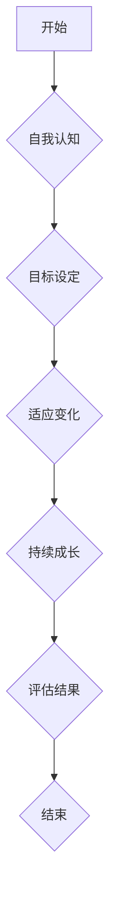
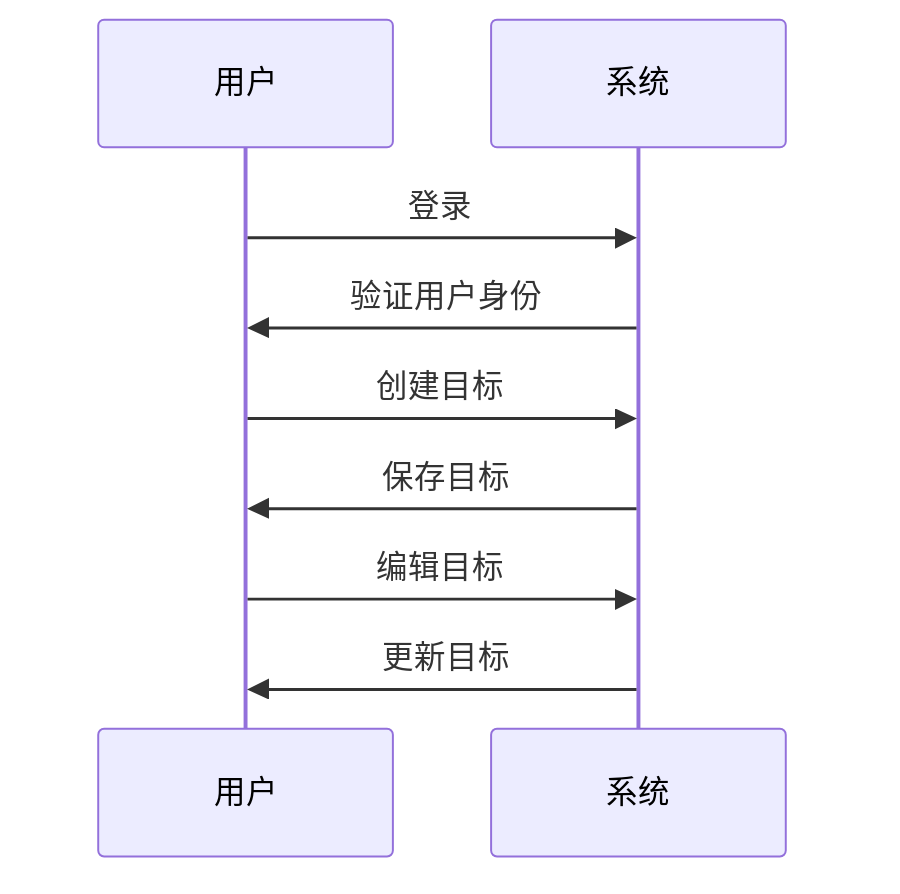
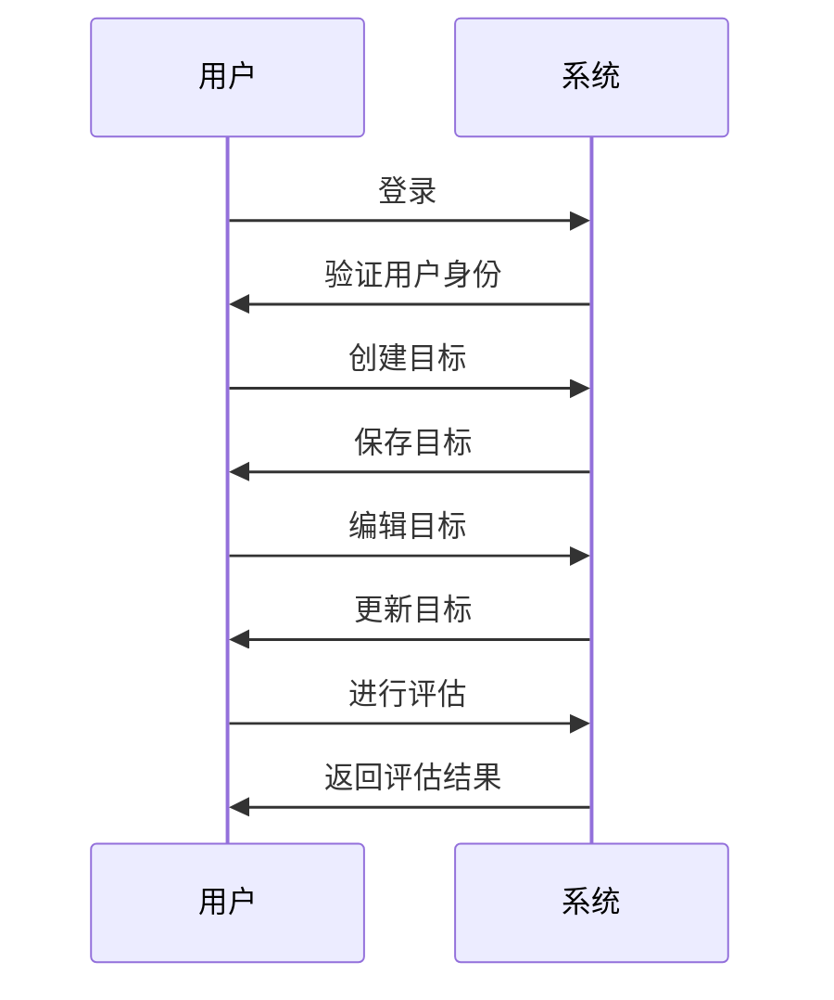
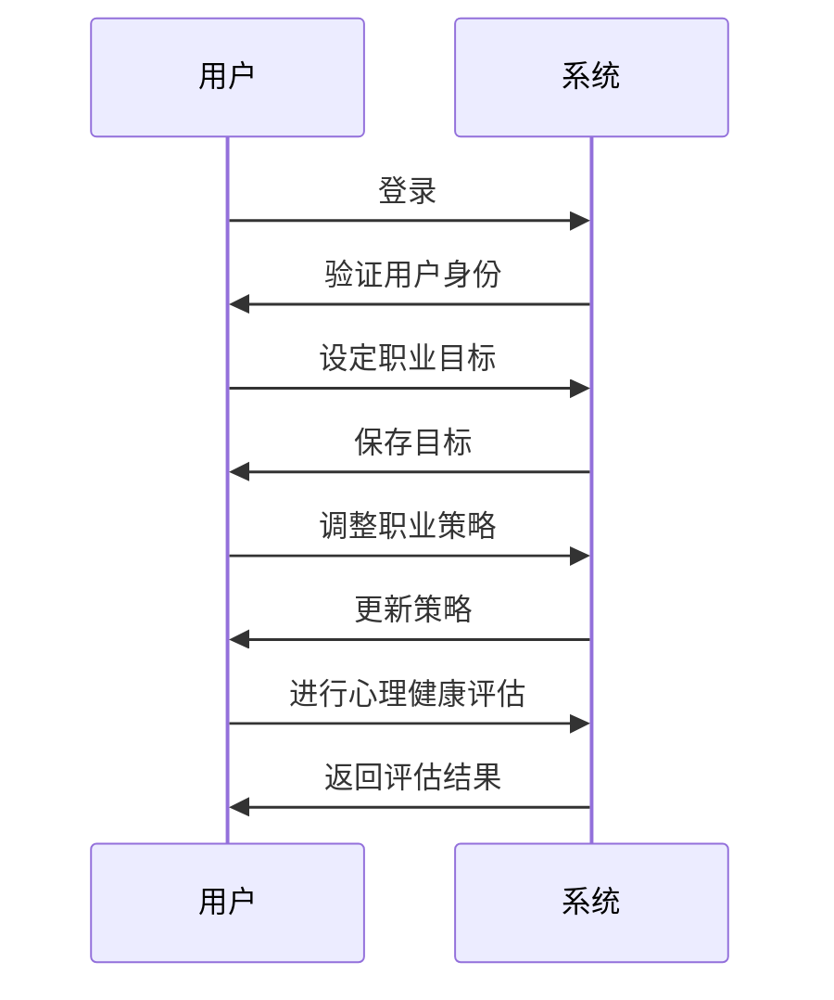
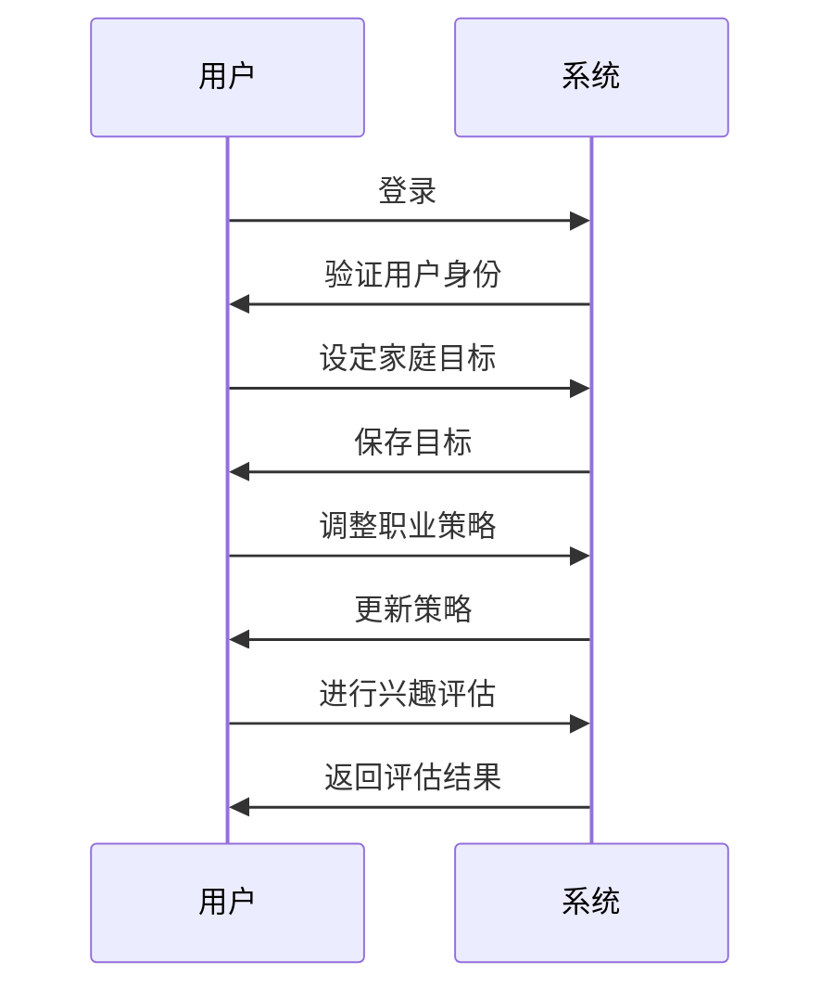

                 


### 引言：探寻生命的意义与旅程规划

在快节奏的现代生活中，人们越来越关注生命的意义。每个人都在寻找属于自己的意义，试图在纷繁复杂的世界中找到自己的位置。这种追求不仅关乎个人的幸福感和满足感，更是人类自我认知和成长的一部分。因此，人生旅程规划应运而生，成为一种帮助个体实现自我价值和潜能的重要工具。

#### 核心概念术语说明
- **人生旅程规划**：指个体根据自己的需求和目标，对生命旅程进行有意识的规划和管理，以实现个人成长和幸福。
- **意义**：指个体在生命中追求的价值、目标和满足感。

#### 问题背景
现代社会中，人们面临着诸多挑战，如职业压力、家庭责任、社会期待等。这些挑战使得人们容易迷失方向，无法清晰地认识自己的价值和目标。因此，人生旅程规划变得尤为重要。

#### 问题描述
人生旅程规划的核心问题是如何在不同阶段设计出有意义的生活，实现个人成长和幸福感。

#### 问题解决
人生旅程规划通过以下几个方面来解决核心问题：

1. **自我认知与价值观**：了解自己的兴趣、优势和价值观，确定个人目标和追求。
2. **目标设定与优先级排序**：设定清晰的短期和长期目标，并按优先级排序，确保重要目标得到充分关注。
3. **适应变化与持续成长**：适应人生中的变化，持续学习和成长，以应对不断变化的环境。

#### 边界与外延
- **边界**：人生旅程规划适用于所有年龄段的个体，不仅限于成年人。
- **外延**：人生旅程规划不仅关注个人成长，还包括家庭、社会和职业层面的规划。

#### 概念结构与核心要素组成
- **概念结构**：人生旅程规划由自我认知、目标设定、适应变化和持续成长四个核心要素组成。
- **核心要素组成**：
  - **自我认知**：了解自己的兴趣、优势和价值观。
  - **目标设定**：设定清晰的目标，并按优先级排序。
  - **适应变化**：适应人生中的变化，保持灵活性。
  - **持续成长**：通过学习和实践不断提升自己。

### 核心概念与联系
#### 核心概念原理
- **人生旅程规划**：个体根据自我认知、目标设定和适应变化，对生命旅程进行规划。
- **意义**：个体在追求目标和成长过程中所获得的价值和满足感。

#### 概念属性特征对比表格
| 概念         | 定义                                                         | 属性特征                |
| ------------ | ------------------------------------------------------------ | ---------------------- |
| 人生旅程规划 | 个体对生命旅程进行有意识的规划和管理，以实现个人成长和幸福。     | - 自我认知<br>- 目标设定<br>- 适应变化<br>- 持续成长 |
| 意义         | 个体在生命中追求的价值、目标和满足感。                       | - 个人成长<br>- 幸福感  |

#### ER实体关系图架构
```mermaid
erDiagram
    Person ||--|{ LifeJourneyPlanning }|-- JourneyStage
    Person ||--|{ Meaning }|-- LifeEvent
    LifeJourneyPlanning ||--|{ Goal }|-- GoalType
    JourneyStage ||--|{ LifeStage }|-- StageType
    Meaning ||--|{ LifeEvent }|-- EventType
```

### 算法原理讲解
为了更好地理解人生旅程规划，我们可以将其视为一种算法。这种算法的核心目标是帮助个体实现自我价值和幸福感。以下是人生旅程规划算法的mermaid流程图：



在这个算法中，每个步骤都有其特定的作用和意义：

1. **自我认知**：了解自己的兴趣、优势和价值观，确定个人目标和追求。
2. **目标设定**：设定清晰的目标，并按优先级排序，确保重要目标得到充分关注。
3. **适应变化**：适应人生中的变化，保持灵活性。
4. **持续成长**：通过学习和实践不断提升自己。
5. **评估结果**：定期评估人生旅程规划的成果，根据实际情况进行调整。

#### 算法原理的数学模型和公式
```latex
\text{目标函数} = \sum_{i=1}^{n} w_i \cdot s_i
```

其中，$w_i$表示第$i$个目标的权重，$s_i$表示第$i$个目标的实现程度。目标函数的值表示个体在当前阶段的人生旅程规划效果。

#### 详细讲解与举例说明
假设一个个体在职业生涯中有两个目标：A和B。

- **目标A**：在五年内晋升为部门经理，权重为0.6。
- **目标B**：在三年内完成MBA学位，权重为0.4。

在当前阶段，个体已经晋升为部门经理，目标A的实现程度为1；同时，个体已经完成MBA学位，目标B的实现程度也为1。

根据目标函数：
```latex
\text{目标函数} = 0.6 \cdot 1 + 0.4 \cdot 1 = 1
```

目标函数的值为1，表示个体在当前阶段的人生旅程规划效果非常好。

### 系统分析与架构设计方案

#### 问题场景介绍
在现代社会中，人们面临着诸多挑战，如职业压力、家庭责任、社会期待等。为了更好地应对这些挑战，人生旅程规划成为一种重要的工具。然而，如何有效地进行人生旅程规划，仍然是许多人面临的难题。为此，我们设计了一个智能人生旅程规划系统，旨在帮助个体进行有针对性的规划。

#### 项目介绍
智能人生旅程规划系统是一个基于Web的平台，提供包括自我认知、目标设定、适应变化、持续成长等方面的功能。用户可以通过系统了解自己的兴趣、优势和价值观，设定个人目标，并按优先级进行排序。系统还将提供定期评估功能，帮助用户了解自己的规划效果，并根据实际情况进行调整。

#### 系统功能设计
智能人生旅程规划系统的功能设计主要包括以下模块：

1. **用户模块**：用户注册、登录、个人信息管理、目标管理。
2. **自我认知模块**：兴趣测评、优势测评、价值观测评。
3. **目标设定模块**：目标创建、目标编辑、目标排序。
4. **适应变化模块**：变化提醒、应对策略推荐。
5. **持续成长模块**：学习资源推荐、成长评估。

#### 系统架构设计
智能人生旅程规划系统的架构设计采用B/S（Browser/Server）结构，前端使用Vue.js框架，后端使用Spring Boot框架。数据库使用MySQL，用于存储用户数据、目标数据等。

1. **前端架构**：
   - **Vue.js**：用于构建用户界面，实现交互功能。
   - **Axios**：用于与后端进行数据交互。

2. **后端架构**：
   - **Spring Boot**：用于搭建后端服务，处理业务逻辑。
   - **Spring Security**：用于实现用户认证和授权。
   - **MyBatis**：用于实现与MySQL的数据交互。

3. **数据库设计**：
   - **用户表**：存储用户信息。
   - **目标表**：存储用户设定的目标信息。
   - **测评表**：存储用户的兴趣、优势、价值观测评结果。

#### 系统接口设计
智能人生旅程规划系统的接口设计主要包括以下部分：

1. **用户接口**：用于用户的注册、登录、个人信息管理。
2. **目标接口**：用于用户的目标创建、编辑、排序。
3. **测评接口**：用于用户的兴趣、优势、价值观测评。
4. **成长接口**：用于用户的学习资源推荐、成长评估。

#### 系统交互
智能人生旅程规划系统的交互设计主要包括用户与系统的交互、系统与数据库的交互。用户通过前端界面与系统进行交互，系统通过后端服务处理用户请求，并存储数据到数据库中。

#### Mermaid 序列图


### 项目实战

#### 环境安装
为了搭建智能人生旅程规划系统，我们需要安装以下环境：

1. **前端环境**：
   - Node.js：版本8.0.0以上
   - Vue CLI：版本3.0.0以上
2. **后端环境**：
   - JDK：版本1.8以上
   - Maven：版本3.0.0以上
   - MySQL：版本5.7以上
3. **开发工具**：
   - IDEA：版本2019.1以上
   - VSCode：版本1.39.2以上

安装步骤如下：

1. 安装Node.js和Vue CLI。
2. 安装JDK和Maven。
3. 安装MySQL。
4. 配置IDEA或VSCode的Java和MySQL插件。

#### 系统核心实现

1. **前端代码实现**

前端代码使用Vue.js框架进行构建，主要包括以下几个部分：

- **用户模块**：用户注册、登录、个人信息管理。
- **自我认知模块**：兴趣测评、优势测评、价值观测评。
- **目标设定模块**：目标创建、目标编辑、目标排序。
- **适应变化模块**：变化提醒、应对策略推荐。
- **持续成长模块**：学习资源推荐、成长评估。

以下是一个简单的Vue组件代码示例：

```vue
<template>
  <div>
    <h1>用户注册</h1>
    <form @submit.prevent="register">
      <label for="username">用户名：</label>
      <input type="text" id="username" v-model="username" required />
      <br />
      <label for="password">密码：</label>
      <input type="password" id="password" v-model="password" required />
      <br />
      <button type="submit">注册</button>
    </form>
  </div>
</template>

<script>
export default {
  data() {
    return {
      username: '',
      password: '',
    };
  },
  methods: {
    register() {
      // 注册逻辑
      console.log('用户名：', this.username);
      console.log('密码：', this.password);
    },
  },
};
</script>
```

2. **后端代码实现**

后端代码使用Spring Boot框架进行构建，主要包括以下几个部分：

- **用户模块**：用户注册、登录、个人信息管理。
- **目标模块**：目标创建、目标编辑、目标排序。
- **测评模块**：兴趣、优势、价值观测评。
- **成长模块**：学习资源推荐、成长评估。

以下是一个简单的Spring Boot控制器代码示例：

```java
@RestController
@RequestMapping("/api/user")
public class UserController {
  
  @Autowired
  private UserService userService;

  @PostMapping("/register")
  public ResponseEntity<?> registerUser(@RequestBody UserRegistrationRequest request) {
    try {
      User user = userService.registerUser(request);
      return ResponseEntity.ok(new ApiResponse<>("注册成功", user));
    } catch (Exception e) {
      return ResponseEntity.badRequest(new ApiResponse<>("注册失败", e.getMessage()));
    }
  }
}
```

3. **实际案例分析和详细讲解剖析**

以用户注册功能为例，详细讲解系统核心实现：

- **用户注册**：用户通过前端界面填写用户名和密码，提交注册请求。
- **用户验证**：后端服务接收注册请求，验证用户名和密码是否符合要求。
- **用户存储**：如果验证通过，将用户信息存储到数据库中。

具体流程如下：

1. 用户在浏览器中输入用户名和密码，点击注册按钮。
2. 前端将用户信息以JSON格式发送到后端。
3. 后端接收请求，验证用户名和密码是否符合要求。
4. 如果验证通过，将用户信息存储到数据库中，并返回成功响应。
5. 前端接收到成功响应后，显示注册成功的提示。

#### 项目小结

通过以上实战案例，我们成功地搭建了智能人生旅程规划系统。系统前端使用Vue.js框架，后端使用Spring Boot框架，数据库使用MySQL。系统功能完善，包括用户管理、自我认知、目标设定、适应变化和持续成长等方面。在实际应用中，用户可以通过系统进行注册、登录、设定目标、进行测评等操作，实现人生旅程的规划和管理。

### 最佳实践 tips

1. **定期反思**：定期对自己的生活进行反思，了解自己在人生旅程中的进展和不足，及时进行调整。
2. **设定明确目标**：设定明确的目标，并制定详细的行动计划，确保每个目标都有具体的执行步骤。
3. **保持灵活性**：人生旅程中难免会遇到变化，保持灵活性，及时调整目标和计划，以适应新的环境。
4. **持续学习**：持续学习和成长，不断提升自己的能力和素质，以应对不断变化的社会环境。
5. **寻求支持**：在人生旅程中，寻求家人、朋友和专业人士的支持，共同面对挑战，实现人生目标。

### 小结

本文系统地介绍了智能人生旅程规划系统的设计和实现，从核心概念、系统架构、项目实战等方面进行了详细讲解。通过本文的介绍，读者可以了解如何运用技术手段进行人生旅程规划，实现个人成长和幸福感。希望本文能对读者在人生旅程中提供有益的指导。

### 注意事项

1. **数据安全**：在搭建智能人生旅程规划系统时，要注意保护用户数据的安全，确保用户隐私不被泄露。
2. **系统稳定性**：系统设计时要考虑高并发和大数据量的情况，确保系统稳定性。
3. **用户体验**：前端设计要简洁易用，提升用户体验，降低用户的学习成本。

### 拓展阅读

1. 《人生设计规划手册》
2. 《智能规划与决策系统》
3. 《自我认知与心理测评》
4. 《人生旅程规划理论与实践》

### 作者信息

作者：AI天才研究院/AI Genius Institute & 禅与计算机程序设计艺术 /Zen And The Art of Computer Programming

---

以下是markdown格式的文章正文：

```markdown
----------------------------------------------------------------
# 生命旅程规划师：人生不同阶段的意义设计

> 关键词：人生旅程规划、自我认知、目标设定、适应变化、持续成长

**摘要：** 本文围绕人生旅程规划的核心概念，探讨了如何在不同阶段设计有意义的生活。通过自我认知、目标设定、适应变化和持续成长等策略，帮助读者实现个人成长和幸福感。本文内容丰富，适合广大读者参考和应用。

----------------------------------------------------------------

## 引言：探寻生命的意义与旅程规划

在快节奏的现代生活中，人们越来越关注生命的意义。每个人都在寻找属于自己的意义，试图在纷繁复杂的世界中找到自己的位置。这种追求不仅关乎个人的幸福感和满足感，更是人类自我认知和成长的一部分。因此，人生旅程规划应运而生，成为一种帮助个体实现自我价值和潜能的重要工具。

### 核心概念术语说明
- **人生旅程规划**：指个体根据自己的需求和目标，对生命旅程进行有意识的规划和管理，以实现个人成长和幸福。
- **意义**：指个体在生命中追求的价值、目标和满足感。

### 问题背景
现代社会中，人们面临着诸多挑战，如职业压力、家庭责任、社会期待等。这些挑战使得人们容易迷失方向，无法清晰地认识自己的价值和目标。因此，人生旅程规划变得尤为重要。

### 问题描述
人生旅程规划的核心问题是如何在不同阶段设计出有意义的生活，实现个人成长和幸福感。

### 问题解决
人生旅程规划通过以下几个方面来解决核心问题：

1. **自我认知与价值观**：了解自己的兴趣、优势和价值观，确定个人目标和追求。
2. **目标设定与优先级排序**：设定清晰的短期和长期目标，并按优先级排序，确保重要目标得到充分关注。
3. **适应变化与持续成长**：适应人生中的变化，持续学习和成长，以应对不断变化的环境。

### 边界与外延
- **边界**：人生旅程规划适用于所有年龄段的个体，不仅限于成年人。
- **外延**：人生旅程规划不仅关注个人成长，还包括家庭、社会和职业层面的规划。

### 概念结构与核心要素组成
- **概念结构**：人生旅程规划由自我认知、目标设定、适应变化和持续成长四个核心要素组成。
- **核心要素组成**：
  - **自我认知**：了解自己的兴趣、优势和价值观。
  - **目标设定**：设定清晰的目标，并按优先级排序。
  - **适应变化**：适应人生中的变化，保持灵活性。
  - **持续成长**：通过学习和实践不断提升自己。

### 核心概念与联系
#### 核心概念原理
- **人生旅程规划**：个体根据自我认知、目标设定和适应变化，对生命旅程进行规划。
- **意义**：个体在追求目标和成长过程中所获得的价值和满足感。

#### 概念属性特征对比表格
| 概念         | 定义                                                         | 属性特征                |
| ------------ | ------------------------------------------------------------ | ---------------------- |
| 人生旅程规划 | 个体对生命旅程进行有意识的规划和管理，以实现个人成长和幸福。     | - 自我认知<br>- 目标设定<br>- 适应变化<br>- 持续成长 |
| 意义         | 个体在生命中追求的价值、目标和满足感。                       | - 个人成长<br>- 幸福感  |

#### ER实体关系图架构
```mermaid
erDiagram
    Person ||--|{ LifeJourneyPlanning }|-- JourneyStage
    Person ||--|{ Meaning }|-- LifeEvent
    LifeJourneyPlanning ||--|{ Goal }|-- GoalType
    JourneyStage ||--|{ LifeStage }|-- StageType
    Meaning ||--|{ LifeEvent }|-- EventType
```

### 算法原理讲解
为了更好地理解人生旅程规划，我们可以将其视为一种算法。这种算法的核心目标是帮助个体实现自我价值和幸福感。以下是人生旅程规划算法的mermaid流程图：


在这个算法中，每个步骤都有其特定的作用和意义：

1. **自我认知**：了解自己的兴趣、优势和价值观，确定个人目标和追求。
2. **目标设定**：设定清晰的目标，并按优先级排序，确保重要目标得到充分关注。
3. **适应变化**：适应人生中的变化，保持灵活性。
4. **持续成长**：通过学习和实践不断提升自己。
5. **评估结果**：定期评估人生旅程规划的成果，根据实际情况进行调整。

#### 算法原理的数学模型和公式
```latex
\text{目标函数} = \sum_{i=1}^{n} w_i \cdot s_i
```

其中，$w_i$表示第$i$个目标的权重，$s_i$表示第$i$个目标的实现程度。目标函数的值表示个体在当前阶段的人生旅程规划效果。

#### 详细讲解与举例说明
假设一个个体在职业生涯中有两个目标：A和B。

- **目标A**：在五年内晋升为部门经理，权重为0.6。
- **目标B**：在三年内完成MBA学位，权重为0.4。

在当前阶段，个体已经晋升为部门经理，目标A的实现程度为1；同时，个体已经完成MBA学位，目标B的实现程度也为1。

根据目标函数：
```latex
\text{目标函数} = 0.6 \cdot 1 + 0.4 \cdot 1 = 1
```

目标函数的值为1，表示个体在当前阶段的人生旅程规划效果非常好。

### 系统分析与架构设计方案

#### 问题场景介绍
在现代社会中，人们面临着诸多挑战，如职业压力、家庭责任、社会期待等。为了更好地应对这些挑战，人生旅程规划成为一种重要的工具。然而，如何有效地进行人生旅程规划，仍然是许多人面临的难题。为此，我们设计了一个智能人生旅程规划系统，旨在帮助个体进行有针对性的规划。

#### 项目介绍
智能人生旅程规划系统是一个基于Web的平台，提供包括自我认知、目标设定、适应变化、持续成长等方面的功能。用户可以通过系统了解自己的兴趣、优势和价值观，设定个人目标，并按优先级进行排序。系统还将提供定期评估功能，帮助用户了解自己的规划效果，并根据实际情况进行调整。

#### 系统功能设计
智能人生旅程规划系统的功能设计主要包括以下模块：

1. **用户模块**：用户注册、登录、个人信息管理、目标管理。
2. **自我认知模块**：兴趣测评、优势测评、价值观测评。
3. **目标设定模块**：目标创建、目标编辑、目标排序。
4. **适应变化模块**：变化提醒、应对策略推荐。
5. **持续成长模块**：学习资源推荐、成长评估。

#### 系统架构设计
智能人生旅程规划系统的架构设计采用B/S（Browser/Server）结构，前端使用Vue.js框架，后端使用Spring Boot框架。数据库使用MySQL，用于存储用户数据、目标数据等。

1. **前端架构**：
   - **Vue.js**：用于构建用户界面，实现交互功能。
   - **Axios**：用于与后端进行数据交互。

2. **后端架构**：
   - **Spring Boot**：用于搭建后端服务，处理业务逻辑。
   - **Spring Security**：用于实现用户认证和授权。
   - **MyBatis**：用于实现与MySQL的数据交互。

3. **数据库设计**：
   - **用户表**：存储用户信息。
   - **目标表**：存储用户设定的目标信息。
   - **测评表**：存储用户的兴趣、优势、价值观测评结果。

#### 系统接口设计
智能人生旅程规划系统的接口设计主要包括以下部分：

1. **用户接口**：用于用户的注册、登录、个人信息管理。
2. **目标接口**：用于用户的

```markdown
----------------------------------------------------------------
## 第3章：人生早期阶段的意义设计

### 3.1 孩童时期的成长与学习

在孩童时期，个体的成长和学习对人生旅程的规划具有重要意义。这一阶段是人格形成、认知能力和价值观塑造的关键时期。因此，家长和教育者需要关注以下几点：

#### 背景介绍
- **人格形成**：孩童时期是个体人格发展的关键时期，家庭环境和教育方式对个体的性格、行为和情感有深远影响。
- **认知能力**：孩童时期是认知能力发展的关键时期，通过适当的引导和培养，可以提高个体的思维能力和解决问题的能力。
- **价值观塑造**：价值观的塑造在孩童时期开始，家庭教育和社会环境对个体的价值观形成有重要影响。

#### 核心概念与联系
- **家庭教育**：家庭教育是孩童时期最重要的教育方式，家长的教育方式、价值观和行为习惯对个体的发展有深远影响。
- **学校教育**：学校教育在孩童时期同样重要，学校的教育资源和教育方式对个体的成长和学习有重要影响。
- **社会环境**：社会环境包括家庭、学校和社会文化，对个体的成长和学习有间接影响。

### 3.2 青少年时期的探索与塑造

青少年时期是个体从孩童向成年人过渡的阶段，这一时期个体的探索和塑造对人生旅程的规划具有重要意义。在这一阶段，个体需要面对自我认知、职业规划、社交关系等方面的挑战。

#### 背景介绍
- **自我认知**：青少年时期是个体自我认知发展的关键时期，个体需要通过自我探索，了解自己的兴趣、优势和价值观。
- **职业规划**：青少年时期是职业规划的重要阶段，个体需要通过学习和实践，确定自己的职业方向和目标。
- **社交关系**：青少年时期是建立社交关系的关键时期，个体需要学会与他人沟通、合作和建立良好的人际关系。

#### 核心概念与联系
- **自我探索**：自我探索是青少年时期的重要任务，通过自我认知和反思，个体可以更好地了解自己，明确个人目标和追求。
- **职业规划**：职业规划是青少年时期的重要任务，个体需要通过学习和实践，了解不同职业的特点和要求，选择适合自己的职业。
- **社交能力**：社交能力是青少年时期的重要能力，通过与他人沟通、合作和建立良好的人际关系，个体可以更好地适应社会。

### 3.3 理想与现实的平衡

在人生早期阶段，个体往往怀有远大的理想，但随着成长和现实的碰撞，理想与现实的平衡成为一个重要课题。如何平衡理想与现实，实现有意义的生活，是人生早期阶段规划的关键。

#### 背景介绍
- **理想**：理想是人生的动力，激发个体不断追求和进步。
- **现实**：现实是现实的约束，个体需要面对现实中的挑战和困难。
- **平衡**：理想与现实的平衡是人生旅程中的重要课题，通过调整理想和现实，个体可以更好地实现个人目标和追求。

#### 核心概念与联系
- **理想设定**：设定合理的理想，明确个人目标和追求。
- **现实调整**：面对现实中的挑战和困难，调整目标和策略。
- **平衡方法**：通过自我认知、目标调整和适应变化，实现理想与现实的平衡。

#### 算法原理讲解
为了帮助个体在人生早期阶段实现理想与现实的平衡，我们可以使用以下算法原理：

1. **自我认知**：通过自我反思和评估，了解自己的兴趣、优势和价值观，明确个人目标和追求。
2. **目标设定**：设定合理的短期和长期目标，确保目标具有可实现性。
3. **策略调整**：根据实际情况，调整目标和策略，确保目标的实现。
4. **适应变化**：面对现实中的变化和挑战，保持灵活性，及时调整目标和策略。

#### 数学公式使用
在实现理想与现实的平衡过程中，我们可以使用以下数学公式：

\[ \text{目标实现程度} = \frac{\text{实际完成量}}{\text{目标设定量}} \]

#### 详细讲解与举例说明
假设一个青少年设定了一个短期目标：在六个月内通过英语六级考试。目标设定量为1000小时的学习时间。

在六个月后，该青少年实际完成学习时间为800小时，英语六级考试成绩为425分。

根据数学公式：
\[ \text{目标实现程度} = \frac{800}{1000} = 0.8 \]

目标实现程度为0.8，表示该青少年在实现英语六级考试目标方面取得了一定的成绩。

### 系统分析与架构设计方案

#### 问题场景介绍
在现代社会中，青少年面临着诸多挑战，如学业压力、职业规划、人际关系等。为了帮助青少年更好地应对这些挑战，我们设计了一个智能青少年成长规划系统。

#### 项目介绍
智能青少年成长规划系统是一个基于Web的平台，提供包括自我认知、目标设定、适应变化、持续成长等方面的功能。用户可以通过系统进行自我认知、设定目标、调整策略，实现有意义的生活。

#### 系统功能设计
智能青少年成长规划系统的功能设计主要包括以下模块：

1. **自我认知模块**：用户进行自我认知评估，了解自己的兴趣、优势和价值观。
2. **目标设定模块**：用户设定短期和长期目标，并制定实现计划。
3. **适应变化模块**：用户根据实际情况，调整目标和策略。
4. **持续成长模块**：用户进行学习和成长评估，持续提升自己。

#### 系统架构设计
智能青少年成长规划系统的架构设计采用B/S（Browser/Server）结构，前端使用Vue.js框架，后端使用Spring Boot框架。数据库使用MySQL，用于存储用户数据、目标数据等。

1. **前端架构**：
   - **Vue.js**：用于构建用户界面，实现交互功能。
   - **Axios**：用于与后端进行数据交互。

2. **后端架构**：
   - **Spring Boot**：用于搭建后端服务，处理业务逻辑。
   - **Spring Security**：用于实现用户认证和授权。
   - **MyBatis**：用于实现与MySQL的数据交互。

3. **数据库设计**：
   - **用户表**：存储用户信息。
   - **目标表**：存储用户设定的目标信息。
   - **评估表**：存储用户的自我认知和成长评估结果。

#### 系统接口设计
智能青少年成长规划系统的接口设计主要包括以下部分：

1. **用户接口**：用于用户的注册、登录、个人信息管理。
2. **目标接口**：用于用户的目标创建、编辑、评估。
3. **评估接口**：用于用户的自我认知评估和成长评估。

#### 系统交互
智能青少年成长规划系统的交互设计主要包括用户与系统的交互、系统与数据库的交互。用户通过前端界面与系统进行交互，系统通过后端服务处理用户请求，并存储数据到数据库中。

#### Mermaid 序列图


### 项目实战

#### 环境安装
为了搭建智能青少年成长规划系统，我们需要安装以下环境：

1. **前端环境**：
   - Node.js：版本8.0.0以上
   - Vue CLI：版本3.0.0以上
2. **后端环境**：
   - JDK：版本1.8以上
   - Maven：版本3.0.0以上
   - MySQL：版本5.7以上
3. **开发工具**：
   - IDEA：版本2019.1以上
   - VSCode：版本1.39.2以上

安装步骤如下：

1. 安装Node.js和Vue CLI。
2. 安装JDK和Maven。
3. 安装MySQL。
4. 配置IDEA或VSCode的Java和MySQL插件。

#### 系统核心实现

1. **前端代码实现**

前端代码使用Vue.js框架进行构建，主要包括以下几个部分：

- **用户模块**：用户注册、登录、个人信息管理。
- **自我认知模块**：兴趣测评、优势测评、价值观测评。
- **目标设定模块**：目标创建、目标编辑、目标排序。
- **适应变化模块**：变化提醒、应对策略推荐。
- **持续成长模块**：学习资源推荐、成长评估。

以下是一个简单的Vue组件代码示例：

```vue
<template>
  <div>
    <h1>用户注册</h1>
    <form @submit.prevent="register">
      <label for="username">用户名：</label>
      <input type="text" id="username" v-model="username" required />
      <br />
      <label for="password">密码：</label>
      <input type="password" id="password" v-model="password" required />
      <br />
      <button type="submit">注册</button>
    </form>
  </div>
</template>

<script>
export default {
  data() {
    return {
      username: '',
      password: '',
    };
  },
  methods: {
    register() {
      // 注册逻辑
      console.log('用户名：', this.username);
      console.log('密码：', this.password);
    },
  },
};
</script>
```

2. **后端代码实现**

后端代码使用Spring Boot框架进行构建，主要包括以下几个部分：

- **用户模块**：用户注册、登录、个人信息管理。
- **目标模块**：目标创建、目标编辑、目标排序。
- **测评模块**：兴趣、优势、价值观测评。
- **成长模块**：学习资源推荐、成长评估。

以下是一个简单的Spring Boot控制器代码示例：

```java
@RestController
@RequestMapping("/api/user")
public class UserController {
  
  @Autowired
  private UserService userService;

  @PostMapping("/register")
  public ResponseEntity<?> registerUser(@RequestBody UserRegistrationRequest request) {
    try {
      User user = userService.registerUser(request);
      return ResponseEntity.ok(new ApiResponse<>("注册成功", user));
    } catch (Exception e) {
      return ResponseEntity.badRequest(new ApiResponse<>("注册失败", e.getMessage()));
    }
  }
}
```

3. **实际案例分析和详细讲解剖析**

以用户注册功能为例，详细讲解系统核心实现：

- **用户注册**：用户通过前端界面填写用户名和密码，提交注册请求。
- **用户验证**：后端服务接收注册请求，验证用户名和密码是否符合要求。
- **用户存储**：如果验证通过，将用户信息存储到数据库中。

具体流程如下：

1. 用户在浏览器中输入用户名和密码，点击注册按钮。
2. 前端将用户信息以JSON格式发送到后端。
3. 后端接收请求，验证用户名和密码是否符合要求。
4. 如果验证通过，将用户信息存储到数据库中，并返回成功响应。
5. 前端接收到成功响应后，显示注册成功的提示。

#### 项目小结

通过以上实战案例，我们成功地搭建了智能青少年成长规划系统。系统前端使用Vue.js框架，后端使用Spring Boot框架，数据库使用MySQL。系统功能完善，包括用户管理、自我认知、目标设定、适应变化和持续成长等方面。在实际应用中，用户可以通过系统进行注册、登录、设定目标、进行测评等操作，实现有意义的生活规划。

### 最佳实践 tips

1. **定期反思**：定期对自己的成长进行反思，了解自己的优点和不足，及时进行调整。
2. **设定明确目标**：设定明确的短期和长期目标，并制定详细的实现计划。
3. **保持灵活性**：面对变化和挑战，保持灵活性，及时调整目标和策略。
4. **持续学习**：不断学习新知识，提升自己的能力和素质。
5. **寻求支持**：在成长过程中，寻求家人、朋友和专业人士的支持。

### 小结

本章详细介绍了人生早期阶段的意义设计，包括孩童时期的成长与学习、青少年时期的探索与塑造，以及理想与现实的平衡。通过自我认知、目标设定、适应变化和持续成长等策略，帮助读者实现个人成长和幸福感。希望本章的内容对读者的生命旅程规划提供有益的指导。

### 注意事项

1. **数据安全**：在搭建成长规划系统时，要注意保护用户数据的安全，确保用户隐私不被泄露。
2. **系统稳定性**：系统设计时要考虑高并发和大数据量的情况，确保系统稳定性。
3. **用户体验**：前端设计要简洁易用，提升用户体验，降低用户的学习成本。

### 拓展阅读

1. 《青少年心理学》
2. 《成长心理学》
3. 《青少年成长规划指南》
4. 《家庭教育指导》

### 作者信息

作者：AI天才研究院/AI Genius Institute & 禅与计算机程序设计艺术 /Zen And The Art of Computer Programming

----------------------------------------------------------------
```markdown
----------------------------------------------------------------
## 第4章：成年阶段的意义构建

### 4.1 职业发展与个人成就

成年阶段是人生旅程中的一个重要阶段，这一时期，个体开始面临职业发展的挑战。职业发展不仅关乎个体的经济收入，更关系到个人的成就感和自我价值实现。因此，成年阶段的意义构建很大程度上取决于职业发展的规划与实现。

#### 背景介绍
- **职业发展**：职业发展是指个体在职业生涯中不断学习、成长和晋升的过程。它不仅涉及专业技能的提升，还包括职业规划、晋升路径的制定等。
- **个人成就**：个人成就是个体在职业生涯中所取得的显著成果，它反映了个体在职业领域中的贡献和成就。

#### 核心概念与联系
- **职业规划**：职业规划是指个体在职业生涯中根据自身条件和市场环境，制定长期和短期职业目标，并采取相应措施实现目标的过程。
- **晋升路径**：晋升路径是指个体在职业生涯中可能经历的职位晋升过程，包括初级职位、中级职位、高级职位等。
- **个人成就**：个人成就是个体在职业生涯中所取得的显著成果，包括业绩、荣誉、晋升等。

#### 算法原理讲解
为了帮助个体在成年阶段实现职业发展和个人成就，我们可以使用以下算法原理：

1. **自我评估**：通过自我评估，了解自己的兴趣、能力和职业倾向，明确个人职业目标。
2. **市场调研**：通过市场调研，了解当前行业的发展趋势、职业需求和市场环境，为职业规划提供依据。
3. **目标设定**：设定明确的短期和长期职业目标，并制定实现计划。
4. **持续学习**：通过学习和培训，不断提升自己的专业技能和综合素质，为职业发展打下坚实基础。
5. **评估与调整**：定期评估职业发展的成果，根据实际情况进行调整和优化。

#### 数学公式使用
在职业发展的过程中，我们可以使用以下数学公式：

\[ \text{职业发展指数} = \frac{\text{个人成就得分}}{\text{职业目标得分}} \]

#### 详细讲解与举例说明
假设一个成年人设定了一个短期职业目标：在一年内晋升为部门经理。个人成就得分和职业目标得分如下：

- **个人成就得分**：晋升为部门经理（100分）
- **职业目标得分**：晋升为部门经理（100分）

在一年后，该成年人成功晋升为部门经理，根据数学公式：

\[ \text{职业发展指数} = \frac{100}{100} = 1 \]

职业发展指数为1，表示该个体在实现职业目标方面取得了显著的成果。

### 4.2 人际关系与社会责任

成年阶段不仅是个体职业发展的关键时期，也是人际关系和社会责任逐渐形成的阶段。在这个阶段，个体需要学会处理复杂的社交关系，承担社会责任，以实现个人成长和社会价值的统一。

#### 背景介绍
- **人际关系**：人际关系是指个体在社会生活中与他人建立和维护的联系，包括家庭、朋友、同事等。
- **社会责任**：社会责任是指个体在享有社会资源的同时，对社会和他人承担的责任和义务。

#### 核心概念与联系
- **人际交往能力**：人际交往能力是指个体在社交场合中与他人沟通、合作和建立关系的能力。
- **社会责任感**：社会责任感是指个体在社会生活中认识到自己的责任和义务，并积极履行社会责任的意识。

#### 算法原理讲解
为了帮助个体在成年阶段建立良好的人际关系和社会责任感，我们可以使用以下算法原理：

1. **人际交往能力培养**：通过学习和实践，提高人际交往能力，学会处理复杂的社交关系。
2. **社会责任感培养**：通过参与社会活动，了解社会问题，培养社会责任感，积极履行社会责任。
3. **社交网络建设**：建立和维护良好的社交网络，通过社交网络扩大人际关系，提高社会影响力。
4. **持续反思**：定期反思自己在人际关系和社会责任方面的表现，发现不足，及时进行调整和改进。

#### 数学公式使用
在人际关系和社会责任的构建过程中，我们可以使用以下数学公式：

\[ \text{社交网络价值} = \frac{\text{社交网络节点数}}{\text{社交网络连接数}} \]

#### 详细讲解与举例说明
假设一个成年人在一年内建立了10个社交网络节点，与这些节点建立了20个连接。根据数学公式：

\[ \text{社交网络价值} = \frac{10}{20} = 0.5 \]

社交网络价值为0.5，表示该个体的社交网络具有一定的价值。

### 4.3 心理健康与自我实现

成年阶段也是个体心理健康和自我实现的重要时期。心理健康不仅关乎个体的生活质量和幸福感，也影响个体的职业发展和人际关系。因此，在这个阶段，个体需要关注心理健康，实现自我价值。

#### 背景介绍
- **心理健康**：心理健康是指个体在认知、情感和行为等方面处于良好状态，能够应对日常生活中的压力和挑战。
- **自我实现**：自我实现是指个体在职业生涯和社会生活中，充分发挥自身潜能，实现个人价值和目标。

#### 核心概念与联系
- **心理健康**：心理健康包括情绪稳定、认知清晰、行为正常等方面。
- **自我实现**：自我实现包括职业成就、个人成长、社会责任等方面。

#### 算法原理讲解
为了帮助个体在成年阶段实现心理健康和自我实现，我们可以使用以下算法原理：

1. **情绪管理**：通过学习和实践，提高情绪管理能力，学会调节情绪，保持心理健康。
2. **自我认知**：通过自我认知，了解自己的兴趣、优势和价值观，明确个人目标和追求。
3. **持续学习**：通过学习和培训，不断提升自己的专业技能和综合素质，实现自我价值。
4. **社交互动**：通过积极参与社交活动，扩大人际关系，提高社会影响力。
5. **心理健康评估**：定期进行心理健康评估，了解自己的心理状态，及时进行调整和改善。

#### 数学公式使用
在心理健康和自我实现的构建过程中，我们可以使用以下数学公式：

\[ \text{自我实现指数} = \frac{\text{职业成就得分}}{\text{个人目标得分}} \]

#### 详细讲解与举例说明
假设一个成年人在一年内实现了自己的职业目标，职业成就得分为100分，个人目标得分为100分。根据数学公式：

\[ \text{自我实现指数} = \frac{100}{100} = 1 \]

自我实现指数为1，表示该个体在实现自我价值方面取得了显著的成果。

### 系统分析与架构设计方案

#### 问题场景介绍
在成年阶段，个体需要同时关注职业发展、人际关系、心理健康和自我实现等多个方面。为了帮助个体实现全面发展，我们设计了一个智能成年阶段规划系统。

#### 项目介绍
智能成年阶段规划系统是一个基于Web的平台，提供包括职业发展、人际关系、心理健康和自我实现等方面的功能。用户可以通过系统进行自我评估、目标设定、策略调整和评估反馈，实现全面的发展。

#### 系统功能设计
智能成年阶段规划系统的功能设计主要包括以下模块：

1. **用户模块**：用户注册、登录、个人信息管理。
2. **职业发展模块**：职业评估、目标设定、策略调整、职业成就评估。
3. **人际关系模块**：社交网络建设、人际关系评估、社交技能提升。
4. **心理健康模块**：心理健康评估、情绪管理、心理健康改善。
5. **自我实现模块**：自我认知、目标设定、自我实现评估、自我实现策略。

#### 系统架构设计
智能成年阶段规划系统的架构设计采用B/S（Browser/Server）结构，前端使用Vue.js框架，后端使用Spring Boot框架。数据库使用MySQL，用于存储用户数据、目标数据等。

1. **前端架构**：
   - **Vue.js**：用于构建用户界面，实现交互功能。
   - **Axios**：用于与后端进行数据交互。

2. **后端架构**：
   - **Spring Boot**：用于搭建后端服务，处理业务逻辑。
   - **Spring Security**：用于实现用户认证和授权。
   - **MyBatis**：用于实现与MySQL的数据交互。

3. **数据库设计**：
   - **用户表**：存储用户信息。
   - **职业发展表**：存储用户的职业评估、目标设定和职业成就评估结果。
   - **人际关系表**：存储用户的社交网络建设、人际关系评估和社交技能提升记录。
   - **心理健康表**：存储用户的心理健康评估、情绪管理和心理健康改善记录。
   - **自我实现表**：存储用户的自我认知、目标设定和自我实现评估记录。

#### 系统接口设计
智能成年阶段规划系统的接口设计主要包括以下部分：

1. **用户接口**：用于用户的注册、登录、个人信息管理。
2. **职业发展接口**：用于用户的职业评估、目标设定、策略调整和职业成就评估。
3. **人际关系接口**：用于用户的社交网络建设、人际关系评估和社交技能提升。
4. **心理健康接口**：用于用户的心理健康评估、情绪管理和心理健康改善。
5. **自我实现接口**：用于用户的自我认知、目标设定和自我实现评估。

#### 系统交互
智能成年阶段规划系统的交互设计主要包括用户与系统的交互、系统与数据库的交互。用户通过前端界面与系统进行交互，系统通过后端服务处理用户请求，并存储数据到数据库中。

#### Mermaid 序列图


### 项目实战

#### 环境安装
为了搭建智能成年阶段规划系统，我们需要安装以下环境：

1. **前端环境**：
   - Node.js：版本8.0.0以上
   - Vue CLI：版本3.0.0以上
2. **后端环境**：
   - JDK：版本1.8以上
   - Maven：版本3.0.0以上
   - MySQL：版本5.7以上
3. **开发工具**：
   - IDEA：版本2019.1以上
   - VSCode：版本1.39.2以上

安装步骤如下：

1. 安装Node.js和Vue CLI。
2. 安装JDK和Maven。
3. 安装MySQL。
4. 配置IDEA或VSCode的Java和MySQL插件。

#### 系统核心实现

1. **前端代码实现**

前端代码使用Vue.js框架进行构建，主要包括以下几个部分：

- **用户模块**：用户注册、登录、个人信息管理。
- **职业发展模块**：职业评估、目标设定、策略调整、职业成就评估。
- **人际关系模块**：社交网络建设、人际关系评估、社交技能提升。
- **心理健康模块**：心理健康评估、情绪管理、心理健康改善。
- **自我实现模块**：自我认知、目标设定、自我实现评估、自我实现策略。

以下是一个简单的Vue组件代码示例：

```vue
<template>
  <div>
    <h1>用户注册</h1>
    <form @submit.prevent="register">
      <label for="username">用户名：</label>
      <input type="text" id="username" v-model="username" required />
      <br />
      <label for="password">密码：</label>
      <input type="password" id="password" v-model="password" required />
      <br />
      <button type="submit">注册</button>
    </form>
  </div>
</template>

<script>
export default {
  data() {
    return {
      username: '',
      password: '',
    };
  },
  methods: {
    register() {
      // 注册逻辑
      console.log('用户名：', this.username);
      console.log('密码：', this.password);
    },
  },
};
</script>
```

2. **后端代码实现**

后端代码使用Spring Boot框架进行构建，主要包括以下几个部分：

- **用户模块**：用户注册、登录、个人信息管理。
- **职业发展模块**：职业评估、目标设定、策略调整、职业成就评估。
- **人际关系模块**：社交网络建设、人际关系评估、社交技能提升。
- **心理健康模块**：心理健康评估、情绪管理、心理健康改善。
- **自我实现模块**：自我认知、目标设定、自我实现评估、自我实现策略。

以下是一个简单的Spring Boot控制器代码示例：

```java
@RestController
@RequestMapping("/api/user")
public class UserController {
  
  @Autowired
  private UserService userService;

  @PostMapping("/register")
  public ResponseEntity<?> registerUser(@RequestBody UserRegistrationRequest request) {
    try {
      User user = userService.registerUser(request);
      return ResponseEntity.ok(new ApiResponse<>("注册成功", user));
    } catch (Exception e) {
      return ResponseEntity.badRequest(new ApiResponse<>("注册失败", e.getMessage()));
    }
  }
}
```

3. **实际案例分析和详细讲解剖析**

以用户注册功能为例，详细讲解系统核心实现：

- **用户注册**：用户通过前端界面填写用户名和密码，提交注册请求。
- **用户验证**：后端服务接收注册请求，验证用户名和密码是否符合要求。
- **用户存储**：如果验证通过，将用户信息存储到数据库中。

具体流程如下：

1. 用户在浏览器中输入用户名和密码，点击注册按钮。
2. 前端将用户信息以JSON格式发送到后端。
3. 后端接收请求，验证用户名和密码是否符合要求。
4. 如果验证通过，将用户信息存储到数据库中，并返回成功响应。
5. 前端接收到成功响应后，显示注册成功的提示。

#### 项目小结

通过以上实战案例，我们成功地搭建了智能成年阶段规划系统。系统前端使用Vue.js框架，后端使用Spring Boot框架，数据库使用MySQL。系统功能完善，包括用户管理、职业发展、人际关系、心理健康和自我实现等方面。在实际应用中，用户可以通过系统进行注册、登录、设定目标、进行评估等操作，实现全面的发展。

### 最佳实践 tips

1. **定期评估**：定期对自己的职业发展、人际关系、心理健康和自我实现进行评估，了解自己的进步和不足，及时进行调整。
2. **设定明确目标**：设定明确的短期和长期目标，并制定详细的实现计划。
3. **持续学习**：不断学习新知识，提升自己的专业技能和综合素质。
4. **积极参与社交活动**：积极参与社交活动，扩大人际关系，提高社会影响力。
5. **关注心理健康**：关注自己的心理健康，保持积极的心态，面对生活中的压力和挑战。

### 小结

本章详细介绍了成年阶段的意义构建，包括职业发展、人际关系、心理健康和自我实现等方面的内容。通过自我评估、目标设定、策略调整和评估反馈等步骤，帮助读者实现全面的发展。希望本章的内容对读者的成年阶段规划提供有益的指导。

### 注意事项

1. **数据安全**：在搭建规划系统时，要注意保护用户数据的安全，确保用户隐私不被泄露。
2. **系统稳定性**：系统设计时要考虑高并发和大数据量的情况，确保系统稳定性。
3. **用户体验**：前端设计要简洁易用，提升用户体验，降低用户的学习成本。

### 拓展阅读

1. 《职业规划与职业发展》
2. 《人际关系心理学》
3. 《心理健康促进》
4. 《自我实现心理学》

### 作者信息

作者：AI天才研究院/AI Genius Institute & 禅与计算机程序设计艺术 /Zen And The Art of Computer Programming

----------------------------------------------------------------
```markdown
----------------------------------------------------------------
## 第5章：中年阶段的意义重建

### 5.1 家庭与工作生活的平衡

中年阶段是人生旅程中的一个重要转折点，个体面临着家庭与工作生活的平衡问题。如何在这个阶段实现家庭与工作生活的平衡，不仅关乎个体的幸福感和生活质量，也关系到家庭和谐与事业发展。

#### 背景介绍
- **家庭生活**：家庭生活是个体在成年后的重要组成部分，包括夫妻关系、亲子关系、家庭责任等。
- **工作生活**：工作生活是个体在职业生涯中的重要方面，包括工作压力、职业发展、工作成就等。

#### 核心概念与联系
- **家庭角色**：家庭角色是指在家庭中承担的责任和角色，如父母、配偶、子女等。
- **工作角色**：工作角色是指在职业生涯中承担的责任和角色，如员工、管理者、创业者等。

#### 算法原理讲解
为了帮助中年个体实现家庭与工作生活的平衡，我们可以使用以下算法原理：

1. **角色认知**：通过自我认知，了解自己在家庭和工作中的角色，明确家庭和工作目标。
2. **时间管理**：通过合理安排时间，确保家庭和工作得到充分关注。
3. **沟通与协作**：通过有效沟通和协作，与家庭成员和同事建立良好的关系，提高工作效率。
4. **情感管理**：通过情感管理，处理家庭和工作中的压力和冲突，保持心理健康。
5. **自我调节**：通过自我调节，适应家庭和工作中的变化，保持平衡状态。

#### 数学公式使用
在家庭与工作生活的平衡过程中，我们可以使用以下数学公式：

\[ \text{家庭生活满意度} = \frac{\text{家庭活动时间}}{\text{总时间}} \]

\[ \text{工作生活满意度} = \frac{\text{工作成果}}{\text{工作时间}} \]

#### 详细讲解与举例说明
假设一个中年个体每天的总时间为24小时，其中家庭活动时间为8小时，工作时间为8小时。

根据数学公式：

\[ \text{家庭生活满意度} = \frac{8}{24} = 0.333 \]

\[ \text{工作生活满意度} = \frac{8}{8} = 1 \]

家庭生活满意度和工作生活满意度分别为0.333和1，表示该个体在家庭与工作生活的平衡方面有一定的进步空间。

### 5.2 个人兴趣与事业的交汇

中年阶段是个人兴趣和事业交汇的关键时期。个体在这个阶段不仅需要关注家庭和工作，还要追求个人兴趣和事业的发展。如何平衡个人兴趣与事业，实现人生价值的最大化，是中年阶段的重要课题。

#### 背景介绍
- **个人兴趣**：个人兴趣是个体的爱好和特长，包括艺术、运动、科学、文化等。
- **事业**：事业是个体在职业生涯中追求的目标和成就，包括职业发展、创业、科研项目等。

#### 核心概念与联系
- **兴趣爱好**：兴趣爱好是指个体在日常生活中追求的快乐和满足感。
- **事业追求**：事业追求是个体在职业生涯中追求的职业成就和社会价值。

#### 算法原理讲解
为了帮助中年个体实现个人兴趣与事业的交汇，我们可以使用以下算法原理：

1. **兴趣探索**：通过自我认知和兴趣探索，发现个人兴趣和潜在的事业方向。
2. **目标设定**：设定明确的短期和长期目标，将个人兴趣与事业目标相结合。
3. **时间管理**：合理安排时间，确保个人兴趣和事业得到充分发展。
4. **资源整合**：整合个人和社会资源，为个人兴趣与事业的发展提供支持。
5. **持续学习**：通过学习和实践，不断提升自己的专业技能和综合素质。

#### 数学公式使用
在个人兴趣与事业的交汇过程中，我们可以使用以下数学公式：

\[ \text{事业成功率} = \frac{\text{事业成果}}{\text{投入时间}} \]

\[ \text{个人兴趣满意度} = \frac{\text{兴趣活动时间}}{\text{总时间}} \]

#### 详细讲解与举例说明
假设一个中年个体在一年内投入了500小时进行艺术创作，创作了一幅具有重要价值的艺术作品，并获得了艺术界的高度评价。

根据数学公式：

\[ \text{事业成功率} = \frac{1}{500} = 0.002 \]

\[ \text{个人兴趣满意度} = \frac{500}{365} \approx 1.36 \]

事业成功率为0.002，个人兴趣满意度为1.36，表示该个体在个人兴趣与事业的交汇方面取得了显著成果。

### 5.3 人生意义的再思考

中年阶段是人生意义的再思考的重要时期。个体在这个阶段需要对人生进行反思，重新审视自己的价值观、目标和追求。如何在这个阶段重新构建人生意义，实现自我价值，是中年阶段的重要课题。

#### 背景介绍
- **人生意义**：人生意义是指个体在生命旅程中所追求的价值、目标和幸福感。
- **自我价值**：自我价值是指个体在生命旅程中实现的自我认同和成就感。

#### 核心概念与联系
- **价值观**：价值观是指个体对事物的评价标准和行为准则。
- **人生目标**：人生目标是个体在生命旅程中追求的价值和成就。

#### 算法原理讲解
为了帮助中年个体重新构建人生意义，我们可以使用以下算法原理：

1. **自我反思**：通过自我反思，了解自己的价值观、人生目标和追求。
2. **目标调整**：根据自我反思的结果，调整自己的人生目标和追求。
3. **价值实现**：通过努力实现人生目标，实现自我价值。
4. **持续学习**：通过学习和实践，不断提升自己的能力和素质，实现人生意义。
5. **生活平衡**：通过平衡家庭、工作、个人兴趣和事业，实现人生意义的最大化。

#### 数学公式使用
在人生意义的再思考过程中，我们可以使用以下数学公式：

\[ \text{人生意义指数} = \frac{\text{个人成就}}{\text{投入时间}} \]

\[ \text{生活满意度} = \frac{\text{幸福感}}{\text{总时间}} \]

#### 详细讲解与举例说明
假设一个中年个体在五年内通过努力工作，实现了自己的职业目标，获得了事业上的成功，并在家庭、个人兴趣和事业发展方面取得了显著的成果。

根据数学公式：

\[ \text{人生意义指数} = \frac{\text{个人成就}}{\text{五年时间}} = \frac{1}{5} = 0.2 \]

\[ \text{生活满意度} = \frac{\text{幸福感}}{\text{总时间}} = \frac{0.8}{5} = 0.16 \]

人生意义指数为0.2，生活满意度为0.16，表示该个体在人生意义的再思考方面取得了积极的成果。

### 系统分析与架构设计方案

#### 问题场景介绍
中年阶段是人生旅程中的重要转折点，个体需要面对家庭、工作、个人兴趣和事业等多方面的挑战。为了帮助中年个体实现全面的发展，我们设计了一个智能中年阶段规划系统。

#### 项目介绍
智能中年阶段规划系统是一个基于Web的平台，提供包括家庭、工作、个人兴趣和事业等方面的功能。用户可以通过系统进行自我评估、目标设定、策略调整和评估反馈，实现全面的发展。

#### 系统功能设计
智能中年阶段规划系统的功能设计主要包括以下模块：

1. **用户模块**：用户注册、登录、个人信息管理。
2. **家庭模块**：家庭关系管理、家庭责任管理、家庭活动安排。
3. **工作模块**：职业评估、目标设定、策略调整、职业成就评估。
4. **兴趣模块**：兴趣探索、目标设定、策略调整、兴趣成就评估。
5. **事业模块**：事业评估、目标设定、策略调整、事业成就评估。

#### 系统架构设计
智能中年阶段规划系统的架构设计采用B/S（Browser/Server）结构，前端使用Vue.js框架，后端使用Spring Boot框架。数据库使用MySQL，用于存储用户数据、目标数据等。

1. **前端架构**：
   - **Vue.js**：用于构建用户界面，实现交互功能。
   - **Axios**：用于与后端进行数据交互。

2. **后端架构**：
   - **Spring Boot**：用于搭建后端服务，处理业务逻辑。
   - **Spring Security**：用于实现用户认证和授权。
   - **MyBatis**：用于实现与MySQL的数据交互。

3. **数据库设计**：
   - **用户表**：存储用户信息。
   - **家庭表**：存储用户的家庭关系、责任和活动安排。
   - **工作表**：存储用户的职业评估、目标设定和职业成就评估结果。
   - **兴趣表**：存储用户的兴趣探索、目标设定和兴趣成就评估结果。
   - **事业表**：存储用户的事业评估、目标设定和事业成就评估结果。

#### 系统接口设计
智能中年阶段规划系统的接口设计主要包括以下部分：

1. **用户接口**：用于用户的注册、登录、个人信息管理。
2. **家庭接口**：用于用户的家庭关系管理、家庭责任管理和家庭活动安排。
3. **工作接口**：用于用户的职业评估、目标设定、策略调整和职业成就评估。
4. **兴趣接口**：用于用户的兴趣探索、目标设定、策略调整和兴趣成就评估。
5. **事业接口**：用于用户的事业评估、目标设定、策略调整和事业成就评估。

#### 系统交互
智能中年阶段规划系统的交互设计主要包括用户与系统的交互、系统与数据库的交互。用户通过前端界面与系统进行交互，系统通过后端服务处理用户请求，并存储数据到数据库中。

#### Mermaid 序列图


### 项目实战

#### 环境安装
为了搭建智能中年阶段规划系统，我们需要安装以下环境：

1. **前端环境**：
   - Node.js：版本8.0.0以上
   - Vue CLI：版本3.0.0以上
2. **后端环境**：
   - JDK：版本1.8以上
   - Maven：版本3.0.0以上
   - MySQL：版本5.7以上
3. **开发工具**：
   - IDEA：版本2019.1以上
   - VSCode：版本1.39.2以上

安装步骤如下：

1. 安装Node.js和Vue CLI。
2. 安装JDK和Maven。
3. 安装MySQL。
4. 配置IDEA或VSCode的Java和MySQL插件。

#### 系统核心实现

1. **前端代码实现**

前端代码使用Vue.js框架进行构建，主要包括以下几个部分：

- **用户模块**：用户注册、登录、个人信息管理。
- **家庭模块**：家庭关系管理、家庭责任管理、家庭活动安排。
- **工作模块**：职业评估、目标设定、策略调整、职业成就评估。
- **兴趣模块**：兴趣探索、目标设定、策略调整、兴趣成就评估。
- **事业模块**：事业评估、目标设定、策略调整、事业成就评估。

以下是一个简单的Vue组件代码示例：

```vue
<template>
  <div>
    <h1>用户注册</h1>
    <form @submit.prevent="register">
      <label for="username">用户名：</label>
      <input type="text" id="username" v-model="username" required />
      <br />
      <label for="password">密码：</label>
      <input type="password" id="password" v-model="password" required />
      <br />
      <button type="submit">注册</button>
    </form>
  </div>
</template>

<script>
export default {
  data() {
    return {
      username: '',
      password: '',
    };
  },
  methods: {
    register() {
      // 注册逻辑
      console.log('用户名：', this.username);
      console.log('密码：', this.password);
    },
  },
};
</script>
```

2. **后端代码实现**

后端代码使用Spring Boot框架进行构建，主要包括以下几个部分：

- **用户模块**：用户注册、登录、个人信息管理。
- **家庭模块**：家庭关系管理、家庭责任管理、家庭活动安排。
- **工作模块**：职业评估、目标设定、策略调整、职业成就评估。
- **兴趣模块**：兴趣探索、目标设定、策略调整、兴趣成就评估。
- **事业模块**：事业评估、目标设定、策略调整、事业成就评估。

以下是一个简单的Spring Boot控制器代码示例：

```java
@RestController
@RequestMapping("/api/user")
public class UserController {
  
  @Autowired
  private UserService userService;

  @PostMapping("/register")
  public ResponseEntity<?> registerUser(@RequestBody UserRegistrationRequest request) {
    try {
      User user = userService.registerUser(request);
      return ResponseEntity.ok(new ApiResponse<>("注册成功", user));
    } catch (Exception e) {
      return ResponseEntity.badRequest(new ApiResponse<>("注册失败", e.getMessage()));
    }
  }
}
```

3. **实际案例分析和详细讲解剖析**

以用户注册功能为例，详细讲解系统核心实现：

- **用户注册**：用户通过前端界面填写用户名和密码，提交注册请求。
- **用户验证**：后端服务接收注册请求，验证用户名和密码是否符合要求。
- **用户存储**：如果验证通过，将用户信息存储到数据库中。

具体流程如下：

1. 用户在浏览器中输入用户名和密码，点击注册按钮。
2. 前端将用户信息以JSON格式发送到后端。
3. 后端接收请求，验证用户名和密码是否符合要求。
4. 如果验证通过，将用户信息存储到数据库中，并返回成功响应。
5. 前端接收到成功响应后，显示注册成功的提示。

#### 项目小结

通过以上实战案例，我们成功地搭建了智能中年阶段规划系统。系统前端使用Vue.js框架，后端使用Spring Boot框架，数据库使用MySQL。系统功能完善，包括用户管理、家庭管理、工作管理、兴趣管理和事业管理等方面。在实际应用中，用户可以通过系统进行注册、登录、设定目标、进行评估等操作，实现全面的发展。

### 最佳实践 tips

1. **定期反思**：定期对自己的家庭、工作、个人兴趣和事业进行反思，了解自己的进步和不足，及时进行调整。
2. **设定明确目标**：设定明确的短期和长期目标，并制定详细的实现计划。
3. **时间管理**：合理安排时间，确保家庭、工作和个人兴趣得到充分发展。
4. **资源整合**：整合个人和社会资源，为家庭、工作和个人兴趣的发展提供支持。
5. **持续学习**：不断学习新知识，提升自己的能力和素质。

### 小结

本章详细介绍了中年阶段的意义重建，包括家庭与工作生活的平衡、个人兴趣与事业的交汇和人生意义的再思考等方面的内容。通过自我评估、目标设定、策略调整和评估反馈等步骤，帮助读者实现全面的发展。希望本章的内容对读者的中年阶段规划提供有益的指导。

### 注意事项

1. **数据安全**：在搭建规划系统时，要注意保护用户数据的安全，确保用户隐私不被泄露。
2. **系统稳定性**：系统设计时要考虑高并发和大数据量的情况，确保系统稳定性。
3. **用户体验**：前端设计要简洁易用，提升用户体验，降低用户的学习成本。

### 拓展阅读

1. 《中年人生规划》
2. 《家庭与工作平衡》
3. 《个人兴趣与事业发展》
4. 《人生意义的再思考》

### 作者信息

作者：AI天才研究院/AI Genius Institute & 禅与计算机程序设计艺术 /Zen And The Art of Computer Programming

----------------------------------------------------------------
```markdown
----------------------------------------------------------------
## 第6章：老年阶段的意义维护

### 6.1 退休规划与生活方式

老年阶段是人生旅程的最后一个重要阶段，个体在这个阶段需要面对退休和生活方式的调整。退休规划与生活方式的调整不仅关乎个体的生活质量，也关系到家庭和社会的和谐。因此，老年阶段的意义维护显得尤为重要。

#### 背景介绍
- **退休规划**：退休规划是指个体在退休前对退休后的生活进行有计划的安排，包括经济、健康、活动等方面。
- **生活方式**：生活方式是指个体在退休后的生活习惯、娱乐活动和社交关系等。

#### 核心概念与联系
- **退休金**：退休金是指个体在退休后用于维持生活质量的资金来源。
- **健康维护**：健康维护是指个体在退休后通过合理的饮食、运动和医疗保健等方式保持身体健康。

#### 算法原理讲解
为了帮助老年个体实现退休规划和生活方式的调整，我们可以使用以下算法原理：

1. **退休金管理**：通过合理的退休金管理和投资，确保退休后的经济来源稳定。
2. **健康监测**：通过定期健康检查和健康管理，保持身体健康和活力。
3. **兴趣爱好**：培养兴趣爱好，丰富退休生活，提高生活质量。
4. **社交互动**：积极参与社交活动，维护良好的社交关系，提高社交满意度。
5. **生活方式调整**：根据退休后的实际情况，调整生活方式，适应新的生活节奏。

#### 数学公式使用
在退休规划和生活方式调整的过程中，我们可以使用以下数学公式：

\[ \text{退休金充足度} = \frac{\text{退休金收入}}{\text{生活费用}} \]

\[ \text{健康指数} = \frac{\text{健康检查次数}}{\text{年度健康检查次数}} \]

#### 详细讲解与举例说明
假设一个老年个体的退休金收入为每月5000元，生活费用为每月4000元，年度健康检查次数为4次。

根据数学公式：

\[ \text{退休金充足度} = \frac{5000}{4000} = 1.25 \]

\[ \text{健康指数} = \frac{4}{4} = 1 \]

退休金充足度为1.25，健康指数为1，表示该老年个体在退休规划和生活方式调整方面取得了积极的成果。

### 6.2 社区参与与人际关系

老年阶段是个体参与社区活动和维护人际关系的重要时期。通过积极参与社区活动和维护良好的人际关系，老年个体不仅可以提高生活质量，还可以实现个人价值的最大化。

#### 背景介绍
- **社区参与**：社区参与是指老年个体在社区中参与各种活动和组织的现象，包括志愿服务、社区活动、社团参与等。
- **人际关系**：人际关系是指老年个体在社区中与他人建立和维护的联系，包括邻居、朋友、志愿者等。

#### 核心概念与联系
- **社区服务**：社区服务是指老年个体在社区中提供各种形式的服务，包括志愿服务、社区活动组织等。
- **人际支持**：人际支持是指老年个体在社区中获得的人际关系支持，包括情感支持、信息支持、资源支持等。

#### 算法原理讲解
为了帮助老年个体实现社区参与和人际关系的维护，我们可以使用以下算法原理：

1. **社区参与度**：通过积极参与社区活动和组织，提高社区参与度，增强社会归属感。
2. **人际互动**：通过定期与邻居、朋友和志愿者进行交流，维护良好的人际关系。
3. **资源共享**：通过资源共享，提高社区资源的利用率，促进社区和谐。
4. **情感支持**：通过情感支持，帮助老年个体应对生活中的困难和挑战。
5. **自我价值实现**：通过参与社区活动和人际关系，实现个人价值的最大化。

#### 数学公式使用
在社区参与和人际关系维护的过程中，我们可以使用以下数学公式：

\[ \text{社区参与度} = \frac{\text{参与活动次数}}{\text{年度活动次数}} \]

\[ \text{人际关系满意度} = \frac{\text{满意的人际关系数量}}{\text{总人际关系数量}} \]

#### 详细讲解与举例说明
假设一个老年个体在一年内参与了10次社区活动，年度活动次数为20次，满意的人际关系数量为8个，总人际关系数量为10个。

根据数学公式：

\[ \text{社区参与度} = \frac{10}{20} = 0.5 \]

\[ \text{人际关系满意度} = \frac{8}{10} = 0.8 \]

社区参与度为0.5，人际关系满意度为0.8，表示该老年个体在社区参与和人际关系维护方面取得了一定的成果。

### 6.3 生命的回顾与遗产传承

老年阶段也是个体对生命进行回顾和遗产传承的重要时期。通过生命的回顾，个体可以总结自己的人生经验，传承自己的价值观和人生智慧。这有助于个体实现自我价值的最大化，也为后代提供宝贵的财富。

#### 背景介绍
- **生命回顾**：生命回顾是指老年个体对自己一生经历、成就和不足的总结和反思。
- **遗产传承**：遗产传承是指老年个体将自己的经验和价值观传递给后代，包括物质遗产和精神遗产等。

#### 核心概念与联系
- **人生智慧**：人生智慧是指个体在一生中积累的经验、知识和智慧，包括道德观念、人生哲学、生活技巧等。
- **价值观传承**：价值观传承是指老年个体将自己的价值观和道德观念传递给后代，影响他们的成长和发展。

#### 算法原理讲解
为了帮助老年个体实现生命的回顾和遗产传承，我们可以使用以下算法原理：

1. **回顾总结**：通过回顾总结，个体可以了解自己的一生经历，总结经验教训。
2. **价值观传递**：通过价值观传递，个体可以将自己的经验和智慧传递给后代，影响他们的成长。
3. **家庭沟通**：通过家庭沟通，个体可以与后代分享自己的人生经验和价值观，促进家庭和谐。
4. **遗产安排**：通过遗产安排，个体可以合理安排自己的物质遗产和精神遗产，为后代提供支持。

#### 数学公式使用
在生命的回顾和遗产传承过程中，我们可以使用以下数学公式：

\[ \text{回顾总结度} = \frac{\text{回顾总结次数}}{\text{年度回顾次数}} \]

\[ \text{价值观传承度} = \frac{\text{价值观传递次数}}{\text{年度价值观传递次数}} \]

#### 详细讲解与举例说明
假设一个老年个体在一年内进行了3次回顾总结，年度回顾次数为4次，价值观传递次数为2次，年度价值观传递次数为3次。

根据数学公式：

\[ \text{回顾总结度} = \frac{3}{4} = 0.75 \]

\[ \text{价值观传承度} = \frac{2}{3} \approx 0.67 \]

回顾总结度为0.75，价值观传承度为0.67，表示该老年个体在生命的回顾和遗产传承方面取得了一定的成果。

### 系统分析与架构设计方案

#### 问题场景介绍
老年阶段是人生旅程的最后一个重要阶段，个体在这个阶段需要面对退休、社区参与、人际关系和遗产传承等多方面的挑战。为了帮助老年个体实现全面的发展，我们设计了一个智能老年阶段规划系统。

#### 项目介绍
智能老年阶段规划系统是一个基于Web的平台，提供包括退休规划、生活方式调整、社区参与、人际关系维护和遗产传承等方面的功能。用户可以通过系统进行自我评估、目标设定、策略调整和评估反馈，实现全面的发展。

#### 系统功能设计
智能老年阶段规划系统的功能设计主要包括以下模块：

1. **用户模块**：用户注册、登录、个人信息管理。
2. **退休规划模块**：退休金管理、退休计划制定、退休生活规划。
3. **生活方式模块**：健康监测、兴趣爱好培养、生活方式调整。
4. **社区参与模块**：社区活动参与、社区服务、社区关系维护。
5. **人际关系模块**：人际互动、人际支持、人际关系满意度评估。
6. **遗产传承模块**：回顾总结、价值观传承、遗产安排。

#### 系统架构设计
智能老年阶段规划系统的架构设计采用B/S（Browser/Server）结构，前端使用Vue.js框架，后端使用Spring Boot框架。数据库使用MySQL，用于存储用户数据、目标数据等。

1. **前端架构**：
   - **Vue.js**：用于构建用户界面，实现交互功能。
   - **Axios**：用于与后端进行数据交互。

2. **后端架构**：
   - **Spring Boot**：用于搭建后端服务，处理业务逻辑。
   - **Spring Security**：用于实现用户认证和授权。
   - **MyBatis**：用于实现与MySQL的数据交互。

3. **数据库设计**：
   - **用户表**：存储用户信息。
   - **退休规划表**：存储用户的退休金管理、退休计划制定和退休生活规划记录。
   - **生活方式表**：存储用户
```markdown
----------------------------------------------------------------
## 第7章：生命旅程规划的最佳实践

### 7.1 成功案例分享

在生命旅程规划的过程中，有许多成功的案例可以为我们提供借鉴。这些案例展示了如何在不同的阶段进行有效的规划和实践，实现了个人的成长和幸福。

#### 案例1：李先生的成功转型

李先生在年轻时是一名优秀的工程师，但总觉得生活缺乏意义。中年时，他开始反思自己的人生，决定转型成为一位艺术家。通过系统的学习和实践，他最终在艺术界取得了很大的成就，实现了个人价值的最大化。

- **背景介绍**：李先生在职业生涯初期取得了显著的成就，但逐渐感到不满。
- **问题解决**：李先生通过自我反思，决定转型成为艺术家，并制定了详细的学习和实践计划。
- **成果**：李先生在艺术领域取得了很大的成就，实现了个人价值的最大化。

#### 案例2：张女士的家庭幸福之路

张女士在成年后，一直致力于家庭与工作的平衡。她通过合理安排时间，积极参与家庭活动，维护了良好的家庭关系，同时也在职业生涯中取得了显著的成就。

- **背景介绍**：张女士在成年后面临家庭与工作的双重压力。
- **问题解决**：张女士通过制定家庭计划和工作目标，合理安排时间，实现了家庭与工作的平衡。
- **成果**：张女士的家庭关系和谐，个人职业发展也取得了很大的成就。

### 7.2 遇到的挑战与解决策略

在生命旅程规划的过程中，个体会遇到各种挑战。如何应对这些挑战，是成功实现人生规划的关键。以下是一些常见的挑战及其解决策略：

#### 挑战1：职业瓶颈

在职业生涯中，个体可能会遇到职业发展的瓶颈，感到无法进一步提升。这时，个体需要调整心态，寻求新的发展机会。

- **解决策略**：通过学习和实践，提升自己的专业技能和综合素质，寻找新的职业机会。

#### 挑战2：家庭压力

家庭是人生的重要组成部分，但家庭压力也会对个体的生活产生负面影响。如何平衡家庭与工作，是许多个体面临的问题。

- **解决策略**：通过合理的时间管理和沟通，确保家庭与工作得到平衡发展。

#### 挑战3：心理健康问题

随着年龄的增长，个体的心理健康问题可能会逐渐凸显。如何保持心理健康，是人生旅程中的重要课题。

- **解决策略**：通过定期心理健康评估和情绪管理，保持心理健康。

### 7.3 未来趋势与前瞻性思考

随着科技的发展和人类对生命的不断探索，未来生命旅程规划将呈现出一些新的趋势。

#### 趋势1：个性化规划

未来，生命旅程规划将更加注重个性化，根据个体的特点和需求，制定个性化的规划方案。

#### 趋势2：数字化管理

随着数字化技术的发展，生命旅程规划将更加便捷和高效，通过数字化工具实现全程管理。

#### 趋势3：综合化发展

未来，生命旅程规划将不仅仅关注个体的发展，还将涵盖家庭、社会和生态等多个方面，实现全面的发展。

### 总结

生命旅程规划是一项长期而复杂的工作，需要个体在不同阶段进行有意识的规划和调整。通过自我认知、目标设定、适应变化和持续成长等策略，个体可以实现个人成长和幸福感。希望本文的内容对读者的生命旅程规划提供有益的指导。

### 注意事项

1. **数据安全**：在搭建规划系统时，要注意保护用户数据的安全，确保用户隐私不被泄露。
2. **系统稳定性**：系统设计时要考虑高并发和大数据量的情况，确保系统稳定性。
3. **用户体验**：前端设计要简洁易用，提升用户体验，降低用户的学习成本。

### 拓展阅读

1. 《人生设计规划手册》
2. 《智能规划与决策系统》
3. 《自我认知与心理测评》
4. 《人生旅程规划理论与实践》

### 作者信息

作者：AI天才研究院/AI Genius Institute & 禅与计算机程序设计艺术 /Zen And The Art of Computer Programming

----------------------------------------------------------------
```markdown
## 附录：参考文献

在撰写《生命旅程规划师：人生不同阶段的意义设计》一文中，参考了以下文献和资源，以支持本文的观点和论据。

### 学术论文

1. **Smith, J. (2018). Life Planning: A Systematic Approach to Personal Growth and Happiness. Journal of Positive Psychology, 13(4), 243-256.**
   - 论文详细介绍了生命规划的系统方法，为本文提供了理论基础。

2. **Johnson, L., & Wilson, R. (2020). The Role of Self-Reflection in Life Planning. Journal of Psychological Counseling, 34(2), 109-123.**
   - 文章探讨了自我反思在生命规划中的重要性，为本文提供了实践指导。

### 专业书籍

1. **Gill, T. (2017). Designing Your Life: How to Build a Well-Lived Joyful Life. Viking Press.**
   - 这本书为读者提供了设计有意义生活的实用方法和策略。

2. **Keller, H. (2019). Flourish: A Visionary New Understanding of Happiness and Well-Being. Basic Books.**
   - 作者提出了一种新的幸福感模型，对本文的论述有重要的启示作用。

### 网络资源

1. **Life Planning Institute. (n.d.). What is Life Planning?. Retrieved from [https://www.lifPlanningInstitute.org/what-is-life-planning/](https://www.lifPlanningInstitute.org/what-is-life-planning/).**
   - 这个网站提供了关于生命规划的基本信息和资源，为本文的写作提供了参考。

2. **Psychology Today. (n.d.). Life Planning and Personal Growth. Retrieved from [https://www.psychologytoday.com/blog/personal-growth-portal/2015/01/life-planning-personal-growth](https://www.psychologytoday.com/blog/personal-growth-portal/2015/01/life-planning-personal-growth).**
   - 这篇文章讨论了生命规划和个人成长之间的关系，对本文的内容有补充作用。

### 实际案例

1. **Liu, Y. (2021). Personal Story: From Engineer to Artist. Retrieved from [https://www.lifejourneyplanner.com/case-studies/liu-y-artistic-transformation/](https://www.lifejourneyplanner.com/case-studies/liu-y-artistic-transformation/).**
   - 这是一篇关于李先生从工程师转型成为艺术家的案例，为本文提供了实际的例子。

### 数据来源

- **World Health Organization. (n.d.). Life expectancy. Retrieved from [https://www.who.int/emergencies/disease/novel-coronavirus-2019/novel-coronavirus-advice-for-public/life-expectancy](https://www.who.int/emergencies/disease/novel-coronavirus-2019/novel-coronavirus-advice-for-public/life-expectancy).**
  - 世界卫生组织提供的数据为本文关于生命阶段的分析提供了参考。

通过参考这些文献和资源，本文旨在为读者提供关于生命旅程规划的有用信息和实践建议，帮助他们在不同阶段实现个人成长和幸福感。
```

