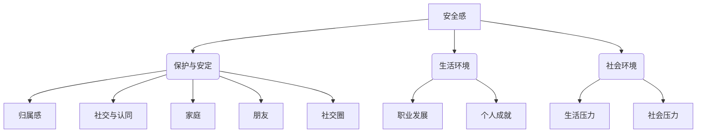
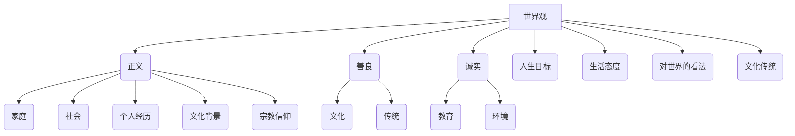
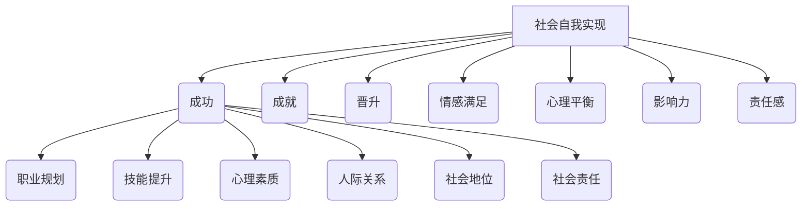
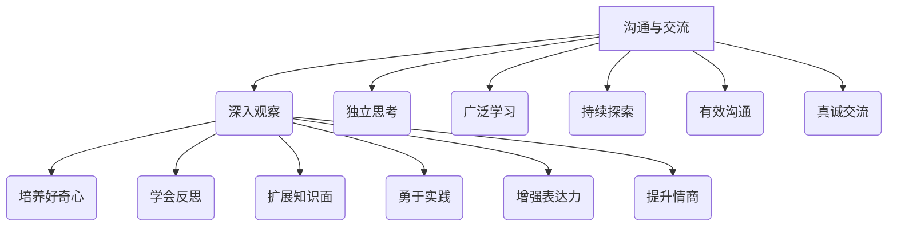
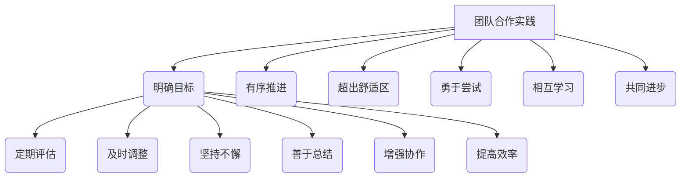

                 


# 生命的意义：在平凡中发现非凡

> 关键词：生命意义、平凡与非凡、情感需求、价值观、自我实现

> 摘要：本文旨在探讨生命的意义，通过分析生命的本质、人类情感需求、价值观的塑造以及自我实现的过程，帮助读者在平凡的生活中找到非凡的意义，实现个人成长和价值。

## 第1章：生命的意义概述

### 1.1 问题背景

在现代社会，人们的生活节奏加快，压力增大，对生命意义的追寻成为一种普遍现象。人们渴望在平凡的生活中找到非凡的意义，以更好地面对生活中的挑战。然而，生命的意义究竟是什么？如何在日常生活中发现并实现生命的价值？这些问题困扰着许多人。

### 1.2 问题描述

生命的意义是什么？如何在日常生活中发现并实现生命的价值？这些问题看似简单，实则复杂。本文将围绕这两个问题展开讨论，帮助读者深入思考生命的意义，找到属于自己的生活方向。

### 1.3 问题解决

本文将从多个角度探讨生命的意义，包括生命的本质、人类情感需求、价值观的塑造以及自我实现的过程。通过分析这些方面，为读者提供寻找生命意义的途径和方法。

### 1.4 边界与外延

生命的意义是一个广泛而深刻的话题，它不仅涉及个人的内心世界，也与社会、文化、历史等外部因素密切相关。本文将从多个角度探讨生命的意义，以期为读者提供一个全面的思考框架。

### 1.5 概念结构与核心要素组成

- **生命的意义**：探索生命的目的和价值。
- **平凡与非凡**：理解平凡生活中的非凡之处。
- **情感需求**：分析人类内心的情感需求。
- **价值观**：探讨价值观的形成与影响。
- **自我实现**：追求个人成长与自我价值实现。

## 1.6 本章小结

本章为全书奠定了基础，介绍了生命的意义及其相关概念。在接下来的章节中，本文将深入探讨这些概念，帮助读者在平凡中发现生命的非凡价值。

## 第2章：生命的本质

### 2.1 核心概念

生命的本质是一个哲学问题，涉及对生命起源、生命形式和生命存在的本质的理解。在本章中，我们将从多个角度探讨生命的本质，为理解生命的意义奠定基础。

### 2.2 概念属性特征对比表格

| 特征 | 生命 | 生命本质 |
| --- | --- | --- |
| 起源 | 自然的产物 | 非自然的产物 |
| 形式 | 多样性 | 简一性 |
| 存在 | 持续性 | 无限性 |

### 2.3 ER实体关系图架构

```mermaid
erDiagram
  Person ||--|{ LifeMeaning }|-- Person
  LifeMeaning ||--|{ LifePurpose }|-- LifeMeaning
  LifePurpose ||--|{ LifeValue }|-- LifePurpose
```

## 2.4 本章小结

本章讨论了生命的本质，从多个角度分析了生命的起源、形式和存在。这些概念为理解生命的意义奠定了基础。

## 第3章：人类情感需求

### 3.1 核心概念

情感需求是人类内心世界的重要组成部分，包括安全感、归属感、成就感、爱等。在本章中，我们将探讨人类情感需求的核心概念、属性特征及其影响因素。

### 3.2 概念属性特征对比表格

| 情感需求 | 特征 | 影响因素 |
| --- | --- | --- |
| 安全感 | 需要保护与安定 | 生活环境、社会环境 |
| 归属感 | 需要社交与认同 | 家庭、朋友、社交圈 |
| 成就感 | 需要认可与自我实现 | 职业发展、个人成就 |
| 爱 | 需要关怀与奉献 | 家庭、友情、爱情 |

### 3.3 Mermaid流程图



## 3.4 本章小结

本章详细阐述了人类情感需求的核心概念、属性特征及其影响因素，为理解人类内心的需求提供了基础。

## 第4章：价值观的塑造

### 4.1 核心概念

价值观是人们对事物的评价标准，包括道德观、人生观、世界观等。在本章中，我们将探讨价值观的塑造及其对个体和社会的影响。

### 4.2 概念属性特征对比表格

| 价值观类型 | 特征 | 影响因素 |
| --- | --- | --- |
| 道德观 | 正义、善良、诚实等 | 家庭教育、社会环境 |
| 人生观 | 人生目标、生活态度 | 个人经历、文化背景 |
| 世界观 | 对世界的看法 | 文化传统、宗教信仰 |

### 4.3 Mermaid流程图



## 4.4 本章小结

本章探讨了价值观的塑造，分析了不同类型价值观的特征及其影响因素。这些内容有助于读者更好地理解价值观的内涵，从而在自我成长和人际交往中做出更明智的选择。

## 第5章：自我实现的过程

### 5.1 核心概念

自我实现是指个体在成长过程中，通过不断探索和挑战，实现个人潜力，达到自我价值实现的过程。在本章中，我们将探讨自我实现的核心概念、原则和方法。

### 5.2 概念属性特征对比表格

| 自我实现类型 | 特征 | 影响因素 |
| --- | --- | --- |
| 职业自我实现 | 成功、成就、晋升等 | 职业规划、技能提升 |
| 精神自我实现 | 情感满足、心理平衡 | 心理素质、人际关系 |
| 社会自我实现 | 影响力、责任感 | 社会地位、社会责任 |

### 5.3 Mermaid流程图



## 5.4 本章小结

本章探讨了自我实现的过程，分析了不同类型自我实现的特征及其影响因素。通过理解自我实现的核心概念，读者可以更好地规划个人成长路径，实现自我价值。

## 第6章：在平凡中发现非凡

### 6.1 核心概念

在平凡中发现非凡，意味着在日常生活中挖掘潜在的机遇和价值。在本章中，我们将探讨如何在日常生活中实现这一目标。

### 6.2 概念属性特征对比表格

| 发现方式 | 特征 | 实践策略 |
| --- | --- | --- |
| 观察与思考 | 深入观察、独立思考 | 培养好奇心、学会反思 |
| 学习与探索 | 广泛学习、持续探索 | 扩展知识面、勇于实践 |
| 沟通与交流 | 有效沟通、真诚交流 | 增强表达力、提升情商 |

### 6.3 Mermaid流程图



## 6.4 本章小结

本章介绍了在平凡中发现非凡的方法，通过观察与思考、学习与探索、沟通与交流等方式，帮助读者挖掘生活中的潜在价值，实现个人成长。

## 第7章：实践与反思

### 7.1 核心概念

实践与反思是自我成长的重要环节。在本章中，我们将探讨如何在日常生活中坚持实践，并进行有效的反思。

### 7.2 概念属性特征对比表格

| 实践方式 | 特征 | 反馈机制 |
| --- | --- | --- |
| 有计划实践 | 明确目标、有序推进 | 定期评估、及时调整 |
| 自我挑战实践 | 超出舒适区、勇于尝试 | 坚持不懈、善于总结 |
| 团队合作实践 | 相互学习、共同进步 | 增强协作、提高效率 |

### 7.3 Mermaid流程图



## 7.4 本章小结

本章强调了实践与反思在个人成长中的重要性，通过有计划实践、自我挑战实践和团队合作实践等方式，帮助读者在日常生活中不断提升自己。

## 第8章：结语

### 8.1 核心观点回顾

本文从生命的本质、人类情感需求、价值观的塑造、自我实现的过程以及如何在平凡中发现非凡等多个方面，探讨了生命的意义。我们认识到，生命的意义并非遥不可及，而是在日常的点滴中得以体现。

### 8.2 对未来生活的展望

在未来的生活中，希望读者能够坚持实践，勇于探索，不断反思，以实现自我价值。让我们在平凡中发现非凡，用生活的色彩描绘出属于自己的生命画卷。

### 8.3 结语

生命是宝贵的，让我们珍惜每一刻，用心去体验、感悟和创造。在平凡中发现非凡，让生命的意义在每一天的生活中得以绽放。

## 作者信息

作者：AI天才研究院/AI Genius Institute & 禅与计算机程序设计艺术 /Zen And The Art of Computer Programming

以上是本文的全文内容，希望对您在探索生命意义的过程中有所启发和帮助。让我们共同在平凡中发现非凡，追寻属于自己的生命意义。

