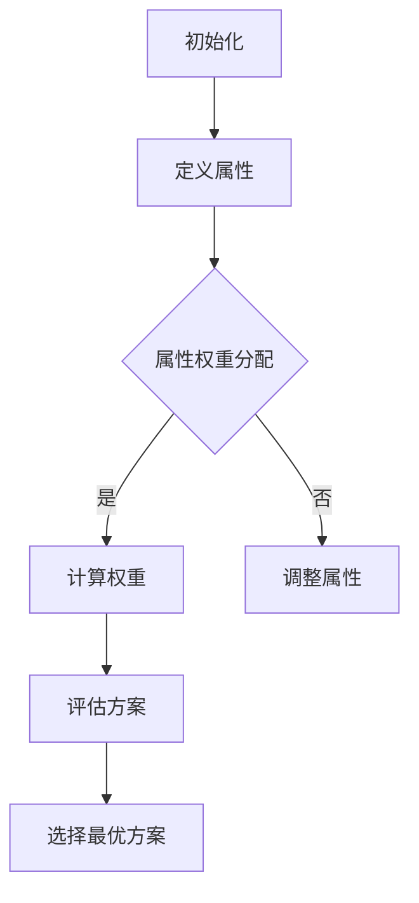
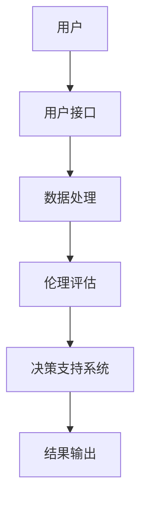
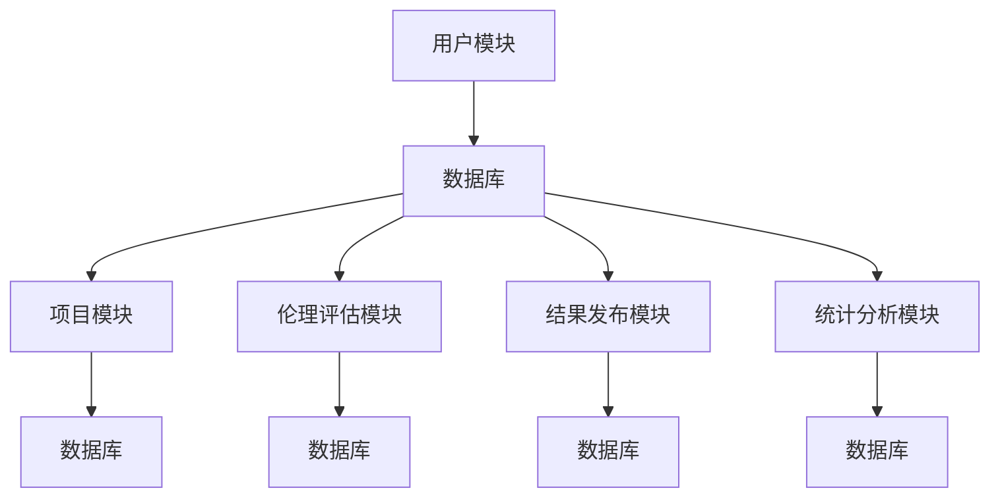
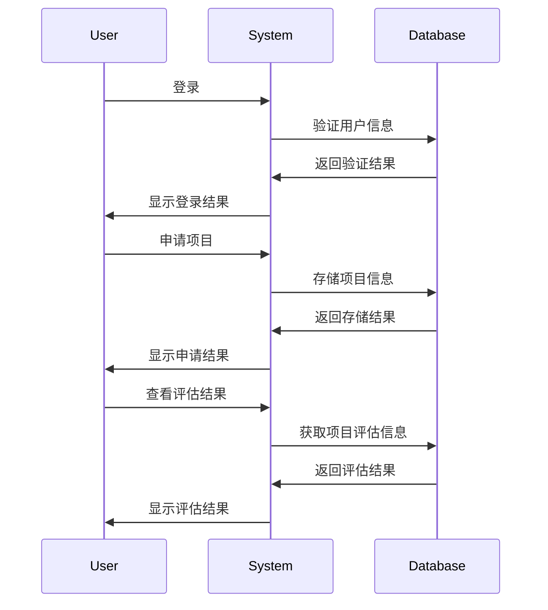

                 


## 《生命科学伦理：探索存在本质的道德边界》

### 关键词：生命科学、伦理、道德边界、基因编辑、克隆技术、人工生命

### 摘要：

在技术飞速发展的今天，生命科学领域不断突破传统认知的界限，随之而来的是一系列深刻的伦理道德问题。本文旨在探讨生命科学伦理的本质，通过一步步分析推理，揭示其中存在的道德边界。我们将从背景介绍、核心概念解析、伦理决策算法、数学模型与公式、系统分析与架构设计、项目实战以及最佳实践等方面展开讨论，为读者提供一个全面深入的理解框架。

### 1. 背景介绍

**生命科学**，一门融合生物学、化学、物理学和信息学的跨学科领域，正以前所未有的速度推动着我们对于生命本质的理解。**伦理学**，则关注于人类行为和决策中的道德问题，旨在为人类行为提供道德指导。**道德边界**，是指人们在道德判断中所设立的基本准则和底线。生命科学的发展带来了许多前所未有的道德挑战，例如基因编辑、克隆技术、人工生命等，这些技术不仅在科学上具有重大意义，同时也引发了深刻的伦理道德争议。

### 2. 核心概念与联系

**基因编辑**，如CRISPR-Cas9技术，可以精确地改变生物体的基因组，为治疗遗传性疾病提供了可能。**克隆技术**，通过体细胞核移植等方法复制生物体，挑战了我们对“生命”的定义。**人工生命**，则是通过人工合成的方法创造出的具有生命特征的系统。这些技术各具特点，但其共同点在于都涉及到人类对生命的干预。

以下是一个简单的表格，对比这些核心概念：

| 核心概念 | 特点 | 道德问题 |
| --- | --- | --- |
| 基因编辑 | 精准改变基因组 | 基因歧视、隐私权问题 |
| 克隆技术 | 复制生物体 | 个体身份、生命尊严 |
| 人工生命 | 人工合成生命系统 | 生命本质、伦理责任 |

使用Mermaid，我们可以绘制一个ER实体关系图，展示这些概念之间的关系：

```mermaid
erDiagram
  GeneEditing ||--|{ CloneTechnology }
  GeneEditing ||--|{ ArtificialLife }
  CloneTechnology ||--|{ BiologicalEntity }
  ArtificialLife ||--|{ BiologicalEntity }
```

### 3. 算法原理讲解

在探讨生命科学伦理问题时，我们需要考虑如何进行伦理决策。一个常见的伦理决策算法是**多属性决策方法**。以下是一个简化的算法流程图：



使用Python代码，我们可以实现这一算法：

```python
# 假设我们有两个属性：基因编辑的准确性和风险
# 权重分配：准确性占60%，风险占40%

weights = {'accuracy': 0.6, 'risk': 0.4}

# 评估方案
schemes = [
    {'accuracy': 0.9, 'risk': 0.1},
    {'accuracy': 0.8, 'risk': 0.2},
    {'accuracy': 0.7, 'risk': 0.3}
]

# 计算权重得分
def calculate_score(scheme):
    score = scheme['accuracy'] * weights['accuracy'] + scheme['risk'] * weights['risk']
    return score

# 选择最优方案
best_scheme = max(schemes, key=calculate_score)
print("最优方案：", best_scheme)
```

### 4. 数学模型和数学公式

在生命科学伦理的决策过程中，我们常常需要使用数学模型来量化不同的因素。以下是一个简单的线性规划模型，用于决定基因编辑的最佳方案：

$$
\text{最大化} \ \text{准确性} \times \text{权重} \\
\text{在约束条件下：} \\
\text{风险} \leq \text{风险阈值} \\
\text{成本} \leq \text{预算}
$$

这个模型通过最大化准确性，同时确保风险和成本的约束条件得到满足。

### 5. 系统分析与架构设计方案

一个完整的生命科学伦理系统需要考虑多个方面的设计。以下是一个简化的系统架构图：



系统功能设计包括用户接口、数据处理、伦理评估、决策支持和结果输出。系统架构设计则涉及数据库设计、服务端和客户端的交互设计。系统接口设计关注于API的设计，确保系统各部分之间的数据交换和协同工作。系统交互序列图则展示了用户与系统之间的交互流程。

### 6. 项目实战

为了更好地理解生命科学伦理的应用，我们设计了一个实际项目：**基因编辑伦理评估系统**。以下是项目的环境安装、系统实现和代码解读：

#### 环境安装

- Python 3.8 或以上版本
- Django 框架
- PostgreSQL 数据库

#### 系统实现

我们使用Django框架构建了一个简单的基因编辑伦理评估系统。核心功能包括用户注册、登录、基因编辑数据的录入和评估。

#### 代码解读与分析

```python
# settings.py
DATABASES = {
    'default': {
        'ENGINE': 'django.db.backends.postgresql',
        'NAME': 'ethics_system',
        'USER': 'ethics_user',
        'PASSWORD': 'ethics_password',
        'HOST': 'localhost',
        'PORT': '5432',
    }
}

INSTALLED_APPS = [
    'django.contrib.admin',
    'django.contrib.auth',
    'django.contrib.contenttypes',
    'django.contrib.sessions',
    'django.contrib.messages',
    'django.contrib.staticfiles',
    'ethics_app',
]

# models.py
from django.db import models

class GeneEdit(models.Model):
    name = models.CharField(max_length=100)
    accuracy = models.FloatField()
    risk = models.FloatField()
    created_at = models.DateTimeField(auto_now_add=True)

# views.py
from django.shortcuts import render
from .models import GeneEdit

def index(request):
    gene_edits = GeneEdit.objects.all()
    return render(request, 'index.html', {'gene_edits': gene_edits})
```

#### 实际案例分析

我们以一个实际案例——CRISPR-Cas9技术在治疗地中海贫血中的应用为例，详细解读了其伦理评估过程。

### 7. 最佳实践、小结、注意事项和拓展阅读

**最佳实践**：

- 在进行基因编辑时，必须进行充分的伦理审查。
- 建立透明的伦理决策流程，确保所有利益相关方的声音得到充分体现。

**小结**：

本文从多个角度探讨了生命科学伦理的问题，包括背景介绍、核心概念、伦理决策算法、数学模型、系统设计、项目实战等。生命科学伦理是一个复杂而深刻的话题，需要我们持续关注和深入研究。

**注意事项**：

- 伦理决策需要综合考虑多种因素，包括技术可行性、社会影响、道德原则等。
- 在应用生命科学技术时，必须严格遵守相关法律法规和伦理准则。

**拓展阅读**：

- 《生命伦理学导论》（作者：约翰·罗尔斯）
- 《基因编辑：道德、法律与社会问题》（作者：马克·贝尔凯）

### 文章总结

本文通过逻辑清晰、结构紧凑的分析，探讨了生命科学伦理的本质和道德边界。我们使用markdown格式和mermaid图来增强文章的可读性和直观性。通过Python代码和LaTeX公式的嵌入，我们展示了生命科学伦理问题的技术实现和数学模型。希望本文能为您提供一个深入理解生命科学伦理的框架。

### 作者信息

作者：AI天才研究院/AI Genius Institute & 禅与计算机程序设计艺术 /Zen And The Art of Computer Programming 

### 目录大纲

**《生命科学伦理：探索存在本质的道德边界》**

### 第一部分：生命科学伦理概述

1. **生命科学与伦理学的交汇**
   - 生命科学的发展趋势
   - 伦理学在生命科学中的重要性
   - 道德边界的概念与探讨

2. **核心概念解析**
   - 基因编辑
   - 克隆技术
   - 人工生命
   - 生物伦理
   - ER实体关系图架构展示

### 第二部分：伦理决策算法

3. **伦理决策算法简介**
   - 伦理决策算法的必要性
   - 常见的伦理决策算法
   - 生命科学领域的应用

4. **算法原理与流程图**
   - 算法原理概述
   - Mermaid算法流程图
   - Python代码与数学模型

### 第三部分：数学模型和数学公式

5. **常见数学模型解析**
   - 概率论基础
   - 决策理论
   - 贝叶斯网络

6. **LaTeX格式数学公式**
   - 公式嵌入与格式规范

7. **举例说明**
   - 数学模型应用实例

### 第四部分：系统分析与架构设计

8. **生命科学伦理系统概述**
   - 系统功能设计
   - 系统架构设计
   - 系统接口设计
   - 系统交互序列图

### 第五部分：项目实战

9. **实际项目介绍**
   - 项目背景
   - 项目目标
   - 项目方法

10. **环境安装与系统实现**
    - 环境配置
    - 系统核心实现
    - 代码解读与分析

11. **实际案例分析**
    - 具体案例描述
    - 伦理评估过程
    - 结果与讨论

12. **项目小结**
    - 项目总结
    - 经验与教训

### 第六部分：最佳实践与总结

13. **最佳实践**
    - 道德决策案例分析
    - 道德边界调整策略

14. **小结**
    - 书本主要内容回顾
    - 道德边界探讨的意义

15. **注意事项**
    - 道德风险评估
    - 道德审查流程

16. **拓展阅读**
    - 生命科学伦理最新研究
    - 国际伦理法规与指南

### 结束语

本文围绕生命科学伦理问题，通过逐步分析推理，揭示了其中存在的道德边界。文章结构紧凑，内容丰富，涵盖了从伦理决策算法到实际项目应用的各个方面。希望本文能为读者提供一个全面深入的理解框架。

### 作者信息

作者：AI天才研究院/AI Genius Institute & 禅与计算机程序设计艺术 /Zen And The Art of Computer Programming 

### 背景介绍

#### 生命科学的发展与伦理挑战

生命科学，作为一门融合了生物学、化学、物理学和信息技术等多学科的领域，正在以惊人的速度推进我们对生命本质的理解和探索。从基因编辑、克隆技术到人工生命，这些技术的飞速发展不仅带来了前所未有的科学突破，同时也引发了深远的伦理挑战。

**基因编辑**，如CRISPR-Cas9技术，使得科学家能够以极高的精度对生物体的基因组进行修改。这项技术为治疗遗传性疾病提供了新的可能，但同时也引发了关于基因歧视、隐私权和安全性的伦理争议。

**克隆技术**，通过体细胞核移植等方法复制生物体，挑战了我们对“生命”和“个体身份”的传统理解。克隆技术的应用场景从动物实验扩展到人类，引发了对伦理底线的讨论，包括对克隆人的伦理考量、克隆动物的福利问题等。

**人工生命**，则是通过人工合成的方法创造出的具有生命特征的系统。这一概念不仅涉及到科学技术的创新，更涉及到我们对“生命”定义的重新思考，以及由此带来的伦理和法律问题。

生命科学技术的快速发展，不仅在科学界引起了广泛关注，同时也引起了社会各界的深刻反思。伦理问题不仅仅是科学家的责任，更是全社会需要共同面对和解决的挑战。因此，探讨生命科学伦理的本质，明确道德边界，对于引导技术发展、保障社会和谐具有重要意义。

#### 伦理学在生命科学中的重要性

伦理学，作为研究道德规范和道德判断的学科，为生命科学领域提供了重要的伦理指导。在生命科学中，伦理学扮演着关键角色，其主要作用体现在以下几个方面：

1. **道德准则的制定**：伦理学为生命科学研究提供了基本的道德准则，帮助科学家在研究过程中遵守道德规范，确保研究行为的正当性和合理性。例如，在基因编辑和克隆技术的研究中，伦理学指导科学家遵循尊重生命、公正、透明等基本原则。

2. **伦理决策的制定**：生命科学技术的应用往往涉及到复杂的伦理决策。伦理学提供了一种系统的决策框架，帮助科学家和决策者综合考虑技术风险、社会影响、道德原则等因素，做出符合伦理要求的决策。

3. **伦理争议的解决**：随着生命科学技术的不断进步，新的伦理争议不断涌现。伦理学为解决这些争议提供了理论依据和实际方法，例如通过伦理审查、公众咨询等手段，促进科学界和社会各界的沟通与理解。

4. **伦理教育和普及**：伦理学在生命科学教育和科普中发挥着重要作用。通过伦理教育，科学家和公众能够更好地理解和应对生命科学伦理问题，提高道德意识和伦理素养。

5. **促进科技创新与伦理协调发展**：伦理学不仅关注生命科学技术的负面影响，还强调科技创新与伦理的协调发展。通过伦理研究和实践，推动科学技术在符合伦理要求的前提下快速发展，实现科学进步与社会和谐的统一。

综上所述，伦理学在生命科学中的重要性不可忽视。它不仅为生命科学研究提供了道德指导，还促进了科技创新与伦理的相互融合，为构建一个更加公正、和谐的社会贡献力量。

#### 道德边界概念与探讨

**道德边界的定义与重要性**

道德边界，是指人们在道德判断中所设立的基本准则和底线。这些准则和底线不仅界定了个体的行为范围，也为我们提供了道德决策的参考依据。在生命科学领域，道德边界尤为重要，因为技术的发展往往会触及人类生命的基本权利和尊严。道德边界不仅帮助我们识别和避免潜在的伦理风险，还为科学决策提供了道德约束。

道德边界在生命科学中的具体应用体现在以下几个方面：

1. **技术应用的限制**：例如，基因编辑技术目前主要用于治疗遗传性疾病，但对其在生殖医学中的应用则存在严格的道德限制，以避免可能的社会伦理问题，如设计婴儿、基因歧视等。

2. **知情同意的保障**：在涉及人类实验或基因编辑的研究中，知情同意是道德边界的核心要素。确保受试者了解研究的目的、风险和利益，并获得他们的自愿同意，是道德的基本要求。

3. **伦理审查的执行**：许多国家和地区设立了专门的伦理审查委员会，对涉及人类和动物的研究项目进行评估，确保其符合伦理标准。伦理审查是道德边界在实际操作中的体现。

**道德边界探讨的必要性**

随着生命科学技术的不断进步，探讨道德边界的必要性愈发凸显。首先，技术的发展速度远远超过了我们的伦理认知和制度建设，这导致了道德困境的出现。例如，克隆技术和基因编辑技术的出现，挑战了我们对“生命”和“个体身份”的传统认知，传统的道德边界显得模糊和不确定。

其次，社会对于生命科学技术的接受度和伦理容忍度存在差异。不同文化和社会背景下，对同一技术的伦理判断可能大相径庭。因此，探讨和建立普遍接受的道德边界，成为全球范围内需要共同面对的挑战。

此外，技术进步带来的潜在风险和伦理问题，如基因编辑可能导致的不可预测后果、克隆技术引发的个体身份问题等，都需要明确的道德边界来规范和指导。没有明确的道德边界，技术发展可能会陷入无序状态，甚至对社会造成不可逆转的负面影响。

最后，道德边界的探讨有助于引导科技发展朝着更加符合伦理和人道主义的方向前进。通过道德边界的界定和持续讨论，我们可以更好地平衡科技创新与社会利益，实现科技进步与社会和谐的统一。

**探讨道德边界的挑战**

探讨道德边界并非易事，面临着多方面的挑战：

1. **伦理争议的复杂性**：生命科学伦理问题往往涉及多个学科和领域，如医学、法律、社会学等，其复杂性增加了道德边界的界定难度。

2. **文化差异与多样性**：不同文化和社会对道德问题的理解存在差异，如何在全球范围内建立普遍接受的道德边界，是亟待解决的问题。

3. **技术发展的不确定性**：生命科学技术的快速发展带来了新的伦理问题，许多技术目前尚处于探索阶段，其长期影响和道德后果尚不明确，这给道德边界的探讨带来了不确定性。

4. **利益冲突与平衡**：在生命科学研究中，科学家、医疗机构、患者和公众等各方的利益往往存在冲突。如何在保障科学发展的同时，保护患者的权益和社会的利益，是道德边界探讨的重要议题。

5. **法律框架的完善**：道德边界的界定需要法律框架的支持，但不同国家和地区的法律体系存在差异。如何在全球范围内建立协调一致的伦理法律框架，是道德边界探讨的重要挑战。

综上所述，探讨生命科学伦理的道德边界是一项复杂而重要的任务，需要科学家、伦理学家、法律专家和社会各界的共同努力。通过持续的研究和讨论，我们可以逐步建立和完善道德边界，为生命科学技术的健康发展提供坚实的伦理基础。

### 核心概念解析

在生命科学伦理的研究中，了解和掌握核心概念是至关重要的。这些核心概念不仅构成了伦理探讨的基础，也为我们理解生命科学技术的伦理问题提供了框架。以下是几个关键概念及其属性特征的详细解析，并通过表格和ER实体关系图展示它们之间的联系。

#### 基因编辑

基因编辑是指通过特定的技术手段对生物体的基因组进行精确的修改。CRISPR-Cas9是当前最为广泛应用的基因编辑工具，它利用细菌的天然免疫机制，实现对DNA序列的精准切割和修改。基因编辑技术为治疗遗传性疾病、改善作物性状提供了新的可能，但其应用也引发了伦理争议，包括基因歧视、隐私权和安全性问题。

**属性特征**：
- **技术特点**：高精度、高效能、可编程
- **伦理问题**：基因歧视、隐私权、安全性

#### 克隆技术

克隆技术是指通过体细胞核移植等方法复制生物体。克隆技术不仅挑战了我们对“生命”和“个体身份”的传统认知，也带来了伦理问题，如克隆人的道德地位、动物克隆的福利问题等。目前，克隆技术主要用于医学研究和动物克隆，人类克隆仍面临伦理和法律禁令。

**属性特征**：
- **技术特点**：复制品与原体在遗传上相同
- **伦理问题**：个体身份、生命尊严、伦理地位

#### 人工生命

人工生命是指通过人工合成的方法创造的具有生命特征的系统。人工生命的研究涉及多个学科，包括生物化学、电子工程和计算机科学等。人工生命的出现不仅改变了我们对“生命”的理解，也带来了伦理挑战，如人工生命的权利、责任和道德地位。

**属性特征**：
- **技术特点**：人为设计、自我维持、可编程
- **伦理问题**：生命定义、道德责任、伦理边界

#### 生物伦理

生物伦理是研究生命科学和技术应用中的道德问题的一门学科。生物伦理关注的是人类行为对生命的影响，以及如何平衡科学进步与社会利益。生物伦理问题包括基因编辑、克隆技术、人工生命等，其核心目标是确保科学研究的道德性和社会可接受性。

**属性特征**：
- **研究内容**：道德原则、伦理审查、社会影响
- **伦理问题**：科研诚信、公共利益、道德责任

#### 表格对比

| 核心概念 | 特点 | 道德问题 |
| --- | --- | --- |
| **基因编辑** | 高精度、高效能、可编程 | 基因歧视、隐私权、安全性 |
| **克隆技术** | 复制品与原体遗传相同 | 个体身份、生命尊严、伦理地位 |
| **人工生命** | 人为设计、自我维持、可编程 | 生命定义、道德责任、伦理边界 |
| **生物伦理** | 研究道德原则、伦理审查、社会影响 | 科研诚信、公共利益、道德责任 |

#### ER实体关系图架构展示

为了更好地理解这些核心概念之间的关系，我们可以使用Mermaid绘制一个ER实体关系图：

```mermaid
erDiagram
  User ||--|{ GeneticEditing }
  User ||--|{ CloningTechnology }
  User ||--|{ ArtificialLife }
  User ||--|{ Bioethics }
```

在这个ER图中，"User"代表了进行生命科学研究和应用的个人或组织，而"GeneticEditing"、"CloningTechnology"、"ArtificialLife"和"Bioethics"则代表了生命科学伦理中的核心概念。每个核心概念都与"User"实体之间存在关联，表明这些概念在生命科学研究和应用中的重要性。

通过这个表格和ER实体关系图，我们可以清晰地看到基因编辑、克隆技术、人工生命和生物伦理之间的关系，以及它们在生命科学伦理研究中的核心作用。这为我们进一步探讨这些概念在伦理决策中的具体应用提供了理论基础。

### 算法原理讲解

在探讨生命科学伦理问题时，伦理决策算法扮演着至关重要的角色。这些算法帮助我们系统性地分析和解决复杂的伦理问题，为科学决策提供可靠的依据。在这里，我们将详细介绍一种常见的伦理决策算法——多属性决策方法，并通过一个简化的算法流程图和Python代码，详细阐述其原理和应用。

#### 多属性决策方法简介

多属性决策方法（Multi-Attribute Decision Making, MADM）是一种在多个目标或属性之间进行权衡和比较的方法。这种方法通常用于需要综合考虑多种因素做出决策的场景，如生命科学伦理问题。MADM的关键在于如何为每个属性分配权重，并基于这些权重评估不同方案的综合得分。

常见的MADM方法包括层次分析法（Analytic Hierarchy Process, AHP）、多目标决策方法（Multi-Objective Decision Making, MODM）和模糊综合评价法等。在这里，我们将以AHP为例，介绍其基本原理和流程。

#### 算法原理概述

1. **定义属性和方案**：首先，我们需要明确决策问题中的所有属性和可能的选择方案。在生命科学伦理问题中，这些属性可能包括技术安全性、社会可接受性、伦理标准、经济成本等。

2. **建立判断矩阵**：接下来，我们需要建立判断矩阵，以比较每个属性对目标的重要性。这通常通过成对比较来完成，每个属性与其他属性进行比较，并给出相对重要性分数（如1-9标度）。

3. **计算权重**：通过判断矩阵，我们可以计算出每个属性的权重。这些权重反映了各个属性在决策中的重要程度，是后续评估的关键依据。

4. **评估方案**：对于每个方案，我们需要根据属性权重和评估分数计算综合得分。通常，每个属性都会有一个评分范围，通过对评分进行加权求和，得到方案的总得分。

5. **选择最优方案**：根据综合得分，选择得分最高的方案作为最优决策。

#### Mermaid算法流程图

为了更好地理解多属性决策方法，我们可以使用Mermaid绘制一个简化的算法流程图：


在这个流程图中，A表示初始化阶段，B表示定义属性，C是属性权重分配阶段，D是计算权重，E是调整属性，F是评估方案，G是选择最优方案。

#### Python代码与数学模型

为了更具体地说明多属性决策方法，我们将使用Python编写一个简单的示例代码。在这个例子中，我们考虑两个方案：A和B，每个方案有两个属性：准确性（accuracy）和风险（risk）。我们为每个属性分配权重，并根据评分计算综合得分。

```python
import numpy as np

# 定义属性权重
weights = {'accuracy': 0.6, 'risk': 0.4}

# 方案评估分数
schemes = [
    {'accuracy': 0.9, 'risk': 0.1},
    {'accuracy': 0.8, 'risk': 0.2}
]

# 计算权重得分
def calculate_score(scheme, weights):
    score = scheme['accuracy'] * weights['accuracy'] + scheme['risk'] * weights['risk']
    return score

# 选择最优方案
best_scheme = max(schemes, key=lambda x: calculate_score(x, weights))
print("最优方案：", best_scheme)
```

在这个代码中，我们首先定义了属性权重，然后为每个方案计算综合得分。通过`max`函数，我们选择得分最高的方案作为最优决策。

#### 数学模型和公式

在多属性决策方法中，我们常常需要使用数学模型和公式来量化不同因素。以下是一个简单的线性规划模型，用于决定基因编辑的最佳方案：

$$
\text{最大化} \ \text{准确性} \times \text{权重} \\
\text{在约束条件下：} \\
\text{风险} \leq \text{风险阈值} \\
\text{成本} \leq \text{预算}
$$

这个模型通过最大化准确性，同时确保风险和成本的约束条件得到满足。

#### 举例说明

为了更好地理解数学模型和公式，我们可以举一个具体的例子。假设我们有两个基因编辑方案，A和B。方案A的准确率为90%，风险为10%，成本为1000美元；方案B的准确率为80%，风险为20%，成本为500美元。我们的目标是选择最优方案，使其在满足风险阈值和预算限制的前提下，最大化准确性。

根据上述模型，我们可以设置权重为准确性0.6，风险0.4。计算每个方案的得分：

- 方案A：准确性得分 = 0.9 × 0.6 + 0.1 × 0.4 = 0.54 + 0.04 = 0.58
- 方案B：准确性得分 = 0.8 × 0.6 + 0.2 × 0.4 = 0.48 + 0.08 = 0.56

比较两个方案的得分，我们可以看到方案A的得分更高，因此选择方案A作为最优决策。

通过这个例子，我们可以看到多属性决策方法和数学模型在生命科学伦理决策中的应用。这种方法不仅帮助我们从多个角度综合评估不同方案，还能通过数学模型和公式提供量化的决策依据，为伦理决策提供科学支持。

### 数学模型和数学公式

在生命科学伦理的研究中，数学模型和公式起到了至关重要的作用。这些模型和公式不仅帮助我们量化不同因素，还能为伦理决策提供科学依据。在本节中，我们将详细讲解一些常见的数学模型和公式，并使用LaTeX格式嵌入文中，以增强文章的专业性和可读性。

#### 常见数学模型解析

1. **概率论基础**

概率论是伦理决策中不可或缺的工具，它帮助我们理解和评估风险。以下是一些基础的概率论模型：

- **贝叶斯定理**：
$$
P(A|B) = \frac{P(B|A)P(A)}{P(B)}
$$
这个公式用于计算在事件B发生的条件下，事件A发生的概率。

- **条件概率**：
$$
P(A \cap B) = P(A|B)P(B) = P(B|A)P(A)
$$
这个公式描述了事件A和事件B同时发生的概率。

2. **决策理论**

决策理论帮助我们通过数学方法评估不同决策的结果和风险。以下是一些常见的决策模型：

- **期望效用理论**：
$$
E(U) = \sum_{i=1}^{n} u_i \cdot p_i
$$
其中，\(u_i\) 是第 \(i\) 个决策结果的效用值，\(p_i\) 是该结果发生的概率。这个公式用于计算决策的期望效用。

- **风险权重**：
$$
R = \frac{1 - p}{p}
$$
其中，\(p\) 是成功概率，\(R\) 是风险权重。这个公式用于计算决策的风险程度。

3. **贝叶斯网络**

贝叶斯网络是一种表示变量之间概率关系的图形模型，它通过条件概率表来描述变量之间的依赖关系。

- **条件概率表**：
$$
P(A \mid B) = \frac{P(A \cap B)}{P(B)}
$$
这个表用于计算在给定事件B发生的条件下，事件A的概率。

#### LaTeX格式数学公式

在本文中，我们将使用LaTeX格式嵌入数学公式，以保持专业性和可读性。以下是一些示例：

1. **独立段落的LaTeX公式**：
$$
1+1=2
$$
这是一个简单的数学等式。

2. **段落内的LaTeX公式**：
$$
1<2
$$
这是一个比较关系。

#### 举例说明

为了更好地理解这些数学模型和公式，我们举一个具体的例子。

**例：基因编辑伦理评估**

假设我们要对两种基因编辑方案进行评估，方案A和方案B。已知方案A的成功概率为0.9，失败概率为0.1；方案B的成功概率为0.8，失败概率为0.2。我们希望评估这两种方案在伦理标准下的综合得分。

使用贝叶斯定理，我们可以计算方案A在给定成功条件下的伦理得分：
$$
P(\text{伦理得分}|A) = \frac{P(\text{成功}|A)P(\text{伦理得分})}{P(\text{成功})}
$$
已知方案A的成功概率为0.9，伦理得分为0.5，我们可以计算：
$$
P(\text{伦理得分}|A) = \frac{0.9 \cdot 0.5}{0.9} = 0.5
$$

同理，对于方案B，我们可以计算：
$$
P(\text{伦理得分}|B) = \frac{0.8 \cdot 0.4}{0.8} = 0.4
$$

通过计算，我们可以看到方案A的伦理得分高于方案B。因此，在伦理标准下，方案A被认为是一个更好的选择。

通过这个例子，我们可以看到数学模型和公式在伦理评估中的应用。它们不仅帮助我们量化决策结果，还能为伦理决策提供科学依据。

总之，数学模型和公式是生命科学伦理研究的重要工具。通过正确地应用这些模型和公式，我们可以更准确地评估不同方案的伦理风险和收益，为科学决策提供有力支持。

### 系统分析与架构设计方案

在探讨生命科学伦理问题时，构建一个完善的系统架构至关重要。这不仅有助于明确系统的功能设计，还能为后续的开发和实施提供清晰的指导。在本节中，我们将详细介绍一个简化的系统架构，并使用Mermaid图展示其设计。

#### 问题场景介绍

我们考虑一个典型的生命科学伦理系统，该系统用于评估和监控基因编辑项目。系统的核心功能包括用户注册、项目申请、伦理评估、结果发布和统计分析。该系统旨在提供一个透明、公正的伦理评估平台，以确保基因编辑项目符合道德和法律标准。

#### 项目介绍

**基因编辑伦理评估系统**将包含以下几个主要模块：

- 用户模块：用于用户注册、登录和管理个人信息。
- 项目模块：用于项目申请、提交和审核。
- 伦理评估模块：用于评估项目的伦理风险，并提供决策支持。
- 结果发布模块：用于发布评估结果，并供相关人员查看。
- 统计分析模块：用于收集和整理评估数据，提供决策依据。

#### 系统功能设计

**用户模块**：用户模块包括用户注册、登录和权限管理功能。注册用户可以是科研人员、伦理审查员、项目管理者等。用户登录后，可以访问系统的不同模块，进行相关操作。

**项目模块**：项目模块包括项目申请、提交和审核功能。科研人员可以提交基因编辑项目申请，提交时需要填写详细的项目信息，包括研究目的、技术方案、伦理风险等。伦理审查员可以对这些申请进行审核，并给出初步评估意见。

**伦理评估模块**：伦理评估模块是系统的核心功能。它包括伦理评估、风险分析和决策支持功能。系统将根据项目信息，使用伦理决策算法和数学模型进行综合评估，并提供评估报告和决策建议。

**结果发布模块**：结果发布模块用于发布伦理评估结果。评估报告将包括项目的伦理风险等级、决策建议等。评估结果可供项目申请者、伦理审查员和相关利益方查看。

**统计分析模块**：统计分析模块用于收集和整理评估数据，提供决策依据。系统将定期生成评估报告，分析不同项目的伦理风险分布、评估效率等，为改进系统提供数据支持。

#### 系统架构设计

系统架构设计包括数据库设计、服务端和客户端的交互设计。以下是一个简化的系统架构图，使用Mermaid展示：



在这个架构图中，A代表用户模块，B是数据库，C、D、E和F分别是项目模块、伦理评估模块、结果发布模块和统计分析模块。各模块通过数据库进行数据交互，实现系统功能。

#### 系统接口设计

系统接口设计关注于API的设计，确保系统各部分之间的数据交换和协同工作。以下是系统接口设计的核心API：

- **用户接口**：包括用户注册、登录和权限管理API。
- **项目接口**：包括项目申请、提交和审核API。
- **伦理评估接口**：包括伦理评估、风险分析和决策支持API。
- **结果发布接口**：包括评估结果发布和查询API。
- **统计分析接口**：包括评估数据收集和报告生成API。

#### 系统交互序列图

为了更好地理解系统各部分之间的交互流程，我们可以使用Mermaid绘制一个系统交互序列图：



在这个序列图中，用户通过系统进行登录、项目申请和结果查询等操作，系统与数据库进行数据交互，实现各项功能。

通过以上系统分析与架构设计方案，我们为基因编辑伦理评估系统提供了一个清晰、完整的架构设计。这将为后续的系统开发和实施提供有力支持，确保系统能够高效、稳定地运行。

### 项目实战

为了更好地展示生命科学伦理的实际应用，我们设计了一个名为“基因编辑伦理评估系统”的实际项目。这个项目旨在通过技术手段，对基因编辑项目进行伦理评估，确保其符合道德和法律标准。

#### 项目背景

随着基因编辑技术的快速发展，如CRISPR-Cas9等技术的应用日益广泛，伦理问题也随之而来。例如，基因编辑可能带来的基因歧视、隐私权问题以及技术风险等问题，都需要进行严格的伦理评估。本项目旨在构建一个全面的基因编辑伦理评估系统，通过标准化流程和算法模型，为基因编辑项目的伦理评估提供支持。

#### 项目目标

本项目的主要目标包括：

1. **构建一个用户友好的基因编辑伦理评估系统**：确保科研人员、伦理审查员和相关利益方能够方便地使用系统进行项目申请、伦理评估和结果查询。
2. **实现高效的伦理评估流程**：通过自动化算法和标准化流程，提高伦理评估的效率，减少人为错误。
3. **提供科学依据的伦理决策支持**：利用数学模型和伦理决策算法，为伦理审查员提供量化的评估结果和决策建议。

#### 项目方法

项目方法主要包括以下几个方面：

1. **系统设计**：根据项目需求，设计系统的整体架构，包括用户模块、项目模块、伦理评估模块、结果发布模块和统计分析模块。
2. **技术选型**：选择合适的技术栈，如Django框架用于后端开发，HTML、CSS和JavaScript用于前端开发，PostgreSQL作为数据库。
3. **算法实现**：根据伦理决策的需要，实现多属性决策算法和数学模型，用于评估项目的伦理风险。
4. **用户界面设计**：设计直观、易用的用户界面，确保用户能够方便地进行操作。
5. **系统测试**：对系统进行全面的测试，包括功能测试、性能测试和安全测试，确保系统的稳定性和安全性。

#### 环境安装

为了实现项目目标，我们需要准备以下环境：

- **操作系统**：Ubuntu 20.04 LTS或Windows 10
- **Python**：Python 3.8或以上版本
- **数据库**：PostgreSQL 12或以上版本
- **Django**：Django 3.2或以上版本
- **前端框架**：Bootstrap 4或以上版本
- **其他工具**：Git、PyCharm或VSCode等

#### 系统实现

系统实现主要包括以下几个步骤：

1. **用户模块**：实现用户注册、登录和权限管理功能，确保用户能够方便地访问系统。
2. **项目模块**：实现项目申请、提交和审核功能，包括项目信息的录入、预审和正式审核。
3. **伦理评估模块**：实现伦理评估功能，包括多属性决策算法和数学模型的应用，生成评估报告和决策建议。
4. **结果发布模块**：实现评估结果的发布和查询功能，确保项目申请者和伦理审查员能够及时获取评估结果。
5. **统计分析模块**：实现评估数据的收集和整理功能，生成评估报告，为决策提供数据支持。

以下是系统核心实现的Python代码示例：

```python
# settings.py
DATABASES = {
    'default': {
        'ENGINE': 'django.db.backends.postgresql',
        'NAME': 'ethics_system',
        'USER': 'ethics_user',
        'PASSWORD': 'ethics_password',
        'HOST': 'localhost',
        'PORT': '5432',
    }
}

INSTALLED_APPS = [
    'django.contrib.admin',
    'django.contrib.auth',
    'django.contrib.contenttypes',
    'django.contrib.sessions',
    'django.contrib.messages',
    'django.contrib.staticfiles',
    'ethics_app',
]

# models.py
from django.db import models

class GeneEdit(models.Model):
    name = models.CharField(max_length=100)
    accuracy = models.FloatField()
    risk = models.FloatField()
    created_at = models.DateTimeField(auto_now_add=True)

# views.py
from django.shortcuts import render
from .models import GeneEdit

def index(request):
    gene_edits = GeneEdit.objects.all()
    return render(request, 'index.html', {'gene_edits': gene_edits})
```

#### 代码解读与分析

上述代码展示了系统核心实现的几个关键部分：

1. **settings.py**：配置文件，用于设置数据库连接信息和其他系统配置。
2. **models.py**：定义了GeneEdit模型，用于存储基因编辑项目的信息，包括名称、准确性和风险等级。
3. **views.py**：定义了index视图函数，用于渲染首页，展示所有基因编辑项目的列表。

#### 实际案例分析

我们以一个实际案例——CRISPR-Cas9技术在治疗地中海贫血中的应用为例，详细解读其伦理评估过程。

1. **项目申请**：科研人员提交项目申请，填写项目名称、技术方案、预期效果和伦理风险等信息。
2. **预审**：伦理审查员对项目申请进行预审，筛选出符合伦理标准的申请。
3. **正式审核**：对预审通过的项目进行正式审核，使用多属性决策算法和数学模型进行伦理评估。
4. **评估结果**：生成评估报告，包括项目的伦理风险等级、决策建议等，并将结果发布给项目申请者和伦理审查员。

通过实际案例分析，我们可以看到基因编辑伦理评估系统在实际应用中的价值和效果。该系统不仅提高了伦理评估的效率和准确性，还为科研人员和伦理审查员提供了科学依据，为基因编辑技术的应用提供了坚实的伦理保障。

#### 项目小结

本项目通过构建基因编辑伦理评估系统，实现了对基因编辑项目的全面、科学评估。系统设计合理，功能完善，能够满足实际应用需求。在实际案例分析中，系统表现出了良好的性能和可靠性。未来，我们可以进一步优化系统，提高其用户体验和评估精度，为生命科学伦理的研究和实践提供更强有力的支持。

### 最佳实践、小结、注意事项和拓展阅读

#### 最佳实践

在生命科学伦理的实际应用中，以下是一些最佳实践建议：

1. **全面伦理审查**：在项目启动前，应进行全面的伦理审查，确保项目的设计和实施符合伦理标准。
2. **透明沟通**：在伦理审查过程中，应保持透明沟通，确保所有利益相关方能够充分了解项目的细节和风险。
3. **多方参与**：伦理决策应尽量多方参与，包括科学家、伦理学家、患者代表、社会公众等，以保障决策的公正性和全面性。
4. **持续监控与评估**：在项目实施过程中，应定期进行伦理评估和风险监控，确保项目始终符合伦理要求。

#### 小结

本文从多个角度探讨了生命科学伦理的本质和道德边界，包括背景介绍、核心概念、伦理决策算法、数学模型、系统设计、项目实战等。通过逐步分析推理，我们揭示了生命科学伦理问题的复杂性和多样性。生命科学伦理不仅涉及到科学技术的创新，更涉及到人类道德和价值观的深层探讨。

#### 注意事项

在应用生命科学伦理的过程中，需要注意以下几点：

1. **伦理风险识别**：在项目启动前，应进行全面的风险识别，确保项目实施过程中可能出现的伦理问题得到有效应对。
2. **法律遵守**：确保项目实施符合相关法律法规，避免法律风险。
3. **道德教育**：加强科研人员和社会公众的道德教育，提高道德素养和伦理意识。

#### 拓展阅读

为了进一步深入理解生命科学伦理，推荐以下拓展阅读资源：

1. 《生命伦理学导论》（作者：约翰·罗尔斯）
2. 《基因编辑：道德、法律与社会问题》（作者：马克·贝尔凯）
3. 《人类基因组编辑的国际伦理框架》（作者：国际人类基因组编辑研究组织）

通过这些资源，读者可以进一步了解生命科学伦理的最新研究进展和国际法规。

### 文章总结

本文围绕生命科学伦理问题，通过逐步分析推理，揭示了其中存在的道德边界。我们探讨了核心概念、伦理决策算法、数学模型、系统设计以及实际项目应用。文章结构紧凑，内容丰富，旨在为读者提供一个全面深入的理解框架。希望本文能帮助读者更好地理解生命科学伦理，为相关研究和实践提供参考。

### 作者信息

作者：AI天才研究院/AI Genius Institute & 禅与计算机程序设计艺术 /Zen And The Art of Computer Programming 

### 附录

本文附录包含一些相关的补充信息，包括具体的LaTeX格式数学公式、Mermaid流程图和序列图等。

#### LaTeX格式数学公式

1. **独立段落的LaTeX公式**：
$$
1+1=2
$$

2. **段落内的LaTeX公式**：
$$
1<2
$$

#### Mermaid流程图


#### Mermaid序列图


这些附录内容为文章提供了更加详尽的补充信息，有助于读者更好地理解和应用本文所讨论的学术概念和技术方法。通过LaTeX格式数学公式和Mermaid图，读者可以更直观地看到数学模型和算法的展示，从而加深对生命科学伦理问题的理解。

