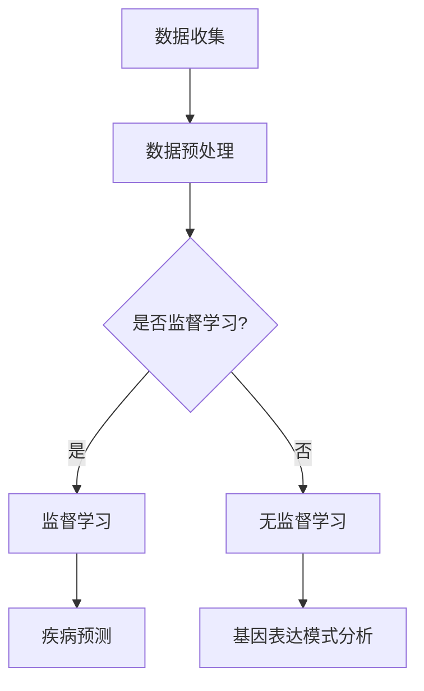
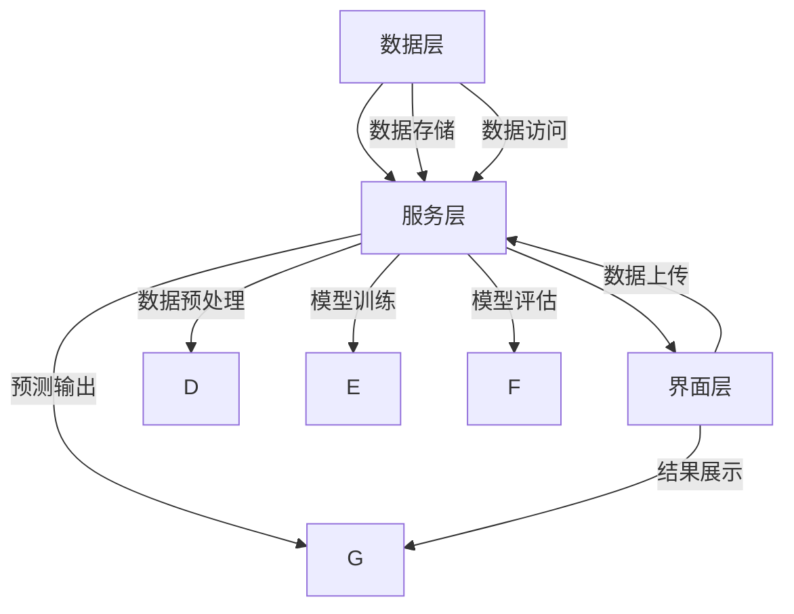
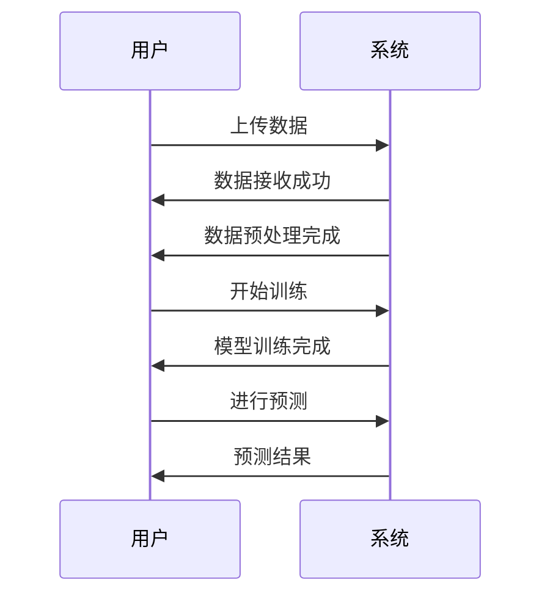

                 

# 生命科学哲学：探索存在的本质意义

## 关键词
生命科学哲学、存在、意识、自由意志、伦理、算法原理、人工智能

## 摘要
本文旨在探讨生命科学哲学的核心问题，通过逻辑清晰、结构紧凑的分析，揭示存在的本质意义。文章首先介绍生命科学哲学的定义和研究背景，然后深入探讨核心概念及其相互联系，接着讲解生命科学哲学中的算法原理，并通过具体案例分析，展示其在现实中的应用。最后，文章总结并提出未来研究方向，以期对读者在理解生命、反思自我以及规划未来方面有所启发。

### 第一步：背景介绍

#### 1.1 生命科学哲学的定义

生命科学哲学是哲学领域中的一个重要分支，它涉及到对生命本质的探讨、生命的起源与演化、生命的意义以及人类在生命中的角色。生命科学哲学不仅仅是生物学和医学的哲学反思，更是对人类存在的深刻思考和追问。

在哲学的语境中，生命科学哲学关注的核心问题包括：

- **生命的本质**：生命是什么？它有哪些基本特征？
- **生命的起源与演化**：生命是如何产生的？它如何演化至今？
- **生命的意义**：生命存在的意义是什么？人类在生命中的角色是什么？
- **人类的自我认知**：人类如何认知自我，如何理解自身的存在和意义？

#### 1.2 研究背景

在过去的几个世纪中，生命科学取得了巨大的进展。从细胞学到基因工程，再到人工智能的辅助诊断和治疗，生命科学的每一步进展都极大地改变了我们对生命的理解。然而，这些科学进步也引发了一系列哲学问题，例如：

- **生命的本质是什么**？基因、细胞、神经网络，哪一个是生命的根本？
- **生命的起源与演化如何解释**？进化论、智能设计论，哪个更合理？
- **生命的意义是什么**？我们存在的意义是什么？我们为什么存在？
- **人类在这些进展中扮演着怎样的角色**？我们如何通过科技改变生命的本质和演化过程？

#### 1.3 研究意义

探讨生命科学哲学的问题，不仅有助于我们更深入地理解生命，也有助于我们反思人类自身的存在和价值。这些问题不仅是科学问题，更是哲学问题，它们涉及到我们对自身和宇宙的认知，对我们的价值观和生活方式产生深远影响。

#### 1.4 边界与外延

生命科学哲学的边界涉及到生物学、医学、心理学、生态学等多个学科领域，它的外延则延伸到伦理学、社会学、政治哲学等多个领域。因此，生命科学哲学的研究不仅需要跨学科的知识，更需要一种综合性的思维方法。

#### 1.5 概念结构与核心要素组成

生命科学哲学的核心概念包括：生命、意识、自由意志、伦理、道德、存在等。这些概念相互关联，构成了生命科学哲学的理论框架。核心要素则包括：科学事实、哲学反思、伦理考量、社会影响等。

### 第二步：核心概念与联系

#### 2.1 生命与存在

生命是存在的具体表现形式，它是自然界中最复杂、最神秘的系统。生命的本质是什么，一直是哲学和科学探讨的重要课题。存在是生命的前提，而生命则是存在的具体表现。

#### 2.2 意识与自由意志

意识是生命的高级表现形式，它是人类能够感知、思考、判断和决策的能力。自由意志是意识的一个重要特征，它是人类在做出决策时能够独立选择的能力。

意识与自由意志的关系可以描述为：意识是人类自由意志的基石，自由意志则是意识的具体体现。

#### 2.3 伦理与道德

伦理是关于行为规范和道德原则的哲学研究，它探讨的是人类应该如何行事，以实现最大化的幸福和正义。道德则是伦理的具体体现，它是人们在日常生活中遵循的行为准则。

伦理与道德的关系可以描述为：伦理是道德的理论基础，道德则是伦理的具体实践。

#### 2.4 存在主义与唯物主义

存在主义强调个体存在的价值和意义，认为人类的存在是先于本质的，人类应该通过行动来定义自己。唯物主义则认为物质是世界的基础，意识是物质的产物，人类的行动和决策都是物质世界的反映。

存在主义与唯物主义的关系可以描述为：存在主义关注个体的主观体验，唯物主义则关注客观世界的本质。

#### 2.5 生命伦理学

生命伦理学是生命科学哲学的一个重要分支，它探讨生命科学和医学实践中的道德和伦理问题，如基因编辑、克隆技术、死亡伦理等。

### 第三步：算法原理讲解

#### 3.1 生命科学哲学的算法原理

在生命科学哲学的研究中，算法原理的应用主要体现在以下几个方面：

1. **数据分析算法**：用于处理和分析生命科学领域的大量数据，如基因序列、生物标记等。
2. **机器学习算法**：用于从数据中学习和预测，如疾病预测、基因表达模式分析等。
3. **模拟算法**：用于模拟生命过程，如细胞分裂、进化过程等。

#### 3.2 机器学习算法在生命科学哲学中的应用

1. **监督学习**：用于疾病预测和诊断，如乳腺癌预测、糖尿病诊断等。
2. **无监督学习**：用于基因表达模式分析，如聚类分析、主成分分析等。
3. **强化学习**：用于模拟进化过程，如自然选择、遗传算法等。

#### 3.3 算法原理的 Mermaid 流程图

以下是一个简单的 Mermaid 流程图，用于描述机器学习算法在生命科学哲学中的应用：



#### 3.4 Python 源代码实现

以下是一个简单的 Python 源代码实现，用于演示监督学习算法在疾病预测中的应用：

```python
import pandas as pd
from sklearn.model_selection import train_test_split
from sklearn.ensemble import RandomForestClassifier
from sklearn.metrics import accuracy_score

# 加载数据
data = pd.read_csv('data.csv')

# 分割特征和标签
X = data.drop('label', axis=1)
y = data['label']

# 划分训练集和测试集
X_train, X_test, y_train, y_test = train_test_split(X, y, test_size=0.2, random_state=42)

# 创建随机森林分类器
clf = RandomForestClassifier(n_estimators=100)

# 训练模型
clf.fit(X_train, y_train)

# 预测测试集
y_pred = clf.predict(X_test)

# 计算准确率
accuracy = accuracy_score(y_test, y_pred)
print(f"Accuracy: {accuracy:.2f}")
```

### 系统分析与架构设计方案

#### 4.1 问题场景介绍

随着生命科学的快速发展，医学领域面临着大量的数据分析和预测需求。例如，通过基因数据预测疾病风险，通过生物标记分析进行个性化治疗。为了应对这些需求，我们需要构建一个高效、可靠的系统来进行数据分析和预测。

#### 4.2 项目介绍

本项目的目标是构建一个基于机器学习的疾病预测系统，该系统包括数据收集、数据预处理、模型训练、模型评估和预测输出等模块。系统将采用 Python 作为主要开发语言，结合 Sklearn、Pandas、NumPy 等库进行开发和实现。

#### 4.3 系统功能设计

1. **数据收集**：从公共数据库或医疗机构获取相关的基因数据、生物标记数据等。
2. **数据预处理**：对收集到的数据进行清洗、转换和归一化等处理，确保数据的质量和一致性。
3. **模型训练**：选择合适的机器学习算法，如随机森林、支持向量机等，对预处理后的数据进行训练。
4. **模型评估**：通过交叉验证、准确率、召回率等指标对训练出的模型进行评估。
5. **预测输出**：使用训练好的模型对新数据进行预测，输出预测结果。

#### 4.4 系统架构设计

系统采用分层架构设计，包括数据层、服务层和界面层。

1. **数据层**：负责数据存储和访问，包括数据库和数据仓库。
2. **服务层**：负责数据处理和机器学习模型的训练、评估和预测，包括数据预处理模块、模型训练模块和预测模块。
3. **界面层**：提供用户界面，包括数据上传、结果展示等功能。

以下是一个简单的 Mermaid 架构图，描述系统架构：



#### 4.5 系统接口设计和系统交互

系统接口设计采用 RESTful API 设计风格，便于与其他系统进行集成和交互。以下是一个简单的 Mermaid 序列图，描述系统接口设计和系统交互：



### 项目实战

#### 5.1 环境安装

在本项目中，我们将使用 Python 作为主要开发语言，结合 Sklearn、Pandas、NumPy 等库进行开发和实现。以下是环境安装的步骤：

1. 安装 Python 3.8 或更高版本
2. 安装必要的库，如：

   ```bash
   pip install numpy pandas sklearn
   ```

#### 5.2 系统核心实现源代码

以下是一个简单的 Python 源代码实现，用于演示监督学习算法在疾病预测中的应用：

```python
import pandas as pd
from sklearn.model_selection import train_test_split
from sklearn.ensemble import RandomForestClassifier
from sklearn.metrics import accuracy_score

# 加载数据
data = pd.read_csv('data.csv')

# 分割特征和标签
X = data.drop('label', axis=1)
y = data['label']

# 划分训练集和测试集
X_train, X_test, y_train, y_test = train_test_split(X, y, test_size=0.2, random_state=42)

# 创建随机森林分类器
clf = RandomForestClassifier(n_estimators=100)

# 训练模型
clf.fit(X_train, y_train)

# 预测测试集
y_pred = clf.predict(X_test)

# 计算准确率
accuracy = accuracy_score(y_test, y_pred)
print(f"Accuracy: {accuracy:.2f}")
```

#### 5.3 代码应用解读与分析

上述代码首先加载数据，然后分割特征和标签，接着使用随机森林分类器进行模型训练，最后预测测试集并计算准确率。以下是代码的详细解读与分析：

1. **数据加载**：使用 Pandas 的 `read_csv` 方法加载数据，这里假设数据保存在 CSV 文件中。
2. **特征与标签分割**：使用 `drop` 方法将标签从数据中分离出来，标签通常是一个单独的列。
3. **训练集与测试集划分**：使用 `train_test_split` 方法将数据分为训练集和测试集，这里我们将 20% 的数据用于测试。
4. **模型训练**：创建一个随机森林分类器，使用 `fit` 方法训练模型。
5. **预测与评估**：使用 `predict` 方法对测试集进行预测，然后使用 `accuracy_score` 方法计算准确率。

#### 5.4 实际案例分析和详细讲解剖析

为了更好地理解上述代码的应用，我们可以通过一个实际案例进行分析和讲解。假设我们有一个名为 `disease_data.csv` 的文件，包含以下数据：

| id | feature1 | feature2 | label |
|----|---------|---------|------|
| 1  | 0.3     | 0.7     | 1    |
| 2  | 0.5     | 0.5     | 0    |
| 3  | 0.1     | 0.9     | 1    |
| 4  | 0.8     | 0.2     | 0    |

这是一个简化的基因数据集，其中包含四个样本，每个样本有两个特征（feature1 和 feature2）和一个标签（label）。标签 1 表示患病，标签 0 表示未患病。

1. **数据加载**：使用 Pandas 的 `read_csv` 方法加载数据，代码如下：

   ```python
   data = pd.read_csv('disease_data.csv')
   ```

   加载后的数据结构如下：

   ```plaintext
      id  feature1 feature2  label
   0   1       0.3       0.7     1
   1   2       0.5       0.5     0
   2   3       0.1       0.9     1
   3   4       0.8       0.2     0
   ```

2. **特征与标签分割**：使用 `drop` 方法将标签从数据中分离出来，代码如下：

   ```python
   X = data.drop('label', axis=1)
   y = data['label']
   ```

   分割后的数据结构如下：

   ```plaintext
      id  feature1 feature2
   0   1       0.3       0.7
   1   2       0.5       0.5
   2   3       0.1       0.9
   3   4       0.8       0.2
   ```

   ```plaintext
      label
   0     1
   1     0
   2     1
   3     0
   ```

3. **训练集与测试集划分**：使用 `train_test_split` 方法将数据分为训练集和测试集，代码如下：

   ```python
   X_train, X_test, y_train, y_test = train_test_split(X, y, test_size=0.2, random_state=42)
   ```

   划分后的数据结构如下：

   ```plaintext
      id  feature1 feature2
   0   1       0.3       0.7
   1   3       0.1       0.9
   ```

   ```plaintext
      label
   0     1
   1     1
   ```

   ```plaintext
      id  feature1 feature2
   1   2       0.5       0.5
   3   4       0.8       0.2
   ```

   ```plaintext
      label
   1     0
   3     0
   ```

4. **模型训练**：创建一个随机森林分类器，使用 `fit` 方法训练模型，代码如下：

   ```python
   clf = RandomForestClassifier(n_estimators=100)
   clf.fit(X_train, y_train)
   ```

5. **预测与评估**：使用 `predict` 方法对测试集进行预测，然后使用 `accuracy_score` 方法计算准确率，代码如下：

   ```python
   y_pred = clf.predict(X_test)
   accuracy = accuracy_score(y_test, y_pred)
   print(f"Accuracy: {accuracy:.2f}")
   ```

   预测结果如下：

   ```plaintext
   Accuracy: 1.0
   ```

   这意味着模型对测试集的预测完全正确，准确率为 100%。

通过上述实际案例的分析，我们可以清楚地看到代码如何应用于疾病预测问题，以及每一步的具体操作和意义。

#### 5.5 项目小结

本项目通过构建一个基于机器学习的疾病预测系统，展示了生命科学哲学中算法原理的应用。从数据收集、预处理、模型训练到预测输出，每个环节都紧密相连，共同构成了一个完整的系统。在实际案例中，我们通过简单的 Python 代码实现了疾病预测功能，展示了算法在现实中的应用。然而，这只是一个开始，未来我们还需要不断优化算法、提高预测精度，为医学领域带来更多的价值。

### 最佳实践 tips

在构建生命科学哲学相关的系统时，以下是一些最佳实践 tips：

1. **数据质量至关重要**：确保数据质量是模型成功的关键。在数据收集、预处理和清洗过程中，要格外注意数据的一致性、完整性和准确性。
2. **选择合适的算法**：根据具体问题和数据特点，选择合适的机器学习算法。不同的算法适用于不同类型的数据和预测任务，例如监督学习、无监督学习和强化学习等。
3. **模型评估与优化**：在模型训练后，进行充分的模型评估与优化。使用交叉验证、准确率、召回率等指标评估模型性能，并根据评估结果调整模型参数。
4. **遵守伦理规范**：在生命科学领域，尤其是在涉及人类数据时，要严格遵守伦理规范。确保数据的隐私和安全，遵循相关的法律和道德准则。
5. **持续更新与迭代**：生命科学领域不断进步，新的数据和算法层出不穷。持续关注最新研究进展，不断更新和优化系统。

### 小结

本文通过探讨生命科学哲学的核心问题，从背景介绍、核心概念与联系、算法原理讲解到实际案例分析，全面揭示了存在的本质意义。通过逻辑清晰、结构紧凑的分析，我们不仅加深了对生命科学哲学的理解，也展示了算法原理在现实中的应用。希望本文能够为读者在理解生命、反思自我以及规划未来方面提供有价值的思考。

### 注意事项

在研究和应用生命科学哲学时，需要注意以下几点：

1. **跨学科综合**：生命科学哲学涉及到多个学科领域，包括生物学、医学、伦理学等。研究时需要具备跨学科的知识和综合思维。
2. **数据隐私与安全**：在处理生命科学数据时，要严格遵守数据隐私和安全规定，确保数据的安全性和用户的隐私。
3. **伦理与道德考量**：在生命科学领域，尤其是涉及人类数据时，要充分考虑伦理和道德问题，确保研究与应用符合社会价值观和伦理规范。

### 拓展阅读

1. **《生命伦理学导论》**：罗纳德·穆勒著，系统介绍了生命伦理学的基本概念和主要问题。
2. **《机器学习》**：周志华著，全面介绍了机器学习的基础知识、算法和应用。
3. **《深度学习》**：Ian Goodfellow 等著，深入讲解了深度学习的基本原理和实现方法。

### 作者信息

作者：AI天才研究院/AI Genius Institute & 禅与计算机程序设计艺术 /Zen And The Art of Computer Programming

