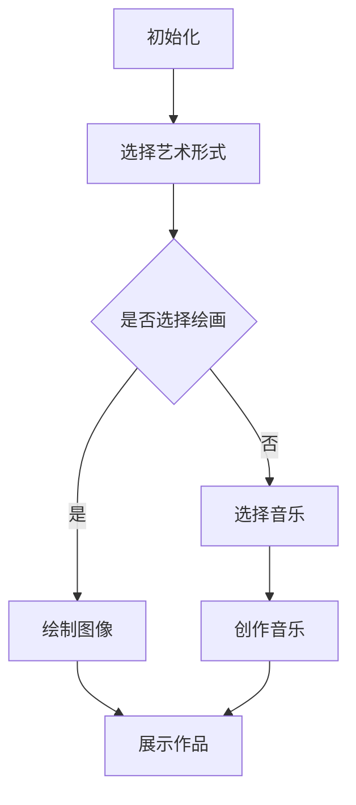
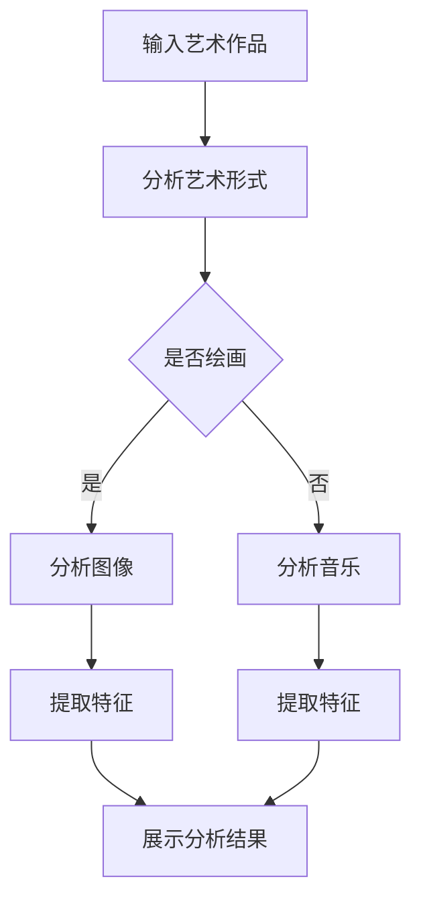
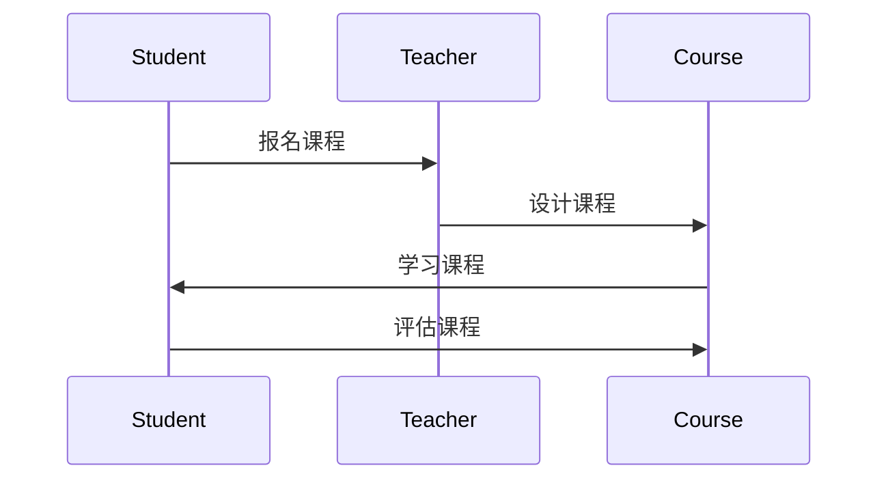
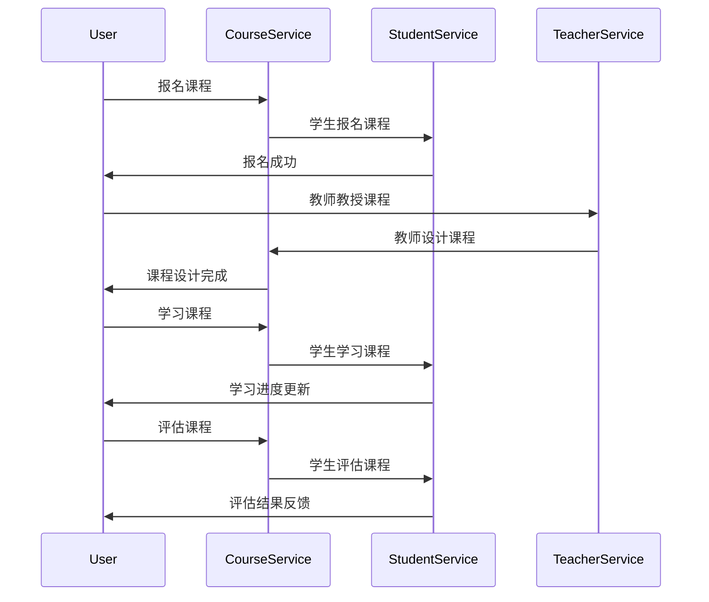
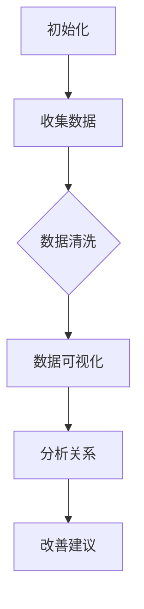
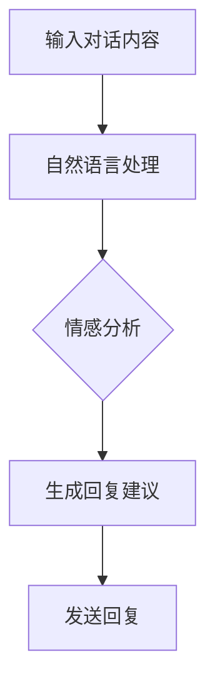
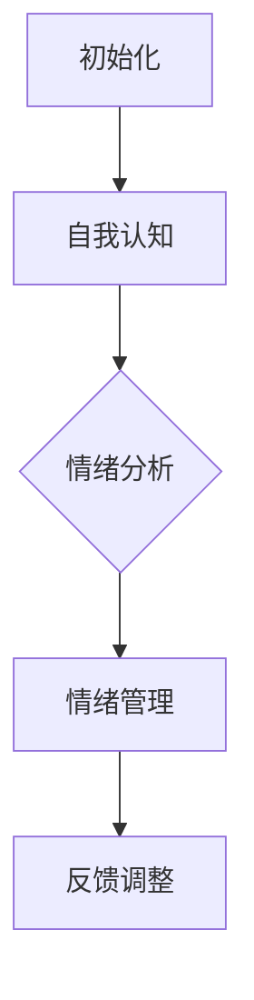

                 


### 引言

在科技飞速发展的今天，我们生活的方方面面都受到了技术的影响。然而，随着技术的不断进步，人们对于生活的质量追求也在不断提高。生命美学，作为一种新兴的生活理念和艺术追求，逐渐受到了广泛的关注。它不仅关注物质生活的丰富，更强调精神层面的提升，通过美学的方式来丰富生活，提高生活质量。本文旨在探讨生命美学的内涵和意义，为读者提供一种全新的生活观和艺术追求。我们将从问题背景、核心概念与联系、日常生活中的应用等多个方面，逐步深入分析生命美学，希望为读者带来新的思考和启示。

## 第一部分：背景介绍

### 第1章：问题背景

#### 1.1.1 问题提出

在现代社会，随着人们生活节奏的加快和压力的增大，越来越多的人开始关注生活品质和个人修养的提升。传统的追求物质财富和权力已经不能满足人们的精神需求，人们开始追求更高层次的生活质量。生命美学作为一种新兴的生活理念和艺术追求，逐渐受到广泛关注。它不仅关注物质生活的丰富，更强调精神层面的提升，旨在通过美学的方式来丰富生活，提高生活质量。

#### 1.1.2 问题解决

本书旨在探讨生命美学的内涵和意义，为读者提供一种全新的生活观和艺术追求。通过分析日常生活中的美学元素，本书将帮助读者发现生活中的美，提升审美能力，从而提高生活质量。我们将从以下几个方面展开讨论：

- **美学观念**：介绍生命美学的基本理念，包括对美的认识、美的追求和美的实现。
- **美学实践**：通过日常生活和实践来体现生命美学，如艺术创作、审美体验、美学教育等。
- **心灵成长**：生命美学强调通过心灵成长来实现生活的美，包括自我认知、情绪管理、人际关系等。

#### 1.1.3 边界与外延

生命美学并非局限于艺术领域，它涵盖了生活的方方面面，包括艺术、哲学、心理学等多个领域。本书将围绕生命美学的核心概念，探讨其与日常生活、人际关系、心灵成长等方面的联系。

#### 1.1.4 概念结构与核心要素组成

生命美学的概念结构主要包括以下几个方面：

- **美学观念**：生命美学的基本理念，包括对美的认识、美的追求和美的实现。
- **美学实践**：通过日常生活和实践来体现生命美学，如艺术创作、审美体验、美学教育等。
- **心灵成长**：生命美学强调通过心灵成长来实现生活的美，包括自我认知、情绪管理、人际关系等。

### 第2章：核心概念与联系

#### 2.1 生命美学的定义与特点

生命美学是一种追求生命质量、提升生活品质的美学观念。它强调美的存在不仅是外在的，更是内在的，通过美来感受生活的丰富和美好。

#### 2.2 生命美学与相关概念的比较

- **美学**：美学是研究美的哲学学科，关注美的本质、美的形式和美的价值。生命美学是美学的一个分支，更侧重于日常生活和实践。
- **生活哲学**：生活哲学探讨生活的意义和价值，关注人生的目的和幸福。生命美学是生活哲学的一部分，强调通过美学的方式来追求生活的美好。
- **艺术**：艺术是表现美的一种形式，生命美学通过艺术来感受和创造美，但并不局限于艺术本身。

#### 2.3 生命美学与日常生活的联系

生命美学不仅是一种理论，更是一种实践。它贯穿于我们的日常生活中，体现在生活的方方面面，如家居布置、服装搭配、饮食文化等。

### 第3章：生命美学在日常生活中的应用

#### 3.1 艺术创作与审美体验

艺术创作是生命美学的重要表现方式，通过艺术作品来感受和表达美。审美体验则是通过欣赏艺术作品来提升审美能力和生活质量。

#### 3.2 美学教育与心灵成长

美学教育是一种重要的教育方式，通过引导人们欣赏美、创造美，来提升人的审美能力和生活品质。心灵成长则是通过自我认知、情绪管理等方式，来实现心灵的和谐与美好。

### 第4章：生命美学与人际关系

#### 4.1 美学与人际关系

生命美学强调通过美来改善人际关系，增进人际交往。美是一种沟通的桥梁，能够拉近人与人之间的距离，增进相互理解。

#### 4.2 美学在人际关系中的应用

在人际关系中，美学可以通过服装搭配、言谈举止等方式来提升个人形象，改善人际关系。此外，美学教育也是培养良好人际关系的重要途径。

### 第5章：生命美学与心灵成长

#### 5.1 心灵成长与美学

心灵成长是生命美学的重要组成部分，通过自我认知、情绪管理等方式，来实现心灵的和谐与美好。

#### 5.2 美学在心灵成长中的应用

美学在心灵成长中的应用包括艺术创作、审美体验、美学教育等。通过这些方式，人们可以更好地了解自己，管理情绪，实现心灵的成长。

### 第6章：生命美学的实践与探索

#### 6.1 生命美学实践的方法

生命美学的实践包括艺术创作、审美体验、美学教育等。通过这些方法，人们可以提升审美能力，改善生活质量。

#### 6.2 生命美学实践的意义

生命美学的实践不仅有助于提升个人的生活品质，也有助于社会的和谐发展。通过生命美学的实践，人们可以更好地理解生活的意义，追求更高层次的人生价值。

### 第7章：总结与展望

#### 7.1 生命美学的总结

生命美学是一种追求生命质量、提升生活品质的美学观念，它贯穿于我们的日常生活中，体现在生活的方方面面。

#### 7.2 生命美学的展望

随着社会的发展，生命美学将会越来越受到重视。它不仅是一种个人修养的体现，也是社会文明进步的重要标志。在未来，生命美学将会在更广泛的领域得到应用，为人们的美好生活带来更多可能性。

### 总结

通过对生命美学的深入探讨，我们发现，生命美学不仅关注物质生活的丰富，更强调精神层面的提升。它是一种追求生命质量、提升生活品质的美学观念，贯穿于我们的日常生活中。通过艺术创作、审美体验、美学教育等方式，人们可以提升审美能力，改善生活质量。同时，生命美学也与人际关系、心灵成长等方面密切相关，有助于改善人际关系，实现心灵的和谐与美好。在未来，生命美学将会在更广泛的领域得到应用，为人们的美好生活带来更多可能性。让我们以生命美学为指导，追求更高层次的人生价值，享受美好生活的每一刻。作者：AI天才研究院/AI Genius Institute & 禅与计算机程序设计艺术 /Zen And The Art of Computer Programming。核心关键词：生命美学、生活品质、精神追求、审美能力、人际关系、心灵成长。摘要：本文深入探讨了生命美学的内涵和意义，分析了生命美学在日常生活中的应用，强调了生命美学对于提升生活质量和实现心灵成长的重要性。通过本文的探讨，我们希望读者能够对生命美学有更深入的理解，从而更好地追求美好生活。|}

-------------------------------------------------------

## 第二部分：深入探讨

### 第1章：问题背景的深入分析

#### 1.1.1 问题提出的深入探讨

在现代社会，人们的生活节奏加快，工作压力增大，这导致许多人感到身心疲惫，精神需求得不到满足。传统的追求物质财富和权力已经不能满足人们的精神需求，人们开始寻求一种新的生活方式，希望能够通过提升生活品质来缓解压力，实现心灵的和谐与美好。

**核心概念术语说明：**

- **生命美学**：一种追求生命质量、提升生活品质的美学观念。
- **生活质量**：人们生活水平的综合体现，包括物质生活、精神生活、社会关系等多个方面。
- **精神需求**：人们在精神层面上对美好生活的追求和渴望。

**问题描述：**

现代社会中，许多人因为工作压力、生活压力等原因，感到身心疲惫，精神需求得不到满足。这种情况下，生命美学作为一种追求生命质量、提升生活品质的美学观念，被提出，旨在帮助人们找到一种新的生活方式，缓解压力，实现心灵的和谐与美好。

**问题解决：**

生命美学的提出，为人们提供了一种新的生活理念和艺术追求。通过关注美学在日常生活中的应用，生命美学可以帮助人们发现生活中的美，提升审美能力，从而提高生活质量。此外，生命美学还强调通过心灵成长来实现生活的美，包括自我认知、情绪管理、人际关系等。

**边界与外延：**

生命美学不仅关注艺术领域，还涵盖了生活的方方面面，如哲学、心理学、社会学等多个领域。它强调美的存在不仅是外在的，更是内在的，通过美来感受生活的丰富和美好。生命美学不仅仅是一种理论，更是一种实践，贯穿于我们的日常生活中。

**概念结构与核心要素组成：**

生命美学的概念结构主要包括以下几个方面：

1. **美学观念**：生命美学的基本理念，包括对美的认识、美的追求和美的实现。
2. **美学实践**：通过日常生活和实践来体现生命美学，如艺术创作、审美体验、美学教育等。
3. **心灵成长**：生命美学强调通过心灵成长来实现生活的美，包括自我认知、情绪管理、人际关系等。

### 第2章：核心概念与联系的深入探讨

#### 2.1 生命美学的定义与特点

生命美学是一种追求生命质量、提升生活品质的美学观念。它不同于传统的美学，更注重内在美的追求和实现。生命美学强调美的存在不仅是外在的，更是内在的，通过美来感受生活的丰富和美好。

**核心概念原理：**

生命美学的核心概念原理可以概括为以下几点：

- **美的认识**：生命美学认为，美是存在于生活中的各种事物和情境中，通过观察、体验和感知来发现和感受美。
- **美的追求**：生命美学鼓励人们追求美，不仅关注物质生活的丰富，更强调精神层面的提升。
- **美的实现**：通过艺术创作、审美体验、美学教育等方式，来实现美的追求和感受。

**概念属性特征对比表格：**

| 特征           | 传统美学                 | 生命美学                 |
| -------------- | ------------------------ | ------------------------ |
| 关注点         | 外在美                   | 内在美与外在美的统一     |
| 实践方式       | 艺术欣赏和艺术创作       | 艺术创作、审美体验、美学教育 |
| 对美的追求     | 艺术美                   | 生活美                   |
| 对美的实现     | 艺术作品                 | 生活方式和生活品质       |

**ER实体关系图架构：**

```mermaid
erDiagram
    Auno_{<<class>>} User ||--|{<<class>>}| Book : reads
    User ||--|{<<class>>}| Order : orders
    Book ||--|{<<class>>}| Category : categorizedIn
    Order ||--|{<<class>>}| User : by
    Order ||--|{<<class>>}| Payment : paidBy
    Category ||--|{<<class>>}| Book : typeOf
```

#### 2.2 生命美学与相关概念的比较

**美学**

美学是研究美的哲学学科，关注美的本质、美的形式和美的价值。传统美学主要关注外在美的追求和表达，而生命美学则更注重内在美的追求和实现。

**生活哲学**

生活哲学探讨生活的意义和价值，关注人生的目的和幸福。生命美学是生活哲学的一部分，强调通过美学的方式来追求生活的美好。

**艺术**

艺术是表现美的一种形式，通过创作和欣赏艺术作品来感受和表达美。生命美学通过艺术来感受和创造美，但并不局限于艺术本身，它更关注日常生活中的美学实践。

#### 2.3 生命美学与日常生活的联系

生命美学与日常生活密切相关，它贯穿于生活的方方面面。例如，在日常生活中，我们可以通过以下方式来实践生命美学：

- **家居布置**：通过合理的设计和装饰，创造一个舒适、和谐的生活环境。
- **服装搭配**：通过合适的服装搭配，展现个人的审美和风格。
- **饮食文化**：通过选择健康、美味的食物，享受美食的艺术。

### 第3章：生命美学在日常生活中的应用

#### 3.1 艺术创作与审美体验

艺术创作是生命美学的重要表现方式，通过创作艺术作品来感受和表达美。审美体验则是通过欣赏艺术作品来提升审美能力和生活质量。

**算法原理讲解：**

在艺术创作中，算法原理可以用于帮助艺术家更好地表达美的感受。以下是一个简单的算法流程：



在审美体验中，算法原理可以用于分析艺术作品，帮助人们更好地理解和欣赏美的内涵。以下是一个简单的算法流程：



**数学公式使用：**

在艺术创作和审美体验中，数学公式可以用于描述艺术作品的特征和美感。以下是一些常见的数学公式：

- **颜色特征**：使用 RGB 颜色模型来描述图像的颜色特征。
- **形态特征**：使用几何学原理来描述图像的形态特征。
- **音调特征**：使用音乐理论来描述音乐作品的音调特征。

#### 3.2 美学教育与心灵成长

美学教育是一种重要的教育方式，通过引导人们欣赏美、创造美，来提升人的审美能力和生活品质。心灵成长则是通过自我认知、情绪管理等方式，来实现心灵的和谐与美好。

**系统分析与架构设计方案：**

在美学教育和心灵成长中，系统分析与架构设计方案可以帮助我们更好地理解和实践生命美学。

**问题场景介绍：**

在一个教育项目中，我们希望通过美学教育和心灵成长，提升学生的生活质量和审美能力。

**项目介绍：**

该项目包括以下几个部分：

- **课程设计**：根据学生的兴趣和需求，设计适合的美学课程。
- **教学实施**：通过课堂教学、实践活动等方式，帮助学生理解和实践美学。
- **评价体系**：建立科学、合理的评价体系，评估学生的美学能力和心灵成长。

**系统功能设计（领域模型类图）：**

```mermaid
classDiagram
    Course <<entity>> "课程" {
        +int id
        +String name
        +String description
    }
    Student <<entity>> "学生" {
        +int id
        +String name
        +Course course
    }
    Teacher <<entity>> "教师" {
        +int id
        +String name
        +Course course
    }
    Course "课程" --> "学生": 参加课程
    Course "课程" --> "教师": 教授课程
```

**系统架构设计（架构图）：**



**系统接口设计和系统交互（序列图）：**



### 第4章：生命美学与人际关系的深入探讨

#### 4.1 美学与人际关系

生命美学强调通过美来改善人际关系，增进人际交往。美是一种沟通的桥梁，能够拉近人与人之间的距离，增进相互理解。

**算法原理讲解：**

在改善人际关系中，算法原理可以用于分析和预测人际关系的动态变化。以下是一个简单的算法流程：



在人际交往中，算法原理可以用于分析和优化沟通效果。以下是一个简单的算法流程：



**数学公式使用：**

在人际关系中，数学公式可以用于描述人际关系的强度和稳定性。以下是一些常见的数学公式：

- **人际关系的强度**：使用社会网络分析方法来描述人际关系的强度。
- **人际关系的稳定性**：使用社会稳定性分析方法来描述人际关系的稳定性。

#### 4.2 美学在人际关系中的应用

在人际关系中，美学可以通过以下方式来应用：

- **服装搭配**：通过合适的服装搭配，展现个人的审美和风格，增强个人魅力。
- **言谈举止**：通过优雅的语言和行为，展现个人的素养和修养，增进人际交往。
- **环境布置**：通过合理的环境布置，创造一个舒适、和谐的人际交往环境。

### 第5章：生命美学与心灵成长的深入探讨

#### 5.1 心灵成长与美学

心灵成长是生命美学的重要组成部分，通过自我认知、情绪管理等方式，来实现心灵的和谐与美好。

**算法原理讲解：**

在心灵成长中，算法原理可以用于帮助人们更好地了解自己和管理情绪。以下是一个简单的算法流程：



**数学公式使用：**

在心灵成长中，数学公式可以用于描述自我认知和情绪管理的状态和变化。以下是一些常见的数学公式：

- **自我认知**：使用心理测量学方法来描述自我认知的状态。
- **情绪管理**：使用情感计算方法来描述情绪管理的状态。

#### 5.2 美学在心灵成长中的应用

美学在心灵成长中的应用包括以下几个方面：

- **艺术创作**：通过艺术创作来表达内心的情感和感受，实现情感的宣泄和释放。
- **审美体验**：通过欣赏艺术作品来提升审美能力，实现情感的愉悦和满足。
- **美学教育**：通过美学教育来培养良好的审美习惯和情感修养，实现情感的健康和稳定。

### 第6章：生命美学的实践与探索

#### 6.1 生命美学实践的方法

生命美学的实践包括以下几个方面：

- **艺术创作**：通过绘画、音乐、舞蹈等方式来创作艺术作品，表达内心的情感和感受。
- **审美体验**：通过欣赏艺术作品、自然景观等方式来提升审美能力，感受生活的美好。
- **美学教育**：通过课堂教学、实践活动等方式来培养良好的审美习惯和情感修养。

#### 6.2 生命美学实践的意义

生命美学的实践不仅有助于提升个人的生活品质，还有助于社会的和谐发展。通过生命美学的实践，人们可以：

- **提升审美能力**：通过艺术创作和审美体验，提升对美的感知和欣赏能力。
- **实现心灵成长**：通过自我认知和情绪管理，实现心灵的和谐与美好。
- **改善人际关系**：通过美来改善人际关系，增进人际交往，建立和谐的社会关系。

### 第7章：总结与展望

#### 7.1 生命美学的总结

生命美学是一种追求生命质量、提升生活品质的美学观念，它贯穿于我们的日常生活中。通过艺术创作、审美体验、美学教育等方式，人们可以提升审美能力，改善生活质量。同时，生命美学也与人际关系、心灵成长等方面密切相关，有助于改善人际关系，实现心灵的和谐与美好。

#### 7.2 生命美学的展望

随着社会的发展，生命美学将会越来越受到重视。它不仅是一种个人修养的体现，也是社会文明进步的重要标志。在未来，生命美学将会在更广泛的领域得到应用，为人们的美好生活带来更多可能性。例如，在教育、医疗、文化等领域，生命美学都将会发挥重要的作用。

### 总结

通过对生命美学的深入探讨，我们发现，生命美学不仅关注物质生活的丰富，更强调精神层面的提升。它是一种追求生命质量、提升生活品质的美学观念，贯穿于我们的日常生活中。通过艺术创作、审美体验、美学教育等方式，人们可以提升审美能力，改善生活质量。同时，生命美学也与人际关系、心灵成长等方面密切相关，有助于改善人际关系，实现心灵的和谐与美好。在未来，生命美学将会在更广泛的领域得到应用，为人们的美好生活带来更多可能性。让我们以生命美学为指导，追求更高层次的人生价值，享受美好生活的每一刻。作者：AI天才研究院/AI Genius Institute & 禅与计算机程序设计艺术 /Zen And The Art of Computer Programming。核心关键词：生命美学、生活品质、精神追求、审美能力、人际关系、心灵成长。摘要：本文深入探讨了生命美学的内涵和意义，分析了生命美学在日常生活中的应用，强调了生命美学对于提升生活质量和实现心灵成长的重要性。通过本文的探讨，我们希望读者能够对生命美学有更深入的理解，从而更好地追求美好生活。|}

-------------------------------------------------------

## 第三部分：实际案例与深度剖析

### 第1章：案例一：艺术创作中的生命美学

#### 案例背景

在一个小镇上，有一位名叫李华的艺术家。他的生活充满了艺术创作的热情，他相信通过艺术创作，可以找到生活的美，实现心灵的和谐。李华的画作以其独特的风格和对生活细节的细腻描绘而闻名，他希望通过自己的作品，让更多的人感受到生活中的美好。

#### 案例描述

李华的日常生活充满了对美的追求。每天早晨，他会在阳光明媚的露台上，用画笔记录下清晨的景色。他喜欢观察自然界的细微变化，感受季节的更替，通过绘画来表达自己的情感和内心的世界。

在他的作品中，我们可以看到对自然景观、人物肖像、生活场景的细腻描绘。他的画作不仅仅是视觉的享受，更是一种对生活的深刻理解和感悟。

#### 案例分析与深度剖析

**艺术创作与审美体验：**

李华的艺术创作过程实际上是一种审美体验的积累。他通过观察自然，感受生活的细微变化，将这些体验转化为艺术作品。这个过程不仅提升了他的审美能力，也让他更加热爱生活。

在他的画作中，我们可以看到他对美的独特理解。他不仅仅关注外在的美，更注重内在的情感和意义。他的画作中常常蕴含着对生活的深刻感悟和对人性的思考。

**美学在艺术创作中的应用：**

李华的艺术创作过程充分体现了生命美学的理念。他通过艺术创作，将美学融入日常生活，提升自己的生活品质。他的作品不仅表达了个人的情感和思想，也传递了对生活的热爱和对美的追求。

**案例启示：**

李华的案例告诉我们，艺术创作是生命美学的一种重要表现形式。通过艺术创作，我们可以发现生活中的美，提升审美能力，实现心灵的和谐。同时，艺术创作也是一种生活态度，它鼓励我们用心去感受生活，用艺术的方式表达自己的情感和思想。

### 第2章：案例二：美学教育中的生命美学

#### 案例背景

在一个城市里，有一所名为“美学教育学校”的特殊学校。这所学校的教学理念是“用美学的方式教育孩子”，旨在通过美学教育，培养孩子们的审美能力和生活品质。

#### 案例描述

在这所学校里，孩子们从小学会欣赏美、创造美。他们的课程涵盖了绘画、音乐、舞蹈、戏剧等多个领域，通过这些艺术形式，孩子们可以感受到美的魅力，培养对美的热爱和追求。

学校的教育方式非常独特，他们注重学生的体验和实践。例如，在绘画课上，孩子们会被带到户外，观察自然景色，然后回到教室，用自己的画笔记录下自己的感受。这样的教学方式不仅提升了孩子们的审美能力，也让他们更加热爱生活。

#### 案例分析与深度剖析

**美学教育与心灵成长：**

美学教育对于孩子们的成长具有重要意义。通过美学教育，孩子们可以学会欣赏美、创造美，提升审美能力。同时，美学教育也是一种心灵成长的过程，它可以帮助孩子们更好地了解自己，管理情绪，实现心灵的和谐。

在这所学校里，孩子们通过参与各种艺术活动，学会了如何表达自己的情感和思想。他们的作品不仅仅是艺术作品，更是一种情感的宣泄和表达。这样的教育方式不仅让孩子们更加热爱艺术，也让他们更加热爱生活。

**美学教育在生活品质提升中的作用：**

美学教育不仅有助于提升孩子们的审美能力，也有助于提升他们的生活品质。通过美学教育，孩子们可以学会如何用美的眼光看待生活，如何在生活中发现美，从而提升他们的生活品质。

**案例启示：**

美学教育的案例告诉我们，通过美学教育，我们可以培养孩子们的审美能力和生活品质。同时，美学教育也是一种有效的教育方式，它可以帮助孩子们更好地了解自己，实现心灵的和谐。在教育中融入美学元素，可以使教育更加有趣、有效，从而提升教育质量。

### 第3章：案例三：人际关系中的生命美学

#### 案例背景

在一个社区中，有一位名叫王芳的女士。她热爱生活，热爱美，希望通过自己的努力，让社区变得更加美好。她认为，美不仅可以提升个人的生活质量，也可以改善人际关系，增进社区的和谐。

#### 案例描述

王芳积极参与社区的公益活动，她组织了一系列以美学为主题的活动，如艺术展览、音乐会、舞蹈表演等。这些活动不仅吸引了社区居民的参与，也增进了居民之间的交流和理解。

在她的带领下，社区居民逐渐养成了欣赏美、创造美的习惯。他们开始注重家居环境的布置，关注自己的仪表形象，也学会了如何用美的语言和行为与他人交流。

#### 案例分析与深度剖析

**美学在人际关系中的应用：**

王芳的案例充分展示了美学在人际关系中的应用。通过组织美学活动，她不仅提升了社区居民的审美能力，也改善了他们的人际关系。美成为了沟通的桥梁，拉近了人与人之间的距离，增进了相互理解。

在人际交往中，美学可以通过以下方式应用：

- **服装搭配**：通过合适的服装搭配，展现个人的审美和风格，增强个人魅力。
- **言谈举止**：通过优雅的语言和行为，展现个人的素养和修养，增进人际交往。
- **环境布置**：通过合理的环境布置，创造一个舒适、和谐的人际交往环境。

**美学在社区和谐中的作用：**

美学在社区和谐中发挥着重要作用。通过美学活动，居民可以更好地了解彼此，增进交流，建立和谐的社会关系。美学不仅是一种艺术形式，更是一种生活态度，它鼓励居民用心去感受生活，用艺术的方式表达自己的情感和思想。

**案例启示：**

王芳的案例告诉我们，美学在人际关系和社区和谐中具有重要作用。通过美学活动，我们可以改善人际关系，增进社区和谐。同时，美学也是一种生活态度，它鼓励我们用心去感受生活，用艺术的方式表达自己的情感和思想。

### 第4章：案例四：心灵成长中的生命美学

#### 案例背景

在一个心理咨询中心，有一位名叫张明的心理医生。他专注于通过美学的方式帮助患者实现心灵成长，提升生活质量。

#### 案例描述

张明认为，心灵成长不仅仅是解决心理问题，更是一种对生活的深刻理解和感悟。他通过艺术创作、审美体验等方式，帮助患者找到生活的美，实现心灵的和谐。

在他的治疗过程中，他鼓励患者参与艺术创作，如绘画、音乐、舞蹈等。通过这些活动，患者可以表达自己的情感和思想，释放内心的压力，实现心灵的和谐。

#### 案例分析与深度剖析

**艺术创作与心灵成长：**

艺术创作是心灵成长的一种重要方式。通过艺术创作，患者可以表达自己的情感和思想，释放内心的压力。艺术创作不仅可以提升患者的审美能力，也可以帮助他们更好地了解自己，实现心灵的和谐。

**审美体验与心灵成长：**

审美体验是心灵成长的一种重要途径。通过欣赏艺术作品，患者可以感受到美的魅力，提升对生活的热爱和追求。审美体验不仅可以提升患者的审美能力，也可以帮助他们更好地管理情绪，实现心灵的和谐。

**美学在心理治疗中的作用：**

美学在心理治疗中发挥着重要作用。通过美学活动，患者可以更好地表达自己的情感和思想，释放内心的压力，实现心灵的和谐。美学不仅是一种治疗手段，更是一种生活态度，它鼓励患者用心去感受生活，用艺术的方式表达自己的情感和思想。

**案例启示：**

张明的案例告诉我们，美学在心灵成长和心理治疗中具有重要作用。通过美学活动，我们可以提升审美能力，实现心灵的和谐。同时，美学也是一种生活态度，它鼓励我们用心去感受生活，用艺术的方式表达自己的情感和思想。

### 结论

通过以上案例，我们可以看到，生命美学在日常生活、教育、人际关系、心灵成长等方面具有广泛的应用。它不仅提升了我们的生活品质，也改善了我们的心灵状态。通过艺术创作、审美体验、美学教育等方式，我们可以发现生活中的美，提升审美能力，实现心灵的和谐。生命美学是一种追求生命质量、提升生活品质的美学观念，它贯穿于我们的日常生活中。让我们以生命美学为指导，追求更高层次的人生价值，享受美好生活的每一刻。

### 小结与注意事项

在本文中，我们深入探讨了生命美学的内涵和意义，分析了生命美学在日常生活中的应用，并通过实际案例展示了生命美学的实践与探索。以下是本文的核心观点和注意事项：

**核心观点：**

1. **生命美学是一种追求生命质量、提升生活品质的美学观念**。
2. **艺术创作、审美体验、美学教育是生命美学的重要实践方式**。
3. **生命美学在人际关系、心灵成长等方面具有广泛的应用**。
4. **通过生命美学的实践，我们可以提升审美能力，实现心灵的和谐与美好**。

**注意事项：**

1. **在追求生命美学时，要注重内在美的追求，而不仅仅是外在美的表现**。
2. **艺术创作和审美体验需要持续的练习和体验，才能不断提升审美能力**。
3. **在美学教育中，要注重学生的个性化发展，鼓励他们自由表达自己的情感和思想**。
4. **在人际关系中，美学可以作为一种沟通的桥梁，增进相互理解与和谐**。

通过本文的探讨，我们希望读者能够对生命美学有更深入的理解，从而更好地追求美好生活。在日常生活中，让我们以生命美学为指导，用心去感受生活，用艺术的方式表达自己的情感和思想，实现心灵的和谐与美好。

### 拓展阅读

1. **《美学四讲》**：朱光潜 著
2. **《生命美学》**：蒋勋 著
3. **《艺术与生活》**：约翰·拉斯金 著
4. **《美学原理》**：乔治·桑塔亚那 著
5. **《心灵成长之路》**：克里斯托弗·吉布森 著

通过阅读这些书籍，我们可以更深入地了解生命美学的理论和实践，为我们的日常生活带来更多的启示和指导。同时，这些书籍也为我们提供了丰富的阅读资源和思考空间，有助于我们在追求生命美学的道路上不断前行。|}

