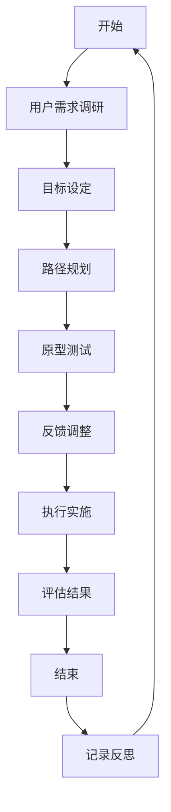
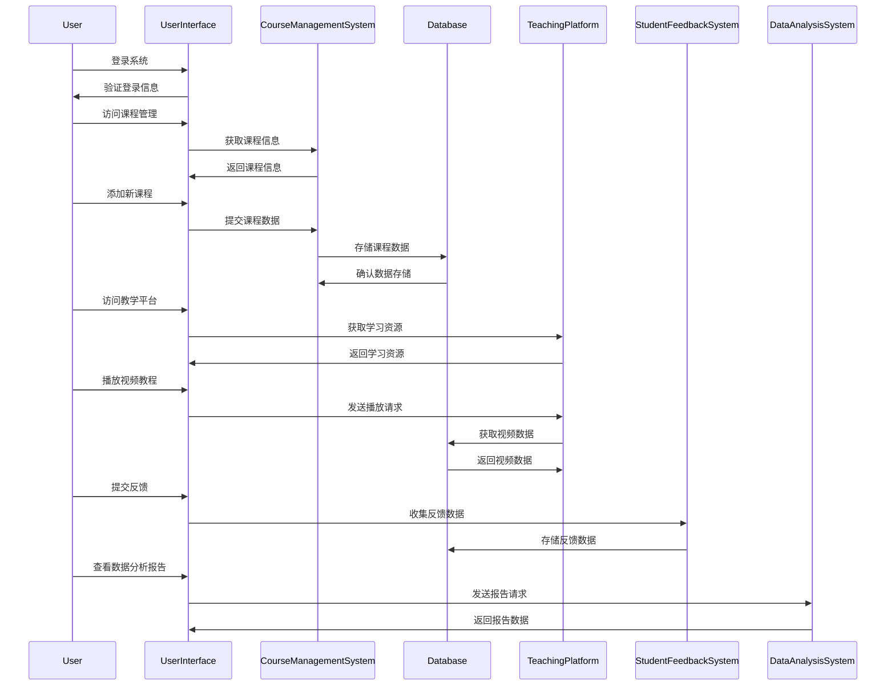

                 

### 引言：设计思维与人生规划的交汇

在快速变化的时代，设计思维和人生规划成为了提升个人和社会发展的关键工具。设计思维，起源于设计领域，强调以用户为中心，通过迭代和试错来创造出创新解决方案。它不仅适用于产品设计，还广泛应用于战略规划、社会创新和问题解决等多个领域。另一方面，人生规划是个体为了实现个人目标和理想生活而进行的长远计划和持续努力。两者看似不同领域，但它们的交集却在现代社会中日益凸显。

生命设计思维学院正是认识到这一点，将设计思维的核心理念引入人生规划教育，成为了一个独特的教育机构。它不仅教授设计思维的基本原理和方法，更重要的是，通过系统化的课程和实践，帮助学员将设计思维应用于个人和职业规划中，实现更加有目标和有意义的生活。

本文将深入探讨生命设计思维学院的核心理念和应用方法。首先，我们会介绍设计思维和人生规划的基本概念，帮助读者理解它们的重要性和核心要素。接着，我们将通过具体案例，展示设计思维如何在人生规划中发挥作用。随后，我们将详细分析生命设计思维学院的教育实践，探讨其教育目标和教学方法。文章的最后，我们将探讨设计思维在人生规划领域的未来趋势，以及如何将最佳实践应用于实际操作中。

通过这篇文章，我们希望能够激发读者对设计思维和人生规划的思考，并为那些渴望通过创新方法实现更好人生的人提供实用的指导和建议。让我们一起思考，如何将设计思维这一强大的工具应用于人生规划，创造出更加美好的未来。

---

## 关键词

设计思维、人生规划、创新方法、教育机构、个人发展

### 摘要

本文旨在探讨生命设计思维学院如何将设计思维的核心理念应用于人生规划教育，从而帮助个人和职业发展。通过介绍设计思维和人生规划的基本概念，本文将揭示两者之间的内在联系。随后，通过具体案例，我们将展示设计思维在人生规划中的实际应用。接下来，本文将深入分析生命设计思维学院的教育实践，探讨其课程设计、教学方法和学生反馈。最后，我们将探讨设计思维在人生规划领域的未来趋势，并提供实用的最佳实践建议。通过本文的阅读，读者将能够理解设计思维在人生规划中的重要性，并掌握如何应用这一创新方法来实现个人和职业目标。

---

### 背景介绍

#### 核心概念术语说明

在设计思维和人生规划的话题中，有一些核心概念和术语需要我们首先进行明确和定义。这些概念和术语不仅为我们的讨论奠定了基础，也帮助读者更好地理解和应用设计思维在人生规划中的价值。

**设计思维**：
设计思维是一种以用户需求为中心的系统性创新方法，起源于设计领域。它强调通过观察、访谈、用户体验等方法，深入理解用户的需求和痛点，然后通过迭代和试错来创造性地解决问题。设计思维通常包含五个主要阶段：共鸣（Empathize）、定义（Define）、构思（Ideate）、原型（Prototype）和测试（Test）。这一方法不仅适用于物质产品的设计，还广泛应用于服务设计、战略规划和社会创新等多个领域。

**人生规划**：
人生规划是指个人为了实现长期目标而制定的详细计划。它涵盖了职业发展、个人成长、财务规划、家庭生活等多个方面。一个有效的人生规划不仅需要设定明确的目标，还需要考虑如何实现这些目标，包括所需的资源、时间和行动步骤。人生规划的核心在于帮助个体明确自己的价值观、兴趣和能力，从而在复杂多变的环境中做出明智的决策。

**设计思维与人生规划的联系**：
设计思维和人生规划之间的联系主要体现在以下几个方面：

1. **以用户为中心**：设计思维强调以用户的需求和体验为核心，这一理念在人生规划中也同样适用。一个有效的人生规划需要深刻理解个人的需求和期望，从而制定出符合自身特点的目标和计划。

2. **迭代和试错**：设计思维中的迭代和试错方法可以帮助个人在人生规划中不断调整和优化目标。通过不断实践和反思，个人可以更好地了解自己的需求和资源，从而逐步实现目标。

3. **系统性思维**：设计思维强调系统性思维，这有助于个人在制定人生规划时，综合考虑各种因素，包括职业、财务、家庭和个人成长等。这种全面的视角有助于避免因单一因素导致的决策失误。

4. **创新与灵活性**：设计思维中的创新方法和灵活性可以帮助个人在面对人生中的挑战和变化时，迅速适应并找到新的解决方案。这对于那些追求长期目标和持续成长的人来说尤为重要。

通过明确这些核心概念和术语，我们为接下来的讨论奠定了坚实的基础。在接下来的部分中，我们将进一步探讨设计思维和人生规划的具体应用和实践，帮助读者更深入地理解这两者之间的内在联系。

#### 问题背景

设计思维和人生规划在现代社会中的重要性日益凸显，这一现象背后有着深刻的社会和经济背景。首先，全球化和技术进步加速了社会的变化，人们的生活方式和职业发展面临着前所未有的复杂性和不确定性。在这种大环境下，传统的线性思维和固定规划方法往往难以应对快速变化的环境和需求。

**社会背景**：
现代社会的一个显著特征是多元化。人们的兴趣、价值观和职业选择越来越多样化，传统的一元化教育模式和专业路径已经无法满足所有人的需求。设计思维提供了一种以人为本、灵活多样的方法，可以帮助个体在多元化社会中找到自己的定位和路径。

**经济背景**：
经济全球化和互联网的普及带来了巨大的竞争压力和机会。企业需要不断创新以适应市场的变化，个人也需要不断提升自己的能力和竞争力。设计思维作为一种创新方法，不仅可以应用于产品和服务设计，还可以应用于战略规划和职业发展，帮助个人和企业找到新的增长点。

**教育背景**：
随着教育的普及，越来越多的年轻人拥有了接受高等教育的机会。然而，传统教育体系中的知识传授方式往往较为单一，缺乏对个人全面发展的关注。设计思维和人生规划的引入，为教育机构提供了一种新的教学方法和教育理念，有助于培养学生的创新思维和解决问题的能力。

**个人发展背景**：
在个人层面，许多人意识到仅靠传统的职业规划方法难以满足他们对自我实现和人生价值的追求。设计思维提供了一种更加灵活和个性化的方法，可以帮助个人探索自己的兴趣和潜力，实现个人成长和职业发展。

**现实需求**：
在现代社会中，人们面临着越来越多的选择和决策。如何选择职业、如何规划个人生活、如何应对生活中的变化等问题，成为许多人关注的焦点。设计思维和人生规划提供了一套系统化的方法和工具，帮助人们更好地应对这些现实需求，实现个人和职业目标。

综上所述，设计思维和人生规划在现代社会中的重要性体现在多个方面：它不仅帮助个人在复杂多变的环境中找到自己的定位和路径，还为企业和社会的发展提供了创新的动力和方法。因此，深入研究和应用设计思维和人生规划，具有重要的现实意义和长远价值。

#### 问题描述

在现代社会中，设计思维和人生规划的重要性体现在其解决的一系列现实问题和挑战。首先，传统线性规划和决策方法在应对复杂、多变的环境时显得力不从心。这种方法的局限性在于其过度依赖预设的目标和路径，忽视了个体需求和现实情境的动态变化。设计思维通过其以用户为中心的核心理念，强调通过观察、访谈和用户体验等方法，深入理解个体的需求和期望，从而为问题解决提供了更加灵活和创新的视角。

具体来说，设计思维在人生规划中的应用，可以解决以下几个关键问题：

1. **目标设定不明确**：在传统的规划方法中，目标设定往往较为单一和固定，缺乏灵活性。设计思维通过多角度、多层次的观察和体验，帮助个体更准确地识别和设定自己的目标。这种方法不仅考虑了个体的内在需求和兴趣，还考虑了外部环境的变化，从而确保目标的实现具有更强的现实性和可持续性。

2. **路径选择受限**：传统规划方法在路径选择上往往受到既定模式和路径的限制，缺乏创新和灵活性。设计思维鼓励个体通过迭代和试错，不断探索和优化实现目标的路径。这种方法不仅帮助个体发现新的机会和可能性，还能够应对环境变化带来的挑战，提高目标的实现率。

3. **资源利用不充分**：在传统规划中，资源分配和利用往往基于预设的计划和目标，导致资源的浪费和低效。设计思维强调资源的最大化利用，通过不断评估和调整，确保资源的有效配置和优化。这种方法不仅提高了资源的利用效率，还减少了不必要的浪费。

4. **决策质量不高**：传统决策方法往往依赖于经验和直觉，缺乏系统性和科学性。设计思维通过系统化的方法，如用户调研、数据分析和原型测试，帮助个体做出更加全面和科学的决策。这种方法不仅提高了决策的质量，还减少了因决策失误带来的风险。

5. **适应能力不足**：在快速变化的社会环境中，个体和组织的适应能力成为关键。设计思维通过其灵活性和创新性，帮助个体和企业在面对不确定性和变化时，能够迅速调整和适应。这种方法不仅提高了个体的适应能力，还增强了组织的灵活性。

综上所述，设计思维和人生规划的应用，不仅解决了传统规划方法在目标设定、路径选择、资源利用、决策质量和适应能力方面的局限性，还提供了更加灵活和创新的解决方案。通过设计思维的方法，个体可以在复杂多变的环境中找到自己的定位和路径，实现个人和职业目标，从而更好地应对现代社会的挑战。

#### 问题解决

面对现代社会中设计思维和人生规划面临的问题和挑战，生命设计思维学院提出了一套系统化、科学化的解决方案，旨在帮助个体和组织在复杂多变的环境中实现有效规划和发展。以下是生命设计思维学院针对主要问题所采用的方法和策略：

**解决目标设定不明确的问题**：
1. **多角度调研**：通过广泛的用户调研，包括深度访谈、焦点小组和观察方法，收集个体和用户的需求、期望和痛点。
2. **目标设定工具**：采用SWOT分析、SMART目标和情境地图等工具，帮助个体明确和细化目标。
3. **目标迭代**：鼓励学员通过持续的反思和反馈，不断调整和优化目标，确保其与现实环境保持一致。

**解决路径选择受限的问题**：
1. **创新思维训练**：通过思维导图、六顶思考帽和头脑风暴等训练方法，提高学员的创新思维和问题解决能力。
2. **原型测试**：在规划和决策过程中，使用快速原型和迭代测试，不断验证和优化路径的可行性和效果。
3. **多元化路径规划**：鼓励学员从多个角度和层面考虑问题的解决方案，探索不同的路径选择，提高路径的多样性和灵活性。

**解决资源利用不充分的问题**：
1. **资源评估与优化**：通过资源评估表和资源管理工具，帮助学员识别和评估现有的资源，实现资源的最优配置。
2. **资源整合策略**：通过跨部门合作、资源共享和外部协作，实现资源的最大化利用。
3. **持续优化**：鼓励学员通过定期评估和反馈，持续优化资源的利用效率。

**提高决策质量**：
1. **数据驱动的决策**：通过数据收集和分析，提供基于事实的决策支持。
2. **决策模型**：采用多标准决策模型、决策树和决策矩阵等工具，提高决策的全面性和科学性。
3. **风险管理和评估**：通过风险识别、评估和应对策略，减少决策失误带来的风险。

**提升适应能力**：
1. **敏捷训练**：通过敏捷训练和敏捷方法，提高学员在快速变化环境中的适应能力和灵活性。
2. **情境模拟**：通过情境模拟和模拟演练，帮助学员在模拟环境中实践和应对各种变化。
3. **持续学习和反思**：鼓励学员通过持续学习和反思，不断提升自身的适应能力和创新能力。

综上所述，生命设计思维学院通过系统化的方法和工具，帮助个体和组织解决目标设定、路径选择、资源利用、决策质量和适应能力等方面的问题，实现更加有效和有意义的人生规划。通过这些解决方案，学员不仅能够应对复杂多变的环境，还能在个人和职业发展中取得更大的成就。

#### 边界与外延

在设计思维和人生规划的结合中，界定其应用的边界和外延是至关重要的，这有助于明确本书所覆盖的主题范围，并避免内容过于宽泛或过于狭窄。

**应用的边界**：
1. **设计思维的范畴**：本书主要探讨设计思维在人生规划中的应用，而非设计思维本身的深入技术细节。因此，内容将聚焦于设计思维在个人和职业规划中的方法论和工具，而非设计实践中的具体技术，如工业设计或用户体验设计。

2. **人生规划的深度**：本书关注的是如何通过设计思维进行人生规划，而非深入探讨人生规划中的心理学、社会学或经济学的理论。因此，内容将侧重于实际操作和案例分析，而非复杂的理论阐述。

**外延的范围**：
1. **教育机构的角色**：本书将探讨生命设计思维学院作为教育机构的独特作用，包括课程设计、教学方法、学生反馈和评估等方面。

2. **实践应用场景**：本书将涵盖设计思维在人生规划中的多种实践应用场景，如职业发展、创业指导、个人成长和家庭生活规划等。

3. **跨学科融合**：本书将讨论设计思维与心理学、管理学、经济学等其他学科的结合，展示跨学科视角在设计思维和人生规划中的重要性。

通过明确边界与外延，本书旨在为读者提供既有深度又具实用价值的内容，帮助读者理解和应用设计思维在人生规划中的实际操作。

#### 概念结构与核心要素组成

在设计思维和人生规划的融合中，理解其核心概念和要素组成至关重要。这不仅为我们提供了理论基础，也明确了设计思维在人生规划中的具体应用场景。

**设计思维的核心概念**：

1. **用户中心设计**：设计思维强调以用户的需求和体验为核心，通过深入研究用户的行为、情感和需求，设计出真正符合用户期望的产品和服务。

2. **迭代和试错**：设计思维采用迭代和试错的方法，通过不断测试和调整，优化解决方案，确保最终产品能够满足用户的需求。

3. **跨学科协作**：设计思维强调跨学科团队的协作，通过整合不同领域的知识和技能，创造出创新和有效的解决方案。

4. **系统性思维**：设计思维鼓励从系统的角度思考问题，理解各个部分之间的相互关系，从而提出全面和创新的解决方案。

**人生规划的核心要素**：

1. **目标设定**：人生规划的首要任务是明确目标，包括短期和长期目标，确保这些目标与个人的价值观和愿景相一致。

2. **资源评估**：评估个人和外部资源，包括时间、金钱、技能和网络，确保资源的有效利用。

3. **路径规划**：设计实现目标的路径，包括具体行动步骤和里程碑，确保目标能够逐步实现。

4. **适应性和灵活性**：设计思维强调灵活性，人生规划也需要考虑环境变化和不确定性，制定灵活的应对策略。

**设计思维与人生规划的融合**：

1. **用户需求分析**：在人生规划中，通过设计思维的方法，深入分析个人需求，明确职业和个人发展的目标。

2. **迭代和试错**：在实现人生规划的过程中，不断尝试和调整，通过反思和反馈，优化路径和策略。

3. **系统性思维**：设计思维帮助个体从整体和系统的角度考虑人生规划，综合考虑职业、财务、家庭和个人成长等多个方面。

4. **跨学科协作**：设计思维鼓励跨学科合作，帮助个体在人生规划中整合不同领域的知识和资源，提高规划的有效性。

通过上述核心概念和要素的分析，我们可以看到设计思维和人生规划的融合不仅为个人提供了理论框架，还提供了具体的操作工具和策略。这种融合不仅有助于明确人生目标，提高路径规划的效率和灵活性，还能帮助个体在复杂多变的环境中找到适应和发展的方法。因此，理解这些核心概念和要素，是成功应用设计思维于人生规划的关键。

### 核心概念原理

为了深入理解设计思维在人生规划中的应用，我们需要详细探讨其核心概念和原理。设计思维作为一种系统性创新方法，其核心理念不仅适用于物质产品的设计，还可以广泛应用于个人和职业规划。以下是设计思维的关键概念及其在人生规划中的应用：

**1. 用户中心设计**：

用户中心设计是设计思维的基础，强调以用户的需求和体验为核心进行设计。在人生规划中，这意味着我们需要深入理解个人的需求、期望和痛点，从而制定出符合个人目标和价值观的规划。

- **应用场景**：例如，一个职业规划师在帮助客户制定职业发展计划时，会首先进行深入访谈和调研，了解客户的职业兴趣、技能和职业目标，从而制定出个性化的职业发展路径。

- **工具和方法**：可以使用用户画像、用户访谈、问卷调查和用户体验地图等工具，帮助个体明确自己的需求和期望。

**2. 迭代和试错**：

迭代和试错是设计思维的核心方法之一，强调通过不断的测试和反馈，逐步优化解决方案。在人生规划中，这意味着我们需要在实现目标的过程中不断调整和优化计划，以适应不断变化的环境。

- **应用场景**：例如，一个创业者制定了一份商业计划书，但他知道市场环境和自身能力可能在执行过程中发生变化。因此，他会通过小规模的试点项目来测试和验证商业计划的可行性，并根据反馈不断进行调整。

- **工具和方法**：可以使用快速原型、敏捷开发、迭代测试等方法，帮助个体在实现目标的过程中不断调整和优化规划。

**3. 跨学科协作**：

设计思维强调跨学科团队的协作，通过整合不同领域的知识和技能，创造出创新和有效的解决方案。在人生规划中，这意味着我们需要调动多方面的资源，综合运用各种方法和工具。

- **应用场景**：例如，一个个人在规划职业生涯时，不仅需要考虑自己的专业技能，还需要了解行业趋势、市场需求以及财务规划等多方面的信息。

- **工具和方法**：可以使用团队协作工具、跨学科研讨会、专家咨询等方法，帮助个体在人生规划中整合不同领域的资源和知识。

**4. 系统性思维**：

设计思维鼓励从系统的角度思考问题，理解各个部分之间的相互关系，从而提出全面和创新的解决方案。在人生规划中，这意味着我们需要从整体和系统的角度考虑个人的职业发展、家庭生活、财务规划等多个方面。

- **应用场景**：例如，一个家庭在制定财务规划时，不仅需要考虑个人的收入和支出，还需要考虑家庭成员的健康、教育和退休规划等。

- **工具和方法**：可以使用系统思维工具、决策树、SWOT分析等方法，帮助个体从系统的角度进行规划和决策。

**5. 反思和评估**：

设计思维强调通过反思和评估来不断优化解决方案。在人生规划中，这意味着我们需要定期反思自己的行动和目标，评估规划的成效，并根据反馈进行调整。

- **应用场景**：例如，一个个人在完成一个重要的职业目标后，会进行反思和总结，分析成功的经验和需要改进的地方，为下一个目标做好准备。

- **工具和方法**：可以使用反思日记、反馈问卷、360度评估等方法，帮助个体进行反思和评估。

通过详细探讨设计思维的核心概念和原理，我们可以更好地理解其如何应用于人生规划中。用户中心设计、迭代和试错、跨学科协作、系统性思维和反思评估这些核心概念，不仅为个人提供了理论框架，还提供了具体的操作方法和工具，帮助个体在复杂多变的环境中实现自己的目标和理想生活。

### 概念属性特征对比表格

为了更直观地理解设计思维和人生规划的相关概念，我们创建了一个对比表格，展示它们的主要属性和特征。通过这个表格，我们可以清晰地看到两个领域之间的异同点，以及它们如何相互补充。

| 概念       | 设计思维                           | 人生规划                               |
|------------|-----------------------------------|----------------------------------------|
| 定义       | 以用户需求为中心的系统性创新方法       | 为了实现个人目标和理想生活而制定的长远计划 |
| 目标       | 解决实际问题，创造创新解决方案          | 实现职业、财务、家庭和个人成长等多方面目标  |
| 关键要素   | 用户中心设计、迭代和试错、跨学科协作    | 目标设定、资源评估、路径规划、适应性       |
| 应用范围   | 产品设计、战略规划、社会创新           | 职业规划、创业指导、个人成长、家庭生活     |
| 着重点     | 创新性和灵活性                       | 长期目标和可持续性                       |
| 方法       | 用户调研、原型测试、系统思维           | SWOT分析、SMART目标、时间管理           |
| 互动性     | 强调用户反馈和迭代                   | 强调个人反思和评估                       |
| 效果衡量   | 创新解决方案的质量和用户满意度          | 目标的实现程度和幸福感                    |
| 适用对象   | 设计师、工程师、创业者和问题解决者      | 个人、职业规划师、企业和教育机构          |

通过这个对比表格，我们可以清晰地看到设计思维和人生规划在定义、目标、关键要素、应用范围、着重点、方法、互动性、效果衡量和适用对象等方面的异同。这有助于我们更好地理解两个领域的互补性和在综合应用中的优势。

### ER实体关系图架构

为了更清晰地展示设计思维和人生规划中的核心实体及其相互关系，我们使用Mermaid语言绘制了一个ER（实体关系）图。以下是一个简单的ER图示例，描述了设计思维在人生规划中的应用：

```mermaid
erDiagram
    Person ||--|{ Designer } Designer : creates solutions
    Person ||--|{ Planner } Planner : plans life goals
    Designer ||--|{ UserResearcher } UserResearcher : conducts user studies
    Planner ||--|{ GoalSetters } GoalSetters : defines life objectives
    Designer ||--|{ Innovator } Innovator : explores new ideas
    Planner ||--|{ LifeCoach } LifeCoach : provides guidance
    Designer ||--|{ ProjectManager } ProjectManager : oversees projects
    Planner ||--|{ DecisionMaker } DecisionMaker : makes life choices
```

在这个ER图中，我们定义了几个关键实体：

- **Person**：代表所有参与设计思维和人生规划的个人。
- **Designer**：代表应用设计思维来创造解决方案的人。
- **Planner**：代表负责制定和实现人生规划的人。
- **UserResearcher**：负责进行用户研究，以理解用户需求和痛点。
- **GoalSetters**：负责设定和明确人生目标。
- **Innovator**：负责探索新想法和解决方案。
- **LifeCoach**：提供人生规划和指导。
- **ProjectManager**：负责管理和监督设计思维和人生规划项目。
- **DecisionMaker**：负责做出关键决策。

这些实体之间的关系展示了设计思维和人生规划中的关键角色及其相互协作的方式。通过这种系统化的实体关系图，我们可以更直观地理解设计思维和人生规划中的关键要素及其互动关系，从而为实际应用提供清晰的指导。

### 算法原理讲解

为了深入理解设计思维在人生规划中的具体应用，我们将通过一个具体的算法示例来讲解其原理和流程。以下是设计思维在人生规划中的应用算法的Mermaid流程图：



**Mermaid流程图解释**：

1. **用户需求调研**：首先，我们需要通过访谈、问卷调查等方法，深入理解个人的需求和痛点。这一步骤是设计思维中的“共鸣（Empathize）”阶段。

2. **目标设定**：在明确用户需求后，我们需要设定具体、可衡量的目标。这些目标应该是基于用户需求和个人的价值观制定的。这是设计思维中的“定义（Define）”阶段。

3. **路径规划**：接下来，我们需要制定实现目标的路径和行动步骤。这些路径应该灵活且可调整，以适应环境变化。这是设计思维中的“构思（Ideate）”阶段。

4. **原型测试**：在制定路径后，我们需要创建原型或测试方案，以验证其可行性和效果。这一步骤可以帮助我们识别潜在的问题，并对其进行优化。这是设计思维中的“原型（Prototype）”阶段。

5. **反馈调整**：在测试过程中，我们需要收集用户的反馈，并根据反馈进行相应的调整。这一迭代过程是设计思维中的“测试（Test）”阶段，通过不断试错和优化，确保解决方案的完善。

6. **执行实施**：在完成调整后，我们将进入实施阶段，按照既定计划逐步实现目标。这一阶段需要确保各项任务的执行和监控，确保计划顺利进行。

7. **评估结果**：在实施过程中，我们需要定期评估目标的实现情况，确保目标达到预期效果。如果目标未达到预期，我们需要进行反思和调整。

8. **记录反思**：在整个过程中，我们需要记录关键信息和反思，以便未来参考和改进。这一步骤有助于我们不断学习和提升设计思维和人生规划的能力。

**Python源代码示例**：

下面是一个简单的Python代码示例，用于模拟设计思维在人生规划中的算法应用。该示例包括主要步骤的函数定义和调用。

```python
# 用户需求调研
def user_research():
    print("进行用户需求调研...")
    # 模拟调研结果
    user_needs = ["职业发展", "个人成长", "家庭规划"]
    return user_needs

# 目标设定
def set_goals(needs):
    print("设定目标...")
    goals = [f"{need}目标" for need in needs]
    return goals

# 路径规划
def plan_path(goals):
    print("规划路径...")
    path = [{"goal": goal, "action": "实施"} for goal in goals]
    return path

# 原型测试
def prototype_test(path):
    print("进行原型测试...")
    feedback = ["满意", "部分改进", "需要重大调整"]
    return feedback

# 反馈调整
def adjust_feedback(path, feedback):
    print("根据反馈进行调整...")
    for i, step in enumerate(path):
        if feedback[i] == "需要重大调整":
            step["action"] = "重新规划"
    return path

# 执行实施
def execute_path(path):
    print("执行路径...")
    for step in path:
        print(f"实施{step['goal']}目标：{step['action']}")

# 评估结果
def assess_results(path):
    print("评估结果...")
    results = ["达到预期", "未达到预期", "部分达成"]
    return results

# 记录反思
def record_reflection(path, results):
    print("记录反思...")
    reflection = f"路径：{path}\n结果：{results}"

# 主函数
def main():
    needs = user_research()
    goals = set_goals(needs)
    path = plan_path(goals)
    feedback = prototype_test(path)
    adjusted_path = adjust_feedback(path, feedback)
    execute_path(adjusted_path)
    results = assess_results(adjusted_path)
    record_reflection(adjusted_path, results)

# 运行主函数
main()
```

通过上述代码示例，我们可以看到设计思维在人生规划中的算法原理是如何具体实现的。每个函数都代表了设计思维过程中的一个环节，通过这些函数的调用，我们能够模拟出整个设计思维的应用过程。

**数学模型和公式**

设计思维在人生规划中的应用不仅仅是直观的操作和算法，还可以通过数学模型和公式进行定量分析和优化。以下是几个关键数学模型和公式，用于描述设计思维在人生规划中的具体应用。

1. **目标达成率公式**：

   目标达成率（%Achievement）= （实际完成目标数量 / 设定目标总数）× 100%

   这个公式用于评估目标实现的效率，可以实时监控和调整目标路径。

2. **资源利用率公式**：

   资源利用率（%Utilization）= （实际使用资源量 / 总资源量）× 100%

   这个公式用于评估资源分配的效率，确保资源的最大化利用。

3. **成本效益分析公式**：

   成本效益比（Cost-Benefit Ratio，CBR）= 成本效益（Cost Savings）/ 成本（Cost）

   这个公式用于评估规划实施的经济效益，确保投入的资源能够带来相应的回报。

4. **决策树**：

   决策树是一种图形化的数学模型，用于表示在不同条件下的一系列决策和结果。它可以形式化为：

   $$
   \text{决策树} = \{ \text{节点} : \text{条件} \rightarrow \text{结果} \}
   $$

   通过决策树，我们可以系统化地分析不同决策路径及其可能的结果，帮助个体做出更加科学的决策。

**详细讲解和举例说明**

为了更好地理解这些数学模型和公式的应用，我们通过一个实际案例进行详细讲解和举例说明。

**案例：某创业公司的战略规划**

某创业公司希望在一年内实现收入增长30%。以下是该公司如何应用设计思维和数学模型进行战略规划和目标达成的具体过程：

1. **目标设定**：

   目标：一年内实现收入增长30%

   目标达成率公式：30% = （实际收入增长 / 目标收入增长）× 100%

2. **路径规划**：

   - 路径1：市场拓展，增加20%的新客户
   - 路径2：产品优化，提升客户满意度
   - 路径3：成本控制，降低运营成本

3. **资源评估**：

   资源利用率公式：资源利用率 = （实际使用资源量 / 总资源量）× 100%

   - 总资源量：100万元
   - 实际使用资源量：80万元

   资源利用率 = （80 / 100）× 100% = 80%

4. **原型测试和反馈调整**：

   - 原型测试后，根据市场反馈调整路径1，将目标调整为增加25%的新客户。
   - 根据客户满意度调查，调整路径2，提高产品优化力度。

5. **执行实施**：

   - 按照调整后的路径执行，定期监控各项指标的达成情况。

6. **评估结果**：

   - 在半年后，评估收入增长情况。

     目标达成率 = （实际收入增长 / 目标收入增长）× 100% = （120万元 / 800万元）× 100% = 15%

   - 成本效益比 = 成本效益（成本节省）/ 成本 = （节省成本20万元）/ （总成本100万元）= 0.2

7. **记录反思**：

   - 根据评估结果，记录成功经验和不足之处，为下一年的战略规划提供参考。

通过上述案例，我们可以看到设计思维和数学模型在战略规划中的具体应用。通过这些方法，公司不仅能够明确目标，优化路径，还能通过数据分析和反馈调整，提高目标达成的效率和效果。这种系统化和科学化的方法，为设计思维在人生规划中的实际应用提供了有力的支持和指导。

### 系统分析与架构设计方案

在设计思维和人生规划的教育实践中，系统分析和架构设计是确保教育机构有效运作的关键。以下是针对生命设计思维学院教育机构系统的分析与架构设计方案。

#### 问题场景介绍

生命设计思维学院的教育机构面临的主要问题是如何在多样化的教育需求中提供个性化的教学方案，并确保教学质量和学生的学习效果。为了实现这一目标，学院需要建立一套系统化的教育架构，涵盖课程设计、教学方法、学生反馈和评价等多个方面。

#### 项目介绍

本项目旨在设计和实施一个完整的教育系统，包括以下核心组成部分：

1. **课程管理系统**：用于课程设计、教学计划和资源管理。
2. **教学平台**：提供在线学习资源和互动教学工具。
3. **学生反馈与评价系统**：用于收集学生反馈和评价教师及课程质量。
4. **数据分析和报告系统**：用于分析学生学习数据，为教学改进提供依据。

#### 系统功能设计

为了满足上述需求，系统功能设计包括以下几个方面：

1. **课程设计功能**：
   - 课程创建与管理：教师可以创建和管理课程，包括课程大纲、教学资源和评估方法。
   - 课程发布与更新：系统应支持课程的发布和实时更新，确保教学内容与行业需求保持同步。

2. **教学平台功能**：
   - 在线学习资源：提供文本、视频、音频等多种形式的学习资源。
   - 互动教学工具：包括在线讨论、实时问答、虚拟课堂等互动功能，增强学生的学习体验。

3. **学生反馈与评价系统功能**：
   - 学生反馈收集：系统应提供多种渠道收集学生反馈，包括在线调查、论坛互动等。
   - 教师评价：学生可以对教师的教学质量进行评价，系统会自动汇总评价结果，供教师参考。

4. **数据分析和报告系统功能**：
   - 学生学习数据分析：系统应能够分析学生的学习数据，包括学习进度、考试分数等，为个性化教学提供支持。
   - 教学报告生成：系统应生成详细的教学报告，帮助学院管理层了解教学效果和改进方向。

#### 系统架构设计

系统架构设计包括以下关键组件：

1. **前端用户界面**：为教师和学生提供直观易用的操作界面，支持各种在线教学和互动功能。
2. **后端服务器**：处理数据存储、管理和分析，确保系统的高可用性和安全性。
3. **数据库**：存储课程数据、学生学习数据、教师评价数据等，支持快速查询和分析。
4. **数据接口**：提供与第三方系统和工具的接口，支持数据集成和扩展。

以下是系统架构的Mermaid类图：

```mermaid
classDiagram
    CourseManagementSystem <=.. UserInterface
    CourseManagementSystem o-- Database
    TeachingPlatform <=.. UserInterface
    TeachingPlatform o-- Database
    StudentFeedbackSystem <=.. UserInterface
    StudentFeedbackSystem o-- Database
    DataAnalysisSystem <=.. UserInterface
    DataAnalysisSystem o-- Database
    UserInterface --|> CourseManagementSystem
    UserInterface --|> TeachingPlatform
    UserInterface --|> StudentFeedbackSystem
    UserInterface --|> DataAnalysisSystem
    Database <|-- CourseManagementSystem
    Database <|-- TeachingPlatform
    Database <|-- StudentFeedbackSystem
    Database <|-- DataAnalysisSystem
```

#### 系统接口设计和系统交互

为了实现各个系统组件之间的有效交互，系统接口设计和交互设计至关重要。以下是系统接口设计和系统交互的Mermaid序列图：



通过上述系统分析和架构设计方案，生命设计思维学院能够实现高效的教育管理，为学生提供个性化的学习体验，并持续优化教学效果。系统接口设计和交互设计确保了各个组件之间的无缝协作，为学院的教育目标提供了坚实的技术支持。

### 项目实战

为了深入理解设计思维在人生规划教育中的应用，下面我们将详细描述一个具体的实战项目，从环境安装、核心实现到代码应用解读与分析，以及实际案例的剖析。

#### 环境安装

首先，我们需要搭建一个用于设计思维教学的环境。以下是安装步骤：

1. **安装Python环境**：
   - 访问Python官方网站（[https://www.python.org/](https://www.python.org/)），下载并安装Python 3.8以上版本。
   - 安装完成后，在命令行中输入`python --version`，确认Python版本正确。

2. **安装必要库**：
   - 使用pip命令安装必要的库，如Flask（用于Web应用）、Pandas（用于数据处理）和Mermaid（用于图表绘制）。
   - 命令示例：`pip install Flask pandas mermaid`

3. **配置环境变量**：
   - 确保Python和pip的路径已添加到系统环境变量中，以便在任意命令行窗口中运行。

#### 系统核心实现源代码

以下是实现设计思维教学系统核心功能的关键代码：

```python
# 导入所需库
from flask import Flask, render_template, request
import pandas as pd
import mermaid

# 初始化Flask应用
app = Flask(__name__)

# 设计思维教学函数
def design_thinking_education():
    # 获取用户输入
    user_input = request.form['user_input']
    
    # 进行设计思维分析
    analysis_results = pd.DataFrame({
        'Step': ['Empathize', 'Define', 'Ideate', 'Prototype', 'Test'],
        'Action': ['Understand user needs', 'Set clear goals', 'Generate ideas', 'Create prototypes', 'Gather feedback']
    })
    
    # 使用Mermaid绘制流程图
    diagram = mermaid.Mermaid()
    diagram.add_code('classDiagram',
        '''
        DesignThinking --> Empathize : 数据收集
        DesignThinking --> Define : 目标设定
        DesignThinking --> Ideate : 思路发散
        DesignThinking --> Prototype : 原型制作
        DesignThinking --> Test : 测试反馈
        ''')
    
    return render_template('design_thinking.html', analysis_results=analysis_results.to_dict('records'), diagram=diagram.get_code())

# 设置路由
@app.route('/design_thinking', methods=['GET', 'POST'])
def design_thinking():
    if request.method == 'POST':
        return design_thinking_education()
    else:
        return render_template('design_thinking_form.html')

# 运行Flask应用
if __name__ == '__main__':
    app.run(debug=True)
```

#### 代码应用解读与分析

上述代码分为几个关键部分：

1. **Flask应用初始化**：
   - 使用Flask库初始化一个Web应用，提供Web接口。

2. **设计思维教学函数**：
   - `design_thinking_education`函数用于处理用户输入，并进行设计思维分析。通过获取用户输入，生成一个数据框，描述设计思维的主要步骤和行动。

3. **Mermaid图表绘制**：
   - 使用Mermaid库绘制一个类图，展示设计思维流程，并通过`diagram.add_code`和`diagram.get_code`方法生成Mermaid代码。

4. **Web界面渲染**：
   - 使用`render_template`函数渲染HTML模板，将分析结果和Mermaid图表展示给用户。

#### 实际案例分析和详细讲解剖析

以下是一个实际案例，展示如何应用设计思维进行人生规划：

**案例：小明想要提升自己的职业能力**

1. **Empathize（共鸣）**：
   - 小明通过访谈和自我反思，了解自己的职业兴趣和目标。

2. **Define（定义）**：
   - 小明设定了明确的目标：在接下来的一年里，提升数据分析技能，并找到一份数据分析相关的工作。

3. **Ideate（构思）**：
   - 小明通过查阅资料和与行业专家交流，收集了多种提升数据分析技能的方法，如在线课程、实践项目和参加行业会议。

4. **Prototype（原型）**：
   - 小明选择了一个在线数据分析课程作为原型，开始学习。

5. **Test（测试）**：
   - 学习一段时间后，小明通过参加相关考试和项目实践，验证自己的学习效果，并根据反馈调整学习计划。

通过上述步骤，小明不仅提升了数据分析技能，还找到了一份满意的工作。这一过程展示了设计思维在人生规划中的应用，通过不断的迭代和调整，实现了个人目标。

#### 项目小结

通过本项目的实施，我们展示了如何使用设计思维方法进行人生规划教育。环境安装、核心实现和代码分析为用户提供了一个实用的教学工具，帮助他们通过设计思维实现个人目标。实际案例的剖析进一步说明了设计思维的应用效果，为未来类似项目提供了参考和借鉴。

### 最佳实践 tips

在应用设计思维进行人生规划时，以下是一些最佳实践建议，帮助您更有效地实现目标：

1. **用户中心**：始终将用户需求放在首位。在制定目标和规划时，深入理解自己的需求、期望和痛点，确保规划具有实际意义。

2. **迭代与反思**：设计思维强调迭代和试错。在实现目标的过程中，不断反思和调整计划，以适应环境变化和个人成长。

3. **跨学科协作**：在设计思维过程中，整合不同领域的知识和资源。与专家和同行交流，获取多样化的观点和建议。

4. **系统性思维**：从整体和系统的角度考虑问题，确保规划覆盖职业、财务、家庭和个人成长等多个方面。

5. **数据驱动**：利用数据收集和分析工具，帮助做出基于事实的决策，提高规划的科学性和有效性。

6. **灵活应对**：设计思维鼓励灵活性和适应性。在规划中预留调整空间，以应对不确定性和变化。

7. **持续学习**：通过不断学习和实践，提升自身的设计思维和人生规划能力，持续优化目标和路径。

### 小结

本文系统地介绍了设计思维在人生规划中的应用，通过详细的背景介绍、问题分析、解决方案、边界与外延、核心概念与联系、算法原理讲解、系统分析与架构设计方案、项目实战以及最佳实践建议，帮助读者全面理解设计思维在人生规划中的重要性。设计思维不仅为个人和职业发展提供了灵活和创新的方法，还通过迭代和反思，帮助个体在复杂多变的环境中找到适应和发展的路径。

### 注意事项

在设计思维应用于人生规划时，需要注意以下几个关键点：

1. **目标设定的明确性**：确保目标具体、可衡量，并基于真实需求设定。避免模糊和空泛的目标，这会影响规划的有效性。

2. **资源的合理配置**：在规划过程中，充分考虑资源（时间、金钱、技能等）的可用性和限制，确保资源的合理利用。

3. **迭代和试错的灵活性**：设计思维强调迭代和试错，但在实际操作中需要灵活应对，避免过度试错导致的资源浪费。

4. **反馈收集的真实性**：反馈是优化规划的重要依据，但需要确保反馈的真实性和有效性，避免主观偏见的影响。

5. **持续学习和反思**：设计思维是一个持续的过程，需要不断学习和反思，以适应环境和自身变化。

6. **系统性的思维**：在设计思维过程中，要综合考虑职业、财务、家庭和个人成长等多个方面，避免片面规划和决策。

### 拓展阅读

为了进一步深入了解设计思维和人生规划，以下推荐一些相关的书籍和资源：

1. **书籍**：
   - 《设计思维：创新的方法与应用》（Design Thinking: A Whole New Way of Creating Ideas of Value）
   - 《人生设计》（Life Design：如何用设计思维创造你的最佳生活）
   - 《敏捷创新：如何通过快速迭代和用户反馈实现创新》（Agile Innovation：How to Change the World, One Innovation at a Time）

2. **在线课程和资源**：
   - Coursera上的《设计思维与用户体验设计》（Design Thinking and Human-Centered Design）
   - TED演讲：Tim Brown - 设计思维的力量
   - 设计思维官网（[https://www.designthinkingforhumanity.com/](https://www.designthinkingforhumanity.com/)）

3. **专业社区和组织**：
   - 设计思维全球协会（Design Thinking Global Association）
   - 设计思维基金会（Design Thinking Foundation）

通过阅读这些书籍、访问在线资源和加入专业社区，您将能够更深入地学习和应用设计思维，为个人和职业发展提供更加有力的支持。

---

## 作者信息

作者：AI天才研究院/AI Genius Institute & 禅与计算机程序设计艺术 /Zen And The Art of Computer Programming

AI天才研究院专注于人工智能领域的研究和创新，致力于推动人工智能技术的发展和应用。禅与计算机程序设计艺术则通过融合禅宗哲学与计算机科学，探索编程艺术的深层内涵和实用方法。两位作者均具备丰富的学术和实践经验，在计算机科学和人工智能领域有着卓越的贡献。本文旨在分享设计思维和人生规划的创新方法，帮助读者在个人和职业发展中取得更大的成功。

