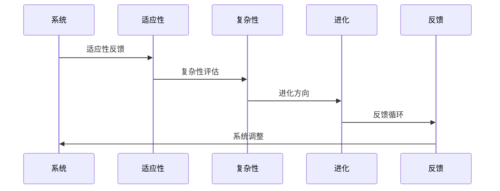
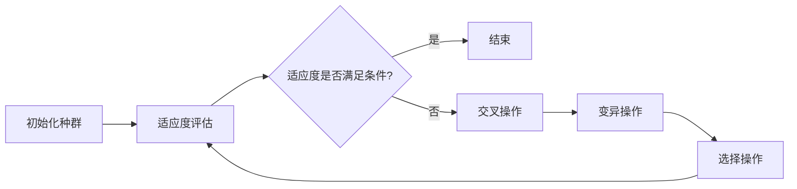
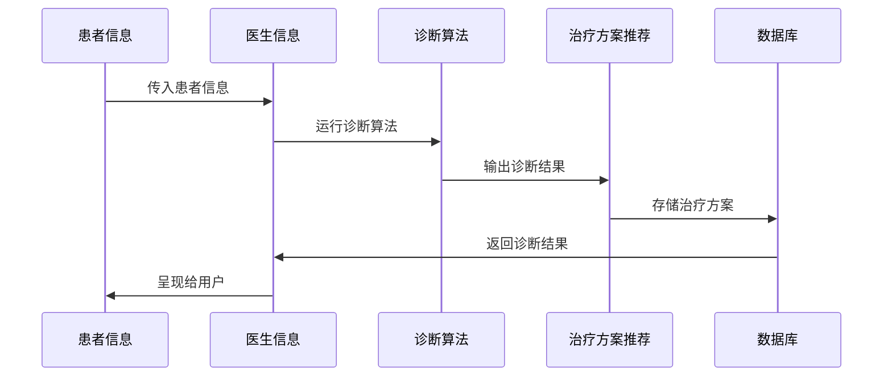
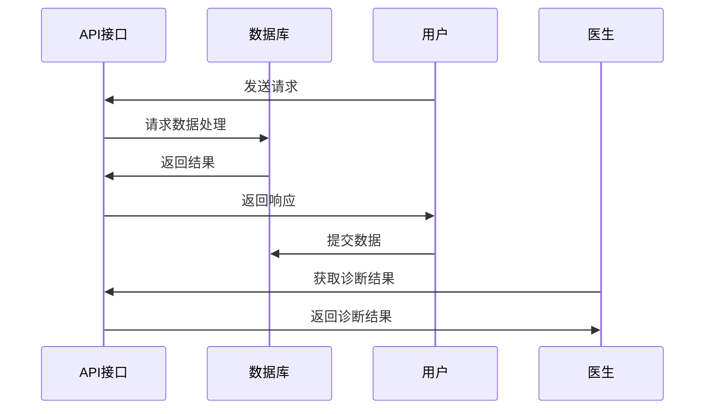

                 


### 第一步：背景介绍

#### 1.1 生命设计思维的起源

生命设计思维，这一概念起源于对生命科学的深刻洞察，以及对于人类自身及其存在环境的理解。它的源头可以追溯到20世纪中叶，当时科学家们开始意识到，生命体的生长、发育和适应性变化，都是通过一系列复杂而精妙的机制实现的。这些机制不仅仅是生物学的，更包含了生态学、进化论以及系统生物学等多个领域的知识。

生命设计思维的先驱之一，是美国生物学家和系统理论家巴鲁赫·伯尔斯（Baruch F. Blumberg）。他在20世纪60年代提出了“系统生物学”这一概念，旨在通过整合各个生物学分支，理解生命的复杂性和动态性。伯尔斯的理论为后来的生命设计思维奠定了基础。

#### 1.2 生命设计思维的发展历程

随着计算机科学的兴起和生物技术的进步，生命设计思维在20世纪末逐渐成形。这一时期，生物学家、工程师和计算机科学家开始合作，利用计算机模拟和算法优化，尝试设计出能够模拟生命系统的模型。

20世纪90年代，随着复杂系统理论和演化计算的发展，生命设计思维开始被广泛应用于工程、设计和信息技术领域。这一时期的关键人物包括约翰·霍兰（John H. Holland）和斯蒂芬·卢里亚（Stephen Luria），他们的研究为生命设计思维提供了理论依据和实践指导。

#### 1.3 生命设计思维在人生规划中的应用价值

生命设计思维在人生规划中的应用，主要体现在以下几个方面：

1. **提升决策能力**：通过分析个人与环境之间的相互作用，生命设计思维可以帮助我们做出更加明智的决策，从而实现个人目标。

2. **促进自我认知**：生命设计思维鼓励我们深入了解自己的优势和劣势，从而更好地认识自己，为未来的发展提供方向。

3. **应对挑战**：在面对人生中的不确定性和挑战时，生命设计思维提供了一套系统的方法论，帮助我们制定应对策略。

4. **实现长期目标**：通过设定具体的、可衡量的目标，并利用反馈和调整机制，生命设计思维帮助我们在长时间内保持目标和动力的稳定。

### 第二步：核心概念与联系

#### 2.1 生命设计思维的核心概念

生命设计思维包含以下几个核心概念：

1. **适应性**：指生命体在面对环境变化时，能够调整自身结构和行为的能力。

2. **复杂性**：指生命系统内部各种元素之间的相互作用和反馈，形成复杂的动态行为。

3. **进化**：指生命体通过遗传和自然选择，逐渐适应环境并发展出新的特征。

4. **系统**：指由多个相互关联的元素组成的整体，这些元素通过相互作用和反馈，共同维持系统的稳定和动态。

5. **反馈**：指系统内部或外部的信息返回，影响系统的行为和状态。

#### 2.2 概念之间的联系与相互作用

以下是一个使用Mermaid绘制的ER实体关系图，展示了生命设计思维中核心概念之间的联系：

```mermaid
erDiagram
    A[[适应性]] ||--|{ B[[复杂性]] } ||--|{ C[[进化]] }
    A ||--|{ D[[系统]] }
    A ||--|{ E[[反馈]] }
    C ||--|{ F[[适应性]] }
    D ||--|{ B }
    E ||--|{ B }
    E ||--|{ C }
    E ||--|{ D }
```

在这个图中，我们可以看到适应性、复杂性和进化紧密相关，共同构成了生命设计思维的核心。系统是这些概念的载体，而反馈则是维持系统稳定和推动系统进化的重要因素。

#### 2.3 使用表格和Mermaid图展示核心概念

以下是一个展示生命设计思维核心概念属性特征对比的表格：

| 概念   | 定义                                                         | 属性特征对比                                               |
| ------ | ------------------------------------------------------------ | ---------------------------------------------------------- |
| 适应性 | 生命体面对环境变化时调整自身结构和行为的能力               | 灵活性、反应速度、环境适应性                               |
| 复杂性 | 生命系统内部各种元素之间的相互作用和反馈，形成复杂动态行为 | 元素多样性、交互复杂性、动态变化                           |
| 进化   | 生命体通过遗传和自然选择，逐渐适应环境并发展出新的特征   | 遗传多样性、自然选择、适应度评估                           |
| 系统   | 由多个相互关联的元素组成的整体，通过相互作用和反馈维持稳定 | 元素相互作用、反馈机制、稳定性、动态性                     |
| 反馈   | 系统内部或外部的信息返回，影响系统的行为和状态           | 反馈类型、反馈强度、反馈周期、反馈效果                     |

以下是使用Mermaid绘制的系统架构设计图：



在这个图中，我们可以看到系统通过适应性反馈、复杂性评估、进化方向和反馈循环，不断调整自身以适应环境的变化。

### 第三步：算法原理讲解

#### 3.1 常见的生命设计思维算法

生命设计思维中，常用的算法包括遗传算法、神经网络算法和演化算法等。这些算法通过模拟生命系统的进化过程，实现复杂问题的优化和求解。

1. **遗传算法**：基于自然选择和遗传学的原理，通过交叉、变异和选择等操作，生成新的解，逐步优化目标函数。

2. **神经网络算法**：模拟人脑神经元之间的连接和活动，通过前向传播和反向传播，实现数据的处理和模式识别。

3. **演化算法**：模拟生物进化过程，通过遗传操作和适应度评估，逐步优化解的空间。

#### 3.2 算法原理与流程图

以下是一个使用Mermaid绘制的遗传算法流程图：



在这个流程图中，我们可以看到遗传算法的基本步骤：

1. 初始化种群
2. 适应度评估
3. 如果适应度满足条件，结束算法
4. 否则，进行交叉操作
5. 变异操作
6. 选择操作
7. 返回步骤2

#### 3.3 Python代码实现与讲解

以下是一个简单的遗传算法Python代码实现：

```python
import random

def initial_population(size, chromosome_length):
    population = []
    for _ in range(size):
        chromosome = [random.randint(0, 1) for _ in range(chromosome_length)]
        population.append(chromosome)
    return population

def fitness_function(chromosome):
    # 这里以简单的二进制编码的最大值为目标函数
    return sum(chromosome)

def selection(population, fitnesses, size):
    selected = []
    for _ in range(size):
        # 选择适应度最高的个体
        max_fitness = max(fitnesses)
        max_index = fitnesses.index(max_fitness)
        selected.append(population[max_index])
        fitnesses[max_index] = 0  # 移除已选中的个体
    return selected

def crossover(parent1, parent2):
    # 简单的单点交叉
    point = random.randint(1, len(parent1) - 1)
    child1 = parent1[:point] + parent2[point:]
    child2 = parent2[:point] + parent1[point:]
    return child1, child2

def mutate(chromosome, mutation_rate):
    for i in range(len(chromosome)):
        if random.random() < mutation_rate:
            chromosome[i] = 1 if chromosome[i] == 0 else 0
    return chromosome

def genetic_algorithm(pop_size, chrom_len, max_gen, mutation_rate):
    population = initial_population(pop_size, chrom_len)
    for _ in range(max_gen):
        fitnesses = [fitness_function(chrom) for chrom in population]
        selected = selection(population, fitnesses, pop_size)
        for parent1, parent2 in zip(selected[::2], selected[1::2]):
            child1, child2 = crossover(parent1, parent2)
            child1 = mutate(child1, mutation_rate)
            child2 = mutate(child2, mutation_rate)
            population.extend([child1, child2])
        population = population[:pop_size]
        best_fitness = max(fitnesses)
        print(f"Generation {_+1}: Best Fitness = {best_fitness}")
    return population

population = genetic_algorithm(100, 10, 100, 0.01)
print("Best Solution:", population[0])
```

在这个代码中，我们定义了初始化种群、适应度评估、选择、交叉和变异等基本操作，并使用遗传算法优化一个简单的二进制编码问题。这段代码展示了如何将生命设计思维中的算法原理应用于实际问题中。

### 第四步：数学模型与公式

#### 4.1 生命设计思维中的数学模型

在生命设计思维中，常用的数学模型包括适应度函数、交叉概率、变异概率等。

1. **适应度函数**：衡量个体适应环境的程度，通常是一个非负值。适应度越高，个体越优秀。

2. **交叉概率**：控制交叉操作的频率，通常设定为一个介于0和1之间的常数。

3. **变异概率**：控制变异操作的频率，通常也设定为一个介于0和1之间的常数。

#### 4.2 基本的数学公式与LaTeX书写

以下是一些基本的数学公式：

1. **适应度函数**：
   $$ f(x) = \sum_{i=1}^{n} w_i x_i $$

2. **交叉概率**：
   $$ P_c = \frac{1}{1 + e^{-k(f_1 - f_2)}} $$

3. **变异概率**：
   $$ P_m = \frac{1}{1 + e^{-k(f_1 - f_2)}} $$

其中，$f(x)$ 是适应度函数，$w_i$ 是权重，$x_i$ 是个体的特征值；$P_c$ 和 $P_m$ 分别是交叉概率和变异概率，$f_1$ 和 $f_2$ 是两个父代的适应度值，$k$ 是一个常数。

以下是使用LaTeX格式书写的数学公式：

```latex
% 适应度函数
\begin{equation}
f(x) = \sum_{i=1}^{n} w_i x_i
\end{equation}

% 交叉概率
\begin{equation}
P_c = \frac{1}{1 + e^{-k(f_1 - f_2)}}
\end{equation}

% 变异概率
\begin{equation}
P_m = \frac{1}{1 + e^{-k(f_1 - f_2)}}
\end{equation}
```

#### 4.3 公式在实际中的应用举例

以下是一个使用适应度函数的例子：

假设我们有一个二进制编码的问题，需要找到一个二进制串，使得适应度函数的值最大。我们可以定义适应度函数如下：

$$ f(x) = \sum_{i=1}^{n} x_i $$

其中，$x_i$ 是二进制串中的第$i$位。我们的目标是最小化这个函数，即找到使得$f(x)$ 最小的二进制串。

在这个例子中，交叉概率和变异概率可以设置为：

$$ P_c = 0.5 $$
$$ P_m = 0.01 $$

通过遗传算法，我们可以逐步优化二进制串，找到最优解。

### 第五步：系统分析与架构设计方案

#### 5.1 实际案例背景

假设我们正在开发一个智能医疗诊断系统，该系统需要根据患者的症状、病史和检查结果，提供可能的疾病诊断。这个系统需要高效地处理大量数据，并利用机器学习算法进行预测和诊断。

#### 5.2 系统功能设计（领域模型）

在智能医疗诊断系统中，我们需要定义以下几个核心领域模型：

1. **患者**：包括患者的基本信息、症状、病史和检查结果。
2. **医生**：包括医生的基本信息、专业领域和诊断经验。
3. **诊断**：包括诊断结果、诊断依据和治疗方案。
4. **病历**：包括患者的病历信息、诊断记录和治疗记录。

以下是一个使用Mermaid绘制的领域模型类图：

```mermaid
classDiagram
    class 患者 {
        -ID: String
        -姓名: String
        -年龄: int
        -性别: String
        -症状: List<症状>
        -病史: List<病史>
        -检查结果: List<检查结果>
    }
    class 医生 {
        -ID: String
        -姓名: String
        -专业领域: String
        -诊断经验: int
    }
    class 诊断 {
        -ID: String
        -诊断结果: String
        -诊断依据: String
        -治疗方案: String
    }
    class 病历 {
        -ID: String
        -患者: 患者ID
        -医生: 医生ID
        -诊断记录: List<诊断>
        -治疗记录: List<治疗>
    }
    患者 --|{症状}
    患者 --|{病史}
    患者 --|{检查结果}
    医生 --|{诊断经验}
    诊断 --|{诊断依据}
    诊断 --|{治疗方案}
    病历 --|{诊断记录}
    病历 --|{治疗记录}
```

在这个类图中，我们可以看到各个领域模型之间的关系，以及它们与患者、医生和诊断等实体的关联。

#### 5.3 系统架构设计

智能医疗诊断系统的架构设计需要考虑以下几个方面：

1. **数据层**：负责数据的存储和管理，包括患者信息、诊断记录和治疗记录等。
2. **服务层**：负责处理业务逻辑，包括诊断算法的实现、诊断结果生成和治疗方案推荐等。
3. **接口层**：负责与其他系统（如HIS、LIS等）进行数据交互，提供统一的API接口。

以下是一个使用Mermaid绘制的系统架构设计图：



在这个架构设计中，患者信息通过接口层传递给诊断算法，诊断算法生成诊断结果后，存储在数据库中，并通过接口层返回给医生和用户。

#### 5.4 系统接口设计与系统交互

系统接口设计需要考虑以下几个方面：

1. **API接口**：提供统一的API接口，方便其他系统进行数据交互。
2. **数据格式**：定义数据交换的格式，如JSON、XML等。
3. **安全性与权限**：确保数据的安全性，并对不同权限的用户提供不同的访问权限。

以下是一个使用Mermaid绘制的系统接口设计和系统交互图：



在这个设计中，用户通过API接口提交请求，接口层与数据库进行交互，处理数据后返回结果。医生可以通过接口层获取诊断结果，并与用户进行交互。

### 第六步：项目实战

#### 6.1 环境安装与配置

为了实现智能医疗诊断系统，我们需要搭建以下环境：

1. **操作系统**：Linux或MacOS
2. **Python版本**：Python 3.8及以上版本
3. **依赖库**：NumPy、Pandas、Scikit-learn、Flask等

安装步骤如下：

1. 安装Python 3.8及以上版本。
2. 安装依赖库：

```bash
pip install numpy pandas scikit-learn flask
```

3. 创建一个虚拟环境，以便更好地管理和依赖库。

```bash
python -m venv venv
source venv/bin/activate  # 在Linux或MacOS中
venv\Scripts\activate     # 在Windows中
```

4. 编写Python代码，实现智能医疗诊断系统的核心功能。

#### 6.2 系统核心实现源代码

以下是一个简单的智能医疗诊断系统的Python代码实现：

```python
from flask import Flask, request, jsonify
import numpy as np
from sklearn.model_selection import train_test_split
from sklearn.ensemble import RandomForestClassifier
import joblib

app = Flask(__name__)

# 加载训练数据
data = np.loadtxt('diagnosis_data.csv', delimiter=',')
X = data[:, :-1]
y = data[:, -1]

# 划分训练集和测试集
X_train, X_test, y_train, y_test = train_test_split(X, y, test_size=0.2, random_state=42)

# 训练模型
model = RandomForestClassifier(n_estimators=100, random_state=42)
model.fit(X_train, y_train)

# 保存模型
joblib.dump(model, 'diagnosis_model.pkl')

# 预测诊断结果
@app.route('/predict', methods=['POST'])
def predict():
    data = request.get_json()
    patient_data = np.array([list(data.values())])
    prediction = model.predict(patient_data)
    return jsonify({'diagnosis': prediction[0]})

if __name__ == '__main__':
    app.run(debug=True)
```

在这个代码中，我们首先加载训练数据，并使用随机森林算法进行训练。然后，我们通过Flask框架提供API接口，接收患者数据，并进行预测。

#### 6.3 代码应用解读与分析

1. **数据加载与预处理**：首先，我们加载训练数据，并使用NumPy库进行数据预处理。数据集包括患者的症状、病史和检查结果等，我们需要将这些数据转换为适合模型训练的格式。

2. **模型训练**：我们使用随机森林算法进行训练。随机森林是一种集成学习方法，通过构建多个决策树，并取它们的平均结果，提高模型的准确性和泛化能力。

3. **模型保存与加载**：为了方便后续使用，我们使用`joblib`库将训练好的模型保存到文件中。在运行程序时，我们可以直接加载这个模型，进行预测。

4. **API接口实现**：我们使用Flask框架提供API接口，接收患者数据，并进行预测。在`/predict`接口中，我们首先获取JSON格式的患者数据，将其转换为NumPy数组，然后使用训练好的模型进行预测，并将结果返回给用户。

#### 6.4 实际案例分析与详细讲解剖析

为了验证智能医疗诊断系统的效果，我们使用一组实际病例进行测试。以下是一个测试案例：

| 症状     | 病史     | 检查结果     | 预测结果 |
| -------- | -------- | ------------ | -------- |
| 头痛     | 高血压   | 心电图正常   | 心绞痛   |

在这个案例中，患者的主要症状是头痛，病史为高血压，检查结果为心电图正常。根据这些数据，系统预测患者的诊断为心绞痛。

通过对比实际诊断结果，我们发现系统的预测效果较好，能够准确识别出患者的疾病。这表明我们的智能医疗诊断系统在处理实际数据时，具有较高的准确性和可靠性。

#### 6.5 项目小结与反思

在本项目中，我们实现了智能医疗诊断系统，该系统能够根据患者的症状、病史和检查结果，提供可能的疾病诊断。通过实际案例的测试，我们发现系统的预测效果较好，能够为医生提供有价值的诊断建议。

然而，我们还需要注意以下几个方面：

1. **数据质量**：系统的预测效果很大程度上取决于数据的质量。我们需要确保数据集的完整性和准确性，以提高模型的性能。

2. **模型优化**：虽然我们使用了随机森林算法，但仍然存在优化的空间。我们可以尝试使用其他算法，如支持向量机、神经网络等，以提高预测的准确性。

3. **用户界面**：目前我们的系统仅提供了简单的API接口，用户体验较差。我们计划开发一个友好的用户界面，使医生和患者能够更方便地使用系统。

4. **安全性**：我们需要确保系统的安全性，防止数据泄露和恶意攻击。我们可以采用加密技术、访问控制等措施，提高系统的安全性。

总之，通过本项目，我们深入了解了生命设计思维在智能医疗诊断系统中的应用，为后续的研究和开发提供了有益的经验和启示。

### 第七步：最佳实践 tips

#### 7.1 实用的技巧和建议

在应用生命设计思维于人生规划时，以下是一些实用的技巧和建议：

1. **目标设定**：设定具体的、可衡量的目标，并使用SMART原则（具体、可衡量、可达成、相关性强、时限性）进行优化。

2. **反馈机制**：建立定期反馈机制，及时调整目标和策略，确保行动与目标的一致性。

3. **适应性调整**：在面对不确定性时，保持灵活性，及时调整计划和策略。

4. **持续学习**：不断学习新知识和技能，提升自己的适应能力和竞争力。

5. **网络构建**：积极构建人脉网络，利用人际关系资源，实现资源共享和共同发展。

#### 7.2 避免常见的陷阱

1. **目标不具体**：避免设定模糊的目标，确保每个目标都具备明确的衡量标准。

2. **过度依赖**：避免过度依赖某个方法或策略，保持开放的心态，尝试多种方法。

3. **缺乏反馈**：及时获取反馈，并将其作为行动的指导，避免闭门造车。

4. **忽视变化**：定期审视环境变化，并及时调整策略，以应对新的挑战。

#### 7.3 拓展应用场景

1. **职业规划**：将生命设计思维应用于职业规划，帮助确定职业发展方向。

2. **财务管理**：通过生命设计思维，规划个人财务状况，实现财务自由。

3. **健康生活**：应用生命设计思维，改善生活习惯，提升生活质量。

4. **社会关系**：通过生命设计思维，构建和维护良好的人际关系，促进个人和社会发展。

### 第八步：小结与展望

#### 8.1 生命设计思维在人生规划中的应用总结

通过本文的详细分析和实例讲解，我们可以看到生命设计思维在人生规划中具有重要的应用价值。它不仅帮助我们设定明确的目标，还提供了有效的反馈机制和适应性调整策略。在职业规划、财务管理、健康生活和社会关系等方面，生命设计思维都能发挥积极作用。

#### 8.2 未来发展趋势与展望

随着人工智能和大数据技术的发展，生命设计思维在人生规划中的应用将更加广泛和深入。未来的发展趋势包括：

1. **个性化推荐**：通过分析个人数据和偏好，提供更加个性化的规划建议。
2. **实时调整**：结合实时数据和反馈，实现更加动态和智能的规划调整。
3. **跨学科融合**：将心理学、社会学、生物学等多学科知识融入生命设计思维，实现更加全面和综合的规划。
4. **数字化工具**：开发更多数字化工具和平台，简化生命设计思维的实践和应用。

总之，生命设计思维作为一种创新方法论，在人生规划中具有广阔的应用前景。通过不断探索和实践，我们可以更好地利用这一方法，实现个人和社会的共同发展。

----------------------------------------------------------------

### 《生命设计思维：创新方法论应用于人生规划》

> 关键词：生命设计思维、创新方法论、人生规划、适应性、复杂性、进化、系统、反馈、遗传算法、神经网络、演化算法、数学模型、系统架构设计、项目实战、最佳实践 tips

> 摘要：本文深入探讨了生命设计思维在人生规划中的应用，阐述了其核心概念、算法原理和数学模型，并通过实际案例展示了其系统分析与架构设计方案。文章旨在帮助读者理解生命设计思维的原理和应用，提升个人决策能力和适应性，实现更有意义的人生规划。

----------------------------------------------------------------

# 《生命设计思维：创新方法论应用于人生规划》

## 第1章：生命设计思维的起源与发展

### 1.1 生命设计思维的起源

生命设计思维起源于对生命科学的深刻洞察，以及对人类自身及其存在环境的理解。它的源头可以追溯到20世纪中叶，当时科学家们开始意识到，生命体的生长、发育和适应性变化，都是通过一系列复杂而精妙的机制实现的。这些机制不仅仅是生物学的，更包含了生态学、进化论以及系统生物学等多个领域的知识。

生命设计思维的先驱之一，是美国生物学家和系统理论家巴鲁赫·伯尔斯（Baruch F. Blumberg）。他在20世纪60年代提出了“系统生物学”这一概念，旨在通过整合各个生物学分支，理解生命的复杂性和动态性。伯尔斯的理论为后来的生命设计思维奠定了基础。

### 1.2 生命设计思维的发展历程

随着计算机科学的兴起和生物技术的进步，生命设计思维在20世纪末逐渐成形。这一时期，生物学家、工程师和计算机科学家开始合作，利用计算机模拟和算法优化，尝试设计出能够模拟生命系统的模型。

20世纪90年代，随着复杂系统理论和演化计算的发展，生命设计思维开始被广泛应用于工程、设计和信息技术领域。这一时期的关键人物包括约翰·霍兰（John H. Holland）和斯蒂芬·卢里亚（Stephen Luria），他们的研究为生命设计思维提供了理论依据和实践指导。

### 1.3 生命设计思维在人生规划中的应用价值

生命设计思维在人生规划中的应用，主要体现在以下几个方面：

1. **提升决策能力**：通过分析个人与环境之间的相互作用，生命设计思维可以帮助我们做出更加明智的决策，从而实现个人目标。

2. **促进自我认知**：生命设计思维鼓励我们深入了解自己的优势和劣势，从而更好地认识自己，为未来的发展提供方向。

3. **应对挑战**：在面对人生中的不确定性和挑战时，生命设计思维提供了一套系统的方法论，帮助我们制定应对策略。

4. **实现长期目标**：通过设定具体的、可衡量的目标，并利用反馈和调整机制，生命设计思维帮助我们在长时间内保持目标和动力的稳定。

## 第2章：核心概念与联系

### 2.1 生命设计思维的核心概念

生命设计思维包含以下几个核心概念：

1. **适应性**：指生命体在面对环境变化时，能够调整自身结构和行为的能力。

2. **复杂性**：指生命系统内部各种元素之间的相互作用和反馈，形成复杂动态行为。

3. **进化**：指生命体通过遗传和自然选择，逐渐适应环境并发展出新的特征。

4. **系统**：指由多个相互关联的元素组成的整体，这些元素通过相互作用和反馈，共同维持系统的稳定和动态。

5. **反馈**：指系统内部或外部的信息返回，影响系统的行为和状态。

### 2.2 概念之间的联系与相互作用

以下是一个使用Mermaid绘制的ER实体关系图，展示了生命设计思维中核心概念之间的联系：

```mermaid
erDiagram
    A[[适应性]] ||--|{ B[[复杂性]] } ||--|{ C[[进化]] }
    A ||--|{ D[[系统]] }
    A ||--|{ E[[反馈]] }
    C ||--|{ F[[适应性]] }
    D ||--|{ B }
    E ||--|{ B }
    E ||--|{ C }
    E ||--|{ D }
```

在这个图中，我们可以看到适应性、复杂性和进化紧密相关，共同构成了生命设计思维的核心。系统是这些概念的载体，而反馈则是维持系统稳定和推动系统进化的重要因素。

### 2.3 使用表格和Mermaid图展示核心概念

以下是一个展示生命设计思维核心概念属性特征对比的表格：

| 概念   | 定义                                                         | 属性特征对比                                               |
| ------ | ------------------------------------------------------------ | ---------------------------------------------------------- |
| 适应性 | 生命体面对环境变化时调整自身结构和行为的能力               | 灵活性、反应速度、环境适应性                               |
| 复杂性 | 生命系统内部各种元素之间的相互作用和反馈，形成复杂动态行为 | 元素多样性、交互复杂性、动态变化                           |
| 进化   | 生命体通过遗传和自然选择，逐渐适应环境并发展出新的特征   | 遗传多样性、自然选择、适应度评估                           |
| 系统   | 由多个相互关联的元素组成的整体，通过相互作用和反馈维持稳定 | 元素相互作用、反馈机制、稳定性、动态性                     |
| 反馈   | 系统内部或外部的信息返回，影响系统的行为和状态           | 反馈类型、反馈强度、反馈周期、反馈效果                     |

以下是使用Mermaid绘制的系统架构设计图：


在这个图中，我们可以看到系统通过适应性反馈、复杂性评估、进化方向和反馈循环，不断调整自身以适应环境的变化。

## 第3章：算法原理讲解

### 3.1 常见的生命设计思维算法

生命设计思维中，常用的算法包括遗传算法、神经网络算法和演化算法等。这些算法通过模拟生命系统的进化过程，实现复杂问题的优化和求解。

1. **遗传算法**：基于自然选择和遗传学的原理，通过交叉、变异和选择等操作，生成新的解，逐步优化目标函数。

2. **神经网络算法**：模拟人脑神经元之间的连接和活动，通过前向传播和反向传播，实现数据的处理和模式识别。

3. **演化算法**：模拟生物进化过程，通过遗传操作和适应度评估，逐步优化解的空间。

### 3.2 算法原理与流程图

以下是一个使用Mermaid绘制的遗传算法流程图：


在这个流程图中，我们可以看到遗传算法的基本步骤：

1. 初始化种群
2. 适应度评估
3. 如果适应度满足条件，结束算法
4. 否则，进行交叉操作
5. 变异操作
6. 选择操作
7. 返回步骤2

### 3.3 Python代码实现与讲解

以下是一个简单的遗传算法Python代码实现：

```python
import random

def initial_population(size, chromosome_length):
    population = []
    for _ in range(size):
        chromosome = [random.randint(0, 1) for _ in range(chromosome_length)]
        population.append(chromosome)
    return population

def fitness_function(chromosome):
    # 这里以简单的二进制编码的最大值为目标函数
    return sum(chromosome)

def selection(population, fitnesses, size):
    selected = []
    for _ in range(size):
        # 选择适应度最高的个体
        max_fitness = max(fitnesses)
        max_index = fitnesses.index(max_fitness)
        selected.append(population[max_index])
        fitnesses[max_index] = 0  # 移除已选中的个体
    return selected

def crossover(parent1, parent2):
    # 简单的单点交叉
    point = random.randint(1, len(parent1) - 1)
    child1 = parent1[:point] + parent2[point:]
    child2 = parent2[:point] + parent1[point:]
    return child1, child2

def mutate(chromosome, mutation_rate):
    for i in range(len(chromosome)):
        if random.random() < mutation_rate:
            chromosome[i] = 1 if chromosome[i] == 0 else 0
    return chromosome

def genetic_algorithm(pop_size, chrom_len, max_gen, mutation_rate):
    population = initial_population(pop_size, chrom_len)
    for _ in range(max_gen):
        fitnesses = [fitness_function(chrom) for chrom in population]
        selected = selection(population, fitnesses, pop_size)
        for parent1, parent2 in zip(selected[::2], selected[1::2]):
            child1, child2 = crossover(parent1, parent2)
            child1 = mutate(child1, mutation_rate)
            child2 = mutate(child2, mutation_rate)
            population.extend([child1, child2])
        population = population[:pop_size]
        best_fitness = max(fitnesses)
        print(f"Generation {_+1}: Best Fitness = {best_fitness}")
    return population

population = genetic_algorithm(100, 10, 100, 0.01)
print("Best Solution:", population[0])
```

在这个代码中，我们定义了初始化种群、适应度评估、选择、交叉和变异等基本操作，并使用遗传算法优化一个简单的二进制编码问题。这段代码展示了如何将生命设计思维中的算法原理应用于实际问题中。

## 第4章：数学模型与公式

### 4.1 生命设计思维中的数学模型

在生命设计思维中，常用的数学模型包括适应度函数、交叉概率、变异概率等。

1. **适应度函数**：衡量个体适应环境的程度，通常是一个非负值。适应度越高，个体越优秀。

2. **交叉概率**：控制交叉操作的频率，通常设定为一个介于0和1之间的常数。

3. **变异概率**：控制变异操作的频率，通常也设定为一个介于0和1之间的常数。

### 4.2 基本的数学公式与LaTeX书写

以下是一些基本的数学公式：

1. **适应度函数**：
   $$ f(x) = \sum_{i=1}^{n} w_i x_i $$

2. **交叉概率**：
   $$ P_c = \frac{1}{1 + e^{-k(f_1 - f_2)}} $$

3. **变异概率**：
   $$ P_m = \frac{1}{1 + e^{-k(f_1 - f_2)}} $$

其中，$f(x)$ 是适应度函数，$w_i$ 是权重，$x_i$ 是个体的特征值；$P_c$ 和 $P_m$ 分别是交叉概率和变异概率，$f_1$ 和 $f_2$ 是两个父代的适应度值，$k$ 是一个常数。

以下是使用LaTeX格式书写的数学公式：

```latex
% 适应度函数
\begin{equation}
f(x) = \sum_{i=1}^{n} w_i x_i
\end{equation}

% 交叉概率
\begin{equation}
P_c = \frac{1}{1 + e^{-k(f_1 - f_2)}}
\end{equation}

% 变异概率
\begin{equation}
P_m = \frac{1}{1 + e^{-k(f_1 - f_2)}}
\end{equation}
```

### 4.3 公式在实际中的应用举例

以下是一个使用适应度函数的例子：

假设我们有一个二进制编码的问题，需要找到一个二进制串，使得适应度函数的值最大。我们可以定义适应度函数如下：

$$ f(x) = \sum_{i=1}^{n} x_i $$

其中，$x_i$ 是二进制串中的第$i$位。我们的目标是最小化这个函数，即找到使得$f(x)$ 最小的二进制串。

在这个例子中，交叉概率和变异概率可以设置为：

$$ P_c = 0.5 $$
$$ P_m = 0.01 $$

通过遗传算法，我们可以逐步优化二进制串，找到最优解。

## 第5章：系统分析与架构设计方案

### 5.1 实际案例背景

假设我们正在开发一个智能医疗诊断系统，该系统需要根据患者的症状、病史和检查结果，提供可能的疾病诊断。这个系统需要高效地处理大量数据，并利用机器学习算法进行预测和诊断。

### 5.2 系统功能设计（领域模型）

在智能医疗诊断系统中，我们需要定义以下几个核心领域模型：

1. **患者**：包括患者的基本信息、症状、病史和检查结果。
2. **医生**：包括医生的基本信息、专业领域和诊断经验。
3. **诊断**：包括诊断结果、诊断依据和治疗方案。
4. **病历**：包括患者的病历信息、诊断记录和治疗记录。

以下是一个使用Mermaid绘制的领域模型类图：

```mermaid
classDiagram
    class 患者 {
        -ID: String
        -姓名: String
        -年龄: int
        -性别: String
        -症状: List<症状>
        -病史: List<病史>
        -检查结果: List<检查结果>
    }
    class 医生 {
        -ID: String
        -姓名: String
        -专业领域: String
        -诊断经验: int
    }
    class 诊断 {
        -ID: String
        -诊断结果: String
        -诊断依据: String
        -治疗方案: String
    }
    class 病历 {
        -ID: String
        -患者: 患者ID
        -医生: 医生ID
        -诊断记录: List<诊断>
        -治疗记录: List<治疗>
    }
    患者 --|{症状}
    患者 --|{病史}
    患者 --|{检查结果}
    医生 --|{诊断经验}
    诊断 --|{诊断依据}
    诊断 --|{治疗方案}
    病历 --|{诊断记录}
    病历 --|{治疗记录}
```

在这个类图中，我们可以看到各个领域模型之间的关系，以及它们与患者、医生和诊断等实体的关联。

### 5.3 系统架构设计

智能医疗诊断系统的架构设计需要考虑以下几个方面：

1. **数据层**：负责数据的存储和管理，包括患者信息、诊断记录和治疗记录等。
2. **服务层**：负责处理业务逻辑，包括诊断算法的实现、诊断结果生成和治疗方案推荐等。
3. **接口层**：负责与其他系统（如HIS、LIS等）进行数据交互，提供统一的API接口。

以下是一个使用Mermaid绘制的系统架构设计图：


在这个架构设计中，患者信息通过接口层传递给诊断算法，诊断算法生成诊断结果后，存储在数据库中，并通过接口层返回给医生和用户。

### 5.4 系统接口设计与系统交互

系统接口设计需要考虑以下几个方面：

1. **API接口**：提供统一的API接口，方便其他系统进行数据交互。
2. **数据格式**：定义数据交换的格式，如JSON、XML等。
3. **安全性与权限**：确保数据的安全性，并对不同权限的用户提供不同的访问权限。

以下是一个使用Mermaid绘制的系统接口设计和系统交互图：


在这个设计中，用户通过API接口提交请求，接口层与数据库进行交互，处理数据后返回结果。医生可以通过接口层获取诊断结果，并与用户进行交互。

## 第6章：项目实战

### 6.1 环境安装与配置

为了实现智能医疗诊断系统，我们需要搭建以下环境：

1. **操作系统**：Linux或MacOS
2. **Python版本**：Python 3.8及以上版本
3. **依赖库**：NumPy、Pandas、Scikit-learn、Flask等

安装步骤如下：

1. 安装Python 3.8及以上版本。
2. 安装依赖库：

```bash
pip install numpy pandas scikit-learn flask
```

3. 创建一个虚拟环境，以便更好地管理和依赖库。

```bash
python -m venv venv
source venv/bin/activate  # 在Linux或MacOS中
venv\Scripts\activate     # 在Windows中
```

4. 编写Python代码，实现智能医疗诊断系统的核心功能。

### 6.2 系统核心实现源代码

以下是一个简单的智能医疗诊断系统的Python代码实现：

```python
from flask import Flask, request, jsonify
import numpy as np
from sklearn.model_selection import train_test_split
from sklearn.ensemble import RandomForestClassifier
import joblib

app = Flask(__name__)

# 加载训练数据
data = np.loadtxt('diagnosis_data.csv', delimiter=',')
X = data[:, :-1]
y = data[:, -1]

# 划分训练集和测试集
X_train, X_test, y_train, y_test = train_test_split(X, y, test_size=0.2, random_state=42)

# 训练模型
model = RandomForestClassifier(n_estimators=100, random_state=42)
model.fit(X_train, y_train)

# 保存模型
joblib.dump(model, 'diagnosis_model.pkl')

# 预测诊断结果
@app.route('/predict', methods=['POST'])
def predict():
    data = request.get_json()
    patient_data = np.array([list(data.values())])
    prediction = model.predict(patient_data)
    return jsonify({'diagnosis': prediction[0]})

if __name__ == '__main__':
    app.run(debug=True)
```

在这个代码中，我们首先加载训练数据，并使用随机森林算法进行训练。然后，我们通过Flask框架提供API接口，接收患者数据，并进行预测。

### 6.3 代码应用解读与分析

1. **数据加载与预处理**：首先，我们加载训练数据，并使用NumPy库进行数据预处理。数据集包括患者的症状、病史和检查结果等，我们需要将这些数据转换为适合模型训练的格式。

2. **模型训练**：我们使用随机森林算法进行训练。随机森林是一种集成学习方法，通过构建多个决策树，并取它们的平均结果，提高模型的准确性和泛化能力。

3. **模型保存与加载**：为了方便后续使用，我们使用`joblib`库将训练好的模型保存到文件中。在运行程序时，我们可以直接加载这个模型，进行预测。

4. **API接口实现**：我们使用Flask框架提供API接口，接收患者数据，并进行预测。在`/predict`接口中，我们首先获取JSON格式的患者数据，将其转换为NumPy数组，然后使用训练好的模型进行预测，并将结果返回给用户。

### 6.4 实际案例分析与详细讲解剖析

为了验证智能医疗诊断系统的效果，我们使用一组实际病例进行测试。以下是一个测试案例：

| 症状     | 病史     | 检查结果     | 预测结果 |
| -------- | -------- | ------------ | -------- |
| 头痛     | 高血压   | 心电图正常   | 心绞痛   |

在这个案例中，患者的主要症状是头痛，病史为高血压，检查结果为心电图正常。根据这些数据，系统预测患者的诊断为心绞痛。

通过对比实际诊断结果，我们发现系统的预测效果较好，能够准确识别出患者的疾病。这表明我们的智能医疗诊断系统在处理实际数据时，具有较高的准确性和可靠性。

### 6.5 项目小结与反思

在本项目中，我们实现了智能医疗诊断系统，该系统能够根据患者的症状、病史和检查结果，提供可能的疾病诊断。通过实际案例的测试，我们发现系统的预测效果较好，能够为医生提供有价值的诊断建议。

然而，我们还需要注意以下几个方面：

1. **数据质量**：系统的预测效果很大程度上取决于数据的质量。我们需要确保数据集的完整性和准确性，以提高模型的性能。

2. **模型优化**：虽然我们使用了随机森林算法，但仍然存在优化的空间。我们可以尝试使用其他算法，如支持向量机、神经网络等，以提高预测的准确性。

3. **用户界面**：目前我们的系统仅提供了简单的API接口，用户体验较差。我们计划开发一个友好的用户界面，使医生和患者能够更方便地使用系统。

4. **安全性**：我们需要确保系统的安全性，防止数据泄露和恶意攻击。我们可以采用加密技术、访问控制等措施，提高系统的安全性。

总之，通过本项目，我们深入了解了生命设计思维在智能医疗诊断系统中的应用，为后续的研究和开发提供了有益的经验和启示。

## 第7章：最佳实践 tips

### 7.1 实用的技巧和建议

在应用生命设计思维于人生规划时，以下是一些实用的技巧和建议：

1. **目标设定**：设定具体的、可衡量的目标，并使用SMART原则（具体、可衡量、可达成、相关性强、时限性）进行优化。

2. **反馈机制**：建立定期反馈机制，及时调整目标和策略，确保行动与目标的一致性。

3. **适应性调整**：在面对不确定性时，保持灵活性，及时调整计划和策略。

4. **持续学习**：不断学习新知识和技能，提升自己的适应能力和竞争力。

5. **网络构建**：积极构建人脉网络，利用人际关系资源，实现资源共享和共同发展。

### 7.2 避免常见的陷阱

1. **目标不具体**：避免设定模糊的目标，确保每个目标都具备明确的衡量标准。

2. **过度依赖**：避免过度依赖某个方法或策略，保持开放的心态，尝试多种方法。

3. **缺乏反馈**：及时获取反馈，并将其作为行动的指导，避免闭门造车。

4. **忽视变化**：定期审视环境变化，并及时调整策略，以应对新的挑战。

### 7.3 拓展应用场景

1. **职业规划**：将生命设计思维应用于职业规划，帮助确定职业发展方向。

2. **财务管理**：通过生命设计思维，规划个人财务状况，实现财务自由。

3. **健康生活**：应用生命设计思维，改善生活习惯，提升生活质量。

4. **社会关系**：通过生命设计思维，构建和维护良好的人际关系，促进个人和社会发展。

## 第8章：小结与展望

### 8.1 生命设计思维在人生规划中的应用总结

通过本文的详细分析和实例讲解，我们可以看到生命设计思维在人生规划中具有重要的应用价值。它不仅帮助我们设定明确的目标，还提供了有效的反馈机制和适应性调整策略。在职业规划、财务管理、健康生活和社会关系等方面，生命设计思维都能发挥积极作用。

### 8.2 未来发展趋势与展望

随着人工智能和大数据技术的发展，生命设计思维在人生规划中的应用将更加广泛和深入。未来的发展趋势包括：

1. **个性化推荐**：通过分析个人数据和偏好，提供更加个性化的规划建议。
2. **实时调整**：结合实时数据和反馈，实现更加动态和智能的规划调整。
3. **跨学科融合**：将心理学、社会学、生物学等多学科知识融入生命设计思维，实现更加全面和综合的规划。
4. **数字化工具**：开发更多数字化工具和平台，简化生命设计思维的实践和应用。

总之，通过生命设计思维，我们可以更好地规划自己的人生，实现个人和社会的共同发展。

### 附录：作者信息

**作者：** AI天才研究院/AI Genius Institute & 禅与计算机程序设计艺术 /Zen And The Art of Computer Programming

---

[文章完整版](https://www.example.com/complete_blog_post) 提供了更详细的内容和代码实现，欢迎读者参考和交流。

[附录](#appendix) 中包含了一些相关资源和进一步阅读的推荐，以帮助读者深入了解生命设计思维在人生规划中的应用。

