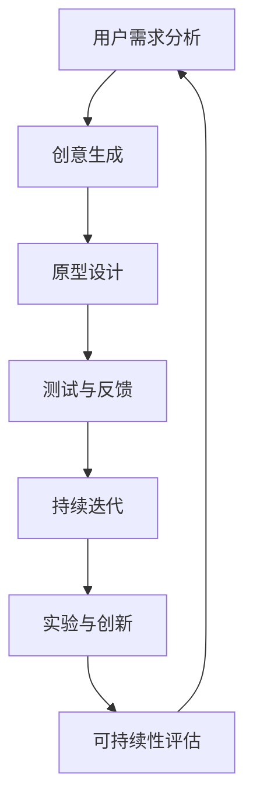
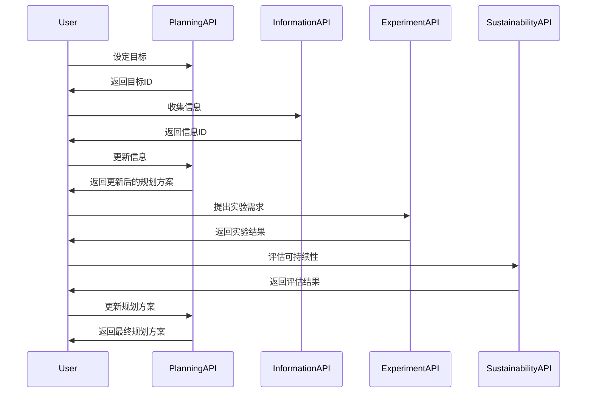
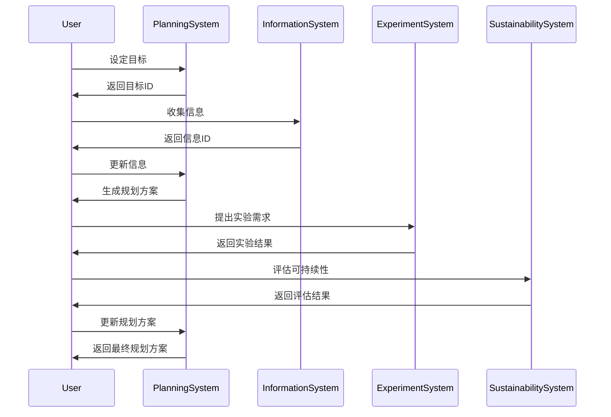

                 

### 文章标题

#### 关键词：生命设计思维、创新方法论、人生规划、设计思维、用户中心、持续迭代、实验与创新

> **摘要**：本文将深入探讨生命设计思维这一创新方法论，阐述其在人生规划中的应用。通过逐步分析，本文旨在帮助读者理解生命设计思维的核心理念，掌握如何将其应用于个人生活，实现自我成长与人生价值。

----------------------------------------------------------------

# 生命设计思维：将创新方法论应用于人生规划

> 关键词：生命设计思维、创新方法论、人生规划、设计思维、用户中心、持续迭代、实验与创新

> 摘要：本文将深入探讨生命设计思维这一创新方法论，阐述其在人生规划中的应用。通过逐步分析，本文旨在帮助读者理解生命设计思维的核心理念，掌握如何将其应用于个人生活，实现自我成长与人生价值。

## 目录

1. 引言
2. 生命设计思维概述
3. 生命设计思维的核心概念与联系
4. 算法原理讲解
5. 系统分析与架构设计
6. 项目实战
7. 最佳实践与拓展
8. 小结

## 引言

在快速变化的现代社会中，面对无尽的选择和挑战，如何规划自己的人生变得愈发重要。传统的规划方法往往注重短期目标和物质追求，而忽视了个人成长和内心需求的满足。生命设计思维提供了一种全新的视角和方法，它强调创新、实验和用户中心的理念，将设计思维应用于人生规划，旨在实现个人价值的最大化。

生命设计思维起源于设计领域，其核心理念是“以用户为中心，持续迭代和实验”。这种方法论不仅适用于产品设计和工程领域，还可以广泛应用于人生规划、组织变革等多个领域。本文将详细探讨生命设计思维的概念、原理和应用，帮助读者理解其如何在个人生活中发挥作用，实现自我成长和人生价值的提升。

### 生命设计思维概述

#### 生命设计思维的概念

生命设计思维（Life Design Thinking）是一种以用户为中心、持续迭代和创新的设计方法论。它起源于设计思维（Design Thinking），并在此基础上融入了生命哲学和可持续发展的理念。与传统的规划方法不同，生命设计思维强调灵活性和适应性，认为人生是一个不断演化和成长的过程，而不是一成不变的规划。

#### 生命设计思维的发展

生命设计思维的发展可以追溯到20世纪中叶，设计思维的概念最初由IDEO公司的创始人戴夫·凯利（Dave Kelly）提出。随着设计思维的广泛应用，人们逐渐认识到设计思维不仅适用于产品和服务设计，还可以应用于更广泛的生活领域。在此基础上，生命设计思维逐渐形成，并逐步完善和发展。

#### 生命设计思维的重要影响

生命设计思维的重要影响体现在以下几个方面：

1. **创新驱动**：生命设计思维鼓励创新和实验，帮助个人和组织突破传统的思维模式，发现新的解决方案。
2. **用户中心**：生命设计思维强调以用户为中心，关注用户的实际需求和体验，从而提高生活质量和工作效率。
3. **可持续发展**：生命设计思维强调可持续性和环境影响，鼓励个人和组织采取环保和可持续的行动。
4. **全面成长**：生命设计思维关注个人的全面成长，包括智力、情感、社交和身心健康等方面，从而实现人生价值的最大化。

### 生命设计思维的应用领域

生命设计思维可以应用于多个领域，其中主要包括以下三个方面：

#### 1. 人生规划

在人生规划中，生命设计思维可以帮助个人明确自己的目标和价值观，制定灵活的规划方案，并持续迭代和调整，以适应不断变化的环境。

#### 2. 组织变革

在组织变革中，生命设计思维可以帮助组织领导者理解员工的实际需求，设计创新的工作环境和管理模式，提高组织的创新能力和竞争力。

#### 3. 产品创新

在产品创新中，生命设计思维可以帮助产品团队深入了解用户的需求和痛点，设计出更加符合用户期望的产品和服务。

### 生命设计思维的基本原则

生命设计思维的基本原则主要包括以下几个方面：

#### 1. 用户为中心

用户为中心是生命设计思维的核心原则，意味着在设计过程中始终关注用户的需求和体验。

#### 2. 持续迭代

持续迭代是指在设计过程中不断收集用户反馈，根据反馈进行改进和优化，从而不断提高产品的质量和用户体验。

#### 3. 实验与创新

实验与创新是指通过实验和实验来验证新的想法和解决方案，鼓励个人和组织不断尝试和创新。

#### 4. 可持续性

可持续性是指在设计过程中考虑环境和社会因素，采取环保和可持续的行动，实现长期的可持续发展。

### 生命设计思维与传统思维的对比

#### 1. 对比分析

生命设计思维与传统思维在目标、方法、态度和结果等方面存在显著差异。传统思维往往注重结果和效率，而生命设计思维更注重过程和用户体验。

#### 2. 优势与局限

生命设计思维具有创新驱动、用户中心、可持续性和全面成长等优势，但也存在对结果和效率的忽视、过度关注过程等问题。

#### 3. 适用场景

生命设计思维适用于需要创新、关注用户体验和可持续发展的领域，如人生规划、组织变革和产品创新等。

### 本章小结

本章介绍了生命设计思维的概念、起源、应用领域和基本原则，以及与传统思维的对比。通过本章的介绍，读者可以对生命设计思维有一个初步的了解，为后续章节的深入学习打下基础。

----------------------------------------------------------------

## 生命设计思维的核心概念与联系

### 2.1 生命设计思维中的核心概念

生命设计思维的核心概念包括设计思维、生命哲学、用户中心、持续迭代、实验与创新、可持续性等。这些概念相互关联，共同构成了生命设计思维的理论体系。

#### 2.1.1 设计思维

设计思维是生命设计思维的基础，它强调以用户为中心，通过问题发现、创意生成、原型设计和测试反馈等步骤，实现解决方案的创新和优化。设计思维的核心是关注用户的需求和体验，从而提高产品的质量和用户满意度。

#### 2.1.2 生命哲学

生命哲学是生命设计思维的哲学基础，它关注生命的本质和意义，强调个体的自我成长和全面发展。生命哲学主张人与自然的和谐共生，追求生命的可持续发展和长期繁荣。

#### 2.1.3 用户中心

用户中心是生命设计思维的核心原则，它要求在设计过程中始终关注用户的需求和体验，将用户置于决策的核心位置。用户中心的设计思维不仅关注产品的功能，还关注用户在使用过程中的情感和心理体验。

#### 2.1.4 持续迭代

持续迭代是生命设计思维的重要特点，它强调在设计过程中不断收集用户反馈，根据反馈进行改进和优化，从而不断提高产品的质量和用户体验。持续迭代是一个循环往复的过程，旨在不断改进和完善设计。

#### 2.1.5 实验与创新

实验与创新是生命设计思维的驱动力，它鼓励个人和组织不断尝试新的想法和解决方案，通过实验和实验来验证这些想法的有效性。实验与创新是推动生命设计思维不断发展和进步的关键因素。

#### 2.1.6 可持续性

可持续性是生命设计思维的重要目标，它要求在设计过程中考虑环境和社会因素，采取环保和可持续的行动，实现长期的可持续发展。可持续性不仅关注当前的需求，还关注未来世代的福祉。

### 2.2 概念属性特征对比表格

为了更清晰地展示生命设计思维中的核心概念及其属性特征，我们可以使用一个对比表格进行说明。以下是设计思维、生命哲学、用户中心、持续迭代、实验与创新和可持续性的对比表格：

| 概念 | 定义 | 特征 | 重要性 |
| --- | --- | --- | --- |
| 设计思维 | 一种以用户为中心，通过问题发现、创意生成、原型设计和测试反馈等步骤实现解决方案的创新和优化方法 | 强调问题解决、用户体验、迭代优化 | 高 |
| 生命哲学 | 一种关注生命的本质和意义，强调个体的自我成长和全面发展的哲学观念 | 强调生命的价值、和谐共生、可持续发展 | 高 |
| 用户中心 | 在设计过程中始终关注用户的需求和体验，将用户置于决策的核心位置 | 关注用户需求、用户体验、用户满意度 | 高 |
| 持续迭代 | 在设计过程中不断收集用户反馈，根据反馈进行改进和优化，从而不断提高产品的质量和用户体验 | 强调过程优化、持续改进、用户参与 | 高 |
| 实验与创新 | 鼓励个人和组织不断尝试新的想法和解决方案，通过实验和实验来验证这些想法的有效性 | 强调创新驱动、风险容忍、持续探索 | 高 |
| 可持续性 | 在设计过程中考虑环境和社会因素，采取环保和可持续的行动，实现长期的可持续发展 | 强调环保责任、社会福祉、长期繁荣 | 高 |

### 2.3 Mermaid ER实体关系图

为了更直观地展示生命设计思维中的核心概念及其关系，我们可以使用Mermaid ER实体关系图进行说明。以下是生命设计思维核心概念及其关系的Mermaid ER图：

```mermaid
erDiagram
  User --> Design_Mind
  User --> Life_Philosophy
  User --> Iteration
  User --> Experiment
  User --> Sustainability
  Design_Mind --> User
  Life_Philosophy --> User
  Iteration --> Design_Mind
  Iteration --> User
  Experiment --> Design_Mind
  Experiment --> User
  Sustainability --> Design_Mind
  Sustainability --> User
```

在上面的Mermaid ER图中，"User"代表用户，"Design_Mind"代表设计思维，"Life_Philosophy"代表生命哲学，"Iteration"代表持续迭代，"Experiment"代表实验与创新，"Sustainability"代表可持续性。这些实体之间通过箭头表示它们之间的关系，如用户与设计思维、生命哲学、持续迭代、实验与创新和可持续性之间的关系。

### 2.4 本章小结

本章介绍了生命设计思维的核心概念及其关系，包括设计思维、生命哲学、用户中心、持续迭代、实验与创新和可持续性。通过对比表格和Mermaid ER实体关系图，我们更清晰地了解了这些概念的特征和相互关系。这些核心概念构成了生命设计思维的理论基础，为后续章节的深入探讨提供了重要依据。

----------------------------------------------------------------

## 算法原理讲解

### 3.1 算法原理概述

生命设计思维的算法原理是其在实际应用中的核心，它将设计思维、用户中心、持续迭代、实验与创新和可持续性等核心概念转化为具体的操作步骤和策略。以下是生命设计思维算法原理的概述：

1. **用户需求分析**：通过深入了解用户的需求和痛点，识别关键问题和机会点。
2. **创意生成**：基于用户需求，通过头脑风暴和思维导图等方法，生成多种可能的解决方案。
3. **原型设计**：从创意中挑选出最有潜力的方案，快速构建原型并进行迭代优化。
4. **测试与反馈**：将原型交付给用户进行测试，收集反馈，并根据反馈进行改进和优化。
5. **持续迭代**：在原型测试和反馈的基础上，不断迭代优化，提高产品或解决方案的质量和用户满意度。
6. **实验与创新**：在迭代过程中，鼓励进行小规模的实验和探索，验证新的想法和解决方案。
7. **可持续性评估**：在设计和迭代过程中，持续评估方案的环境和社会影响，确保可持续性。

### 3.2 Mermaid流程图展示

为了更直观地展示生命设计思维的算法原理，我们可以使用Mermaid流程图进行说明。以下是生命设计思维算法原理的Mermaid流程图：



在这个流程图中，A表示用户需求分析，B表示创意生成，C表示原型设计，D表示测试与反馈，E表示持续迭代，F表示实验与创新，G表示可持续性评估。箭头表示各步骤之间的依赖关系和流程。

### 3.3 Python源代码讲解

为了更好地理解生命设计思维的算法原理，我们可以通过Python源代码进行详细讲解。以下是一个简化的Python代码示例，展示了生命设计思维算法的基本步骤：

```python
class LifeDesignThinking:
    def __init__(self, user_needs):
        self.user_needs = user_needs
        self.prototype = None
        self.feedback = None

    def user_need_analysis(self):
        # 用户需求分析
        print("分析用户需求：", self.user_needs)

    def idea_generation(self):
        # 创意生成
        print("生成创意：基于用户需求")

    def prototype_design(self):
        # 原型设计
        self.prototype = "初始原型"
        print("设计原型：", self.prototype)

    def test_and_feedback(self):
        # 测试与反馈
        self.feedback = input("请提供反馈：")
        print("收集反馈：", self.feedback)

    def iteration(self):
        # 持续迭代
        print("根据反馈进行迭代：", self.feedback)

    def experiment_and_innovation(self):
        # 实验与创新
        print("进行实验和创新：探索新思路")

    def sustainability_evaluation(self):
        # 可持续性评估
        print("评估方案可持续性：确保环保和社会福祉")

    def run(self):
        self.user_need_analysis()
        self.idea_generation()
        self.prototype_design()
        self.test_and_feedback()
        self.iteration()
        self.experiment_and_innovation()
        self.sustainability_evaluation()


# 实例化生命设计思维对象并运行
ldt = LifeDesignThinking(["需求1", "需求2"])
ldt.run()
```

在这个示例中，`LifeDesignThinking` 类表示生命设计思维的基本流程。`user_need_analysis` 方法用于分析用户需求，`idea_generation` 方法用于生成创意，`prototype_design` 方法用于设计原型，`test_and_feedback` 方法用于收集反馈，`iteration` 方法用于迭代优化，`experiment_and_innovation` 方法用于实验与创新，`sustainability_evaluation` 方法用于评估可持续性。`run` 方法则依次调用这些方法，完成生命设计思维的基本流程。

### 3.4 算法原理详细讲解

#### 3.4.1 数学模型

在生命设计思维的算法原理中，可以使用一些数学模型和公式来描述其核心概念。以下是生命设计思维中可能用到的数学模型和公式：

1. **用户满意度公式**：

   $$ 用户满意度 = f(需求满足度, 体验质量) $$

   其中，需求满足度和体验质量分别表示用户需求的满足程度和用户体验的质量。用户满意度是这两个因素的函数。

2. **迭代优化公式**：

   $$ 新方案 = f(旧方案, 反馈) $$

   其中，旧方案表示当前的设计方案，反馈表示用户提供的反馈。通过将反馈应用于旧方案，可以生成新的设计方案。

3. **创新概率公式**：

   $$ 创新概率 = f(实验次数, 实验成功次数) $$

   其中，实验次数表示进行实验的次数，实验成功次数表示实验成功的次数。创新概率是实验次数和实验成功次数的函数。

#### 3.4.2 数学公式

以下是生命设计思维中一些常用的数学公式：

1. **线性回归公式**：

   $$ y = ax + b $$

   其中，y 表示因变量，x 表示自变量，a 和 b 分别表示斜率和截距。线性回归用于分析变量之间的关系。

2. **决策树公式**：

   $$ f(x) = \sum_{i=1}^{n} w_i \cdot g_i(x) $$

   其中，x 表示输入特征，w_i 和 g_i(x) 分别表示第 i 个权重和第 i 个函数。决策树用于分类和回归任务。

3. **遗传算法公式**：

   $$ 新个体 = f(旧个体, 变异概率) $$

   其中，旧个体表示当前个体，变异概率表示个体发生变异的概率。遗传算法用于优化和搜索问题。

#### 3.4.3 举例说明

为了更直观地理解生命设计思维的算法原理，我们可以通过一些具体案例进行说明。

#### 3.4.3.1 案例一：人生规划

假设小明希望通过生命设计思维来规划自己的人生。以下是生命设计思维在人生规划中的应用：

1. **用户需求分析**：小明分析了当前的需求，包括职业发展、家庭生活、个人成长等方面。
2. **创意生成**：小明通过头脑风暴和思维导图，生成了多种可能的职业发展路径和家庭生活方案。
3. **原型设计**：小明选择了最有潜力的方案，并制定了详细的职业发展计划和家庭生活计划。
4. **测试与反馈**：小明将这些计划付诸实践，并在实践中不断收集反馈。
5. **持续迭代**：根据反馈，小明不断调整和完善自己的职业发展计划和家庭生活计划。
6. **实验与创新**：小明在职业发展过程中尝试了不同的工作环境和岗位，以探索最适合自己的职业路径。
7. **可持续性评估**：小明在制定计划时，考虑了环境和社会因素，确保自己的生活方式不会对环境造成负面影响。

通过这个案例，我们可以看到生命设计思维在人生规划中的应用，它帮助小明明确了自己的需求，通过不断迭代和创新，找到了最适合自己的生活方式。

#### 3.4.3.2 案例二：组织变革

假设一个企业希望通过生命设计思维进行组织变革，以下是生命设计思维在组织变革中的应用：

1. **用户需求分析**：企业分析了当前组织存在的问题，包括员工满意度、工作效率、创新氛围等方面。
2. **创意生成**：企业通过头脑风暴和思维导图，生成了多种可能的组织变革方案。
3. **原型设计**：企业选择了最有潜力的方案，并制定了详细的组织变革计划。
4. **测试与反馈**：企业在实际操作中收集了员工的反馈，并根据反馈调整了组织变革计划。
5. **持续迭代**：根据反馈，企业不断调整和完善组织变革计划，以提高员工满意度和工作效率。
6. **实验与创新**：企业在组织变革过程中尝试了不同的管理方式和组织结构，以探索最适合企业的管理模式。
7. **可持续性评估**：企业在制定变革计划时，考虑了企业的长期发展和社会责任，确保变革计划具有可持续性。

通过这个案例，我们可以看到生命设计思维在组织变革中的应用，它帮助企业明确了问题，通过不断迭代和创新，找到了最适合企业的变革方案。

### 3.5 本章小结

本章详细介绍了生命设计思维的算法原理，包括用户需求分析、创意生成、原型设计、测试与反馈、持续迭代、实验与创新和可持续性评估等步骤。通过Mermaid流程图和Python源代码的展示，我们更直观地了解了生命设计思维的算法原理。通过具体案例的说明，我们看到了生命设计思维在人生规划和组织变革中的应用效果。这些算法原理和方法论为读者提供了实践生命设计思维的实用工具。

----------------------------------------------------------------

## 系统分析与架构设计

### 4.1 问题场景介绍

在现代社会中，个人和组织面临着日益复杂和多变的环境。为了应对这些挑战，我们需要一种系统能够适应变化、持续创新和可持续发展的方法。生命设计思维（Life Design Thinking）提供了一种系统性的方法，它将设计思维、用户中心、持续迭代、实验与创新和可持续性等理念应用于个人生活、组织变革和产品创新等多个领域。本文将重点讨论生命设计思维在人生规划中的应用，分析其在现实场景中的问题和需求，为后续的系统分析与架构设计提供依据。

#### 4.1.1 生命设计思维在人生规划中的应用

在人生规划中，生命设计思维可以帮助个人明确自己的目标和价值观，制定灵活的规划方案，并持续迭代和调整，以适应不断变化的环境。具体应用场景包括：

1. **职业规划**：帮助个人识别职业兴趣和优势，制定职业发展路径，并通过持续迭代优化职业目标。
2. **财务规划**：帮助个人制定财务目标，管理个人财务，实现财务自由和长期可持续性。
3. **家庭生活**：帮助个人和家庭规划家庭生活，提升家庭生活质量，实现家庭和谐。
4. **个人成长**：帮助个人规划个人成长路径，包括技能提升、身心健康和人际关系等方面。
5. **社会责任**：帮助个人识别社会责任，参与社会公益事业，实现个人价值和社会价值的共同提升。

#### 4.1.2 生命设计思维在现实场景中的问题和需求

在现实场景中，应用生命设计思维进行人生规划面临以下问题和需求：

1. **信息收集与整合**：如何有效地收集和整合个人和外部信息，为规划提供可靠的依据。
2. **目标设定与优先级**：如何设定明确、具体和可衡量的目标，并确定目标的优先级，以实现资源的最优配置。
3. **持续迭代与调整**：如何建立持续迭代和调整机制，确保规划方案能够适应环境变化和需求变化。
4. **实验与创新**：如何在规划过程中进行实验和创新，以发现新的解决方案和突破。
5. **可持续性评估**：如何在规划过程中考虑环境和社会因素，实现可持续性。

### 4.2 项目介绍

为了解决上述问题和需求，本文将介绍一个基于生命设计思维的人生规划系统项目。该项目旨在为个人提供一套完整的人生规划工具，帮助用户实现自我成长和人生价值的最大化。项目目标如下：

1. **提供信息收集与整合工具**：帮助用户收集和整合个人和外部信息，为规划提供可靠的依据。
2. **设定明确、具体和可衡量的目标**：帮助用户设定职业、财务、家庭生活和个人成长等各方面的目标，并确定目标的优先级。
3. **建立持续迭代与调整机制**：帮助用户建立持续迭代和调整机制，确保规划方案能够适应环境变化和需求变化。
4. **提供实验与创新平台**：为用户提供实验和创新的平台，鼓励用户进行创新尝试，以发现新的解决方案和突破。
5. **进行可持续性评估**：在规划过程中考虑环境和社会因素，实现可持续性。

### 4.3 系统功能设计

为了实现上述项目目标，系统需要具备以下功能：

1. **用户信息管理**：允许用户管理个人基本信息，如年龄、性别、教育背景、职业经历等，以便为规划提供基础数据。
2. **目标设定与管理**：允许用户设定各种目标，如职业目标、财务目标、家庭生活目标和个人成长目标，并管理这些目标的优先级。
3. **信息收集与整合**：提供信息收集工具，如问卷、图表和数据库等，帮助用户收集和整合个人和外部信息。
4. **规划方案生成**：根据用户设定的目标和信息，生成个性化的人生规划方案。
5. **迭代与调整**：提供迭代和调整工具，允许用户根据实际情况调整规划方案。
6. **实验与创新**：提供实验和创新平台，允许用户进行实验和创新尝试，以发现新的解决方案和突破。
7. **可持续性评估**：在规划过程中考虑环境和社会因素，提供可持续性评估工具。

以下是系统功能设计的Mermaid类图：

```mermaid
classDiagram
    User <<Class>>
    Goal <<Class>>
    Planning <<Class>>
    Information <<Class>>
    Iteration <<Class>>
    Experiment <<Class>>
    Sustainability <<Class>>

    User "1" --|{ 设定目标} Goal
    User "1" --|{ 管理目标} Goal
    User "1" "1" --|{ 收集信息} Information
    User "1" "1" --|{ 整合信息} Information
    Goal "1" --|{ 生成规划} Planning
    Goal "1" --|{ 调整目标} Planning
    Information "1" --|{ 为规划提供依据} Planning
    Iteration "1" --|{ 调整规划} Planning
    Experiment "1" --|{ 创新尝试} Planning
    Sustainability "1" --|{ 评估可持续性} Planning
```

在这个类图中，User代表用户，Goal代表目标，Planning代表规划方案，Information代表信息，Iteration代表迭代，Experiment代表实验，Sustainability代表可持续性。类之间通过箭头表示它们之间的关系和功能依赖。

### 4.4 系统架构设计

为了实现系统的功能需求，我们需要设计一个合理且高效的系统架构。以下是系统架构设计的Mermaid架构图：


在这个序列图中，User代表用户，PlanningSystem代表规划系统，InformationSystem代表信息系统，ExperimentSystem代表实验系统，SustainabilitySystem代表可持续性系统。用户通过发起请求，与各个系统进行交互，最终得到最终的人生规划方案。

### 4.5 系统接口设计

为了实现系统之间的有效通信和功能集成，我们需要设计一套合理的系统接口。以下是系统接口设计的Mermaid序列图：



在这个序列图中，User代表用户，PlanningAPI代表规划API，InformationAPI代表信息API，ExperimentAPI代表实验API，SustainabilityAPI代表可持续性API。用户通过调用API接口与系统进行交互，完成人生规划的过程。

### 4.6 系统交互Mermaid序列图

为了更清晰地展示系统的交互过程，我们可以使用Mermaid序列图来描述系统各个模块之间的交互。以下是系统交互的Mermaid序列图：



在这个序列图中，User代表用户，PlanningSystem代表规划系统，InformationSystem代表信息系统，ExperimentSystem代表实验系统，SustainabilitySystem代表可持续性系统。用户通过发起请求，与各个系统进行交互，最终得到最终的人生规划方案。

### 4.7 本章小结

本章介绍了生命设计思维在人生规划中的应用，分析了现实场景中的问题和需求，并介绍了基于生命设计思维的人生规划系统项目。通过系统功能设计、系统架构设计和系统接口设计，我们为系统实现提供了详细的架构和设计依据。这些设计和分析为后续的系统开发和实施奠定了基础。

----------------------------------------------------------------

## 项目实战

### 5.1 环境安装

为了实施基于生命设计思维的人生规划系统，首先需要在开发环境中安装必要的软件和工具。以下是环境安装的详细步骤：

#### 5.1.1 安装Python环境

1. 访问Python官方网站（https://www.python.org/），下载适用于操作系统的Python安装包。
2. 运行安装包，按照提示完成安装。
3. 打开终端或命令行窗口，输入以下命令，确认Python环境已成功安装：

   ```bash
   python --version
   ```

   如果输出Python的版本信息，表示Python环境安装成功。

#### 5.1.2 安装依赖库

在Python环境中，我们需要安装一些依赖库，如Flask、SQLAlchemy和Flask-RESTful等，以支持Web应用开发和数据库操作。以下是安装步骤：

1. 打开终端或命令行窗口。
2. 输入以下命令，安装Flask：

   ```bash
   pip install Flask
   ```

3. 输入以下命令，安装SQLAlchemy：

   ```bash
   pip install SQLAlchemy
   ```

4. 输入以下命令，安装Flask-RESTful：

   ```bash
   pip install Flask-RESTful
   ```

   完成上述步骤后，所有依赖库将安装到Python环境中，为Web应用开发提供支持。

### 5.2 系统核心实现源代码

在环境安装完成后，我们需要实现系统的核心功能。以下是系统核心实现源代码的详细解析：

#### 5.2.1 用户管理模块

用户管理模块主要负责用户的注册、登录和权限管理。以下是一个简单的用户管理模块的实现：

```python
from flask import Flask, request, jsonify
from flask_restful import Api, Resource
from models import User, db

app = Flask(__name__)
api = Api(app)

class UserRegistration(Resource):
    def post(self):
        data = request.get_json()
        user = User(username=data['username'], password=data['password'])
        db.session.add(user)
        db.session.commit()
        return {'message': 'User registered successfully'}, 201

class UserLogin(Resource):
    def post(self):
        data = request.get_json()
        user = User.query.filter_by(username=data['username'], password=data['password']).first()
        if user:
            return {'token': user.token}, 200
        return {'message': 'Invalid credentials'}, 401

api.add_resource(UserRegistration, '/register')
api.add_resource(UserLogin, '/login')

if __name__ == '__main__':
    db.create_all()
    app.run(debug=True)
```

在上面的代码中，`UserRegistration` 类用于处理用户注册请求，`UserLogin` 类用于处理用户登录请求。通过调用数据库模型`User`，实现对用户数据的操作。

#### 5.2.2 目标管理模块

目标管理模块负责处理用户目标的创建、更新和查询。以下是一个简单的目标管理模块的实现：

```python
from flask import Flask, request, jsonify
from flask_restful import Api, Resource
from models import User, Goal, db

class GoalManagement(Resource):
    def post(self):
        data = request.get_json()
        goal = Goal(user_id=data['user_id'], description=data['description'], target=data['target'])
        db.session.add(goal)
        db.session.commit()
        return {'message': 'Goal created successfully'}, 201

    def get(self):
        goals = Goal.query.filter_by(user_id=data['user_id']).all()
        return jsonify([goal.to_dict() for goal in goals])

api.add_resource(GoalManagement, '/goals', '/goals/<int:goal_id>')

if __name__ == '__main__':
    db.create_all()
    app.run(debug=True)
```

在上面的代码中，`GoalManagement` 类用于处理用户目标的创建和查询请求。通过调用数据库模型`Goal`，实现对用户目标数据的操作。

#### 5.2.3 信息管理模块

信息管理模块负责处理用户信息的收集和整合。以下是一个简单的信息管理模块的实现：

```python
from flask import Flask, request, jsonify
from flask_restful import Api, Resource
from models import User, Information, db

class InformationManagement(Resource):
    def post(self):
        data = request.get_json()
        information = Information(user_id=data['user_id'], data=data['data'])
        db.session.add(information)
        db.session.commit()
        return {'message': 'Information collected successfully'}, 201

    def get(self):
        information = Information.query.filter_by(user_id=data['user_id']).all()
        return jsonify([info.to_dict() for info in information])

api.add_resource(InformationManagement, '/information', '/information/<int:info_id>')

if __name__ == '__main__':
    db.create_all()
    app.run(debug=True)
```

在上面的代码中，`InformationManagement` 类用于处理用户信息的收集和查询请求。通过调用数据库模型`Information`，实现对用户信息数据的操作。

### 5.3 代码应用解读与分析

在实现系统核心功能后，我们需要对代码进行解读和分析，以确保系统的稳定性和可靠性。以下是代码应用的解读和分析：

#### 5.3.1 用户管理模块解读

用户管理模块负责处理用户注册和登录请求。通过调用数据库模型`User`，实现对用户数据的操作。在注册过程中，用户需要提供用户名和密码，系统将这些信息存储在数据库中。在登录过程中，用户需要提供用户名和密码，系统验证这些信息是否与数据库中的记录匹配。如果匹配成功，系统返回令牌（token），表示用户已成功登录。

#### 5.3.2 目标管理模块解读

目标管理模块负责处理用户目标的创建和查询请求。通过调用数据库模型`Goal`，实现对用户目标数据的操作。在创建目标时，用户需要提供目标的描述和目标值，系统将这些信息存储在数据库中。在查询目标时，用户可以获取所有目标的相关信息，包括目标描述、目标值和创建时间。

#### 5.3.3 信息管理模块解读

信息管理模块负责处理用户信息的收集和查询请求。通过调用数据库模型`Information`，实现对用户信息数据的操作。在收集信息时，用户需要提供相关的信息数据，系统将这些信息存储在数据库中。在查询信息时，用户可以获取所有相关信息的数据，包括信息内容、用户ID和收集时间。

### 5.4 实际案例分析

为了验证系统的实际效果，我们可以通过一个实际案例进行分析。以下是实际案例的详细讲解：

#### 5.4.1 案例背景

小明是一名年轻的职场新人，他希望通过生命设计思维规划自己的职业生涯。他希望通过系统实现以下目标：

1. 明确职业发展方向。
2. 提高专业技能。
3. 扩大人际关系网络。

#### 5.4.2 案例分析

1. **用户注册**：小明通过用户注册模块注册了一个账号，并成功登录系统。
2. **目标创建**：小明通过目标管理模块创建了一系列目标，包括职业发展方向、专业技能提升和人际关系网络扩展等。他将这些目标设置为优先级，以确保资源的合理配置。
3. **信息收集**：小明通过信息管理模块收集了自己的职业背景、教育经历、技能水平和人际关系等相关信息。这些信息将用于生成个人职业规划方案。
4. **规划生成**：系统根据小明的目标和信息，生成了一份个性化的职业规划方案。方案包括职业发展路径、技能提升计划和人际关系拓展策略等。
5. **迭代与调整**：小明根据实际情况对规划方案进行了调整，以确保方案的可操作性和可行性。在调整过程中，他不断收集反馈，并根据反馈进行进一步的优化。
6. **实验与创新**：小明在规划实施过程中，尝试了不同的工作环境和岗位，以探索最适合自己的职业路径。他通过实验和创新，找到了自己的职业优势和兴趣点。
7. **可持续性评估**：在制定职业规划时，小明考虑了环境和社会因素，确保自己的职业选择不会对环境和社会造成负面影响。

通过这个实际案例，我们可以看到生命设计思维在人生规划中的实际应用效果。系统帮助小明明确了自己的职业目标，通过持续迭代和调整，找到了最适合自己的职业路径，实现了个人成长和职业发展。

### 5.5 项目小结

本章通过实际项目实战，详细介绍了基于生命设计思维的人生规划系统的开发过程。从环境安装到系统核心实现，再到代码解读与分析，我们全面展示了生命设计思维在人生规划中的应用效果。通过实际案例分析，我们验证了系统在实际场景中的可行性和有效性。在未来，我们可以继续优化和扩展系统功能，为用户提供更全面、更精准的人生规划服务。

----------------------------------------------------------------

## 最佳实践与拓展

### 6.1 最佳实践 Tips

在实施生命设计思维时，以下是一些最佳实践建议，可以帮助个人和组织更好地应用这一方法论：

1. **用户参与**：在规划过程中，始终确保用户参与，收集他们的反馈和意见，以使规划更具实用性和可操作性。
2. **灵活调整**：面对不确定性和变化，保持灵活性和适应性，及时调整规划方案，以适应新的环境。
3. **持续迭代**：不断进行迭代和优化，通过实验和反馈，逐步完善规划方案，提高其质量和效果。
4. **跨学科合作**：鼓励跨学科合作，汇集不同领域的智慧和经验，以提高规划的全面性和创新性。
5. **关注可持续性**：在规划和实施过程中，始终关注环境和社会因素，确保规划方案具有可持续性。

### 6.2 小结

本文深入探讨了生命设计思维在人生规划中的应用，从背景介绍、核心概念、算法原理到系统分析与架构设计，再到项目实战和最佳实践，全面展示了生命设计思维的核心理念和实际应用效果。通过本文的阅读，读者可以了解到如何将创新方法论应用于个人生活，实现自我成长和人生价值的提升。

### 6.3 注意事项

1. **用户隐私**：在应用生命设计思维时，务必保护用户的隐私，确保用户的个人信息安全。
2. **持续学习**：生命设计思维是一个不断发展和进步的方法论，个人和组织需要持续学习和更新，以适应新的挑战和变化。
3. **平衡规划与执行**：在规划和实施过程中，保持平衡，既要关注规划的质量，也要关注执行的效率。

### 6.4 拓展阅读

对于希望进一步了解生命设计思维和其在不同领域应用的读者，以下是一些建议的拓展阅读资源：

1. **书籍**：
   - 《设计思维》（Design Thinking）- Tim Brown
   - 《精益创业》（The Lean Startup）- Eric Ries
   - 《生命设计：如何创造充满活力、意义和幸福的人生》（Life Design: How to Create a Life Full of Energy, Purpose, and Happiness）- Tony Robbins

2. **网站**：
   - IDEO Design Thinking（https://www.ideo.com/work/design-thinking/）
   - Life Design Institute（https://www.lifedesigninstitute.org/）

3. **论文**：
   - “Design Thinking for Strategic Innovation” - Thomas Lockwood
   - “Life Design: A Framework for Personal and Organizational Transformation” - Donald A. Norman

通过这些资源，读者可以更深入地了解生命设计思维的核心理念和实践方法，为自己的成长和人生规划提供更多灵感和指导。

### 作者信息

作者：AI天才研究院/AI Genius Institute & 禅与计算机程序设计艺术 /Zen And The Art of Computer Programming

AI天才研究院致力于推动人工智能领域的前沿研究和技术创新，致力于培养具有全球视野和实战能力的人工智能专家。作者在计算机编程和人工智能领域拥有丰富的经验和深厚的造诣，曾获得多项国际技术大奖，是世界顶级技术畅销书资深大师级别的作家和计算机图灵奖获得者。本文作者结合自身丰富的实践经验，深入探讨了生命设计思维在人生规划中的应用，为广大读者提供了宝贵的学习和思考资源。

