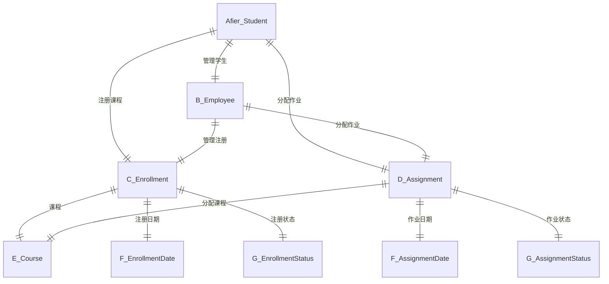

                 

# 生态意识：个人与环境的共生关系

## 关键词：生态意识、个人与环境的共生关系、可持续发展、环境保护、绿色经济、生态农业

> 摘要：本文旨在深入探讨生态意识的概念、起源及其在现代生活中的重要性。通过详细阐述生态意识的几个核心概念，如共生关系、可持续发展、环境伦理等，本文揭示了生态意识在不同领域中的应用。此外，本文还分析了个人如何培养和提高生态意识，以及教育、政策和法律在生态意识推广中的作用。最后，本文讨论了国际协作在生态意识培养和环境保护中的重要性。

## 目录大纲设计思路

### 第一部分：生态意识的起源与核心概念

- **第1章：生态意识的起源与发展**
  - 生态意识的定义
  - 生态意识的起源
  - 生态意识在现代社会的重要性

- **第2章：核心概念与联系**
  - **共生关系**
    - 定义
    - 特点
    - 与环境的联系
  - **可持续发展**
    - 定义
    - 原则
    - 挑战
  - **环境伦理**
    - 起源
    - 基本原则
    - 应用
  - **概念属性特征对比表格**
  - **ER实体关系图架构**

### 第二部分：生态意识的应用领域

- **第3章：生态意识在不同领域的应用**
  - **环境保护**
    - 现状
    - 应用
    - 政策与法规
  - **绿色经济**
    - 概念
    - 发展趋势
    - 应用
  - **生态农业**
    - 定义
    - 优势
    - 推广

### 第三部分：个人与生态意识

- **第4章：个人层面的生态意识**
  - **生活方式的改变**
    - 环保生活方式
    - 挑战与对策
  - **消费习惯的调整**
    - 绿色消费
    - 推动因素
  - **个人生态意识的培养**
    - 教育意义
    - 实施策略

### 第四部分：教育在生态意识培养中的作用

- **第5章：生态意识与教育**
  - **学校教育**
    - 作用
    - 课程设计
    - 效果评估
  - **家庭教育**
    - 作用
    - 实践与挑战
    - 方法与技巧

### 第五部分：政策和法律

- **第6章：政策和法律在生态意识推广中的作用**
  - **政策措施**
    - 定义
    - 实施现状
    - 效果分析
  - **法律法规**
    - 定义
    - 种类与内容
    - 实施与执行

### 第六部分：国际协作与生态意识

- **第7章：国际协作在生态意识培养中的作用**
  - **国际合作的意义**
    - 重要性
    - 现状与挑战
    - 目标与任务
  - **国际组织的作用**
    - 定义与功能
    - 生态意识推广活动

## 文章开始

### 第1章：生态意识的起源与发展

#### 1.1 生态意识的定义

生态意识是指人类对生态环境的认识、理解和态度，它涉及到人与自然、人与环境的关系。生态意识不仅关注人类自身的生活质量，更关注人类活动的生态影响和生态可持续性。

#### 1.2 生态意识的起源

生态意识的起源可以追溯到人类文明的初期。在古代，人类主要以狩猎、采集为生，对自然环境的依赖性较强。随着农业和工业的发展，人类逐渐开始认识到自己对自然环境的影响。18世纪末至19世纪初，工业革命引发了环境污染和生态破坏的问题，人们开始反思人类与自然的关系，提出了生态意识的概念。

#### 1.3 生态意识在现代社会的重要性

在现代社会，生态意识的重要性愈发凸显。随着全球气候变化、环境污染、资源枯竭等问题日益严重，生态意识已经成为人类社会可持续发展的重要基础。生态意识的培养和普及，有助于提高人们的环保意识，减少对自然环境的破坏，促进人与自然的和谐共生。

### 第2章：核心概念与联系

#### 2.1 共生关系

共生关系是指不同物种之间相互依存、相互影响的关系。在生态学中，共生关系通常分为互利共生、共栖和寄生三种类型。互利共生是指双方都能从中受益的关系，如蜜蜂与花朵之间的关系；共栖是指一方受益，另一方无影响的关系，如鲑鱼与海豹之间的关系；寄生是指一方受益，另一方受损的关系，如跳蚤与人之间的关系。

#### 2.1.1 共生关系的定义

共生关系是指两个或多个生物体在共同生活的过程中，通过相互作用，达到互利共赢的状态。共生关系通常具有以下特点：

- **相互依赖**：共生生物体之间的生存和发展都依赖于对方。
- **长期性**：共生关系通常具有较长的生命周期，不是一次性或短期的互动。
- **相互适应**：共生生物体会在长期共同生活中逐渐适应对方，优化共生关系。

#### 2.1.2 共生关系的特点

共生关系具有以下特点：

- **互利性**：共生关系中的生物体之间能够相互提供生存所需的资源或服务。
- **适应性**：共生生物体会根据对方的需求和环境条件，调整自身的生理和行为特征，以优化共生关系。
- **稳定性**：共生关系具有相对稳定性，不易受到外界因素的干扰。

#### 2.1.3 共生关系与环境

共生关系不仅存在于生物之间，也与环境之间有着密切的联系。在生态系统中，生物与环境之间的共生关系构成了生态平衡的基础。例如，植物通过光合作用吸收二氧化碳，释放氧气，为人类和其他生物提供了生存所需的氧气；而人类通过呼吸作用消耗氧气，释放二氧化碳，为植物的光合作用提供了原料。

#### 2.2 可持续发展

可持续发展是指满足当前需求而不损害子孙后代满足其需求的能力。可持续发展原则包括生态平衡、资源节约、社会公正和经济效益四个方面。

#### 2.2.1 可持续发展的定义

可持续发展是一种发展模式，旨在满足当前需求的同时，不损害子孙后代满足其需求的能力。它强调经济增长、社会进步和环境保护之间的协调，追求人与自然的和谐共生。

#### 2.2.2 可持续发展的原则

可持续发展的原则包括：

- **生态平衡**：保护生态环境，维护生物多样性，确保生态系统的稳定性和可持续性。
- **资源节约**：合理利用资源，提高资源利用效率，减少资源浪费。
- **社会公正**：促进社会公平，提高人民生活质量，确保全体人民共享发展成果。
- **经济效益**：追求经济效益，提高经济效率，实现经济持续增长。

#### 2.2.3 可持续发展的挑战

可持续发展的挑战包括：

- **资源枯竭**：资源过度开发和污染导致资源枯竭和生态破坏。
- **环境污染**：工业化和城市化带来的环境污染和生态破坏。
- **人口增长**：人口增长带来的资源需求和生态压力。
- **科技发展**：科技发展带来的不确定性和风险，如气候变化、生物技术等。

#### 2.3 环境伦理

环境伦理是关于人类与环境关系的伦理学理论。它关注人类在开发利用自然资源和环境时，应遵循的道德原则和规范。

#### 2.3.1 环境伦理的起源

环境伦理的起源可以追溯到古代哲学和宗教思想。在古希腊哲学中，亚里士多德和普罗塔戈拉等哲学家提出了关于人与自然和谐共生的观点。在中世纪基督教思想中，圣奥古斯丁和托马斯·阿奎那等神学家提出了关于人与自然关系的伦理思考。

#### 2.3.2 环境伦理的基本原则

环境伦理的基本原则包括：

- **尊重自然**：尊重自然，保护生态系统的完整性和稳定性。
- **公平原则**：公平地分配自然资源和环境利益，确保所有人都能享受良好的生态环境。
- **代际公平**：保护后代人的生态环境利益，确保他们能够满足其需求。
- **责任原则**：人类在开发利用自然资源和环境时，应承担相应的责任，保护生态环境。

#### 2.3.3 环境伦理的应用

环境伦理的应用包括：

- **环境保护政策**：制定环境保护政策和法规，规范人类活动对自然环境的影响。
- **可持续发展实践**：在经济发展过程中，遵循环境伦理原则，实现经济发展与环境保护的协调。
- **环境教育**：通过环境教育，提高人们的生态意识和环境伦理意识，培养环保行为。

#### 2.4 概念属性特征对比表格

| 概念       | 定义                                                                                       | 特点                                                         | 与环境的联系                                                     |
|------------|----------------------------------------------------------------------------------------------|--------------------------------------------------------------|----------------------------------------------------------------|
| 共生关系   | 两个或多个生物体在共同生活的过程中，通过相互作用，达到互利共赢的状态。                       | 相互依赖、长期性、相互适应                                     | 生物与环境之间的共生关系构成生态平衡的基础                       |
| 可持续发展 | 满足当前需求而不损害子孙后代满足其需求的能力。                                             | 生态平衡、资源节约、社会公正、经济效益                         | 可持续发展原则有助于实现人与自然的和谐共生                       |
| 环境伦理   | 关于人类与环境关系的伦理学理论。                                                       | 尊重自然、公平原则、代际公平、责任原则                         | 环境伦理原则指导人类在开发利用自然资源和环境时，应遵循的道德原则和规范 |

#### 2.5 ER实体关系图架构

### 第3章：生态意识在不同领域的应用

#### 3.1 环境保护

环境保护是指通过采取各种措施，防止环境污染和生态破坏，保护人类生存环境和生态系统。生态意识在环境保护中的应用主要体现在以下几个方面：

- **污染预防**：通过减少污染物的排放和合理利用资源，从源头上减少环境污染。
- **生态修复**：对受到污染和破坏的生态系统进行修复和恢复，提高生态系统的自我修复能力。
- **绿色技术创新**：推广和应用绿色技术，减少环境污染和资源消耗，实现经济可持续发展。
- **法律法规**：制定和完善环境保护法律法规，加强对环境违法行为的监管和处罚。

#### 3.1.1 环境保护的现状

近年来，全球环境保护意识不断提高，各国政府和国际组织纷纷采取行动，加强环境保护。然而，环境污染和生态破坏的问题仍然严峻，如气候变化、水资源短缺、土地荒漠化、生物多样性丧失等。此外，一些地区环境保护法律法规的执行力度不足，导致环境污染问题得不到有效解决。

#### 3.1.2 生态意识在环境保护中的应用

生态意识在环境保护中的应用主要包括以下几个方面：

- **公众参与**：通过提高公众的生态意识，鼓励公众积极参与环境保护活动，如垃圾分类、节能减排等。
- **教育宣传**：通过教育机构和媒体等渠道，普及生态意识，提高人们的环保意识和素质。
- **科技创新**：鼓励绿色技术创新，推动环保产业的发展，减少环境污染和资源消耗。
- **政策支持**：制定和完善环境保护政策，加大对环境保护的支持力度。

#### 3.1.3 环境保护的政策与法规

环境保护的政策和法规是推动生态意识普及和环境保护的重要手段。不同国家和地区的环境保护政策和法规有所不同，但主要内容包括：

- **污染物排放标准**：对各类污染物的排放标准进行规定，限制污染物的排放量。
- **资源节约和综合利用**：鼓励合理利用资源，提高资源利用效率，减少资源浪费。
- **生态补偿**：对因环境保护和生态修复而受到损失的地区和单位，给予一定的补偿和支持。
- **环境监管**：加强对环境保护的监管力度，对环境违法行为进行查处和处罚。

#### 3.2 绿色经济

绿色经济是指以保护生态环境、提高资源利用效率和促进经济发展为目标的经济模式。生态意识在绿色经济中的应用主要体现在以下几个方面：

- **绿色产业**：鼓励发展绿色产业，如新能源、节能环保、生态农业等，减少对环境的负面影响。
- **绿色消费**：倡导绿色消费，提高公众的环保意识，减少资源消耗和环境污染。
- **循环经济**：推动循环经济的发展，通过资源循环利用，减少资源浪费和环境污染。
- **生态补偿**：建立生态补偿机制，对因环境保护和生态修复而受到损失的地区和单位，给予一定的补偿和支持。

#### 3.2.1 绿色经济的概念

绿色经济是指以环境保护、资源节约和可持续发展为核心，通过调整产业结构、优化资源配置、提高经济效益，实现经济与环境的协调发展。绿色经济强调在经济发展的同时，保护生态环境，提高资源利用效率，减少环境污染和生态破坏。

#### 3.2.2 绿色经济的发展趋势

随着全球环境保护意识的提高，绿色经济已经成为各国经济发展的重要方向。绿色经济的发展趋势主要包括：

- **技术创新**：推动绿色技术创新，提高绿色产业的竞争力。
- **政策支持**：制定和完善绿色经济政策，加大对绿色经济的支持力度。
- **国际合作**：加强国际合作，推动绿色经济的全球发展。
- **公众参与**：提高公众的环保意识，鼓励公众积极参与绿色经济活动。

#### 3.2.3 生态意识在绿色经济中的应用

生态意识在绿色经济中的应用主要包括以下几个方面：

- **绿色产业**：鼓励发展绿色产业，提高绿色产业的竞争力。
- **绿色消费**：倡导绿色消费，减少资源消耗和环境污染。
- **循环经济**：推动循环经济的发展，提高资源利用效率。
- **政策支持**：制定和完善绿色经济政策，推动绿色经济的发展。

#### 3.3 生态农业

生态农业是指以生态学理论为指导，遵循生态平衡、循环利用和可持续发展的原则，通过合理利用自然资源和保护生态环境，实现农业生产与生态系统的协调发展。生态意识在生态农业中的应用主要体现在以下几个方面：

- **生态种植**：推广生态种植技术，减少化肥和农药的使用，保护土壤和水资源。
- **生态养殖**：推广生态养殖技术，减少抗生素和添加剂的使用，保障动物福利和食品安全。
- **生态农业模式**：推广生态农业模式，如有机农业、生态渔业等，提高农业生产的生态效益。
- **生态农业教育**：加强生态农业教育，提高农民的生态意识和农业技术。

#### 3.3.1 生态农业的定义

生态农业是指以生态学理论为指导，遵循生态平衡、循环利用和可持续发展的原则，通过合理利用自然资源和保护生态环境，实现农业生产与生态系统的协调发展。生态农业强调在农业生产过程中，减少化肥、农药的使用，保护土壤和水资源，提高农产品的生态品质。

#### 3.3.2 生态农业的优势

生态农业具有以下优势：

- **环境保护**：生态农业通过减少化肥、农药的使用，降低农业面源污染，保护土壤和水资源。
- **资源节约**：生态农业通过循环利用资源，提高资源利用效率，减少资源浪费。
- **食品安全**：生态农业生产的农产品，质量好、口感佳，有利于保障食品安全。
- **生态效益**：生态农业通过保护生态环境，提高生态系统的稳定性和可持续性。

#### 3.3.3 生态意识的传播与推广

生态意识的传播与推广是生态农业发展的重要环节。生态意识的传播与推广主要包括以下几个方面：

- **教育宣传**：通过教育机构和媒体等渠道，普及生态意识，提高公众的环保意识。
- **技术推广**：推广生态农业技术，提高农民的生态意识和农业技术。
- **政策支持**：制定和完善生态农业政策，加大对生态农业的支持力度。
- **示范带动**：建立生态农业示范区，通过示范带动，推动生态农业的发展。

### 第4章：个人层面的生态意识

#### 4.1 生活方式的改变

生活方式的改变是提高个人生态意识的重要途径。通过改变生活方式，可以减少对环境的负面影响，提高资源利用效率，实现可持续发展。以下是几种生活方式的改变：

- **节能减排**：减少能源消耗，提高能源利用效率。例如，使用节能灯泡、太阳能热水器、节能电器等。
- **绿色出行**：选择步行、骑自行车、乘坐公共交通工具等绿色出行方式，减少私家车的使用。
- **垃圾分类**：按照垃圾分类标准，将生活垃圾分为可回收物、有害垃圾、湿垃圾和干垃圾，提高资源回收利用率。
- **节约用水**：合理使用水资源，避免浪费。例如，使用节水型马桶、节水型洗衣机等。

#### 4.1.1 环保生活方式的概念

环保生活方式是指以环保为出发点，通过改变生活方式，减少对环境的负面影响，提高资源利用效率，实现可持续发展。环保生活方式的核心是环保意识，即意识到环保是每个人的责任，从自身做起，为保护地球环境做出贡献。

#### 4.1.2 环保生活方式的具体实践

环保生活方式的具体实践包括以下几个方面：

- **节能减排**：通过使用节能电器、太阳能热水器、节能灯泡等，减少能源消耗。
- **绿色出行**：选择步行、骑自行车、乘坐公共交通工具等绿色出行方式，减少私家车的使用。
- **垃圾分类**：按照垃圾分类标准，将生活垃圾分为可回收物、有害垃圾、湿垃圾和干垃圾，提高资源回收利用率。
- **节约用水**：合理使用水资源，避免浪费。
- **绿色消费**：选择环保产品，减少对环境的负面影响。

#### 4.1.3 环保生活方式的挑战与对策

环保生活方式的挑战主要包括以下几个方面：

- **习惯养成**：环保生活方式需要改变人们长期以来形成的消费习惯和生活方式，需要付出一定的努力和时间。
- **信息不对称**：环保产品和技术的信息不透明，消费者难以辨别产品的环保性能。
- **政策支持**：环保生活方式的推广需要政策的支持，包括税收优惠、补贴等。

对策包括：

- **教育宣传**：通过教育机构和媒体等渠道，普及环保知识，提高公众的环保意识。
- **政策支持**：制定和完善环保政策，加大对环保产品的支持力度。
- **技术创新**：推动环保产品和技术的发展，提高环保产品的性能和竞争力。

#### 4.2 消费习惯的调整

消费习惯的调整是提高个人生态意识的重要途径。通过调整消费习惯，可以减少对环境的负面影响，提高资源利用效率，实现可持续发展。以下是几种消费习惯的调整：

- **购买环保产品**：选择环保认证的产品，减少对环境的负面影响。
- **减少一次性用品**：减少使用一次性塑料制品，如塑料袋、一次性餐具等。
- **回收利用**：将废弃物品进行分类回收，提高资源利用率。
- **绿色消费**：选择绿色、有机、本地生产的农产品，减少对环境的负面影响。

#### 4.2.1 绿色消费的概念

绿色消费是指以环保、节能、低碳为理念，通过选择环保产品、减少一次性用品、回收利用等方式，减少对环境的负面影响，提高资源利用效率，实现可持续发展。

#### 4.2.2 绿色消费的实践

绿色消费的实践包括以下几个方面：

- **购买环保产品**：选择通过环保认证的产品，如节能电器、环保建材等。
- **减少一次性用品**：减少使用一次性塑料制品，如塑料袋、一次性餐具等。
- **回收利用**：将废弃物品进行分类回收，提高资源利用率。
- **绿色出行**：选择步行、骑自行车、乘坐公共交通工具等绿色出行方式，减少私家车的使用。

#### 4.2.3 绿色消费的推动因素

绿色消费的推动因素包括：

- **环保意识**：随着人们对环保问题的关注度提高，越来越多的人开始选择绿色消费。
- **政策支持**：政府出台相关政策，鼓励绿色消费，如税收优惠、补贴等。
- **技术创新**：环保产品和技术的发展，提高了绿色消费的可行性。

### 第5章：生态意识与教育

#### 5.1 学校教育

学校教育在生态意识培养中起着重要作用。学校教育可以通过课堂教学、实践活动、校园文化等多种方式，提高学生的生态意识，培养他们的环保行为。

#### 5.1.1 学校教育在生态意识培养中的作用

学校教育在生态意识培养中的作用主要体现在以下几个方面：

- **知识传播**：通过课堂教学，向学生传授生态知识，提高他们的生态意识。
- **实践体验**：通过实践活动，让学生亲身体验生态保护的实践过程，培养他们的环保行为。
- **价值观塑造**：通过校园文化，培养学生正确的生态价值观，树立环保意识。

#### 5.1.2 生态意识课程的设计与实施

生态意识课程的设计与实施应遵循以下原则：

- **实用性**：课程内容应贴近学生的实际生活，易于理解和实践。
- **互动性**：课程应注重师生互动，激发学生的兴趣和参与度。
- **持续性**：课程应贯穿整个学习过程，形成长效机制。

#### 5.1.3 生态意识教育的效果评估

生态意识教育的效果评估主要包括以下几个方面：

- **知识掌握情况**：通过考试、调查问卷等方式，评估学生对生态知识的掌握程度。
- **行为改变情况**：通过观察学生的日常生活和行为，评估他们是否养成了环保习惯。
- **价值观塑造情况**：通过访谈、调查问卷等方式，评估学生的生态价值观是否得到培养。

#### 5.2 家庭教育

家庭教育在生态意识培养中起着至关重要的作用。家庭是孩子成长的第一课堂，家长的教育方式对孩子的生态意识养成有着深远影响。

#### 5.2.1 家庭教育在生态意识培养中的作用

家庭教育在生态意识培养中的作用主要体现在以下几个方面：

- **言传身教**：家长通过自身的行为，向孩子传递生态意识，起到示范作用。
- **习惯培养**：家长在日常生活中，引导孩子养成环保习惯，如垃圾分类、节约用水等。
- **价值观塑造**：家长通过故事、案例等方式，向孩子传递环保价值观，培养他们的责任感。

#### 5.2.2 家庭教育的实践与挑战

家庭教育的实践主要包括以下几个方面：

- **家庭环保活动**：家长可以组织家庭环保活动，如家庭垃圾分类、家庭节能减排等。
- **环保知识传播**：家长可以通过书籍、网络等途径，向孩子传播生态知识。
- **环保行为引导**：家长在日常生活中，引导孩子养成良好的环保行为。

家庭教育的挑战主要包括：

- **时间精力**：家长在忙碌的工作生活中，可能难以抽出足够的时间进行生态教育。
- **教育方式**：家长的教育方式可能存在一定局限性，难以全面培养孩子的生态意识。

#### 5.2.3 家庭教育的方法与技巧

家庭教育的方法与技巧主要包括以下几个方面：

- **互动式教育**：家长可以通过游戏、互动等方式，与孩子共同参与环保活动，增强他们的环保意识。
- **情境教育**：家长可以在日常生活中，通过情境教育，引导孩子养成良好的环保行为。
- **榜样示范**：家长可以通过自己的行为，成为孩子的榜样，引导他们养成环保习惯。

### 第6章：政策和法律在生态意识推广中的作用

#### 6.1 政策措施

政策和法律是推动生态意识普及和环境保护的重要手段。政策措施主要包括以下几个方面：

- **环保法律法规**：制定和完善环保法律法规，明确环境保护的法律责任和义务。
- **环保规划**：制定环保规划，明确环境保护的目标、任务和措施。
- **环保标准**：制定环保标准，规范污染物的排放和资源利用。
- **环保投资**：加大对环境保护的投资，提高环境保护的投入。

#### 6.1.1 政策措施的定义

政策措施是指政府为了推动生态意识普及和环境保护，采取的一系列行政、经济和法律手段。

#### 6.1.2 政策措施的实施现状

随着全球环境保护意识的提高，各国政府和国际组织纷纷采取行动，加强环境保护。政策措施的实施现状总体来说有以下特点：

- **政策不断完善**：各国政府和国际组织不断制定和完善环保法律法规，提高环境保护的法制化水平。
- **政策执行力度加大**：政府对环保违法行为的查处和处罚力度加大，提高环境违法的成本。
- **政策创新**：政府通过创新环保政策，如碳交易、绿色金融等，推动环境保护和可持续发展。

#### 6.1.3 政策措施的效果分析

政策措施的效果分析主要包括以下几个方面：

- **环境保护成效**：通过政策措施的实施，环境污染和生态破坏问题得到有效遏制，环境质量得到改善。
- **生态意识提高**：公众的环保意识得到提高，环保行为得到改善。
- **经济发展与环境保护协调**：通过政策措施，推动经济发展与环境保护的协调发展，实现绿色增长。

#### 6.2 法律法规

法律法规是推动生态意识普及和环境保护的重要手段。法律法规主要包括以下几个方面：

- **环保法律法规**：制定和完善环保法律法规，明确环境保护的法律责任和义务。
- **资源管理法律法规**：制定和完善资源管理法律法规，规范资源开发和利用。
- **环境影响评价法律法规**：制定和完善环境影响评价法律法规，规范环境影响评价工作。

#### 6.2.1 法律法规的定义

法律法规是指由国家制定或认可，以国家强制力保证实施的行为规范。

#### 6.2.2 法律法规的种类与内容

法律法规的种类与内容主要包括以下几个方面：

- **环保法律法规**：如《环境保护法》、《水污染防治法》、《大气污染防治法》等。
- **资源管理法律法规**：如《矿产资源法》、《森林法》、《土地管理法》等。
- **环境影响评价法律法规**：如《环境影响评价法》、《建设项目环境保护管理条例》等。

#### 6.2.3 法律法规的实施与执行

法律法规的实施与执行主要包括以下几个方面：

- **法律法规的制定和修订**：根据环境保护和资源管理的需要，制定和修订相关法律法规。
- **法律法规的宣传教育**：通过宣传教育，提高公众对法律法规的认知和理解。
- **法律法规的执行**：加强对法律法规的执行和监督，确保法律法规的实施。

### 第7章：国际协作在生态意识培养中的作用

#### 7.1 国际合作的意义

国际合作在生态意识培养和环境保护中具有重要意义。随着全球环境的日益恶化，单一国家或地区无法独立解决环境问题，需要各国共同合作，共同应对环境挑战。

#### 7.1.1 国际合作的重要性

国际合作的重要性主要体现在以下几个方面：

- **共享资源和技术**：各国可以共享环境资源和技术，提高环境保护和生态意识培养的效率。
- **共同应对环境挑战**：国际合作有助于各国共同应对全球性的环境问题，如气候变化、生物多样性丧失等。
- **推动全球可持续发展**：国际合作有助于推动全球可持续发展，实现经济发展与环境保护的协调。

#### 7.1.2 国际合作的现状与挑战

国际合作的现状与挑战主要包括以下几个方面：

- **合作机制不完善**：国际合作的机制和制度有待完善，如国际合作框架、合作机制、资金支持等。
- **利益分配不均**：国际合作中，发展中国家和发达国家之间的利益分配存在不均衡现象，影响合作的顺利进行。
- **执行力度不足**：国际合作中，一些国家的执行力度不足，导致合作协议的落实不到位。

#### 7.1.3 国际合作的目标与任务

国际合作的目标与任务主要包括以下几个方面：

- **制定共同的环境保护目标**：各国共同制定环境保护目标，明确国际合作的方向和重点。
- **共享环境资源和技术**：各国共享环境资源和技术，提高环境保护和生态意识培养的效率。
- **加强国际合作机制**：完善国际合作机制，加强国际合作的管理和协调。
- **推动全球可持续发展**：通过国际合作，推动全球可持续发展，实现经济发展与环境保护的协调。

#### 7.2 国际组织的作用

国际组织在生态意识培养和环境保护中发挥着重要作用。国际组织通过制定国际规则、提供资金支持、开展国际合作项目等方式，推动全球环境保护和生态意识培养。

#### 7.2.1 国际组织的定义与功能

国际组织的定义与功能主要包括以下几个方面：

- **定义**：国际组织是指由两个或两个以上国家组成的，具有国际性质的组织。
- **功能**：国际组织的主要功能包括制定国际规则、提供资金支持、开展国际合作项目、协调国际关系等。

#### 7.2.2 国际组织的生态意识推广活动

国际组织的生态意识推广活动主要包括以下几个方面：

- **制定国际环境保护规则**：国际组织制定国际环境保护规则，如《联合国气候变化框架公约》、《生物多样性公约》等，推动全球环境保护。
- **提供资金支持**：国际组织通过提供资金支持，帮助发展中国家开展环境保护和生态意识培养项目。
- **开展国际合作项目**：国际组织开展国际合作项目，如生态农业、可再生能源等，推动全球可持续发展。
- **协调国际关系**：国际组织协调国际关系，推动各国在环境保护和生态意识培养方面的合作。

### 总结

生态意识是个人与环境的共生关系的重要体现。通过培养和提高生态意识，我们可以更好地保护生态环境，实现可持续发展。本文从生态意识的起源、核心概念、应用领域、个人层面的生态意识、教育作用、政策和法律、国际协作等方面进行了详细阐述。让我们共同努力，培养生态意识，为地球家园的美好未来贡献一份力量。

## 作者信息

作者：AI天才研究院/AI Genius Institute & 禅与计算机程序设计艺术 /Zen And The Art of Computer Programming

