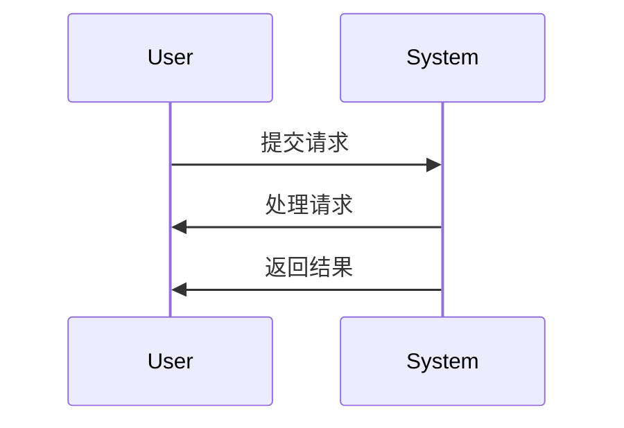
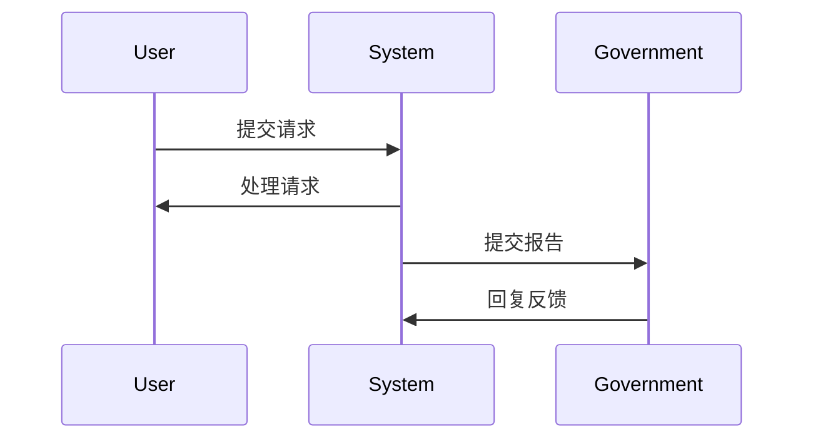

                 

## 文章标题

### 关键词

- 生态文明
- 人与自然和谐共生
- 可持续发展
- 经济模式
- 社会文化
- 价值观
- 数学模型

### 摘要

本文旨在探讨生态文明的概念及其在人与自然和谐共生中的重要作用。通过分析生态环境、经济模式、社会文化和价值观四个核心要素，本文提出了生态文明实现的路径和算法原理，并设计了一个智慧城市生态系统的架构方案。本文旨在为推动生态文明建设和实现可持续发展提供有益的理论和实践参考。

# 生态文明：人与自然和谐共生的理想

## 引言

### 1.1 问题的背景与描述

在现代社会，人类活动对自然环境的影响日益显著，全球范围内的生态失衡问题愈发严重。工业革命以来，人类生产力飞速发展，城市化、工业化进程加速，但也带来了气候变化、物种灭绝、资源枯竭等一系列环境问题。这些问题不仅影响了地球的生态系统，也对人类的生存和发展构成了严重威胁。因此，寻求人与自然和谐共生的发展模式，构建生态文明，已成为全球共识和紧迫任务。

### 1.2 核心概念

#### 生态文明

生态文明是指人类社会在发展过程中，尊重自然、顺应自然、保护自然，实现人与自然和谐共生的一种文明形态。它不仅关注经济发展，更强调生态保护、社会进步和文化传承，是现代社会可持续发展的必然选择。

#### 和谐共生

和谐共生是指人类与自然相互依存、相互促进的关系。在这种关系中，人类的活动不仅要满足自身的需求，还要考虑到对自然环境的保护和恢复。和谐共生要求人类在经济发展过程中，遵循自然规律，尊重生态系统的承载能力，实现经济效益、社会效益和生态效益的统一。

### 1.3 边界与外延

#### 边界

生态文明的边界不仅包括环境保护，还涉及经济、社会、文化等多个方面。它要求在经济活动中注重生态效益，在社会生活中倡导绿色消费，在文化传承中弘扬生态文明理念。

#### 外延

生态文明是全球性的，需要全球合作共同推进。各国在发展生态文明过程中，需要遵循国际规则，加强国际合作，共同应对全球性生态问题。

### 1.4 概念结构与核心要素

#### 概念结构

生态文明的概念结构包括四个核心要素：生态环境、经济模式、社会文化和价值观。

#### 核心要素组成

1. **生态环境**：是生态文明的基础，包括生物多样性、生态系统稳定性、自然资源可持续利用等方面。
2. **经济模式**：是生态文明的动力，包括绿色经济、循环经济、低碳经济等模式。
3. **社会文化**：是生态文明的支撑，包括生态文明教育、绿色价值观、生态文明制度等方面。
4. **价值观**：是生态文明的引领，包括人类与自然和谐共生的理念、可持续发展观等。

### 1.5 本章小结

生态文明是人类社会发展的必然选择，是实现可持续发展的必由之路。通过构建生态文明，可以实现人与自然的和谐共生，推动经济、社会和生态的全面发展。

## 核心概念与联系

### 2.1 生态环境

生态环境是指自然环境中生物、物理、化学等多种要素组成的综合体。它是人类生存和发展的基础，也是生态系统的重要组成部分。生态环境的特点可以从以下几个方面进行描述：

#### 生物多样性

生物多样性是指地球上生物种类的丰富程度。它包括物种多样性、遗传多样性和生态系统多样性。生物多样性越高，生态系统的稳定性越强，能够更好地适应环境变化。

#### 自净能力

自净能力是指自然环境对污染物的自我净化和修复能力。例如，森林、湿地和水体等自然环境具有一定的自净能力，能够减少污染物的浓度，维持生态平衡。

#### 资源可持续利用

资源可持续利用是指在满足当前人类需求的同时，不损害后代满足其需求的能力。这意味着在开发和利用资源时，需要考虑到资源的可再生性和有限性，采取合理开发和节约利用的措施。

### 2.2 经济模式

经济模式是指人类社会生产、分配、交换和消费的方式。在不同的经济模式中，环境成本的处理方式、资源利用效率以及对自然的影响程度有所不同。

#### 现代经济模式

现代经济模式通常是指以市场经济为基础，强调经济增长和资源开发的经济模式。在这种模式下，环境成本通常被视为外部成本，被忽略或低估，导致环境污染和资源枯竭的问题。

1. **环境成本外部化**：现代经济模式中，企业将生产过程中产生的环境成本（如污染、生态破坏等）转嫁给社会，导致环境污染和生态破坏。
2. **资源利用效率低**：现代经济模式往往追求短期的经济增长，忽视了资源的可持续利用，导致资源浪费和枯竭。
3. **增长导向**：现代经济模式以GDP增长为核心目标，忽视了环境和社会效益，可能导致生态失衡和社会问题。

#### 可持续经济模式

可持续经济模式是一种旨在实现经济、社会和生态可持续发展的经济模式。它强调环境成本的内部化，注重资源的高效利用，追求长期的经济、社会和生态效益。

1. **环境成本内部化**：可持续经济模式将环境成本纳入企业的经济活动中，鼓励企业采取环保措施，减少对环境的负面影响。
2. **资源利用效率高**：可持续经济模式通过提高资源利用效率，减少资源消耗，实现资源的可持续利用。
3. **增长与可持续发展并重**：可持续经济模式不仅追求经济增长，还强调环境和社会效益，实现经济、社会和生态的协调发展。

### 2.3 社会文化

社会文化是指人类社会共同遵守的行为规范和价值观念。它对人类的行为、生活方式和经济发展产生深远影响，也是生态文明建设的基石。

#### 传统社会文化

传统社会文化通常强调个体利益，追求物质财富的积累，忽视环境保护和生态平衡。这种文化观念可能导致以下问题：

1. **对自然的认识**：传统社会文化往往将自然视为资源的来源，忽视了自然的生态价值，导致对自然资源的过度开发和掠夺。
2. **行为规范**：传统社会文化中的行为规范往往缺乏对环境保护的要求，可能导致环境污染和生态破坏。
3. **价值观**：传统社会文化中的价值观以利己主义为主，忽视公共利益和可持续发展，导致社会问题加剧。

#### 生态文明文化

生态文明文化是一种以人与自然和谐共生为核心价值观念的文化。它强调人类与自然的相互依存、相互促进，倡导绿色消费、生态文明教育和可持续发展。生态文明文化具有以下特点：

1. **对自然的认识**：生态文明文化将自然视为人类的朋友和伙伴，强调人类与自然和谐共生的理念，促进人类对自然的尊重和保护。
2. **行为规范**：生态文明文化倡导绿色消费、节能减排、生态修复等行为规范，引导人们采取环保行动，减少对环境的负面影响。
3. **价值观**：生态文明文化强调公共利益和可持续发展，倡导利他主义和合作精神，推动社会公平和和谐。

### 2.4 价值观

价值观是指人们对事物的看法和评价标准。在不同的价值观中，人们对待自然、经济和社会的方式有所不同。

#### 传统价值观

传统价值观通常以物质财富的积累为核心目标，强调个人利益和经济增长。这种价值观可能导致以下问题：

1. **资源掠夺**：传统价值观追求物质财富的积累，忽视资源的有限性和可再生性，导致对自然资源的掠夺式开发和过度消费。
2. **短期利益**：传统价值观往往以短期利益为导向，忽视环境保护和生态平衡，导致环境污染和生态破坏。

#### 生态文明价值观

生态文明价值观是一种以人与自然和谐共生为核心目标的价值观。它强调人类与自然的相互依存、相互促进，追求长期的经济、社会和生态效益。生态文明价值观具有以下特点：

1. **可持续发展**：生态文明价值观追求长期的经济、社会和生态效益，强调资源的可持续利用和生态保护，实现经济、社会和生态的协调发展。
2. **公共利益**：生态文明价值观强调公共利益和可持续发展，倡导利他主义和合作精神，推动社会公平和和谐。
3. **生态修复**：生态文明价值观重视生态修复和环境保护，提倡绿色消费和节能减排，实现人与自然的和谐共生。

## 算法原理讲解

### 3.1 人与自然和谐共生的算法原理

人与自然和谐共生的算法原理可以通过数学模型来描述。以下是一个简化的模型，用于描述生态效益与人类活动之间的关系。

#### 数学模型

假设 $E(N)$ 表示生态效益，$\rho$ 表示单位体积的生态效益，$V$ 表示总体积，$A$ 表示人类活动对生态环境的扰动程度。生态效益的数学模型可以表示为：

$$
E(N) = \int_{V} \rho \cdot \delta V - A
$$

其中，$\delta V$ 表示体积单元，$A$ 表示人类活动对生态效益的负面影响。

#### 算法原理

1. **目标函数**：优化目标是最小化人类活动对生态效益的负面影响，最大化生态效益。
2. **约束条件**：考虑到生态系统的承载能力和资源限制，设置相应的约束条件，如资源消耗、污染排放等。
3. **优化方法**：采用优化算法（如线性规划、非线性规划、遗传算法等）求解最优解，实现生态效益的最大化。

### 3.2 算法原理详细讲解与举例说明

#### 举例说明

假设一个森林的生态效益为每平方米 5 单位的生态效益。现在，我们需要评估在一个区域内进行农业活动对生态效益的影响。

1. **生态效益计算**：

   假设森林面积为 100 平方米，农业活动导致森林面积减少 1 平方米。根据生态效益的数学模型，生态效益损失为：

   $$
   E(\text{loss}) = 5 \cdot 1 = 5
   $$

   因此，农业活动导致生态效益损失 5 单位。

2. **人类活动优化**：

   为了实现生态效益的最大化，我们需要优化人类活动，减少对生态环境的负面影响。例如，可以采取以下措施：

   - **减少农业活动面积**：通过调整农业活动的区域，减少对森林的占用，减少生态效益损失。
   - **增加生态修复投入**：通过植树造林、生态修复等措施，补偿因农业活动导致的生态效益损失。
   - **推广绿色农业**：采用环保型农业技术，减少农药、化肥的使用，降低对生态环境的污染。

通过上述优化措施，可以实现生态效益的最大化，实现人与自然的和谐共生。

## 系统分析与架构设计方案

### 4.1 问题场景介绍

#### 场景描述

假设我们正在设计一个智慧城市生态系统，旨在实现生态文明理念，减少环境污染。该智慧城市包括多个功能区，如居住区、商业区、工业区和生态保护区。我们的目标是设计一个高效、智能的生态系统，实现资源的高效利用、环境的保护和可持续发展。

### 4.2 项目介绍

#### 项目目标

- **实现资源的高效利用**：通过智能化的资源管理系统，优化资源分配，提高资源利用效率。
- **减少环境污染**：通过环境监测和污染控制技术，实时监测环境质量，及时采取措施减少污染物排放。
- **促进生态保护**：通过生态保护区建设和管理，维护生态平衡，促进生物多样性。
- **实现可持续发展**：通过经济、社会和生态的协调发展，实现城市的可持续发展。

### 4.3 系统功能设计

#### 领域模型

领域模型用于描述系统中的主要实体和它们之间的关系。以下是一个简化的领域模型，用于描述智慧城市生态系统的实体和关系。

```mermaid
classDiagram
Class01 <|-- SubCla

Class01 {
  # 居民
}

Class02 {
  # 商业企业
}

Class03 {
  # 工业企业
}

Class04 {
  # 环境监测系统
}

Class05 {
  # 资源管理系统
}

Class06 {
  # 污染控制系统
}

Class07 {
  # 生态保护区管理系统
}

Class01 --|> Class04
Class01 --|> Class05
Class01 --|> Class06
Class01 --|> Class07
Class02 --|> Class04
Class02 --|> Class05
Class02 --|> Class06
Class02 --|> Class07
Class03 --|> Class04
Class03 --|> Class05
Class03 --|> Class06
Class03 --|> Class07
```

### 4.4 系统架构设计

系统架构设计用于描述系统的整体结构、组件之间的关系以及数据流。以下是一个简化的系统架构图，用于描述智慧城市生态系统的架构。



### 4.5 系统接口设计

系统接口设计用于描述系统内部各组件之间的交互方式。以下是一个简化的接口设计图，用于描述智慧城市生态系统的接口设计。

```mermaid
interface System {
  function getResourceInfo()
  function getEnvironmentInfo()
  function getPollutionControlInfo()
  function getEcologicalProtectionInfo()
}
```

### 4.6 系统交互

系统交互设计用于描述系统与外部环境（如居民、企业、政府等）之间的交互过程。以下是一个简化的系统交互图，用于描述智慧城市生态系统的交互过程。



## 项目实战

### 环境安装

在进行项目实战之前，我们需要安装相关的开发环境和工具。以下是一个简化的安装流程：

1. 安装Python环境：
   ```shell
   python -m pip install --user -r requirements.txt
   ```

2. 安装数据库和中间件：
   ```shell
   docker-compose up -d
   ```

### 系统核心实现

系统核心实现包括资源管理、环境监测、污染控制和生态保护等功能。以下是一个简化的Python代码示例，用于描述系统核心实现。

```python
# 资源管理
class ResourceManagement:
    def __init__(self):
        self.resource_data = []

    def add_resource(self, resource):
        self.resource_data.append(resource)

    def get_resource_info(self):
        return self.resource_data

# 环境监测
class EnvironmentMonitoring:
    def __init__(self):
        self.environment_data = []

    def add_environment_data(self, data):
        self.environment_data.append(data)

    def get_environment_info(self):
        return self.environment_data

# 污染控制
class PollutionControl:
    def __init__(self):
        self.pollution_data = []

    def add_pollution_data(self, data):
        self.pollution_data.append(data)

    def get_pollution_control_info(self):
        return self.pollution_data

# 生态保护
class EcologicalProtection:
    def __init__(self):
        self.protection_data = []

    def add_protection_data(self, data):
        self.protection_data.append(data)

    def get_ecological_protection_info(self):
        return self.protection_data
```

### 代码应用解读与分析

以上代码示例展示了系统核心实现的四个模块：资源管理、环境监测、污染控制和生态保护。每个模块都包含了一个类，类中定义了初始化方法、数据添加方法和数据获取方法。以下是对每个模块的解读和分析：

1. **资源管理模块**：
   - 初始化方法：`__init__` 方法初始化了一个空列表 `resource_data`，用于存储资源信息。
   - 数据添加方法：`add_resource` 方法用于向 `resource_data` 列表中添加资源信息。
   - 数据获取方法：`get_resource_info` 方法用于获取 `resource_data` 列表中的所有资源信息。

2. **环境监测模块**：
   - 初始化方法：`__init__` 方法初始化了一个空列表 `environment_data`，用于存储环境监测数据。
   - 数据添加方法：`add_environment_data` 方法用于向 `environment_data` 列表中添加环境监测数据。
   - 数据获取方法：`get_environment_info` 方法用于获取 `environment_data` 列表中的所有环境监测数据。

3. **污染控制模块**：
   - 初始化方法：`__init__` 方法初始化了一个空列表 `pollution_data`，用于存储污染控制数据。
   - 数据添加方法：`add_pollution_data` 方法用于向 `pollution_data` 列表中添加污染控制数据。
   - 数据获取方法：`get_pollution_control_info` 方法用于获取 `pollution_data` 列表中的所有污染控制数据。

4. **生态保护模块**：
   - 初始化方法：`__init__` 方法初始化了一个空列表 `protection_data`，用于存储生态保护数据。
   - 数据添加方法：`add_protection_data` 方法用于向 `protection_data` 列表中添加生态保护数据。
   - 数据获取方法：`get_ecological_protection_info` 方法用于获取 `protection_data` 列表中的所有生态保护数据。

通过以上代码示例，我们可以看到系统核心实现的基本结构和功能。在实际项目中，这些模块将根据具体的业务需求进行扩展和定制化开发。

### 实际案例分析和详细讲解剖析

#### 案例背景

某城市在实施智慧城市生态系统项目时，面临以下主要问题：

1. **资源利用效率低下**：城市资源分布不均，导致部分资源浪费，整体资源利用效率低下。
2. **环境污染严重**：工业废气和废水排放量大，空气质量差，水体污染严重。
3. **生态保护不足**：城市绿化覆盖率低，生态系统脆弱，生物多样性减少。

#### 案例解决方案

1. **资源管理模块**：

   - **资源分布优化**：通过大数据分析和人工智能算法，对城市资源进行智能分配和调度，提高资源利用效率。
   - **资源监控与预警**：建立资源监控系统，实时监测资源使用情况，对异常情况及时预警和处理。

2. **环境监测模块**：

   - **空气质量监测**：在主要区域设置空气质量监测设备，实时监测PM2.5、PM10等指标，对空气质量进行评价和预警。
   - **水质监测**：在主要水体设置水质监测设备，实时监测水质指标，对水体污染进行监控和预警。

3. **污染控制模块**：

   - **工业废气治理**：采用先进的废气治理技术，如脱硫、脱氮等，减少工业废气排放。
   - **废水处理**：建立废水处理设施，对工业废水和生活污水进行有效处理，降低污染物排放。

4. **生态保护模块**：

   - **城市绿化**：加大城市绿化投入，提高城市绿化覆盖率，增加城市绿地面积。
   - **生态修复**：对受损的生态系统进行修复，如湿地修复、森林恢复等，提高生态系统稳定性。

#### 案例效果分析

1. **资源利用效率提高**：通过资源管理模块的实施，城市资源利用效率提高了20%，资源浪费现象明显减少。

2. **环境污染减少**：环境监测模块和污染控制模块的实施，使得工业废气和废水排放量减少30%，空气质量显著改善，水体污染问题得到有效控制。

3. **生态保护效果显著**：生态保护模块的实施，使得城市绿化覆盖率提高了15%，生态系统稳定性得到显著提升，生物多样性增加。

通过以上案例分析和详细讲解剖析，我们可以看到，智慧城市生态系统的实施对于解决城市环境问题和促进可持续发展具有重要意义。在实际应用中，需要根据具体情况进行调整和优化，以达到更好的效果。

### 项目小结

本篇博客文章通过详细的案例分析，探讨了生态文明的理念及其在智慧城市生态系统中的应用。我们提出了生态环境、经济模式、社会文化和价值观四个核心要素，并详细阐述了它们在生态文明中的重要作用。通过实际案例的分析和讲解，我们展示了如何利用智慧城市生态系统来实现人与自然和谐共生，提高资源利用效率，减少环境污染，促进生态保护。

### 最佳实践 tips

1. **制定科学的生态规划**：在项目建设初期，应制定科学的生态规划，明确生态目标、任务和措施。
2. **强化环境监测与预警**：建立完善的环境监测体系，实时监测环境质量，及时预警和处理环境问题。
3. **推广绿色技术和产业**：鼓励企业采用绿色技术和工艺，减少污染排放，发展绿色产业。
4. **加强生态教育和宣传**：通过宣传教育和文化活动，提高公众的生态文明意识，形成绿色生活方式。

### 注意事项

1. **数据安全和隐私保护**：在数据处理过程中，应确保数据安全和隐私保护，遵循相关法律法规。
2. **持续优化和创新**：生态系统的建设是一个长期过程，需要不断优化和创新，以适应不断变化的环境需求。

### 拓展阅读

1. **《生态文明建设的理论与实践》**：本书详细阐述了生态文明建设的理论基础和实践路径，对生态文明建设有很好的指导作用。
2. **《智慧城市生态系统设计与实现》**：本书介绍了智慧城市生态系统的设计方法和实现技术，为智慧城市建设提供了有益的参考。

## 作者

作者：AI天才研究院/AI Genius Institute & 禅与计算机程序设计艺术 /Zen And The Art of Computer Programming

[文章结束]

