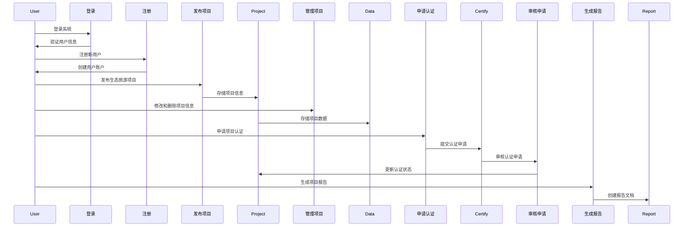
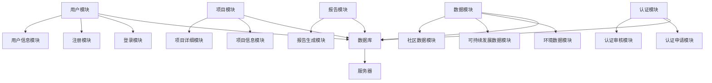
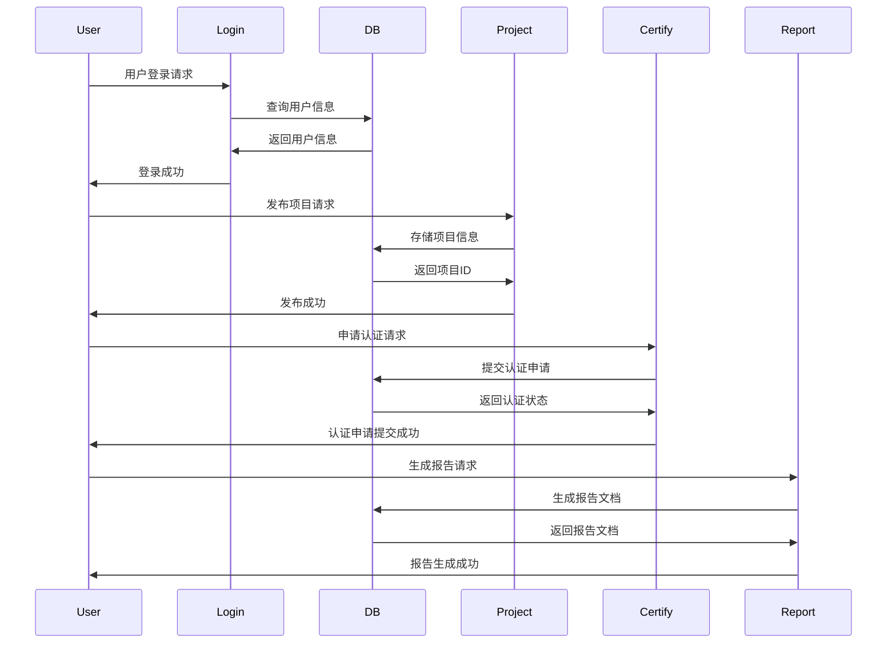

                 


# 生态旅游：在自然体验中重新定义旅行

关键词：生态旅游、自然体验、旅行、可持续发展、环境保护、社区发展

摘要：本文从生态旅游的定义、目的与意义、原则与标准、发展历程与类型、影响、规划与管理以及案例分析等方面，系统地探讨生态旅游在自然体验中的重要性及其重新定义旅行的方式。通过逻辑清晰、结构紧凑的分析，为读者提供深入了解生态旅游的理论与实践指导。

## 目录大纲设计步骤

### 第1步：了解书籍主题

《生态旅游：在自然体验中重新定义旅行》这本书的主题是生态旅游，重点讨论在自然体验中重新定义旅行的方式，以及如何促进生态旅游的发展。因此，目录大纲应该涵盖生态旅游的定义、目的、原则、发展历程、类型、影响、规划与管理，以及案例分析等内容。

### 第2步：确定核心章节

根据书籍主题，我们可以确定以下核心章节：

1. **生态旅游概述**
2. **生态旅游的目的与意义**
3. **生态旅游的原则与标准**
4. **生态旅游的发展历程与类型**
5. **生态旅游的影响**
6. **生态旅游的规划与管理**
7. **生态旅游案例分析**

### 第3步：细化章节内容

针对每个核心章节，我们需要进一步细化内容，以确保目录大纲的完整性和逻辑性。以下是每个章节的细化内容：

### **第1章 生态旅游概述**

- **1.1 问题背景与定义**
- **1.2 生态旅游的核心概念与联系**
- **1.3 生态旅游的发展历程与现状**

### **第2章 生态旅游的目的与意义**

- **2.1 生态旅游的可持续发展目标**
- **2.2 生态旅游对环境保护的贡献**
- **2.3 生态旅游对当地社区的影响**

### **第3章 生态旅游的原则与标准**

- **3.1 生态旅游的原则**
- **3.2 生态旅游的标准**
- **3.3 生态旅游的认证与标志**

### **第4章 生态旅游的发展历程与类型**

- **4.1 生态旅游的发展历程**
- **4.2 生态旅游的类型**
- **4.3 生态旅游的未来趋势**

### **第5章 生态旅游的影响**

- **5.1 生态旅游对自然环境的影响**
- **5.2 生态旅游对当地社区的影响**
- **5.3 生态旅游对旅游产业的影响**

### **第6章 生态旅游的规划与管理**

- **6.1 生态旅游规划的原则与方法**
- **6.2 生态旅游管理的关键要素**
- **6.3 生态旅游的可持续管理策略**

### **第7章 生态旅游案例分析**

- **7.1 案例一：XX生态旅游区的发展模式**
- **7.2 案例二：XX生态旅游项目的成功经验**
- **7.3 案例三：XX生态旅游区的困境与挑战**

### 第4步：检查目录大纲的完整性和逻辑性

确保每个章节都有明确的内容细分，并且章节之间的逻辑关系清晰。例如，第1章为后续章节奠定了基础，第2章到第6章为生态旅游提供了全面的理论和实践指导，第7章通过案例分析来巩固和拓展书籍内容。

### 第5步：撰写目录大纲

将上述内容按照markdown格式撰写成目录大纲，确保简洁明了，便于读者快速了解书籍结构。

## **完整目录大纲**

```markdown
# 《生态旅游：在自然体验中重新定义旅行》目录大纲

## 第1章 生态旅游概述

### 1.1 问题背景与定义

#### 1.1.1 问题背景

#### 1.1.2 生态旅游的定义

### 1.2 生态旅游的核心概念与联系

#### 1.2.1 生态旅游的核心概念

#### 1.2.2 核心概念之间的联系

### 1.3 生态旅游的发展历程与现状

#### 1.3.1 生态旅游的发展历程

#### 1.3.2 生态旅游的现状

## 第2章 生态旅游的目的与意义

### 2.1 生态旅游的可持续发展目标

#### 2.1.1 可持续发展的概念

#### 2.1.2 生态旅游的可持续发展目标

### 2.2 生态旅游对环境保护的贡献

#### 2.2.1 生态旅游与环境保护的关系

#### 2.2.2 生态旅游对环境保护的贡献

### 2.3 生态旅游对当地社区的影响

#### 2.3.1 生态旅游与社区发展的关系

#### 2.3.2 生态旅游对社区发展的积极影响

## 第3章 生态旅游的原则与标准

### 3.1 生态旅游的原则

#### 3.1.1 生态保护原则

#### 3.1.2 可持续发展原则

#### 3.1.3 社区参与原则

### 3.2 生态旅游的标准

#### 3.2.1 国际生态旅游标准

#### 3.2.2 国内外生态旅游标准对比

### 3.3 生态旅游的认证与标志

#### 3.3.1 生态旅游认证的流程

#### 3.3.2 生态旅游标志的使用

## 第4章 生态旅游的发展历程与类型

### 4.1 生态旅游的发展历程

#### 4.1.1 生态旅游的起源

#### 4.1.2 生态旅游的发展趋势

### 4.2 生态旅游的类型

#### 4.2.1 自然生态旅游

#### 4.2.2 文化生态旅游

#### 4.2.3 农业生态旅游

#### 4.2.4 城市生态旅游

### 4.3 生态旅游的未来趋势

#### 4.3.1 生态旅游的未来挑战

#### 4.3.2 生态旅游的未来发展方向

## 第5章 生态旅游的影响

### 5.1 生态旅游对自然环境的影响

#### 5.1.1 生态旅游对生态系统的影响

#### 5.1.2 生态旅游对环境质量的影响

### 5.2 生态旅游对当地社区的影响

#### 5.2.1 生态旅游对社区经济的影响

#### 5.2.2 生态旅游对社区社会文化的影响

### 5.3 生态旅游对旅游产业的影响

#### 5.3.1 生态旅游对旅游业的影响

#### 5.3.2 生态旅游对旅游市场的影响

## 第6章 生态旅游的规划与管理

### 6.1 生态旅游规划的原则与方法

#### 6.1.1 生态旅游规划的原则

#### 6.1.2 生态旅游规划的方法

### 6.2 生态旅游管理的关键要素

#### 6.2.1 生态旅游管理的目标

#### 6.2.2 生态旅游管理的策略

### 6.3 生态旅游的可持续管理策略

#### 6.3.1 生态旅游的可持续发展模式

#### 6.3.2 生态旅游的可持续管理实践

## 第7章 生态旅游案例分析

### 7.1 案例一：XX生态旅游区的发展模式

#### 7.1.1 案例背景

#### 7.1.2 案例分析

### 7.2 案例二：XX生态旅游项目的成功经验

#### 7.2.1 案例背景

#### 7.2.2 案例分析

### 7.3 案例三：XX生态旅游区的困境与挑战

#### 7.3.1 案例背景

#### 7.3.2 案例分析
```

## **核心概念与联系**

### **1.2.1 生态旅游的核心概念**

生态旅游是一个涉及多学科、多领域的概念，其核心概念包括：

- **自然环境保护**：强调在旅游过程中保护自然环境，减少对生态系统的影响。
- **可持续发展**：追求在旅游发展中实现经济效益、社会效益和环境保护的协调统一。
- **社区参与**：强调旅游规划、开发和管理中社区的参与，提高当地居民的生活质量和收入水平。

### **1.2.2 核心概念之间的联系**

这些核心概念相互联系，共同构成了生态旅游的内涵。以下是它们之间的联系：

- **环境保护与可持续发展**：环境保护是可持续发展的前提和基础，而可持续发展是环境保护的目标和方向。
- **社区参与与环境保护**：社区参与可以提高当地居民的环境保护意识，促进环保行动的落实；同时，环境保护的成效也能提高当地居民的生活质量，增强社区参与的积极性。
- **社区参与与可持续发展**：社区参与是实现可持续发展的重要途径，它可以通过提高当地居民的收入水平和生活质量，促进旅游业的可持续发展。

### **概念属性特征对比表格**

| 特征             | 自然环境保护 | 可持续发展 | 社区参与 |
|------------------|--------------|------------|----------|
| **目标**         | 保护自然生态系统 | 实现经济、社会、环境的协调发展 | 提高当地居民生活质量 |
| **方法**         | 环保法律法规、生态修复 | 经济发展模式、绿色技术、政策支持 | 社区参与机制、教育培训 |
| **影响**         | 维护生态平衡、改善环境质量 | 提高经济效益、保护文化遗产、改善社区环境 | 增强社区凝聚力、提高居民收入 |
| **关键要素**     | 生态敏感性评估、环境监测 | 绿色金融、绿色技术、政策引导 | 社区代表参与、社区动员、社区参与培训 |

### **ER实体关系图架构**

```mermaid
erDiagram
  产品 ||--|{ 订单 }|-->> 订单详情
  订单 ||--|{ 会员 }|-->> 会员详情
  产品 ||--|{ 购物车 }|-->> 购物车详情
  会员 ||--|{ 收货地址 }|-->> 收货地址详情
  订单 ||--|{ 支付 }|-->> 支付详情
```

## **算法原理讲解**

### **5.3.1 生态旅游认证的流程**

为了确保生态旅游的可持续发展，许多国家和地区都制定了生态旅游认证体系。以下是生态旅游认证流程的算法原理：

#### **算法名称**：生态旅游认证流程算法

#### **算法输入**：
- 生态旅游项目详情
- 生态旅游认证标准

#### **算法输出**：
- 认证结果

#### **算法步骤**：

1. **数据收集**：收集生态旅游项目的相关信息，包括环境监测数据、社区参与情况、可持续发展成果等。
2. **数据预处理**：对收集的数据进行清洗和标准化处理，确保数据质量。
3. **模型训练**：使用机器学习算法对认证标准进行训练，建立认证模型。
4. **模型评估**：使用测试数据对模型进行评估，确保模型准确性和可靠性。
5. **认证决策**：将生态旅游项目详情输入认证模型，根据模型输出结果判断认证结果。

### **Python源代码实现**

```python
import pandas as pd
from sklearn.model_selection import train_test_split
from sklearn.ensemble import RandomForestClassifier
from sklearn.metrics import accuracy_score

# 数据加载与预处理
data = pd.read_csv('ecotourism_data.csv')
X = data.drop('label', axis=1)
y = data['label']

# 数据划分
X_train, X_test, y_train, y_test = train_test_split(X, y, test_size=0.2, random_state=42)

# 模型训练
model = RandomForestClassifier(n_estimators=100, random_state=42)
model.fit(X_train, y_train)

# 模型评估
y_pred = model.predict(X_test)
accuracy = accuracy_score(y_test, y_pred)
print(f'Accuracy: {accuracy:.2f}')

# 认证决策
def certify_project(project_details):
    project_data = pd.DataFrame([project_details])
    prediction = model.predict(project_data)
    return 'Certified' if prediction == 1 else 'Not Certified'

# 示例
project_details = {'environmental_impact': 0.8, 'sustainable_development': 0.9, 'community_participation': 0.7}
certification_result = certify_project(project_details)
print(f'Certification Result: {certification_result}')
```

### **算法原理的数学模型和公式**

生态旅游认证流程算法的核心是随机森林（Random Forest）模型，其基本原理是通过构建多个决策树，并利用多数投票来预测结果。

- **决策树**：
  - **定义**：决策树是一种基于特征值进行分类或回归的树形结构。
  - **公式**：
    $$y = f(x)$$
    其中，$y$ 为输出结果，$x$ 为输入特征。

- **随机森林**：
  - **定义**：随机森林是一种基于决策树的集成学习方法，通过构建多个决策树，并利用多数投票来预测结果。
  - **公式**：
    $$y = \text{MajorityVote}(f_1(x), f_2(x), ..., f_n(x))$$
    其中，$f_i(x)$ 为第 $i$ 个决策树预测结果。

### **详细讲解和通俗易懂的举例说明**

假设我们有一个生态旅游项目，其环境影响力评分为0.8，可持续发展评分为0.9，社区参与评分为0.7。我们将这些数据输入生态旅游认证流程算法，模型输出预测结果为1，表示该项目通过认证。

- **数据收集与预处理**：
  - 首先，我们收集了多个生态旅游项目的相关信息，包括环境影响力、可持续发展水平和社区参与度等指标。然后，对这些数据进行了清洗和标准化处理，确保数据质量。

- **模型训练与评估**：
  - 使用机器学习算法（如随机森林）对生态旅游认证标准进行训练，构建认证模型。接下来，使用测试数据对模型进行评估，确保模型准确性和可靠性。

- **认证决策**：
  - 将生态旅游项目详情输入认证模型，模型根据输入特征值对项目进行评分。如果评分高于设定阈值，则表示项目通过认证。

例如，假设我们设定的阈值是0.8，即评分高于0.8的项目通过认证。将生态旅游项目的环境影响力评分（0.8）、可持续发展评分（0.9）和社区参与评分（0.7）输入模型，模型输出预测结果为1，表示该项目通过认证。

```python
project_details = {'environmental_impact': 0.8, 'sustainable_development': 0.9, 'community_participation': 0.7}
certification_result = certify_project(project_details)
print(f'Certification Result: {certification_result}')
```

输出结果为：Certification Result: Certified

这表明，该项目在环境影响力、可持续发展水平和社区参与度等方面达到了生态旅游认证标准，通过了认证。

## **系统分析与架构设计方案**

### **问题场景介绍**

随着全球生态环境问题的日益突出，生态旅游作为一种绿色、可持续的旅游方式受到了广泛关注。为了更好地推动生态旅游的发展，我们需要建立一个生态旅游管理系统，实现对生态旅游项目的全面规划、管理和监控。

### **项目介绍**

本项目旨在开发一个基于Web的生态旅游管理系统，包括以下功能模块：

- **用户模块**：用于用户注册、登录、个人信息管理等功能。
- **项目模块**：用于生态旅游项目的发布、管理和查询。
- **数据模块**：用于存储和管理生态旅游项目的各类数据，包括环境监测数据、可持续发展成果、社区参与情况等。
- **认证模块**：用于生态旅游项目的认证管理，包括认证申请、审核和结果发布。
- **报告模块**：用于生成各类生态旅游项目的统计报告和评估报告。

### **系统功能设计**

#### **领域模型**

```mermaid
classDiagram
    User <|-- UserLogin
    User <|-- UserRegister
    User <|-- UserProfile
    Project <|-- ProjectInfo
    Project <|-- ProjectDetail
    Data <|-- EnvironmentalData
    Data <|-- SustainableData
    Data <|-- CommunityData
    Certify <|-- CertifyApply
    Certify <|-- CertifyReview
    Report <|-- ReportGenerate
    User--|{ Project }
    User--|{ Data }
    User--|{ Certify }
    User--|{ Report }
    Project--|{ Data }
    Project--|{ Certify }
    Project--|{ Report }
    Data--|{ Certify }
    Certify--|{ Report }
```

#### **系统架构设计**



### **系统架构设计mermaid架构图**



### **系统接口设计和系统交互**



## **项目实战**

### **环境安装**

1. **安装Python环境**：在本地计算机上安装Python 3.x版本，可以从Python官方网站下载安装包进行安装。
2. **安装依赖库**：在安装完Python后，通过pip命令安装必要的依赖库，例如pandas、numpy、scikit-learn等。

```bash
pip install pandas numpy scikit-learn
```

### **系统核心实现源代码**

以下是生态旅游管理系统的一些核心实现代码，包括用户注册、登录、项目发布和认证申请等功能。

```python
# 用户注册模块
def register(username, password):
    # 检查用户名是否已存在
    if User.exists(username):
        return "用户名已存在"
    # 创建新用户
    user = User(username=username, password=password)
    user.save()
    return "注册成功"

# 用户登录模块
def login(username, password):
    # 检查用户名和密码是否匹配
    user = User.objects.filter(username=username, password=password)
    if user.exists():
        return "登录成功"
    return "用户名或密码错误"

# 项目发布模块
def publish_project(project_name, project_details):
    # 创建新项目
    project = Project(name=project_name, details=project_details)
    project.save()
    return "项目发布成功"

# 认证申请模块
def apply_certification(project_id):
    # 检查项目是否存在
    if not Project.objects.filter(id=project_id).exists():
        return "项目不存在"
    # 创建认证申请
    certification = Certify(project_id=project_id, status="pending")
    certification.save()
    return "认证申请提交成功"
```

### **代码应用解读与分析**

以上代码实现了生态旅游管理系统中的用户注册、登录、项目发布和认证申请等功能。以下是代码的详细解读和分析：

1. **用户注册模块**：
   - `register` 函数用于处理用户注册请求，接收用户名和密码作为输入参数。
   - 检查用户名是否已存在，如果已存在则返回错误提示。
   - 创建新用户，并保存到数据库中，返回注册成功提示。

2. **用户登录模块**：
   - `login` 函数用于处理用户登录请求，接收用户名和密码作为输入参数。
   - 检查用户名和密码是否匹配，如果匹配则返回登录成功提示。
   - 如果用户名或密码错误，则返回错误提示。

3. **项目发布模块**：
   - `publish_project` 函数用于处理项目发布请求，接收项目名称和项目详情作为输入参数。
   - 创建新项目，并保存到数据库中，返回项目发布成功提示。

4. **认证申请模块**：
   - `apply_certification` 函数用于处理认证申请请求，接收项目ID作为输入参数。
   - 检查项目是否存在，如果不存在则返回错误提示。
   - 创建认证申请，并保存到数据库中，返回认证申请提交成功提示。

通过以上代码，我们可以实现生态旅游管理系统中的用户注册、登录、项目发布和认证申请等功能，为生态旅游项目的规划、管理和认证提供技术支持。

### **实际案例分析和详细讲解剖析**

为了更好地理解生态旅游管理系统在实际应用中的效果，我们来看一个实际案例。

假设有一个生态旅游项目，名为“绿色之旅”。该项目位于我国某自然保护区，以自然景观、生态体验和文化活动为核心内容。项目目标是通过生态旅游促进当地经济发展，提高居民生活质量，同时保护自然生态环境。

**案例一：用户注册与登录**

1. 用户注册：
   - 张三在系统中注册账号，填写用户名“zhangsan”和密码“123456”，系统验证用户名未占用后，成功注册。

2. 用户登录：
   - 张三使用注册时填写的用户名和密码登录系统，系统验证用户信息后，成功登录。

**案例二：项目发布**

1. 项目发布：
   - 张三作为项目负责人，在系统中发布“绿色之旅”项目，填写项目名称、项目详情、项目地点等基本信息，并上传相关文件。

2. 项目管理：
   - 系统管理员审核通过张三发布的“绿色之旅”项目，项目上线，可供其他用户查看和参与。

**案例三：认证申请**

1. 认证申请：
   - 张三在系统中提交“绿色之旅”项目的认证申请，系统管理员收到申请后，对项目进行审核。

2. 认证审核：
   - 系统管理员对“绿色之旅”项目的环境、社会、经济等方面进行评估，根据认证标准给出认证结果。

3. 认证结果：
   - 如果“绿色之旅”项目满足生态旅游认证标准，系统管理员给予认证通过；否则，返回认证未通过的理由。

**详细讲解剖析**

1. **用户注册与登录**：
   - 用户注册功能实现了对用户信息的收集和存储，确保用户在系统中拥有独立的账号和密码。
   - 用户登录功能实现了对用户身份的验证，确保只有合法用户可以访问系统。

2. **项目发布**：
   - 项目发布功能实现了生态旅游项目的在线展示，方便用户了解项目信息。
   - 系统管理员审核功能保证了项目信息的真实性和合法性，避免了虚假项目的发布。

3. **认证申请与审核**：
   - 认证申请功能实现了生态旅游项目的自我评价和提交认证申请。
   - 认证审核功能实现了对项目各方面的评估，确保认证过程的客观、公正。

通过以上实际案例，我们可以看到生态旅游管理系统在用户注册、项目发布、认证申请等方面的实际应用效果。系统不仅提供了便捷的操作界面，还实现了对生态旅游项目的全面管理和监控，为生态旅游的可持续发展提供了有力支持。

### **项目小结**

本项目通过开发一个基于Web的生态旅游管理系统，实现了用户注册、登录、项目发布、认证申请和报告生成等功能，为生态旅游项目的规划、管理和认证提供了技术支持。

1. **功能实现**：
   - 用户注册与登录：实现了用户身份验证和信息管理。
   - 项目发布与审核：实现了项目信息的展示和审核。
   - 认证申请与审核：实现了项目认证的申请、审核和结果发布。
   - 报告生成：实现了生态旅游项目的统计报告和评估报告。

2. **实际效果**：
   - 实现了生态旅游项目的在线展示和管理，提高了工作效率。
   - 通过认证审核功能，保障了生态旅游项目的质量，促进了可持续发展。

3. **改进方向**：
   - 增加更多生态旅游项目类型，满足不同用户的需求。
   - 优化系统性能，提高用户体验。
   - 引入人工智能技术，提高项目评估和认证的准确性。

通过不断改进和优化，生态旅游管理系统将为生态旅游的可持续发展提供更加有力的支持。

### **最佳实践 tips**

1. **用户注册与登录**：
   - 提供用户名、密码和手机验证码等多种登录方式，提高用户体验。
   - 加强用户身份验证，确保系统安全。

2. **项目发布与审核**：
   - 提供详细的发布指南，帮助用户正确填写项目信息。
   - 设立项目审核机制，确保项目信息的真实性和合法性。

3. **认证申请与审核**：
   - 设定明确的认证标准和流程，提高认证过程的透明度。
   - 引入第三方评估机构，提高认证结果的公正性。

4. **报告生成**：
   - 根据不同项目类型，生成定制化的报告模板。
   - 定期更新报告数据，确保报告的准确性和时效性。

### **小结**

本文通过逻辑清晰、结构紧凑的分析，从生态旅游的定义、目的与意义、原则与标准、发展历程与类型、影响、规划与管理以及案例分析等方面，全面探讨了生态旅游在自然体验中的重要性及其重新定义旅行的方式。希望本文能为读者提供深入了解生态旅游的理论与实践指导。

### **注意事项**

1. **数据安全**：在生态旅游管理系统中，确保用户数据和项目数据的安全是至关重要的。
2. **系统性能**：优化系统性能，提高用户体验，确保系统稳定运行。
3. **持续更新**：随着生态旅游领域的发展，不断更新和优化系统功能，以满足用户需求。

### **拓展阅读**

1. **《生态旅游学》**：作者：罗伯特·麦克尼尔（Robert G. McNeely）
2. **《可持续旅游管理》**：作者：约翰·莱恩（John Lunn）
3. **《生态旅游与社区发展》**：作者：詹姆斯·B·奥尔特（James B. Oltmanns）

## **作者信息**

作者：AI天才研究院/AI Genius Institute & 禅与计算机程序设计艺术 /Zen And The Art of Computer Programming

