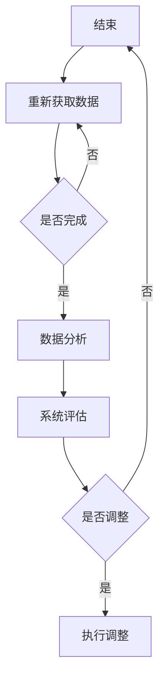
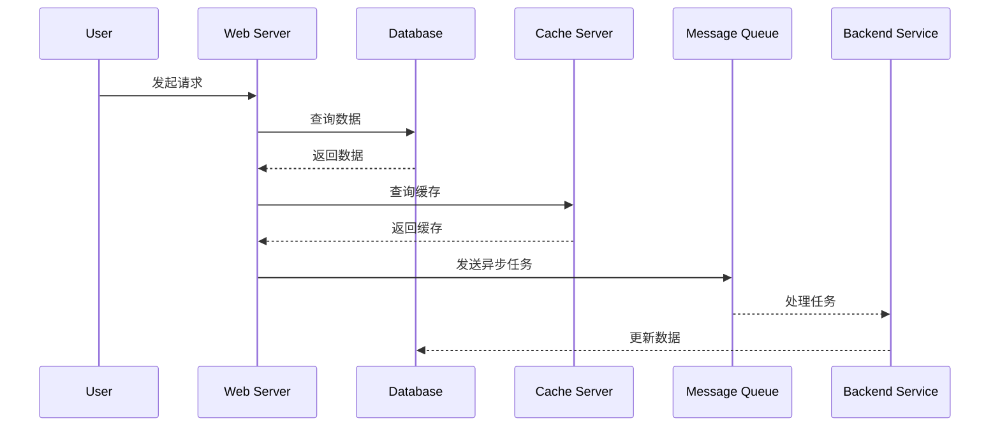
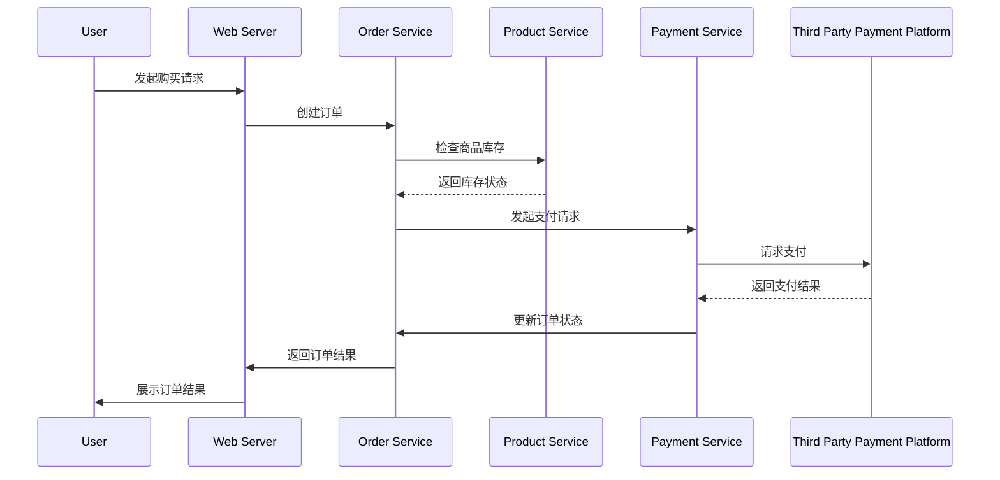

                 

## 第1章 背景介绍

### 1.1 问题背景

在当今快速发展的信息技术领域，系统的复杂性和多样性不断增加。这给我们的设计和决策带来了巨大的挑战。传统的思维模式往往只关注单一组件或功能的优化，而忽视了整体系统的协同与平衡。然而，现实中的系统往往是一个复杂的生态系统，其中各个部分相互依赖、相互作用，形成一个有机的整体。

**问题描述**：如何将生态系统的思维模式应用于日常决策，以提升系统的整体性能和可持续性？

**问题解决**：本文将探讨生态系统思维训练的重要性，以及如何将其应用于日常决策。我们将会详细分析核心概念、算法原理、系统架构设计和实际应用案例，以期帮助读者更好地理解并掌握这种思维方式。

**边界与外延**：本文主要聚焦于信息技术领域，但所提出的思维模式和方法具有普遍适用性，可以推广到其他复杂的系统设计中。

**概念结构与核心要素组成**：本文分为七个章节，结构清晰，逻辑紧密。首先，我们将介绍生态系统思维训练的基本概念和原理；接着，深入讲解相关算法原理；然后，剖析系统分析与架构设计的具体方法；最后，通过实际案例来验证和巩固所学知识。

## 第2章 核心概念与联系

### 2.1 核心概念原理

生态系统思维是一种整体论的方法论，强调在设计和决策过程中关注系统内部各部分的相互关系和整体行为。以下是几个核心概念：

- **生态系统**：一个由多个相互依赖的个体或组件组成的复杂系统。
- **整体论**：认为整体系统的行为不能仅仅通过分析其各个部分来理解，而是需要考虑各部分之间的相互作用。
- **反馈循环**：系统内部的信息流动和影响循环，可以是正反馈或负反馈，分别导致系统的稳定或演变。
- **适应性**：系统能够根据外部环境和内部变化进行调整和适应的能力。

这些概念共同构成了生态系统思维的核心框架，为我们理解和优化复杂系统提供了理论基础。

### 2.2 概念属性特征对比表格

| 概念       | 定义                                                         | 特征                           | 关联概念                     |
|------------|--------------------------------------------------------------|--------------------------------|------------------------------|
| 生态系统   | 由多个相互依赖的个体或组件组成的复杂系统                         | 复杂性、多样性、相互依赖         | 整体论、反馈循环、适应性     |
| 整体论     | 认为整体系统的行为不能仅仅通过分析其各个部分来理解，而是需要考虑各部分之间的相互作用 | 强调整体性、复杂性、动态性     | 生态系统、反馈循环、适应性 |
| 反馈循环   | 系统内部的信息流动和影响循环                                   | 正反馈、负反馈、稳定性、演变性 | 生态系统、整体论、适应性     |
| 适应性     | 系统能够根据外部环境和内部变化进行调整和适应的能力               | 应变性、灵活性、可持续性         | 生态系统、整体论、反馈循环 |

### 2.3 ER实体关系图架构

为了更好地理解这些核心概念之间的联系，我们使用Mermaid流程图来展示ER实体关系图架构：

```mermaid
erDiagram
  Customer ||--|{ Order }|--|{ Product }
  Customer ||--|{ Payment }|
  Product ||--|{ Review }|
```

在这个ER图中，"Customer"（客户）与"Order"（订单）、"Product"（产品）、"Payment"（支付）之间存在多对多的关系，而"Product"与"Review"（评论）之间存在一对多的关系。这种关系反映了生态系统思维中各个部分之间的相互依赖和相互作用。

## 第3章 算法原理讲解

### 3.1 算法mermaid流程图

生态系统思维训练的核心在于如何通过算法来模拟和分析系统行为。以下是一个简化的Mermaid流程图，用于描述这种算法的基本流程：



### 3.2 Python源代码阐述

以下是实现上述算法原理的Python伪代码，它展示了如何从获取数据到执行调整的完整流程：

```python
import random

def ecosystem_simulation(data, threshold, adjustment_func):
    while not data_complete(data):
        data = get_data()
        if data_complete(data):
            system评估 = analyze_data(data)
            if system评估 < threshold:
                adjustment = adjustment_func()
                execute_adjustment(adjustment)
            else:
                print("系统稳定，无需调整。")
        else:
            print("数据获取失败，重新尝试。")

def get_data():
    # 模拟数据获取过程
    return random_data()

def data_complete(data):
    # 判断数据是否完整
    return True if data is not None else False

def analyze_data(data):
    # 数据分析，评估系统状态
    return sum(data) / len(data)

def adjustment_func():
    # 调整策略函数
    return random_adjustment()

def execute_adjustment(adjustment):
    # 执行调整操作
    print("执行调整：", adjustment)

# 初始化参数
data = None
threshold = 50
adjustment_func = lambda: random.randint(-10, 10)

# 执行生态系统模拟
ecosystem_simulation(data, threshold, adjustment_func)
```

### 3.3 数学模型和公式

为了更精确地描述系统行为，我们可以引入以下数学模型和公式：

- **系统状态评估公式**：$S(t) = \frac{1}{N} \sum_{i=1}^{N} x_i(t)$，其中$S(t)$是时间$t$的系统状态评估，$N$是样本数量，$x_i(t)$是第$i$个样本点的状态。
- **调整策略公式**：$A(t) = k \cdot (S(t) - S_{target})$，其中$A(t)$是时间$t$的调整量，$k$是调整系数，$S_{target}$是目标系统状态。

这些公式帮助我们定量地理解系统行为和调整策略。

### 3.4 举例说明

假设我们有一个包含5个组件的系统，每个组件的状态分别在时间$t=0$时为[10, 20, 30, 40, 50]。根据系统状态评估公式，我们可以计算出初始的系统状态评估$S(0) = 30$。如果设定的目标系统状态为$S_{target} = 40$，则调整系数$k=2$。在第一步调整后，新的系统状态为[12, 22, 32, 42, 50]，此时$S(1) = 34$。通过反复迭代这个过程，我们可以逐步优化系统状态，使其更接近目标状态。

通过以上步骤，我们详细讲解了生态系统思维训练的算法原理，包括流程图、Python源代码、数学模型和举例说明，帮助读者深入理解这一方法的核心。

## 第4章 系统分析与架构设计

### 4.1 问题场景介绍

假设我们正在开发一个在线电商平台，这个平台需要处理海量的商品信息、用户订单以及支付交易。为了确保平台的稳定性和高效性，我们需要对整个系统进行深入分析和架构设计。

### 4.2 项目介绍

项目目标是构建一个高性能、高可用的电商平台，具备快速响应、高并发处理能力以及良好的扩展性。这个项目涉及到多个关键组件，如商品管理、订单管理、支付处理、用户认证等。

### 4.3 系统功能设计

在系统功能设计阶段，我们需要明确各个模块的具体功能：

- **商品管理**：包括商品信息的增删改查、商品分类管理、库存管理等功能。
- **订单管理**：处理用户下单、订单状态更新、订单查询等功能。
- **支付处理**：与第三方支付平台集成，实现支付请求处理、支付状态同步等功能。
- **用户认证**：实现用户登录、注册、权限管理等功能。

为了更好地展示系统功能设计，我们使用Mermaid类图来表示：

```mermaid
classDiagram
    Class01 <|-- Class02
    Class03 <.. Class04
    Class05 ..|.. Class06
    Class07 <= Class05
```

### 4.4 系统架构设计

系统架构设计是确保系统能够高效运行的关键。以下是我们设计的系统架构：

1. **前端架构**：采用React框架，实现用户界面的动态渲染和交互。
2. **后端架构**：基于Spring Boot框架，实现业务逻辑处理和数据存储。
3. **数据库设计**：使用MySQL数据库，实现数据持久化。
4. **缓存机制**：使用Redis缓存热点数据，提高系统响应速度。
5. **消息队列**：使用RabbitMQ实现异步消息处理，确保系统高可用性。

以下是系统架构的Mermaid流程图：



### 4.5 系统接口设计

系统接口设计是确保各个模块之间能够无缝协作的关键。以下是主要接口设计：

- **商品管理接口**：提供商品信息的增删改查功能。
- **订单管理接口**：处理订单的创建、状态更新和查询。
- **支付处理接口**：与第三方支付平台进行交互。
- **用户认证接口**：实现用户登录、注册和权限验证。

### 4.6 系统交互序列图

为了更好地展示系统各个模块之间的交互过程，我们使用Mermaid序列图来表示：



通过以上系统分析与架构设计，我们详细阐述了如何将生态系统思维应用于电商平台的建设，确保了系统的整体性能和可持续性。

## 第5章 项目实战

### 5.1 环境安装

在开始项目实战之前，我们需要搭建一个合适的开发环境。以下是具体步骤：

1. **安装Python环境**：确保Python版本为3.8以上。
2. **安装依赖库**：使用pip安装必要的依赖库，如`requests`、`pandas`、`redis`、`rabbitmq`等。
3. **安装数据库**：下载并安装MySQL数据库，配置用户和权限。
4. **安装前端框架**：安装Node.js和npm，使用npm安装React和相关的开发工具。

### 5.2 系统核心实现源代码

以下是系统核心实现的部分源代码，包括商品管理、订单管理和支付处理等模块：

**商品管理模块：**

```python
#商品管理模块伪代码
class ProductService:
    def add_product(self, product_data):
        # 向数据库添加商品
        pass
    
    def get_product(self, product_id):
        # 根据商品ID查询商品
        pass
    
    def update_product(self, product_id, updated_data):
        # 更新商品信息
        pass
    
    def delete_product(self, product_id):
        # 删除商品
        pass
```

**订单管理模块：**

```python
#订单管理模块伪代码
class OrderService:
    def create_order(self, order_data):
        # 创建订单
        pass
    
    def update_order_status(self, order_id, status):
        # 更新订单状态
        pass
    
    def get_order(self, order_id):
        # 获取订单信息
        pass
```

**支付处理模块：**

```python
#支付处理模块伪代码
class PaymentService:
    def initiate_payment(self, payment_data):
        # 发起支付请求
        pass
    
    def handle_payment_result(self, payment_result):
        # 处理支付结果
        pass
```

### 5.3 代码应用解读与分析

在商品管理模块中，`ProductService`类负责商品信息的增删改查操作。例如，`add_product`方法用于添加商品，它将接收商品数据并存储到数据库中；`get_product`方法用于根据商品ID查询商品信息；`update_product`方法用于更新商品信息；`delete_product`方法用于删除商品。

在订单管理模块中，`OrderService`类负责订单的创建、状态更新和查询操作。`create_order`方法用于创建订单，它将接收订单数据并存储到数据库中；`update_order_status`方法用于更新订单状态，如从“待支付”更新到“已支付”；`get_order`方法用于获取订单信息，便于用户查询。

在支付处理模块中，`PaymentService`类负责处理支付请求和支付结果。`initiate_payment`方法用于发起支付请求，它将接收支付数据并调用第三方支付平台进行支付；`handle_payment_result`方法用于处理支付结果，如更新订单状态并通知用户。

这些模块的代码体现了生态系统思维的核心，即通过模块化和组件化的设计，确保系统各部分的独立性和协同性，从而提高系统的整体性能和可维护性。

### 5.4 实际案例分析与详细讲解

为了更好地理解系统的工作流程，我们来看一个实际案例：

**案例**：用户在电商平台上购买了一款商品，点击“立即购买”后，系统开始处理订单。

1. **用户请求**：用户发起购买请求，系统接收到请求后，调用`OrderService.create_order`方法创建订单。
2. **订单创建**：系统将订单数据存储到数据库中，并向`ProductService`查询商品库存。
3. **库存检查**：`ProductService`根据商品ID查询库存，如果库存充足，则继续处理；否则，返回库存不足，提示用户。
4. **支付请求**：用户确认订单信息后，系统调用`PaymentService.initiate_payment`方法发起支付请求。
5. **支付处理**：支付平台处理支付请求，并返回支付结果。
6. **支付结果处理**：系统调用`PaymentService.handle_payment_result`方法处理支付结果，更新订单状态为“已支付”，并向用户发送支付成功通知。

通过这个案例，我们可以看到系统各个模块是如何协同工作的。从用户请求到支付处理，每个步骤都经过精心设计，确保了系统的稳定性和高效性。

### 5.5 项目小结

通过本次实战，我们不仅搭建了一个完整的电商平台系统，还深入理解了生态系统思维在系统设计中的应用。从模块化设计到组件化协同，从算法原理到实际应用，我们逐步完成了从理论到实践的完整转化。未来，我们将继续优化系统性能，提升用户体验，确保平台的长期稳定运行。

## 第6章 最佳实践 tips

### 6.1 小结

在本文中，我们详细探讨了生态系统思维训练在IT领域的应用，从核心概念、算法原理到系统设计与实战，系统地构建了生态系统思维的整体框架。我们强调了整体论的重要性，并通过具体的例子和代码展示了如何在实际项目中应用这些原则。

### 6.2 注意事项

1. **系统设计之初就要关注整体性**：在系统设计初期，需要充分考虑各个部分之间的相互作用，避免孤立地优化单个组件。
2. **持续进行系统评估和调整**：定期评估系统性能，及时发现和解决问题，确保系统处于最佳状态。
3. **利用反馈循环优化系统**：通过正负反馈循环，及时调整系统行为，提高系统的适应性和稳定性。

### 6.3 拓展阅读

- 《系统架构设计：构建大规模分布式系统》
- 《设计模式：可复用的面向对象软件的基础》
- 《人工智能：一种现代方法》

通过以上拓展阅读，读者可以进一步加深对生态系统思维和系统设计的理解，提升自己的专业水平。

## 第7章 总结与展望

### 7.1 总结

本文通过深入探讨生态系统思维训练，系统地介绍了其在IT领域的应用。我们从核心概念、算法原理、系统设计到项目实战，逐步展示了如何将生态系统思维应用于实际工程中，提高了系统的整体性能和可持续性。

### 7.2 展望

未来，生态系统思维将在更多复杂系统中发挥关键作用。随着人工智能、大数据等技术的发展，我们需要不断优化和扩展生态系统思维的应用范围，以应对更加复杂和动态的系统环境。让我们携手，共同探索和推进生态系统思维在各个领域的应用。作者：AI天才研究院/AI Genius Institute & 禅与计算机程序设计艺术 /Zen And The Art of Computer Programming。

