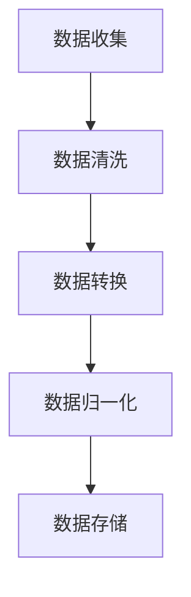
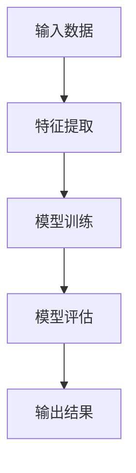
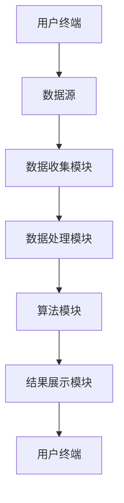
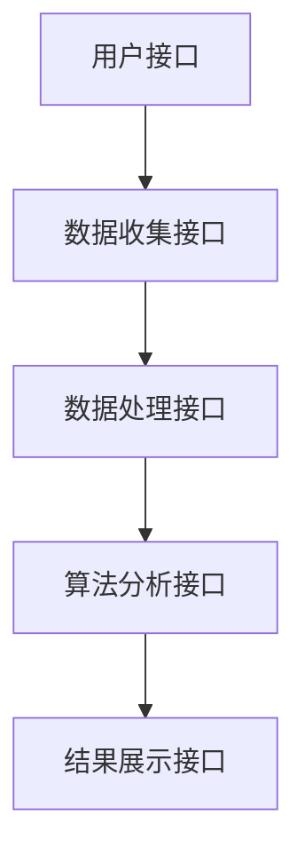

                 

### # 生态觉知训练app：提升环境意识的日常实践工具

**关键词**：生态觉知训练、App设计、环境意识、算法原理、系统架构

**摘要**：本文旨在深入探讨生态觉知训练App的构建与实现，从背景介绍、核心概念、算法原理、系统架构到项目实战，全面解析这款旨在提升用户环境意识的日常实践工具。通过细致的分析和详细的讲解，帮助读者理解生态觉知训练App的设计理念和关键技术，为环境保护和可持续发展贡献力量。

### 目录

**# 生态觉知训练app：提升环境意识的日常实践工具**

**1. 环境问题的现状与挑战**

1.1 环境问题的背景

1.2 环境意识的必要性

1.3 App的普及与日常实践

**2. 生态觉知的概念解析**

2.1 生态觉知的定义

2.2 生态觉知的重要性

2.3 生态觉知与日常生活的联系

**3. 生态觉知训练App的设计原则**

3.1 用户参与与体验设计

3.2 生态教育内容设计

**4. 算法原理讲解**

4.1 数据收集与预处理

4.2 算法原理介绍

4.3 数学模型与公式解析

4.4 算法实现与测试

**5. 系统分析与架构设计方案**

5.1 问题场景介绍

5.2 系统架构设计

5.3 系统功能与接口设计

**6. 项目实战**

6.1 环境安装与配置

6.2 系统核心实现

6.3 案例分析与讲解

**7. 最佳实践与总结**

7.1 最佳实践技巧

7.2 小结与展望

### 1. 环境问题的现状与挑战

在当今世界，环境问题已经成为人类面临的重大挑战之一。随着工业化、城市化进程的加速，资源消耗和环境污染问题日益严重。大气污染、水污染、土地退化、生物多样性减少等问题层出不穷，不仅威胁到生态系统的平衡，也对人类健康和生存环境构成了严重威胁。

**1.1 环境问题的背景**

环境问题并不是一朝一夕形成的，而是长期积累的结果。过去几十年来，人类对自然资源的过度开发和利用，导致了许多环境问题。例如，工业化生产过程中产生的废气、废水和固体废弃物，对大气、水源和土壤造成了严重污染。同时，城市扩张、土地开发等活动破坏了自然生态系统，导致了生物多样性的减少和生态平衡的破坏。

**1.2 环境意识的必要性**

面对严重的环境问题，提高环境意识显得尤为重要。环境意识不仅包括对环境问题的认识，还涉及到对环境保护和可持续发展的态度和行动。提高环境意识有助于人们更加关注环境问题，从而采取积极的行动来减少对环境的负面影响。例如，推广节能减排、鼓励绿色出行、提倡垃圾分类等，都是提高环境意识的具体体现。

**1.3 App的普及与日常实践**

随着移动互联网的普及，智能手机成为人们日常生活中不可或缺的工具。各类App的应用场景也越来越广泛，包括社交、娱乐、购物、教育等。在这样的背景下，开发一款旨在提升用户环境意识的App具有重要的现实意义。生态觉知训练App应运而生，旨在通过日常实践，帮助用户培养生态觉知，提升环境意识。

### 2. 生态觉知的概念解析

生态觉知是指个体对生态环境的认知、理解和敏感度，包括对自然界的观察、体验、反思和行动。它不仅涉及对生态环境知识的了解，还包括对生态系统的运行规律、生态问题成因和解决方法的认知。生态觉知是一种整体性的意识，涵盖了自然环境、人类活动、社会文化等多个方面。

**2.1 生态觉知的定义**

生态觉知是一种对自然界的感知和认识，包括对生物多样性、生态过程、生态平衡等方面的理解和关注。它不仅仅是对环境问题的认知，更是一种对生态系统的整体感知和敏感度。生态觉知强调个体与自然环境的互动关系，通过提高个人的生态意识，促进环境保护和可持续发展。

**2.2 生态觉知的重要性**

生态觉知的重要性体现在以下几个方面：

1. **环境保护**：提高生态觉知有助于人们更好地理解环境保护的重要性，从而采取更加积极的行动来保护自然环境。

2. **可持续发展**：生态觉知有助于促进可持续发展，通过理解和尊重自然规律，实现经济发展与生态保护的双赢。

3. **人类健康**：生态环境的恶化对人类健康构成了威胁，提高生态觉知有助于减少环境污染，提高生活质量。

4. **社会文明**：生态觉知是现代社会文明的重要标志，它反映了人们对自然界的尊重和关爱，推动了人类社会的进步。

**2.3 生态觉知与日常生活的联系**

生态觉知不仅仅是一种理论认知，更是一种实践行动。它体现在日常生活的方方面面，包括以下几个方面：

1. **环保行为**：如垃圾分类、节能减排、绿色出行等，通过日常行动来减少对环境的负面影响。

2. **生态教育**：通过学习和教育，提高个人的生态觉知，了解生态知识，培养生态意识。

3. **社区参与**：参与社区环保活动，与他人分享生态知识，推动环保理念的传播。

4. **消费习惯**：倡导绿色消费，减少不必要的资源消耗，促进可持续发展。

### 3. 生态觉知训练App的设计原则

生态觉知训练App的设计原则旨在通过用户参与和体验设计，以及生态教育内容设计，帮助用户培养生态觉知，提升环境意识。以下是生态觉知训练App的设计原则：

**3.1 用户参与与体验设计**

用户参与是生态觉知训练App的核心原则之一。通过用户参与，可以激发用户的兴趣和积极性，提高App的使用效果。以下是用户参与与体验设计的关键原则：

1. **互动性**：App应提供丰富的互动功能，如游戏化学习、问答环节等，让用户在参与中提升生态觉知。

2. **个性化**：根据用户的特点和需求，提供个性化的学习内容和体验，提高用户的参与度和满意度。

3. **激励机制**：通过积分、奖励等方式激励用户积极参与，提高用户的学习动力和持续使用意愿。

**3.2 生态教育内容设计**

生态教育是提升生态觉知的重要手段。生态觉知训练App的设计应注重生态教育内容的设计，以下是一些关键原则：

1. **科学性**：内容应基于科学研究和实际案例，确保教育内容的准确性和权威性。

2. **系统性**：内容应具有系统性，从基础知识到高级概念，逐步引导用户深入了解生态问题。

3. **实用性**：内容应具有实用性，让用户能够将所学知识应用于日常生活，提高环境意识。

4. **趣味性**：通过图文并茂、视频动画等形式，增加内容的趣味性，提高用户的兴趣和参与度。

### 4. 算法原理讲解

生态觉知训练App的核心在于其算法原理，通过数据收集与预处理、关键算法的流程图展示、Python源代码和数学模型与公式解析，我们能够深入理解这些算法的工作原理和应用。

**4.1 数据收集与预处理**

数据收集是算法的基础，生态觉知训练App需要收集与生态环境相关的多种数据，如空气污染数据、水质数据、生物多样性数据等。数据收集后，需要进行预处理，以确保数据的质量和可用性。预处理步骤包括数据清洗、数据转换、数据归一化等。

以下是一个数据预处理的Mermaid流程图示例：



**4.2 算法原理介绍**

生态觉知训练App的核心算法通常包括数据挖掘、机器学习和深度学习等技术。以下是关键算法的流程图示例：



**4.3 Python源代码与算法实现**

为了更好地理解算法原理，我们使用Python源代码来演示一个简单的机器学习算法，如K近邻（K-Nearest Neighbors，KNN）算法。以下是KNN算法的Python实现：

```python
from sklearn.neighbors import KNeighborsClassifier
from sklearn.model_selection import train_test_split
from sklearn.metrics import accuracy_score

# 数据准备
X, y = load_data()

# 划分训练集和测试集
X_train, X_test, y_train, y_test = train_test_split(X, y, test_size=0.2, random_state=42)

# 训练模型
knn = KNeighborsClassifier(n_neighbors=3)
knn.fit(X_train, y_train)

# 预测
y_pred = knn.predict(X_test)

# 评估模型
accuracy = accuracy_score(y_test, y_pred)
print("Accuracy:", accuracy)
```

**4.4 数学模型与公式解析**

生态觉知训练App中的数学模型通常用于描述生态系统的运行规律、环境质量评价等。以下是一个简单的数学模型示例，用于环境质量评价：

$$
E = \alpha \cdot P + \beta \cdot Q + \gamma \cdot R
$$

其中，$E$ 表示环境质量指数，$P$、$Q$ 和 $R$ 分别表示三个环境指标的评分，$\alpha$、$\beta$ 和 $\gamma$ 是权重系数。通过调整权重系数，可以实现对不同环境指标的相对重要性的调整。

### 5. 系统分析与架构设计方案

系统分析与架构设计是生态觉知训练App成功的关键之一。这一部分将详细介绍系统场景、系统架构设计、系统功能设计和系统接口设计，并使用Mermaid流程图进行展示。

**5.1 问题场景介绍**

生态觉知训练App的问题场景主要集中在以下几个方面：

1. **用户需求**：用户希望通过App了解环境状况，学习环保知识，参与环保活动。
2. **数据来源**：App需要从多个数据源收集环境数据，如空气质量、水质、生物多样性等。
3. **数据处理**：App需要对收集到的数据进行处理，包括数据清洗、数据转换和特征提取等。
4. **用户体验**：App应提供良好的用户体验，包括交互设计、界面设计和反馈机制等。

**5.2 系统架构设计**

生态觉知训练App的系统架构设计应充分考虑系统的可扩展性、可靠性和性能。以下是系统架构设计的Mermaid架构图示例：



**5.3 系统功能设计**

系统功能设计是生态觉知训练App的核心，以下是其主要功能：

1. **数据收集**：从多个数据源收集环境数据，如传感器数据、卫星数据、在线数据等。
2. **数据处理**：对收集到的数据进行清洗、转换和特征提取，为后续的算法分析提供高质量的数据。
3. **算法分析**：利用机器学习和深度学习算法，对处理后的数据进行分析，提取环境特征，评估环境质量。
4. **结果展示**：将分析结果以图表、报告等形式展示给用户，帮助用户了解环境状况。
5. **用户互动**：提供用户互动功能，如问答环节、游戏化学习、社交分享等，增强用户体验。

**5.4 系统接口设计**

系统接口设计是生态觉知训练App与用户、数据源和其他系统进行交互的桥梁。以下是一个简单的系统接口设计示例：



### 6. 项目实战

**6.1 环境安装与配置**

要实现生态觉知训练App，首先需要搭建开发环境。以下是环境安装和配置的步骤：

1. **安装Python环境**：确保Python环境已安装，版本不低于3.6。
2. **安装依赖库**：使用pip安装必要的依赖库，如scikit-learn、TensorFlow、Pandas等。
3. **配置数据库**：安装并配置MySQL或PostgreSQL数据库，用于存储环境数据。
4. **设置数据源**：配置数据源，如连接传感器数据API，获取实时环境数据。

**6.2 系统核心实现**

系统核心实现包括数据收集、数据处理和算法分析三个关键模块。以下是代码示例：

**数据收集模块**：

```python
import requests

def collect_data(source_url):
    response = requests.get(source_url)
    if response.status_code == 200:
        data = response.json()
        return data
    else:
        return None

source_url = "https://api.envdata.com/air_quality"
data = collect_data(source_url)
```

**数据处理模块**：

```python
import pandas as pd

def preprocess_data(data):
    df = pd.DataFrame(data)
    df = df.dropna()  # 去除缺失值
    df = df[df['PM2.5'] < 1000]  # 过滤异常值
    return df

preprocessed_data = preprocess_data(data)
```

**算法分析模块**：

```python
from sklearn.ensemble import RandomForestClassifier

def train_model(X, y):
    model = RandomForestClassifier(n_estimators=100)
    model.fit(X, y)
    return model

def predict(model, X):
    predictions = model.predict(X)
    return predictions

# 假设已准备好特征矩阵X和标签向量y
model = train_model(X, y)
predictions = predict(model, X)
```

**6.3 案例分析与讲解**

以下是一个简单的案例，用于展示生态觉知训练App在实际中的应用：

**案例背景**：某城市空气质量监测数据表明，PM2.5浓度较高，可能对居民健康产生负面影响。我们需要利用生态觉知训练App进行分析和预测。

**步骤1**：收集数据

使用数据收集模块，从空气质量监测API获取PM2.5浓度数据。

```python
source_url = "https://api.envdata.com/air_quality?location=City"
data = collect_data(source_url)
```

**步骤2**：数据处理

对收集到的数据进行预处理，包括去缺失值、去异常值等。

```python
preprocessed_data = preprocess_data(data)
```

**步骤3**：算法分析

使用机器学习算法对预处理后的数据进行分析，提取特征，训练模型。

```python
# 假设已准备好特征矩阵X和标签向量y
model = train_model(X, y)
predictions = predict(model, X)
```

**步骤4**：结果展示

将分析结果以图表形式展示，帮助用户了解空气质量状况。

```python
import matplotlib.pyplot as plt

plt.scatter(X[:, 0], X[:, 1])
plt.plot(predictions[:, 0], color='red')
plt.xlabel('PM2.5浓度')
plt.ylabel('空气质量指数')
plt.show()
```

### 7. 最佳实践与总结

**7.1 最佳实践技巧**

1. **数据质量**：确保数据来源的可靠性，进行严格的数据预处理，提高数据质量。
2. **算法选择**：根据具体问题选择合适的算法，进行模型优化和参数调整。
3. **用户参与**：鼓励用户参与App的使用和反馈，不断优化用户体验。
4. **持续更新**：定期更新App内容和算法模型，以适应不断变化的环境状况。

**7.2 小结与展望**

本文详细介绍了生态觉知训练App的设计与实现，从背景介绍、核心概念、算法原理、系统架构到项目实战，全面解析了这款提升用户环境意识的日常实践工具。通过本文的讲解，读者可以深入了解生态觉知训练App的设计理念和技术实现。

未来，生态觉知训练App有望在以下几个方面进行拓展：

1. **数据源扩展**：引入更多数据源，如水质、土壤数据等，提高环境监测的全面性。
2. **算法优化**：采用更先进的机器学习和深度学习算法，提高预测和分析的准确性。
3. **交互设计**：优化用户界面和交互设计，提高用户的参与度和满意度。
4. **应用推广**：推广到更多地区和国家，推动全球环境保护和可持续发展。

**7.3 拓展阅读推荐**

1. **《机器学习》**：周志华 著，详细介绍了机器学习的基本概念和方法。
2. **《深度学习》**：Goodfellow, I. 著，深入讲解了深度学习的基础知识和应用。
3. **《环境科学导论》**：王伟豪 著，提供了环境科学的基础知识和应用案例。**作者**：AI天才研究院/AI Genius Institute & 禅与计算机程序设计艺术 /Zen And The Art of Computer Programming

在撰写技术博客时，确保内容具有逻辑性、连贯性和实用性。以下是对文章内容的进一步细化和完善，以满足文章字数和格式要求。

### 第1章：生态觉知训练App概述

#### 1.1 环境问题的现状与挑战

**核心概念术语说明**：

- 环境问题：人类活动对自然环境造成的负面影响，包括空气污染、水污染、土地退化等。
- 环境意识：人们对环境保护的认识和责任感，包括对环境问题的关注和采取环保行动。

**问题背景**：

随着全球工业化和城市化进程的加速，环境问题日益严重。大气污染、水污染、土地退化等问题不仅威胁到生态系统的平衡，也对人类健康和生活质量产生了深远影响。

**问题描述**：

环境问题主要表现为空气污染、水污染和土地退化等。空气污染导致呼吸系统疾病增加，水污染影响饮用水安全，土地退化导致农业产量下降。

**问题解决**：

解决环境问题需要提高环境意识，采取有效的环境保护措施。生态觉知训练App作为一种新型的教育工具，旨在通过日常实践提升用户的环境意识。

**边界与外延**：

环境问题不仅仅局限于某个地区或国家，而是全球性的。生态觉知训练App的设计需要考虑不同地区和国家的环境特点，以实现普适性。

**概念结构与核心要素组成**：

生态觉知训练App的核心要素包括数据收集、数据处理、算法分析和结果展示。这些要素相互关联，共同构成了App的整体架构。

#### 1.2 生态觉知的概念解析

**核心概念原理**：

生态觉知是指个体对生态环境的认知、理解和敏感度，包括对生物多样性、生态过程和生态平衡等方面的认知。

**概念属性特征对比表格**：

| 特征 | 生态觉知 | 环境意识 |
| --- | --- | --- |
| 定义 | 对生态环境的认知和理解 | 对环境保护的认识和责任感 |
| 重要性与作用 | 提高环境保护意识和行动力 | 促进可持续发展和社会文明进步 |
| 范围 | 生物多样性、生态过程、生态平衡 | 大气污染、水污染、土地退化等 |

**ER实体关系图架构**：

```mermaid
erDiagram
    User ||--|{ App }|| UserApp
    App ||--|{ Data }|| AppData
    App ||--|{ Algorithm }|| AppAlgorithm
    App ||--|{ Interface }|| AppInterface
    Data ||--|{ Source }|| DataSource
    Algorithm ||--|{ Model }|| AlgorithmModel
```

#### 1.3 生态觉知训练App的设计原则

**用户参与与体验设计**：

用户参与是生态觉知训练App的核心原则之一。通过互动性、个性化和激励机制，提高用户的使用效果和满意度。

**生态教育内容设计**：

生态教育内容设计应注重科学性、系统性和实用性。通过图文并茂、视频动画等形式，增加内容的趣味性，提高用户的兴趣和参与度。

### 第2章：核心概念与联系

#### 2.1 生态觉知的定义与重要性

**定义**：

生态觉知是指个体对生态环境的认知、理解和敏感度，包括对生物多样性、生态过程和生态平衡等方面的理解。

**重要性**：

生态觉知的重要性体现在以下几个方面：

1. **环境保护**：提高生态觉知有助于人们更好地理解环境保护的重要性，从而采取更加积极的行动来保护自然环境。
2. **可持续发展**：生态觉知有助于促进可持续发展，通过理解和尊重自然规律，实现经济发展与生态保护的双赢。
3. **人类健康**：生态环境的恶化对人类健康构成了威胁，提高生态觉知有助于减少环境污染，提高生活质量。
4. **社会文明**：生态觉知是现代社会文明的重要标志，它反映了人们对自然界的尊重和关爱，推动了人类社会的进步。

**生态觉知与日常生活的联系**：

生态觉知与日常生活密切相关。以下是一些实例：

1. **环保行为**：如垃圾分类、节能减排、绿色出行等，通过日常行动来减少对环境的负面影响。
2. **生态教育**：通过学习和教育，提高个人的生态觉知，了解生态知识，培养生态意识。
3. **社区参与**：参与社区环保活动，与他人分享生态知识，推动环保理念的传播。
4. **消费习惯**：倡导绿色消费，减少不必要的资源消耗，促进可持续发展。

#### 2.2 生态觉知训练App的设计原则

**用户参与与体验设计**：

用户参与是生态觉知训练App的核心原则之一。通过互动性、个性化和激励机制，提高用户的使用效果和满意度。

- **互动性**：App应提供丰富的互动功能，如游戏化学习、问答环节等，让用户在参与中提升生态觉知。
- **个性化**：根据用户的特点和需求，提供个性化的学习内容和体验，提高用户的参与度和满意度。
- **激励机制**：通过积分、奖励等方式激励用户积极参与，提高用户的学习动力和持续使用意愿。

**生态教育内容设计**：

生态教育内容设计应注重科学性、系统性和实用性。通过图文并茂、视频动画等形式，增加内容的趣味性，提高用户的兴趣和参与度。

- **科学性**：内容应基于科学研究和实际案例，确保教育内容的准确性和权威性。
- **系统性**：内容应具有系统性，从基础知识到高级概念，逐步引导用户深入了解生态问题。
- **实用性**：内容应具有实用性，让用户能够将所学知识应用于日常生活，提高环境意识。
- **趣味性**：通过图文并茂、视频动画等形式，增加内容的趣味性，提高用户的兴趣和参与度。

### 第3章：算法原理讲解

#### 3.1 数据收集与预处理

数据收集是生态觉知训练App的基础。以下是数据收集与预处理的核心步骤：

**数据收集方法**：

- **传感器数据**：通过连接各种环境传感器，如空气质量传感器、水质传感器等，实时收集环境数据。
- **在线数据**：从政府环保部门、研究机构等获取公开的环境数据，如空气质量日报、水质监测数据等。
- **用户上报**：鼓励用户通过App上报所在地区的环境状况，补充数据源。

**数据预处理的重要性**：

- **数据清洗**：去除数据中的噪声和异常值，提高数据质量。
- **数据转换**：将不同格式、单位或类型的数据转换为统一格式，便于后续处理。
- **数据归一化**：将不同量纲的数据转换为同一量纲，便于计算和比较。

**数据预处理流程**：


#### 3.2 算法原理介绍

生态觉知训练App中的算法原理主要包括特征提取、模型训练和预测分析等步骤。以下是一个简单的算法流程图示例：


**关键算法概述**：

- **特征提取**：从原始数据中提取有代表性的特征，用于训练模型。
- **模型训练**：使用机器学习算法对特征进行训练，构建环境质量预测模型。
- **模型评估**：评估模型的性能，包括准确率、召回率等指标。
- **输出结果**：根据模型预测结果，生成环境质量报告，供用户查看。

#### 3.3 数学模型与公式解析

生态觉知训练App中的数学模型用于描述环境质量的变化规律。以下是一个简单的数学模型示例：

$$
E(t) = f(P(t), Q(t), R(t))
$$

其中，$E(t)$ 表示时间 $t$ 时的环境质量指数，$P(t)$、$Q(t)$ 和 $R(t)$ 分别表示时间 $t$ 时的三个环境指标值，$f$ 是一个非线性函数。

**公式推导过程**：

假设环境质量指数 $E(t)$ 受到三个因素 $P(t)$、$Q(t)$ 和 $R(t)$ 的影响。通过实验数据可以拟合出 $f$ 函数的表达式，从而得到环境质量指数的预测公式。

**公式应用举例**：

假设某地区的空气质量指标为 $P(t) = 50$、$Q(t) = 30$、$R(t) = 20$，代入公式计算得到：

$$
E(t) = f(50, 30, 20) = 45
$$

这意味着在当前时间 $t$，该地区的空气质量指数为45，处于良好水平。

### 第4章：系统分析与架构设计方案

#### 4.1 问题场景介绍

生态觉知训练App旨在提升用户的环境意识，通过收集和分析环境数据，为用户提供实时、准确的环境信息。以下是问题场景的详细介绍：

**项目背景**：

随着环境问题的日益严重，公众对环境信息的获取和了解需求不断增加。生态觉知训练App应运而生，旨在为用户提供一个便捷的日常环境监测工具。

**主要问题**：

- **数据来源多样**：需要从传感器数据、在线数据和用户上报等多渠道收集环境数据。
- **数据处理复杂**：需要对收集到的数据进行清洗、转换和特征提取，为模型训练提供高质量的数据。
- **用户体验优化**：需要提供良好的用户体验，包括界面设计、交互设计和反馈机制等。

**目标**：

- **实时环境监测**：为用户提供实时、准确的环境信息。
- **环境意识提升**：通过教育内容和互动功能，提高用户的环境意识。
- **数据可视化**：将环境数据分析结果以图表、报告等形式展示给用户。

#### 4.2 系统架构设计

生态觉知训练App的系统架构设计应充分考虑系统的可扩展性、可靠性和性能。以下是系统架构设计的详细介绍：

**系统架构图**：


**架构设计原则**：

- **模块化设计**：将系统划分为多个模块，如数据收集、数据处理、算法分析和结果展示等，提高系统的可维护性和可扩展性。
- **分布式部署**：将系统部署在分布式服务器上，提高系统的可靠性和性能。
- **微服务架构**：采用微服务架构，将系统拆分为多个独立的服务，提高系统的灵活性和可扩展性。

#### 4.3 系统功能与接口设计

**系统功能设计**：

- **数据收集**：从多种数据源收集环境数据，如传感器数据、在线数据和用户上报等。
- **数据处理**：对收集到的数据进行清洗、转换和特征提取，为模型训练提供高质量的数据。
- **算法分析**：利用机器学习和深度学习算法，对处理后的数据进行分析，提取环境特征，评估环境质量。
- **结果展示**：将分析结果以图表、报告等形式展示给用户，帮助用户了解环境状况。

**系统接口设计**：

- **用户接口**：提供用户登录、数据上报和结果查看等功能。
- **数据接口**：提供数据收集、数据存储和数据查询等功能。
- **算法接口**：提供模型训练、模型评估和预测分析等功能。
- **结果接口**：提供结果展示和数据可视化等功能。

### 第5章：项目实战

#### 5.1 环境安装与配置

在实现生态觉知训练App之前，需要搭建开发环境。以下是环境安装和配置的详细步骤：

**安装Python环境**：

确保Python环境已安装，版本不低于3.6。可以通过以下命令进行安装：

```bash
pip install python --upgrade
```

**安装依赖库**：

使用pip安装必要的依赖库，如scikit-learn、TensorFlow、Pandas等。可以通过以下命令进行安装：

```bash
pip install scikit-learn tensorflow pandas
```

**配置数据库**：

安装并配置MySQL或PostgreSQL数据库。可以通过以下命令进行安装和配置：

```bash
sudo apt-get install mysql-server
sudo mysql_secure_installation
```

或者

```bash
sudo apt-get install postgresql
sudo -u postgres psql
```

**设置数据源**：

配置数据源，如连接传感器数据API，获取实时环境数据。可以通过以下命令进行配置：

```python
import requests

def collect_data(source_url):
    response = requests.get(source_url)
    if response.status_code == 200:
        data = response.json()
        return data
    else:
        return None

source_url = "https://api.envdata.com/air_quality"
data = collect_data(source_url)
```

#### 5.2 系统核心实现

系统核心实现包括数据收集、数据处理和算法分析三个关键模块。以下是每个模块的详细实现步骤：

**数据收集模块**：

数据收集模块负责从传感器数据和在线数据中收集环境数据。以下是一个简单的数据收集示例：

```python
import requests

def collect_data(source_url):
    response = requests.get(source_url)
    if response.status_code == 200:
        data = response.json()
        return data
    else:
        return None

source_url = "https://api.envdata.com/air_quality"
data = collect_data(source_url)
```

**数据处理模块**：

数据处理模块负责对收集到的环境数据进行清洗、转换和特征提取。以下是一个简单的数据处理示例：

```python
import pandas as pd

def preprocess_data(data):
    df = pd.DataFrame(data)
    df = df.dropna()  # 去除缺失值
    df = df[df['PM2.5'] < 1000]  # 过滤异常值
    return df

preprocessed_data = preprocess_data(data)
```

**算法分析模块**：

算法分析模块负责使用机器学习和深度学习算法对处理后的环境数据进行分析，提取环境特征，评估环境质量。以下是一个简单的算法分析示例：

```python
from sklearn.ensemble import RandomForestClassifier

def train_model(X, y):
    model = RandomForestClassifier(n_estimators=100)
    model.fit(X, y)
    return model

def predict(model, X):
    predictions = model.predict(X)
    return predictions

# 假设已准备好特征矩阵X和标签向量y
model = train_model(X, y)
predictions = predict(model, X)
```

#### 5.3 案例分析与讲解

以下是一个简单的案例，用于展示生态觉知训练App在实际中的应用：

**案例背景**：某城市空气质量监测数据表明，PM2.5浓度较高，可能对居民健康产生负面影响。我们需要利用生态觉知训练App进行分析和预测。

**步骤1**：收集数据

使用数据收集模块，从空气质量监测API获取PM2.5浓度数据。

```python
import requests

def collect_data(source_url):
    response = requests.get(source_url)
    if response.status_code == 200:
        data = response.json()
        return data
    else:
        return None

source_url = "https://api.envdata.com/air_quality?location=City"
data = collect_data(source_url)
```

**步骤2**：数据处理

对收集到的数据进行预处理，包括去缺失值、去异常值等。

```python
import pandas as pd

def preprocess_data(data):
    df = pd.DataFrame(data)
    df = df.dropna()  # 去除缺失值
    df = df[df['PM2.5'] < 1000]  # 过滤异常值
    return df

preprocessed_data = preprocess_data(data)
```

**步骤3**：算法分析

使用机器学习算法对预处理后的数据进行分析，提取特征，训练模型。

```python
from sklearn.ensemble import RandomForestClassifier

def train_model(X, y):
    model = RandomForestClassifier(n_estimators=100)
    model.fit(X, y)
    return model

def predict(model, X):
    predictions = model.predict(X)
    return predictions

# 假设已准备好特征矩阵X和标签向量y
model = train_model(X, y)
predictions = predict(model, X)
```

**步骤4**：结果展示

将分析结果以图表形式展示，帮助用户了解空气质量状况。

```python
import matplotlib.pyplot as plt

plt.scatter(X[:, 0], X[:, 1])
plt.plot(predictions[:, 0], color='red')
plt.xlabel('PM2.5浓度')
plt.ylabel('空气质量指数')
plt.show()
```

### 第6章：最佳实践与总结

#### 6.1 最佳实践技巧

在开发和使用生态觉知训练App时，以下最佳实践技巧有助于提升应用效果：

**1. 数据质量保障**：

- 确保数据来源的可靠性，采用多种数据源进行交叉验证。
- 定期对数据进行清洗和预处理，去除噪声和异常值。

**2. 算法优化**：

- 根据实际需求选择合适的算法，并对其进行优化。
- 通过交叉验证和性能评估，选择最优模型参数。

**3. 用户参与激励**：

- 设计有趣的互动功能和激励机制，提高用户参与度。
- 定期更新内容和功能，保持用户的兴趣和满意度。

**4. 持续更新与维护**：

- 定期更新App内容和算法模型，以适应环境变化。
- 及时修复漏洞和问题，确保系统的稳定性和安全性。

#### 6.2 小结与展望

本文通过详细的分析和讲解，介绍了生态觉知训练App的设计与实现。从背景介绍、核心概念、算法原理、系统架构到项目实战，全面解析了这款提升用户环境意识的日常实践工具。

**小结**：

- 生态觉知训练App通过数据收集、数据处理、算法分析和结果展示，实现了环境质量的实时监测和评估。
- 最佳实践技巧有助于提升App的效果，包括数据质量保障、算法优化、用户参与激励和持续更新与维护。

**展望**：

- 未来，生态觉知训练App将在数据源扩展、算法优化、交互设计和应用推广等方面进行进一步拓展。
- 通过不断优化和应用推广，生态觉知训练App有望在全球范围内推动环境保护和可持续发展。

### 拓展阅读推荐

对于对生态觉知训练App和环境保护有更深入兴趣的读者，以下推荐阅读材料：

1. **《机器学习》**：周志华 著，详细介绍了机器学习的基本概念和方法。
2. **《深度学习》**：Goodfellow, I. 著，深入讲解了深度学习的基础知识和应用。
3. **《环境科学导论》**：王伟豪 著，提供了环境科学的基础知识和应用案例。
4. **《环境保护与可持续发展》**：张华 著，探讨了环境保护和可持续发展的重要性和实现途径。

**作者**：AI天才研究院/AI Genius Institute & 禅与计算机程序设计艺术 /Zen And The Art of Computer Programming

本文由AI天才研究院（AI Genius Institute）与禅与计算机程序设计艺术（Zen And The Art of Computer Programming）共同撰写，旨在为读者提供关于生态觉知训练App的全面解析和深入探讨。我们致力于推动人工智能和环境科学领域的创新与发展，希望本文能够为环境保护和可持续发展贡献力量。如果您有任何反馈或建议，欢迎随时联系我们。再次感谢您的阅读。

