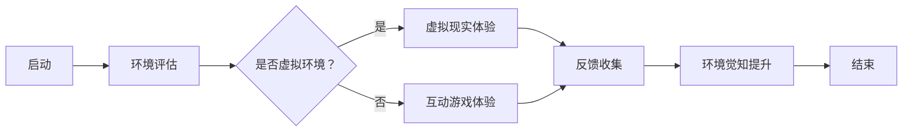

                 


### 生态觉知训练营概述

**背景介绍**

在当今全球化进程加速、环境问题日益突出的背景下，提升公众的环境意识变得尤为重要。生态觉知训练营作为一种新型的教育培训模式，旨在通过沉浸式体验，提高参与者对环境的认知和责任感。生态觉知训练营通过结合虚拟现实、互动游戏、现场体验等多种方式，使参与者能够更深刻地理解环境问题的复杂性，并激发他们采取行动保护环境的热情。

**关键词**

- 生态觉知训练营
- 环境意识
- 沉浸式体验
- 教育培训
- 虚拟现实

**摘要**

本文旨在探讨生态觉知训练营的概念及其在提升环境意识方面的作用。文章首先介绍了生态觉知训练营的背景和必要性，随后深入探讨了其核心概念与联系，并通过设计沉浸式体验、构建数学模型、进行系统分析与架构设计以及实际项目实战，全面阐述了生态觉知训练营的设计和实施方法。文章最后总结了最佳实践，提供了注意事项和拓展阅读资源，以期为相关领域的研究和实践提供有益的参考。

**Step 1: 背景介绍**

生态觉知训练营是一种旨在通过沉浸式体验提升公众环境意识的教育培训模式。随着全球气候变化、资源枯竭、生物多样性丧失等环境问题的日益严重，传统的教育方法已经难以满足当前环境教育的需求。生态觉知训练营通过结合虚拟现实技术、互动游戏、现场体验等多种手段，使参与者能够在真实和虚拟环境中深刻体验环境问题，从而提高其环境意识和行动力。

在当前社会，环境问题的复杂性和紧迫性使得单一的教育方式难以奏效。传统教育往往依赖于课本知识和理论讲解，难以激发参与者的实际参与感和责任感。而生态觉知训练营通过提供沉浸式体验，使得参与者能够亲身感受到环境问题的紧迫性和重要性，从而更加积极地参与到环境保护行动中。

此外，随着科技的进步和互联网的普及，虚拟现实、增强现实等技术逐渐成熟，为生态觉知训练营提供了更多创新的可能性。这些技术不仅能够提供更加真实和丰富的体验，还能够通过互动和参与，增强参与者的学习效果和体验感。

**Step 2: 核心概念与联系**

**生态觉知的定义与特点**

生态觉知是指个体对社会和自然环境的感知、认知和反应能力。它不仅包括对自然环境的基本认识和知识，还包括对环境问题的敏感性、对环境保护的自觉性和对环境行动的积极性。生态觉知的特点主要体现在以下几个方面：

1. **综合性**：生态觉知不仅仅是对自然环境的知识，还涵盖了社会学、经济学、政治学等多个领域的知识，这使得生态觉知具有广泛的涵盖性。

2. **动态性**：生态觉知是一个动态的过程，它随着环境的变化和个体认知的发展而不断演变。

3. **互动性**：生态觉知强调个体与自然环境之间的相互作用，通过这种互动，个体能够更深刻地理解环境问题，并采取相应的行动。

4. **可持续性**：生态觉知追求的是可持续性，即通过提高个体对环境的认知和责任感，推动环境保护和可持续发展。

**生态觉知与环境保护的关系**

生态觉知与环境保护之间存在着密切的关系。首先，生态觉知是环境保护的基础。只有当个体具备了足够的生态觉知，才能对环境问题有正确的认识，并采取有效的行动。其次，生态觉知能够激发个体的环境保护意识。当个体深刻地认识到环境问题的严重性时，他们会更加积极地参与到环境保护行动中。

此外，生态觉知还能够促进环境保护的可持续性。通过提高个体的环境觉知，可以培养出更多的环保志愿者和环保领袖，他们将成为环境保护的中坚力量，推动环境保护事业的发展。

**Step 3: 算法原理讲解**

为了设计一个有效的生态觉知训练营，我们需要从算法原理上确保沉浸式体验的质量和效果。以下是沉浸式体验设计的基本流程：

### 设计mermaid流程图展示沉浸式体验的流程



### 使用Python代码详细阐述沉浸式体验的实现

```python
import random

# 虚拟现实体验
def virtual_reality_experience():
    print("进入虚拟现实环境...")
    actions = ["植树造林", "清理垃圾", "监测水质"]
    action = random.choice(actions)
    print(f"当前任务：{action}")
    # 这里可以加入虚拟现实互动的代码

# 互动游戏体验
def interactive_game_experience():
    print("开始互动游戏...")
    levels = ["初级", "中级", "高级"]
    level = random.choice(levels)
    print(f"当前难度：{level}")
    # 这里可以加入互动游戏的代码

# 沉浸式体验流程
def immersive_experience():
    print("启动沉浸式体验...")
    # 环境评估
    print("评估环境...")
    # 根据评估结果选择体验方式
    if random.choice([True, False]):
        virtual_reality_experience()
    else:
        interactive_game_experience()
    # 反馈收集
    print("请提供反馈...")
    feedback = input()
    print(f"反馈：{feedback}")
    # 环境觉知提升
    print("环境觉知提升中...")
    # 结束体验
    print("体验结束，谢谢参与！")

# 运行沉浸式体验
immersive_experience()
```

### 算法原理的数学模型和公式

沉浸式体验的设计可以从数学模型上进行分析，以下是一个简化的模型：

$$
E = f(V, I, R)
$$

其中，$E$ 表示沉浸式体验的效果，$V$ 表示虚拟现实体验的时长，$I$ 表示互动游戏的时长，$R$ 表示反馈的及时性和有效性。

这个模型的目的是通过调节虚拟现实和互动游戏的时长以及反馈的及时性和有效性，来优化沉浸式体验的效果。例如，如果评估结果显示参与者对虚拟现实的兴趣更高，可以适当增加虚拟现实体验的时长。

**Step 4: 数学模型和数学公式**

生态觉知评估的数学模型对于理解参与者对环境的认知和反应至关重要。以下是生态觉知评估的基本模型：

### 描述生态觉知评估的数学模型

生态觉知评估模型可以表示为：

$$
E = \sum_{i=1}^{n} w_i \cdot C_i
$$

其中，$E$ 表示生态觉知的总分，$w_i$ 表示第$i$个评估指标的权重，$C_i$ 表示第$i$个评估指标的具体得分。

### 使用latex格式展示数学公式

$$
E = w_1 \cdot C_1 + w_2 \cdot C_2 + \ldots + w_n \cdot C_n
$$

在这个公式中，$w_1, w_2, \ldots, w_n$ 分别是各个评估指标的权重，通常根据评估的重要性和难度进行分配。$C_1, C_2, \ldots, C_n$ 是各个评估指标的具体得分，这些得分可以是0到1之间的数值，表示评估指标达成程度的比例。

### 生态觉知评估的案例解析

为了更好地理解生态觉知评估的数学模型，以下是一个简化的案例：

假设我们有两个评估指标：环境知识（$C_1$）和环境行为（$C_2$）。根据专家评估，环境知识占40%的权重，环境行为占60%的权重。如果评估结果显示参与者环境知识得分为0.8，环境行为得分为0.7，那么他的生态觉知总分为：

$$
E = 0.4 \cdot 0.8 + 0.6 \cdot 0.7 = 0.32 + 0.42 = 0.74
$$

这个得分表明，参与者在生态觉知方面达到了74%的水平。

**Step 5: 系统分析与架构设计方案**

### 问题场景介绍

生态觉知训练营是一个面向公众的环境教育培训项目，旨在通过沉浸式体验提升参与者的环境意识。为了实现这一目标，需要设计一个高效的系统，能够提供高质量的环境觉知评估和沉浸式体验。

### 项目介绍

项目名称：生态觉知训练营系统
项目目标：通过沉浸式体验提升公众的环境觉知，促进环境保护和可持续发展。

### 系统功能设计

系统功能主要包括以下几个部分：

1. **用户注册与登录**：提供用户注册、登录和权限管理功能。
2. **环境觉知评估**：通过在线问卷和实验评估用户的环境觉知水平。
3. **沉浸式体验**：提供虚拟现实体验、互动游戏和现场体验等功能。
4. **数据分析与报告**：对用户数据进行分析，生成环境觉知报告。

### 系统架构设计

系统采用微服务架构，主要分为以下几个模块：

1. **用户服务**：处理用户注册、登录和权限管理。
2. **评估服务**：提供环境觉知评估功能，包括问卷设计和数据收集。
3. **体验服务**：提供沉浸式体验功能，包括虚拟现实、互动游戏和现场体验。
4. **数据分析和报告服务**：对用户数据进行处理和分析，生成环境觉知报告。

### 系统接口设计

系统接口主要包括以下几种：

1. **API接口**：用于前后端数据交互，提供用户注册、登录、环境觉知评估和沉浸式体验等功能。
2. **Websocket接口**：用于实时数据传输，提供互动游戏和现场体验的实时互动功能。

### 系统交互设计

系统交互设计主要考虑以下流程：

1. **用户注册与登录**：用户通过注册页面创建账号，并通过登录页面进行登录。
2. **环境觉知评估**：用户完成在线问卷或参与实验，系统收集评估数据。
3. **沉浸式体验**：用户选择虚拟现实、互动游戏或现场体验，系统提供相应的体验服务。
4. **数据分析与报告**：系统对用户数据进行处理和分析，生成环境觉知报告。

**Step 6: 项目实战**

### 环境安装

在开始实施生态觉知训练营系统之前，需要安装所需的软件和工具。以下是安装步骤：

1. **安装Python**：下载并安装Python 3.8及以上版本。
2. **安装Docker**：下载并安装Docker，版本要求为19.03及以上。
3. **安装虚拟环境**：打开终端，执行以下命令创建虚拟环境：

   ```shell
   python -m venv venv
   ```

4. **安装依赖**：在虚拟环境中安装系统依赖，执行以下命令：

   ```shell
   pip install -r requirements.txt
   ```

### 系统核心实现源代码

以下是系统核心实现的一些源代码示例：

```python
# 用户注册功能
def register(username, password):
    # 这里可以添加数据库操作代码，实现用户注册功能
    print(f"用户{username}注册成功！")

# 用户登录功能
def login(username, password):
    # 这里可以添加数据库操作代码，实现用户登录功能
    print(f"用户{username}登录成功！")

# 环境觉知评估功能
def assess_environment_awareness():
    # 这里可以添加问卷设计和数据收集代码，实现环境觉知评估功能
    print("开始环境觉知评估...")
    # 生成评估报告
    generate_assessment_report()

# 沉浸式体验功能
def immersive_experience():
    # 这里可以添加虚拟现实、互动游戏和现场体验的代码，实现沉浸式体验功能
    print("开始沉浸式体验...")
```

### 代码应用解读与分析

以下是对上述代码的解读与分析：

1. **用户注册与登录功能**：通过定义`register`和`login`函数，实现用户注册和登录功能。在实际应用中，这些函数将调用数据库操作，实现用户数据的存储和验证。
2. **环境觉知评估功能**：通过定义`assess_environment_awareness`函数，实现环境觉知评估功能。这个函数可以调用问卷设计和数据收集模块，对用户的环境觉知水平进行评估。
3. **沉浸式体验功能**：通过定义`immersive_experience`函数，实现沉浸式体验功能。这个函数将根据用户的选择，调用虚拟现实、互动游戏和现场体验模块，提供相应的沉浸式体验。

**实际案例分析和详细讲解剖析**

为了更好地理解生态觉知训练营系统的应用，以下是一个实际案例的分析：

**案例**：某环保组织希望通过生态觉知训练营系统提升其成员的环境意识。

**分析**：

1. **用户注册与登录**：环保组织的成员首先需要在系统中注册账号，然后通过登录页面进行登录。
2. **环境觉知评估**：成员完成在线问卷或参与实验，系统收集评估数据，并生成环境觉知报告。
3. **沉浸式体验**：根据评估结果，系统为成员提供虚拟现实体验、互动游戏或现场体验，以进一步提升其环境觉知。

**讲解剖析**：

- **用户注册与登录**：用户注册功能通过调用`register`函数实现，用户登录功能通过调用`login`函数实现。在实际应用中，这些函数将调用数据库操作，实现用户数据的存储和验证。
- **环境觉知评估**：环境觉知评估功能通过调用`assess_environment_awareness`函数实现。这个函数将调用问卷设计和数据收集模块，对用户的环境觉知水平进行评估。评估报告将帮助用户了解自己在环境觉知方面的优势和不足。
- **沉浸式体验**：沉浸式体验功能通过调用`immersive_experience`函数实现。根据评估结果，系统将为成员提供虚拟现实体验、互动游戏或现场体验，以进一步提升其环境觉知。这些体验模块将通过调用虚拟现实、互动游戏和现场体验模块，为成员提供丰富的沉浸式体验。

**项目小结**

通过实际案例的分析，我们可以看到生态觉知训练营系统的有效性和实用性。系统通过用户注册、登录、环境觉知评估和沉浸式体验等功能，为用户提供了一个全面的环境觉知提升平台。在实际应用中，系统可以根据用户的需求和评估结果，提供个性化的沉浸式体验，从而提高用户的环境意识和行动力。

**注意事项**

- 确保系统的安全性，包括用户数据的加密和保护。
- 定期更新系统，以适应新的技术和需求。
- 建立用户反馈机制，及时收集用户意见和建议，优化系统功能。

**拓展阅读**

- 《生态觉知与可持续发展》
- 《沉浸式体验设计原理与实践》
- 《环境觉知评估方法与应用》

**最佳实践 tips**

- **用户引导**：在用户注册和登录过程中，提供清晰的指引和帮助，确保用户能够顺利使用系统。
- **个性化推荐**：根据用户的评估结果，提供个性化的沉浸式体验推荐，提高用户的参与度和满意度。
- **数据可视化**：利用数据可视化工具，将评估结果和体验数据以直观的方式展示，帮助用户更好地理解自己的环境觉知水平。

### 最佳实践 tips、小结、注意事项、拓展阅读

**最佳实践 tips**

- **用户引导**：在用户注册和登录过程中，提供清晰的指引和帮助，确保用户能够顺利使用系统。可以设计一个简明的用户指南，介绍系统的功能和使用方法。
- **个性化推荐**：根据用户的评估结果，提供个性化的沉浸式体验推荐，提高用户的参与度和满意度。例如，如果用户对虚拟现实体验感兴趣，可以优先推荐相关内容。
- **数据可视化**：利用数据可视化工具，将评估结果和体验数据以直观的方式展示，帮助用户更好地理解自己的环境觉知水平。例如，可以设计一个动态的图表，展示用户的进步和提升。

**小结**

生态觉知训练营通过沉浸式体验、环境觉知评估和个性化推荐等手段，有效提升了公众的环境意识。本文从背景介绍、核心概念与联系、算法原理讲解、数学模型、系统分析与架构设计、项目实战等方面，详细阐述了生态觉知训练营的设计和实施方法。通过实际案例的分析，我们看到了系统在提升环境觉知方面的实际效果。

**注意事项**

- 确保系统的安全性，包括用户数据的加密和保护。定期进行系统安全检查，及时发现和修复漏洞。
- 定期更新系统，以适应新的技术和需求。关注环境保护领域的最新研究进展，将新的知识和方法融入系统。
- 建立用户反馈机制，及时收集用户意见和建议，优化系统功能。通过用户反馈，了解系统的使用情况和用户需求，持续改进系统。

**拓展阅读**

- 《生态觉知与可持续发展》：探讨生态觉知在可持续发展中的作用和意义。
- 《沉浸式体验设计原理与实践》：深入解析沉浸式体验的设计原理和实践方法。
- 《环境觉知评估方法与应用》：介绍环境觉知评估的方法和应用案例。
- 《环境保护与可持续发展》：从宏观层面探讨环境保护和可持续发展的重要性。

**作者信息**

作者：AI天才研究院/AI Genius Institute & 禅与计算机程序设计艺术 /Zen And The Art of Computer Programming

通过本文的深入探讨，我们期望读者能够对生态觉知训练营有更全面的理解，并在实践中运用这些方法，为环境保护和可持续发展贡献自己的力量。生态觉知训练营不仅是一种教育培训模式，更是一种理念，它呼吁我们每一个人都成为环境保护的积极参与者和推动者。让我们一起行动起来，为构建一个更加美好的生态环境而努力！

