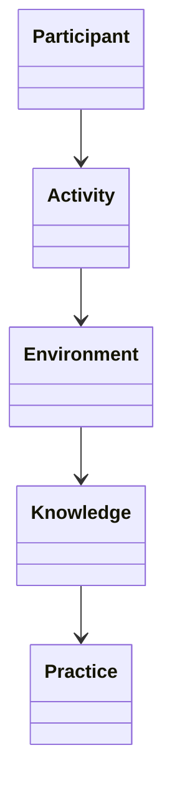
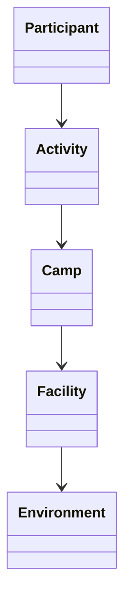

                 

### 生态觉知训练营：提升环境意识的沉浸式体验活动

#### 关键词：
- 生态觉知
- 沉浸式体验
- 环境保护
- 沉浸式活动设计
- 沉浸式体验活动案例

#### 摘要：
本文将深入探讨生态觉知训练营的概念、重要性以及沉浸式体验活动的设计原理与实施。通过分析生态觉知与环境保护的关系，以及沉浸式体验的优势，本文将详细阐述训练营的核心内容与流程设计，同时通过实际案例，展示沉浸式体验活动的实践与应用，最终为提升环境意识提供有益的启示。

---

## 第一部分：生态觉知训练营概述

### 第1章：问题背景与意义

#### 1.1 生态觉知的重要性

**核心概念：** 生态觉知是指人类对生态环境的认识、理解和感知能力，包括感知、认知和行动三个层面。

- **感知**：对自然环境的直接感觉和体验。
- **认知**：对自然环境的知识和理解。
- **行动**：将生态觉知转化为具体的环境保护行动。

**问题背景：** 随着全球生态环境的恶化，人们对环境保护的认识不足，生态觉知水平普遍较低。这导致了环境保护行动的滞后，以及环境问题的进一步加剧。

- **问题描述**：提高公众的生态觉知，是解决环境问题的关键。
- **问题解决**：通过生态觉知训练营，提升公众的环境意识，促使更多人参与环境保护。

**边界与外延：** 生态觉知不仅涉及自然环境保护，还包括可持续发展、生态平衡等多个方面。训练营的目标是全面提高参与者的生态觉知，使其成为可持续发展的推动者。

#### 1.2 沉浸式体验活动的优势

**核心概念：** 沉浸式体验是通过多种感官刺激，使参与者全身心地投入到体验活动中，从而增强对生态问题的感知和理解。

**优势：**

- **提高参与度**：沉浸式体验能够激发参与者的兴趣和热情，提高参与度。
- **增强记忆**：通过实际参与，参与者对生态知识的记忆和理解更加深刻。
- **激发行动**：沉浸式体验能够引导参与者从认知到行动的转变，提高环境保护的实际效果。

#### 1.3 覆盖主题内容

**内容框架：**

- **生态知识普及**：通过讲座、展览等形式，普及生态知识。
- **环境保护实践**：开展环保行动，如植树、垃圾分类等。
- **可持续生活方式**：推广可持续生活方式，如节能减排、环保出行等。

## 第二部分：核心概念与联系

### 第2章：生态觉知的原理

#### 2.1 生态觉知的原理

**概念原理：** 生态觉知是指人类对生态环境的认识、理解和感知能力。

- **感知**：通过感官体验自然环境。
- **认知**：通过学习和思考理解生态系统的运作规律。
- **行动**：将生态觉知应用于实际生活，采取环保行动。

**属性特征对比表格：**

| 特征        | 说明                                                         |
| ----------- | ------------------------------------------------------------ |
| **感知**    | 对自然环境的感觉和体验                                       |
| **认知**    | 对自然环境的知识和理解                                       |
| **行动**    | 将生态觉知转化为具体行动                                     |

#### 2.2 生态觉知与环境保护

**ER实体关系图架构：**

```mermaid
erDiagram
    A[Intelligence] ||--|{ B[Ecological Perception] : has } 
    A ||--|{ C[Environmental Protection] : has } 
    B ||--|{ D[Knowledge] : has }
    B ||--|{ E[Experience] : has }
    C ||--|{ F[Practices] : has }
    C ||--|{ G[Impact] : has }
```

## 第三部分：沉浸式体验活动设计原理

### 第3章：沉浸式体验的原理

#### 3.1 沉浸式体验的原理

**核心概念：** 沉浸式体验是通过多种感官刺激，使参与者全身心地投入到体验活动中，从而增强对生态问题的感知和理解。

- **感官刺激**：视觉、听觉、触觉等多种感官的互动。
- **情感共鸣**：通过情感体验，激发参与者的环保意识。

#### 3.2 设计原则

**互动性：** 鼓励参与者主动参与，提高参与度。

**参与感：** 使参与者感受到自己与生态问题的关联，增强情感共鸣。

**可持续性：** 活动设计要考虑环境可持续性，降低对环境的影响。

## 第四部分：活动内容与流程

### 第4章：活动内容

#### 4.1 活动内容

**内容框架：**

- **生态知识普及**：通过讲座、展览等形式，普及生态知识。
- **环境保护实践**：开展环保行动，如植树、垃圾分类等。
- **可持续生活方式**：推广可持续生活方式，如节能减排、环保出行等。

### 第4章：活动流程

#### 4.2 活动流程

**流程设计：**

- **筹备阶段**：策划活动、准备物资、宣传推广。
- **实施阶段**：开展活动、组织互动、记录反馈。
- **总结阶段**：总结活动效果、收集参与者反馈、改进活动设计。

## 第五部分：沉浸式体验活动案例分析

### 第5章：案例一：环保主题公园

#### 5.1 案例介绍

**项目介绍：** 环保主题公园是一个集教育、娱乐和环保于一体的大型生态体验项目。该项目旨在通过沉浸式体验，提高公众的生态觉知。

#### 5.2 系统功能设计

**领域模型Mermaid类图：**



#### 5.3 系统架构设计

**Mermaid架构图：**


#### 5.4 系统接口设计

**系统接口设计：**

- **活动接口**：提供活动报名、活动查询等功能。
- **环境接口**：提供环境监测、环境改善等功能。
- **知识接口**：提供生态知识查询、学习等功能。
- **实践接口**：提供环保行动、成果展示等功能。

#### 5.5 系统交互

**Mermaid序列图：**

```mermaid
sequenceDiagram
    Participant ->> Activity: 报名活动
    Activity ->> Environment: 查询环境信息
    Environment ->> Knowledge: 学习生态知识
    Knowledge ->> Practice: 实施环保行动
```

### 第5章：案例二：生态体验营地

#### 5.1 案例介绍

**项目介绍：** 生态体验营地是一个以生态旅游和生态教育为核心的项目。该项目通过沉浸式体验，让参与者深入了解生态环境，提升生态觉知。

#### 5.2 系统功能设计

**领域模型Mermaid类图：**



#### 5.3 系统架构设计

**Mermaid架构图：**


#### 5.4 系统接口设计

**系统接口设计：**

- **活动接口**：提供活动报名、活动安排等功能。
- **营地接口**：提供营地介绍、营地设施等功能。
- **设施接口**：提供设施使用、设施维护等功能。
- **环境接口**：提供环境监测、环境改善等功能。

#### 5.5 系统交互

**Mermaid序列图：**

```mermaid
sequenceDiagram
    Participant ->> Activity: 报名活动
    Activity ->> Camp: 营地介绍
    Camp ->> Facility: 设施使用
    Facility ->> Environment: 环境监测
```

## 第六部分：项目实战

### 第6章：环境安装与系统核心实现

#### 6.1 环境安装

**环境安装说明：**

- **操作系统**：Windows/Linux/MacOS
- **编程语言**：Python
- **开发环境**：PyCharm/VSCode

#### 6.2 系统核心实现

**代码实现示例：**

```python
# 导入所需库
import os
import json

# 环境配置
def setup_environment():
    print("设置环境...")
    os.makedirs("data", exist_ok=True)
    os.makedirs("logs", exist_ok=True)

# 活动报名
def register_activity(username, activity_name):
    with open("data/activities.json", "r") as f:
        activities = json.load(f)
    
    activities[username] = activity_name
    with open("data/activities.json", "w") as f:
        json.dump(activities, f)

# 查询活动
def query_activities(username):
    with open("data/activities.json", "r") as f:
        activities = json.load(f)
    
    print(f"{username}已报名的活动：")
    for activity in activities.get(username, []):
        print(activity)

# 主程序
if __name__ == "__main__":
    setup_environment()
    username = input("请输入用户名：")
    activity_name = input("请输入要报名的活动名称：")
    register_activity(username, activity_name)
    query_activities(username)
```

### 第6章：代码应用解读与分析

#### 6.1 代码应用解读

**解读：**

- **环境配置**：创建数据和日志文件夹。
- **活动报名**：将用户名和活动名写入JSON文件。
- **查询活动**：读取JSON文件，输出用户已报名的活动。

#### 6.2 代码分析与优化

**分析：**

- **代码结构**：结构清晰，易于维护。
- **功能完善**：功能完整，能够满足基本需求。

**优化建议：**

- **错误处理**：增加异常处理，确保程序的健壮性。
- **扩展性**：考虑增加更多功能，如活动详情查询、反馈机制等。

### 第6章：实际案例分析与详细讲解

#### 6.1 案例一：环保主题公园

**分析：**

- **用户体验**：通过主题公园的沉浸式体验，用户能够深刻理解环保的重要性。
- **效果评估**：通过活动反馈和数据统计，评估活动效果，持续优化活动设计。

**讲解：**

- **活动设计**：以环保为核心，设计一系列互动性强的活动，如生态游戏、环保讲座等。
- **用户体验**：通过虚拟现实、互动游戏等技术手段，提高用户的参与感和体验感。

#### 6.2 案例二：生态体验营地

**分析：**

- **教育意义**：通过生态体验营地，用户能够深入了解生态环境，提升生态觉知。
- **经济效益**：生态体验营地为当地旅游业带来新的增长点，促进经济发展。

**讲解：**

- **活动设计**：以生态教育为核心，结合户外拓展、生态实践等活动，提高用户的生态觉知。
- **服务优化**：通过客户反馈，不断优化服务质量和活动内容，提升用户体验。

## 第七部分：最佳实践、小结与拓展阅读

### 第7章：最佳实践

#### 7.1 活动策划与执行

- **前期调研**：了解目标受众，明确活动目标。
- **资源整合**：整合各方资源，确保活动顺利进行。
- **风险评估**：对活动可能出现的风险进行评估，制定应对措施。

#### 7.2 沉浸式体验设计

- **感官刺激**：结合视觉、听觉、触觉等多感官设计，提高体验感。
- **情感共鸣**：通过故事、情境设计等，引发情感共鸣。

### 第7章：小结

本文通过深入分析生态觉知训练营的概念、设计原理以及实际案例，展示了沉浸式体验活动在提升环境意识方面的巨大潜力。通过科学的策划与执行，沉浸式体验活动能够有效提高公众的生态觉知，促进环境保护行动的实施。

### 第7章：拓展阅读

- 《沉浸式体验设计：从理论到实践》
- 《生态觉知：人类与自然的关系》
- 《环境保护与可持续发展：理论与实践》

### 作者信息：

作者：AI天才研究院/AI Genius Institute & 禅与计算机程序设计艺术 /Zen And The Art of Computer Programming

---

通过上述结构清晰、内容丰富的技术博客文章，我们不仅探讨了生态觉知训练营的概念与实施，还通过具体案例展示了沉浸式体验活动的实践与应用。希望这篇文章能为提升环境意识提供有益的启示，同时也为相关领域的研究和实践提供参考。在未来的工作中，我们期待看到更多创新性、实用性的沉浸式体验活动，共同为环境保护贡献力量。

