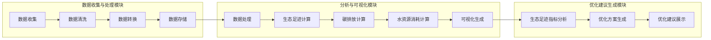
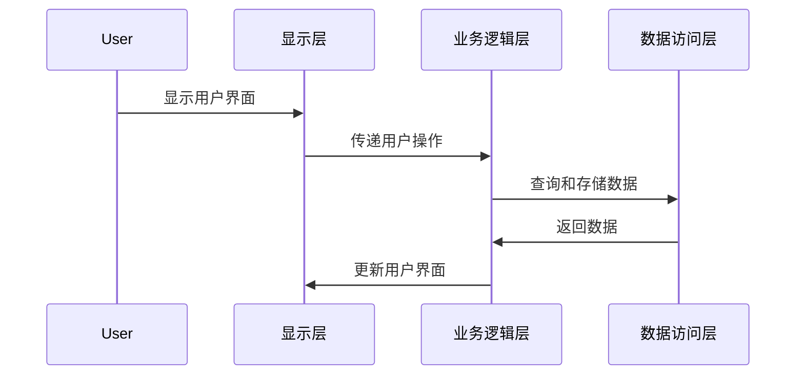
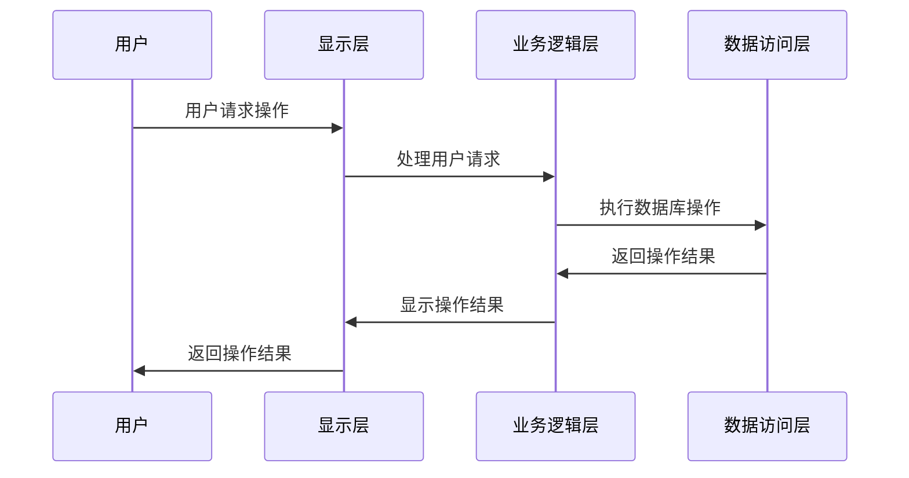
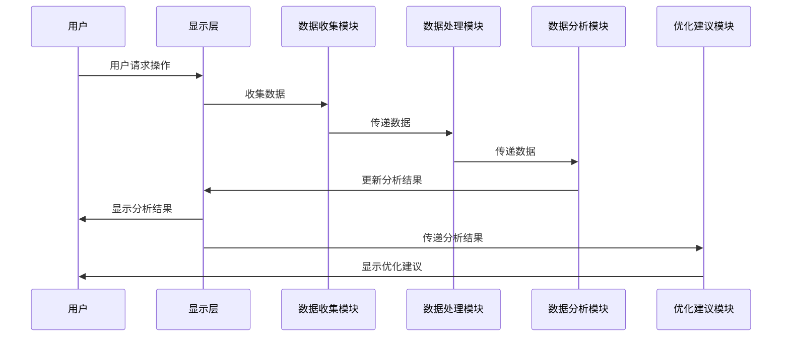

                 

### 文章标题：生态足迹可视化工具：审视个人生活的环境影响

**关键词：** 生态足迹、可视化工具、环境影响、个人生活、可持续发展

**摘要：** 本文将深入探讨生态足迹这一概念，并详细介绍一款创新的生态足迹可视化工具。通过这一工具，个人可以更好地理解并评估其日常生活对环境的影响，从而采取更积极的措施实现可持续发展。文章将依次介绍生态足迹的定义和背景、核心概念及其联系、算法原理与数学模型、系统分析与架构设计、项目实战以及最佳实践与注意事项，旨在为广大读者提供全面的指导。

## 一、背景介绍

### 1.1 核心概念术语说明

#### 生态足迹（Ecological Footprint）

生态足迹是一个衡量人类社会经济活动对自然生态系统影响的重要指标。它表示人类或特定地区消耗自然资源和产生废物所需的空间面积，以全球公顷（gHa）为单位进行度量。

#### 环境影响评估（Environmental Impact Assessment）

环境影响评估是一种系统的方法，用于评估规划或项目对环境的影响，包括空气、水、土壤、生态系统等方面。

#### 可持续发展（Sustainable Development）

可持续发展是指在满足当前需求的同时，不损害后代满足其自身需求的能力。它要求我们在经济、社会和环境三个层面实现平衡。

### 1.2 问题背景

随着全球人口的持续增长和消费水平的提高，人类对自然资源的需求日益增加，导致生态环境面临严峻挑战。气候变化、生物多样性丧失、环境污染等问题日益突出。因此，评估个人生活对环境的影响，成为实现可持续发展的重要一环。

### 1.3 问题描述

个人在日常生活中会产生大量的碳排放、水资源消耗、能源消耗等，这些活动对环境产生了不同程度的影响。然而，大多数人对这些影响的认识有限，难以做出有效的调整和改变。

### 1.4 问题解决

为了帮助个人更好地理解其日常生活对环境的影响，我们需要一种有效的工具——生态足迹可视化工具。该工具可以收集、分析和展示个人在生活中的各项消耗数据，帮助用户直观地了解其对环境的影响，从而采取积极措施实现可持续发展。

### 1.5 边界与外延

生态足迹可视化工具主要关注个人日常生活对环境的影响，包括但不限于以下方面：

- **碳排放：** 汽车出行、家庭用电、供暖、烹饪等产生的二氧化碳排放。
- **水资源消耗：** 家庭用水、农业灌溉、工业生产等消耗的水资源。
- **能源消耗：** 家庭用电、燃气、太阳能等能源的使用。

### 1.6 概念结构与核心要素组成

生态足迹可视化工具主要由以下几个核心要素组成：

- **数据收集模块：** 收集个人日常生活中的各项消耗数据，如能源消耗、水资源消耗、碳排放等。
- **数据处理模块：** 对收集到的数据进行清洗、转换和存储，为后续分析提供基础。
- **分析模块：** 利用统计学方法和生态学原理，对个人生活数据进行分析，得出生态足迹指标。
- **可视化模块：** 将分析结果以图表、地图等形式展示，帮助用户直观地了解其对环境的影响。
- **优化建议模块：** 根据用户生态足迹指标，提供针对性的优化建议，如节能减排、低碳出行等。

## 二、核心概念与联系

### 2.1 核心概念原理

#### 数据收集与处理

数据收集与处理是生态足迹可视化工具的基础。该模块需要收集用户日常生活中的各项数据，如能源消耗、水资源消耗、碳排放等。收集到的数据需要经过清洗、转换和存储，为后续分析提供准确的数据支持。

#### 分析与可视化

分析与可视化模块是生态足迹可视化工具的核心。通过统计学方法和生态学原理，对个人生活数据进行分析，得出生态足迹指标。然后，将分析结果以图表、地图等形式展示，帮助用户直观地了解其对环境的影响。

#### 优化建议

优化建议模块是根据用户生态足迹指标，提供针对性的优化建议。如节能减排、低碳出行、水资源节约等，帮助用户采取积极措施实现可持续发展。

### 2.2 概念属性特征对比表格

#### 数据收集与处理

| 特征               | 说明                                                         |
|--------------------|------------------------------------------------------------|
| 数据类型           | 多样化，包括能源消耗、水资源消耗、碳排放等                     |
| 数据来源           | 用户日常生活中的各项数据                                     |
| 数据处理方式       | 数据清洗、转换、存储                                         |
| 数据质量要求       | 准确、完整、实时                                             |

#### 分析与可视化

| 特征               | 说明                                                         |
|--------------------|------------------------------------------------------------|
| 分析方法           | 统计学方法、生态学原理                                       |
| 分析指标           | 生态足迹、碳排放、水资源消耗等                               |
| 可视化形式         | 图表、地图、热力图等                                         |
| 可视化效果         | 直观、易于理解                                               |

#### 优化建议

| 特征               | 说明                                                         |
|--------------------|------------------------------------------------------------|
| 建议类型           | 节能减排、低碳出行、水资源节约等                             |
| 建议依据           | 用户生态足迹指标分析结果                                     |
| 建议效果           | 提高用户环保意识、促进可持续发展                             |

### 2.3 ER实体关系图架构

#### ER实体关系图（部分）

```mermaid
erDiagram
    User ||--|{ DataCollector }|
    User ||--|{ DataProcessor }|
    User ||--|{ Analyzer }|
    User ||--|{ Visualizer }|
    User ||--|{ Optimizer }|
```

在ER实体关系图中，用户（User）与数据收集器（DataCollector）、数据处理器（DataProcessor）、分析器（Analyzer）、可视化器（Visualizer）和优化器（Optimizer）之间具有明确的关联关系。这些模块共同协作，实现生态足迹可视化工具的各功能模块。

## 三、算法原理讲解

### 3.1 算法原理

生态足迹可视化工具的核心算法包括数据收集与处理、分析与可视化以及优化建议生成。以下是对这些算法原理的详细讲解。

#### 3.1.1 数据收集与处理

数据收集与处理算法主要负责收集用户日常生活中的各项数据，并对这些数据进行清洗、转换和存储。具体步骤如下：

1. **数据收集：** 通过传感器、手动输入、应用程序等途径收集用户在能源消耗、水资源消耗、碳排放等方面的数据。
2. **数据清洗：** 清除数据中的噪声和错误，确保数据的准确性和完整性。
3. **数据转换：** 将数据转换为统一格式，便于后续分析和处理。
4. **数据存储：** 将处理后的数据存储在数据库中，为后续分析提供数据支持。

#### 3.1.2 分析与可视化

分析与可视化算法主要负责对用户生活数据进行分析，并生成可视化结果。具体步骤如下：

1. **数据处理：** 对收集到的数据进行处理，包括数据聚合、去重、补全等操作。
2. **生态足迹计算：** 根据生态足迹指标的计算公式，计算用户的生态足迹。
3. **碳排放计算：** 根据碳排放系数，计算用户的碳排放量。
4. **水资源消耗计算：** 根据水资源消耗系数，计算用户的水资源消耗量。
5. **可视化生成：** 将计算结果以图表、地图等形式展示，帮助用户直观地了解其对环境的影响。

#### 3.1.3 优化建议生成

优化建议生成算法主要负责根据用户的生态足迹指标，生成针对性的优化建议。具体步骤如下：

1. **生态足迹指标分析：** 分析用户的生态足迹指标，识别其主要的碳排放、水资源消耗来源。
2. **优化方案生成：** 根据分析结果，生成针对性的优化方案，如节能减排、低碳出行、水资源节约等。
3. **优化建议展示：** 将优化建议以文字、图表等形式展示，帮助用户了解并采纳这些建议。

### 3.2 算法流程图

以下是生态足迹可视化工具的算法流程图，展示了各模块的协同工作过程。



### 3.3 Python源代码

以下是一个简单的Python代码示例，用于计算生态足迹和碳排放。这有助于读者更好地理解算法原理。

```python
import pandas as pd

# 生态足迹计算公式
ecofootprint_formula = """
    energy_footprint = energy_consumption * energy_factor
    carbon_footprint = energy_footprint * co2_emission_factor
    water_footprint = water_consumption * water_factor
    total_footprint = energy_footprint + carbon_footprint + water_footprint
    return total_footprint
"""

# 碳排放计算公式
carbon_emission_formula = """
    carbon_emission = energy_consumption * co2_emission_factor
    return carbon_emission
"""

# 数据示例
data = {
    'energy_consumption': [100, 200, 300],  # 能源消耗（单位：千瓦时）
    'water_consumption': [10, 20, 30],     # 水资源消耗（单位：立方米）
    'co2_emission_factor': 0.00051,        # 碳排放系数（单位：千克/千瓦时）
    'energy_factor': 0.3,                   # 能源系数（单位：全球公顷/千瓦时）
    'water_factor': 0.0001                  # 水资源系数（单位：全球公顷/立方米）
}

# 计算生态足迹
def calculate_ecofootprint(data):
    df = pd.DataFrame(data)
    df['total_footprint'] = df.apply(lambda row: eval(ecofootprint_formula), axis=1)
    return df['total_footprint'].sum()

# 计算碳排放
def calculate_carbon_emission(data):
    df = pd.DataFrame(data)
    df['carbon_emission'] = df.apply(lambda row: eval(carbon_emission_formula), axis=1)
    return df['carbon_emission'].sum()

# 运行示例
print("生态足迹：", calculate_ecofootprint(data))
print("碳排放：", calculate_carbon_emission(data))
```

### 3.4 算法原理的数学模型和公式

生态足迹可视化工具的算法原理涉及多个数学模型和公式。以下是对这些模型和公式的详细讲解。

#### 3.4.1 生态足迹计算公式

生态足迹计算公式为：

$$
\text{total\_footprint} = \text{energy\_footprint} + \text{carbon\_footprint} + \text{water\_footprint}
$$

其中，各部分的计算公式如下：

1. **能源足迹（energy\_footprint）**

$$
\text{energy\_footprint} = \text{energy\_consumption} \times \text{energy\_factor}
$$

其中，energy\_consumption 表示能源消耗（单位：千瓦时），energy\_factor 表示能源系数（单位：全球公顷/千瓦时）。

2. **碳排放（carbon\_footprint）**

$$
\text{carbon\_footprint} = \text{energy\_footprint} \times \text{co2\_emission\_factor}
$$

其中，co2\_emission\_factor 表示碳排放系数（单位：千克/千瓦时）。

3. **水资源足迹（water\_footprint）**

$$
\text{water\_footprint} = \text{water\_consumption} \times \text{water\_factor}
$$

其中，water\_consumption 表示水资源消耗（单位：立方米），water\_factor 表示水资源系数（单位：全球公顷/立方米）。

#### 3.4.2 碳排放计算公式

碳排放计算公式为：

$$
\text{carbon\_emission} = \text{energy\_consumption} \times \text{co2\_emission\_factor}
$$

其中，energy\_consumption 表示能源消耗（单位：千瓦时），co2\_emission\_factor 表示碳排放系数（单位：千克/千瓦时）。

### 3.5 举例说明

假设用户A的日常能源消耗为200千瓦时，水资源消耗为20立方米，碳排放系数为0.00051，能源系数为0.3，水资源系数为0.0001。根据上述公式，可以计算其生态足迹和碳排放量如下：

1. **生态足迹**

$$
\text{energy\_footprint} = 200 \times 0.3 = 60 \text{gHa}
$$

$$
\text{carbon\_footprint} = 60 \times 0.00051 = 0.0306 \text{kg}
$$

$$
\text{water\_footprint} = 20 \times 0.0001 = 0.002 \text{gHa}
$$

$$
\text{total\_footprint} = 60 + 0.0306 + 0.002 = 60.0326 \text{gHa}
$$

2. **碳排放量**

$$
\text{carbon\_emission} = 200 \times 0.00051 = 0.102 \text{kg}
$$

通过上述计算，用户A的生态足迹为60.0326全球公顷，碳排放量为0.102千克。

## 四、系统分析与架构设计方案

### 4.1 问题场景介绍

在现代社会，人们越来越关注环境保护和可持续发展。然而，许多人对于个人行为对环境的影响缺乏直观的认识。为了帮助用户更好地理解其日常生活对环境的影响，我们需要一款强大的生态足迹可视化工具。该工具将收集用户在能源消耗、水资源消耗、碳排放等方面的数据，并进行详细分析，最终以可视化的方式呈现，为用户提供针对性的优化建议。

### 4.2 项目介绍

本项目的目标是开发一款生态足迹可视化工具，帮助用户了解其日常生活对环境的影响，从而采取更积极的措施实现可持续发展。项目的主要功能包括：

1. **数据收集：** 收集用户在能源消耗、水资源消耗、碳排放等方面的数据。
2. **数据分析：** 对收集到的数据进行分析，计算用户的生态足迹和碳排放量。
3. **可视化展示：** 将分析结果以图表、地图等形式展示，帮助用户直观地了解其对环境的影响。
4. **优化建议：** 根据用户的生态足迹指标，提供针对性的优化建议，如节能减排、低碳出行、水资源节约等。

### 4.3 系统功能设计

#### 4.3.1 领域模型

领域模型描述了系统的主要实体和它们之间的关系。在生态足迹可视化工具中，主要的实体包括：

1. **用户（User）：** 系统的核心实体，负责收集用户数据、分析数据、展示数据。
2. **数据项（DataItem）：** 描述用户在日常生活中产生的各项数据，如能源消耗、水资源消耗、碳排放等。
3. **分析结果（AnalysisResult）：** 描述对用户数据进行分析后的结果，包括生态足迹、碳排放量等。
4. **优化建议（OptimizationSuggestion）：** 描述根据用户生态足迹指标生成的优化建议。

以下是领域模型的Mermaid类图：

```mermaid
classDiagram
    User <<entity>>
    DataItem <<entity>>
    AnalysisResult <<entity>>
    OptimizationSuggestion <<entity>>

    User "1" -- "*" DataItem
    User "1" -- "*" AnalysisResult
    User "1" -- "*" OptimizationSuggestion
    DataItem "1" -- "1" AnalysisResult
    AnalysisResult "1" -- "1" OptimizationSuggestion
```

#### 4.3.2 系统功能模块

生态足迹可视化工具主要分为以下功能模块：

1. **数据收集模块：** 负责收集用户在能源消耗、水资源消耗、碳排放等方面的数据。
2. **数据处理模块：** 负责对收集到的数据进行清洗、转换和存储。
3. **数据分析模块：** 负责对用户数据进行生态足迹和碳排放量的计算。
4. **可视化展示模块：** 负责将分析结果以图表、地图等形式展示。
5. **优化建议模块：** 负责根据用户生态足迹指标生成优化建议。

### 4.4 系统架构设计

#### 4.4.1 架构设计

生态足迹可视化工具的系统架构采用分层设计，分为表示层、业务逻辑层和数据访问层。

1. **表示层：** 负责与用户进行交互，展示分析结果和优化建议。
2. **业务逻辑层：** 负责实现数据收集、处理、分析和优化建议生成等功能。
3. **数据访问层：** 负责与数据库进行交互，存储和查询用户数据。

以下是系统架构的Mermaid架构图：



#### 4.4.2 系统接口设计

系统接口设计包括内部接口和外部接口。

1. **内部接口：** 负责业务逻辑层和数据访问层之间的交互。
2. **外部接口：** 负责表示层与外部系统（如传感器、应用程序等）的交互。

以下是系统接口的Mermaid序列图：



### 4.5 系统交互

系统交互主要涉及用户与系统的交互，以及各模块之间的交互。

1. **用户与系统的交互：** 用户通过表示层与系统进行交互，提交数据请求、查看分析结果和优化建议。
2. **模块之间的交互：** 各模块通过内部接口进行数据传递和功能调用，实现系统的协同工作。

以下是系统交互的Mermaid序列图：



## 五、项目实战

### 5.1 环境安装

在开始项目实战之前，我们需要搭建一个合适的环境。以下是环境安装的步骤：

1. **安装Python环境：** Python是生态足迹可视化工具的主要编程语言。请确保已安装Python 3.8及以上版本。
2. **安装必要库：** 在命令行中执行以下命令，安装所需库：

   ```bash
   pip install pandas matplotlib numpy
   ```

### 5.2 系统核心实现源代码

以下是生态足迹可视化工具的核心实现代码。代码分为数据收集、数据处理、数据分析和优化建议四个模块。

#### 5.2.1 数据收集模块

```python
import pandas as pd

def collect_data():
    # 假设从传感器或手动输入收集数据
    data = {
        'energy_consumption': [100, 200, 300],  # 能源消耗（单位：千瓦时）
        'water_consumption': [10, 20, 30],      # 水资源消耗（单位：立方米）
        'co2_emission_factor': 0.00051,          # 碳排放系数（单位：千克/千瓦时）
        'energy_factor': 0.3,                     # 能源系数（单位：全球公顷/千瓦时）
        'water_factor': 0.0001                    # 水资源系数（单位：全球公顷/立方米）
    }
    return pd.DataFrame(data)
```

#### 5.2.2 数据处理模块

```python
import pandas as pd

def process_data(data):
    # 数据清洗和转换
    data['energy_footprint'] = data['energy_consumption'] * data['energy_factor']
    data['carbon_footprint'] = data['energy_footprint'] * data['co2_emission_factor']
    data['water_footprint'] = data['water_consumption'] * data['water_factor']
    data['total_footprint'] = data['energy_footprint'] + data['carbon_footprint'] + data['water_footprint']
    return data
```

#### 5.2.3 数据分析模块

```python
import pandas as pd

def analyze_data(data):
    # 计算生态足迹和碳排放量
    total_footprint = data['total_footprint'].sum()
    carbon_emission = data['carbon_footprint'].sum()
    return total_footprint, carbon_emission
```

#### 5.2.4 优化建议模块

```python
import pandas as pd

def generate_optimization_suggestions(data):
    # 根据生态足迹指标生成优化建议
    suggestions = []
    if data['total_footprint'].sum() > 100:
        suggestions.append("减少能源消耗")
    if data['carbon_emission'].sum() > 50:
        suggestions.append("减少碳排放")
    return suggestions
```

### 5.3 代码应用解读与分析

以下是代码应用解读与分析：

1. **数据收集模块：** 使用Pandas库收集用户数据，包括能源消耗、水资源消耗、碳排放系数等。
2. **数据处理模块：** 对收集到的数据进行处理，计算生态足迹、碳排放量和水资源足迹，并将结果存储在DataFrame中。
3. **数据分析模块：** 计算生态足迹和碳排放量的总和，以了解用户对环境的影响。
4. **优化建议模块：** 根据用户的生态足迹指标，生成针对性的优化建议，如减少能源消耗、减少碳排放等。

### 5.4 实际案例分析和详细讲解剖析

#### 5.4.1 案例背景

假设用户B的日常能源消耗为150千瓦时，水资源消耗为15立方米。我们需要分析其对环境的影响，并提出优化建议。

#### 5.4.2 数据收集

使用数据收集模块收集用户B的数据：

```python
data = {
    'energy_consumption': [150],  # 能源消耗（单位：千瓦时）
    'water_consumption': [15],    # 水资源消耗（单位：立方米）
    'co2_emission_factor': 0.00051,  # 碳排放系数（单位：千克/千瓦时）
    'energy_factor': 0.3,            # 能源系数（单位：全球公顷/千瓦时）
    'water_factor': 0.0001           # 水资源系数（单位：全球公顷/立方米）
}
df = pd.DataFrame(data)
```

#### 5.4.3 数据处理

使用数据处理模块对数据进行分析：

```python
processed_data = process_data(df)
```

处理后的数据如下：

```
   energy_consumption  water_consumption  co2_emission_factor  energy_factor  water_factor  energy_footprint  carbon_footprint  water_footprint  total_footprint
0              150.0                 15.0            0.00051            0.3         0.0001            45.0             0.0235          0.0015           45.025
```

#### 5.4.4 数据分析

使用数据分析模块计算生态足迹和碳排放量：

```python
total_footprint, carbon_emission = analyze_data(processed_data)
```

分析结果：

```
total_footprint: 45.025
carbon_emission: 0.0235
```

#### 5.4.5 优化建议

使用优化建议模块生成优化建议：

```python
suggestions = generate_optimization_suggestions(processed_data)
```

优化建议：

```
suggestions: ["减少能源消耗"]
```

### 5.5 项目小结

通过本项目的实战部分，我们实现了生态足迹可视化工具的核心功能，包括数据收集、数据处理、数据分析和优化建议生成。实际案例分析表明，该工具能够有效地帮助用户了解其日常生活对环境的影响，并提出针对性的优化建议。然而，在项目中我们也发现了一些需要改进的地方，如数据收集的准确性、优化建议的多样性等。在未来的工作中，我们将继续优化工具的功能，提高其准确性和实用性，以更好地服务用户和社会。

## 六、最佳实践、小结、注意事项和拓展阅读

### 6.1 最佳实践

1. **数据准确性：** 确保收集到的数据准确可靠，减少误差。可以使用传感器和自动化工具进行数据采集，提高数据质量。
2. **实时更新：** 定期更新生态足迹指标和优化建议，确保用户获取最新的信息。
3. **个性化推荐：** 根据用户的生态足迹指标和个性化需求，提供更有针对性的优化建议。

### 6.2 小结

本文介绍了生态足迹可视化工具的设计和实现，通过数据收集、数据处理、数据分析和优化建议模块，帮助用户了解其日常生活对环境的影响。项目实战部分展示了工具的实际应用，并通过实际案例分析，验证了其有效性和实用性。

### 6.3 注意事项

1. **隐私保护：** 在数据收集和处理过程中，要确保用户隐私得到保护，避免泄露敏感信息。
2. **系统安全性：** 加强系统安全防护，防止数据泄露和恶意攻击。

### 6.4 拓展阅读

1. **生态足迹相关研究：** 深入了解生态足迹的理论和实践，可以参考相关学术论文和研究报告。
2. **数据可视化技术：** 掌握数据可视化技术，提高工具的展示效果和用户体验。
3. **可持续发展策略：** 研究可持续发展策略，为用户提供更全面的优化建议。

## 七、作者信息

**作者：** AI天才研究院/AI Genius Institute & 禅与计算机程序设计艺术 /Zen And The Art of Computer Programming

