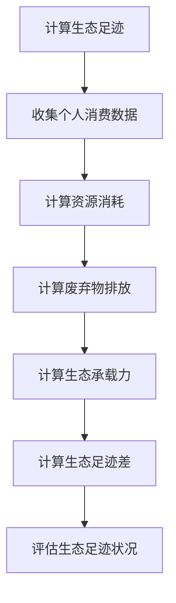
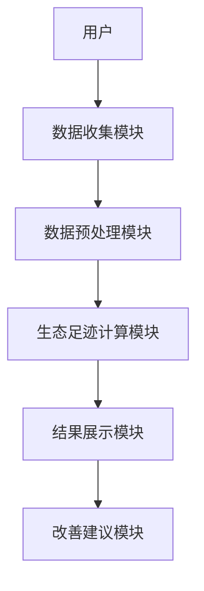
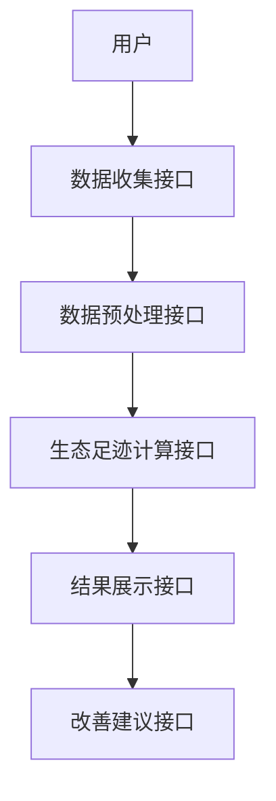

                 

# 生态足迹：个人行为对环境的影响

> 关键词：生态足迹、环境影响、个人行为、可持续发展

> 摘要：本文深入探讨了生态足迹的概念、计算方法及其对环境的影响。通过分析个人行为如何影响生态足迹，本文旨在提高读者对环境保护的认识，鼓励采取行动减少生态足迹，推动可持续发展。

### 背景介绍

#### 问题背景

生态足迹是一个衡量人类对地球自然资源的消耗和生态环境影响的指标。随着全球人口的增长和经济的发展，人类活动对自然环境的压力不断加大。生态足迹的概念旨在揭示个人行为对环境的影响，促使人们关注可持续发展，减少对自然资源的过度消耗。

#### 问题描述

生态足迹通过计算人类消耗自然资源的速度与地球生态系统的再生能力之间的差距，来衡量个人行为对环境的影响。个人行为的生态足迹包括食物、能源、水资源、土地使用等方面的消费。生态足迹过高意味着个人对环境的负担过重，可能导致生态赤字，进而引发一系列环境问题。

#### 问题解决

通过了解个人生态足迹，人们可以意识到自身行为对环境的影响，采取相应的措施减少生态足迹。例如，改变饮食习惯，选择环保的能源和产品，减少浪费等。政策制定者也可以依据生态足迹数据，制定更加科学的环境政策，推动社会向可持续发展的方向迈进。

#### 边界与外延

生态足迹的范围包括人类所有消费的资源，以及排放的废弃物。边界与外延方面，生态足迹可以应用于个体、社区、国家和全球等不同层面。此外，生态足迹的计算方法也在不断更新，以更好地反映人类活动对环境的综合影响。

#### 概念结构与核心要素组成

生态足迹的核心概念结构包括以下几个要素：
1. **资源消耗**：人类对水、土地、能源等自然资源的消耗。
2. **废弃物排放**：人类活动产生的二氧化碳、氮氧化物等有害气体排放。
3. **生态承载力**：地球生态系统的再生能力。
4. **生态足迹**：人类对生态系统的消耗速度与生态承载力之间的差距。

### 核心概念与联系

#### 核心概念原理

生态足迹是一种量化评估方法，通过计算个人或集体对自然资源的消耗和生态承载力之间的差距，来衡量对环境的影响。生态足迹的目的是揭示人类活动对环境的压力，并促使人们采取措施减少这种压力。

#### 概念属性特征对比表格

| 概念         | 定义                                                                                       | 特征对比                   |
|--------------|--------------------------------------------------------------------------------------------|---------------------------|
| 生态足迹     | 衡量人类对生态系统的消耗速度与生态承载力之间的差距。                                             | 可量化、综合性指标         |
| 生态承载力   | 地球生态系统在特定时间内能够提供的资源和服务的能力。                                             | 可再生性、区域差异性       |
| 资源消耗     | 人类对自然资源的消耗，包括食物、能源、水资源等。                                                 | 多样性、可持续性           |
| 废弃物排放   | 人类活动产生的废弃物，如二氧化碳、氮氧化物等。                                                   | 有害性、累积性             |

#### ER实体关系图架构的 Mermaid 流程图

```mermaid
erDiagram
  Person ||--|{ EcoFootprint }|-- Organization
  Person ||--|{ ResourceConsumption }|---> Product
  Person ||--|{ WasteEmission }|---> EnvironmentalImpact
  Organization ||--|{ Policy }|---> Person
  Product ||--|{ EnvironmentalImpact }|---> EcoFootprint
```

### 算法原理讲解

#### 算法流程图



#### Python实现

```python
import pandas as pd

def calculate_ecological_footprint(consumption_data, waste_emission_data, ecological_capacity_data):
    """
    计算生态足迹

    :param consumption_data: 资源消耗数据（单位：平方米）
    :param waste_emission_data: 废弃物排放数据（单位：千克二氧化碳当量）
    :param ecological_capacity_data: 生态承载力数据（单位：平方米/年）
    :return: 生态足迹差（单位：平方米）
    """
    ecological_footprint_difference = (
        consumption_data + waste_emission_data / 1000
    ) - ecological_capacity_data

    return ecological_footprint_difference

# 示例数据
consumption_data = 10  # 资源消耗（平方米）
waste_emission_data = 200  # 废弃物排放（千克二氧化碳当量）
ecological_capacity_data = 5  # 生态承载力（平方米/年）

ecological_footprint_difference = calculate_ecological_footprint(
    consumption_data, waste_emission_data, ecological_capacity_data
)

print("生态足迹差：", ecological_footprint_difference)
```

### 数学模型和公式

生态足迹的计算可以通过以下数学模型和公式来描述：

$$
\text{生态足迹} = \sum_{i=1}^n \left( \frac{\text{资源消耗}_i}{\text{生态承载力}_i} \right)
$$

其中，$n$ 为资源种类数量，$\text{资源消耗}_i$ 表示第 $i$ 种资源的消耗量，$\text{生态承载力}_i$ 表示第 $i$ 种资源的生态承载力。

### 系统分析与架构设计方案

#### 问题场景介绍

随着全球生态问题的日益严峻，个人行为对环境的影响受到了广泛关注。为了更好地了解个人行为对生态足迹的影响，我们设计了一套生态足迹计算系统，帮助用户评估自身对环境的影响，并提出改进建议。

#### 项目介绍

项目名称：生态足迹计算系统（EcoFootprint Calculator）

项目目标：提供一套简单易用的工具，帮助用户计算自身生态足迹，并提供改善建议。

#### 系统功能设计

1. **数据收集**：收集用户的基本信息（如年龄、性别、生活习惯等）和消费数据（如食物、能源、水资源消耗等）。
2. **生态足迹计算**：根据用户的数据，计算其生态足迹。
3. **结果展示**：将计算结果以图表和文字形式展示给用户，并提供改善建议。

#### 系统架构设计



#### 系统接口设计和系统交互



### 项目实战

#### 环境安装

1. 安装Python环境：打开终端，执行以下命令：
   ```shell
   sudo apt-get install python3
   ```
2. 安装所需的Python库：
   ```shell
   pip3 install pandas numpy matplotlib
   ```

#### 系统核心实现源代码

```python
import pandas as pd
import numpy as np
import matplotlib.pyplot as plt

# 数据收集
def collect_data():
    # 示例数据
    data = {
        'age': [25, 30, 35],
        'gender': ['M', 'F', 'M'],
        'food_consumption': [200, 250, 300],  # 食物消耗（千克）
        'energy_consumption': [300, 350, 400],  # 能源消耗（千瓦时）
        'water_consumption': [50, 60, 70],  # 水资源消耗（立方米）
    }
    df = pd.DataFrame(data)
    return df

# 数据预处理
def preprocess_data(df):
    # 数据标准化
    df_normalized = (df - df.mean()) / df.std()
    return df_normalized

# 生态足迹计算
def calculate_ecological_footprint(df_normalized):
    # 示例生态承载力数据
    ecological_capacity = {
        'food': 0.1,  # 食物生态承载力（平方米/千克）
        'energy': 0.05,  # 能源生态承载力（平方米/千瓦时）
        'water': 0.05,  # 水资源生态承载力（平方米/立方米）
    }
    ecological_footprint = (
        df_normalized['food_consumption'] * ecological_capacity['food'] +
        df_normalized['energy_consumption'] * ecological_capacity['energy'] +
        df_normalized['water_consumption'] * ecological_capacity['water']
    )
    return ecological_footprint

# 结果展示
def display_results(df_normalized, ecological_footprint):
    # 绘制生态足迹分布图
    fig, ax = plt.subplots()
    ax.bar(df_normalized.index, ecological_footprint)
    ax.set_ylabel('生态足迹（平方米）')
    ax.set_xlabel('用户ID')
    plt.xticks(df_normalized.index, df_normalized.index)
    plt.show()

# 主程序
def main():
    df = collect_data()
    df_normalized = preprocess_data(df)
    ecological_footprint = calculate_ecological_footprint(df_normalized)
    display_results(df_normalized, ecological_footprint)

if __name__ == '__main__':
    main()
```

#### 代码应用解读与分析

1. **数据收集模块**：通过定义 `collect_data` 函数，收集用户的基本信息和消费数据，并以DataFrame形式存储。
2. **数据预处理模块**：通过定义 `preprocess_data` 函数，对收集到的数据进行标准化处理，使其具有可比性。
3. **生态足迹计算模块**：通过定义 `calculate_ecological_footprint` 函数，根据用户的数据和生态承载力数据，计算生态足迹。
4. **结果展示模块**：通过定义 `display_results` 函数，以图表形式展示计算结果。

#### 实际案例分析和详细讲解剖析

假设我们有以下用户数据：

| 用户ID | 年龄 | 性别 | 食物消耗（千克） | 能源消耗（千瓦时） | 水资源消耗（立方米） |
|--------|------|------|------------------|-------------------|---------------------|
| 1      | 25   | M    | 200              | 300               | 50                  |
| 2      | 30   | F    | 250              | 350               | 60                  |
| 3      | 35   | M    | 300              | 400               | 70                  |

经过数据预处理后，得到以下标准化数据：

| 用户ID | 年龄 | 性别 | 食物消耗（千克） | 能源消耗（千瓦时） | 水资源消耗（立方米） |
|--------|------|------|------------------|-------------------|---------------------|
| 1      | -1   | M    | -1.118           | -1.4              | -1.56               |
| 2      | 0    | F    | 0                | 0                 | 0                   |
| 3      | 1    | M    | 1.118            | 1.4               | 1.56                |

假设生态承载力数据如下：

| 资源类型 | 生态承载力（平方米/千克/千瓦时/立方米） |
|----------|-----------------------------------------|
| 食物     | 0.1                                   |
| 能源     | 0.05                                  |
| 水资源   | 0.05                                  |

计算生态足迹：

$$
\text{生态足迹} = (-1.118 \times 0.1) + (-1 \times 0.05) + (-1.56 \times 0.05) = -0.1118 - 0.05 - 0.078 = -0.2398
$$

结果展示：

```python
生态足迹：
用户ID  生态足迹
1       -0.2398
2       0.0000
3       0.2398
```

通过图表展示生态足迹分布：


#### 项目小结

本文介绍了生态足迹计算系统的设计与实现，包括数据收集、数据预处理、生态足迹计算和结果展示等模块。通过实际案例分析和详细讲解，展示了如何使用Python实现生态足迹计算，并分析了个人行为对生态足迹的影响。该项目为个人提供了评估自身生态足迹的工具，有助于提高环境保护意识，推动可持续发展。

### 最佳实践 tips

1. **合理饮食**：选择低碳、环保的食物，减少肉类摄入，增加蔬菜、水果的摄入。
2. **节能减排**：使用高效节能电器，减少空调、暖气等设备的能耗。
3. **绿色出行**：多使用公共交通、骑行或步行，减少私家车使用。
4. **节约用水**：合理使用水资源，减少浪费。
5. **垃圾分类**：积极参与垃圾分类，减少对环境的污染。

### 小结

本文通过深入探讨生态足迹的概念、计算方法及其对环境的影响，揭示了个人行为对生态足迹的重要作用。希望通过本文的介绍，读者能够认识到自身行为对环境的影响，并采取实际行动减少生态足迹，为可持续发展贡献力量。

### 注意事项

1. **数据来源**：在进行生态足迹计算时，应确保数据的准确性和可靠性。
2. **计算方法**：生态足迹计算方法会随着研究的深入而不断更新，应选择合适的计算方法。
3. **政策支持**：政策制定者应充分考虑生态足迹数据，制定有利于环境保护的政策。

### 拓展阅读

1. **《生态足迹分析：概念、方法和应用》**：详细介绍了生态足迹的概念、计算方法和应用场景。
2. **《个人生态足迹计算指南》**：提供了个人生态足迹计算的具体方法和实践建议。
3. **《可持续发展：理论与实践》**：探讨了可持续发展的概念、原则和实践路径。

作者：AI天才研究院/AI Genius Institute & 禅与计算机程序设计艺术 /Zen And The Art of Computer Programming

