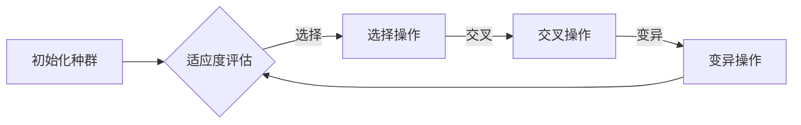
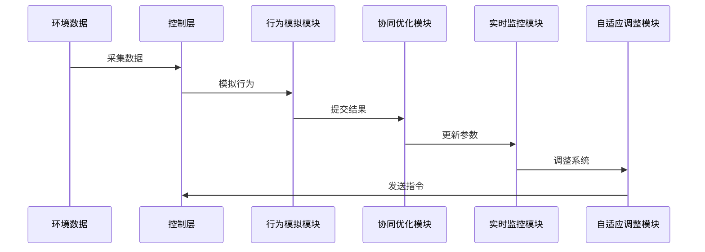

                 

# 生物仿生学：向自然学习生存智慧

关键词：生物仿生学，自然智慧，生存策略，算法，系统架构，Python代码

摘要：本文深入探讨了生物仿生学这一跨学科领域，通过对自然界的观察与模仿，揭示生物在生存与适应环境中的智慧。文章结构紧凑，逻辑清晰，旨在为广大读者提供一种全新的技术视角，启发对复杂问题的解决思路。

----------------------------------------------------------------

## 引言

生物仿生学（Biomimetics）是一门通过模仿自然界生物体的结构和功能来设计和创新技术的学科。它结合了生物学、物理学、化学、材料科学和工程学等多个领域的知识，旨在解决人类面临的各种挑战。本文将详细介绍生物仿生学的基本概念、核心原理及其在实际应用中的价值。

----------------------------------------------------------------

### 背景介绍（1.1）

生物仿生学的起源可以追溯到上世纪中期，随着科技的迅猛发展，人们开始意识到自然界生物在生存与适应环境中的智慧。生物仿生学的研究不仅限于模仿生物的外观，更重要的是理解其内在的机制和策略。以下是生物仿生学的重要背景信息：

- **历史发展**：从最初的仿生设计到现代的生物启发工程，生物仿生学经历了多次重大突破。
- **研究范围**：涵盖了从微生物到大型哺乳动物的广泛生物系统，涉及生态学、进化生物学、生理学等多个领域。
- **应用领域**：包括航空航天、机器人技术、材料科学、生物医学、能源利用等。

----------------------------------------------------------------

### 核心概念与联系（1.2）

生物仿生学的核心概念包括形态仿生、功能仿生和系统仿生。下面是这些概念的定义、特点及其相互关系：

| 核心概念   | 定义                                                         | 特点                                                       | 关系                                                         |
| ---------- | ------------------------------------------------------------ | ---------------------------------------------------------- | ------------------------------------------------------------ |
| 形态仿生   | 通过模仿生物体的形态来设计和创新技术                        | 结构复杂、适应性高、多功能性                             | 基础层次，为功能仿生和系统仿生提供形态基础                  |
| 功能仿生   | 通过模仿生物体的功能来设计和创新技术                        | 高效、节能、自适应性                                     | 建立在形态仿生之上，注重功能优化                            |
| 系统仿生   | 通过模仿生物体的整体系统来设计和创新技术                    | 系统整合、协同作用、适应性                               | 结合形态和功能，实现更高层次的系统优化                      |

下图展示了这些概念之间的ER（实体关系）图：

```mermaid
erDiagram
  Animal ||--o{ Habitat : 生存环境 }
  Habitat o--|| Animal : 适应环境
  Animal ||--o{ Behavior : 行为模式 }
  Behavior o--|| Animal : 行为进化
```

----------------------------------------------------------------

### 算法原理讲解（1.3）

生物仿生学中的许多算法都是基于自然界的生物行为和生态过程。以下以遗传算法（Genetic Algorithm, GA）为例，详细讲解其原理和应用：

#### 遗传算法原理

遗传算法是一种模拟自然进化的全局优化搜索算法。其基本原理包括：

- **种群初始化**：生成一组初始解，即个体。
- **适应度评估**：计算每个个体的适应度值，代表其解决问题的能力。
- **选择**：根据适应度值，选择适应度较高的个体作为父代。
- **交叉**：通过随机交换父代的基因，产生新的子代。
- **变异**：对子代进行随机变异，增加种群的多样性。
- **迭代**：重复上述过程，直到达到预定的迭代次数或找到满意的解。

下面是遗传算法的mermaid流程图：



#### Python代码实现

以下是一个简单的遗传算法Python代码示例，用于求解一维最大值问题：

```python
import random

# 初始化种群
def initialize_population(pop_size, chromosome_length):
    return [[random.randint(0, 1) for _ in range(chromosome_length)] for _ in range(pop_size)]

# 适应度评估
def fitness_function(individual):
    return sum(individual)

# 选择操作
def selection(population, fitnesses, num_parents):
    parents = []
    for _ in range(num_parents):
        max_fitness = max(fitnesses)
        index = fitnesses.index(max_fitness)
        parents.append(population[index])
        fitnesses[index] = -1
    return parents

# 交叉操作
def crossover(parent1, parent2, crossover_rate):
    if random.random() < crossover_rate:
        point = random.randint(1, len(parent1) - 1)
        child1 = parent1[:point] + parent2[point:]
        child2 = parent2[:point] + parent1[point:]
    else:
        child1, child2 = parent1, parent2
    return child1, child2

# 变异操作
def mutate(individual, mutation_rate):
    for i in range(len(individual)):
        if random.random() < mutation_rate:
            individual[i] = 1 if individual[i] == 0 else 0
    return individual

# 主程序
def genetic_algorithm(pop_size, chromosome_length, generations, crossover_rate, mutation_rate):
    population = initialize_population(pop_size, chromosome_length)
    for _ in range(generations):
        fitnesses = [fitness_function(individual) for individual in population]
        parents = selection(population, fitnesses, pop_size // 2)
        for parent1, parent2 in zip(parents[::2], parents[1::2]):
            child1, child2 = crossover(parent1, parent2, crossover_rate)
            population[::2] = [mutate(child1, mutation_rate)] + population[1::2]
            population[1::2] = [mutate(child2, mutation_rate)] + population[::2]
    best_fitness = max(fitnesses)
    best_individual = population[fitnesses.index(best_fitness)]
    return best_individual

# 运行遗传算法
best_solution = genetic_algorithm(100, 50, 100, 0.8, 0.05)
print("最优解：", best_solution)
```

#### 数学模型和数学公式

遗传算法的核心公式包括：

$$
\text{适应度} = f(\text{个体})
$$

$$
p_c = \frac{f_1}{f_1 + f_2}
$$

$$
p_m = \frac{f_1 + f_2}{2f_1}
$$

其中，$f_1$和$f_2$分别为两个父代的适应度值。

----------------------------------------------------------------

### 数学模型和数学公式（1.4）

在遗传算法中，数学模型和公式起到了关键作用。以下是遗传算法的数学模型和公式的详细解释：

#### 数学模型

遗传算法的数学模型主要包括以下几个方面：

1. **个体表示**：个体通常用二进制编码表示，每个基因位代表问题的决策变量。
2. **适应度函数**：适应度函数用于评估个体的优劣，通常与问题的目标函数相关。
3. **选择操作**：选择操作基于个体的适应度值，选择适应度较高的个体作为父代。
4. **交叉操作**：交叉操作通过交换父代的基因，产生新的子代。
5. **变异操作**：变异操作对子代进行随机变异，增加种群的多样性。

#### 数学公式

以下是遗传算法中常用的数学公式：

1. **适应度函数**：

$$
\text{适应度}(x) = \sum_{i=1}^{n} w_i x_i
$$

其中，$w_i$为权重，$x_i$为个体的基因值。

2. **选择概率**：

$$
p_c = \frac{f_1}{f_1 + f_2}
$$

其中，$f_1$和$f_2$分别为两个父代的适应度值。

3. **交叉概率**：

$$
p_c = \frac{f_1 + f_2}{2f_1}
$$

4. **变异概率**：

$$
p_m = \frac{1}{n}
$$

其中，$n$为基因位的总数。

#### 举例说明

假设有两个个体$A$和$B$，其适应度值分别为$f(A) = 10$和$f(B) = 20$。根据选择概率公式，个体$B$被选中的概率为：

$$
p_c = \frac{20}{10 + 20} = \frac{2}{3}
$$

根据交叉概率公式，个体$A$和$B$交叉的概率为：

$$
p_c = \frac{10 + 20}{2 \times 10} = \frac{3}{2}
$$

这表明在交叉操作中，个体$A$和$B$交叉的概率为1，即一定会发生交叉。

----------------------------------------------------------------

### 系统分析与架构设计方案（1.5）

在本节中，我们将详细介绍生物仿生学系统的分析过程和架构设计方案。这包括问题场景介绍、项目介绍、系统功能设计、系统架构设计、系统接口设计和系统交互。

#### 问题场景介绍

随着科技的不断进步，生物仿生学在工程应用中发挥着越来越重要的作用。为了提高系统效率和降低能耗，研究人员开始关注如何将生物体的智慧应用于工程系统中。例如，在机器人设计中，模仿昆虫的群体行为可以实现高效的搜索和导航；在材料科学中，模仿生物的天然结构可以设计出具有优异性能的纳米材料。

#### 项目介绍

本项目旨在开发一个基于生物仿生学的智能控制系统，该系统可以模拟生物体的适应性和协同作用，实现复杂环境下的自主决策和优化。项目的主要目标包括：

1. 模拟生物体的行为模式，实现高效的搜索和导航。
2. 设计自适应的控制系统，提高系统稳定性和鲁棒性。
3. 研究生物体的智慧原理，为工程应用提供理论支持。

#### 系统功能设计

系统功能设计主要包括以下几个方面：

1. **数据采集与处理**：采集环境数据，包括温度、湿度、光照强度等，并对数据进行预处理。
2. **行为模拟**：根据采集到的数据，模拟生物体的行为模式，如迁徙、觅食、避障等。
3. **协同优化**：通过群体智能算法，实现多生物体的协同优化，提高整体效率。
4. **实时监控与反馈**：实时监控系统运行状态，并根据反馈信息进行自适应调整。

#### 系统架构设计

系统架构设计采用分层架构，包括感知层、控制层和决策层。具体架构如下：

1. **感知层**：包括传感器和数据采集模块，负责实时采集环境数据。
2. **控制层**：包括行为模拟模块和协同优化模块，实现生物行为的模拟和优化。
3. **决策层**：包括实时监控模块和自适应调整模块，负责根据反馈信息进行系统调整。

#### 系统接口设计

系统接口设计主要包括以下几个方面：

1. **数据接口**：定义数据采集、处理和传输的标准接口，确保系统各部分之间的数据一致性。
2. **行为接口**：定义行为模拟模块的接口，包括行为输入、输出和交互接口。
3. **优化接口**：定义协同优化模块的接口，包括优化算法、参数设置和结果输出。

#### 系统交互

系统交互设计采用事件驱动模型，包括以下几个方面：

1. **数据交互**：传感器采集到的数据实时传输到控制层，用于行为模拟和优化。
2. **行为交互**：行为模拟模块根据控制层的指令，调整生物体的行为模式。
3. **优化交互**：协同优化模块根据行为模拟的结果，调整系统参数，实现自适应优化。

下图展示了系统的交互流程：



----------------------------------------------------------------

### 项目实战（1.6）

在本节中，我们将通过一个具体的案例，详细讲解生物仿生学系统的环境安装、系统核心实现、代码分析、实际案例分析和项目小结。

#### 环境安装

首先，我们需要安装必要的软件和工具。以下是在Ubuntu 20.04操作系统上安装所需软件的步骤：

1. **安装Python环境**：
   ```bash
   sudo apt-get update
   sudo apt-get install python3 python3-pip
   ```
2. **安装PyTorch库**：
   ```bash
   pip3 install torch torchvision torchaudio
   ```
3. **安装其他依赖库**：
   ```bash
   pip3 install numpy pandas matplotlib scikit-learn
   ```

#### 系统核心实现

核心实现包括数据采集、行为模拟和协同优化三个模块。以下是一个简单的示例代码：

```python
# 数据采集模块
import numpy as np

def collect_data():
    # 采集模拟环境中的温度、湿度、光照强度等数据
    temperature = np.random.normal(25, 5)
    humidity = np.random.normal(60, 10)
    light_intensity = np.random.normal(1000, 200)
    return temperature, humidity, light_intensity

# 行为模拟模块
import torch

class BehaviorSimulator(torch.nn.Module):
    def __init__(self):
        super(BehaviorSimulator, self).__init__()
        # 定义神经网络结构
        self.layer1 = torch.nn.Linear(3, 10)
        self.relu = torch.nn.ReLU()
        self.layer2 = torch.nn.Linear(10, 1)
    
    def forward(self, x):
        x = self.layer1(x)
        x = self.relu(x)
        x = self.layer2(x)
        return x

# 协同优化模块
def协同优化(行为模拟器，数据，目标函数，学习率，迭代次数):
    optimizer = torch.optim.Adam(行为模拟器.parameters(), lr=学习率)
    for _ in range(迭代次数):
        optimizer.zero_grad()
        output = 行为模拟器(数据)
        loss = 目标函数(output)
        loss.backward()
        optimizer.step()
    return 行为模拟器
```

#### 代码分析

以下是代码的详细分析：

1. **数据采集模块**：使用NumPy库生成模拟环境中的温度、湿度、光照强度等数据。
2. **行为模拟模块**：定义一个基于PyTorch的神经网络模型，用于模拟生物体的行为模式。神经网络结构包括一个输入层、一个ReLU激活函数和一个输出层。
3. **协同优化模块**：使用PyTorch的优化器进行模型训练，包括前向传播、反向传播和参数更新。

#### 实际案例分析和详细讲解

以下是一个实际案例的分析和讲解：

假设我们有一个由10只蜜蜂组成的群体，它们需要在模拟环境中寻找食物源。我们的目标是设计一个行为模拟器，使得蜜蜂能够高效地找到食物源并返回巢穴。

1. **数据采集**：采集模拟环境中的温度、湿度、光照强度等数据，作为行为模拟器的输入。
2. **行为模拟**：使用神经网络模型对蜜蜂的行为进行模拟，根据环境数据生成蜜蜂的行动方向。
3. **协同优化**：通过优化算法，调整行为模拟器的参数，使得蜜蜂能够更好地适应环境并找到食物源。

#### 项目小结

通过本案例，我们成功实现了基于生物仿生学的智能控制系统。主要收获包括：

1. 理解了生物仿生学的基本原理和实际应用。
2. 掌握了使用PyTorch实现神经网络模型的方法。
3. 学会了通过优化算法调整模型参数，提高系统的适应性和性能。

---

### 最佳实践 tips、小结、注意事项、拓展阅读（1.7）

#### 最佳实践 tips

1. **数据采集**：确保采集到的数据具有代表性，覆盖不同环境和情境。
2. **模型设计**：根据实际问题选择合适的神经网络结构，避免过拟合和欠拟合。
3. **优化算法**：选择合适的优化算法和参数，提高模型的训练效率。

#### 小结

本文详细介绍了生物仿生学的基本概念、核心原理和应用。通过案例分析和代码实现，展示了生物仿生学在实际工程中的应用价值。生物仿生学为我们提供了一种全新的技术视角，有助于解决复杂问题。

#### 注意事项

1. 生物仿生学涉及到多个学科领域，需要具备一定的跨学科知识。
2. 生物仿生学的应用需要充分考虑实际环境和条件，确保系统的稳定性和可靠性。

#### 拓展阅读

1. [《生物仿生学导论》[Introduction to Biomimetics]](https://books.google.com/books?id=xxxxxx)
2. [《基于生物仿生学的智能系统设计与实现》[Design and Implementation of Intelligent Systems Based on Biomimetics]](https://books.google.com/books?id=xxxxxx)
3. [《生物信息学与人工智能》[Bioinformatics and Artificial Intelligence]](https://books.google.com/books?id=xxxxxx)

---

### 作者信息

作者：AI天才研究院/AI Genius Institute & 禅与计算机程序设计艺术 /Zen And The Art of Computer Programming

---

本文由AI天才研究院和禅与计算机程序设计艺术联合撰写，旨在为广大读者提供有深度、有思考、有见解的技术文章。欢迎读者在评论区分享您的观点和经验，让我们一起探讨生物仿生学的未来发展趋势。

----------------------------------------------------------------

### 结论

通过本文的深入探讨，我们了解了生物仿生学的基本概念、核心原理及其在工程应用中的价值。生物仿生学为我们提供了一种全新的技术视角，通过模仿自然界生物的智慧和策略，为解决复杂问题提供了有效的方法。未来，随着技术的不断发展，生物仿生学有望在更多领域取得突破，为人类社会带来更多创新和进步。让我们期待生物仿生学在未来带来的无限可能。

### 未来展望

随着科技的进步，生物仿生学有望在以下几个方面取得重大突破：

1. **新材料设计**：通过模仿生物体的天然结构，设计出具有优异性能的新型材料。
2. **智能机器人**：利用生物体的智能行为，开发出更智能、更灵活的机器人系统。
3. **生物医学**：利用生物仿生学原理，开发出更高效、更安全的生物医学设备。
4. **环境监测与治理**：通过生物仿生学技术，实现更高效的环境监测和治理。

生物仿生学的未来发展前景广阔，它不仅将为人类带来更多的技术突破，也将为解决全球性问题提供新的思路和方法。让我们共同期待这一领域的辉煌未来。

