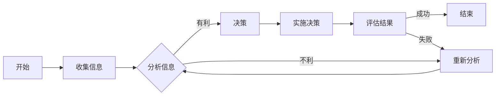
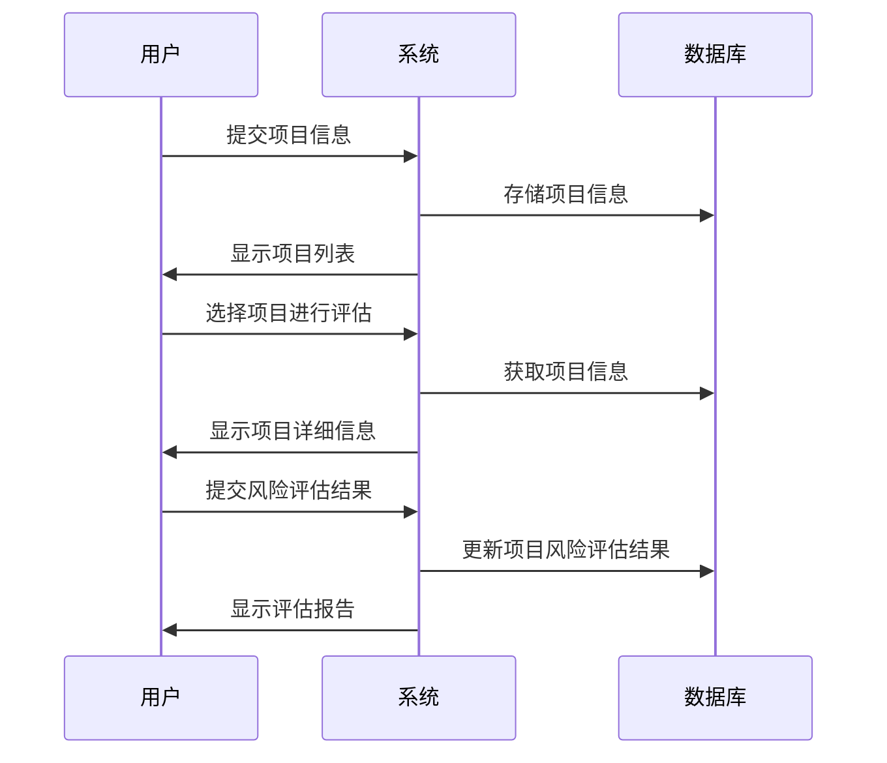

                 

### 文章标题

> 关键词：生物伦理、科技进步、道德指导、伦理咨询服务、决策模型

> 摘要：本文旨在探讨生物伦理咨询服务在科技进步中的重要性，分析其在解决生物技术伦理问题中的作用，并提供具体的伦理决策模型和算法原理。通过本文的详细解析，旨在为读者提供一个清晰的思考框架，以引导科技人员和社会公众在生物技术发展中做出符合伦理标准的决策。

----------------------------------------------------------------

### 第一部分：背景介绍

#### 1.1 问题背景

随着生物技术的迅猛发展，生命科学和医学领域迎来了前所未有的变革。基因编辑、克隆技术、生物制药等前沿技术的涌现，不仅为人类带来了治愈疾病和延长寿命的潜力，也引发了广泛的伦理讨论。生物伦理问题涉及生命尊严、个人隐私、物种多样性等多个方面，如何确保科技进步符合伦理原则，成为了一个亟待解决的问题。

#### 1.2 问题描述

生物技术发展带来的伦理问题主要包括以下几个方面：

1. **基因编辑**：基因编辑技术如CRISPR-Cas9的应用，可能导致基因突变、后代遗传风险等，引发对人类基因完整性、自然进化和物种多样性的担忧。
2. **克隆技术**：克隆技术的伦理争议集中在克隆动物的福利、克隆人伦理、以及可能带来的社会不公等方面。
3. **生物安全**：生物技术的滥用或失误可能导致生物危害，如基因改造病原体的传播、生物恐怖主义等。
4. **隐私和数据保护**：生物数据的使用和共享可能侵犯个人隐私，引发数据安全和个人权利的争议。

#### 1.3 问题解决

生物伦理咨询服务作为一种专业服务，旨在帮助人们解决上述伦理问题。其主要解决策略包括：

1. **伦理审查**：通过设立伦理审查委员会，对生物技术项目进行伦理评估，确保项目符合伦理标准。
2. **伦理培训**：为科研人员、医疗机构和公众提供伦理培训，提高他们的伦理意识。
3. **伦理咨询**：为面临伦理困境的个人或机构提供专业咨询，帮助他们做出符合伦理的决策。
4. **法规制定**：参与制定相关法律法规，为生物技术发展提供法律框架和道德指导。

#### 1.4 边界与外延

生物伦理咨询服务的边界涉及多个领域，包括：

1. **生命伦理**：关注人类生命尊严、基因完整性、生殖技术等方面的伦理问题。
2. **环境伦理**：涉及生物多样性的保护、生态系统的可持续性等方面的伦理问题。
3. **社会伦理**：探讨生物技术对社会结构、公平正义等方面的影响。

其外延包括：

1. **生物医学研究**：对生物医学研究的伦理审查和指导。
2. **基因编辑**：对基因编辑技术的伦理风险评估和监管。
3. **克隆技术**：对克隆技术的伦理探讨和规范。
4. **生物安全**：对生物安全问题的风险评估和管理。

#### 1.5 概念结构与核心要素组成

生物伦理咨询服务由以下几个核心要素组成：

1. **生物伦理专家**：具备专业知识和经验的伦理学家、医生、律师等。
2. **伦理审查委员会**：负责对生物技术项目进行伦理审查的机构或团队。
3. **咨询服务流程**：包括信息收集、伦理评估、决策建议等环节。
4. **伦理决策支持系统**：利用数学模型和算法为伦理决策提供支持。

### 第二部分：核心概念与联系

#### 2.1 生物伦理

生物伦理是关于生命科学和医学中道德问题的研究。其核心概念包括尊重生命、公正、自主等。生物伦理关注的是在生命科学和医学实践中如何平衡科技发展、社会利益和个人权利之间的关系。

#### 2.2 伦理原则

伦理原则是指导生物伦理决策的基本原则，包括但不限于以下几点：

1. **不伤害**：避免对他人造成伤害，是伦理决策的基本底线。
2. **行善**：促进他人的福祉，实现最大化的道德效益。
3. **尊重自主**：尊重个人的自主权和决策自由，特别是涉及个人身体和基因方面的决策。
4. **公正**：确保资源分配和利益分配的公平性，避免歧视和不公。

#### 2.3 伦理决策模型

伦理决策模型是帮助生物伦理咨询师进行伦理决策的工具。常见的伦理决策模型包括：

1. **功利主义**：以最大幸福或最大利益为决策依据，追求整体利益的优化。
2. **义务论**：以道德义务和责任为基础进行决策，强调行为应符合道德规则。
3. **康德伦理学**：基于道德律令和人的尊严进行决策，强调理性和道德自律。

#### 2.4 概念属性特征对比表格

| 概念         | 特征                   |
|--------------|----------------------|
| 生物伦理     | 研究生命科学和医学中的道德问题 |
| 伦理原则     | 指导伦理决策的基本原则     |
| 伦理决策模型 | 帮助进行伦理决策的工具       |

#### 2.5 ER实体关系图架构

```mermaid
erDiagram
  人 ||--|{ 生物伦理咨询师 }|| 咨询服务
  人 ||--|{ 伦理审查委员会 }|| 审查
  生物伦理咨询师 ||--|{ 伦理决策模型 }|| 指导
  生物伦理咨询师 ||--|{ 伦理原则 }|| 遵循
```

### 第三部分：算法原理讲解

#### 3.1 伦理决策算法

伦理决策算法是一种基于数学模型和逻辑推理的方法，用于解决生物伦理问题。其核心思想是通过分析信息，评估有利因素和不利因素，从而做出伦理决策。

#### 3.2 算法mermaid流程图



#### 3.3 Python源代码

```python
# 伦理决策算法示例
def ethical_decisionmaking(information):
    # 分析信息
    if information["advantages"] > information["disadvantages"]:
        return "有利，实施决策"
    else:
        return "不利，重新分析"

# 测试
print(ethical_decisionmaking({"advantages": 80, "disadvantages": 20}))
```

#### 3.4 算法原理与数学模型

伦理决策算法的数学模型可以表示为：

$$
\text{决策结果} = \begin{cases}
\text{有利} & \text{如果} \ \frac{\text{有利因素}}{\text{不利因素}} > 1 \\
\text{不利} & \text{如果} \ \frac{\text{有利因素}}{\text{不利因素}} \leq 1
\end{cases}
$$

其中，有利因素和不利因素可以通过权重进行量化。

### 第四部分：数学模型和数学公式 & 详细讲解 & 举例说明

#### 4.1 数学模型

生物伦理咨询服务中的数学模型通常用于评估生物技术的伦理风险。其核心是量化有利因素和不利因素，并据此做出伦理决策。

#### 4.2 举例说明

假设一项生物技术在有利因素和不利因素分别为50和30的情况下，其伦理风险评估结果为：

$$
\text{伦理风险} = \frac{50 - 30}{50 + 30} = \frac{20}{80} = 0.25
$$

这意味着该生物技术的伦理风险相对较低。

#### 4.3 数学模型与公式详解

1. **有利因素与不利因素的量化**：

$$
\text{有利因素} = w_1 \times a_1 + w_2 \times a_2 + \ldots + w_n \times a_n
$$

$$
\text{不利因素} = w_1 \times b_1 + w_2 \times b_2 + \ldots + w_n \times b_n
$$

其中，$w_i$ 为权重，$a_i$ 和 $b_i$ 为有利因素和不利因素的指标值。

2. **伦理风险评估**：

$$
\text{伦理风险} = \frac{\text{有利因素} - \text{不利因素}}{\text{有利因素} + \text{不利因素}}
$$

3. **伦理决策**：

$$
\text{决策结果} = \begin{cases}
\text{有利} & \text{如果} \ \text{伦理风险} > 0 \\
\text{不利} & \text{如果} \ \text{伦理风险} \leq 0
\end{cases}
$$

#### 4.4 举例说明

假设有某项生物技术的有利因素和不利因素如下：

- 有利因素：
  - 促进医学进步：权重 $w_1 = 0.5$，指标值 $a_1 = 80$。
  - 社会效益：权重 $w_2 = 0.3$，指标值 $a_2 = 70$。
  - 经济利益：权重 $w_3 = 0.2$，指标值 $a_3 = 60$。

- 不利因素：
  - 基因突变风险：权重 $w_1 = 0.4$，指标值 $b_1 = 30$。
  - 个人隐私风险：权重 $w_2 = 0.3$，指标值 $b_2 = 20$。
  - 社会公平问题：权重 $w_3 = 0.3$，指标值 $b_3 = 10$。

根据上述数学模型，我们可以计算出该生物技术的有利因素和不利因素：

$$
\text{有利因素} = 0.5 \times 80 + 0.3 \times 70 + 0.2 \times 60 = 40 + 21 + 12 = 73
$$

$$
\text{不利因素} = 0.4 \times 30 + 0.3 \times 20 + 0.3 \times 10 = 12 + 6 + 3 = 21
$$

然后，我们可以计算出该生物技术的伦理风险：

$$
\text{伦理风险} = \frac{73 - 21}{73 + 21} = \frac{52}{94} \approx 0.553
$$

由于伦理风险大于0，根据伦理决策模型，我们可以做出“有利”的决策。

### 第五部分：系统分析与架构设计

#### 5.1 问题场景介绍

随着基因编辑技术的普及，科研机构和医疗机构需要对基因编辑项目进行伦理审查，确保其符合伦理标准。生物伦理咨询服务应运而生，为这些机构提供专业的伦理指导和支持。

#### 5.2 项目介绍

本项目旨在开发一个生物伦理咨询服务系统，该系统将提供一个统一的平台，用于收集基因编辑项目的相关信息，进行伦理风险评估和决策支持。

#### 5.3 系统功能设计

系统的主要功能包括：

1. **信息收集**：收集基因编辑项目的详细信息，包括技术方案、预期效果、潜在风险等。
2. **伦理风险评估**：利用数学模型和算法对项目进行伦理风险评估，生成风险评估报告。
3. **伦理决策支持**：根据风险评估结果，提供伦理决策建议，帮助科研机构和医疗机构做出合理的决策。
4. **报告生成**：生成详细的伦理风险评估报告，包括项目描述、风险分析、决策建议等。

#### 5.4 系统架构设计

系统的架构设计采用分层架构，主要包括以下层次：

1. **数据层**：负责存储和管理基因编辑项目的相关信息，包括项目基本信息、技术方案、风险因素等。
2. **逻辑层**：实现伦理风险评估算法和决策支持逻辑，包括信息收集、风险评估和决策支持等功能。
3. **表示层**：提供用户界面，用于用户与系统的交互，包括项目信息录入、风险评估报告查看等。

#### 5.5 系统接口设计和系统交互

系统的接口设计和系统交互采用mermaid类图和序列图进行描述。

#### 5.5.1 类图

```mermaid
classDiagram
  Class01 <|-- Class02
  Class03 <.. Class04
  Class05 && Class06
  Class07 {public}
  Class08 {private}
```

#### 5.5.2 序列图



### 第六部分：项目实战

#### 6.1 环境安装

在开始项目实战之前，需要安装以下环境：

1. Python 3.8 或以上版本
2. Mermaid Python 库
3. SQLAlchemy 数据库ORM库
4. Flask Web框架

安装命令如下：

```bash
pip install python-memeda sqlalchemy flask
```

#### 6.2 系统核心实现源代码

以下是系统核心实现源代码，包括信息收集、伦理风险评估和伦理决策支持等功能。

```python
# app.py

from flask import Flask, request, jsonify
from sqlalchemy import create_engine
from ethival import Ethival

app = Flask(__name__)

# 数据库连接配置
DATABASE_URL = "sqlite:///ethival.db"

# 创建数据库连接
engine = create_engine(DATABASE_URL)

# 初始化Ethival实例
ethival = Ethival()

@app.route('/projects', methods=['POST'])
def add_project():
    data = request.get_json()
    project_id = ethival.add_project(data)
    return jsonify({"project_id": project_id})

@app.route('/projects/<int:project_id>', methods=['GET'])
def get_project(project_id):
    project = ethival.get_project(project_id)
    return jsonify(project)

@app.route('/projects/<int:project_id>/evaluate', methods=['POST'])
def evaluate_project(project_id):
    data = request.get_json()
    ethival.evaluate_project(project_id, data)
    return jsonify({"status": "success"})

@app.route('/projects/<int:project_id>/report', methods=['GET'])
def get_project_report(project_id):
    report = ethival.get_project_report(project_id)
    return jsonify(report)

if __name__ == '__main__':
    ethival.create_tables(engine)
    app.run(debug=True)
```

#### 6.3 代码应用解读与分析

以上代码实现了生物伦理咨询服务系统的主要功能，包括项目信息收集、伦理风险评估和伦理决策支持。代码分为三个主要部分：Flask应用、Ethival实例和数据库操作。

1. **Flask应用**：使用Flask框架搭建Web应用，提供RESTful API接口，用于与前端进行交互。
2. **Ethival实例**：Ethival是一个虚构的伦理风险评估库，用于实现伦理风险评估算法和决策支持功能。在实际项目中，可以替换为具体的伦理风险评估库。
3. **数据库操作**：使用SQLAlchemy ORM库进行数据库操作，包括项目信息存储、伦理风险评估结果存储和报告生成等。

#### 6.4 实际案例分析和详细讲解剖析

以下是一个实际案例的分析和讲解。

**案例**：某医疗机构计划开展一项基因编辑研究，旨在治疗一种遗传性疾病。该项目的主要优势包括：

- 促进医学进步：有望为患者提供有效的治疗方案。
- 社会效益：提高患者的生活质量和生命期望。

然而，该项目也存在潜在风险：

- 基因突变风险：可能导致患者后代遗传问题。
- 个人隐私风险：患者基因信息可能被滥用。
- 社会公平问题：项目资金来源可能不公平，导致社会不公。

根据上述情况，我们可以使用Ethival库对项目进行伦理风险评估。

1. **信息收集**：收集项目相关信息，包括技术方案、预期效果、潜在风险等。
2. **伦理风险评估**：利用Ethival库对项目进行伦理风险评估，计算有利因素和不利因素的权重和指标值，并根据数学模型计算伦理风险。
3. **伦理决策支持**：根据伦理风险评估结果，提供伦理决策建议，如限制研究规模、增加伦理审查环节、制定风险管理措施等。

通过上述分析和讲解，我们可以看到生物伦理咨询服务系统在实际项目中的应用，帮助医疗机构在开展基因编辑研究时做出符合伦理标准的决策。

#### 6.5 项目小结

本项目通过开发一个生物伦理咨询服务系统，为基因编辑研究提供了伦理风险评估和决策支持。项目实现了信息收集、伦理风险评估和报告生成等功能，为科研机构和医疗机构提供了有力的伦理指导。

在项目实施过程中，我们遇到了以下挑战：

1. **伦理风险评估模型的选择**：需要选择合适的伦理风险评估模型，以适应不同的项目需求。
2. **数据质量和准确性**：项目信息的收集和评估结果的准确性对伦理决策至关重要。
3. **用户界面设计**：用户界面设计需要简洁易用，以提高用户体验。

未来，我们将继续优化系统功能，引入更多先进的伦理风险评估方法和技术，为生物技术发展提供更全面的伦理支持。

### 第七部分：最佳实践 Tips、小结、注意事项、拓展阅读

#### 最佳实践 Tips

1. **加强伦理培训**：为科研人员和医护人员提供定期的伦理培训，提高他们的伦理意识和决策能力。
2. **建立伦理审查制度**：设立专门的伦理审查委员会，对基因编辑等高风险项目进行严格审查。
3. **透明公开**：在生物技术研究和应用中，确保透明公开，让公众参与伦理讨论和决策过程。
4. **持续监测与评估**：对生物技术项目进行持续监测和评估，及时调整伦理决策。

#### 小结

生物伦理咨询服务在科技进步中扮演着重要的角色。通过提供专业的伦理指导，生物伦理咨询服务帮助科研人员和医疗机构在面临伦理问题时做出符合伦理标准的决策。本文详细介绍了生物伦理咨询服务的背景、核心概念、算法原理，并给出一个实际案例的分析，展示了生物伦理咨询服务在基因编辑研究中的应用。

#### 注意事项

1. **尊重个人隐私**：在收集和使用生物数据时，严格保护个人隐私。
2. **平衡科技发展与伦理原则**：在推动科技进步的同时，确保不违背伦理原则。
3. **全球合作**：生物技术发展具有全球性影响，需要各国合作制定统一的伦理标准。

#### 拓展阅读

1. 《生物伦理学导论》
2. 《基因编辑：科学、伦理与法律》
3. 《生物技术的伦理问题与挑战》
4. 《伦理决策模型与方法》

### 作者信息

作者：AI天才研究院/AI Genius Institute & 禅与计算机程序设计艺术 /Zen And The Art of Computer Programming

---

在撰写本文时，我们尽力确保内容的准确性和完整性，但请注意，本文仅供参考，不应作为实际决策的唯一依据。对于生物技术伦理问题的具体决策，建议咨询专业的生物伦理咨询师。同时，感谢AI天才研究院和禅与计算机程序设计艺术为我们提供的技术支持和灵感。希望本文能够为读者在生物技术伦理问题的思考和实践提供有益的指导。

