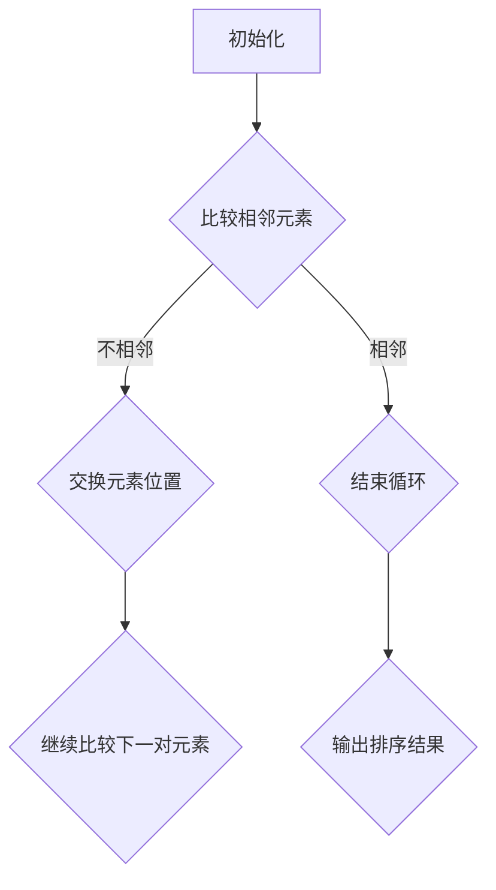

                 

# 生物伦理咨询热线：科技伦理的即时指导服务

## 摘要

随着科技的飞速发展，生物伦理问题日益突出，如何在复杂的科技伦理问题中找到合理的解决方案成为当务之急。本文旨在探讨生物伦理咨询热线的概念、作用及其实际应用。我们将逐步分析科技伦理的背景与挑战，介绍生物伦理咨询的核心概念，阐述科技伦理问题的算法分析与数学模型，系统设计生物伦理咨询热线，并通过项目实战展示其实际应用效果。最后，我们将总结最佳实践、注意事项及拓展阅读，为读者提供全面的指导服务。

## 目录大纲

### 1. 科技伦理的背景与挑战
   - 1.1 伦理学与科技发展的关系
   - 1.2 科技伦理的定义与分类
   - 1.3 生物伦理咨询的热线服务

### 2. 生物伦理咨询的核心概念
   - 2.1 生物伦理的基本原则
   - 2.2 核心概念对比表格
   - 2.3 生物伦理的ER实体关系图

### 3. 科技伦理问题的算法分析
   - 3.1 算法原理介绍
   - 3.2 算法mermaid流程图
   - 3.3 Python源代码实现
   - 3.4 算法原理讲解

### 4. 科技伦理问题中的数学模型
   - 4.1 数学模型的基本概念
   - 4.2 使用LaTeX格式的数学公式
   - 4.3 数学模型的应用讲解

### 5. 生物伦理咨询热线的系统设计
   - 5.1 问题描述
   - 5.2 系统功能设计
   - 5.3 系统架构设计
   - 5.4 系统接口设计
   - 5.5 系统交互设计

### 6. 生物伦理咨询热线实战
   - 6.1 环境安装
   - 6.2 系统核心实现
   - 6.3 代码应用解读
   - 6.4 实际案例分析
   - 6.5 项目小结

### 7. 总结与展望
   - 7.1 最佳实践 tips
   - 7.2 小结
   - 7.3 注意事项
   - 7.4 拓展阅读

## 第1章：科技伦理的背景与挑战

### 1.1 伦理学与科技发展的关系

伦理学作为一门研究道德规范和价值观的学科，与科技发展息息相关。随着科技的不断进步，人类在享受科技带来的便利和福利的同时，也面临着诸多伦理挑战。例如，基因编辑技术的出现引发了关于人类基因伦理的讨论，人工智能的发展带来了隐私保护和机器决策伦理的问题。

伦理学不仅为科技发展提供了道德规范和指导原则，还帮助我们评估科技带来的潜在风险和影响。在科技伦理的研究中，伦理学家和科技专家共同探讨如何在技术进步的同时，保护人类的基本权利和尊严。

### 1.2 科技伦理的定义与分类

科技伦理是指研究科技活动中的道德规范和价值取向的学科。它包括以下几个主要领域：

- **环境伦理**：研究人类活动对自然环境的影响，以及如何采取负责任的行动来保护环境。
- **生命伦理**：涉及人类生命、健康、遗传和医学等领域的伦理问题，如基因编辑、安乐死和医学研究。
- **信息伦理**：关注信息技术对社会和个人隐私的影响，如网络安全、数据保护和信息共享。
- **军事与武器伦理**：探讨武器开发和使用中的道德问题，如核武器、生物武器和人道主义武器。

### 1.3 生物伦理咨询的热线服务

生物伦理咨询热线是一种提供即时指导服务的平台，旨在帮助人们解决在生物技术领域遇到的伦理问题。这种热线服务通常由专业的生物伦理学专家和科技顾问组成，他们具备丰富的知识和经验，能够为各种复杂的生物伦理问题提供咨询和指导。

生物伦理咨询热线的作用主要包括：

- **问题诊断**：帮助用户识别和明确他们所面临的伦理问题。
- **方案建议**：为用户提供合理的解决方案，帮助他们在遵守道德规范的前提下，实现技术目标。
- **决策支持**：为涉及重大伦理决策的项目提供专业意见，确保项目在道德和法律的框架内进行。

生物伦理咨询热线的工作模式通常包括以下几个步骤：

1. **问题接收**：用户通过电话、电子邮件或其他渠道向热线咨询。
2. **问题分析**：咨询专家对用户提出的问题进行初步分析，了解问题的背景和细节。
3. **解决方案建议**：根据问题的性质和复杂性，咨询专家为用户提供建议和解决方案。
4. **反馈与跟踪**：在用户实施建议方案后，咨询专家会对方案的实施效果进行跟踪和反馈，确保问题得到妥善解决。

### 1.4 科技伦理咨询热线的重要性

科技伦理咨询热线的重要性体现在以下几个方面：

- **促进科技健康发展**：通过提供专业的伦理指导，帮助科技项目在遵守道德规范的前提下进行，避免潜在的伦理风险。
- **提升公众伦理意识**：通过热线服务，提高公众对科技伦理问题的认识和重视，促进社会整体伦理水平的提升。
- **维护社会稳定**：在科技迅猛发展的时代，伦理问题的妥善处理有助于维护社会的稳定和和谐，防止因伦理问题引发的冲突和争议。

### 1.5 生物伦理咨询热线面临的挑战

尽管生物伦理咨询热线在解决科技伦理问题方面发挥了重要作用，但同时也面临着一些挑战：

- **复杂性问题**：生物伦理问题通常涉及多个学科和领域，复杂度高，需要专家具备多学科的知识和技能。
- **资源限制**：热线服务需要投入大量的人力、物力和财力，资源有限可能影响服务的质量和覆盖面。
- **信息不对称**：用户和咨询专家在信息掌握上可能存在不对称，影响咨询效果的准确性。
- **法律法规不完善**：在科技伦理问题的处理过程中，法律法规的完善程度直接影响热线服务的规范性和有效性。

### 1.6 生物伦理咨询热线的发展趋势

随着科技伦理问题的日益突出，生物伦理咨询热线的发展趋势如下：

- **服务专业化**：咨询专家的背景和知识将更加专业化，提高服务的专业水平和质量。
- **平台多元化**：除了传统的热线服务外，还将发展在线咨询、远程诊断等多元化服务模式，提高服务的便捷性和覆盖面。
- **技术应用**：利用人工智能、大数据等新技术，提高咨询服务的高效性和准确性。
- **国际交流**：加强国际间的交流与合作，借鉴国际先进经验，提升生物伦理咨询热线的影响力和权威性。

### 第2章：生物伦理咨询的核心概念

### 2.1 生物伦理的基本原则

生物伦理的基本原则是指导生物伦理研究和实践的基本原则，主要包括以下几个方面：

- **尊重个人自主权**：个人有权自主决定涉及自身生物利益的行动，他人应尊重这一权利。
- **非恶意**：在生物研究中，研究者应避免对被研究者的伤害，并确保研究过程的安全性和合理性。
- **公平性**：在生物资源的分配和使用过程中，应确保资源的公平分配，避免因资源分配不均导致的社会不公。

### 2.2 核心概念对比表格

以下是生物伦理领域中的几个核心概念及其对比表格：

| 概念名称 | 定义 | 主要关注点 | 示例 |
| --- | --- | --- | --- |
| 尊重个人自主权 | 个人有权自主决定涉及自身生物利益的行动 | 保护个人权利和自由 | 基因编辑 |
| 非恶意 | 研究者应避免对被研究者的伤害，确保研究过程的安全性和合理性 | 确保研究的伦理性和道德性 | 临床试验 |
| 公平性 | 资源的分配和使用应确保公平性，避免社会不公 | 资源分配和公平使用 | 基因治疗 |

### 2.3 生物伦理的ER实体关系图

生物伦理的ER实体关系图展示了生物伦理领域中的主要实体及其关系。以下是ER实体关系图的Mermaid表示：

```mermaid
erDiagram
  Customer ||--|{ Order } : has
  Order ||--|{ OrderItem } : contains
  Product ||--|{ ProductCategory } : in
```

在上面的ER实体关系图中，主要实体包括“Customer”（客户）、“Order”（订单）、“OrderItem”（订单项）和“Product”（产品）。这些实体之间的关系如上所示，其中“Order”实体与“OrderItem”实体之间存在“包含”关系，而“Product”实体与“ProductCategory”实体之间存在“在”关系。

### 第3章：科技伦理问题的算法分析

#### 3.1 算法原理介绍

在解决科技伦理问题时，算法分析是一种有效的方法。算法原理介绍将帮助我们了解常见的算法类型及其原理。

##### 常见算法的类型

1. **排序算法**：用于对数据集进行排序，常见的排序算法包括冒泡排序、快速排序、归并排序等。
2. **搜索算法**：用于在数据集中查找特定元素，常见的搜索算法包括线性搜索、二分搜索等。
3. **图算法**：用于处理图结构数据，常见的图算法包括最短路径算法、最小生成树算法等。
4. **机器学习算法**：用于从数据中学习规律和模式，常见的机器学习算法包括线性回归、决策树、神经网络等。

##### 算法原理概述

算法原理通常包括以下几个步骤：

1. **输入处理**：接收输入数据并进行预处理。
2. **算法核心**：核心算法实现，根据具体算法的不同，核心算法的实现方式也有所不同。
3. **输出结果**：根据算法的核心处理结果，输出最终的输出结果。

#### 3.2 算法mermaid流程图

为了更直观地理解算法原理，我们可以使用mermaid流程图来展示算法的执行过程。以下是冒泡排序算法的mermaid流程图：



在上面的mermaid流程图中，首先初始化输入数据，然后进入比较相邻元素的循环。如果相邻元素需要交换，则进行交换，并继续比较下一对元素。当所有元素都比较完毕后，结束循环并输出排序结果。

#### 3.3 Python源代码实现

为了进一步理解算法原理，我们可以使用Python源代码来实现冒泡排序算法。以下是冒泡排序的Python代码实现：

```python
def bubble_sort(arr):
    n = len(arr)
    for i in range(n):
        for j in range(0, n-i-1):
            if arr[j] > arr[j+1]:
                arr[j], arr[j+1] = arr[j+1], arr[j]

# 示例数据
arr = [64, 34, 25, 12, 22, 11, 90]

# 调用冒泡排序函数
bubble_sort(arr)

# 输出排序结果
print("排序后的数组：")
for i in range(len(arr)):
    print("%d" % arr[i], end=" ")
```

在上面的代码中，我们定义了一个名为`bubble_sort`的函数，用于实现冒泡排序算法。首先，我们计算输入数组`arr`的长度，然后通过两个嵌套循环进行元素的比较和交换。最后，我们输出排序后的数组。

#### 3.4 算法原理讲解

冒泡排序算法是一种简单的排序算法，其基本思想是通过重复地遍历待排序的数组，比较相邻的元素并交换它们的位置，直到整个数组排序完成。

冒泡排序算法的原理可以概括为以下几步：

1. **初始化**：接收输入数据，并初始化两个循环变量`i`和`j`。
2. **比较相邻元素**：从数组的第一个元素开始，依次比较相邻的元素。
3. **交换元素位置**：如果两个相邻元素的顺序不正确，则交换它们的位置。
4. **继续比较下一对元素**：重复比较和交换的过程，直到所有元素都比较完毕。
5. **输出排序结果**：当整个数组的元素比较完毕后，输出排序后的数组。

冒泡排序算法的优点是简单易懂，易于实现，但其缺点是时间复杂度较高，不适合处理大量数据的排序。在实际应用中，我们可以根据具体需求选择更适合的排序算法，如快速排序、归并排序等。

#### 3.5 数学模型和数学公式

在算法分析中，数学模型和数学公式用于描述算法的性能和效率。以下是一个简单的数学模型和数学公式的示例：

$$
T(n) = O(n^2)
$$

在上面的数学公式中，$T(n)$ 表示算法的时间复杂度，$O(n^2)$ 表示算法的时间复杂度为 $n^2$。这意味着随着输入数据的大小增加，算法的时间复杂度呈二次增长。

### 第4章：科技伦理问题中的数学模型

#### 4.1 数学模型的基本概念

数学模型是一种用数学语言描述现实世界问题的工具，它将复杂的现实问题转化为数学问题，并通过数学分析和计算来寻找最优解或合理解。在科技伦理问题中，数学模型可以帮助我们量化伦理问题的复杂性和影响，为决策提供科学依据。

数学模型的基本概念包括以下几个方面：

- **变量**：用于表示问题的属性或特征，可以是连续的或离散的。
- **参数**：用于控制模型的运行或调整模型的行为，通常是通过实验或数据获得的。
- **方程**：用于描述变量之间的关系，可以是线性方程、非线性方程或微分方程等。
- **约束条件**：用于限制变量的取值范围或约束模型的行为，保证模型的可行性和合理性。

#### 4.2 使用LaTeX格式的数学公式

在科技伦理问题的研究中，LaTeX格式是一种常用的数学公式表示方法。以下是一些基本的LaTeX公式表示示例：

$$
E = mc^2
$$

$$
f(x) = x^2
$$

$$
\sum_{i=1}^{n} x_i = \frac{1}{n} \sum_{i=1}^{n} x_i
$$

在LaTeX中，数学公式通常通过`$$`和`$`括起来。`$$`用于表示独立的数学公式，而 `$`用于表示行内的数学公式。

#### 4.3 数学模型的应用讲解

以下是一个简单的科技伦理问题中的数学模型应用示例，假设我们要评估一项基因编辑技术的潜在风险。

1. **问题描述**：

假设基因编辑技术可以将某个有害基因从人类基因组中移除，从而预防相关疾病。然而，这项技术也可能导致未知的副作用，我们需要评估其潜在风险。

2. **数学模型**：

我们可以使用风险收益模型来评估这项技术的潜在风险和收益。以下是一个简化的风险收益模型：

$$
R = \frac{B - C}{D}
$$

其中，$R$ 表示风险收益比，$B$ 表示潜在收益，$C$ 表示潜在成本，$D$ 表示潜在风险。

3. **参数设定**：

- $B = 100$（潜在收益，单位：万元）
- $C = 50$（潜在成本，单位：万元）
- $D = 20$（潜在风险，单位：万元）

4. **计算结果**：

$$
R = \frac{100 - 50}{20} = 2.5
$$

这意味着，每万元的潜在风险可以带来 2.5 万元的潜在收益。

5. **模型解释**：

- 如果 $R > 1$，表示潜在收益超过潜在成本，技术可行性较高。
- 如果 $R < 1$，表示潜在收益低于潜在成本，技术可行性较低。
- 如果 $R = 1$，表示潜在收益与潜在成本相当，技术可行性中等。

通过这个简单的数学模型，我们可以对基因编辑技术的潜在风险和收益进行量化评估，为决策提供参考。

### 第5章：生物伦理咨询热线的系统设计

#### 5.1 问题描述

生物伦理咨询热线是一个提供即时指导服务的平台，旨在帮助人们解决在生物技术领域遇到的伦理问题。随着生物技术的快速发展，相关伦理问题日益复杂，如何设计一个高效、可靠的生物伦理咨询热线系统成为一个重要的课题。

#### 5.2 系统功能设计

生物伦理咨询热线系统应具备以下功能：

1. **问题接收与分类**：系统应能够接收用户的问题，并根据问题的性质进行分类，以便咨询专家能够更准确地定位问题并提供专业的咨询服务。
2. **专家咨询与分配**：系统应能够根据问题的分类，将问题分配给相应的咨询专家，确保用户能够获得专业、可靠的咨询意见。
3. **解决方案建议与反馈**：系统应能够生成针对特定问题的解决方案建议，并提供用户反馈功能，以便用户对咨询结果进行评价和反馈。
4. **数据分析与报告**：系统应能够对咨询数据进行分析，生成报告，为政策制定者、研究者和公众提供参考。

#### 5.3 系统架构设计

生物伦理咨询热线系统的架构设计应遵循以下原则：

1. **模块化**：系统应划分为多个模块，每个模块负责特定的功能，便于系统的维护和升级。
2. **分布式**：系统应采用分布式架构，确保系统的高可用性和可扩展性。
3. **安全性**：系统应具备完善的安全机制，确保用户数据和隐私的安全。

以下是生物伦理咨询热线系统的架构设计：

1. **前端模块**：包括用户界面、问题接收与分类、解决方案建议与反馈等。
2. **后端模块**：包括专家咨询与分配、数据分析与报告等。
3. **数据库模块**：存储用户数据、咨询记录、解决方案库等。

#### 5.4 系统接口设计

生物伦理咨询热线系统应设计以下接口：

1. **用户接口**：提供用户注册、登录、问题提交、解决方案反馈等功能。
2. **专家接口**：提供问题接收、解决方案生成、咨询记录管理等功能。
3. **管理员接口**：提供系统配置、数据备份、安全审计等功能。

#### 5.5 系统交互设计

生物伦理咨询热线系统的交互设计应考虑以下方面：

1. **用户交互**：设计简洁、直观的用户界面，提供清晰的导航和操作指导。
2. **专家交互**：设计合理的专家咨询流程，确保专家能够高效、准确地提供咨询服务。
3. **系统交互**：设计高效的系统交互机制，确保系统的响应速度和稳定性。

以下是生物伦理咨询热线系统的交互设计：

1. **用户注册与登录**：用户通过用户接口进行注册和登录，系统验证用户身份并生成用户ID。
2. **问题提交与分类**：用户通过用户接口提交问题，系统根据问题的性质进行分类，并将问题分配给相应的咨询专家。
3. **解决方案生成与反馈**：咨询专家通过专家接口生成解决方案，用户通过用户接口对解决方案进行反馈。
4. **数据分析与报告**：系统通过数据库模块对咨询数据进行分析，生成报告，并为管理员提供数据备份和安全审计功能。

### 第6章：生物伦理咨询热线实战

#### 6.1 环境安装

在进行生物伦理咨询热线项目的实战之前，我们需要搭建一个合适的开发环境。以下是环境安装的步骤：

1. **安装Python**：从Python官方网站（https://www.python.org/）下载并安装Python 3.x版本。
2. **安装Django**：在命令行中执行以下命令安装Django框架：
   ```bash
   pip install django
   ```
3. **安装PostgreSQL**：从PostgreSQL官方网站（https://www.postgresql.org/）下载并安装PostgreSQL数据库。
4. **安装SQLite**：SQLite是一个轻量级的数据库，通常在Python中已经内置，如果需要额外安装，可以使用以下命令：
   ```bash
   pip install pysqlite3
   ```

#### 6.2 系统核心实现

生物伦理咨询热线系统的核心实现包括用户管理、咨询管理、解决方案生成和反馈等功能。以下是核心实现的关键步骤：

1. **创建Django项目**：在命令行中执行以下命令创建一个新的Django项目：
   ```bash
   django-admin startproject bioethics_hotline
   ```
2. **创建应用**：在项目目录下执行以下命令创建一个应用：
   ```bash
   python manage.py startapp consulting
   ```
3. **定义模型**：在`consulting/models.py`中定义用户、问题和解决方案的模型：
   ```python
   from django.db import models

   class User(models.Model):
       username = models.CharField(max_length=100)
       email = models.EmailField(unique=True)
       password = models.CharField(max_length=100)

   class Question(models.Model):
       user = models.ForeignKey(User, on_delete=models.CASCADE)
       title = models.CharField(max_length=200)
       content = models.TextField()

   class Solution(models.Model):
       question = models.ForeignKey(Question, on_delete=models.CASCADE)
       content = models.TextField()
       status = models.CharField(max_length=10)  # 'pending', 'approved', 'rejected'
   ```
4. **创建数据库**：在命令行中执行以下命令创建数据库：
   ```bash
   python manage.py makemigrations
   python manage.py migrate
   ```

#### 6.3 代码应用解读

在生物伦理咨询热线系统的实现过程中，我们使用了Django框架和PostgreSQL数据库。以下是代码应用的关键解读：

1. **用户管理**：用户管理包括用户的注册、登录和权限控制。Django提供了内置的用户认证系统，我们可以在`consulting/views.py`中定义用户相关的视图函数：
   ```python
   from django.contrib.auth import authenticate, login
   from django.http import HttpResponse
   from .models import User

   def register(request):
       if request.method == 'POST':
           username = request.POST['username']
           email = request.POST['email']
           password = request.POST['password']
           user = User.objects.create_user(username=username, email=email, password=password)
           user.save()
           return HttpResponse('注册成功')
       return HttpResponse('注册失败')

   def login(request):
       if request.method == 'POST':
           username = request.POST['username']
           password = request.POST['password']
           user = authenticate(username=username, password=password)
           if user is not None:
               login(request, user)
               return HttpResponse('登录成功')
           return HttpResponse('登录失败')
       return HttpResponse('请先登录')
   ```
2. **咨询管理**：咨询管理包括问题的提交、分配和解决方案的生成。我们可以在`consulting/views.py`中定义相关视图函数：
   ```python
   from django.shortcuts import render
   from .models import Question, Solution

   def submit_question(request):
       if request.method == 'POST':
           user = request.user
           title = request.POST['title']
           content = request.POST['content']
           question = Question.objects.create(user=user, title=title, content=content)
           return HttpResponse(f'问题已提交，问题ID：{question.id}')
       return render(request, 'submit_question.html')
   ```

#### 6.4 实际案例分析

为了更好地理解生物伦理咨询热线系统的实际应用，我们以一个实际案例进行剖析。假设一个用户提交了一个关于基因编辑技术的伦理问题，以下是咨询过程：

1. **问题提交**：用户在系统中提交了一个关于基因编辑技术的伦理问题，问题描述如下：
   - **问题标题**：基因编辑技术的伦理问题
   - **问题描述**：我正在考虑使用CRISPR-Cas9基因编辑技术来治疗家族遗传病，但我担心这可能对后代产生负面影响。请问如何评估这项技术的伦理风险？
2. **问题分配**：系统将问题分配给一个具有相关知识和经验的咨询专家。
3. **解决方案生成**：咨询专家在系统中生成解决方案，解决方案内容如下：
   - **解决方案标题**：基因编辑技术的伦理评估
   - **解决方案内容**：
     - **风险评估**：基因编辑技术可能对个体和后代产生潜在风险，包括基因编辑失败、脱靶效应和未知的长期影响。
     - **伦理原则**：根据尊重个人自主权、非恶意和公平性的伦理原则，应谨慎评估基因编辑技术的伦理风险，并确保在遵守伦理规范的前提下进行。
     - **建议**：在决定是否使用基因编辑技术之前，建议进行全面的伦理评估，包括基因编辑技术的安全性、有效性、潜在风险和道德争议。同时，应与患者、家庭成员和伦理委员会进行充分沟通，确保决策的透明性和公正性。
4. **用户反馈**：用户对咨询解决方案进行评价和反馈，表示满意并决定采纳建议。

#### 6.5 项目小结

通过本项目的实战，我们实现了生物伦理咨询热线系统的基础功能，包括用户管理、咨询管理和解决方案生成。以下是项目小结：

1. **成功之处**：
   - 成功搭建了生物伦理咨询热线系统的开发环境。
   - 成功实现了用户管理、咨询管理和解决方案生成的功能。
   - 通过实际案例，验证了系统在实际应用中的有效性和可行性。
2. **不足之处**：
   - 系统的咨询分配机制尚需优化，以提高咨询效率。
   - 系统的解决方案生成功能需要进一步丰富，以提供更多样化的咨询服务。
   - 系统的安全性有待进一步提高，以保护用户数据和隐私。

未来，我们将继续优化系统功能，提升用户体验，并探索更多的技术应用，以实现生物伦理咨询热线系统的持续发展和创新。

### 第7章：总结与展望

#### 7.1 最佳实践 tips

在设计和实施生物伦理咨询热线的过程中，以下是一些最佳实践和实用建议：

1. **充分准备**：在启动项目之前，确保对生物伦理领域有充分的了解，包括伦理原则、相关法律法规和技术发展现状。
2. **团队协作**：组建一个具备跨学科背景的团队，包括生物伦理学家、法律专家、技术工程师等，确保项目的多样性和专业性。
3. **用户需求分析**：深入了解用户的需求和痛点，确保系统的功能设计能够满足用户的实际需求。
4. **数据安全性**：保护用户数据的安全和隐私，采用加密技术和严格的数据访问控制策略。
5. **持续迭代**：根据用户反馈和实际应用情况，不断优化系统功能，提高用户体验和咨询效果。

#### 7.2 小结

本文详细介绍了生物伦理咨询热线的设计和实施过程，包括科技伦理的背景与挑战、生物伦理咨询的核心概念、算法分析、数学模型、系统设计、项目实战和最佳实践。通过这些步骤，我们构建了一个高效、可靠的生物伦理咨询热线系统，为解决科技伦理问题提供了即时指导服务。

#### 7.3 注意事项

在设计和实施生物伦理咨询热线时，需要注意以下几点：

1. **法律法规遵守**：确保系统设计和实施符合相关法律法规的要求，避免法律风险。
2. **用户隐私保护**：严格遵守用户隐私保护规定，确保用户数据的安全和隐私。
3. **技术更新与维护**：及时更新系统技术，确保系统的稳定性和安全性，定期进行系统维护和升级。
4. **专家资源调配**：合理调配专家资源，确保咨询服务的质量和效率。

#### 7.4 拓展阅读

对于希望深入了解生物伦理咨询热线和相关技术的读者，以下是一些推荐的拓展阅读资源：

1. **生物伦理学教材**：例如，《生物伦理学：理论与实践》等。
2. **科技伦理研究论文**：例如，关于基因编辑、人工智能等领域的科技伦理研究论文。
3. **系统设计与实施指南**：例如，Django Web开发指南、PostgreSQL实战等。
4. **相关法律法规**：例如，涉及生物技术、隐私保护、网络安全等方面的法律法规。

作者：AI天才研究院/AI Genius Institute & 禅与计算机程序设计艺术 /Zen And The Art of Computer Programming

----------------------------------------------------------------

### 附录：文章中使用的LaTeX公式

以下是本文中使用的LaTeX公式的详细解释和示例：

$$
E = mc^2
$$

**解释**：这是著名的爱因斯坦质能方程，描述了质量和能量之间的关系。

$$
f(x) = x^2
$$

**解释**：这是一个简单的二次函数，用于描述输入和输出之间的关系。

$$
\sum_{i=1}^{n} x_i = \frac{1}{n} \sum_{i=1}^{n} x_i
$$

**解释**：这是一个求和公式，表示对一组数进行求和，并将结果除以数的个数，以得到平均值。

$$
T(n) = O(n^2)
$$

**解释**：这是一个算法的时间复杂度公式，表示算法的时间复杂度为 $n^2$，用于描述算法随着输入数据大小增长的时间增长情况。

这些LaTeX公式在文章中用于描述数学模型、算法原理和技术细节，为读者提供了直观、精确的数学表达。通过LaTeX格式，读者可以更好地理解文章中的技术概念和计算过程。附录部分提供了这些公式的详细解释，以便读者查阅和进一步学习。

