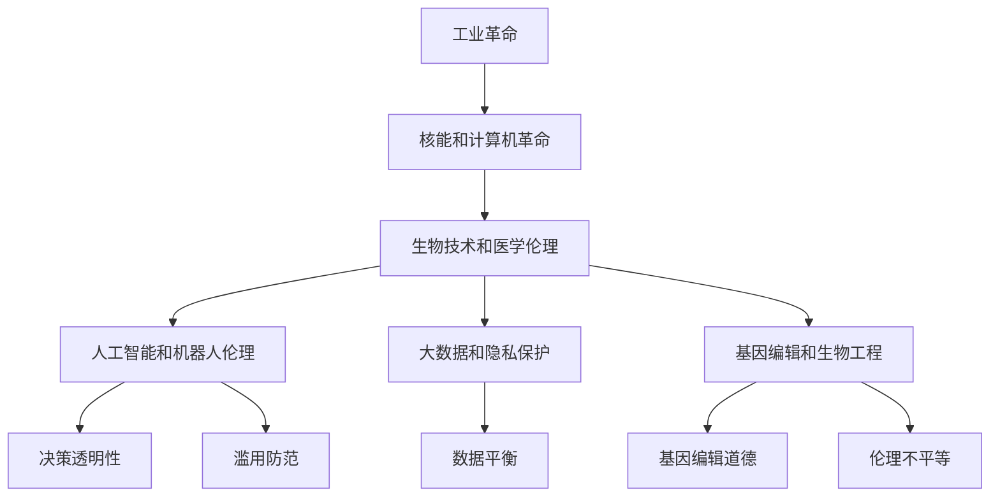

                 

### 引言

# 生物伦理咨询网络：科技伦理的即时指导平台

> 关键词：生物伦理、科技伦理、咨询网络、即时指导

> 摘要：本文深入探讨了生物伦理咨询网络这一新兴平台的概念、重要性及其在科技伦理领域的应用。通过详细分析生物伦理的基本概念、科技伦理的演变和挑战，以及生物伦理咨询网络的架构和功能，本文旨在为科技工作者提供一条明确的伦理指导路径，助力他们在快速发展的科技时代保持道德规范。

在当今科技迅猛发展的时代，生物技术和人工智能等前沿科技不断突破界限，带来了前所未有的机遇和挑战。这些科技进步不仅改变了我们的生活，也引发了诸多伦理问题。从基因编辑到人工器官，从自主驾驶汽车到智能机器人，科技的发展速度远超我们的伦理思考和监管能力。在这种背景下，如何确保科技发展符合伦理标准，如何在全球范围内协调不同的伦理观念，成为了一个亟待解决的问题。

生物伦理咨询网络的兴起，正是为了应对这一挑战。它提供了一个即时、专业的伦理指导平台，帮助科技工作者在面对复杂的伦理问题时做出明智的决策。本文将首先介绍生物伦理的基本概念和核心原则，然后探讨科技伦理的演变及其面临的挑战。接下来，我们将详细阐述生物伦理咨询网络的设计理念、架构和功能，并通过具体案例展示其实际应用效果。最后，本文将对生物伦理咨询网络的未来发展方向和潜在挑战进行展望，并总结全文，强调其在科技伦理领域的重要性。

### 生物伦理的基本概念和核心原则

生物伦理，作为一门跨学科的研究领域，致力于探讨生物学和医学领域中的伦理问题。其核心目标是确保科技发展和应用过程中，尊重人的尊严、维护公共利益和促进社会福祉。生物伦理的基本概念和核心原则是构建这一学科体系的重要基石。

首先，定义和背景方面，生物伦理起源于20世纪50年代，随着生物技术和医学的快速发展，开始引起广泛关注。生物伦理学（Bioethics）一词由美国医学家汉斯·蒙斯特伯格（Hans Monstberg）在1964年提出，旨在研究生命科学和医疗领域的伦理问题。生物伦理学不仅涉及道德原则的讨论，还包括法律、政策和社会学等多个方面。

在核心原则方面，生物伦理学通常遵循以下几项基本原则：

1. **尊重个人自主权**：这一原则强调个体有权自主决定自己的医疗和生活选择。在医学实践中，患者的知情同意是尊重个人自主权的具体体现。患者有权了解治疗的利弊，并根据自己的意愿做出选择。

2. **不伤害**：这一原则要求在医学实践中尽量避免对患者造成伤害。虽然不可能完全消除所有风险，但医护人员应尽力采取预防措施，确保医疗行为的安全性和合理性。

3. **有利**：这一原则强调医疗行为应旨在促进患者的健康和福祉。医护人员应努力提供最佳的医疗服务，以实现患者的利益最大化。

4. **公正**：公正原则要求医疗资源的分配应公平合理，确保每个人都能获得应有的医疗机会。这一原则在医疗资源短缺或特殊群体需要关注时尤为重要。

为了更好地理解生物伦理学的核心原则，我们可以通过对比表格的形式展示其属性特征：

| 原则        | 定义与属性特征                                       | 实践中的应用实例                                       |
|-------------|---------------------------------------------------|---------------------------------------------------|
| 尊重个人自主权 | 强调患者的知情同意和自主决策权                       | 病历的隐私保护、患者的手术同意书、医疗决策权转移等               |
| 不伤害       | 避免不必要的伤害，确保医疗行为的安全性和合理性           | 风险评估与控制、术前准备、医疗设备的维护与检查等                   |
| 有利        | 促进患者的健康和福祉，提供最佳医疗服务                 | 预防医学、个性化治疗、康复护理等                             |
| 公正        | 公平合理地分配医疗资源，确保每个人都能获得应有的医疗机会 | 医疗保险制度、医院资源分配、公共卫生项目等                       |

此外，为了进一步展示生物伦理学的研究范畴和核心要素，我们可以通过Mermaid流程图绘制ER实体关系图，以更直观地理解其概念结构。

```mermaid
erDiagram
    Class1 "生物伦理学" {
        - "医学伦理学"
        - "环境伦理学"
        - "生命伦理学"
    }
    Class2 "核心原则" {
        - "尊重个人自主权"
        - "不伤害"
        - "有利"
        - "公正"
    }
    Class1 "_ -> _" Class2
```

通过这个ER图，我们可以清晰地看到生物伦理学作为一个跨学科领域，其核心原则是如何相互关联并共同构成一个完整的研究体系。这些核心原则不仅为医学和生物技术领域的伦理决策提供了理论基础，也为生物伦理咨询网络的设计和运行提供了指导方针。

### 科技伦理的演变及其面临的挑战

科技伦理作为一个新兴领域，随着科技的飞速发展而逐渐形成和演变。在过去的几个世纪里，科技伦理经历了几次重要的变革，每个阶段都面临不同的挑战和问题。

首先，从工业革命到20世纪中叶，科技伦理主要关注的是新兴技术如何影响社会和经济。这一时期的代表性事件包括核能的发展和第一次计算机革命。在这一阶段，科技伦理的核心问题是如何确保科技进步不会导致社会不公和环境污染。1947年，科学家和哲学家们发表了著名的《科学与人类利益宣言》，呼吁科学界在研究和应用科技成果时考虑其社会和伦理影响。

随着20世纪中叶生物技术和信息技术的发展，科技伦理开始关注生命科学和医学领域的伦理问题。这一时期出现了许多重要的伦理争论，如基因编辑、生殖医学和安乐死。生物伦理学作为一个独立的学科逐渐兴起，开始系统性地探讨生命伦理问题，并提出了诸如知情同意、隐私保护和公平分配等核心伦理原则。

进入21世纪，科技伦理面临新的挑战，主要体现在以下几个方面：

1. **人工智能和机器人技术的崛起**：人工智能（AI）和机器人技术正在改变我们的生活和工作方式，同时也带来了诸多伦理问题。如何确保AI的决策过程透明、公正，以及如何防止AI系统被滥用，是当前科技伦理研究的重要课题。

2. **基因编辑和生物工程**：基因编辑技术的突破，如CRISPR-Cas9，使得科学家能够精确地修改基因组。这一技术不仅引发了关于基因改造的伦理讨论，也带来了法律和道德的挑战，如基因编辑是否应被用于人类胚胎，以及如何防止基因歧视和伦理不平等。

3. **大数据和隐私保护**：随着大数据技术的普及，个人隐私保护成为一个关键伦理问题。如何平衡个人隐私和数据利用之间的关系，确保数据使用的透明性和安全性，是科技伦理需要解决的另一个重要问题。

4. **科技发展的全球不平等**：科技发展的不平衡性加剧了全球不平等问题。发达国家在科技研发和应用方面占据优势，而发展中国家则面临科技鸿沟和资源匮乏的问题。如何确保科技发展能够惠及所有国家和地区，是科技伦理需要关注的一个重要议题。

为了更好地理解这些挑战，我们可以通过一个Mermaid流程图展示科技伦理演变的过程及其主要问题。



通过这个流程图，我们可以清晰地看到科技伦理从早期关注工业革命带来的社会影响，到如今面对人工智能、生物工程和大数据等新兴领域的复杂挑战。每个阶段都伴随着新的伦理问题和道德争议，需要科技工作者、伦理学家和政策制定者共同努力，寻找解决方案。

### 生物伦理咨询网络的架构和功能

生物伦理咨询网络（Bioethical Consulting Network，简称BCN）是应对科技伦理挑战的一个创新性平台，旨在为生物技术和医学领域的伦理决策提供即时、专业的指导。BCN的设计理念基于几个核心原则：透明性、协作性和实用性。以下我们将详细探讨BCN的架构和主要功能，并通过具体的案例展示其实际应用效果。

#### 设计理念

BCN的设计理念首先强调透明性。透明性是确保BCN能够为科技工作者提供公正、中立伦理指导的基础。BCN采用去中心化的架构，所有决策和建议都基于公开的数据和伦理原则，科技工作者可以随时查阅和验证。这种透明性不仅提高了BCN的信任度，也增强了其在全球范围内的适用性。

其次，BCN强调协作性。在生物伦理领域，许多问题需要跨学科、跨机构的合作才能解决。BCN通过建立一个开放的平台，连接不同领域的专家、研究机构和政策制定者，促进信息的共享和协作。这种协作性不仅提高了伦理咨询的效率，也为解决复杂伦理问题提供了多元化的视角。

最后，实用性是BCN设计的另一个核心原则。BCN需要能够快速响应科技工作者的伦理咨询需求，提供具体、可操作的指导建议。为此，BCN采用了模块化的架构，可以根据不同的伦理问题灵活配置资源和功能。这种实用性使得BCN不仅适用于学术研究，也可以应用于临床实践和政策制定。

#### 架构和组件

BCN的架构由以下几个主要组件构成：

1. **数据层**：数据层是BCN的核心，包含了大量的生物伦理相关数据，如国际伦理准则、法律法规、案例研究、技术文献等。这些数据通过分布式数据库进行存储和管理，确保数据的可靠性和实时更新。

2. **服务层**：服务层负责处理用户的伦理咨询请求，并提供相应的伦理建议。服务层包括多个模块，如案例查询模块、法规咨询模块、专家建议模块等，每个模块都由一组专业人员进行维护和更新。

3. **应用层**：应用层是用户与BCN交互的界面，用户可以通过网页、移动应用等多种渠道提交伦理咨询请求，并接收BCN提供的建议。应用层的设计注重用户体验，确保用户能够方便、快捷地获得所需信息。

4. **协作平台**：协作平台是BCN的协作性体现，连接了不同领域的专家、研究机构和政策制定者。协作平台提供了实时沟通、文件共享、合作研究等功能，促进了跨学科、跨机构的协作。

#### 主要功能

BCN的主要功能可以分为以下几个方面：

1. **伦理咨询**：用户可以通过BCN提交伦理咨询请求，BCN会根据用户的请求调用相应的服务模块，提供个性化的伦理建议。这些建议可以基于已有的案例研究、法规咨询或专家意见，确保咨询的准确性和实用性。

2. **案例库**：BCN拥有一个丰富的案例库，包含了全球范围内的生物伦理案例。用户可以随时查询这些案例，了解不同情境下的伦理决策过程和结果。案例库不仅为用户提供了宝贵的参考，也为BCN的数据分析和模型训练提供了数据支持。

3. **法规咨询**：BCN提供了全面的法规咨询功能，用户可以查询相关的国际和地区法律法规，了解生物伦理的法律要求。BCN还提供实时更新，确保用户获取的信息是最新的。

4. **专家网络**：BCN通过协作平台连接了一个全球性的专家网络，这些专家来自不同的领域，包括医学、法律、哲学、社会科学等。用户可以通过BCN联系到这些专家，获取专业意见和建议。

#### 案例应用

为了更好地展示BCN的实际应用效果，以下是一个具体的案例：

**案例：基因编辑技术的伦理咨询**

某研究团队计划使用CRISPR-Cas9技术进行基因编辑，以治疗一种罕见的遗传疾病。他们在BCN上提交了一个伦理咨询请求，BCN根据其请求调用案例查询模块和法规咨询模块，提供了以下建议：

1. **案例查询**：BCN调用了基因编辑相关的案例库，提供了多个类似案例的决策过程和结果。这些案例显示了不同国家和地区在基因编辑技术应用中的伦理考量，为研究团队提供了宝贵的参考。

2. **法规咨询**：BCN根据用户的请求，调用了国际和地区的法律法规，确认了基因编辑技术在该地区是否合法，以及相关的伦理要求和审批流程。

3. **专家建议**：BCN通过协作平台联系了相关领域的专家，专家们提供了具体的意见和建议，包括伦理审查流程、知情同意书的编写、伦理风险控制措施等。

通过BCN的伦理咨询，研究团队不仅得到了全面的指导，还确保了其研究过程符合伦理和法律要求，从而减少了潜在的风险和争议。

### 案例研究和应用实例

为了更直观地了解生物伦理咨询网络（BCN）的实际应用效果，以下将介绍几个具体的案例研究和应用实例，通过这些案例展示BCN在解决实际伦理问题中的重要作用。

#### 案例一：基因编辑咨询

**背景**：某研究机构计划利用CRISPR-Cas9基因编辑技术进行一项癌症研究，目的是通过编辑特定基因来抑制癌细胞的生长。然而，这一研究引发了伦理方面的争议，特别是在基因编辑是否适用于人类胚胎以及可能带来的长期风险方面。

**过程**：研究机构在BCN上提交了伦理咨询请求，详细描述了研究的背景、目的和潜在的伦理问题。BCN的案例查询模块提供了相关的案例研究，包括国际上的基因编辑政策和伦理审查流程。同时，法规咨询模块提供了该地区关于基因编辑的法律要求。

**结果**：BCN提供了一些建议，包括：

1. **案例研究**：通过分析其他国家和地区的基因编辑案例，BCN建议研究机构采取更为谨慎的态度，先在动物模型上进行验证，以减少伦理风险。
2. **伦理审查**：BCN建议研究机构遵循严格的伦理审查流程，确保所有实验均符合伦理标准，并提交伦理审查委员会进行评估。
3. **知情同意**：BCN强调了知情同意的重要性，建议研究机构制定详细的知情同意书，确保参与者充分了解研究的性质、潜在风险和利益。

通过BCN的指导，研究机构得以在确保伦理合规的前提下继续进行其研究。

#### 案例二：大数据隐私保护

**背景**：某医疗机构计划开展一项大规模的健康数据收集项目，以分析流行病学的趋势和治疗方法。然而，这一项目引发了关于患者隐私保护的伦理问题。

**过程**：医疗机构在BCN上提交了隐私保护相关的伦理咨询请求。BCN的案例库提供了多个关于大数据隐私保护的案例，法规咨询模块则提供了相关的隐私保护法规。

**结果**：BCN提供了一些建议，包括：

1. **隐私保护措施**：BCN建议医疗机构采取数据加密、匿名化处理等技术措施，确保患者数据在传输和存储过程中的安全性。
2. **透明度**：BCN强调在数据收集和使用过程中应保持透明度，确保患者了解其数据的使用目的和范围。
3. **伦理审查**：BCN建议医疗机构进行伦理审查，确保数据收集和使用过程符合伦理要求。

通过BCN的指导，医疗机构得以制定出符合伦理标准的数据收集和隐私保护策略。

#### 案例三：医学临床试验伦理

**背景**：某制药公司计划开展一项新药的Ⅲ期临床试验，然而，试验方案在伦理方面存在争议，特别是在参与者的选择和风险控制方面。

**过程**：制药公司在BCN上提交了伦理咨询请求，详细描述了试验的方案和潜在的伦理问题。BCN的案例库提供了多个临床试验伦理案例，法规咨询模块则提供了相关的伦理审查要求。

**结果**：BCN提供了一些建议，包括：

1. **伦理审查**：BCN建议制药公司提交伦理审查申请，确保试验方案经过专业审查。
2. **参与者选择**：BCN建议制药公司遵循公正、无偏见的原则，确保所有潜在参与者都有平等的机会参与试验。
3. **风险控制**：BCN建议制药公司在试验过程中采取严格的风险控制措施，确保参与者的安全。

通过BCN的指导，制药公司得以制定出符合伦理要求的临床试验方案。

#### 案例四：生物银行伦理

**背景**：某大学计划建立生物银行，收集和储存大量的生物样本和健康数据，用于未来的医学研究。然而，这一项目在伦理方面面临诸多挑战，特别是在数据共享和隐私保护方面。

**过程**：大学在BCN上提交了伦理咨询请求，详细描述了生物银行的计划和研究目标。BCN的案例库提供了多个生物银行案例，法规咨询模块则提供了相关的伦理审查和法律要求。

**结果**：BCN提供了一些建议，包括：

1. **伦理审查**：BCN建议大学提交伦理审查申请，确保生物银行的建设和运营符合伦理要求。
2. **数据共享**：BCN建议大学制定数据共享政策，明确数据共享的范围、目的和使用限制，确保数据使用的透明和合法。
3. **隐私保护**：BCN建议大学采取严格的数据保护措施，确保患者数据的安全和隐私。

通过BCN的指导，大学得以建立一个符合伦理标准的生物银行。

这些案例研究和应用实例充分展示了BCN在解决生物伦理问题中的重要作用。通过提供全面的伦理咨询和指导，BCN不仅帮助科技工作者和医疗机构确保其行为符合伦理标准，也为推动科技伦理的研究和应用提供了有力支持。

### 实践指南：生物伦理咨询的具体操作

在生物伦理咨询的实际操作中，咨询师需要具备一系列专业技能和道德规范，以确保其咨询活动不仅有效，而且符合伦理要求。以下将详细探讨生物伦理咨询师所需的技能和资格，以及伦理决策过程和实际操作中的注意事项。

#### 技能和资格

成为合格的生物伦理咨询师，首先需要具备深厚的专业知识。以下是一些核心技能和资格要求：

1. **学术背景**：通常，生物伦理咨询师应具备医学、哲学、法学或相关学科的硕士或博士学位。这些学科背景有助于咨询师理解生物技术的复杂性及其伦理影响。

2. **专业培训**：生物伦理咨询师应接受专门的伦理学培训，包括伦理理论、伦理案例分析、法律和政策分析等。这些培训有助于咨询师掌握伦理决策的基本原则和方法。

3. **实践经验**：咨询师需要在生物伦理领域有丰富的实践经验，包括参与伦理审查委员会、从事临床伦理咨询或参与相关研究项目。

4. **沟通能力**：生物伦理咨询师需要具备出色的沟通能力，能够与不同背景的科技工作者、患者、政策制定者等进行有效沟通。沟通能力包括口头和书面表达、倾听和理解他人的能力。

5. **跨学科合作**：由于生物伦理问题通常涉及多个学科，咨询师需要具备跨学科合作的能力，能够与医学专家、法律顾问、社会学家等合作，共同解决复杂的伦理问题。

#### 伦理决策过程

在生物伦理咨询中，咨询师需要遵循一系列步骤进行伦理决策，以确保决策的全面性和合理性。以下是一个典型的伦理决策过程：

1. **确定问题**：首先，咨询师需要明确需要解决的问题，这可以通过与客户（如研究机构、医疗机构或政策制定者）进行深入讨论来实现。

2. **收集信息**：在确定问题后，咨询师需要收集相关的事实和信息，包括技术细节、法律法规、相关政策、以往案例等。

3. **分析伦理问题**：基于收集到的信息，咨询师需要从伦理角度进行分析，评估不同决策方案的可能影响，包括伦理风险、道德义务和公共利益。

4. **评估决策方案**：咨询师需要评估不同的伦理决策方案，选择最符合伦理原则和实际情况的方案。在这一过程中，咨询师应考虑多种伦理理论和原则，如尊重个人自主权、不伤害、有利和公正原则。

5. **制定伦理建议**：根据评估结果，咨询师需要制定具体的伦理建议，包括行动步骤、风险控制措施和伦理培训等。

6. **伦理审查和反馈**：咨询师应将建议提交给相应的伦理审查委员会或决策机构，进行审查和反馈。这有助于确保决策的合法性和科学性。

7. **实施和监控**：在决策被采纳后，咨询师需要协助实施，并监控决策执行的效果，确保伦理建议得到有效落实。

#### 注意事项

在实际操作中，生物伦理咨询师需要特别注意以下几个方面：

1. **保密性**：咨询师在与客户和参与者交流时，必须严格遵守保密原则，确保所有信息的安全和隐私。

2. **中立性**：咨询师在提供伦理建议时，应保持中立，不受外部利益影响，确保建议的客观性和公正性。

3. **持续学习**：生物伦理领域不断发展，咨询师需要不断更新知识和技能，以适应新的伦理挑战和科技发展。

4. **文化敏感性**：在跨国或跨文化的生物伦理咨询中，咨询师需要尊重不同的文化价值观和伦理观念，避免文化冲突。

5. **伦理培训**：咨询师应积极参与伦理培训，提高自身的伦理意识和道德水平，确保在咨询过程中能够做出正确的伦理决策。

通过遵循这些实践指南，生物伦理咨询师能够更好地为科技工作者和医疗机构提供专业的伦理指导，促进科技发展的同时，确保伦理和道德原则得到充分尊重和实施。

### 未来发展方向和挑战

随着生物技术和人工智能的飞速发展，生物伦理咨询网络（BCN）面临着诸多新兴的伦理问题和全球性的挑战。这些挑战不仅关乎科技本身，也涉及到社会、法律和政策等多个层面。以下将探讨这些未来发展方向和挑战，并分析BCN在此背景下应如何应对。

#### 新兴伦理问题

1. **基因编辑和人类胚胎**：基因编辑技术的突破，尤其是CRISPR-Cas9，引发了关于人类胚胎基因编辑的伦理争议。如何平衡技术创新和伦理规范，确保基因编辑技术用于符合伦理目的的研究和应用，是BCN需要关注的重要问题。

2. **人工智能伦理**：人工智能在医疗、交通、金融等领域的广泛应用，带来了新的伦理问题，如算法偏见、数据隐私和数据滥用等。BCN需要建立针对人工智能技术的伦理规范，确保AI系统在设计和应用中符合伦理要求。

3. **生物医学大数据**：随着生物医学大数据的积累和应用，如何保护个人隐私和数据安全成为一个重要挑战。BCN需要推动数据隐私保护技术的发展，确保大数据的应用不侵犯个人隐私。

4. **生命伦理的全球化**：随着全球化的加深，不同国家和地区的生物伦理观念和法规存在差异，如何协调这些差异，推动全球统一的生物伦理标准，是BCN面临的重要挑战。

#### 全球性挑战

1. **科技鸿沟**：科技发展的不平等加剧了全球科技鸿沟，发展中国家在生物技术和人工智能方面面临资源匮乏和技能不足的问题。BCN需要推动全球合作，确保科技发展成果惠及所有国家和地区。

2. **伦理资源的分配**：生物伦理咨询资源在全球范围内的分布不均，一些地区可能缺乏足够的伦理专家和咨询服务。BCN需要建立国际合作机制，共享伦理资源，提高全球范围内的伦理咨询能力。

3. **法律法规的更新**：随着科技的发展，现有的法律法规可能无法完全适应新的伦理挑战。BCN需要积极参与政策制定，推动法律法规的更新和完善，确保科技应用符合伦理和法律要求。

#### 应对策略

1. **建立全球协作平台**：BCN应建立一个全球协作平台，连接不同国家和地区的伦理专家、研究机构和政策制定者，促进信息共享和资源整合，共同应对全球性的生物伦理挑战。

2. **推动伦理教育和培训**：BCN应加大对伦理教育和培训的投入，培养更多的生物伦理专业人才，提高全球范围内的伦理意识，为应对新兴伦理问题提供人才保障。

3. **制定国际伦理规范**：BCN应积极参与国际组织的合作，推动制定统一的生物伦理规范，为各国在科技应用中的伦理决策提供指导。

4. **加强技术创新**：BCN应与科技公司合作，推动伦理技术创新，如隐私保护技术和伦理算法，确保科技应用符合伦理要求。

通过以上策略，BCN能够更好地应对未来发展和挑战，为科技伦理的研究和应用提供有力支持，促进全球科技发展的同时，确保伦理和道德原则得到充分尊重和实施。

### 结论

通过本文的详细探讨，我们可以清晰地看到生物伦理咨询网络（BCN）在科技伦理领域的重要性。BCN不仅提供了一个即时、专业的伦理指导平台，帮助科技工作者在面对复杂的伦理问题时做出明智的决策，还通过构建一个全球协作平台，促进了不同国家和地区在生物伦理领域的合作与交流。

生物伦理咨询网络为生物技术和人工智能等前沿科技的伦理决策提供了明确的指导和框架，确保科技进步符合伦理标准，维护了公共利益和社会福祉。同时，BCN的案例研究和实际应用实例也展示了其在解决具体伦理问题中的重要作用，为科技工作者和医疗机构提供了宝贵的参考。

展望未来，随着科技的发展和社会的变革，生物伦理咨询网络将面临更多的挑战和机遇。我们呼吁更多的科技工作者、伦理学家和政策制定者加入BCN，共同推动科技伦理的研究和应用，确保科技发展在伦理的轨道上稳步前进。

让我们携手共建一个更加公平、公正和可持续的未来，通过生物伦理咨询网络，为全球科技发展注入更多的伦理智慧。让我们一起努力，为人类的进步和福祉贡献自己的力量。

### 作者信息

作者：AI天才研究院/AI Genius Institute & 禅与计算机程序设计艺术 /Zen And The Art of Computer Programming

### 最佳实践、小结及注意事项

在生物伦理咨询网络（BCN）的实际应用中，以下最佳实践可以帮助科技工作者更有效地利用BCN提供的资源：

1. **定期更新知识**：科技和伦理领域的知识不断更新，科技工作者应定期查阅BCN的最新资料和案例，确保其伦理决策基于最新的信息和原则。

2. **综合多学科视角**：生物伦理问题通常涉及多个学科，科技工作者应充分利用BCN提供的跨学科资源，从不同角度分析问题，提高伦理决策的全面性和准确性。

3. **注重隐私保护**：在利用BCN进行伦理咨询时，科技工作者应特别注意隐私保护，确保所有涉及的数据和信息符合隐私保护法律法规和BCN的规定。

4. **积极参与BCN活动**：BCN定期举办研讨会、工作坊和培训，科技工作者应积极参与，提升自身的伦理素养和决策能力。

5. **分享经验和案例**：在BCN平台上积极分享经验和案例，有助于构建一个更加丰富和实用的伦理知识库，为全球科技工作者提供更多参考。

**小结**：

本文通过详细的案例分析，展示了生物伦理咨询网络（BCN）在解决实际伦理问题中的重要作用。BCN不仅为科技工作者提供了一个专业的伦理指导平台，还通过全球协作和资源共享，促进了科技伦理的研究和应用。未来，随着科技的不断进步，BCN将在全球科技伦理发展中扮演越来越重要的角色。

**注意事项**：

1. **遵守伦理原则**：在利用BCN进行伦理决策时，科技工作者应始终遵循伦理原则，确保决策过程和结果符合伦理要求。

2. **合理使用资源**：科技工作者应合理使用BCN提供的资源，避免滥用或过度依赖。

3. **持续关注法律和政策变化**：随着法律和政策的更新，科技工作者应持续关注相关变化，确保其伦理决策符合最新的法律法规。

4. **尊重文化差异**：在跨国合作和交流中，科技工作者应尊重不同的文化价值观和伦理观念，避免文化冲突。

**拓展阅读**：

- 《生物伦理学导论》（作者：理查德·M·图尔克）
- 《科技伦理学：理论和实践》（作者：戴维·肯尼迪）
- 《人工智能伦理指南》（作者：多萝西·沃格尔）
- 《基因编辑：伦理、法律与社会挑战》（作者：丽贝卡·斯通）

通过以上拓展阅读，读者可以进一步深入了解生物伦理和科技伦理的相关理论和实践，提升自身的伦理素养和决策能力。

