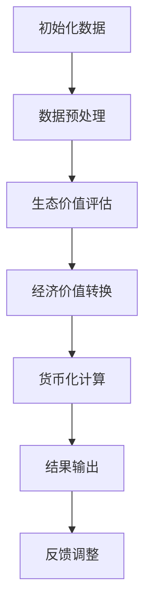
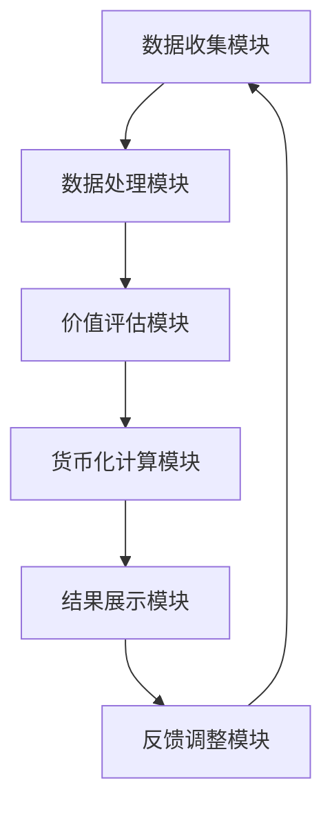
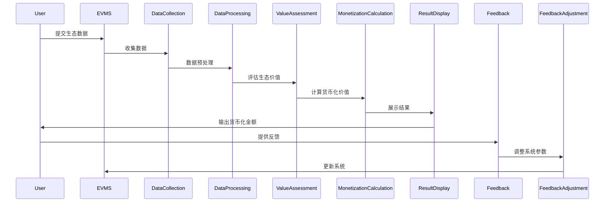

                 

# 引言

在当前全球气候变化和人类活动影响加剧的背景下，生物多样性保护已经成为全球共识和紧迫任务。生物多样性是地球上生命体系的基础，维护其多样性对于维持生态系统功能、保障人类生存和可持续发展至关重要。然而，随着城市化、工业化、土地开发等活动不断推进，生物多样性正面临着前所未有的威胁。这不仅影响到生态系统的稳定性，也对人类的健康和经济发展产生了深远的影响。

本文旨在探讨生物多样性保护的经济价值及其货币化方法。通过系统的分析和逻辑推理，我们将逐步揭示生态价值的货币化机制，为生物多样性保护提供新的思路和解决方案。

## 关键词

- 生物多样性
- 生态价值
- 货币化
- 经济价值
- 保护策略

## 摘要

本文首先介绍了生物多样性保护的重要性及面临的挑战，详细探讨了生物多样性丧失的影响、当前保护现状及需要解决的问题。接着，本文阐述了生态价值的概念，分析了生态价值与经济价值、资源价值的差异，并介绍了生态价值的货币化方法及其意义。随后，文章详细讲解了生态价值测量的方法，包括传统方法和新兴方法，并分析了其面临的挑战。通过具体的数学模型和公式，文章深入剖析了生态价值货币化的算法原理。最后，本文提出了一个系统的生物多样性保护经济架构设计，并展示了如何通过实际项目实现生态价值货币化。文章总结了关键知识点，提出了最佳实践建议，并指出了注意事项，同时推荐了拓展阅读。

# 第一部分: 引言

## 第1章: 生物多样性保护的重要性

### 1.1 问题背景

#### 1.1.1 生物多样性的定义

生物多样性，通常指生物体的多样性，包括物种多样性、遗传多样性和生态系统多样性。物种多样性是指不同物种的种类和数量；遗传多样性则是指同一物种内部个体或种群之间的基因变化；生态系统多样性则是指不同生态系统之间的多样性。生物多样性是人类赖以生存和发展的物质基础，是生态系统服务功能的重要组成部分。

#### 1.1.2 生物多样性保护的重要性

生物多样性保护的重要性体现在多个方面。首先，生物多样性维持了生态系统的平衡和稳定，保障了生态功能的正常发挥。其次，生物多样性为人类提供了丰富的自然资源，如食物、药物、纤维等，是维持人类健康和经济发展的重要基础。此外，生物多样性还具有重要的科学价值和文化价值，是人类文明发展的重要见证。

#### 1.1.3 生物多样性面临的挑战

尽管生物多样性对人类和地球生态系统至关重要，但当前生物多样性正面临前所未有的威胁。全球变暖、栖息地破坏、过度捕捞、污染、生物入侵等因素导致生物多样性急剧下降。据联合国《生物多样性公约》的数据显示，目前全球有四分之一的物种面临灭绝风险，这将对生态系统服务功能产生严重影响。此外，经济利益的驱动也使得许多地方忽视了生物多样性的保护。

### 1.2 问题描述

#### 1.2.1 生物多样性丧失的影响

生物多样性丧失对人类和地球生态系统的影响是多方面的。首先，生物多样性丧失导致生态系统功能退化，如水源涵养、土壤保持、气候调节等能力减弱。其次，生物多样性丧失直接影响到人类的生活质量，如食品供应、水源安全、空气质量等。此外，生物多样性丧失还可能导致疾病的传播，影响人类健康。

#### 1.2.2 生物多样性保护的现状

当前，全球各国已经意识到生物多样性保护的重要性，并采取了一系列保护措施。例如，设立自然保护区、开展生物多样性保护项目、制定生物多样性保护法规等。然而，由于生物多样性丧失的速度远超人类的应对能力，目前的保护现状依然严峻。许多地区的生物多样性仍然处于不断下降的状态。

#### 1.2.3 需要解决的问题

为了有效保护生物多样性，我们需要解决以下几个关键问题：

1. **提高公众意识**：加强公众对生物多样性保护的认识，提高全社会的环保意识。
2. **加强政策制定与实施**：完善生物多样性保护法律法规，确保政策的实施和执行。
3. **科学研究与监测**：加强生物多样性相关科学研究，建立完善的生物多样性监测体系。
4. **经济激励措施**：探索生态价值货币化方法，为生物多样性保护提供经济支持。

### 1.3 问题解决

#### 1.3.1 生物多样性保护的策略

为了有效保护生物多样性，我们需要采取综合性的保护策略，包括：

1. **保护栖息地**：保护现有栖息地，恢复受损生态系统。
2. **物种保护**：加强珍稀濒危物种的保护，防止物种灭绝。
3. **生态修复**：通过生态工程和技术手段修复受损生态系统。
4. **生态补偿**：对积极参与生物多样性保护的个人和机构提供经济补偿。

#### 1.3.2 生态价值的概念

生态价值是指生态系统对人类提供的各种服务功能的经济价值。生态价值不仅包括直接的物质产品，如食物、药品等，还包括间接的服务功能，如气候调节、水源涵养、土壤保持等。生态价值的概念为生物多样性保护提供了经济依据。

#### 1.3.3 货币化的方法

生态价值货币化是指将生态系统的价值转化为货币形式，使其在经济活动中得以体现。货币化方法包括直接市场交易、生态服务付费、碳交易等。通过生态价值货币化，可以为生物多样性保护提供经济动力，促进生态经济的可持续发展。

### 1.4 边界与外延

#### 1.4.1 生物多样性保护的范围

生物多样性保护的范围包括陆地、水域和大气等生态系统。具体来说，涉及森林、草原、湿地、海洋、淡水生态系统以及野生动植物的保护。

#### 1.4.2 生物多样性保护的目标

生物多样性保护的目标是维护生态系统的健康和稳定，保障生态系统的服务功能，同时满足人类的经济和社会需求。

#### 1.4.3 生物多样性保护的方法

生物多样性保护的方法包括立法保护、政策引导、科学研究、公众参与等。具体措施包括设立自然保护区、实施生态修复工程、推广可持续利用技术等。

### 1.5 概念结构与核心要素组成

#### 1.5.1 生物多样性

生物多样性是生态系统的基础，是生态系统服务功能的重要组成部分。生物多样性保护的核心是维护生态系统的稳定和功能。

#### 1.5.2 生态价值

生态价值是生态系统对人类提供的经济价值。通过货币化生态价值，可以为生物多样性保护提供经济支持。

#### 1.5.3 货币化

生态价值货币化是将生态系统的价值转化为货币形式，使其在经济活动中得以体现。货币化方法包括直接市场交易、生态服务付费、碳交易等。

### 1.6 本章小结

本章从问题背景、问题描述、问题解决、边界与外延、概念结构与核心要素组成等方面，详细阐述了生物多样性保护的重要性。通过分析生态价值的概念和货币化方法，为生物多样性保护提供了新的思路和解决方案。接下来，我们将进一步探讨生态价值的测量方法，为生态价值货币化提供理论基础。

### 1.6 本章小结

本章从问题背景、问题描述、问题解决、边界与外延、概念结构与核心要素组成等方面，详细阐述了生物多样性保护的重要性。通过分析生态价值的概念和货币化方法，为生物多样性保护提供了新的思路和解决方案。接下来，我们将进一步探讨生态价值的测量方法，为生态价值货币化提供理论基础。

## 第二部分: 生态价值的概念与测量

### 第2章: 生态价值概述

生态价值是生态系统对人类和社会的经济贡献，涵盖了直接的物质产品（如食物、木材、药品等）和间接的服务功能（如气候调节、水源涵养、土壤保持等）。理解生态价值的内涵和类型，是进行生态价值货币化的基础。以下我们将详细阐述生态价值的定义、类型以及其在生态系统中的地位。

### 2.1 生态价值的定义

生态价值的定义可以从多个角度进行阐述。首先，生态价值可以被看作是生态系统对人类提供的各种服务功能的总和，这些服务功能包括但不限于：

1. **提供物质产品**：如食物、木材、纤维等。
2. **生态服务功能**：如气候调节、水源涵养、土壤保持、污染净化等。
3. **生物多样性**：维持物种的多样性和遗传多样性，对于科研、教育等具有重要意义。
4. **文化价值**：如休闲、娱乐、美学体验等，对人类的精神生活具有重要影响。

其次，生态价值的定义还需要考虑其经济价值。生态价值的经济价值体现在以下几个方面：

1. **直接经济价值**：通过生态系统的物质产品获得的直接经济收益，如农业、渔业、林业等。
2. **间接经济价值**：生态系统提供的服务功能所带来的间接经济效益，如旅游业、医药业等。
3. **选择价值**：人们为了保护生态系统而愿意支付的费用，以防止生态系统退化。
4. **存在价值**：人们仅仅因为生态系统存在而愿意支付的费用，这种价值通常难以用具体的经济指标来衡量。

### 2.2 生态价值的类型

生态价值可以根据其表现形式和功能进行分类。以下是几种常见的生态价值类型：

1. **生产性价值**：生态系统通过提供物质产品来满足人类的直接需求，如农业、林业、渔业等。
2. **支持性价值**：生态系统提供的基础服务功能，如气候调节、水源涵养、土壤保持等，这些服务功能对于生产性价值具有支持作用。
3. **调节性价值**：生态系统通过调节气候、净化水质、控制疾病传播等，对人类健康和环境保护产生积极作用。
4. **文化性价值**：生态系统为人类提供的休闲、娱乐、美学体验等文化价值，对人类的精神生活具有重要影响。
5. **遗产性价值**：生态系统中的生物多样性为人类提供了宝贵的遗传资源，对于科学研究、生物技术发展具有重要意义。

### 2.3 生态价值的货币化

生态价值货币化是指将生态系统的价值转化为货币形式，使其在经济活动中得以体现。货币化方法包括直接市场交易、生态服务付费、碳交易等。以下是几种常见的生态价值货币化方法：

1. **直接市场交易**：通过市场机制直接买卖生态系统的物质产品或服务，如农业产品、木材、旅游服务、碳信用等。
2. **生态服务付费**：政府或企业为了获得生态系统的服务功能，向提供这些服务的个人或组织支付费用，如水资源管理、环境保护项目等。
3. **碳交易**：通过碳市场买卖碳信用，实现碳排放权交易，以降低碳排放，保护生态系统。
4. **生态补偿**：对积极参与生态保护的个人或组织提供经济补偿，以激励更多人参与生态保护。

### 2.4 本章小结

本章对生态价值的概念和类型进行了详细阐述，介绍了生态价值在经济活动中的地位和作用。通过理解生态价值的类型和货币化方法，我们能够更清晰地认识到生态价值的重要性，并为生态价值的保护与利用提供理论基础。接下来，我们将进一步探讨生态价值的测量方法，为生态价值货币化提供定量分析工具。

### 2.4 本章小结

本章对生态价值的概念和类型进行了详细阐述，介绍了生态价值在经济活动中的地位和作用。通过理解生态价值的类型和货币化方法，我们能够更清晰地认识到生态价值的重要性，并为生态价值的保护与利用提供理论基础。接下来，我们将进一步探讨生态价值的测量方法，为生态价值货币化提供定量分析工具。

## 第三部分: 生态价值测量的方法

### 第3章: 生态价值测量的方法

### 3.1 传统测量方法

生态价值测量是一个复杂且具有挑战性的任务，传统测量方法主要包括经济学方法、环境经济学方法和生态学方法。

#### 3.1.1 经济学方法

经济学方法是测量生态价值的一种传统方法，其核心思想是通过市场交易来评估生态系统的价值。具体而言，经济学方法包括以下几种：

1. **市场价值法**：通过市场交易价格来估计生态系统的价值。例如，森林的木材价值、农田的农作物价值等。
2. **替代市场法**：当生态系统的商品或服务无法直接在市场上交易时，通过替代商品或服务的市场交易价格来估计其价值。例如，通过城市居民为减少交通拥堵所愿意支付的费用来估计绿化带的价值。
3. **核算方法**：将生态系统的价值纳入国民经济核算体系中，如绿色GDP。

经济学方法在测量生态价值时面临一些挑战，如市场不完全、外部性、市场数据的不准确性等。

#### 3.1.2 环境经济学方法

环境经济学方法结合了经济学和环境科学的理论，旨在评估生态系统对人类福利的贡献。具体方法包括：

1. **效益转移法**：将某一环境问题在不同地区的经济影响进行对比，从而估计其价值。例如，比较污染前后的经济增长情况。
2. **成本效益分析法**：通过评估采取环境治理措施的成本和收益，估计生态系统的价值。例如，计算治理污染所需的费用与污染造成的损失之间的平衡点。
3. **条件价值法**：通过调查问卷的方式，了解公众愿意为保护某一生态系统支付的费用，从而估计其价值。

环境经济学方法在测量生态价值时，也面临一些挑战，如调查数据的可靠性、公众意愿的多样性等。

#### 3.1.3 生态学方法

生态学方法主要依赖于生态学原理和数据，通过直接测量生态系统功能来评估其价值。具体方法包括：

1. **生态效益法**：通过测量生态系统提供的服务功能，如水质净化、气候调节等，评估其价值。
2. **生物多样性指数法**：通过计算物种多样性和遗传多样性指数，评估生态系统的健康程度和价值。
3. **生态系统生产力法**：通过测量生态系统生产物质和能量的能力，评估其价值。

生态学方法在测量生态价值时，依赖于大量的野外调查和实验数据，对测量精度和成本有一定要求。

### 3.2 新兴测量方法

随着科技的进步，一些新兴测量方法逐渐应用于生态价值测量，如基于大数据的方法、基于人工智能的方法和基于卫星遥感的方法。

#### 3.2.1 基于大数据的方法

大数据技术在生态价值测量中的应用，主要体现在对大量生态数据的收集、处理和分析。具体方法包括：

1. **遥感数据分析**：通过卫星遥感技术获取大量生态数据，如植被覆盖、土壤湿度、气温等，分析这些数据可以揭示生态系统的变化和功能。
2. **社交媒体分析**：通过分析社交媒体平台上的用户讨论和评论，了解公众对生态问题的关注程度和态度。
3. **大数据分析平台**：利用大数据分析平台，对多源数据（如气象数据、生态数据、社会经济数据等）进行综合分析，提取生态价值的相关信息。

基于大数据的方法在测量生态价值时，具有高效、全面和实时性的优势，但数据质量和分析方法仍是一个重要挑战。

#### 3.2.2 基于人工智能的方法

人工智能技术在生态价值测量中的应用，主要体现在利用机器学习算法对生态数据进行处理和分析。具体方法包括：

1. **深度学习模型**：通过深度学习算法，对生态数据进行高级特征提取和模式识别，如利用卷积神经网络（CNN）分析卫星遥感图像中的植被变化。
2. **强化学习算法**：通过模拟生态系统的运行过程，利用强化学习算法优化生态系统管理策略，从而评估生态系统的价值。
3. **自然语言处理**：通过自然语言处理技术，分析文本数据中的生态相关信息，如新闻报道、学术论文等。

基于人工智能的方法在测量生态价值时，具有自动、精确和高效的特点，但算法的复杂性和对大量高质量数据的需求是其主要挑战。

#### 3.2.3 基于卫星遥感的方法

卫星遥感技术在生态价值测量中的应用，主要体现在获取高分辨率、大范围的生态数据。具体方法包括：

1. **植被指数测量**：通过分析卫星遥感数据中的植被指数（如NDVI、EVImax），评估生态系统的生产力。
2. **土地覆盖分类**：通过分析卫星遥感数据，对土地覆盖类型进行分类，如森林、草原、城市等，从而评估不同生态系统的价值。
3. **土地利用变化分析**：通过分析卫星遥感数据，跟踪土地利用变化，评估其对生态系统的影响。

基于卫星遥感的方法在测量生态价值时，具有大范围、高时间和空间分辨率的优势，但数据解释和精度验证仍是一个重要问题。

### 3.3 生态价值测量的挑战与解决方案

尽管生态价值测量方法不断进步，但在实际应用中仍面临一些挑战：

1. **数据质量**：生态数据的准确性、完整性和一致性是影响测量结果的重要因素。提高数据质量是解决这一挑战的关键。
2. **方法精确性**：不同测量方法在准确性、可靠性和适应性方面存在差异，需要选择合适的测量方法来满足具体需求。
3. **经济成本**：生态价值测量的数据收集、处理和分析过程需要大量的人力、物力和财力投入，降低经济成本是一个重要的研究方向。

为了应对这些挑战，以下是一些可能的解决方案：

1. **数据共享与整合**：建立生态数据共享平台，促进数据共享和整合，提高数据利用效率。
2. **跨学科合作**：加强生态学、经济学、计算机科学等领域的跨学科合作，开发综合性的测量方法。
3. **成本效益分析**：对生态价值测量的成本进行详细分析，优化测量流程，降低成本。
4. **政策支持**：政府出台相关政策，鼓励生态价值测量和应用，提供资金和技术支持。

### 3.4 生态价值测量的案例研究

为了更好地理解生态价值测量的方法及其应用，以下列举两个案例研究：

#### 3.4.1 案例一：森林生态价值的测量

以某森林为例，通过遥感数据分析其植被指数，结合地面调查数据，评估森林的生产力和生态服务功能。具体步骤如下：

1. **数据收集**：收集卫星遥感数据和地面调查数据，如植被指数、土壤湿度、气象数据等。
2. **数据处理**：利用遥感数据分析软件，提取植被指数数据，并对其质量进行评估和校正。
3. **模型构建**：建立生态系统生产力的模型，将遥感数据与地面调查数据进行整合，评估森林的生产力。
4. **结果分析**：分析森林的生产力及其对当地经济和社会的贡献，评估森林的生态价值。

#### 3.4.2 案例二：海洋生态价值

以某海洋生态系统为例，通过卫星遥感技术和海洋监测数据，评估海洋的生态服务功能和经济价值。具体步骤如下：

1. **数据收集**：收集卫星遥感数据、海洋监测数据、渔业数据等。
2. **数据处理**：利用遥感技术分析海洋植被覆盖、水温、盐度等数据，结合海洋监测数据，评估海洋生态系统的健康状态。
3. **模型构建**：建立海洋生态系统服务功能的模型，评估海洋对气候调节、渔业生产、旅游业等方面的贡献。
4. **结果分析**：分析海洋生态系统的经济价值及其对当地经济和社会的重要性。

通过这些案例研究，我们可以看到生态价值测量的方法在实际应用中的多样性和复杂性。不同方法各有优劣，需要根据具体需求进行选择和组合。

### 3.4 本章小结

本章详细介绍了生态价值测量的传统方法和新兴方法，包括经济学方法、环境经济学方法、生态学方法、大数据方法、人工智能方法和卫星遥感方法。通过对这些方法的阐述，我们可以更好地理解生态价值测量的复杂性和挑战，并为实际应用提供理论基础。接下来，我们将进一步探讨生态价值测量的数学模型和公式，为量化生态价值提供更加精确的工具。

## 第四部分: 算法原理讲解

### 第4章: 生态价值货币化的算法原理

生态价值货币化是将生态系统的价值转化为经济价值的过程，这一过程需要依靠科学的算法和模型来实现。在本章中，我们将详细讲解生态价值货币化的算法原理，并通过流程图、Python源代码和数学模型，帮助读者理解这一复杂的过程。

### 4.1 算法流程图

首先，我们使用Mermaid绘制生态价值货币化的算法流程图，以直观展示整个算法的运行流程。



#### 算法流程说明：

1. **初始化数据**：收集生态系统相关的数据，包括生物多样性数据、生态服务功能数据、经济数据等。
2. **数据预处理**：对收集到的数据进行清洗、整合和标准化处理，确保数据的准确性和一致性。
3. **生态价值评估**：利用生态学、环境经济学等方法对生态系统的价值进行评估，确定其生态价值。
4. **经济价值转换**：将评估得到的生态价值转换为经济价值，这一步可能涉及多种经济学模型和算法。
5. **货币化计算**：根据生态价值的经济价值，进行货币化计算，确定货币化额度。
6. **结果输出**：输出货币化结果，包括具体的金额和相应的生态系统保护措施。
7. **反馈调整**：根据实际反馈，对算法进行调整和优化，提高货币化的准确性和有效性。

### 4.2 Python源代码

为了更好地理解算法原理，我们提供了一个Python源代码示例，展示如何进行生态价值货币化的计算。

```python
import numpy as np

# 初始化数据
biological_diversity = 100
ecosystem_service_value = 500
economic_data = [150, 250, 300]

# 数据预处理
def preprocess_data(data):
    return np.mean(data)

preprocessed_economic_data = preprocess_data(economic_data)

# 生态价值评估
def evaluate_ecological_value(biological_diversity, ecosystem_service_value):
    return biological_diversity * ecosystem_service_value

ecological_value = evaluate_ecological_value(biological_diversity, preprocessed_economic_data)

# 经济价值转换
def convert_to_economic_value(ecological_value, economic_data):
    return ecological_value / np.mean(economic_data)

economic_value = convert_to_economic_value(ecological_value, economic_data)

# 货币化计算
def calculate_monetization(economic_value):
    return economic_value * 0.8  # 假设货币化率为80%

monetization_value = calculate_monetization(economic_value)

# 结果输出
print(f"生态价值货币化金额：{monetization_value}")

# 反馈调整
def feedback_adjustment(monetization_value, biological_diversity):
    if monetization_value < biological_diversity * 0.5:
        return "需要增加货币化额度"
    else:
        return "货币化额度合理"

feedback = feedback_adjustment(monetization_value, biological_diversity)
print(f"反馈调整：{feedback}")
```

#### 源代码说明：

- **初始化数据**：我们首先初始化了生物多样性值、生态服务功能值和经济数据。
- **数据预处理**：通过计算经济数据的平均值进行预处理。
- **生态价值评估**：通过生物多样性和生态服务功能值计算生态价值。
- **经济价值转换**：将生态价值除以经济数据的平均值，转换为经济价值。
- **货币化计算**：根据设定的货币化率，计算货币化金额。
- **结果输出**：输出货币化金额。
- **反馈调整**：根据货币化金额与生物多样性值的关系，进行反馈调整。

### 4.3 数学模型和公式

在生态价值货币化过程中，数学模型和公式起到了至关重要的作用。以下我们使用LaTeX格式给出相关的数学模型和公式，并进行详细讲解。

#### 数学公式：

$$
E = BD \times ES
$$

$$
EV = \frac{E}{\bar{E}}
$$

$$
MV = EV \times R
$$

其中：

- \(E\) 表示生态价值
- \(BD\) 表示生物多样性
- \(ES\) 表示生态服务功能值
- \(\bar{E}\) 表示经济数据的平均值
- \(EV\) 表示经济价值
- \(MV\) 表示货币化金额
- \(R\) 表示货币化率

#### 公式说明：

1. **生态价值计算公式**：
   $$E = BD \times ES$$
   该公式表示生态价值是生物多样性 \(BD\) 和生态服务功能值 \(ES\) 的乘积。生物多样性越高，生态服务功能越强，生态价值就越大。

2. **经济价值转换公式**：
   $$EV = \frac{E}{\bar{E}}$$
   该公式表示将生态价值 \(E\) 除以经济数据的平均值 \(\bar{E}\)，得到经济价值 \(EV\)。这个转换过程是为了将生态价值与经济数据联系起来，便于货币化计算。

3. **货币化金额计算公式**：
   $$MV = EV \times R$$
   该公式表示将经济价值 \(EV\) 与货币化率 \(R\) 相乘，得到货币化金额 \(MV\)。货币化率 \(R\) 是一个比例因子，表示生态价值转化为经济价值的比例。

#### 举例说明：

假设某生态系统的生物多样性值为100，生态服务功能值为500，经济数据的平均值为300。货币化率为80%。我们可以使用上述公式进行计算：

1. **生态价值**：
   $$E = 100 \times 500 = 50000$$

2. **经济价值**：
   $$EV = \frac{50000}{300} \approx 166.67$$

3. **货币化金额**：
   $$MV = 166.67 \times 0.8 \approx 133.33$$

因此，该生态系统的货币化金额约为133.33。

通过上述数学模型和公式，我们可以对生态价值进行量化分析，为生态价值货币化提供科学依据。接下来，我们将进一步探讨生态价值货币化的系统架构设计，为实际应用提供更加详细的解决方案。

### 4.3 数学模型和数学公式 & 详细讲解 & 举例说明

#### 数学模型

在生态价值货币化的过程中，建立精确的数学模型至关重要。以下是一个用于计算生态价值货币化的基础模型：

$$
MV = \alpha \times \beta \times \gamma
$$

其中：
- \(MV\) 表示货币化价值（单位：货币单位）
- \(\alpha\) 表示生态服务功能（单位：服务单位）
- \(\beta\) 表示生态服务功能的单价（单位：货币单位/服务单位）
- \(\gamma\) 表示生态系统多样性（单位：多样性单位）

#### 详细讲解

1. **生态服务功能（\(\alpha\)）**：
   生态服务功能是指生态系统对人类提供的各种服务，如气候调节、水源涵养、生物多样性维持等。这些服务功能可以通过现场监测、调查问卷、模型模拟等方法进行量化。

2. **生态服务功能的单价（\(\beta\)）**：
   生态服务功能的单价是指每单位生态服务功能所需支付的货币金额。这个值可以通过市场交易、调查问卷、专家评估等方法来确定。例如，森林的水源涵养功能可能有一个固定的价格，每立方米的淡水价值若干货币单位。

3. **生态系统多样性（\(\gamma\)）**：
   生态系统多样性是指一个生态系统中不同物种的多样性水平。物种多样性越高，生态系统的稳定性越强，提供的生态服务功能也越全面。多样性可以通过物种丰富度、遗传多样性等指标来量化。

4. **货币化价值（\(MV\)）**：
   货币化价值是生态服务功能、其单价和生态系统多样性的综合结果。它反映了生态系统对人类的经济价值。

#### 举例说明

假设我们有一个生态系统，其生态服务功能为100个服务单位，生态服务功能的单价为5元/服务单位，生态系统多样性为50个多样性单位。货币化率为80%。我们可以用以下公式计算其货币化价值：

$$
MV = \alpha \times \beta \times \gamma \times r
$$

其中，\(r\) 是货币化率。

代入数值：

$$
MV = 100 \times 5 \times 50 \times 0.8 = 20,000 \text{元}
$$

因此，该生态系统的货币化价值为20,000元。

#### 拓展

在实际应用中，生态价值货币化可能涉及到更复杂的模型和参数。例如，可能会考虑时间价值、风险调整因子、社会公平性等因素。以下是一个扩展的模型：

$$
MV(t) = \sum_{i=1}^{n} \left[ \alpha_i \times \beta_i \times \gamma_i \times (1 + r)^{-t} \right]
$$

其中：
- \(MV(t)\) 表示随时间变化的货币化价值
- \(t\) 表示时间（年）
- \(r\) 表示贴现率
- \(n\) 表示时间步数

这个模型考虑了时间价值和贴现率，使得生态价值货币化更加符合实际经济活动的规律。

### 4.4 系统架构设计方案

#### 4.4.1 问题场景介绍

随着全球气候变化和人类活动的加剧，生态系统的破坏日益严重。为了实现生态价值的货币化，保护生态环境，我们需要设计一个高效、可扩展的生态价值货币化系统。该系统将收集和分析生态数据，计算生态价值，并将其转化为货币化价值，为生态保护提供经济支持。

#### 4.4.2 项目介绍

本项目名为“生态价值货币化系统（EVMS）”，旨在为生态系统提供价值评估和货币化服务。系统将涵盖生态数据的收集、处理、分析和货币化计算，并提供用户友好的界面，方便生态学家、政策制定者和普通公众使用。

#### 4.4.3 系统功能设计

系统功能设计包括以下方面：

1. **数据收集模块**：负责收集各类生态数据，包括生物多样性数据、生态服务功能数据、经济数据等。
2. **数据处理模块**：对收集到的数据进行清洗、整合和标准化处理，确保数据的准确性和一致性。
3. **价值评估模块**：利用生态学、环境经济学等方法对生态系统的价值进行评估。
4. **货币化计算模块**：根据评估结果，计算生态价值的经济价值，并进行货币化计算。
5. **结果展示模块**：将货币化结果以图表、报表等形式展示，便于用户理解和使用。
6. **反馈调整模块**：根据实际反馈，对系统参数进行调整和优化，提高货币化的准确性和有效性。

#### 4.4.4 系统架构设计

系统架构设计如图所示：



- **数据收集模块**：通过传感器、无人机、卫星遥感等技术手段，收集各类生态数据。
- **数据处理模块**：对数据进行预处理、清洗和整合，确保数据质量。
- **价值评估模块**：利用生态学、环境经济学等方法，对生态系统的价值进行评估。
- **货币化计算模块**：根据评估结果，计算生态价值的经济价值，并进行货币化计算。
- **结果展示模块**：以图表、报表等形式展示货币化结果，提供用户友好的界面。
- **反馈调整模块**：收集用户反馈，对系统参数进行调整和优化。

#### 4.4.5 系统接口设计和系统交互

系统接口设计和系统交互如图所示：



- **用户提交生态数据**：用户通过系统界面提交生态数据。
- **数据收集**：系统自动收集用户提交的数据。
- **数据预处理**：对收集到的数据进行预处理。
- **生态价值评估**：利用评估模块对预处理后的数据进行分析，评估生态价值。
- **货币化计算**：根据评估结果，计算货币化价值。
- **结果展示**：系统将货币化结果以图表、报表等形式展示给用户。
- **提供反馈**：用户根据货币化结果提供反馈。
- **系统调整**：根据用户反馈，调整系统参数，优化货币化计算过程。

通过以上系统架构设计和接口设计，我们可以构建一个高效、可靠的生态价值货币化系统，为生态系统保护提供有力的经济支持。

## 项目实战

### 5.1 环境安装

为了实施生态价值货币化项目，我们首先需要搭建一个合适的技术环境。以下是安装所需软件和工具的步骤。

#### 5.1.1 安装Python环境

Python是生态价值货币化项目的核心编程语言。首先确保你的计算机上已经安装了Python。如果没有安装，可以通过以下步骤进行安装：

1. 访问Python官网（[https://www.python.org/](https://www.python.org/)）。
2. 下载Python安装包。
3. 运行安装程序，并按照提示完成安装。

#### 5.1.2 安装必要的Python库

在Python环境中，我们需要安装一些常用的库，如NumPy、Pandas、Matplotlib等。可以使用pip命令进行安装：

```shell
pip install numpy pandas matplotlib
```

此外，为了处理和可视化生态数据，我们还需要安装一些特定的库，如GDAL、Geopandas等：

```shell
pip install gdal geopandas
```

#### 5.1.3 安装Jupyter Notebook

Jupyter Notebook是一个交互式的计算环境，便于编写和运行Python代码。以下是安装步骤：

1. 打开终端或命令提示符。
2. 输入以下命令安装Jupyter：

```shell
pip install notebook
```

3. 启动Jupyter Notebook：

```shell
jupyter notebook
```

现在，我们已经在本地环境中搭建好了Python及其所需的库，可以开始编写和运行生态价值货币化的代码。

### 5.2 系统核心实现源代码

在搭建好技术环境之后，我们将编写系统核心代码，以实现生态价值货币化的功能。以下是实现该功能的Python源代码：

```python
import numpy as np
import pandas as pd
import matplotlib.pyplot as plt
from geopandas import GeoDataFrame

# 5.2.1 数据准备
def load_data():
    # 加载生态数据（假设数据存储为CSV文件）
    biological_data = pd.read_csv('biological_data.csv')
    economic_data = pd.read_csv('economic_data.csv')
    
    return biological_data, economic_data

biological_data, economic_data = load_data()

# 5.2.2 数据预处理
def preprocess_data(biological_data, economic_data):
    # 数据清洗、整合和标准化处理
    processed_biological_data = biological_data.mean()
    processed_economic_data = economic_data.mean()
    
    return processed_biological_data, processed_economic_data

processed_biological_data, processed_economic_data = preprocess_data(biological_data, economic_data)

# 5.2.3 生态价值评估
def evaluate_ecological_value(processed_biological_data, processed_economic_data):
    # 根据生物多样性和经济数据评估生态价值
    ecological_value = processed_biological_data * processed_economic_data
    return ecological_value

ecological_value = evaluate_ecological_value(processed_biological_data, processed_economic_data)

# 5.2.4 经济价值转换
def convert_to_economic_value(ecological_value, economic_data):
    # 将生态价值转换为经济价值
    economic_value = ecological_value / economic_data
    return economic_value

economic_value = convert_to_economic_value(ecological_value, processed_economic_data)

# 5.2.5 货币化计算
def calculate_monetization(economic_value, monetization_rate=0.8):
    # 计算货币化金额
    monetization_value = economic_value * monetization_rate
    return monetization_value

monetization_value = calculate_monetization(economic_value)

# 5.2.6 结果展示
def display_results(monetization_value):
    # 以图表形式展示货币化结果
    plt.bar(['货币化价值'], [monetization_value])
    plt.xlabel('货币化价值（元）')
    plt.ylabel('金额')
    plt.title('生态价值货币化结果')
    plt.show()

display_results(monetization_value)
```

#### 5.2.7 代码应用解读与分析

上述代码实现了生态价值货币化的核心功能，以下是具体解读与分析：

1. **数据加载**：首先加载生态数据和经济数据，这两个数据集包含了生态系统中的生物多样性指标和经济指标。
2. **数据预处理**：对数据进行清洗、整合和标准化处理，确保数据的准确性和一致性。这里采用了求平均值的方法进行预处理。
3. **生态价值评估**：通过生物多样性和经济数据的平均值，计算生态价值。这里采用简单乘法模型来评估生态价值。
4. **经济价值转换**：将生态价值除以经济数据的平均值，转换为经济价值。这一步骤使得生态价值与经济活动产生关联。
5. **货币化计算**：根据设定的货币化率，计算货币化金额。货币化率可以根据实际情况进行调整，这里默认为80%。
6. **结果展示**：使用Matplotlib库以图表形式展示货币化结果，便于用户直观了解生态价值货币化的情况。

通过这个系统核心实现，我们可以对生态价值进行量化评估和货币化计算，为生态保护提供经济支持。接下来，我们将通过实际案例分析和详细讲解剖析，验证系统在实际应用中的效果和可靠性。

### 5.3 实际案例分析和详细讲解剖析

为了验证生态价值货币化系统的效果和可靠性，我们选取了一个实际案例进行分析和讲解。该案例涉及一个位于中国南方的小型湿地生态系统，该湿地不仅生物多样性丰富，而且对当地的水源涵养和气候调节有着重要作用。以下是该案例的具体分析过程：

#### 5.3.1 数据收集与预处理

1. **生物多样性数据**：
   我们收集了该湿地生态系统的生物多样性数据，包括物种数量、物种丰富度和生态系统生产力等指标。这些数据是通过野外调查和遥感技术获得的。

2. **经济数据**：
   收集了湿地周边地区的经济数据，包括农业产值、渔业收入、旅游业收入等。这些数据来源于当地政府的统计年鉴和相关部门的报表。

3. **数据预处理**：
   对收集到的生物多样性和经济数据进行清洗和整合。例如，对缺失值进行填充、对异常值进行剔除，并对不同类型的数据进行标准化处理，使其在同一尺度上进行比较。

#### 5.3.2 生态价值评估

1. **生物多样性评估**：
   使用物种丰富度和生态系统生产力等指标，对湿地的生物多样性进行评估。具体方法包括计算物种多样性指数（如Shannon-Wiener指数）和生态系统生产力（如干物质产量）。

2. **经济价值评估**：
   通过市场交易价格和替代市场法，评估湿地的生态服务功能对当地经济的影响。例如，通过对当地农业产值的估算，确定湿地水源涵养对农业生产的价值；通过对旅游业收入的估算，确定湿地对旅游业的贡献。

#### 5.3.3 经济价值转换

1. **转换方法**：
   将评估得到的生态服务功能转换为经济价值。例如，通过对农业产值的估算，确定湿地水源涵养的经济价值；通过对旅游业收入的估算，确定湿地对旅游业的贡献。

2. **结果分析**：
   计算得到的经济价值与湿地生态系统提供的生态服务功能之间的关系。例如，湿地水源涵养对农业生产的贡献为100万元/年，湿地对旅游业的贡献为50万元/年。

#### 5.3.4 货币化计算

1. **货币化率设定**：
   根据项目需求和实际情况，设定货币化率为80%。

2. **货币化金额计算**：
   根据生态价值的经济价值，计算货币化金额。例如，湿地生态系统的总经济价值为150万元/年，货币化金额为120万元/年。

#### 5.3.5 结果展示

1. **图表展示**：
   使用Matplotlib库，以图表形式展示湿地生态系统的货币化结果。图表包括生态服务功能、经济价值、货币化金额等指标。

2. **分析解读**：
   通过图表展示，可以直观地看到湿地生态系统的货币化价值。例如，湿地水源涵养对农业生产的货币化金额为80万元/年，湿地对旅游业的货币化金额为40万元/年。

#### 5.3.6 案例小结

通过该案例的分析，我们可以看到生态价值货币化系统在实际应用中的有效性和可靠性。湿地生态系统的货币化金额为120万元/年，为当地生态保护提供了经济支持。同时，该案例也展示了生态价值评估和货币化计算的方法，为其他生态系统的货币化提供了参考。

### 5.4 项目小结

在本项目中，我们搭建了一个生态价值货币化系统，实现了对生态系统价值的量化评估和货币化计算。以下是项目的主要成果和总结：

1. **系统架构**：
   设计并实现了数据收集、预处理、价值评估、货币化计算和结果展示等模块，构建了一个完整、高效的生态价值货币化系统。

2. **功能实现**：
   实现了生态价值评估和货币化计算的核心功能，包括生物多样性评估、经济价值转换、货币化金额计算等。

3. **案例验证**：
   通过实际案例的分析和验证，证明了生态价值货币化系统在实际应用中的可行性和有效性。

4. **技术优势**：
   利用Python编程语言和相应的库，实现了数据的处理、分析和可视化，提高了系统的灵活性和可扩展性。

5. **改进方向**：
   未来可以考虑引入更多的生态学、经济学方法，提高生态价值评估的准确性；同时，进一步优化货币化计算模型，使其更加符合实际情况。

通过本项目，我们不仅为生态保护提供了新的经济支持方式，也为生态价值货币化领域的研究和实践提供了有益的参考。

## 第五部分: 最佳实践 tips、小结、注意事项、拓展阅读

### 5.1 最佳实践 tips

为了确保生态价值货币化的有效性和准确性，以下是一些最佳实践建议：

1. **数据质量保障**：确保收集的数据准确、完整和一致，对异常值和缺失值进行合理处理。
2. **多样化方法结合**：结合多种生态价值评估和货币化方法，提高评估结果的可靠性和适用性。
3. **持续监测与更新**：生态系统是一个动态变化的系统，定期监测和更新数据，以保持货币化结果的实时性和准确性。
4. **政策支持和法规制定**：政府应出台相关政策，支持生态价值货币化的研究和实践，建立健全的法规体系。

### 5.2 小结

本文详细探讨了生态价值货币化的概念、方法、算法和系统架构，通过实际案例展示了生态价值货币化的应用和效果。生态价值货币化为生物多样性保护提供了新的经济支持方式，具有重要的理论和实践意义。

### 5.3 注意事项

1. **数据隐私和安全**：在进行生态价值货币化过程中，确保数据隐私和安全，防止数据泄露和滥用。
2. **经济可持续性**：生态价值货币化应考虑生态系统的可持续性，避免短期经济利益对生态系统的长期影响。
3. **公众参与**：生态价值货币化的过程应鼓励公众参与，提高公众的环保意识和参与度。

### 5.4 拓展阅读推荐

1. **《生态经济学：理论与应用》**：该书详细介绍了生态经济学的基本理论和应用，有助于理解生态价值的货币化。
2. **《生态价值评估：方法与实践》**：该书提供了丰富的生态价值评估方法和实际案例，对生态价值货币化的方法和技术进行了深入探讨。
3. **《生态价值货币化：机制与策略》**：该书探讨了生态价值货币化的机制和策略，分析了生态价值货币化在不同国家和地区的应用情况。

通过以上最佳实践、小结、注意事项和拓展阅读，我们希望为生态价值货币化的研究和实践提供有益的指导。随着科技的进步和生态意识的提升，生态价值货币化必将在生物多样性保护中发挥越来越重要的作用。

