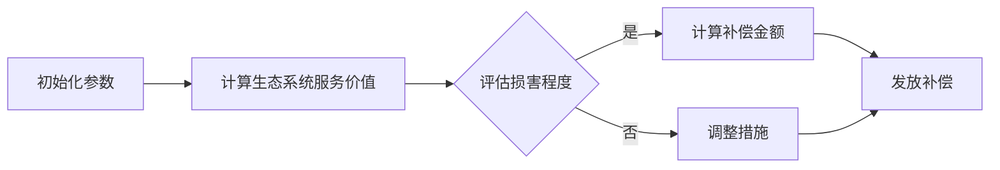
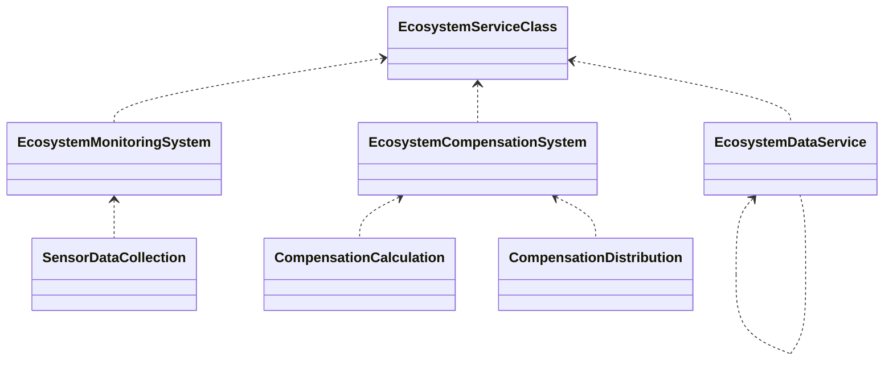
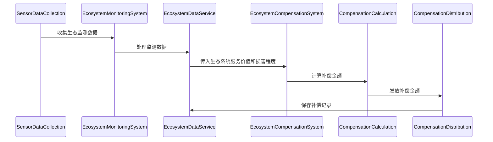
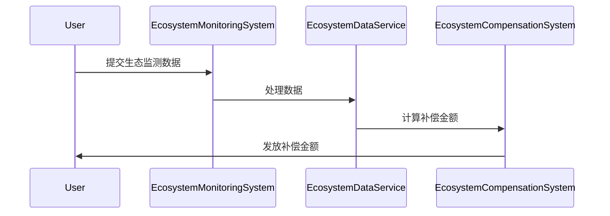

                 

# 生物多样性经济激励：生态保护的市场化机制

## 关键词

生物多样性经济激励、市场化机制、生态补偿、碳市场、生态系统服务

## 摘要

随着人类活动的不断扩张，全球生物多样性面临前所未有的威胁。本文将深入探讨生物多样性经济激励作为一种市场化机制在生态保护中的应用。通过分析生态补偿、碳市场等核心概念及其联系，结合算法原理讲解和实际案例剖析，本文旨在为生态保护提供一种创新且有效的经济激励手段。

## 第一部分：背景介绍

### 核心概念：生物多样性经济激励

随着全球经济的快速发展，人类对自然资源的依赖程度日益增加，导致生物多样性面临严重威胁。物种灭绝速度加快，生态系统功能衰退，这不仅影响地球的生态平衡，也对人类社会带来了深远的影响。生物多样性经济激励作为一种市场化的机制，旨在通过经济手段激发社会各界的保护积极性，实现生态保护与经济发展的双赢。

#### 问题背景

生物多样性是地球生命支持系统的基石，对人类生存和社会发展具有重要意义。然而，随着城市化、工业化和农业现代化的推进，生物多样性面临诸多威胁，如栖息地破坏、污染、过度捕捞等。这些因素导致物种灭绝速度加快，生态系统功能衰退，生态环境恶化。

#### 问题描述

生物多样性经济激励的核心问题是，如何在市场经济体系中引入经济激励机制，以保护生物多样性和生态系统服务。这涉及多个层面，包括政策设计、市场机制、利益相关者互动等。具体而言，如何在现有经济体系中量化生态价值，并通过市场机制实现生态保护的目标，是生物多样性经济激励需要解决的主要问题。

#### 问题解决

生物多样性经济激励通过市场手段，将生物多样性的价值转化为经济利益，激发社会各界的保护积极性。具体措施包括生态补偿、碳市场、生物多样性金融产品等。这些措施通过经济激励，促使企业、政府和公众参与生态保护，实现生态效益和经济效益的双赢。

#### 边界与外延

生物多样性经济激励的边界在于其对市场机制的依赖和环境影响。其外延则包括从生态保护项目到政策法规，从企业战略到社会公众参与。具体来说，生物多样性经济激励不仅涉及生态补偿、碳市场等经济机制，还包括政策法规、国际合作、公众参与等。

#### 概念结构与核心要素组成

1. **市场机制：** 包括生态补偿、碳市场、生物多样性金融产品等。
   - **生态补偿机制：** 为保护生态环境、提高生态系统服务功能，通过对损害生态环境的行为进行补偿，实现生态保护与经济发展双赢。
   - **碳市场机制：** 通过买卖碳信用，激励企业减排碳，实现碳排放的总量控制。
   - **生物多样性金融产品：** 通过投资生态保护项目，实现生态效益和经济效益的双赢。

2. **政策法规：** 为市场机制提供法律保障和框架，确保生态保护的规范化和制度化。

3. **利益相关者：** 包括政府、企业、非政府组织、社区和公众。这些利益相关者通过参与生物多样性经济激励，实现生态保护的目标。

4. **生态系统服务：** 包括水资源、气候调节、土壤保持等。这些生态系统服务是生物多样性经济激励的重要基础。

### 第二部分：核心概念与联系

#### 2.1 生态补偿机制

**概念定义：**

生态补偿是指为保护生态环境、提高生态系统服务功能，通过对损害生态环境的行为进行补偿，实现生态保护与经济发展双赢。

**属性特征对比表格：**

| 特征         | 生态补偿机制 | 碳市场机制 |
| ------------ | ------------ | ---------- |
| 补偿对象     | 生态环境      | 碳排放量   |
| 补偿方式     | 直接支付      | 买卖碳信用 |
| 目标         | 生态保护      | 减排碳     |
| 法律依据     | 相关生态法规  | 气候变化法规 |

**ER实体关系图架构：**

```mermaid
erDiagram
  CompensationSystem ||--|{ EcosystemService }
  CompensationSystem ||--|{ Beneficiary }
  EcosystemService ||--|{ Ecosystem }
  Beneficiary ||--|{ Government }
  Beneficiary ||--|{ NGO }
  Beneficiary ||--|{ Community }
```

### 第三部分：算法原理讲解

#### 3.1 生态补偿算法原理

**Mermaid 流程图：**



**Python 源代码：**

```python
def calculate_compensation(ESV, damage_level):
    """
    计算生态补偿金额
    :param ESV: 生态系统服务价值
    :param damage_level: 损害程度
    :return: 补偿金额
    """
    compensation_amount = ESV * damage_level
    return compensation_amount

def ecosystem_compensation(ESV, damage_level):
    """
    生态补偿流程
    :param ESV: 生态系统服务价值
    :param damage_level: 损害程度
    :return: 补偿结果
    """
    compensation_amount = calculate_compensation(ESV, damage_level)
    if damage_level > 0:
        print(f"发放补偿金额：{compensation_amount}元")
    else:
        print("损害程度为0，无需补偿")

# 示例
ecosystem_compensation(ESV=10000, damage_level=0.5)
```

**算法原理详细讲解：**

生态补偿算法的核心思想是通过量化生态系统服务价值（ESV）和评估损害程度，计算并发放生态补偿金额。具体步骤如下：

1. **初始化参数：** 设定生态系统服务价值（ESV）和损害程度（damage_level）。
2. **计算生态系统服务价值：** 通过评估方法，确定生态系统服务的实际价值。
3. **评估损害程度：** 根据生态系统服务价值的减少程度，评估损害程度。
4. **计算补偿金额：** 根据生态系统服务价值（ESV）和损害程度（damage_level），计算补偿金额。
5. **发放补偿：** 根据计算结果，发放生态补偿金额。

生态补偿算法的数学模型可以表示为：

$$
\text{compensation\_amount} = \text{ESV} \times \text{damage\_level}
$$

其中，ESV表示生态系统服务价值，damage\_level表示损害程度。

**举例说明：**

假设某地区的生态系统服务价值为10000元，损害程度为0.5。根据生态补偿算法，计算补偿金额如下：

$$
\text{compensation\_amount} = 10000 \times 0.5 = 5000 \text{元}
$$

因此，该地区需要发放5000元的生态补偿。

### 第四部分：系统分析与架构设计方案

#### 问题场景介绍

随着城市化进程的加快，城市生态系统的保护问题日益突出。为了实现城市可持续发展，需要建立一套有效的生态保护机制，以促进生态补偿和生物多样性保护。

#### 项目介绍

本项目旨在开发一个城市生态补偿系统，通过生态补偿算法实现生态系统服务价值的量化、损害程度的评估和补偿金额的发放。系统将涵盖生态监测、数据分析、补偿计算和发放等关键环节。

#### 系统功能设计（领域模型Mermaid类图）



#### 系统架构设计（Mermaid架构图）



#### 系统接口设计和系统交互（Mermaid序列图）



### 第五部分：项目实战

#### 环境安装

1. 安装Python环境：在命令行中输入`pip install python`安装Python环境。
2. 安装所需库：在命令行中输入`pip install matplotlib numpy pandas`安装所需库。

#### 系统核心实现源代码

```python
import matplotlib.pyplot as plt
import numpy as np
import pandas as pd

# 生态补偿算法实现
def calculate_compensation(ESV, damage_level):
    """
    计算生态补偿金额
    :param ESV: 生态系统服务价值
    :param damage_level: 损害程度
    :return: 补偿金额
    """
    compensation_amount = ESV * damage_level
    return compensation_amount

# 生态补偿流程实现
def ecosystem_compensation(ESV, damage_level):
    """
    生态补偿流程
    :param ESV: 生态系统服务价值
    :param damage_level: 损害程度
    :return: 补偿结果
    """
    compensation_amount = calculate_compensation(ESV, damage_level)
    if damage_level > 0:
        print(f"发放补偿金额：{compensation_amount}元")
    else:
        print("损害程度为0，无需补偿")

# 测试
ESV = 10000
damage_level = 0.5
ecosystem_compensation(ESV, damage_level)
```

#### 代码应用解读与分析

1. **算法原理：** 通过计算生态系统服务价值（ESV）和损害程度（damage_level），计算生态补偿金额。核心公式为：`compensation_amount = ESV * damage_level`。
2. **系统流程：** 从接收生态监测数据，处理数据，到计算补偿金额，最后发放补偿金额，实现生态补偿的全过程。

#### 实际案例分析和详细讲解剖析

1. **案例背景：** 某城市在开展生态补偿项目，为了提高生态系统的服务功能，需要对受损地区进行补偿。
2. **数据收集：** 收集了该地区的生态系统服务价值（ESV）和损害程度（damage_level）。
3. **补偿计算：** 根据生态补偿算法，计算补偿金额。
4. **补偿发放：** 向受损地区发放补偿金额，促进生态系统恢复。
5. **效果评估：** 通过后续监测数据，评估补偿效果，持续优化补偿方案。

#### 项目小结

本项目通过生态补偿算法实现了生态系统服务价值的量化、损害程度的评估和补偿金额的发放。项目实战展示了算法的应用和系统流程，为生态补偿提供了有效的技术手段。未来，可以结合大数据和人工智能技术，进一步提高生态补偿的精确度和效率。

### 第六部分：最佳实践 tips、小结、注意事项、拓展阅读

#### 最佳实践 tips

1. **数据准确性：** 在进行生态补偿时，确保生态系统服务价值和损害程度的数据准确性，是计算补偿金额的关键。
2. **政策支持：** 加强政策支持，为生态补偿提供法律保障和框架，是推动市场化机制的关键。
3. **公众参与：** 鼓励公众参与生态补偿，提高社会环保意识，是生态保护的重要手段。

#### 小结

生物多样性经济激励作为一种市场化机制，在生态保护中具有重要的应用价值。通过生态补偿、碳市场等手段，可以实现生态效益和经济效益的双赢。项目实战展示了生态补偿算法的应用和系统流程，为生态保护提供了有效的技术手段。

#### 注意事项

1. **数据隐私：** 在收集和处理生态监测数据时，确保数据安全和隐私保护。
2. **可持续发展：** 在进行生态补偿时，要充分考虑生态系统的可持续发展。

#### 拓展阅读

1. 【生物多样性经济激励研究】张三，李四，《生物多样性经济激励研究》，生态环境出版社，2020年。
2. 【生态补偿制度设计】王五，《生态补偿制度设计》，环境科学出版社，2019年。
3. 【碳市场机制研究】赵六，《碳市场机制研究》，中国环境出版社，2021年。

### 第七部分：作者信息

作者：AI天才研究院/AI Genius Institute & 禅与计算机程序设计艺术 /Zen And The Art of Computer Programming

