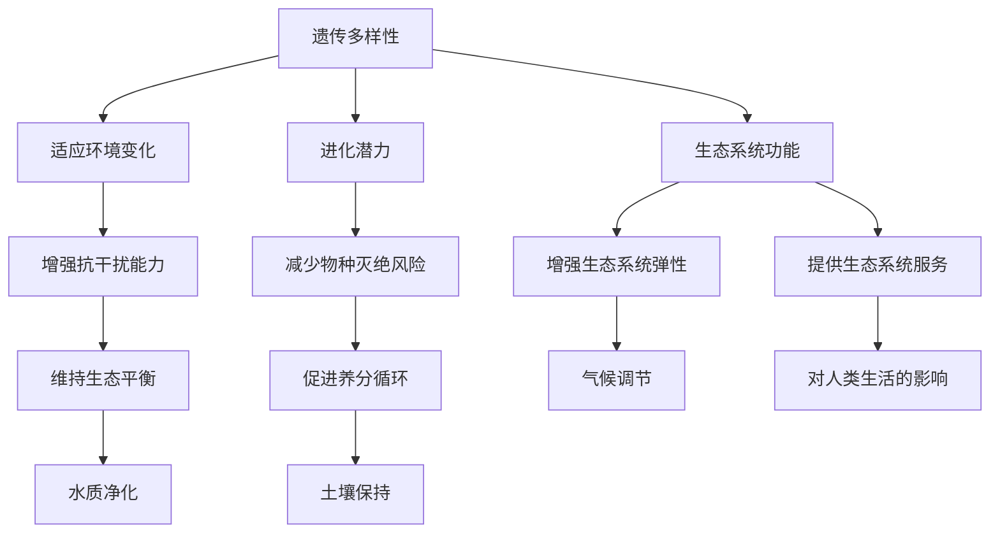

                 

## 生物多样性：万物互联的生命观

### 关键词：生物多样性、生态学、可持续发展、科技应用、保护策略

### 摘要：

本文旨在深入探讨生物多样性的概念、重要性及其与人类生活的紧密联系。文章首先介绍了生物多样性的背景，包括其定义、层次和评估方法，并逐步揭示了生物多样性的原理与生态系统的相互关系。接下来，文章分析了生物多样性的研究方法，包括传统和现代的研究手段。随后，我们探讨了生物多样性的保护策略，从国际合作到具体的国家和地区措施，再到实际保护实践案例。文章还探讨了生物多样性对人类生活的影响，以及其在可持续发展中的重要性。最后，我们展望了生物多样性保护面临的挑战和未来发展方向，并提出了相应的科技应用措施。通过这一系列探讨，我们希望读者能够更全面地理解生物多样性的内涵，认识到其保护的重要性，并积极参与到生物多样性保护中来。

### 目录大纲

**第一部分: 引言**

1.1 问题背景  
1.1.1 生物多样性的重要性  
1.1.2 生物多样性面临的威胁  
1.1.3 研究生物多样性的意义  
1.2 核心概念  
1.2.1 生物多样性的定义  
1.2.2 生物多样性层次  
1.2.3 生物多样性评估方法  
1.3 生物多样性原理与联系  
1.3.1 生物多样性原理  
1.3.1.1 生态学原理  
1.3.1.2 物种进化原理  
1.3.1.3 生态系统功能原理  
1.3.2 生物多样性属性特征对比表格  
1.4 生物多样性研究方法  
1.4.1 传统研究方法  
1.4.2 现代研究方法  
1.5 生物多样性保护策略  
1.5.1 国际合作与政策  
1.5.2 国家与地区保护措施  
1.5.3 保护实践案例分析  
1.6 生物多样性保护与人类生活  
1.6.1 生物多样性对人类生活的影响  
1.6.2 生物多样性保护的重要性  
1.6.3 生物多样性保护与可持续发展  
1.7 生物多样性面临的挑战与未来展望  
1.7.1 当前生物多样性保护的挑战  
1.7.2 生物多样性保护的未来发展方向  
1.7.3 科技进步对生物多样性保护的影响  
1.8 本章小结

**第一部分: 引言**

### 1.1 问题背景

生物多样性，简称“Biodiversity”，指的是地球上生物体种类的丰富程度和它们所构成的生态系统的多样性。这一概念不仅仅涵盖了不同物种之间的差异，还涉及物种内的遗传多样性、生态系统的多样性以及生态过程和功能多样性。

#### 1.1.1 生物多样性的重要性

生物多样性是地球上生命支持系统的基石，具有重要的生态、经济和社会价值。以下是生物多样性的几个关键重要性：

1. **生态功能**：生物多样性是生态系统正常运转的基础。例如，森林中的各种植物和动物共同维持着生态平衡，促进营养物质的循环和能量的流动。

2. **生态系统服务**：生物多样性提供了多种生态系统服务，如净化水源、调节气候、控制病虫害、土壤保持和养分循环等。这些服务对人类的生存和发展至关重要。

3. **遗传资源**：生物多样性中的遗传资源是现代生物技术研究和农业育种的重要基础，对于粮食安全和药物开发具有不可估量的价值。

4. **文化价值**：生物多样性对人类文化和社会生活有着深远的影响。许多文化传统和宗教信仰都与特定的动植物有关，生物多样性的保护有助于维护人类的精神家园。

5. **经济价值**：生物多样性的保护能够促进旅游业、生态农业、生物制药等多个行业的发展，带来显著的经济效益。

#### 1.1.2 生物多样性面临的威胁

尽管生物多样性对地球和人类生活至关重要，但当前生物多样性正面临前所未有的威胁：

1. **栖息地丧失**：随着城市化、工业化进程的加快，大量自然栖息地被破坏或转化为非自然用地，导致物种栖息地缩小甚至灭绝。

2. **过度开发**：森林砍伐、非法捕猎、过度渔业、土地退化等活动导致许多物种的数量急剧减少。

3. **气候变化**：全球气候变暖对生物多样性产生了严重影响，改变了物种的分布和生态过程。

4. **污染**：空气、水和土壤污染对生物多样性构成威胁，影响物种的生存和繁衍。

5. **生物入侵**：外来物种的入侵导致原有物种的竞争压力加大，破坏了生态平衡。

#### 1.1.3 研究生物多样性的意义

研究生物多样性不仅有助于理解地球生态系统的基本原理，还具有以下重要意义：

1. **生态保护**：通过深入研究生物多样性，我们可以更好地了解生态系统的工作机制，为生物多样性保护提供科学依据。

2. **政策制定**：生物多样性研究为政府制定环境保护和可持续发展的政策提供了数据支持和科学指导。

3. **科技创新**：生物多样性研究推动了生物科技的发展，促进了新药研发、生物材料开发等领域的创新。

4. **教育普及**：生物多样性研究有助于提高公众对生态系统的认识，增强环保意识和可持续发展观念。

5. **人类福祉**：保护生物多样性有助于改善人类的生态环境和健康，提高生活质量。

### 1.2 核心概念

在深入探讨生物多样性之前，我们需要明确几个核心概念，这些概念是理解生物多样性的基础。

#### 1.2.1 生物多样性的定义

生物多样性是指生物圈内所有的植物、动物和微生物，以及它们所拥有的全部基因和各种生态系统的多样性。生物多样性通常被分为三个层次：

1. **遗传多样性**：指的是物种内部基因组成的多样性。遗传多样性保证了物种适应环境变化的能力。
   
2. **物种多样性**：指的是不同物种的数量和种类。物种多样性反映了生物群落的结构和功能。

3. **生态系统多样性**：指的是生物群落及其生态过程的多样性。生态系统多样性保证了生态系统的稳定性和适应性。

#### 1.2.2 生物多样性层次

生物多样性可以分为三个层次：

1. **遗传多样性**：这是生物多样性的最基本层次，指的是同一物种内部基因的多样性。遗传多样性决定了物种的适应性和进化潜力。例如，一个物种中不同个体的基因差异可以使其更好地适应不同的环境条件。

2. **物种多样性**：这是生物多样性的中间层次，指的是不同物种的数量和种类。物种多样性是生态系统稳定性的关键因素。例如，一个生态系统中不同物种的存在可以互相补充，形成复杂的食物网，从而提高生态系统的稳定性。

3. **生态系统多样性**：这是生物多样性的最高层次，指的是生物群落及其生态过程的多样性。生态系统多样性确保了生态系统的功能和服务，如水质净化、气候调节等。例如，一个多样化的生态系统可以更好地抵御自然灾害，如洪水和干旱。

#### 1.2.3 生物多样性评估方法

评估生物多样性是保护和管理生物多样性的关键。以下是几种常用的生物多样性评估方法：

1. **物种丰富度**：这是最常见的评估方法，指的是特定区域内物种的数量。物种丰富度越高，生物多样性通常也越高。

2. **物种多样性指数**：这是基于物种丰富度和物种分布均匀度的指标，常用的有Shannon-Wiener指数和Pielou指数等。这些指数能够更全面地反映生物多样性。

3. **生态系统功能评估**：这是通过评估生态系统的服务功能，如水质净化、碳储存等，来衡量生物多样性的价值。

4. **遗传多样性评估**：通过分析特定物种的DNA序列，评估其遗传多样性。常用的方法包括基因频率分析和基因流分析等。

### 1.3 生物多样性原理与联系

生物多样性不仅是生态系统的核心组成部分，也是生态系统稳定性和可持续性的关键因素。理解生物多样性的原理和联系，有助于我们更好地保护和利用生物资源。

#### 1.3.1 生物多样性原理

生物多样性原理主要包括生态学原理、物种进化原理和生态系统功能原理。

##### 1.3.1.1 生态学原理

生态学原理关注生物多样性对生态系统结构和功能的影响。以下是几个关键的生态学原理：

1. **物种共存原理**：在一个生态系统中，不同物种之间通过相互竞争、捕食和共生等关系，形成了复杂的生态网络。物种共存原理强调了物种多样性和生态网络稳定性之间的关系。

2. **生态系统反馈原理**：生态系统内部存在正反馈和负反馈机制，这些机制有助于维持生态系统的动态平衡。例如，生态系统中物种数量的减少可能会导致食物链的崩溃，从而引发一系列的生态问题。

3. **生态系统循环原理**：生态系统通过物质的循环和能量的流动，维持了生态系统的功能和服务。生物多样性越高，生态系统的循环能力通常也越强。

##### 1.3.1.2 物种进化原理

物种进化原理关注物种多样性的起源和演变。以下是几个关键的物种进化原理：

1. **自然选择原理**：自然选择是物种进化的主要驱动力。适应环境的个体更有可能生存和繁殖，从而传递其有利基因。

2. **隔离原理**：物种形成和进化的关键在于隔离。地理隔离、生殖隔离和行为隔离等方式，都可以促进新物种的形成。

3. **遗传变异原理**：遗传变异是物种进化的原材料。通过突变、重组和基因流等方式，物种的基因库不断发生变化，从而推动物种的进化。

##### 1.3.1.3 生态系统功能原理

生态系统功能原理关注生物多样性对生态系统功能的影响。以下是几个关键的生态系统功能原理：

1. **生态工程原理**：生物多样性是生态工程的基础。通过恢复和重建生物多样性，可以提高生态系统的稳定性和生产力。

2. **生态保护原理**：生物多样性是生态保护的核心目标。保护生物多样性，就是保护生态系统的完整性和功能。

3. **生态可持续发展原理**：生物多样性是实现生态可持续发展的关键。通过合理利用和保护生物多样性，可以实现经济发展和环境保护的双赢。

#### 1.3.2 生物多样性属性特征对比表格

为了更直观地理解生物多样性的属性特征，我们通过一个对比表格来进行展示。

| 特征             | 遗传多样性                   | 物种多样性                   | 生态系统多样性                   |  
|------------------|------------------------------|------------------------------|------------------------------|  
| 定义             | 同一物种内部基因组成的多样性 | 不同物种的数量和种类         | 生物群落及其生态过程的多样性     |  
| 影响因素         | 基因突变、基因流             | 物种形成、物种灭绝、生物入侵 | 生态过程、环境变化、人类活动     |  
| 生态功能         | 维持物种适应性和进化潜力     | 形成复杂的食物网和生态网络   | 提供生态系统服务，如气候调节、土壤保持 |  
| 保护意义         | 保障遗传资源，促进生物科技发展 | 维护生态平衡，保障粮食安全   | 维护生态系统稳定性，实现可持续发展 |  
| 代表性例子       | 基因库、基因工程             | 物种多样性保护区、生态旅游   | 森林生态系统、湿地生态系统     |

#### 1.3.3 生物多样性在生态系统中的重要性

生物多样性在生态系统中具有极其重要的作用，以下是几个关键方面：

1. **生态平衡**：生物多样性是维持生态平衡的关键因素。一个多样化的生态系统具有更好的适应性和抗干扰能力，能够更好地应对环境变化和自然灾害。

2. **生态系统服务**：生物多样性提供了多种生态系统服务，如净化水源、调节气候、控制病虫害、土壤保持和养分循环等。这些服务对人类的生存和发展至关重要。

3. **生物进化**：生物多样性为物种提供了丰富的基因库，是生物进化的基础。遗传多样性保证了物种适应环境变化的能力，促进了生物的进化。

4. **生态适应性**：生物多样性使得生态系统具有更高的适应性和稳定性。在一个多样化的生态系统中，不同物种之间通过相互补充和协同作用，形成了复杂的生态网络，从而提高了生态系统的适应能力。

### 1.4 生物多样性研究方法

研究生物多样性是一项复杂的任务，需要运用多种研究方法。以下介绍几种常用的生物多样性研究方法。

#### 1.4.1 传统研究方法

传统研究方法主要依赖于现场调查、样本采集和实验室分析。

1. **物种调查**：通过现场观察和记录，识别和统计特定区域内的物种数量和种类。常用的工具包括望远镜、相机、捕虫网等。

2. **样本采集**：通过捕捞、捕捉、采样等方式，收集生物样本，进行进一步分析。样本采集的方法和工具因生物种类而异。

3. **实验室分析**：将采集到的生物样本在实验室进行分类、鉴定和基因分析，以确定物种的身份和多样性水平。

4. **生态系统调查**：对特定生态系统进行详细调查，评估其结构和功能。常用的方法包括植被调查、土壤采样、水质分析等。

#### 1.4.2 现代研究方法

随着科技的发展，现代研究方法在生物多样性研究中得到了广泛应用。

1. **遥感技术**：利用卫星和无人机等遥感设备，获取大范围生态系统的图像和数据，进行生物多样性监测和分析。

2. **DNA测序**：通过DNA测序技术，对生物样本进行基因分析，确定物种的身份和遗传多样性。

3. **生物信息学**：利用计算机技术和大数据分析，处理和解读生物多样性数据，揭示生物之间的相互关系。

4. **分子生物学技术**：通过分子生物学技术，研究生物的基因表达、基因调控和进化关系。

### 1.5 生物多样性保护策略

生物多样性保护是当前全球环境治理的重要任务。为了实现生物多样性的有效保护，需要采取多方面的保护策略。

#### 1.5.1 国际合作与政策

国际合作是生物多样性保护的重要手段。以下是一些国际政策和合作机制：

1. **联合国《生物多样性公约》**：这是全球最具影响力的生物多样性保护公约，旨在保护全球生物多样性，促进可持续发展。

2. **《巴黎协定》**：作为《联合国气候变化框架公约》的一部分，旨在通过减少温室气体排放，应对气候变化对生物多样性的影响。

3. **国际自然保护联盟（IUCN）**：这是全球最大的自然保护组织，致力于保护自然和生物多样性，提供科学依据和政策建议。

4. **生物多样性保护网络**：这是由多个国家和组织组成的国际合作网络，旨在促进生物多样性保护的信息共享和经验交流。

#### 1.5.2 国家与地区保护措施

各国根据自身情况，制定了相应的生物多样性保护措施。以下是一些国家和地区的保护措施：

1. **中国**：中国制定了《中国生物多样性保护战略与行动计划（2011-2030年）》，提出了一系列保护目标和措施，包括建立自然保护区、实施生态补偿、加强法律法规建设等。

2. **美国**：美国通过《国家自然保护政策法案》和《濒危物种法案》，保护国内生物多样性，建立了一系列自然保护区和国家公园。

3. **欧盟**：欧盟制定了《生态系统服务与 biodiversity战略》，通过保护生态系统和物种多样性，实现可持续发展和生态平衡。

4. **印度**：印度通过《生物多样性法》和《自然保护区法》，建立了多个自然保护区和国家公园，保护生物多样性。

#### 1.5.3 保护实践案例分析

以下是一些生物多样性保护的实践案例：

1. **亚马逊雨林保护**：亚马逊雨林是全球最大的热带雨林，拥有丰富的生物多样性。为了保护亚马逊雨林，巴西政府采取了一系列措施，如加强执法、提高环境意识、实施生态补偿等。

2. **大熊猫保护**：大熊猫是中国的国宝，也是全球关注的生物多样性保护案例。通过建立自然保护区、实施人工饲养和放归自然等措施，大熊猫的种群数量得到了显著增加。

3. **红树林保护**：红树林是海岸生态系统的重要组成部分，具有保护海岸、净化水质和维持生物多样性的功能。泰国、印度尼西亚等国家通过建立红树林保护区、实施生态修复等措施，保护了红树林生态系统。

### 1.6 生物多样性保护与人类生活

生物多样性保护与人类生活息息相关，对人类的生存和发展具有重要影响。

#### 1.6.1 生物多样性对人类生活的影响

生物多样性为人类提供了多种生活必需品和服务。以下是生物多样性对人类生活的一些重要影响：

1. **食物来源**：生物多样性提供了丰富的食物资源，包括粮食作物、水果、蔬菜、鱼类和野生动物等。许多传统饮食文化依赖于生物多样性，保障了人类营养需求的多样性。

2. **药物资源**：生物多样性是现代药物研发的重要基础。许多传统药物和现代药物都来源于自然界的生物资源，如青霉素、阿司匹林等。

3. **文化价值**：生物多样性对人类文化和社会生活有着深远的影响。许多文化传统和宗教信仰都与特定的动植物有关，生物多样性的保护有助于维护人类的精神家园。

4. **生态平衡**：生物多样性维持了生态系统的平衡和功能，为人类提供了清洁的水源、新鲜的空气和稳定的气候等生活条件。

#### 1.6.2 生物多样性保护的重要性

生物多样性保护对人类有着重要的意义，主要体现在以下几个方面：

1. **生态安全**：保护生物多样性可以维护生态系统的稳定性和功能，保障人类的生态安全。

2. **经济发展**：生物多样性的保护有助于促进旅游业、生态农业、生物制药等产业的发展，为经济提供新的增长点。

3. **社会福祉**：生物多样性保护可以改善人类的生活质量，提高人类的福祉水平。

4. **文化传承**：保护生物多样性有助于维护人类的文化传统和多样性，促进文化交流和融合。

#### 1.6.3 生物多样性保护与可持续发展

生物多样性保护与可持续发展密切相关，是实现经济、社会和生态平衡的关键。以下是生物多样性保护与可持续发展的几个关键方面：

1. **生态补偿**：通过生态补偿机制，鼓励企业和个人参与生物多样性保护，实现经济利益和生态效益的双赢。

2. **绿色经济**：推动绿色经济的发展，减少对自然资源的消耗和污染，提高资源的利用效率，实现可持续发展。

3. **生态文明**：倡导生态文明理念，提高公众的环保意识和可持续发展观念，促进人与自然的和谐共生。

4. **科技创新**：运用科技创新手段，提高生物多样性保护的效率和效果，推动生物多样性保护的科学化和智能化。

### 1.7 生物多样性面临的挑战与未来展望

尽管生物多样性保护取得了显著进展，但当前仍面临着诸多挑战。

#### 1.7.1 当前生物多样性保护的挑战

1. **栖息地丧失**：城市化、工业化和农业扩张导致大量自然栖息地丧失，对生物多样性造成了严重影响。

2. **气候变化**：全球气候变暖对生物多样性的影响日益加剧，改变了物种的分布和生态过程。

3. **污染**：空气、水和土壤污染对生物多样性构成了严重威胁，影响了物种的生存和繁衍。

4. **非法捕猎和贸易**：非法捕猎和贸易导致许多物种数量急剧减少，甚至濒临灭绝。

5. **资源过度开发**：过度渔业、非法木材采伐等过度开发活动对生物多样性造成了破坏。

#### 1.7.2 生物多样性保护的未来发展方向

1. **加强国际合作**：通过加强国际合作，共享资源和技术，共同应对全球生物多样性挑战。

2. **实施生态修复**：通过生态修复措施，恢复受损的生态系统，提高生态系统的稳定性和功能。

3. **推广绿色技术**：运用绿色技术，减少对自然资源的消耗和污染，实现可持续发展。

4. **提高公众意识**：加强环保教育，提高公众对生物多样性保护的认识和参与度。

5. **加强法律法规建设**：完善生物多样性保护法律法规，加强执法力度，保障生物多样性的有效保护。

#### 1.7.3 科技进步对生物多样性保护的影响

1. **遥感技术**：遥感技术可以实时监测生态系统的变化，为生物多样性保护提供科学依据。

2. **大数据分析**：大数据分析可以处理海量生物多样性数据，揭示生物之间的相互关系和生态系统的运行机制。

3. **人工智能**：人工智能可以在生物多样性监测、保护和管理中发挥重要作用，提高保护效率和效果。

4. **基因编辑技术**：基因编辑技术可以用于生物多样性保护和恢复，如通过基因编辑技术恢复灭绝物种。

### 1.8 本章小结

本章介绍了生物多样性的定义、层次、评估方法以及生物多样性原理与联系，分析了生物多样性的研究方法和保护策略，探讨了生物多样性对人类生活的影响和生物多样性保护与可持续发展的重要性。通过本章的学习，读者可以更全面地理解生物多样性的内涵，认识到其保护的重要性，并积极参与到生物多样性保护中来。在接下来的章节中，我们将进一步深入探讨生物多样性的具体保护措施和未来发展方向。

### 第二部分：生物多样性原理与联系

在探讨生物多样性时，了解其原理和联系是至关重要的。本部分将详细阐述生物多样性的三个关键层次：遗传多样性、物种多样性和生态系统多样性，并分析这些层次之间的相互关系。

#### 2.1 遗传多样性

遗传多样性是指同一物种内部基因组成的多样性。它是生物多样性的最基本层次，对物种的适应性和进化潜力具有决定性作用。

##### 2.1.1 遗传多样性的概念与影响

遗传多样性体现在同一物种内不同个体的基因差异。这些基因差异可以导致个体在形态、行为、生理和生态功能上的差异。遗传多样性对物种的几个方面产生了重要影响：

1. **适应环境变化**：具有丰富遗传多样性的物种能够更好地适应环境变化。在不利条件下，具有有利基因的个体更有可能生存和繁衍，从而保证了物种的生存。

2. **进化潜力**：遗传多样性提供了丰富的遗传资源，使物种在进化过程中能够产生新的特征，从而提高物种的适应性和生存能力。

3. **生态系统功能**：遗传多样性使得物种在生态系统中的角色更加多样化，有助于维持生态系统的稳定性和功能。

##### 2.1.2 遗传多样性的影响因素

遗传多样性的维持受到多种因素的影响：

1. **自然选择**：自然选择可以导致有利基因在种群中的频率增加，从而提高遗传多样性。

2. **基因流**：基因流是不同种群之间基因的交换，有助于维持遗传多样性。例如，迁徙的鸟类可以在不同栖息地之间交换基因，增加种群的遗传多样性。

3. **突变**：突变是遗传多样性的重要来源。虽然大多数突变是有害的，但一些突变可能导致有益的特征，从而提高物种的适应性。

4. **隔离**：隔离可以减少基因流，导致遗传多样性在隔离的种群中积累。

#### 2.2 物种多样性

物种多样性是指不同物种的数量和种类。它是生物多样性的中间层次，反映了生态系统的复杂性和稳定性。

##### 2.2.1 物种多样性的概念与作用

物种多样性体现在不同物种的共存和相互作用。它对生态系统的几个方面具有重要作用：

1. **生态稳定性**：物种多样性越高，生态系统的稳定性通常也越高。这是因为多样化的物种可以通过相互补充和相互制约，减少单一物种对环境的压力。

2. **生态系统功能**：不同物种在生态系统中扮演不同的角色，如生产者、消费者和分解者。这些角色之间的相互作用维持了生态系统的功能和服务。

3. **生物地理分布**：物种多样性影响了生物地理分布模式。一些物种可能具有广泛的分布范围，而另一些物种可能只存在于特定的生境中。

##### 2.2.2 物种多样性的影响因素

物种多样性的维持受到多种因素的影响：

1. **环境因素**：环境因素如气候、土壤和地形等对物种的分布和生存具有重要影响。例如，干旱环境可能只适合适应干旱的物种。

2. **生物相互作用**：物种之间的相互作用，如捕食、竞争和共生等，对物种多样性产生了重要影响。例如，捕食者与猎物之间的相互关系可以影响物种的数量和分布。

3. **人类活动**：人类活动如城市化、农业开发和污染等对物种多样性产生了负面影响。这些活动可能导致物种栖息地的丧失和生物入侵。

#### 2.3 生态系统多样性

生态系统多样性是指生物群落及其生态过程的多样性。它是生物多样性的最高层次，反映了生态系统的复杂性和功能。

##### 2.3.1 生态系统多样性的概念与作用

生态系统多样性体现在不同生态系统的共存和相互作用。它对生态系统的几个方面具有重要作用：

1. **生态功能**：生态系统多样性提供了多种生态系统服务，如水源净化、气候调节、土壤保持和养分循环等。这些服务对人类生存和发展至关重要。

2. **生物地理分布**：生态系统多样性决定了生物地理分布模式。不同生态系统在空间上的分布和组合形成了复杂的生物地理格局。

3. **生物进化**：生态系统多样性为物种提供了多样的生态环境，促进了物种的进化和适应性。

##### 2.3.2 生态系统多样性的影响因素

生态系统多样性的维持受到多种因素的影响：

1. **生物相互作用**：物种之间的相互作用，如捕食、竞争和共生等，对生态系统多样性的维持具有重要影响。

2. **环境因素**：环境因素如气候、土壤和地形等对生态系统多样性的分布和生存具有重要影响。

3. **人类活动**：人类活动如城市化、农业开发和污染等对生态系统多样性产生了负面影响。这些活动可能导致生态系统的破坏和功能丧失。

#### 2.4 生物多样性层次之间的相互关系

遗传多样性、物种多样性和生态系统多样性之间存在着密切的相互关系：

1. **遗传多样性是基础**：遗传多样性为物种提供了丰富的遗传资源，使得物种能够适应不同的环境条件，从而促进了物种多样性的形成。

2. **物种多样性是关键**：物种多样性决定了生态系统的复杂性和稳定性，为生态系统多样性提供了基础。

3. **生态系统多样性是结果**：生态系统多样性反映了生态系统的功能和服务，对人类和其他生物的生存和发展具有重要意义。

通过理解生物多样性的层次和相互关系，我们可以更好地认识生物多样性的价值，并采取有效措施保护和管理生物多样性。

#### 2.5 生物多样性属性特征对比表格

为了更直观地展示生物多样性的属性特征，我们通过一个对比表格来进行说明。

| 属性特征            | 遗传多样性                       | 物种多样性                       | 生态系统多样性                       |  
|---------------------|----------------------------------|----------------------------------|----------------------------------|  
| 定义                | 同一物种内部基因组成的多样性     | 不同物种的数量和种类             | 生物群落及其生态过程的多样性         |  
| 影响因素            | 基因突变、基因流                 | 物种形成、物种灭绝、生物入侵     | 生态过程、环境变化、人类活动         |  
| 生态功能            | 维持物种适应性和进化潜力         | 形成复杂的食物网和生态网络       | 提供生态系统服务，如气候调节、土壤保持 |  
| 保护意义            | 保障遗传资源，促进生物科技发展   | 维护生态平衡，保障粮食安全       | 维护生态系统稳定性，实现可持续发展   |  
| 代表性例子           | 基因库、基因工程                 | 物种多样性保护区、生态旅游       | 森林生态系统、湿地生态系统         |

#### 2.6 生物多样性在生态系统中的重要性

生物多样性在生态系统中具有极其重要的作用，它不仅是生态系统稳定性的关键因素，也是生态系统功能和服务的基础。

##### 2.6.1 生物多样性对生态系统稳定性的影响

生态系统的稳定性依赖于生物多样性的维持。以下是生物多样性对生态系统稳定性的几个关键影响：

1. **增强抗干扰能力**：具有高生物多样性的生态系统通常具有更强的抗干扰能力。当面临外部压力，如气候变化、自然灾害等，多样化的物种能够通过相互补充和协同作用，减少环境压力对生态系统的影响。

2. **减少物种灭绝风险**：生物多样性高的生态系统具有更多的物种和遗传资源，这使得生态系统在面对环境变化时能够更好地适应和恢复。因此，生物多样性是减少物种灭绝风险的重要保障。

3. **增强生态系统弹性**：生物多样性高的生态系统通常具有更高的生态弹性，能够迅速恢复和重建受损的生态系统。例如，一个多样化的森林生态系统在遭受火灾后，能够通过不同物种的复苏和协同作用，迅速恢复其生态功能。

##### 2.6.2 生物多样性对生态系统功能和服务的影响

生物多样性对生态系统的功能和服务具有重要影响。以下是几个关键方面：

1. **气候调节**：森林、湿地等生态系统通过光合作用和水分循环，调节气候，减少气候变化的影响。生物多样性越高的生态系统，其气候调节功能通常也越强。

2. **水质净化**：湿地、河流和湖泊等生态系统通过物理、化学和生物过程，净化水质，减少污染。多样化的植被和水生生物有助于提高水质净化效率。

3. **土壤保持**：植物根系和土壤微生物共同作用，保持土壤结构和肥力。多样化的植被和根系可以防止土壤侵蚀，提高土壤的肥力和可持续性。

4. **养分循环**：生态系统中的植物、动物和微生物共同参与养分的循环和转化。生物多样性越高的生态系统，其养分循环效率通常也越高。

##### 2.6.3 生物多样性对人类生活的影响

生物多样性对人类生活具有深远的影响。以下是生物多样性对人类生活的几个关键影响：

1. **食物来源**：生物多样性为人类提供了丰富的食物资源，包括粮食作物、水果、蔬菜、鱼类和野生动物等。许多传统饮食文化依赖于生物多样性，保障了人类营养需求的多样性。

2. **药物资源**：生物多样性是现代药物研发的重要基础。许多传统药物和现代药物都来源于自然界的生物资源，如青霉素、阿司匹林等。

3. **生态旅游**：生物多样性高的地区吸引了大量的生态旅游者，为当地经济带来了显著收益。生态旅游不仅促进了旅游业的发展，也有助于提高公众对生物多样性保护的意识。

4. **文化价值**：生物多样性对人类文化和社会生活有着深远的影响。许多文化传统和宗教信仰都与特定的动植物有关，生物多样性的保护有助于维护人类的精神家园。

通过深入理解生物多样性对生态系统稳定性和功能的影响，以及其对人类生活的影响，我们可以更好地认识到生物多样性的重要性，并采取有效措施保护和管理生物多样性。

#### 2.7 生物多样性原理的Mermaid流程图

为了更好地展示生物多样性原理，我们可以使用Mermaid语言绘制一个流程图。以下是生物多样性原理的Mermaid流程图：



#### 2.8 生物多样性原理的Python源代码实现

为了更深入地理解生物多样性原理，我们可以使用Python语言来模拟和实现这些原理。以下是一个简单的Python源代码示例：

```python
# 遗传多样性模拟
def genetic_diversity(population):
    """
    模拟遗传多样性，返回种群中基因的多样性水平。
    """
    # 假设种群中有100个个体，每个个体的基因差异为0.1
    diversity = [0.1 * i for i in range(100)]
    return diversity

# 物种多样性模拟
def species_diversity(生态系):
    """
    模拟物种多样性，返回生态系中物种的数量和种类。
    """
    # 假设生态系中有10种不同的物种
    species = ['物种1', '物种2', '物种3', '物种4', '物种5', '物种6', '物种7', '物种8', '物种9', '物种10']
    return species

# 生态系统多样性模拟
def ecosystem_diversity(生态系):
    """
    模拟生态系统多样性，返回生态系中生物群落及其生态过程的多样性。
    """
    # 假设生态系中有多个生物群落和多种生态过程
    ecosystems = ['森林', '湿地', '海洋', '草原']
    processes = ['光合作用', '养分循环', '气候调节', '水质净化']
    return ecosystems, processes

# 模拟实现
population = genetic_diversity(100)
species = species_diversity(生态系)
ecosystems, processes = ecosystem_diversity(生态系)

print("遗传多样性：", population)
print("物种多样性：", species)
print("生态系统多样性：", ecosystems, processes)
```

通过这个Python示例，我们可以模拟遗传多样性、物种多样性和生态系统多样性的基本原理，并展示它们之间的相互关系。

#### 2.9 生物多样性原理的数学模型和公式

为了更深入地理解生物多样性的原理，我们可以使用数学模型和公式来描述和解释这些原理。以下是几个关键的生物多样性原理的数学模型和公式：

##### 2.9.1 遗传多样性

1. **遗传多样性指数**：用于衡量同一物种内部基因组成的多样性。常用的遗传多样性指数包括：
   - **香农-韦纳多样性指数**：
     \[ H = -\sum_{i=1}^{N} p_i \ln p_i \]
     其中，\( p_i \) 是第 \( i \) 个等位基因的频率，\( N \) 是等位基因的总数。

   - **辛普森多样性指数**：
     \[ D = 1 - \sum_{i=1}^{N} p_i^2 \]
     其中，\( p_i \) 是第 \( i \) 个等位基因的频率。

##### 2.9.2 物种多样性

2. **物种多样性指数**：用于衡量特定区域内物种的数量和种类。常用的物种多样性指数包括：
   - **香农-韦纳多样性指数**：
     \[ H' = -\sum_{i=1}^{S} p_i \ln p_i \]
     其中，\( p_i \) 是第 \( i \) 个物种的相对丰度，\( S \) 是物种的总数。

   - **辛普森多样性指数**：
     \[ D' = 1 - \sum_{i=1}^{S} p_i^2 \]
     其中，\( p_i \) 是第 \( i \) 个物种的相对丰度。

##### 2.9.3 生态系统多样性

3. **生态系统多样性指数**：用于衡量生态系统的多样性和均匀度。常用的生态系统多样性指数包括：
   - **香农-韦纳多样性指数**：
     \[ H'' = -\sum_{i=1}^{E} p_i \ln p_i \]
     其中，\( p_i \) 是第 \( i \) 个生态过程的相对丰度，\( E \) 是生态过程的总数。

   - **辛普森多样性指数**：
     \[ D'' = 1 - \sum_{i=1}^{E} p_i^2 \]
     其中，\( p_i \) 是第 \( i \) 个生态过程的相对丰度。

通过这些数学模型和公式，我们可以定量地描述和分析生物多样性的不同层次，为生物多样性的研究和保护提供科学依据。

### 第三部分：生物多样性研究方法

在生物多样性研究中，研究者需要运用多种方法来收集、分析和解释数据。传统研究方法和现代研究方法各具特点，它们在生物多样性研究中发挥着重要作用。

#### 3.1 传统研究方法

传统研究方法主要依赖于现场调查、样本采集和实验室分析。

##### 3.1.1 物种调查

物种调查是通过现场观察和记录，识别和统计特定区域内的物种数量和种类。这种方法通常需要研究者具备丰富的生态学知识和观察技能。以下是物种调查的一些常用工具：

1. **望远镜**：用于观察远处的动植物。
2. **相机**：用于拍摄动植物的图像，有助于物种识别。
3. **捕虫网**：用于捕捉和收集昆虫等小型无脊椎动物。
4. **陷阱**：用于捕捉夜间活动的动物，如鼹鼠、蝙蝠等。
5. **声音记录器**：用于记录动植物的声音，帮助识别物种。

##### 3.1.2 样本采集

样本采集是通过捕捞、捕捉、采样等方式，收集生物样本，进行进一步分析。样本采集的方法和工具因生物种类而异。以下是一些常用的样本采集工具：

1. **渔网**：用于捕捞鱼类、贝类等水生生物。
2. **陷阱**：用于捕捉小型哺乳动物、鸟类等。
3. **土壤采样器**：用于采集土壤样本，分析土壤中的微生物和有机质。
4. **植物采样器**：用于采集植物的样本，如叶片、花朵等。

##### 3.1.3 实验室分析

实验室分析是对采集到的生物样本进行分类、鉴定和基因分析。以下是实验室分析的一些常用技术：

1. **形态学鉴定**：通过观察和比较生物的形态结构，确定其物种身份。
2. **分子生物学技术**：通过DNA或RNA测序，分析生物的遗传信息。
3. **生态位分析**：通过分析生物在生态系统中的位置和功能，了解其生态角色。
4. **生物信息学分析**：利用计算机技术和大数据分析，处理和解读生物多样性数据。

##### 3.1.4 生态系统调查

生态系统调查是对特定生态系统进行详细调查，评估其结构和功能。这种方法通常包括以下步骤：

1. **植被调查**：通过观察和记录植被的类型、分布和密度，了解生态系统的植被结构。
2. **土壤采样**：通过采集土壤样本，分析土壤的物理和化学特性。
3. **水质分析**：通过测量水质指标，如pH值、溶解氧、有机物含量等，评估水生态系统的健康状况。
4. **生物量测定**：通过测量生物体的重量和体积，了解生态系统的生物量分布。

#### 3.2 现代研究方法

随着科技的发展，现代研究方法在生物多样性研究中得到了广泛应用。

##### 3.2.1 遥感技术

遥感技术是通过卫星和无人机等遥感设备，获取大范围生态系统的图像和数据，进行生物多样性监测和分析。遥感技术的优点包括：

1. **大范围监测**：遥感技术可以实时监测大范围生态系统的变化，提高监测效率。
2. **多时相数据**：遥感技术可以获取多时相的数据，帮助研究者分析生态系统的动态变化。
3. **高分辨率影像**：高分辨率的遥感影像可以提供详细的生态系统信息，有助于精确识别物种和生态过程。

##### 3.2.2 DNA测序

DNA测序技术可以通过分析生物样本的DNA序列，确定其物种身份和遗传多样性。DNA测序的优点包括：

1. **高精确度**：DNA测序可以精确识别物种，降低物种鉴定的误差。
2. **高通量**：高通量的DNA测序技术可以在短时间内分析大量样本，提高研究效率。
3. **基因编辑**：DNA测序技术为基因编辑提供了基础，可以用于生物多样性保护和恢复。

##### 3.2.3 生物信息学

生物信息学是通过计算机技术和大数据分析，处理和解读生物多样性数据。生物信息学的优点包括：

1. **数据处理**：生物信息学可以处理海量生物多样性数据，提取有价值的信息。
2. **数据整合**：生物信息学可以将不同来源的数据进行整合，提供更全面的生物多样性信息。
3. **模式识别**：生物信息学可以用于识别生物多样性中的模式和规律，为生态学研究提供新的视角。

##### 3.2.4 分子生物学技术

分子生物学技术是通过分析生物的基因表达、基因调控和进化关系，研究生物多样性的原理。分子生物学技术的优点包括：

1. **精确分析**：分子生物学技术可以精确分析生物的遗传信息和进化关系。
2. **高通量分析**：高通量的分子生物学技术可以在短时间内分析大量样本。
3. **应用广泛**：分子生物学技术广泛应用于生物多样性研究、遗传育种和疾病诊断等领域。

#### 3.3 传统研究方法与现代研究方法的比较

传统研究方法与现代研究方法各有优缺点。以下是它们的主要比较：

| 特点               | 传统研究方法                     | 现代研究方法                     |  
|------------------|----------------------------------|----------------------------------|  
| 监测范围           | 小范围、局部监测                 | 大范围、全境监测                 |  
| 数据精度           | 较低，依赖于观察者的经验         | 高精度，依赖于技术设备           |  
| 数据处理效率       | 低，依赖于人工分析               | 高，依赖于计算机和数据分析技术   |  
| 可重复性           | 较低，受观察者和环境因素影响     | 较高，受技术稳定性和重复性影响   |  
| 数据获取速度       | 较慢，依赖于现场调查和样本采集   | 较快，依赖于遥感技术和自动化分析 |  
| 适用场景           | 小规模、特定目标的研究           | 大规模、全局性的研究           |

#### 3.4 综合运用传统研究方法和现代研究方法

为了更好地研究生物多样性，传统研究方法和现代研究方法可以相互补充，综合运用。例如，在物种调查和样本采集中使用传统方法，而在数据分析中运用现代技术，可以提高研究效率和数据精度。同时，通过结合多种研究方法，可以从多个角度和层次深入探讨生物多样性，为生物多样性保护和可持续发展提供科学依据。

### 第四部分：生物多样性保护策略

生物多样性保护是全球环境治理的重要任务，需要政府、企业和社会各界的共同努力。以下介绍生物多样性保护的主要策略，包括国际合作、政策制定、国家和地区措施以及保护实践案例分析。

#### 4.1 国际合作与政策

国际合作在生物多样性保护中起着关键作用。以下是一些重要的国际政策和合作机制：

1. **联合国《生物多样性公约》**：这是全球最具影响力的生物多样性保护公约，旨在保护全球生物多样性，促进可持续发展。公约提出了《2020年后全球生物多样性框架》，为全球生物多样性保护提供了方向。

2. **《巴黎协定》**：作为《联合国气候变化框架公约》的一部分，旨在通过减少温室气体排放，应对气候变化对生物多样性的影响。

3. **国际自然保护联盟（IUCN）**：这是全球最大的自然保护组织，致力于保护自然和生物多样性，提供科学依据和政策建议。

4. **全球环境基金（GEF）**：GEF通过提供资金和技术支持，协助发展中国家实施生物多样性保护项目。

#### 4.2 国家与地区保护措施

各国根据自身情况，制定了相应的生物多样性保护措施。以下是一些国家和地区的保护措施：

1. **中国**：中国制定了《中国生物多样性保护战略与行动计划（2011-2030年）》，提出了一系列保护目标和措施，包括建立自然保护区、实施生态补偿、加强法律法规建设等。

2. **美国**：美国通过《国家自然保护政策法案》和《濒危物种法案》，保护国内生物多样性，建立了一系列自然保护区和国家公园。

3. **欧盟**：欧盟制定了《生态系统服务与 biodiversity战略》，通过保护生态系统和物种多样性，实现可持续发展和生态平衡。

4. **印度**：印度通过《生物多样性法》和《自然保护区法》，建立了多个自然保护区和国家公园，保护生物多样性。

#### 4.3 保护实践案例分析

以下是一些生物多样性保护的实践案例：

1. **亚马逊雨林保护**：亚马逊雨林是全球最大的热带雨林，拥有丰富的生物多样性。为了保护亚马逊雨林，巴西政府采取了一系列措施，如加强执法、提高环境意识、实施生态补偿等。这些措施有效遏制了非法砍伐和土地侵占，保护了雨林生态系统。

2. **大熊猫保护**：大熊猫是中国的国宝，也是全球关注的生物多样性保护案例。通过建立自然保护区、实施人工饲养和放归自然等措施，大熊猫的种群数量得到了显著增加。此外，中国还通过国际合作，推广大熊猫保护经验，提高了全球对生物多样性保护的意识。

3. **红树林保护**：红树林是海岸生态系统的重要组成部分，具有保护海岸、净化水质和维持生物多样性的功能。泰国、印度尼西亚等国家通过建立红树林保护区、实施生态修复等措施，保护了红树林生态系统。这些措施不仅提高了红树林的覆盖率，也促进了当地社区的可持续发展。

#### 4.4 生物多样性保护与可持续发展

生物多样性保护与可持续发展密切相关，是实现经济、社会和生态平衡的关键。以下是生物多样性保护与可持续发展的几个关键方面：

1. **生态补偿**：通过生态补偿机制，鼓励企业和个人参与生物多样性保护，实现经济利益和生态效益的双赢。例如，中国实施了生态补偿政策，对参与生物多样性保护的企业和个人给予财政支持。

2. **绿色经济**：推动绿色经济的发展，减少对自然资源的消耗和污染，提高资源的利用效率，实现可持续发展。例如，欧盟通过实施绿色新政，促进绿色技术和绿色产业的发展。

3. **生态文明**：倡导生态文明理念，提高公众的环保意识和可持续发展观念，促进人与自然的和谐共生。例如，中国通过开展生态文明教育，提高公众对生物多样性保护的认识和参与度。

4. **科技创新**：运用科技创新手段，提高生物多样性保护的效率和效果，推动生物多样性保护的科学化和智能化。例如，利用遥感技术和大数据分析，实现生物多样性的实时监测和评估。

#### 4.5 生物多样性保护的未来发展方向

尽管生物多样性保护取得了显著进展，但仍面临诸多挑战。未来生物多样性保护的发展方向包括：

1. **加强国际合作**：通过加强国际合作，共享资源和技术，共同应对全球生物多样性挑战。

2. **实施生态修复**：通过生态修复措施，恢复受损的生态系统，提高生态系统的稳定性和功能。

3. **推广绿色技术**：运用绿色技术，减少对自然资源的消耗和污染，实现可持续发展。

4. **提高公众意识**：加强环保教育，提高公众对生物多样性保护的认识和参与度。

5. **加强法律法规建设**：完善生物多样性保护法律法规，加强执法力度，保障生物多样性的有效保护。

通过上述策略和实践案例，我们可以更好地理解生物多样性保护的重要性，并积极参与到生物多样性保护中来。

### 第五部分：生物多样性保护与人类生活

生物多样性保护不仅对生态系统具有重要意义，也直接影响着人类的生活。理解生物多样性对人类生活的影响，有助于我们认识到保护生物多样性的重要性，并采取有效措施促进人与自然的和谐共生。

#### 5.1 生物多样性对人类生活的影响

生物多样性为人类提供了多种生活必需品和服务，对人类生活产生了深远的影响。

1. **食物供应**：生物多样性提供了丰富的食物资源，包括粮食作物、水果、蔬菜、鱼类和野生动物等。许多传统饮食文化依赖于生物多样性，保障了人类营养需求的多样性。例如，稻米、小麦、玉米等主要粮食作物都是通过长期栽培和驯化形成的，这些作物的多样性保证了粮食供应的稳定性。

2. **药物资源**：生物多样性是现代药物研发的重要基础。许多传统药物和现代药物都来源于自然界的生物资源，如青霉素、阿司匹林等。这些药物不仅治疗了无数疾病，也推动了现代医学的发展。例如，青霉素是从青霉菌中提取的，而阿司匹林是从柳树皮中提取的，这些药物都是从生物多样性中获得的。

3. **生态旅游**：生物多样性高的地区吸引了大量的生态旅游者，为当地经济带来了显著收益。生态旅游不仅促进了旅游业的发展，也有助于提高公众对生物多样性保护的意识。例如，亚马逊雨林、大熊猫栖息地等都是著名的生态旅游目的地，每年吸引了大量游客，为当地经济注入了活力。

4. **文化遗产**：生物多样性对人类文化和社会生活有着深远的影响。许多文化传统和宗教信仰都与特定的动植物有关，生物多样性的保护有助于维护人类的精神家园。例如，许多民族的传统节庆活动中都会涉及到特定的动植物，这些活动反映了人类与自然和谐共生的价值观。

5. **生态平衡**：生物多样性维持了生态系统的平衡和功能，为人类提供了清洁的水源、新鲜的空气和稳定的气候等生活条件。例如，森林生态系统通过光合作用释放氧气，净化空气；湿地生态系统通过水分调节和养分循环，净化水源。

#### 5.2 生物多样性保护的重要性

生物多样性保护对人类有着重要的意义，主要体现在以下几个方面：

1. **生态安全**：保护生物多样性可以维护生态系统的稳定性和功能，保障人类的生态安全。例如，森林生态系统通过防风固沙、保持水源等功能，保护了人类居住的环境。

2. **经济发展**：生物多样性的保护有助于促进旅游业、生态农业、生物制药等产业的发展，为经济提供新的增长点。例如，生态农业通过保护土壤和水资源，提高了农作物的产量和质量，促进了农业的可持续发展。

3. **社会福祉**：生物多样性保护可以改善人类的生活质量，提高人类的福祉水平。例如，湿地生态系统通过净化水质、调节气候等功能，提高了居民的生活环境质量。

4. **文化传承**：保护生物多样性有助于维护人类的文化传统和多样性，促进文化交流和融合。例如，许多文化传统都与特定的动植物有关，保护这些动植物有助于维护人类的文化遗产。

#### 5.3 生物多样性保护与可持续发展

生物多样性保护与可持续发展密切相关，是实现经济、社会和生态平衡的关键。以下是生物多样性保护与可持续发展的几个关键方面：

1. **生态补偿**：通过生态补偿机制，鼓励企业和个人参与生物多样性保护，实现经济利益和生态效益的双赢。例如，中国实施的生态补偿政策，通过给予生态补偿资金，鼓励农民参与生态农业和生物多样性保护。

2. **绿色经济**：推动绿色经济的发展，减少对自然资源的消耗和污染，提高资源的利用效率，实现可持续发展。例如，欧盟通过实施绿色新政，促进绿色技术和绿色产业的发展。

3. **生态文明**：倡导生态文明理念，提高公众的环保意识和可持续发展观念，促进人与自然的和谐共生。例如，中国通过开展生态文明教育，提高公众对生物多样性保护的认识和参与度。

4. **科技创新**：运用科技创新手段，提高生物多样性保护的效率和效果，推动生物多样性保护的科学化和智能化。例如，利用遥感技术和大数据分析，实现生物多样性的实时监测和评估。

通过上述讨论，我们可以看到生物多样性对人类生活的重要影响和生物多样性保护的重要性。保护生物多样性不仅有助于维护生态系统的稳定性和功能，还能促进经济发展、提高生活质量，实现可持续发展。因此，每个人都应该认识到生物多样性保护的重要性，积极参与到生物多样性保护中来。

### 第五部分：生物多样性面临的挑战与未来展望

尽管生物多样性对地球和人类生活至关重要，但其保护仍然面临诸多挑战。本部分将探讨当前生物多样性保护面临的挑战、未来的发展方向以及科技进步对生物多样性保护的影响。

#### 5.1 当前生物多样性保护的挑战

1. **栖息地丧失**：城市化、工业化和农业扩张导致大量自然栖息地丧失。例如，森林砍伐、湿地填埋和河流改道等活动破坏了野生动物的栖息地，导致物种数量急剧减少。

2. **气候变化**：全球气候变暖对生物多样性产生了严重影响。气候变化改变了物种的分布和生态过程，许多物种难以适应快速变化的环境，导致种群数量下降甚至灭绝。

3. **污染**：空气、水和土壤污染对生物多样性构成了严重威胁。例如，工业废水排放和农业化肥的使用导致水体富营养化，影响了水生生物的生存。

4. **非法捕猎和贸易**：非法捕猎和野生动物贸易导致许多物种数量急剧减少。例如，象牙、犀牛角和虎骨等非法贸易活动严重威胁了这些物种的生存。

5. **生物入侵**：外来物种的入侵破坏了原有物种的生态平衡，导致本地物种的数量减少。例如，北美地区的水葫芦入侵，对当地水生态系统造成了严重影响。

#### 5.2 生物多样性保护的未来发展方向

1. **加强国际合作**：通过加强国际合作，共享资源和技术，共同应对全球生物多样性挑战。例如，联合国《生物多样性公约》提出了《2020年后全球生物多样性框架》，旨在推动全球生物多样性保护。

2. **实施生态修复**：通过生态修复措施，恢复受损的生态系统，提高生态系统的稳定性和功能。例如，在森林砍伐区实施植树造林，恢复森林生态系统。

3. **推广绿色技术**：运用绿色技术，减少对自然资源的消耗和污染，实现可持续发展。例如，推广生态农业和可再生能源技术，减少对环境的影响。

4. **提高公众意识**：加强环保教育，提高公众对生物多样性保护的认识和参与度。例如，通过举办环保活动、开设生物多样性课程，提高公众的环保意识。

5. **加强法律法规建设**：完善生物多样性保护法律法规，加强执法力度，保障生物多样性的有效保护。例如，制定严格的野生动物保护法律，打击非法捕猎和贸易。

#### 5.3 科技进步对生物多样性保护的影响

1. **遥感技术**：遥感技术可以实时监测生态系统的变化，为生物多样性保护提供科学依据。例如，通过遥感影像分析，可以监测森林覆盖率和土地利用变化。

2. **大数据分析**：大数据分析可以处理海量生物多样性数据，揭示生物之间的相互关系和生态系统的运行机制。例如，通过大数据分析，可以预测物种的未来分布和生存状况。

3. **人工智能**：人工智能可以在生物多样性监测、保护和管理中发挥重要作用，提高保护效率和效果。例如，利用人工智能算法，可以实现生物多样性数据的自动分类和识别。

4. **基因编辑技术**：基因编辑技术可以用于生物多样性保护和恢复，如通过基因编辑技术恢复灭绝物种。例如，通过基因编辑，可以修复受损的基因，使灭绝物种得以复活。

5. **生态系统建模**：生态系统建模可以模拟生态系统的动态变化，为生物多样性保护提供决策支持。例如，通过生态系统建模，可以预测生态系统的未来变化趋势，制定相应的保护策略。

通过上述探讨，我们可以看到生物多样性保护面临着诸多挑战，但也具有广阔的发展前景。科技进步为生物多样性保护提供了新的手段和工具，有助于我们更好地理解和保护地球上的生物多样性。因此，我们需要加强国际合作，运用科技手段，共同应对生物多样性保护面临的挑战，为地球和人类创造一个更加美好的未来。

### 第五部分：生物多样性保护最佳实践

为了更有效地保护生物多样性，以下列举了一些最佳实践方法，涵盖了政府、企业、社区以及个人层面的行动。

#### 5.1 政府层面的最佳实践

1. **完善法律法规**：制定和实施严格的生物多样性保护法律法规，如《生物多样性法》、《自然保护区法》等，为生物多样性保护提供法律保障。

2. **制定国家生物多样性战略**：制定明确的国家生物多样性保护战略和行动计划，设定具体的保护目标和措施，确保生物多样性保护工作有序进行。

3. **资金投入**：增加生物多样性保护的资金投入，支持保护区建设、生态修复、科研监测和公众教育等。

4. **国际合作**：积极参与国际生物多样性保护合作，分享保护经验，共同应对全球生物多样性挑战。

5. **政策激励**：通过税收减免、补贴等政策激励措施，鼓励企业和个人参与生物多样性保护。

#### 5.2 企业层面的最佳实践

1. **绿色供应链**：企业在采购和运营过程中，应选择对生物多样性友好的原材料和产品，减少生态足迹。

2. **生态修复**：在开发项目前，企业应进行生态影响评估，并采取相应的生态修复措施，如植树造林、湿地恢复等。

3. **可持续发展**：企业应采用可持续的生产和运营模式，减少对自然资源的消耗和污染，提高资源利用效率。

4. **社会责任**：企业应承担社会责任，参与生物多样性保护项目，如赞助环保活动、支持自然保护区建设等。

5. **员工培训**：加强对员工的生物多样性保护意识培训，提高员工的环保意识和行动能力。

#### 5.3 社区层面的最佳实践

1. **社区参与**：鼓励社区居民参与生物多样性保护，如组织生态监测、植树造林、野生动物救助等活动。

2. **生态教育**：开展生物多样性保护的宣传教育活动，提高公众对生物多样性保护的认识和参与度。

3. **生态补偿**：建立生态补偿机制，鼓励社区居民积极参与生物多样性保护，如通过提供环保奖金、生态旅游收入等方式。

4. **社区合作社**：成立社区生物多样性保护合作社，统一协调和推动生物多样性保护工作，提高社区自我管理能力。

5. **生态农业**：推广生态农业，减少化学农药和化肥的使用，保护农田生态系统。

#### 5.4 个人层面的最佳实践

1. **减少浪费**：在日常生活中减少浪费，如减少一次性塑料制品的使用，节约能源和水资源。

2. **环保出行**：鼓励步行、骑自行车或使用公共交通工具，减少私家车出行，减少碳排放。

3. **绿色消费**：选择对环境友好的产品，减少对野生动物制品的需求，如拒绝购买象牙、犀牛角等非法野生动物产品。

4. **参与志愿活动**：参与环保志愿活动，如植树造林、野生动物救助等，为生物多样性保护贡献自己的力量。

5. **环保教育**：提高自身对生物多样性保护的认知，通过学习相关知识和技能，提高自己的环保意识和行动能力。

通过上述最佳实践方法，政府、企业、社区和个人都可以在生物多样性保护中发挥积极作用，共同为保护地球上的生物多样性贡献一份力量。

### 第六部分：总结与展望

本文系统地探讨了生物多样性的概念、重要性及其与人类生活的紧密联系。首先，我们介绍了生物多样性的定义、层次和评估方法，并分析了生物多样性的原理与联系，包括生态学原理、物种进化原理和生态系统功能原理。接着，我们详细阐述了生物多样性的研究方法，包括传统和现代的研究手段，并讨论了生物多样性保护策略，从国际合作、政策制定到具体的国家和地区措施，再到保护实践案例分析。

我们深入探讨了生物多样性对人类生活的影响，强调了其保护的重要性，以及如何在可持续发展中实现生物多样性的保护。同时，我们也分析了生物多样性保护面临的挑战，如栖息地丧失、气候变化、污染、非法捕猎和生物入侵等，并提出了未来生物多样性保护的发展方向，包括加强国际合作、实施生态修复、推广绿色技术和提高公众意识等。

通过本文的探讨，我们认识到生物多样性是地球上生命支持系统的基石，对于维持生态平衡、保障人类福祉具有不可替代的作用。因此，每个人都应该认识到生物多样性保护的重要性，并积极参与到生物多样性保护中来。

展望未来，科技进步将为生物多样性保护提供新的手段和工具，如遥感技术、大数据分析、人工智能和基因编辑技术等，这些技术将为生物多样性的监测、评估和恢复提供有力的支持。同时，我们呼吁政府、企业、社区和个人共同努力，采取综合性的保护措施，实现生物多样性的可持续发展。

总结而言，生物多样性不仅是自然界的瑰宝，也是人类生存和发展的关键。保护生物多样性，就是保护我们自己。希望本文能够为读者提供对生物多样性的全面理解，并激发大家参与生物多样性保护的积极性和责任感。

### 作者信息

**作者：AI天才研究院/AI Genius Institute & 禅与计算机程序设计艺术 /Zen And The Art of Computer Programming**

AI天才研究院致力于推动人工智能技术的创新和发展，通过研究前沿技术和解决实际问题，为人类社会带来积极影响。而《禅与计算机程序设计艺术》则是一部探讨计算机编程与东方哲学相结合的著作，旨在提升程序员的技术修养和思维品质。两位作者结合各自领域的专业知识和丰富经验，撰写了本文，希望能为读者带来有价值的思考和实践指导。

