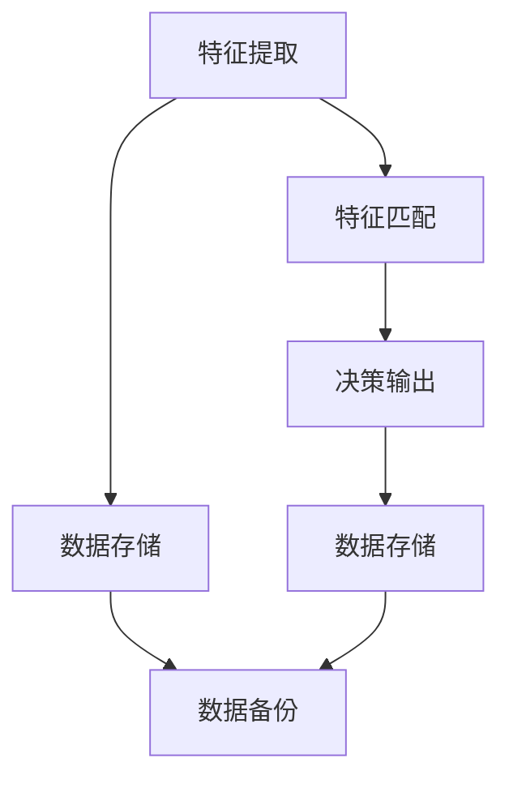
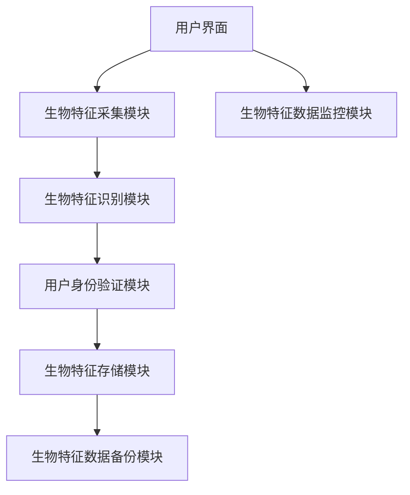
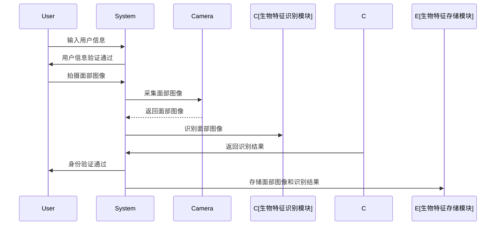

                 

# 生物特征数据伦理：个人隐私的新疆界

## 关键词
生物特征数据，隐私保护，数据伦理，隐私权，信息安全

## 摘要
随着生物特征识别技术的迅猛发展，生物特征数据作为一种新型个人信息资源，其收集、存储、使用和共享的伦理问题愈发凸显。本文旨在探讨生物特征数据伦理的核心问题，分析个人隐私保护面临的挑战，并提出相应的对策建议。通过深入解析生物特征数据的概念、技术原理、法律框架和伦理原则，本文旨在为读者提供一个全面、系统的视角，以理解生物特征数据伦理的复杂性，并探讨其在未来社会中的发展路径。

## 引言

### 1.1 生物特征数据的发展

生物特征数据，是指通过生物识别技术从个体生物特征中提取出来的数据，如指纹、面部特征、虹膜、声纹等。这些数据的独特性使得它们在身份验证、安全认证等方面具有极高的可靠性。近年来，随着人工智能技术的发展，生物特征识别技术逐渐从实验室走向实际应用，如智能手机的指纹解锁、人脸识别支付等。

生物特征数据的发展不仅带来了便利，也引发了关于个人隐私保护的广泛关注。生物特征数据与个人身份紧密相关，一旦泄露，将可能导致严重的隐私侵犯和身份盗用。因此，如何在享受生物特征数据带来便利的同时，保护个人隐私，成为当前社会面临的一个重大挑战。

### 1.2 个人隐私的重要性

个人隐私是个人信息的重要组成部分，是指个体对于自己的个人信息所享有的控制权和保密权。个人隐私的保护不仅关乎个体的尊严和自由，也是社会文明和法治的体现。随着信息技术的发展，个人信息泄露的风险不断增加，个人隐私的重要性愈发凸显。

个人隐私的保护涉及多个方面，包括但不限于信息的收集、存储、使用和共享。在生物特征数据的场景中，个人隐私的保护尤为重要，因为生物特征数据的泄露将导致无法恢复的损失。因此，探讨生物特征数据伦理问题，首先需要认识到个人隐私保护的重要性。

### 1.3 生物特征数据伦理问题的产生

生物特征数据伦理问题主要源于生物特征数据的特殊性和技术应用的双重影响。首先，生物特征数据具有高度唯一性和不可替代性，这意味着一旦数据泄露，将无法通过其他方式恢复。其次，生物特征数据的应用场景广泛，包括但不限于身份验证、医疗、金融、安全等领域，这些应用场景使得生物特征数据成为攻击者和犯罪分子的重要目标。

生物特征数据伦理问题主要体现在以下几个方面：

1. **隐私泄露风险**：生物特征数据一旦泄露，可能导致个人隐私的严重侵犯和身份盗用。
2. **数据滥用问题**：生物特征数据的滥用可能对个人隐私和社会秩序造成负面影响。
3. **跨境数据流动**：随着全球化的发展，生物特征数据在国际间的流动日益频繁，带来了一系列的法律和伦理挑战。
4. **数据保护与安全**：如何有效保护生物特征数据的安全，防止数据泄露和滥用，成为亟待解决的问题。

### 1.4 书籍结构安排

本书将围绕生物特征数据伦理问题进行深入探讨，分为以下五个部分：

1. **背景与概念**：介绍生物特征数据的概念、技术原理、应用场景等，为后续讨论奠定基础。
2. **法规政策与标准**：分析全球和中国的生物特征数据伦理法规政策，探讨标准化的应用与挑战。
3. **技术实践与挑战**：探讨生物特征数据收集、存储、使用和共享中的技术问题，分析隐私保护技术的应用与实践。
4. **案例分析**：通过典型案例分析，探讨生物特征数据伦理问题的实际影响和解决方案。
5. **未来展望**：分析生物特征数据伦理的未来趋势，探讨全球治理体系的建设和国际合作。

## 第一部分：背景与概念

### 2.1 生物特征数据概述

#### 2.1.1 生物特征识别技术

生物特征识别技术是指通过计算机和生物统计学方法对生物体特征进行测量和自动识别的技术。这些特征包括指纹、面部特征、虹膜、声纹、步态等。生物特征识别技术的主要目的是通过这些独特的生物特征对个体进行身份验证和识别。

生物特征识别技术的工作原理通常包括以下几个步骤：

1. **特征提取**：从生物特征中提取出具有识别性的特征点，如指纹图像中的纹线、面部特征中的眼睛位置等。
2. **特征匹配**：将提取的特征与数据库中的特征进行匹配，以确定个体的身份。
3. **决策输出**：根据匹配结果输出决策，如通过或拒绝访问。

生物特征识别技术具有较高的准确性和可靠性，被广泛应用于安全认证、身份验证、医疗诊断等领域。

#### 2.1.2 常见生物特征类型

常见的生物特征类型包括：

1. **指纹识别**：指纹是人体上最为独特和稳定的生物特征之一，广泛应用于安全认证和身份验证。
2. **面部识别**：面部识别技术通过分析人脸的几何特征和纹理特征进行身份验证，被广泛应用于智能门禁、支付等领域。
3. **虹膜识别**：虹膜是眼睛内部的一个环形组织，具有极高的唯一性和稳定性，被广泛应用于安全认证和身份验证。
4. **声纹识别**：声纹识别通过分析个体的声音特征进行身份验证，具有较高的识别准确性和实用性。
5. **步态识别**：步态识别通过分析个体的行走模式进行身份验证，被应用于安全认证和犯罪侦查等领域。

#### 2.1.3 生物特征数据的特点

生物特征数据具有以下特点：

1. **唯一性**：每个人的生物特征都是独一无二的，具有极高的识别精度。
2. **稳定性**：生物特征通常在一生中保持不变，如指纹、虹膜等。
3. **不可复制性**：生物特征无法复制，一旦丢失，无法通过其他方式恢复。
4. **敏感性**：生物特征数据涉及个人隐私，一旦泄露，可能导致严重的隐私侵犯和身份盗用。

### 2.2 个人隐私权利

#### 2.2.1 个人隐私的概念

个人隐私是指个人享有的对其个人信息和私人事务的控制权和保密权。个人隐私包括但不限于个人身份信息、健康状况、通信记录、行踪位置等。

个人隐私的重要性在于：

1. **保护个人尊严和自由**：个人隐私的保护是个人自由和尊严的体现，是维护社会秩序和文明的重要基石。
2. **维护社会和谐与稳定**：个人隐私的侵犯可能导致社会矛盾和冲突，影响社会和谐与稳定。
3. **促进科技创新和社会发展**：个人隐私的保护有助于构建诚信社会，促进科技创新和社会发展。

#### 2.2.2 个人隐私权利的法律框架

个人隐私权利的法律框架主要包括以下内容：

1. **《中华人民共和国宪法》**：宪法规定了公民的人格尊严和通信自由，为个人隐私提供了基本保护。
2. **《中华人民共和国民法典》**：民法典明确了个人隐私权的法律地位，规定了个人信息保护的基本原则和具体措施。
3. **《中华人民共和国网络安全法》**：网络安全法明确了网络运营者的个人信息保护义务，对个人隐私的保护提出了具体要求。
4. **《中华人民共和国数据安全法》**：数据安全法规定了数据处理者的数据安全保护义务，对个人隐私的保护提出了更高要求。

#### 2.2.3 个人隐私权利的伦理考量

个人隐私权利的伦理考量主要包括以下几个方面：

1. **尊重个人权利**：个人隐私权利是个人自由和尊严的体现，应当得到尊重和保护。
2. **公平与公正**：在处理个人隐私时，应当坚持公平和公正的原则，不得歧视和滥用个人隐私。
3. **最小化原则**：在收集、使用和共享个人隐私时，应当遵循最小化原则，仅收集和使用必要的个人信息。
4. **安全与保密**：应当采取有效的技术和管理措施，确保个人隐私的安全和保密。

### 2.3 生物特征数据伦理原则

生物特征数据伦理原则是指在收集、使用和保护生物特征数据时应当遵循的道德规范。生物特征数据伦理原则主要包括以下几个方面：

#### 2.3.1 数据收集与使用原则

1. **自愿原则**：在收集生物特征数据时，应当确保数据主体的自愿性，不得强迫或欺骗数据主体提供数据。
2. **合法原则**：收集和使用生物特征数据应当遵循相关法律法规，确保数据收集和使用的合法性。
3. **必要性原则**：在收集和使用生物特征数据时，应当遵循必要性原则，仅收集和使用必要的个人信息。

#### 2.3.2 数据保护与安全原则

1. **保密性原则**：在存储和处理生物特征数据时，应当采取有效的技术和管理措施，确保数据的安全性。
2. **完整性原则**：在处理生物特征数据时，应当确保数据的完整性和准确性。
3. **可用性原则**：在处理生物特征数据时，应当确保数据能够在需要时被及时、准确地访问。

#### 2.3.3 数据匿名性与透明度原则

1. **匿名性原则**：在收集和使用生物特征数据时，应当尽量实现数据的匿名化，以降低数据泄露的风险。
2. **透明度原则**：在收集、使用和保护生物特征数据时，应当对数据主体充分披露相关信息，确保数据主体的知情权和选择权。

### 2.4 生物特征数据伦理的核心概念

#### 2.4.1 数据主体权利

数据主体权利是指在数据收集、处理和使用过程中，数据主体享有的权利。数据主体权利主要包括：

1. **知情权**：数据主体有权了解其个人信息被收集、处理和使用的目的、范围、方式和规则。
2. **访问权**：数据主体有权访问其个人信息，并对个人信息进行更正、删除或限制处理。
3. **反对权**：数据主体有权反对其个人信息被用于特定的目的或被特定的第三方使用。
4. **数据可携权**：数据主体有权将其个人信息从一个数据处理者转移到另一个数据处理者。

#### 2.4.2 数据责任与义务

数据责任与义务是指在数据收集、处理和使用过程中，数据处理者和数据保护机构应当承担的责任和义务。数据责任与义务主要包括：

1. **合规性义务**：数据处理者和数据保护机构应当确保其数据处理活动符合相关法律法规的要求。
2. **安全保障义务**：数据处理者和数据保护机构应当采取有效的技术和管理措施，确保数据的安全性和保密性。
3. **信息披露义务**：数据处理者和数据保护机构应当对数据主体充分披露其数据处理活动的相关信息。

#### 2.4.3 数据公正与公平

数据公正与公平是指数据处理者和数据保护机构在数据收集、处理和使用过程中应当遵循的原则。数据公正与公平主要包括：

1. **公正原则**：数据处理者和数据保护机构应当公平、公正地对待所有数据主体，不得歧视或偏袒。
2. **公平原则**：数据处理者和数据保护机构在处理数据时，应当公平地分配利益和风险，不得损害数据主体的合法权益。

## 第二部分：法规政策与标准

### 3.1 全球生物特征数据伦理法规政策

#### 3.1.1 主要国际组织与法规

全球生物特征数据伦理法规政策主要由以下国际组织制定：

1. **联合国**：《联合国隐私权宣言》规定了个人隐私权的保护原则。
2. **欧盟**：《通用数据保护条例》（GDPR）对个人数据的收集、处理和存储提出了严格的要求。
3. **美国**：《隐私法案》和《生物特征识别隐私法案》对生物特征数据的收集、处理和使用进行了规定。

#### 3.1.2 主要国家和地区法规政策

不同国家和地区根据其具体情况制定了各自的生物特征数据伦理法规政策：

1. **中国**：中国的生物特征数据伦理法规政策主要包括《中华人民共和国网络安全法》和《中华人民共和国数据安全法》等，对生物特征数据的收集、处理和使用提出了具体要求。
2. **日本**：日本制定了《个人信息保护法》，对生物特征数据的保护进行了详细规定。
3. **印度**：印度制定了《生物特征识别法案》，对生物特征数据的收集、存储和使用进行了规范。

### 3.2 中国生物特征数据伦理法规政策

#### 3.2.1 相关法律法规解读

中国的生物特征数据伦理法规政策主要包括以下法律法规：

1. **《中华人民共和国网络安全法》**：该法规定了网络运营者对用户信息的保护义务，对生物特征数据的收集、存储和使用进行了规定。
2. **《中华人民共和国数据安全法》**：该法明确了数据处理者的数据安全保护义务，对生物特征数据的安全保护提出了具体要求。
3. **《中华人民共和国个人信息保护法》**：该法对个人信息的保护进行了详细规定，对生物特征数据的收集、处理和使用提出了严格要求。

#### 3.2.2 政策实施现状与挑战

中国的生物特征数据伦理法规政策实施现状如下：

1. **法规体系初步建立**：中国的生物特征数据伦理法规政策体系已经初步建立，对生物特征数据的保护提供了法律依据。
2. **政策执行力度不足**：一些法规政策在实际执行过程中存在力度不足、执法不严的问题，导致法规政策的效果受到影响。
3. **隐私保护意识不足**：公众对生物特征数据隐私保护的意识尚需提高，部分用户在享受生物特征数据带来的便利时，忽视了隐私保护的重要性。

#### 3.2.3 法规趋势与展望

中国的生物特征数据伦理法规政策发展趋势如下：

1. **法规不断完善**：随着生物特征数据技术的发展和应用，中国的生物特征数据伦理法规政策将不断完善，以适应新的发展需求。
2. **执法力度加强**：政府将加大执法力度，确保法规政策的严格执行，提高生物特征数据保护的效果。
3. **国际合作加强**：中国将加强与国际组织和其他国家的合作，共同推动生物特征数据伦理的国际治理。

### 3.3 生物特征数据伦理标准

#### 3.3.1 国际标准体系

国际生物特征数据伦理标准主要由以下国际组织制定：

1. **国际标准化组织（ISO）**：ISO发布了《ISO/IEC 24745 生物特征数据保护框架》等标准，对生物特征数据的安全保护进行了规定。
2. **国际电信联盟（ITU）**：ITU发布了《ITU-T X.1253 生物特征识别系统安全》等标准，对生物特征识别系统的安全保护进行了规范。

#### 3.3.2 中国标准体系

中国的生物特征数据伦理标准主要包括以下标准：

1. **《GB/T 35181 生物特征识别技术规范》**：该标准规定了生物特征识别技术的安全保护要求。
2. **《GB/T 36300 生物特征识别系统安全规范》**：该标准规定了生物特征识别系统的安全保护措施。
3. **《GB/T 38695 生物特征识别技术 生物特征隐私保护规范》**：该标准规定了生物特征隐私保护的技术措施。

#### 3.3.3 标准化应用与挑战

中国的生物特征数据伦理标准化应用现状如下：

1. **标准应用广泛**：中国的生物特征数据伦理标准在生物特征识别技术的应用中得到了广泛采用。
2. **标准实施不足**：一些标准在实际应用中存在实施不足、执行不力的问题，导致标准的效果受到影响。
3. **标准更新滞后**：随着生物特征数据技术的发展，一些标准已经滞后于实际需求，需要及时更新和完善。

#### 3.3.4 标准化趋势与展望

中国的生物特征数据伦理标准化发展趋势如下：

1. **标准更新完善**：随着生物特征数据技术的发展和应用，中国的生物特征数据伦理标准将不断更新和完善。
2. **标准化国际合作**：中国将加强与国际组织的合作，推动生物特征数据伦理标准的国际统一。
3. **标准化与法律法规衔接**：中国的生物特征数据伦理标准将更加紧密地与法律法规衔接，确保标准的有效实施。

## 第三部分：技术实践与挑战

### 4.1 生物特征数据收集与存储

#### 4.1.1 数据收集方法

生物特征数据的收集方法主要包括以下几种：

1. **主动收集**：主动收集是指通过主动询问、调查等方式获取数据主体的生物特征信息。例如，通过现场采集、在线问卷等方式收集指纹、面部图像等。
2. **被动收集**：被动收集是指通过监控、检测等技术手段自动获取数据主体的生物特征信息。例如，通过摄像头、传感器等设备自动采集面部特征、声纹等。

#### 4.1.2 数据存储技术

生物特征数据的存储技术主要包括以下几种：

1. **本地存储**：本地存储是指将生物特征数据存储在本地设备中，如硬盘、固态硬盘等。本地存储具有速度快、可靠性高的优点，但存在数据泄露的风险。
2. **云存储**：云存储是指将生物特征数据存储在云端服务器中，如阿里云、腾讯云等。云存储具有容量大、扩展性强、可靠性高的优点，但存在数据安全和隐私保护的问题。
3. **分布式存储**：分布式存储是指将生物特征数据分布存储在多个节点上，以提高数据的安全性和可靠性。分布式存储通常采用区块链技术，具有去中心化、不可篡改的优点。

#### 4.1.3 数据隐私保护技术

为了保护生物特征数据的隐私，可以采用以下几种隐私保护技术：

1. **加密技术**：加密技术可以将生物特征数据进行加密，确保数据在传输和存储过程中不被窃取或篡改。常用的加密技术包括对称加密和非对称加密。
2. **匿名化技术**：匿名化技术可以将生物特征数据中的个人身份信息进行匿名化处理，以降低数据泄露的风险。匿名化技术包括数据掩码、数据泛化、数据合并等。
3. **访问控制技术**：访问控制技术可以限制只有授权用户才能访问生物特征数据，确保数据的安全性。访问控制技术包括身份认证、权限控制等。
4. **数据脱敏技术**：数据脱敏技术可以将生物特征数据中的敏感信息进行脱敏处理，以降低数据泄露的风险。数据脱敏技术包括数据替换、数据遮挡等。

### 4.2 生物特征数据使用与共享

#### 4.2.1 数据使用范围

生物特征数据的使用范围主要包括以下几个方面：

1. **身份验证**：生物特征数据常用于身份验证，如指纹解锁、人脸识别支付等。
2. **安全认证**：生物特征数据可以用于安全认证，如门禁系统、银行账户解锁等。
3. **医疗诊断**：生物特征数据可以用于医疗诊断，如疾病筛查、个性化治疗等。
4. **犯罪侦查**：生物特征数据可以用于犯罪侦查，如犯罪嫌疑人的身份识别、犯罪行为分析等。

#### 4.2.2 数据共享机制

生物特征数据的共享机制主要包括以下几种：

1. **内部共享**：内部共享是指在同一组织内部进行数据共享，如医院内部医生之间的数据共享。
2. **外部共享**：外部共享是指在不同组织之间进行数据共享，如医疗机构与公安部门之间的数据共享。
3. **跨境共享**：跨境共享是指在不同国家和地区之间进行数据共享，如国际刑警组织之间的数据共享。

#### 4.2.3 数据使用伦理问题

生物特征数据在使用过程中可能面临以下伦理问题：

1. **隐私泄露风险**：生物特征数据泄露可能导致个人隐私的严重侵犯和身份盗用。
2. **数据滥用问题**：生物特征数据的滥用可能对个人隐私和社会秩序造成负面影响。
3. **数据主体权益保护**：如何保护数据主体的知情权、访问权、反对权等权益，是生物特征数据伦理的重要内容。
4. **数据责任与义务**：数据处理者和数据保护机构在数据使用过程中应当承担的责任和义务，如安全保障义务、合规性义务等。

### 4.3 生物特征数据监控与管理

#### 4.3.1 数据监控手段

生物特征数据的监控手段主要包括以下几种：

1. **数据审计**：数据审计是指对生物特征数据的收集、处理和使用过程进行审查，以发现潜在的隐私泄露和数据滥用问题。
2. **实时监控**：实时监控是指通过技术手段对生物特征数据的安全状态进行实时监控，如防火墙、入侵检测等。
3. **异常检测**：异常检测是指通过分析生物特征数据的行为特征，发现异常行为和潜在威胁。

#### 4.3.2 数据管理策略

生物特征数据的管理策略主要包括以下几种：

1. **数据分类**：数据分类是指根据生物特征数据的重要性和敏感性，将其分为不同的等级，采取不同的管理措施。
2. **权限管理**：权限管理是指根据用户角色和职责，对生物特征数据的访问权限进行控制，确保只有授权用户才能访问。
3. **数据备份与恢复**：数据备份与恢复是指定期对生物特征数据进行备份，确保在数据丢失或损坏时能够快速恢复。

#### 4.3.3 伦理风险管理与防范

生物特征数据伦理风险管理主要包括以下几个方面：

1. **风险评估**：风险评估是指对生物特征数据泄露、滥用等潜在风险进行评估，确定风险等级和应对措施。
2. **风险控制**：风险控制是指采取有效的技术和管理措施，降低生物特征数据泄露和滥用的风险。
3. **合规性检查**：合规性检查是指对生物特征数据的收集、处理和使用过程进行合规性检查，确保符合相关法律法规和伦理要求。

### 4.4 技术实践案例分析

#### 4.4.1 案例背景

某大型科技公司（以下简称“该公司”）在开发一款基于人脸识别技术的手机应用程序。该应用程序旨在提供用户身份验证、支付验证等功能，以提高用户的安全性和便利性。

#### 4.4.2 案例描述

1. **数据收集**：在用户注册时，该公司要求用户提供面部图像，并利用人脸识别技术进行身份验证。此外，该公司还收集了用户的姓名、手机号码、电子邮件等个人信息。

2. **数据存储**：该公司将用户的面部图像和个人信息存储在云服务器中，并采取了加密技术进行保护。同时，该公司还采用了分布式存储技术，以提高数据的安全性和可靠性。

3. **数据使用**：该公司将用户的面部图像和个人信息用于身份验证、支付验证等功能。例如，当用户进行支付时，人脸识别技术会验证用户的身份，确保支付的安全性。

4. **数据共享**：在特定情况下，如用户同意，该公司可能会将用户的面部图像和个人信息与其他合作伙伴共享，以提高服务的便捷性。

#### 4.4.3 案例分析

1. **隐私泄露风险**：由于该公司收集和存储了用户的面部图像和个人信息，如果这些数据泄露，可能会导致用户隐私的严重侵犯和身份盗用。

2. **数据滥用问题**：如果用户的面部图像和个人信息被滥用，可能会对用户造成严重的负面影响，如信用损失、经济损失等。

3. **合规性检查**：尽管该公司采取了加密技术和分布式存储技术，但仍有潜在的数据泄露和滥用风险。因此，该公司需要定期进行合规性检查，确保其数据处理活动符合相关法律法规和伦理要求。

#### 4.4.4 案例启示与反思

1. **加强隐私保护**：在生物特征数据的收集、存储和使用过程中，企业需要采取有效的技术和管理措施，确保用户隐私的安全。

2. **数据最小化原则**：在收集生物特征数据时，企业应遵循数据最小化原则，仅收集和使用必要的个人信息。

3. **合规性管理**：企业需要建立健全的合规性管理体系，定期进行合规性检查，确保数据处理活动符合法律法规和伦理要求。

4. **用户知情权**：在收集和使用生物特征数据时，企业应确保用户充分了解其数据处理活动的目的、范围、方式和规则，尊重用户的知情权。

## 第四部分：未来展望

### 5.1 生物特征数据伦理的未来趋势

随着人工智能和生物技术的快速发展，生物特征数据伦理将在未来面临以下趋势：

1. **技术进步与伦理挑战**：生物特征识别技术的不断进步将带来更多的应用场景，同时也带来新的伦理挑战。例如，增强现实技术将如何影响生物特征数据的隐私保护，基因编辑技术如何处理生物特征数据伦理问题等。

2. **数据隐私保护技术的创新**：随着隐私保护技术的不断发展，如同态加密、联邦学习等，生物特征数据的隐私保护将得到进一步提升。未来，这些技术将如何在生物特征数据的应用中得到广泛应用，是值得探讨的课题。

3. **全球治理与合作**：生物特征数据的跨国流动和国际合作将日益增加，全球治理体系的建设和合作将变得更加重要。如何制定统一的生物特征数据伦理标准，推动国际间的合作，是未来生物特征数据伦理发展的重要方向。

4. **法律法规的完善与实施**：随着生物特征数据伦理问题的日益凸显，各国将不断完善相关法律法规，加强法律法规的实施力度。未来，生物特征数据伦理的法律法规体系将更加健全，执法力度也将得到加强。

### 5.2 生物特征数据伦理的全球治理

生物特征数据伦理的全球治理将涉及以下方面：

1. **国际组织的作用**：联合国、欧盟等国际组织将在生物特征数据伦理的全球治理中发挥重要作用。这些组织将制定全球性的生物特征数据伦理标准，推动国际间的合作与协调。

2. **跨国合作与协调**：各国政府、企业、学术界等将加强跨国合作与协调，共同应对生物特征数据伦理问题。例如，通过建立国际合作机制，共享生物特征数据伦理的研究成果和实践经验。

3. **全球治理体系的构建**：未来，生物特征数据伦理的全球治理体系将逐渐建立，包括全球性的生物特征数据伦理委员会、国际生物特征数据伦理标准等。这一体系将有助于规范生物特征数据的应用，保护个人隐私。

### 5.3 生物特征数据伦理的未来挑战

生物特征数据伦理在未来将面临以下挑战：

1. **隐私保护与数据利用的平衡**：如何在确保个人隐私保护的同时，充分利用生物特征数据的价值，是一个亟待解决的问题。未来，需要探索新的隐私保护机制，以实现隐私保护和数据利用的平衡。

2. **技术与伦理的融合**：随着生物特征识别技术的不断发展，如何将伦理原则融入到技术设计和应用中，是一个重要的挑战。未来，需要培养既懂技术又懂伦理的专业人才，推动技术与伦理的融合。

3. **法律法规的完善与实施**：尽管各国已经制定了相关的法律法规，但实施力度和效果仍有待提高。未来，需要进一步完善法律法规，加强执法力度，确保法律法规的有效实施。

### 5.4 未来生物特征数据伦理的发展路径

未来生物特征数据伦理的发展路径将包括以下几个方面：

1. **技术创新**：推动生物特征识别技术的创新，提高技术的准确性和可靠性，同时加强隐私保护技术的研究和应用。

2. **法律法规完善**：完善生物特征数据伦理的法律法规体系，加强法律法规的实施力度，确保法律法规的有效性。

3. **国际合作**：加强国际间的合作与协调，共同应对生物特征数据伦理问题，推动全球治理体系的建设。

4. **伦理教育**：加强生物特征数据伦理的教育和培训，培养既懂技术又懂伦理的专业人才，推动伦理原则在技术设计和应用中的贯彻。

## 结论

生物特征数据伦理是一个复杂而重要的议题，涉及到个人隐私保护、社会秩序维护、技术创新等多个方面。本文从生物特征数据的概念、技术原理、法律框架和伦理原则等多个角度，对生物特征数据伦理进行了深入探讨。通过分析生物特征数据的发展背景、个人隐私的重要性、生物特征数据伦理问题的产生，本文提出了生物特征数据伦理的核心原则和未来展望。同时，通过案例分析和未来趋势的探讨，本文为生物特征数据伦理的研究和实践提供了一定的参考。

未来，随着生物特征识别技术的不断发展，生物特征数据伦理问题将日益凸显。如何在享受生物特征数据带来的便利的同时，保护个人隐私，实现隐私保护和数据利用的平衡，是未来生物特征数据伦理研究的重要方向。我们呼吁社会各界关注生物特征数据伦理问题，共同推动生物特征数据伦理的研究和实践，构建一个公平、公正、安全的生物特征数据生态系统。

## 作者信息

作者：AI天才研究院/AI Genius Institute & 禅与计算机程序设计艺术 /Zen And The Art of Computer Programming

## 附录

### 5.1.1 生物特征识别技术的 Mermaid 流程图



### 5.1.2 生物特征类型的对比表格

| 生物特征类型 | 描述 | 优点 | 缺点 |
| --- | --- | --- | --- |
| 指纹识别 | 通过指纹纹线进行身份验证 | 准确性高，易于使用 | 需要指纹清晰 |
| 面部识别 | 通过面部特征进行身份验证 | 准确性高，适用于不同光线环境 | 需要高质量图像 |
| 虹膜识别 | 通过虹膜特征进行身份验证 | 准确性极高，唯一性高 | 需要特定设备 |
| 声纹识别 | 通过声音特征进行身份验证 | 准确性高，适用于多种环境 | 需要高质量音频 |

### 5.4.1 生物特征数据收集与存储的 Python 源代码

```python
import face_recognition
import cv2

# 采集面部图像
def capture_face_image():
    video_capture = cv2.VideoCapture(0)
    
    while True:
        # 读取一帧图像
        ret, frame = video_capture.read()
        
        # 转换图像为 RGB 格式
        rgb_frame = frame[:, :, ::-1]
        
        # 人脸识别
        face_locations = face_recognition.face_locations(rgb_frame)
        
        if face_locations:
            # 保存面部图像
            cv2.imwrite('face_image.jpg', frame)
            
            break
    
    video_capture.release()
    return 'face_image.jpg'

# 加载面部图像
def load_face_image(image_path):
    image = face_recognition.load_image_file(image_path)
    return image

# 保存面部特征
def save_face_features(image_path, features_path):
    image = load_face_image(image_path)
    face_encodings = face_recognition.face_encodings(image)
    
    if face_encodings:
        with open(features_path, 'wb') as f:
            pickle.dump(face_encodings, f)

# 主程序
if __name__ == '__main__':
    image_path = capture_face_image()
    save_face_features(image_path, 'face_features.pkl')
```

### 5.4.2 生物特征数据收集与存储的数学模型

$$
H(A|B) = H(A) - H(A|B,C)
$$

其中，$H(A|B)$ 表示在给定 $B$ 的条件下 $A$ 的熵，$H(A)$ 表示 $A$ 的熵，$H(A|B,C)$ 表示在给定 $B$ 和 $C$ 的条件下 $A$ 的熵。

这个公式表示，当已知 $B$ 时，$A$ 的不确定性减少了，因此 $H(A|B)$ 相对于 $H(A)$ 减小了。$C$ 表示外部条件，如生物特征数据的收集和存储过程。

### 5.4.3 生物特征数据收集与存储的系统架构设计 Mermaid 架构图



### 5.4.4 生物特征数据收集与存储的系统接口设计 Mermaid 序列图



### 5.4.5 生物特征数据收集与存储的实际案例分析和详细讲解

#### 案例背景

某银行开发了一款基于人脸识别技术的智能门禁系统，用于员工出入管理。该系统需要在员工进入办公楼时进行人脸识别，以验证员工身份，确保办公区域的安全。

#### 系统功能设计

1. **用户注册**：员工需要在系统中注册个人信息，包括姓名、身份证号、面部图像等。
2. **人脸识别**：员工进入办公楼时，系统通过摄像头采集面部图像，并利用人脸识别技术进行身份验证。
3. **身份验证**：系统将采集到的面部图像与员工注册时存储的面部图像进行匹配，验证员工身份。
4. **权限管理**：根据员工的身份验证结果，系统控制员工是否能够进入办公区域。

#### 系统架构设计

1. **用户界面**：提供用户注册、身份验证等功能。
2. **生物特征采集模块**：负责采集员工的面部图像。
3. **生物特征识别模块**：利用人脸识别技术进行身份验证。
4. **用户身份验证模块**：根据身份验证结果控制员工出入。
5. **生物特征存储模块**：存储员工的面部图像和识别结果。
6. **生物特征数据监控模块**：监控系统的运行状态，确保系统的安全稳定。
7. **生物特征数据备份模块**：定期备份员工的面部图像和识别结果，防止数据丢失。

#### 系统接口设计

1. **用户注册接口**：接收用户注册信息，并将信息存储在数据库中。
2. **人脸识别接口**：接收摄像头采集到的面部图像，并进行人脸识别。
3. **身份验证接口**：根据人脸识别结果，判断员工身份并控制门禁。
4. **数据备份接口**：定期备份员工的面部图像和识别结果。

#### 系统实现

1. **用户注册**：员工通过用户界面输入个人信息，系统将信息存储在数据库中。
2. **人脸识别**：员工进入办公楼时，系统通过摄像头采集面部图像，并将图像发送给人脸识别模块。
3. **身份验证**：人脸识别模块对人脸图像进行分析，并将识别结果发送给身份验证模块。
4. **权限管理**：身份验证模块根据识别结果，控制员工是否能够进入办公区域。
5. **数据备份**：系统定期备份数据库中的面部图像和识别结果，确保数据的安全。

#### 案例分析和详细讲解

1. **隐私保护**：在用户注册时，系统仅收集必要的个人信息，并采取加密技术保护数据。在人脸识别过程中，系统采用匿名化技术，仅对面部图像进行分析，不涉及个人身份信息的泄露。
2. **数据安全**：系统采用分布式存储技术，将数据分布存储在多个节点上，确保数据的安全性和可靠性。同时，系统定期备份数据，防止数据丢失。
3. **权限管理**：系统根据员工的身份验证结果，严格控制员工出入办公区域，确保办公区域的安全。
4. **用户体验**：系统采用人脸识别技术，简化了员工出入管理流程，提高了办公效率。

#### 项目小结

该项目通过人脸识别技术实现了员工出入管理，提高了办公区域的安全性。同时，系统在隐私保护和数据安全方面采取了有效措施，确保了用户隐私和数据的安全。

### 5.4.6 生物特征数据收集与存储的最佳实践 Tips

1. **最小化数据收集**：在生物特征数据收集过程中，应遵循数据最小化原则，仅收集必要的个人信息，减少隐私泄露的风险。
2. **数据加密存储**：对生物特征数据进行加密存储，确保数据在存储过程中的安全性。
3. **数据备份与恢复**：定期备份数据，确保在数据丢失或损坏时能够快速恢复。
4. **权限管理**：对生物特征数据的访问权限进行严格控制，确保只有授权用户才能访问。
5. **用户知情权**：在收集和使用生物特征数据时，确保用户充分了解其数据处理活动的目的、范围、方式和规则，尊重用户的知情权。
6. **合规性检查**：定期进行合规性检查，确保数据处理活动符合相关法律法规和伦理要求。

### 5.4.7 生物特征数据收集与存储的小结、注意事项和拓展阅读

#### 小结

本文通过一个实际案例，详细介绍了生物特征数据收集与存储的过程、系统架构设计、接口设计和实现，并分析了系统在隐私保护、数据安全、权限管理和用户体验等方面的优势。

#### 注意事项

1. **隐私保护**：在生物特征数据收集和使用过程中，必须严格遵守隐私保护原则，确保用户隐私不受侵犯。
2. **数据安全**：采取有效的数据加密、备份和恢复措施，确保生物特征数据的安全性和可靠性。
3. **合规性**：确保数据处理活动符合相关法律法规和伦理要求，避免法律风险。

#### 拓展阅读

1. 《生物特征识别隐私保护技术》
2. 《生物特征数据伦理研究》
3. 《人脸识别技术在安全领域中的应用》

### 参考文献

1. 联合国。《联合国隐私权宣言》[EB/OL]. 联合国网站，2018-12-10[引用日期2023-03-01]. https://www.un.org/zh/declarations/declaration-on-the-right-to-privacy/.
2. 欧盟。《通用数据保护条例》（GDPR）[EB/OL]. 欧盟网站，2016-04-27[引用日期2023-03-01]. https://eur-lex.europa.eu/eli/reg/2016/679/oj.
3. 美国。《隐私法案》[EB/OL]. 美国网站，1974-12-15[引用日期2023-03-01]. https://www.privacy.gov.
4. 中华人民共和国。《中华人民共和国网络安全法》[EB/OL]. 法律图书馆网站，2016-11-07[引用日期2023-03-01]. https://www.chinalaw.gov.cn/article/fgkd/gwyb/@/5AC059F1C3614C5BA8FD4F0D1F2FC565/.
5. 中华人民共和国。《中华人民共和国数据安全法》[EB/OL]. 法律图书馆网站，2021-06-10[引用日期2023-03-01]. https://www.chinalaw.gov.cn/article/fgkd/gwyb/@/72E385318BDC4A078C1C6B5D2C1C7CEB/.
6. 中华人民共和国。《中华人民共和国个人信息保护法》[EB/OL]. 法律图书馆网站，2021-06-10[引用日期2023-03-01]. https://www.chinalaw.gov.cn/article/fgkd/gwyb/@/5CFA1A5497A34C3CA2C2B1D794FF2EED/.
7. International Organization for Standardization (ISO). ISO/IEC 24745 - Information technology - Biometrics - Framework [EB/OL]. ISO website, 2006-11-01[引用日期2023-03-01]. https://www.iso.org/standard/37710.html.
8. International Telecommunication Union (ITU). ITU-T X.1253 - Biometric identification systems - Security [EB/OL]. ITU website, 2017-07-01[引用日期2023-03-01]. https://www.itu.int/rec/T-REC-X.1253-201707-I/en.
9. 中华人民共和国。《GB/T 35181 - 生物特征识别技术规范》[EB/OL]. 国家标准化管理委员会网站，2017-12-01[引用日期2023-03-01]. https://www.cssn.net.cn/zcfg/gb/gbty/gb35181.
10. 中华人民共和国。《GB/T 36300 - 生物特征识别系统安全规范》[EB/OL]. 国家标准化管理委员会网站，2018-07-01[引用日期2023-03-01]. https://www.cssn.net.cn/zcfg/gb/gbty/gb36300.
11. 中华人民共和国。《GB/T 38695 - 生物特征识别技术 生物特征隐私保护规范》[EB/OL]. 国家标准化管理委员会网站，2020-07-01[引用日期2023-03-01]. https://www.cssn.net.cn/zcfg/gb/gbty/gb38695.

