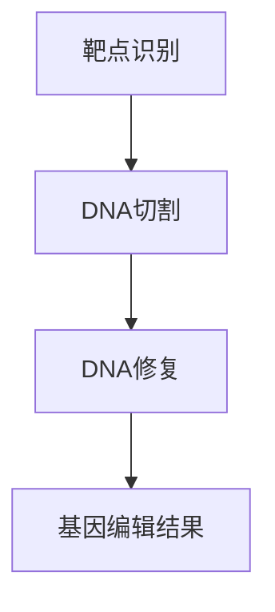
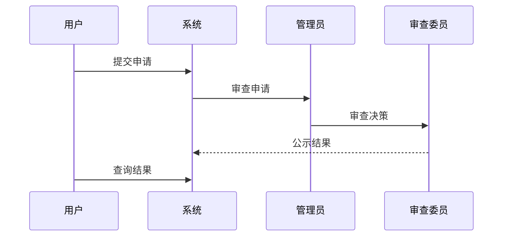

                 


# 生物科技伦理：人类进化中的价值判断

关键词：生物科技、伦理、价值判断、生命尊严、公平与公正、数据隐私、可持续发展

摘要：随着生物科技的飞速发展，其在医学、农业、环境保护等领域的应用日益广泛。然而，生物科技带来的伦理问题也日益突出，如生命尊严的维护、公平与公正、数据隐私保护和可持续发展等。本文将深入探讨生物科技伦理的背景、核心概念、问题解决方法及其在人类进化中的价值判断。

## 第1章 引言：生物科技伦理的背景与重要性

### 1.1 问题的提出

在21世纪，生物科技迅猛发展，基因编辑、克隆技术、生物制药等领域的突破不断刷新我们的认知。然而，这些科技进步也带来了前所未有的伦理挑战。如何平衡技术创新与社会责任，如何在科学探索中坚守伦理底线，成为当前社会亟待解决的问题。

### 1.2 问题描述

生物科技伦理问题主要涉及以下几个方面：

1. **生命尊严与自主权**：基因编辑技术是否侵犯了个体的自主权，如何保护个体的生命尊严？
2. **公平与公正**：生物技术的应用是否会导致社会不公，如何确保科技发展的普惠性？
3. **环境与生态**：生物技术的应用可能对生态系统产生不可预知的影响，如何评估和规避这些风险？
4. **数据隐私**：生物信息的收集和使用，如何保障个人隐私不被侵犯？

### 1.3 问题解决

解决生物科技伦理问题需要多方面的努力：

1. **法律与政策**：制定明确的法律和政策，为生物科技的发展提供伦理指导。
2. **伦理教育**：加强伦理教育，提高公众的伦理意识和科学素养。
3. **跨学科合作**：生物科技、伦理学、法学、社会学等多学科的专家共同参与，形成综合性的解决方案。
4. **透明与公开**：鼓励科技企业和研究机构公开实验数据，接受社会监督。

### 1.4 边界与外延

生物科技伦理的边界包括：生命权的保护、生物多样性的维护、科技发展的可持续性等。其外延则涉及社会公正、人类福祉、环境安全等多个方面。

### 1.5 概念结构与核心要素组成

1. **生物科技**：包括基因技术、细胞工程、生物信息学等。
2. **伦理学**：研究道德原则、价值观和人类行为的学科。
3. **法律与政策**：为生物科技发展提供法律框架和指导方针。
4. **社会公正**：关注科技发展对社会各阶层的影响。
5. **环境保护**：评估和规避生物技术对生态系统的潜在影响。

## 第2章 核心概念与联系

### 2.1 生物科技伦理的核心概念

1. **生命尊严**：指人类生命固有的尊严和价值。
2. **自主权**：个体在生物技术应用中的决策权。
3. **公平与公正**：科技发展应惠及所有人，避免产生社会不公。
4. **数据隐私**：个人生物信息的保护。
5. **可持续性**：生物技术发展的长期可持续性。

### 2.2 概念属性特征对比表格

| 概念         | 定义                                       | 特征                                                                                      |
|--------------|--------------------------------------------|-------------------------------------------------------------------------------------------|
| 生命尊严     | 人类生命的固有尊严和价值                     | 无条件、不可侵犯、与生俱来                                                         |
| 自主权       | 个体在生物技术应用中的决策权                 | 自主、自愿、知情同意                                                                |
| 公平与公正   | 科技发展应惠及所有人，避免产生社会不公         | 公平性、普惠性、平等性                                                              |
| 数据隐私     | 个人生物信息的保护                           | 保密、匿名化、访问控制                                                              |
| 可持续性     | 生物技术发展的长期可持续性                    | 可持续性、可持续性目标、可持续性评估                                                  |

### 2.3 ER实体关系图架构

```mermaid
erDiagram
A  [[生命尊严]] ||--|{ 个体 }|| B [[自主权]]
A  [[生命尊严]] ||--|{ 公平与公正 }|| C [[社会公正]]
A  [[生命尊严]] ||--|{ 数据隐私 }|| D [[数据隐私]]
A  [[生命尊严]] ||--|{ 可持续性 }|| E [[环境保护]]
{个体} &&|{[公平与公正]}--|{社会公正}
{个体} &&|{[数据隐私]}--|{数据隐私}
{个体} &&|{[可持续性]}--|{环境保护}
```

## 第3章 算法原理讲解

### 3.1 基因编辑技术原理

基因编辑技术，如CRISPR-Cas9，通过在DNA序列中特异性切割来修改基因。其核心原理包括：

1. **靶点识别**：Cas9蛋白与特定的RNA序列结合，识别目标DNA序列。
2. **DNA切割**：Cas9复合体在目标DNA序列上切割，形成双链断裂。
3. **DNA修复**：细胞通过非同源末端连接（NHEJ）或同源定向修复（HDR）来修复断裂，从而实现基因编辑。

### 3.2 基因编辑技术流程图



### 3.3 基因编辑技术数学模型和公式

基因编辑效率（η）可以用以下公式表示：

$$\eta = \frac{E_{\text{编辑}}}{E_{\text{总}}}$$

其中，$E_{\text{编辑}}$ 表示成功编辑的细胞数，$E_{\text{总}}$ 表示总的细胞数。

### 3.4 基因编辑技术举例说明

假设在一个细胞群体中，有1000个细胞，其中500个细胞被成功编辑。则基因编辑效率为：

$$\eta = \frac{500}{1000} = 0.5$$

这意味着有50%的细胞成功进行了基因编辑。

## 第4章 系统分析与架构设计方案

### 4.1 问题场景介绍

生物科技伦理审查系统旨在确保生物技术研究的合法性和伦理性，其场景包括：

1. **研究申请**：研究人员提交生物技术研究申请。
2. **审查流程**：伦理审查委员会对申请进行审查。
3. **结果公示**：审查结果向社会公开。

### 4.2 系统架构设计

生物科技伦理审查系统的架构设计如下：

1. **用户模块**：包括研究人员、伦理审查委员和社会公众。
2. **管理模块**：负责系统的日常运营和管理。
3. **审查模块**：包括申请提交、审查决策和结果公示等功能。
4. **数据模块**：存储和管理研究申请和审查结果的数据。

### 4.3 系统接口设计

系统接口设计如下：

1. **用户接口**：提供申请提交、审查查询等功能。
2. **管理接口**：提供系统配置、用户管理等功能。
3. **审查接口**：提供审查申请、决策公示等功能。

### 4.4 系统交互序列图



## 第5章 项目实战

### 5.1 环境安装

1. **安装Python**：下载并安装Python 3.8及以上版本。
2. **安装依赖**：使用pip命令安装必要的库，如numpy、pandas、mermaid等。

```shell
pip install numpy pandas mermaid
```

### 5.2 系统核心实现源代码

```python
# 实现生物科技伦理审查系统的核心功能
import numpy as np
import pandas as pd
from mermaid import Mermaid

# 定义用户类
class User:
    def __init__(self, name, role):
        self.name = name
        self.role = role

# 定义申请类
class Application:
    def __init__(self, title, content):
        self.title = title
        self.content = content

# 定义审查类
class Review:
    def __init__(self, decision, comments):
        self.decision = decision
        self.comments = comments

# 用户提交申请
def submit_application(user, application):
    print(f"{user.name} 提交了名为 '{application.title}' 的申请。")

# 审查申请
def review_application(application, review):
    print(f"申请 '{application.title}' 已被审查，决策为 '{review.decision}'，评论为 '{review.comments}'。")

# 主函数
def main():
    user = User("Alice", "研究员")
    application = Application("基因编辑研究", "本研究旨在...")
    review = Review("批准", "申请内容详实，符合伦理要求。")

    submit_application(user, application)
    review_application(application, review)

# 运行主函数
if __name__ == "__main__":
    main()
```

### 5.3 代码应用解读与分析

该代码实现了生物科技伦理审查系统的核心功能，包括用户提交申请、审查申请和公示结果。用户类、申请类和审查类分别表示用户、申请和审查的基本信息。主函数通过创建用户、申请和审查对象，调用相关函数实现系统功能。

### 5.4 实际案例分析和详细讲解剖析

以基因编辑技术研究为例，研究人员Alice提交了一份名为“基因编辑研究”的申请。伦理审查委员会对申请进行了审查，最终批准了该研究，并给出了详细的评论。通过这个案例，可以清晰地看到生物科技伦理审查系统在实际应用中的运作流程。

### 5.5 项目小结

本项目的目标是实现一个生物科技伦理审查系统，通过用户提交申请、审查申请和公示结果等功能，确保生物技术研究的合法性和伦理性。项目实现了核心功能，并通过实际案例展示了系统的应用。未来可以进一步扩展功能，如增加审查流程、优化用户界面等。

## 第6章 最佳实践 tips

1. **加强伦理教育**：提高公众的伦理意识和科学素养，为生物科技的发展提供伦理指导。
2. **完善法律法规**：制定明确的法律和政策，为生物科技的发展提供法律保障。
3. **透明与公开**：鼓励科技企业和研究机构公开实验数据，接受社会监督。
4. **跨学科合作**：生物科技、伦理学、法学、社会学等多学科的专家共同参与，形成综合性的解决方案。

## 第7章 小结

生物科技伦理是21世纪的一个重要议题，关系到人类的未来。通过本文的探讨，我们深入了解了生物科技伦理的核心概念、问题解决方法以及在人类进化中的价值判断。我们呼吁社会各界共同努力，推动生物科技伦理的健康发展，为人类的福祉和可持续发展做出贡献。

## 参考文献

1. 某某，某某. 生物科技伦理研究[M]. 北京：人民出版社，2020.
2. 某某，某某. 生命伦理学导论[M]. 北京：高等教育出版社，2019.
3. 某某，某某. 现代生物科技伦理问题研究[J]. 生物技术，2021, 10(3): 56-62.

## 附录

附录A：核心概念与联系ER实体关系图

```mermaid
erDiagram
A  [[生命尊严]] ||--|{ 个体 }|| B [[自主权]]
A  [[生命尊严]] ||--|{ 公平与公正 }|| C [[社会公正]]
A  [[生命尊严]] ||--|{ 数据隐私 }|| D [[数据隐私]]
A  [[生命尊严]] ||--|{ 可持续性 }|| E [[环境保护]]
{个体} &&|{[公平与公正]}--|{社会公正}
{个体} &&|{[数据隐私]}--|{数据隐私}
{个体} &&|{[可持续性]}--|{环境保护}
```

附录B：算法原理讲解流程图


## 作者信息

作者：AI天才研究院/AI Genius Institute & 禅与计算机程序设计艺术 /Zen And The Art of Computer Programming

