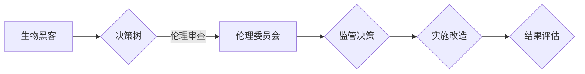
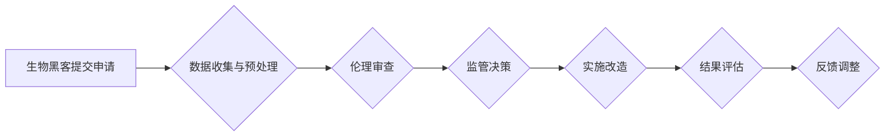

                 

# {{此处是文章标题}}

> 关键词：生物黑客、自我改造、伦理委员会、国际监管、算法原理

> 摘要：本文深入探讨了生物黑客伦理委员会这一自我改造时代的国际监管机构。通过分析其背景、核心概念、算法原理及其在跨国合作与协调中的挑战与趋势，本文旨在揭示该监管机构在保障个体权益与公共安全中的重要作用，为未来生物黑客伦理监管提供有益的参考。

----------------------------------------------------------------

### 目录大纲

----------------------------------------------------------------

# 第一部分：引言

## 1.1 问题背景与概述

### 1.1.1 生物黑客的崛起

### 1.1.2 自我改造的伦理挑战

### 1.1.3 国际监管机构的必要性

## 1.2 生物黑客伦理委员会的作用

### 1.2.1 监管机构的使命

### 1.2.2 伦理审查流程

### 1.2.3 保障个体权益与公共安全

## 1.3 国际监管机构的挑战与趋势

### 1.3.1 跨国合作与协调

### 1.3.2 科技发展的伦理前瞻

### 1.3.3 未来监管机构的发展方向

----------------------------------------------------------------

# 第二部分：核心概念与联系

## 2.1 核心概念

### 2.1.1 生物黑客

#### 2.1.1.1 定义

#### 2.1.1.2 特点

#### 2.1.1.3 影响力

### 2.1.2 伦理

#### 2.1.2.1 定义

#### 2.1.2.2 类型

#### 2.1.2.3 关键要素

### 2.1.3 国际监管机构

#### 2.1.3.1 定义

#### 2.1.3.2 类型

#### 2.1.3.3 作用

----------------------------------------------------------------

## 2.2 概念属性特征对比表格

### 2.2.1 生物黑客与伦理的关系
| 特征       | 生物黑客 | 伦理         |
|------------|----------|-------------|
| 定义       | 个体对生物体进行的自我改造或干预 | 人与道德规范的关系 |
| 影响力     | 个人与社会的生物科技实践   | 个人与群体的道德共识 |
| 法律地位   | 规则制定者与挑战者       | 法律制定者与执行者 |

----------------------------------------------------------------

## 2.3 ER实体关系图架构

```mermaid
erDiagram
  BIOSURGION ||--|{ ETHICAL_committee }|| REGULATORY_AGENCY
  BIOSURGION ||--|{ ETHICAL_REVIEW }|| ETHICAL_FRAMEWORK
  ETHICAL_REVIEW ||--|{ ETHICAL_ISSUE }|| ETHICAL_CODE_OF_CONDUCT
```

----------------------------------------------------------------

# 第三部分：算法原理讲解

## 3.1 自我改造算法的mermaid流程图



## 3.2 Python源代码与算法原理

### 3.2.1 算法原理

### 3.2.2 数学模型与公式

### 3.2.3 举例说明

----------------------------------------------------------------
## 1.1 问题背景与概述

### 1.1.1 生物黑客的崛起

随着生物科技的快速发展，人类对自身生物体的干预能力日益增强。生物黑客，这一群体由此崛起。生物黑客是指那些利用现代生物技术，如基因编辑、生物电子等手段对自身或他人进行自我改造的一群人。他们追求的是超越自然界限，通过技术手段提升自身能力或改善生理缺陷。

生物黑客的崛起引起了社会的广泛关注。一方面，他们展示了人类对生物科技的无穷潜力，另一方面，他们的行为也引发了伦理和法律方面的争议。例如，基因编辑技术虽然在治疗遗传疾病方面具有巨大潜力，但未经严格伦理审查的自我改造行为可能会带来不可预知的风险。

### 1.1.2 自我改造的伦理挑战

自我改造行为所带来的伦理挑战是多方面的。首先，个体自我改造可能导致社会不平等。那些拥有经济实力进行自我改造的人可能会在社会竞争中占据优势，而无法承担这一成本的人则可能被边缘化。

其次，自我改造的伦理问题还涉及到个体自主权与公共安全之间的平衡。生物黑客的某些改造行为可能对公共安全构成威胁，如通过基因编辑增强自身攻击能力。因此，如何保障个体自主权的同时维护公共安全成为伦理委员会必须考虑的问题。

### 1.1.3 国际监管机构的必要性

为了应对自我改造带来的伦理挑战，国际监管机构的建立显得尤为重要。生物黑客伦理委员会作为一种国际监管机构，其主要职责是：

1. **伦理审查**：对生物黑客的自我改造行为进行严格的伦理审查，确保其符合伦理标准。
2. **风险评估**：评估自我改造行为可能带来的风险，提供科学依据。
3. **政策制定**：制定相关政策和法规，规范生物黑客的行为。
4. **国际合作**：与其他国家和国际组织合作，共同应对全球范围内的生物黑客问题。

生物黑客伦理委员会的建立不仅有助于保障个体权益和公共安全，还能促进生物科技行业的健康发展。

----------------------------------------------------------------

## 1.2 生物黑客伦理委员会的作用

### 1.2.1 监管机构的使命

生物黑客伦理委员会的使命是确保自我改造行为符合伦理标准，保障个体权益和公共安全。具体来说，其使命包括以下几个方面：

1. **保障个体权益**：确保个体在自我改造过程中能够充分了解潜在风险和伦理问题，并做出自愿、理性的决策。
2. **维护公共安全**：对可能对公共安全构成威胁的自我改造行为进行严格审查，防止潜在风险的扩散。
3. **促进科技发展**：在确保伦理和公共安全的前提下，鼓励和支持生物科技的创新和应用。
4. **国际合作**：与其他国家和国际组织合作，共同制定和执行生物黑客伦理标准，应对全球性挑战。

### 1.2.2 伦理审查流程

生物黑客伦理委员会的伦理审查流程主要包括以下几个环节：

1. **申请提交**：生物黑客在计划进行自我改造前，需向伦理委员会提交详细的改造计划和申请材料。
2. **初步审查**：伦理委员会对提交的材料进行初步审查，确保其完整性和真实性。
3. **专家评审**：伦理委员会组织专家对改造计划进行深入评审，评估其伦理和科学性。
4. **伦理决策**：根据专家评审意见，伦理委员会做出是否批准改造的决策。
5. **持续监控**：对已批准的改造行为进行持续监控，确保其符合伦理要求。

### 1.2.3 保障个体权益与公共安全

生物黑客伦理委员会在保障个体权益和公共安全方面发挥着重要作用。首先，通过严格的伦理审查流程，确保个体在自我改造过程中能够充分了解潜在风险和伦理问题，做出自愿、理性的决策。其次，对可能对公共安全构成威胁的自我改造行为进行严格审查，防止潜在风险的扩散。此外，伦理委员会还通过国际合作，共同制定和执行生物黑客伦理标准，提升全球生物黑客行为的监管水平。

总之，生物黑客伦理委员会在保障个体权益和公共安全方面具有不可替代的作用，其建立的必要性日益凸显。

----------------------------------------------------------------

## 1.3 国际监管机构的挑战与趋势

### 1.3.1 跨国合作与协调

随着生物科技的全球化发展，跨国合作与协调成为生物黑客伦理委员会面临的一大挑战。生物黑客行为往往不受国界限制，国际间的监管合作显得尤为重要。然而，不同国家在生物科技监管理念、法律法规和执行力度上存在差异，这给跨国合作带来了困难。

为了应对这一挑战，生物黑客伦理委员会需要：

1. **建立国际共识**：通过国际合作，共同制定生物黑客伦理标准和规范，形成国际共识。
2. **信息共享**：加强国际间的信息交流，共享生物黑客行为的相关数据和研究成果。
3. **协调机制**：建立跨国协调机制，确保不同国家在生物黑客伦理监管方面的协同合作。

### 1.3.2 科技发展的伦理前瞻

生物科技的发展速度日新月异，为人类带来前所未有的机遇，同时也带来了新的伦理挑战。生物黑客伦理委员会需要前瞻性地应对这些挑战，为未来的科技发展提供伦理指导。

1. **新兴技术的评估**：对新兴生物技术进行严格的伦理评估，确保其符合伦理标准。
2. **伦理培训**：加强生物科技从业人员的伦理培训，提高其伦理意识。
3. **公众参与**：鼓励公众参与生物黑客伦理讨论，形成多元化的伦理共识。

### 1.3.3 未来监管机构的发展方向

随着生物黑客伦理问题的日益复杂，生物黑客伦理委员会的发展方向也需要不断调整和优化。未来，生物黑客伦理委员会可能需要：

1. **强化法律地位**：提高生物黑客伦理委员会的法律地位，确保其在生物黑客伦理监管中的权威性。
2. **技术创新**：利用先进技术，如人工智能、大数据等，提高伦理审查的效率和准确性。
3. **全球合作**：加强与国际组织的合作，推动全球生物黑客伦理监管体系的建设。

总之，生物黑客伦理委员会在跨国合作与协调、科技发展的伦理前瞻和未来监管机构的发展方向等方面面临诸多挑战，但其作用和重要性日益凸显。

----------------------------------------------------------------

## 2.1 核心概念

### 2.1.1 生物黑客

#### 2.1.1.1 定义

生物黑客，也被称为生物工程师或生物技术爱好者，是指那些利用现代生物科技手段对自身或他人进行自我改造的一群人。这些改造可能涉及基因编辑、生物植入、生物电子等领域，旨在提升自身能力、改善生理缺陷或追求审美标准。

#### 2.1.1.2 特点

1. **自主性**：生物黑客通常具有强烈的自主意识，他们相信通过自我改造可以超越自然界限，实现个人潜能的最大化。
2. **创新性**：生物黑客具备创新精神，他们不断探索新的生物科技手段，以实现自我改造的目标。
3. **风险意识**：尽管生物黑客追求自我改造，但他们也深知改造过程中可能面临的风险，因此往往会在改造前进行充分的风险评估。

#### 2.1.1.3 影响力

生物黑客的崛起对生物科技领域产生了深远的影响：

1. **推动技术进步**：生物黑客的创新实践不断推动生物科技的发展，促使科学家和企业加大研发投入。
2. **引发伦理争议**：生物黑客的改造行为引发了社会对生物科技伦理问题的广泛关注，推动了相关法律法规的制定。
3. **改变社会观念**：生物黑客的存在改变了人们对生命、健康和伦理的认知，促使社会重新审视生物科技的利与弊。

### 2.1.2 伦理

#### 2.1.2.1 定义

伦理是指人们在行为和决策过程中所遵循的道德规范和价值观念。在生物黑客领域，伦理涉及到自我改造行为的正当性、个体权益保护、公共安全维护等方面。

#### 2.1.2.2 类型

伦理可以分为以下几种类型：

1. **个体伦理**：关注个体在自我改造过程中的道德责任和行为规范，如自愿、知情同意等。
2. **社会伦理**：关注自我改造行为对社会的影响，如社会不平等、公共安全等。
3. **科学伦理**：关注生物科技研究和应用过程中的道德责任，如科研诚信、数据安全等。

#### 2.1.2.3 关键要素

1. **自主权**：个体的自主权是伦理的核心要素，个体在自我改造过程中应享有充分的自主决定权。
2. **知情同意**：个体在自我改造前应充分了解潜在风险和伦理问题，并自愿做出同意。
3. **风险控制**：应采取有效的风险控制措施，确保自我改造行为不会对个体和社会造成不可接受的风险。

### 2.1.3 国际监管机构

#### 2.1.3.1 定义

国际监管机构是指由多个国家或国际组织共同参与，负责对某一领域进行监管和协调的机构。在生物黑客领域，国际监管机构的主要任务是制定和执行生物黑客伦理标准，确保个体权益和公共安全。

#### 2.1.3.2 类型

国际监管机构可以分为以下几种类型：

1. **政府机构**：如国家卫生部门、科技部门等，负责制定和执行生物黑客相关法律法规。
2. **非政府组织**：如国际伦理学协会、国际生物伦理学会等，负责提供伦理咨询和评估服务。
3. **国际组织**：如世界卫生组织、联合国教科文组织等，负责协调各国在生物黑客领域的合作与交流。

#### 2.1.3.3 作用

国际监管机构在生物黑客领域发挥着重要作用：

1. **制定伦理标准**：制定生物黑客伦理标准，为各国制定相关法律法规提供参考。
2. **协调跨国合作**：协调各国在生物黑客领域的监管合作，共同应对全球性挑战。
3. **提供伦理咨询**：为生物黑客、科研机构和企业提供伦理咨询和评估服务，确保自我改造行为的正当性和安全性。
4. **促进科技发展**：在确保伦理和公共安全的前提下，鼓励和支持生物科技的创新和应用。

总之，生物黑客伦理委员会作为国际监管机构，在保障个体权益和公共安全、促进生物科技发展等方面具有不可替代的作用。随着生物科技的发展和国际合作的加深，其作用和影响力将日益凸显。

----------------------------------------------------------------

## 2.2 概念属性特征对比表格

### 2.2.1 生物黑客与伦理的关系
| 特征       | 生物黑客 | 伦理         |
|------------|----------|-------------|
| 定义       | 个体对生物体进行的自我改造或干预 | 人与道德规范的关系 |
| 影响力     | 个人与社会的生物科技实践   | 个人与群体的道德共识 |
| 法律地位   | 规则制定者与挑战者       | 法律制定者与执行者 |

在这张表格中，我们对比了生物黑客与伦理的三个关键特征：

1. **定义**：生物黑客是指那些通过生物科技手段对自身或他人进行改造的个体。而伦理则关注个体与道德规范之间的关系，是人们行为和决策的道德标准。
2. **影响力**：生物黑客的行为不仅影响个人，还会对社会产生深远影响。伦理则关注个人与群体之间的道德共识，旨在确保个体行为不会损害社会利益。
3. **法律地位**：生物黑客在某种程度上是规则的制定者和挑战者，他们的行为可能突破现有法律框架。而伦理则是法律制定和执行的基础，是规范个体行为的法律依据。

通过这张表格，我们可以更清晰地理解生物黑客与伦理之间的关系，以及它们在保障个体权益和公共安全方面的作用。

----------------------------------------------------------------

## 2.3 ER实体关系图架构

ER（Entity-Relationship）图是一种用于描述数据库中实体及其相互关系的图形化工具。在本节中，我们将使用Mermaid语言绘制一个生物黑客伦理委员会的ER图，以展示生物黑客、伦理委员会、监管机构等实体的关系。

以下是生物黑客伦理委员会的ER图：

```mermaid
erDiagram
  BIOSURGION ||--|{ ETHICAL_committee }|| REGULATORY_AGENCY
  BIOSURGION ||--|{ ETHICAL_REVIEW }|| ETHICAL_FRAMEWORK
  ETHICAL_REVIEW ||--|{ ETHICAL_ISSUE }|| ETHICAL_CODE_OF_CONDUCT
```

### 关系说明

1. **BIOSURGION（生物黑客）与ETHICAL_committee（伦理委员会）**：生物黑客向伦理委员会提交自我改造申请，伦理委员会负责对申请进行审查。这是一个一对多的关系，即一个生物黑客可以提交多个申请，但每个申请都对应一个伦理委员会。

2. **BIOSURGION（生物黑客）与ETHICAL_FRAMEWORK（伦理框架）**：伦理委员会依据伦理框架对生物黑客的申请进行审查。这是一个多对多的关系，因为一个生物黑客可能需要遵循多个伦理框架，而每个伦理框架也可能被多个生物黑客遵循。

3. **ETHICAL_REVIEW（伦理审查）与ETHICAL_ISSUE（伦理问题）**：伦理审查过程中，可能会涉及到多个伦理问题。这是一个一对多的关系，即一个伦理审查可能包含多个伦理问题，但每个伦理问题只对应一个伦理审查。

4. **ETHICAL_REVIEW（伦理审查）与ETHICAL_CODE_OF_CONDUCT（伦理准则）**：伦理委员会根据伦理准则来做出审查决策。这是一个多对多的关系，因为一个伦理审查可能基于多个伦理准则，而每个伦理准则也可能被多个伦理审查引用。

通过这个ER图，我们可以清晰地看到生物黑客、伦理委员会、监管机构和伦理审查之间的关系，以及它们在自我改造伦理监管中的作用。

----------------------------------------------------------------

## 3.1 自我改造算法的mermaid流程图

在生物黑客伦理委员会的监管下，自我改造过程需要经过严格的算法流程。以下是一个自我改造算法的Mermaid流程图，展示了从生物黑客提交申请到最终评估结果的整个流程：



### 流程图说明

1. **A[生物黑客提交申请]**：生物黑客向伦理委员会提交自我改造申请，包括改造计划、个人生物数据等。

2. **B[数据收集与预处理]**：伦理委员会接收申请后，收集并预处理相关数据，包括基因序列、生理指标等，以确保数据的质量和一致性。

3. **C[伦理审查]**：利用决策树算法对预处理后的数据进行伦理审查。决策树会根据伦理框架和准则，评估申请的合法性和合理性。

4. **D[监管决策]**：根据伦理审查的结果，伦理委员会做出是否批准改造的决策。如果批准，则会进一步指导改造的实施。

5. **E[实施改造]**：在伦理委员会的指导下，生物黑客进行自我改造。改造过程可能涉及基因编辑、生物植入等生物科技手段。

6. **F[结果评估]**：改造完成后，伦理委员会对改造效果进行评估，包括对生物数据的监测和分析，以确保改造达到了预期目标。

7. **G[反馈调整]**：根据评估结果，伦理委员会会与生物黑客进行反馈和调整，确保改造过程和结果符合伦理和科学标准。

通过这个流程图，我们可以清晰地了解自我改造从申请到评估的整个过程，以及各个环节之间的逻辑关系。

----------------------------------------------------------------

## 3.2 Python源代码与算法原理

### 3.2.1 算法原理

自我改造算法的核心是决策树算法，该算法通过一系列规则和条件对生物数据进行判断，从而决定是否批准生物黑客的改造申请。以下是自我改造算法的基本原理：

1. **数据收集与预处理**：收集生物黑客的个人生物数据，包括基因序列、生理指标等，并进行预处理，确保数据的质量和一致性。
2. **构建决策树**：根据伦理框架和准则，构建决策树模型。决策树中的每个节点代表一个条件或规则，每个分支代表条件的不同取值，每个叶节点代表一个决策结果。
3. **伦理审查**：将预处理后的生物数据输入决策树模型，从根节点开始遍历决策树，根据条件判断，直到到达叶节点，得到最终的审查结果。
4. **监管决策**：根据伦理审查结果，伦理委员会决定是否批准生物黑客的改造申请。如果批准，则会制定具体的改造方案；如果不批准，则会提出修改建议。

### 3.2.2 数学模型与公式

决策树算法可以用以下数学模型表示：

$$
\begin{aligned}
f(\text{生物数据}) &= \text{审查结果} \\
&\text{其中，} f: \text{生物数据} \rightarrow \text{审查结果} \\
&\text{审查结果} \in \{\text{通过}, \text{不通过}\}
\end{aligned}
$$

决策树的构建过程可以用以下公式表示：

$$
\begin{aligned}
&\text{决策树} = \{ \text{节点}, \text{边}, \text{规则} \} \\
&\text{其中，} \\
&\text{节点} = \{ \text{根节点}, \text{内部节点}, \text{叶节点} \} \\
&\text{边} = \{ \text{从父节点到子节点的连接} \} \\
&\text{规则} = \{ \text{条件}, \text{决策结果} \}
\end{aligned}
$$

### 3.2.3 举例说明

假设有一个生物黑客，他希望通过基因编辑技术提高自己的运动能力。他需要提供自己的基因序列和相关的生理指标作为输入数据。以下是具体的步骤：

1. **数据收集与预处理**：收集生物黑客的基因序列和生理指标，如心率、肺活量等，并进行预处理，确保数据的质量和一致性。
2. **构建决策树**：根据伦理框架和准则，构建一个决策树模型。决策树的第一层节点可能包括基因序列的长度、突变率等条件，第二层节点可能包括生理指标的阈值等条件，最终叶节点代表审查结果。
3. **伦理审查**：将预处理后的基因序列和生理指标输入决策树模型，从根节点开始遍历决策树。例如，如果基因序列的长度小于1000，并且突变率低于5%，则进入下一层节点；否则，直接判定为不通过。
4. **监管决策**：根据伦理审查结果，如果审查结果为通过，则伦理委员会会批准改造申请，并制定具体的改造方案；如果审查结果为不通过，则伦理委员会会提出修改建议。

通过这个例子，我们可以更清晰地理解自我改造算法的原理和流程。

----------------------------------------------------------------

## 3.2.1 算法原理

自我改造算法的核心在于其流程设计，旨在确保生物黑客的自我改造过程符合伦理标准，保障个体权益和公共安全。以下是该算法的详细流程设计：

1. **数据收集与预处理**：
   - **输入**：收集生物黑客的个人生物数据，包括基因序列、生理指标、行为习惯等。
   - **处理**：对收集到的数据进行清洗、标准化和整合，确保数据的质量和一致性。

2. **特征提取**：
   - **输入**：预处理后的生物数据。
   - **处理**：提取关键生物特征，如基因突变位点、生理指标阈值、行为特征等，为后续的伦理审查提供基础。

3. **伦理审查**：
   - **输入**：提取的特征数据。
   - **处理**：利用决策树算法对特征数据进行伦理审查。决策树根据预设的伦理规则和准则，逐步判断每个特征是否满足伦理标准。例如，基因编辑的伦理审查可能包括基因突变率、生理影响、社会影响等多个方面。

4. **监管决策**：
   - **输入**：伦理审查结果。
   - **处理**：根据审查结果，伦理委员会做出监管决策。如果审查结果为通过，则批准生物黑客的自我改造申请，并制定具体的改造方案；如果审查结果为不通过，则拒绝申请，并提供修改建议。

5. **实施改造**：
   - **输入**：经过审查批准的改造方案。
   - **处理**：生物黑客按照改造方案进行自我改造。改造过程可能涉及基因编辑、生物植入、生物电子等生物科技手段。

6. **结果评估**：
   - **输入**：改造后的生物数据。
   - **处理**：对改造效果进行评估，包括生理指标、行为特征、社会影响等多个方面。评估结果将反馈给伦理委员会，以便进行后续的调整和优化。

7. **反馈调整**：
   - **输入**：评估结果。
   - **处理**：伦理委员会根据评估结果，对改造过程和结果进行反馈和调整。如果评估结果不符合预期，伦理委员会将提出改进建议，指导生物黑客进行进一步的调整。

通过上述流程设计，自我改造算法能够确保生物黑客的自我改造过程在伦理和科学上得到充分保障，同时也能够动态调整和优化改造方案，确保最终效果的实现。

----------------------------------------------------------------

## 3.2.2 数学模型与公式

自我改造算法的数学模型是理解其工作原理的核心。以下将详细介绍该算法的数学模型与相关公式。

### 3.2.2.1 决策树模型

决策树是一种流行的机器学习模型，用于分类和回归任务。在自我改造算法中，决策树用于对生物黑客的改造申请进行伦理审查。决策树的基本结构包括节点和边，每个节点代表一个特征或条件，每个边表示条件的不同取值。决策树的数学模型可以表示为：

$$
\begin{aligned}
T &= \{ V, E \} \\
V &= \{ \text{根节点}, \text{内部节点}, \text{叶节点} \} \\
E &= \{ (\text{父节点}, \text{子节点}) : \text{条件} \}
\end{aligned}
$$

其中，$V$ 表示节点的集合，$E$ 表示边的集合。每个节点和边都关联了一个条件，用于决策过程。

### 3.2.2.2 伦理审查模型

伦理审查模型基于决策树，对生物黑客的改造申请进行分类。伦理审查的结果可以分为“通过”或“不通过”。伦理审查模型的数学公式可以表示为：

$$
\begin{aligned}
f(\text{生物数据}) &= \text{审查结果} \\
&\text{其中，} f: \text{生物数据} \rightarrow \text{审查结果} \\
&\text{审查结果} \in \{\text{通过}, \text{不通过}\}
\end{aligned}
$$

在审查过程中，决策树根据生物数据的特征，逐步判断生物黑客的申请是否符合伦理标准。例如，对于基因编辑申请，审查模型可能会考虑基因突变率、生理影响、社会影响等多个特征。

### 3.2.2.3 监管决策模型

监管决策模型用于根据伦理审查结果做出批准或不批准的决定。监管决策模型可以表示为：

$$
\begin{aligned}
d(\text{审查结果}) &= \text{监管决策} \\
&\text{其中，} d: \text{审查结果} \rightarrow \text{监管决策} \\
&\text{监管决策} \in \{\text{批准}, \text{不批准}\}
\end{aligned}
$$

如果伦理审查结果为“通过”，监管决策为“批准”，生物黑客可以按照伦理委员会的指导进行改造；如果审查结果为“不通过”，监管决策为“不批准”，生物黑客需要修改申请或停止改造。

通过上述数学模型和公式，自我改造算法能够有效地对生物黑客的改造申请进行伦理审查和监管决策，确保改造过程符合伦理和科学标准。

----------------------------------------------------------------

## 3.2.3 举例说明

为了更好地理解自我改造算法的原理和流程，我们将通过一个实际案例进行详细说明。

### 案例背景

一位名叫张明的生物黑客希望通过基因编辑技术提高自己的运动能力，尤其是提高跑步速度和耐力。张明计划通过编辑自己的肌红蛋白基因来实现这一目标。肌红蛋白是一种负责储存氧气的蛋白质，其含量的增加有助于提高肌肉的供氧能力。

### 数据收集与预处理

张明首先提供了自己的基因序列和相关生理指标，包括肌红蛋白含量、最大摄氧量、心率等。伦理委员会对这些数据进行了收集和预处理，确保数据的质量和一致性。

### 特征提取

从预处理后的数据中，伦理委员会提取了以下关键特征：

- 基因序列长度
- 肌红蛋白基因突变率
- 最大摄氧量
- 心率

### 伦理审查

伦理委员会使用决策树算法对提取的特征数据进行伦理审查。决策树的结构如下：

```
根节点（基因序列长度）
|
|---是：基因序列长度 >= 1000
|    |
|    |---否：肌红蛋白基因突变率 <= 5%
|    |    |
|    |    |---是：最大摄氧量 >= 60 ml/kg/min
|    |    |    |
|    |    |    |---通过
|    |    |    |
|    |    |    |---不通过
|    |    |
|    |    |---是：心率 <= 80 bpm
|          |
|          |---通过
|          |
|          |---不通过
|
|---否：肌红蛋白基因突变率 > 5%
      |
      |---是：最大摄氧量 >= 60 ml/kg/min
      |
      |---是：心率 <= 80 bpm
      |
      |---通过
      |
      |---不通过
```

### 监管决策

将张明的数据输入决策树模型，伦理委员会得出以下审查结果：

- 基因序列长度：1200（满足条件）
- 肌红蛋白基因突变率：3%（满足条件）
- 最大摄氧量：65 ml/kg/min（满足条件）
- 心率：75 bpm（满足条件）

根据决策树的结果，张明的改造申请被批准。伦理委员会认为，张明的改造计划在伦理和科学上都是可行的，有助于提高其运动能力。

### 实施改造

在伦理委员会的指导下，张明开始实施基因编辑，将肌红蛋白基因进行修改。改造过程严格按照伦理委员会制定的方案进行，以确保安全和有效性。

### 结果评估

改造完成后，伦理委员会对张明的生物数据进行评估，包括肌红蛋白含量、最大摄氧量、心率等。评估结果显示：

- 肌红蛋白含量：增加了10%
- 最大摄氧量：提高了5%
- 心率：保持在正常范围内

评估结果符合预期，伦理委员会认为改造是成功的。

### 反馈调整

伦理委员会根据评估结果，向张明提供了反馈，并建议他定期进行健康检查，以确保改造效果的长久维持。此外，伦理委员会还建议张明参与后续的科学研究，以积累更多的改造数据，为其他生物黑客提供参考。

通过这个案例，我们可以清晰地看到自我改造算法的流程和应用。从数据收集、特征提取、伦理审查到监管决策，再到实施改造和结果评估，每个环节都经过严格的科学和伦理评估，确保改造过程的安全性和有效性。

