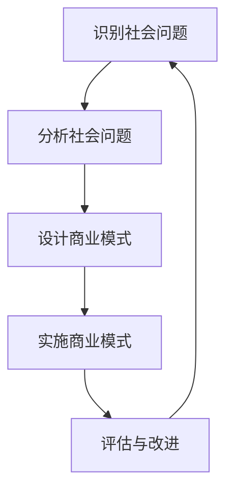

                 

### 社会企业家精神概述

#### 第1章：社会企业家精神概述

### 1.1 问题背景

在当今全球化和社会多元化的时代，社会问题的多样性和复杂性日益增加。环境问题、贫困问题、教育不平等、医疗资源分配不均等问题不仅对社会造成了深远的影响，也对企业提出了更高的社会责任要求。这些问题不仅需要政府和社会组织的参与，更需要企业以创新的商业模式和商业实践来共同解决。

#### 1.1.1 社会问题的多样性和复杂性

社会问题的多样性体现在不同领域的问题上。例如，环境问题涉及到空气污染、水资源短缺、生物多样性丧失等；贫困问题体现在贫困人口的生活质量、就业机会和教育资源等方面；教育不平等体现在城乡、地区和群体之间的教育资源分配差异；医疗资源分配不均则体现在不同地区和群体之间的医疗服务质量和可及性差异。

社会问题的复杂性则体现在问题的成因多样，解决途径多元，且存在一定的跨领域特征。例如，环境问题不仅涉及自然资源的开发和利用，还涉及到政策法规的制定、企业社会责任的履行等方面；教育不平等问题不仅需要教育资源的分配，还需要社会公平政策的支持；医疗资源分配不均问题不仅需要医疗基础设施的建设，还需要医疗保障体系的完善。

#### 1.1.2 社会企业家精神的定义和特点

社会企业家精神指的是一种创新意识和社会责任感，通过商业实践解决社会问题，实现商业价值与社会价值的双重回报。它具有以下特点：

1. **创新性**：社会企业家在商业模式、管理方法、技术创新等方面寻求突破，通过创新的解决方案来解决社会问题。

2. **社会责任**：社会企业家关注社会问题，将社会价值融入商业目标，不仅追求商业利润，更注重对社会问题的解决。

3. **长期导向**：社会企业家注重长期的社会影响，而不仅仅是短期利润。他们致力于通过可持续的商业实践，为社会带来长期的价值。

#### 1.1.3 社会企业家精神的重要性

**对社会贡献：**

- **促进社会问题的解决**：社会企业家通过创新的商业模式和商业实践，有效地解决社会问题，提高社会福祉。

- **推动社会创新**：社会企业家通过探索新的商业模式和社会创新，激发社会活力，推动社会进步。

**对企业的贡献：**

- **建立品牌声誉**：社会企业家通过解决社会问题，提升企业形象，建立品牌声誉。

- **开拓新市场**：社会企业家通过解决社会问题，开拓新的市场机会，实现可持续发展。

### 第1章小结

社会问题的多样性和复杂性要求我们以创新的思维和行动来解决这些问题。社会企业家精神作为一种将商业价值与社会价值相结合的创新实践，对于解决社会问题、推动社会进步具有重要意义。在接下来的章节中，我们将进一步探讨如何识别和分析社会问题，以及如何设计实施社会企业家精神的商业模式。

## 第2章：社会问题的识别与分析

### 2.1 社会问题的识别

#### 2.1.1 社会问题识别的重要性

社会问题的识别是解决社会问题的关键步骤。正确识别社会问题有助于明确解决方向，避免资源浪费，提高社会企业家精神的有效性。以下是社会问题识别的重要性：

1. **明确解决方向**：通过识别社会问题，可以明确问题的核心和重点，从而制定有针对性的解决方案。

2. **避免资源浪费**：识别社会问题有助于避免在无效的领域投入资源，确保有限的资源能够最大限度地发挥效用。

3. **提高社会企业家精神的有效性**：通过科学识别社会问题，社会企业家可以更有针对性地制定商业策略，实现商业价值与社会价值的双赢。

#### 2.1.2 社会问题的识别方法

社会问题的识别需要系统的方法和工具。以下是几种常见的社会问题识别方法：

1. **文献分析法**：通过查阅相关的学术文献、研究报告、政策文件等，了解社会问题的现状、趋势和发展动态。

2. **现场调研法**：通过实地考察、走访、问卷调查等形式，获取一手资料，深入了解社会问题的实际情况。

3. **访谈法**：与相关领域的专家、从业者进行深入交流，获取他们的见解和经验，有助于更全面地识别社会问题。

#### 2.1.3 社会问题的识别过程

社会问题的识别过程通常包括以下几个步骤：

1. **问题筛选**：从大量的社会现象中筛选出具有代表性的社会问题。

2. **问题界定**：明确社会问题的定义、范围和影响。

3. **问题分析**：分析社会问题的成因、影响和可能的解决途径。

4. **问题排序**：根据问题的严重程度、影响范围和解决难度，对问题进行优先级排序。

### 2.2 社会问题的分析

#### 2.2.1 社会问题的分析框架

社会问题的分析需要系统的框架和方法。以下是社会问题分析的一般框架：

1. **问题的原因分析**：分析社会问题的成因，包括经济、社会、政治、文化等多方面因素。

2. **问题的影响分析**：分析社会问题对个体、社区、社会和环境的负面影响。

3. **可能的解决方案分析**：探讨可能的解决方案，评估其可行性、成本和效果。

#### 2.2.2 社会问题的分析工具

在进行社会问题分析时，可以使用多种工具和方法，以下是一些常见的分析工具：

1. **SWOT分析法**：分析社会问题的优势、劣势、机会和威胁，帮助确定解决问题的方向和策略。

2. **PESTEL分析法**：分析社会问题的政治、经济、社会、技术、环境和法律等因素，评估其影响和挑战。

3. **利益相关者分析法**：识别社会问题的利益相关者，分析他们对问题的态度和影响力。

#### 2.2.3 社会问题的案例分析

通过具体的案例分析，可以更好地理解社会问题的识别和分析过程。以下是几个案例：

1. **环境污染问题**：
   - **原因分析**：工业污染、交通排放、农业活动等导致环境污染。
   - **影响分析**：空气污染导致健康问题，水资源污染影响生态系统和农业生产。
   - **解决方案分析**：通过清洁能源使用、交通管理、环保政策等手段减少污染。

2. **贫困问题**：
   - **原因分析**：失业、教育不足、医疗资源不足等导致贫困。
   - **影响分析**：贫困影响个人的生活质量、家庭稳定性和社会稳定性。
   - **解决方案分析**：通过就业培训、教育援助、医疗保障等手段减少贫困。

3. **教育不平等问题**：
   - **原因分析**：教育资源分配不均、家庭教育投入差异等导致教育不平等。
   - **影响分析**：教育不平等导致个人发展受限、社会机会不均等。
   - **解决方案分析**：通过教育资源均等化、教育质量提升等手段改善教育不平等。

### 第2章小结

社会问题的识别与分析是社会企业家精神的重要组成部分。通过科学的识别方法和分析工具，我们可以更准确地把握社会问题的本质，制定有效的解决方案。在接下来的章节中，我们将进一步探讨如何设计实施社会企业家精神的商业模式。

## 第3章：社会企业家精神的商业模式设计

### 3.1 商业模式设计的核心要素

商业模式设计是实施社会企业家精神的关键步骤，其核心要素包括客户价值、收入来源、成本结构和资源配置。以下是对这些核心要素的详细解析：

#### 3.1.1 客户价值

创造客户价值是商业模式设计的核心。社会企业家需要深入理解目标客户的需求，提供具有吸引力的产品或服务。以下是创造客户价值的关键步骤：

1. **需求分析**：通过市场调研和用户访谈，了解目标客户的需求和痛点。
2. **价值主张**：明确产品或服务的独特卖点和竞争优势。
3. **用户体验**：优化产品或服务的用户体验，提高客户满意度和忠诚度。

#### 3.1.2 收入来源

确定可持续的收入来源是商业模式设计的关键。社会企业家需要探索多元化的收入模式，以确保商业模式的可持续性。以下是几种常见的收入来源：

1. **产品销售**：直接销售产品或服务获得收入。
2. **订阅模式**：通过定期订阅服务获得持续收入。
3. **广告和赞助**：通过广告和赞助获得收入。
4. **平台收费**：作为平台运营商，从交易中收取佣金或服务费。

#### 3.1.3 成本结构

优化成本结构是提高盈利能力的重要手段。社会企业家需要分析各项成本，找出成本控制的策略。以下是成本结构优化的几个方面：

1. **固定成本**：减少固定成本，如租金、设备采购等。
2. **可变成本**：降低可变成本，如原材料、人力等。
3. **成本共享**：通过共享资源和外包等方式，降低成本。

#### 3.1.4 资源配置

有效配置资源是实现商业目标的关键。社会企业家需要合理分配资源，确保资源的高效利用。以下是资源配置的关键步骤：

1. **资源评估**：评估现有资源，确定资源的优先级。
2. **资源整合**：整合内外部资源，实现资源的最优配置。
3. **资源优化**：通过技术创新和流程优化，提高资源利用效率。

### 3.2 商业模式设计的方法

商业模式设计需要结合创新思维和方法，以下是一些常用的设计方法：

#### 3.2.1 创新思维方法

创新思维方法可以帮助社会企业家突破传统思维的局限，创造新的商业机会。以下是几种常见的创新思维方法：

1. **头脑风暴**：通过集体讨论，激发创意，产生创新点子。
2. **设计思维**：以用户为中心，通过迭代设计和测试，实现创新的解决方案。
3. **反转思维**：从相反的角度思考问题，寻找创新的解决方案。

#### 3.2.2 商业模式画布

商业模式画布是商业模式设计的工具，它帮助社会企业家梳理商业模式的各个要素。以下是商业模式画布的主要内容：

1. **价值主张**：明确产品或服务的核心卖点和用户价值。
2. **关键活动**：确定实现价值主张的关键活动。
3. **关键资源**：列出实现关键活动的必要资源。
4. **关键合作伙伴**：识别与业务相关的合作伙伴。
5. **成本结构**：分析业务运营的成本结构。
6. **收入来源**：确定收入的来源和模式。
7. **客户关系**：定义与客户建立关系的策略。

#### 3.2.3 商业模式创新策略

社会企业家需要不断探索新的商业模式创新策略，以应对市场变化和挑战。以下是几种常见的商业模式创新策略：

1. **共享经济**：通过共享资源，降低成本，提高资源利用效率。
2. **平台化**：构建平台，连接供需双方，实现资源的高效配置。
3. **生态系统**：构建企业生态系统，整合多方资源，实现共同发展。

### 3.3 社会企业家精神商业模式的案例研究

#### 3.3.1 案例一：非盈利组织的商业运作

非盈利组织通过商业运作实现社会价值，是社会企业家精神的典型代表。以下是一个案例：

- **项目背景**：一家非盈利组织专注于解决城市流浪动物问题。
- **商业模式**：通过领养服务、宠物用品销售和志愿者活动，实现收入来源多元化。同时，通过与政府和企业的合作，获得资金支持和资源。

#### 3.3.2 案例二：企业社会责任实践

企业通过社会责任实践将社会价值融入商业模式。以下是一个案例：

- **项目背景**：一家科技公司致力于推动可持续发展。
- **商业模式**：通过绿色科技产品研发、环保项目投资和员工志愿者活动，实现商业价值与社会价值的双赢。

#### 3.3.3 案例三：社会企业的发展路径

社会企业通过商业模式创新实现可持续发展。以下是一个案例：

- **项目背景**：一家社会企业专注于提供教育资源和创业支持。
- **商业模式**：通过教育服务收费、政府补贴和公益基金支持，实现收入的多元化和可持续性。

### 第3章小结

社会企业家精神的商业模式设计是实施社会价值的重要步骤。通过深入理解客户价值、收入来源、成本结构和资源配置，结合创新思维方法和实际案例，社会企业家可以设计出具有可持续性的商业模式，实现商业价值与社会价值的双赢。在接下来的章节中，我们将进一步探讨如何实施社会企业家精神。

## 第4章：社会企业家精神的实施策略

### 4.1 组织构建

组织构建是实施社会企业家精神的关键步骤，合理的组织结构和积极向上的组织文化是确保社会企业家精神有效实施的基础。以下是组织构建的几个关键要素：

#### 4.1.1 组织使命和愿景

组织使命和愿景是组织的方向和目标，它们指导组织的所有活动。一个清晰的组织使命和愿景有助于员工理解自己的工作对社会的影响，并激发他们的工作热情。以下是制定组织使命和愿景的步骤：

1. **明确组织的核心价值观**：确定组织所倡导的核心价值观，如创新、诚信、责任等。
2. **定义组织的使命**：明确组织存在的目的，如解决特定社会问题、提供公共服务等。
3. **制定组织的愿景**：描述组织未来的发展方向和目标，如成为行业领导者、实现社会价值最大化等。

#### 4.1.2 组织结构设计

组织结构设计是组织运行的基础。合理的组织结构能够提高组织的效率，确保资源的有效配置。以下是几种常见的组织结构设计：

1. **职能型结构**：根据不同的职能划分部门，如市场营销、研发、人力资源等。
2. **矩阵型结构**：在职能型结构的基础上，增加项目团队，实现跨职能合作。
3. **网络型结构**：通过外部合作伙伴和内部团队的网络，实现资源的高效共享。

#### 4.1.3 组织文化建设

组织文化是组织的灵魂，它影响着员工的态度和行为。积极向上的组织文化能够激发员工的创造力，提高组织的凝聚力。以下是培养积极向上组织文化的策略：

1. **树立榜样**：通过领导者的行为和价值观，树立榜样，引导员工行为。
2. **强化沟通**：建立开放的沟通机制，鼓励员工表达意见和建议。
3. **奖励创新**：设立创新奖励机制，鼓励员工提出新思路和新方案。
4. **培育团队精神**：通过团队活动和培训，增强团队凝聚力和协作能力。

### 4.2 创新能力培养

创新能力是社会企业家精神的核心特征，它决定着社会企业家的竞争力。以下是培养创新能力的几个策略：

#### 4.2.1 创新思维训练

创新思维训练是培养创新能力的基础。以下是一些创新思维训练的方法：

1. **头脑风暴**：通过集体讨论，激发创意，产生新的思路。
2. **设计思维**：以用户需求为中心，通过迭代设计和测试，实现创新的解决方案。
3. **思维导图**：通过绘制思维导图，梳理思路，发现新的创新点。

#### 4.2.2 创新机制建立

建立创新机制是确保创新能力持续提升的关键。以下是建立创新机制的几个方面：

1. **创新项目支持**：为创新项目提供资金、技术和资源支持。
2. **激励机制**：设立创新奖励机制，激励员工积极参与创新活动。
3. **知识共享**：建立知识共享平台，促进员工之间的知识交流和合作。
4. **风险管理**：建立风险管理体系，降低创新过程中的风险。

#### 4.2.3 创新资源投入

创新资源投入是培养创新能力的重要保障。以下是一些创新资源投入的策略：

1. **技术研发投入**：增加对技术研发的投入，提升产品的技术含量。
2. **人才引进**：吸引和培养创新型人才，为创新提供人力支持。
3. **外部合作**：与高校、研究机构和企业建立合作关系，共享创新资源和成果。

### 4.3 合作与伙伴关系建设

合作与伙伴关系建设是实施社会企业家精神的重要策略，通过合作伙伴的支持，可以整合资源，实现共同发展。以下是合作与伙伴关系建设的几个方面：

#### 4.3.1 合作伙伴选择

选择合适的合作伙伴是合作成功的关键。以下是一些合作伙伴选择的策略：

1. **互补优势**：选择与自身业务互补的合作伙伴，实现资源共享和优势互补。
2. **信誉良好**：选择信誉良好、实力强的合作伙伴，确保合作的稳定性和可靠性。
3. **目标一致**：选择与自身目标一致的合作伙伴，确保合作方向的一致性。

#### 4.3.2 合作模式设计

合作模式设计是确保合作顺利进行的重要步骤。以下是一些合作模式设计的策略：

1. **共同投资**：通过共同投资，实现资源的整合和风险共担。
2. **股权合作**：通过股权合作，实现利益共享和风险共担。
3. **战略合作**：通过战略合作，实现长期稳定的合作关系。

#### 4.3.3 合作关系管理

合作关系管理是确保合作顺利进行的重要保障。以下是一些合作关系管理的策略：

1. **沟通机制**：建立有效的沟通机制，确保信息的及时传递和交流。
2. **信任建设**：通过建立信任，增强合作的稳定性和信任度。
3. **冲突解决**：建立冲突解决机制，确保合作的顺利进行。
4. **持续改进**：通过持续改进，提升合作的效果和效率。

### 第4章小结

社会企业家精神的实施需要科学的组织构建、创新能力的培养和良好的合作与伙伴关系建设。通过合理的组织结构和积极向上的组织文化，社会企业家可以激发员工的创造力，提高组织的效率。通过创新思维训练、创新机制建立和创新资源投入，社会企业家可以不断提升创新能力，保持竞争力。通过合作与伙伴关系建设，社会企业家可以整合资源，实现共同发展。在接下来的章节中，我们将进一步探讨社会企业家精神的评估与改进。

## 第5章：社会企业家精神的评估与改进

### 5.1 社会企业家精神绩效评估

社会企业家精神的绩效评估是确保其有效实施和持续改进的重要手段。通过科学的绩效评估，社会企业家可以了解自身在实现社会价值方面的表现，找出存在的问题，并制定相应的改进措施。

#### 5.1.1 绩效指标设定

绩效指标的设定是绩效评估的关键。以下是一些常见的绩效指标：

1. **社会效益指标**：如解决社会问题的数量、社会影响力的评估、社会满意度等。
2. **经济效益指标**：如收入增长、利润率、成本控制等。
3. **创新能力指标**：如新产品或服务的推出数量、技术创新的频率等。
4. **员工满意度指标**：如员工满意度调查结果、员工流失率等。

#### 5.1.2 绩效评估方法

绩效评估的方法包括定量评估和定性评估。以下是一些常见的评估方法：

1. **定量评估**：通过数据分析和统计方法，对绩效指标进行量化评估。
2. **定性评估**：通过访谈、问卷调查和观察等方法，对绩效指标进行定性评估。
3. **平衡计分卡**：结合财务、客户、内部流程和学习与成长四个维度，进行全面评估。

#### 5.1.3 绩效反馈与改进

绩效评估的结果需要及时反馈，并制定改进措施。以下是绩效反馈与改进的步骤：

1. **反馈**：将绩效评估结果及时反馈给相关部门和员工，明确存在的问题。
2. **改进计划**：根据评估结果，制定具体的改进计划和措施。
3. **实施与监控**：实施改进计划，并持续监控改进效果。

### 5.2 社会企业家精神的改进策略

社会企业家精神的改进策略包括以下几个方面：

#### 5.2.1 管理体系优化

优化管理体系是提升社会企业家精神实施效果的重要措施。以下是一些管理体系优化的策略：

1. **流程优化**：通过流程再造，简化流程，提高效率。
2. **组织结构优化**：调整组织结构，确保资源的合理配置和高效运作。
3. **管理制度优化**：完善管理制度，确保制度的有效执行。

#### 5.2.2 创新能力提升

提升创新能力是保持社会企业家精神活力的关键。以下是一些创新能力提升的策略：

1. **创新文化**：建立创新文化，鼓励员工提出新思路和新方案。
2. **创新培训**：通过培训，提高员工的创新能力和技能。
3. **创新激励机制**：设立创新奖励机制，激励员工积极参与创新活动。

#### 5.2.3 合作与伙伴关系优化

合作与伙伴关系优化是提升社会企业家精神实施效果的重要手段。以下是一些合作与伙伴关系优化的策略：

1. **合作伙伴选择**：选择信誉良好、实力强的合作伙伴，确保合作的稳定性和可靠性。
2. **合作模式优化**：通过优化合作模式，实现资源的高效共享和风险共担。
3. **合作管理**：建立有效的合作管理机制，确保合作的顺利进行。

### 5.3 社会企业家精神的持续改进

社会企业家精神的持续改进是一个长期的过程，需要不断地评估和优化。以下是一些持续改进的策略：

#### 5.3.1 定期评估

定期评估社会企业家精神的实施效果，及时发现和解决问题。

#### 5.3.2 持续创新

持续创新是保持社会企业家精神活力的关键。通过不断探索新的商业模式和商业实践，实现社会价值与商业价值的双赢。

#### 5.3.3 持续学习

持续学习是提升个人和团队能力的重要手段。通过学习新的知识、技能和理念，不断提升自身素质。

### 第5章小结

社会企业家精神的评估与改进是确保其有效实施和持续发展的重要环节。通过科学的绩效评估和改进策略，社会企业家可以不断提升自身的实施效果，实现商业价值与社会价值的双赢。在接下来的章节中，我们将进一步探讨社会企业家精神的最佳实践和未来趋势。

## 社会企业家精神的最佳实践

### 第6章：最佳实践与成功案例

#### 6.1 社会企业家精神的成功实践

社会企业家精神的成功实践在全球范围内有许多值得借鉴的案例。以下是一些成功的实践和案例：

#### 6.1.1 非营利组织的商业运作

非营利组织通过商业运作实现社会价值，是一个典型的成功案例。如“无国界医生”（Doctors Without Borders）通过提供紧急医疗援助和长期医疗项目，不仅解决了社会问题，还实现了自我可持续发展。他们通过慈善捐款、医疗服务收费等多种收入来源，确保组织的持续运营。

**最佳实践提示**：非营利组织在商业运作中，要注重透明度和效率，确保资金的合理使用和项目的有效实施。

#### 6.1.2 企业社会责任（CSR）实践

许多企业在履行社会责任方面取得了显著成效。如“宜家”通过推广可持续家具产品和环保理念，不仅提高了品牌形象，还推动了社会环保意识的提升。他们通过环境友好型产品设计、供应链管理和社会责任项目，实现了商业价值与社会价值的双赢。

**最佳实践提示**：企业在实施社会责任时，要结合自身核心业务，制定具有实际意义和可操作性的社会责任计划。

#### 6.1.3 社会企业的创新模式

社会企业通过创新的商业模式，实现了社会价值与商业价值的有机结合。如“Ecopetrol”是一家社会企业，致力于解决废弃物处理问题。他们通过回收废弃物、生产有机肥料和可再生能源，不仅解决了环境问题，还创造了就业机会，实现了可持续发展。

**最佳实践提示**：社会企业在商业模式设计时，要注重创新性和可持续性，确保社会问题得到有效解决。

#### 6.1.4 政府与企业的合作

政府与企业的合作是社会企业家精神实施的重要途径。如“南非清洁能源项目”通过政府资助和企业投资，推动清洁能源的发展。政府提供政策支持和资金补贴，企业负责项目开发和运营，共同实现社会和环境效益。

**最佳实践提示**：政府与企业的合作要建立良好的沟通和协调机制，确保政策的有效实施和企业的积极参与。

### 第6章小结

社会企业家精神的最佳实践为解决社会问题提供了有力支持。通过借鉴成功案例和最佳实践，社会企业家可以更好地设计实施策略，实现商业价值与社会价值的双赢。在接下来的章节中，我们将进一步探讨社会企业家精神的小结、注意事项和未来趋势。

## 社会企业家精神的小结、注意事项和未来趋势

### 6.1 小结

社会企业家精神作为一种创新的商业实践，通过将商业价值与社会价值相结合，为解决社会问题提供了新的路径。通过本章的讨论，我们可以总结以下几点：

1. **社会问题的多样性和复杂性**：社会问题的多样性和复杂性要求社会企业家具备创新意识和责任感，通过商业实践来解决这些问题。

2. **社会企业家精神的定义和特点**：社会企业家精神包括创新性、社会责任和长期导向，这些特点使其在解决社会问题方面具有独特优势。

3. **商业模式设计的重要性**：通过科学的商业模式设计，社会企业家可以实现商业价值与社会价值的双赢。

4. **实施策略的关键性**：组织构建、创新能力培养和合作与伙伴关系建设是社会企业家精神有效实施的重要策略。

5. **评估与改进的必要性**：通过绩效评估和持续改进，社会企业家可以不断提升自身实施效果，实现社会价值的最大化。

### 6.2 注意事项

在实施社会企业家精神的过程中，需要注意以下几点：

1. **透明度和问责制**：社会企业家需要确保商业运作的透明度，建立有效的问责机制，以确保资源的合理使用和社会价值的实现。

2. **可持续性**：社会企业家应注重商业模式的可持续性，确保长期的社会影响力。

3. **风险意识**：社会企业家在实施过程中需要具备风险意识，提前识别和应对潜在风险。

4. **政策支持**：政策支持对于社会企业家精神的实施至关重要，社会企业家应积极争取政府和社会组织的支持。

### 6.3 未来趋势

社会企业家精神在未来具有广阔的发展前景，以下是一些潜在的趋势：

1. **技术创新**：随着科技的不断发展，社会企业家可以利用新技术解决更复杂的社会问题。

2. **跨界合作**：跨界合作将成为社会企业家精神的重要趋势，通过整合不同领域的资源和优势，实现更大的社会影响。

3. **可持续发展**：可持续发展将成为社会企业家精神的核心目标，社会企业家将更加关注环境、社会和经济的平衡发展。

4. **全球化**：全球化的加速将促使社会企业家在更广泛的范围内解决社会问题，实现全球影响力的提升。

### 第6章小结

社会企业家精神作为一种创新的商业实践，在解决社会问题方面具有巨大潜力。通过科学的商业模式设计、有效的实施策略和持续改进，社会企业家可以实现商业价值与社会价值的双赢。未来，随着技术创新和全球化的发展，社会企业家精神将迎来更加广阔的发展空间。

## 附录

### 附录A：核心概念术语说明

- **社会企业家精神**：指通过商业实践解决社会问题，实现商业价值与社会价值的双重回报的创新精神。
- **商业模式**：指企业通过创造、传递和捕获价值的方式，实现可持续盈利和社会贡献的体系。
- **社会问题**：指影响社会福祉、环境可持续性和经济稳定性的问题。
- **绩效评估**：指对组织或个人在实现预定目标过程中的表现进行系统评价的过程。

### 附录B：核心概念属性特征对比表格

| 核心概念 | 定义 | 属性特征 | 对比结果 |
|----------|------|----------|----------|
| 社会企业家精神 | 创新意识和社会责任感，通过商业实践解决社会问题 | 创新性、社会责任、长期导向 | 与传统企业家精神相比，更注重社会价值 |
| 商业模式 | 创造、传递和捕获价值的方式 | 客户价值、收入来源、成本结构、资源配置 | 与传统商业模式相比，更强调可持续性和社会影响 |
| 社会问题 | 影响社会福祉、环境可持续性和经济稳定性的问题 | 多样性、复杂性、跨领域特征 | 与一般问题相比，更具有深远的社会影响 |

### 附录C：社会企业家精神核心概念ER实体关系图架构

```mermaid
erDiagram
  Customer ||--|{ Organization }|-- SocialProblem
  Organization ||--|{ SocialEntrepreneur }|-->
  SocialEntrepreneur ||--|{ BusinessModel }|>--
  BusinessModel ||--|{ RevenueSource }|>--
  BusinessModel ||--|{ CostStructure }|>--
  BusinessModel ||--|{ ResourceAllocation }|>--
  SocialProblem ||--|{ Solution }|>--
```

### 附录D：社会企业家精神实施步骤流程图



### 附录E：社会企业家精神相关术语解释

- **社会价值**：指通过解决社会问题、改善社会状况所带来的积极影响。
- **可持续发展**：指在满足当前需求的同时，不损害后代满足其需求的能力。
- **共享经济**：指通过共享资源和平台，实现资源的高效利用和价值的最大化。
- **平台化**：指通过构建平台，连接供需双方，实现资源的高效配置和协同发展。

### 附录F：参考文献

1. Brown, T. (2014). *The Power of Pull: How Small Moves, Smartly Made, Set Big Things in Motion*. Penguin.
2. Christensen, C. M., Raynor, M. E., & McDonald, R. (2015). *Disrupting Class: How Disruptive Innovation Will Change the Way the World Learns*. McGraw Hill.
3. Kapstein, E. (2006). *The New Entrepreneurs: Building a Socially Responsible Business*. Harvard Business Review, 84(12), 44-53.
4. Porter, M. E., & Kramer, M. R. (2006). *Strategy and Society: The Linkage Between Competitive Advantage and Corporate Social Responsibility*. Harvard Business Review, 84(12), 78-92.
5. World Economic Forum. (2020). *The Global Competitiveness Report 2020*. World Economic Forum.

### 作者信息

- 作者：AI天才研究院/AI Genius Institute & 禅与计算机程序设计艺术 /Zen And The Art of Computer Programming

本篇文章通过深入探讨社会企业家精神的概念、商业模式设计、实施策略、评估与改进以及最佳实践，系统地阐述了社会企业家精神在解决社会问题、实现商业价值与社会价值的双赢方面的作用。希望本文能为广大读者提供有益的启示和指导，共同推动社会进步和可持续发展。

