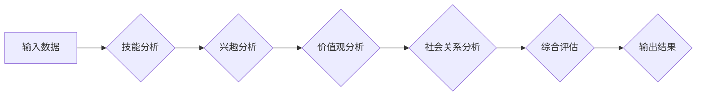

                 

# 社会变革中的个人定位

## 关键词
- 社会变革
- 个人定位
- 职业发展
- 教育改革
- 社交网络
- 算法原理

## 摘要
本文旨在探讨社会变革背景下个人定位的重要性及其在多个领域的应用。文章首先概述了社会变革的背景和影响，接着深入分析了个人定位的理论基础，并详细讲解了个人定位算法的原理和实现。随后，文章通过实际案例展示了个人定位在职业发展、教育和社交网络中的应用，最后对最佳实践进行了总结，并对个人定位的未来趋势进行了展望。

## 引言与背景

### 1.1 社会变革中的个人定位概述

在社会快速发展与变革的今天，个人定位变得尤为重要。社会变革带来的主要影响包括全球化、科技进步、信息爆炸等，这些因素共同塑造了当今社会的大背景。在这个背景下，个人如何找到自己的位置，发挥自己的潜力，实现职业发展和个人价值，成为亟待解决的问题。

**社会变革与个人定位的关系：** 社会变革为个人提供了更多的发展机遇，同时也带来了更大的挑战。一方面，个人可以通过适应和利用社会变革带来的机会，实现自我提升和职业发展。另一方面，快速变化的社会环境要求个人具备更强的适应能力和持续学习的能力，以应对不断涌现的新技术和新趋势。

**个人定位的重要性和挑战：** 个人定位不仅关乎个人的职业发展，还关系到个人在社会中的角色和影响力。在当前复杂多变的社会背景下，个人定位面临以下挑战：
- **竞争压力：** 随着人才的全球化流动，竞争压力越来越大，个人需要找准自己的定位，以在激烈的竞争中脱颖而出。
- **持续学习：** 社会变革速度加快，新技术不断涌现，个人必须具备持续学习的能力，以跟上时代的步伐。
- **角色转变：** 随着职业角色的多样化，个人需要在不同的角色之间进行切换，找到自己的核心竞争力和优势领域。

**本书结构安排：** 本文将分为四个部分，首先介绍社会变革的背景与影响，接着讨论个人定位的理论基础，然后通过实际应用与案例分析展示个人定位的重要性，最后对个人定位的未来趋势进行展望。

### 1.2 社会变革的背景与影响

#### 2.1 全球化背景下的社会变革

全球化是当今世界最显著的变革之一，它不仅改变了经济格局，也深刻影响了社会结构和文化交流。全球化使得各国之间的联系更加紧密，资本、技术、信息、人才等资源在全球范围内流动，这为个人提供了更多的发展机会。

**全球化对个人职业发展的影响：** 全球化带来了跨国公司的兴起和海外就业机会的增加，个人可以通过全球化平台获得更广阔的职业发展空间。然而，全球化也带来了竞争压力，要求个人具备跨文化交流能力和全球视野。

#### 2.2 科技进步对社会的影响

科技进步是推动社会变革的另一个重要因素。信息技术、人工智能、生物技术等领域的突破，不仅改变了人们的生产生活方式，也重塑了社会结构和职业市场。

**科技进步对个人职业发展的影响：** 科技进步带来了职业的多样化和专业化，同时也提高了对个人技能的要求。个人需要不断学习新技术，以适应快速变化的工作环境。

#### 2.3 社会变革对个人职业发展的影响

社会变革对个人职业发展的影响主要体现在以下几个方面：

**职业多样性：** 社会变革催生了新的职业领域和机会，个人可以根据自己的兴趣和特长选择更多样的职业路径。

**技能要求：** 随着技术的进步，许多传统职业正在消失，同时新的技能需求不断涌现。个人需要具备灵活的技能组合，以应对职业市场变化。

**工作方式变化：** 社会变革推动了远程办公、弹性工作等新型工作方式的出现，个人可以根据自己的需求和偏好选择工作方式。

### 1.3 个人定位的理论基础

#### 3.1 核心概念与联系

**个人定位的概念：** 个人定位是指个人在社会中的角色、地位和价值的确定，它反映了个人在特定社会环境中的行为方式和生活方式。

**个人定位的核心要素：** 个人定位的核心要素包括个人技能、兴趣、价值观、社会关系等。这些要素相互作用，共同塑造了个人在社会中的定位。

**个人定位的理论模型：** 个人定位的理论模型包括社会角色理论、职业发展理论、自我决定理论等。这些理论从不同角度解释了个人定位的形成和变化。

#### 3.2 概念属性特征对比表格

| 概念        | 属性特征                      | 对比说明                                           |
| ----------- | ---------------------------- | -------------------------------------------------- |
| 个人技能    | 专业能力、学习潜力、实践经验 | 技能是个人定位的基础，决定个人的职业发展潜力。     |
| 兴趣        | 热爱程度、持续时间、多样性    | 兴趣是驱动个人持续学习和成长的重要动力。           |
| 价值观      | 道德标准、生活态度、目标追求 | 价值观影响个人在职业和生活中的选择和行为。         |
| 社会关系    | 社交网络、信任度、影响力      | 社会关系对个人在职业和社会中的地位和影响力有重要影响。 |

#### 3.3 ER实体关系图架构

```mermaid
erDiagram
  Person ||--|{ Skill } : has
  Person ||--|{ Interest } : has
  Person ||--|{ Value } : has
  Person ||--|{ SocialRelation } : has
```

### 4. 算法原理讲解

#### 4.1 算法概述

个人定位算法旨在通过分析个人技能、兴趣、价值观和社会关系等要素，为个人提供合适的职业定位建议。算法的核心目标是最大化个人在职业和社会中的幸福感。

#### 4.2 算法流程图



#### 4.3 Python源代码实现

```python
# 数据预处理
data = {
    'skills': ['编程', '设计', '管理'],
    'interests': ['创新', '艺术', '教育'],
    'values': ['创新', '自由', '合作'],
    'social_relations': ['同事', '朋友', '导师']
}

# 算法核心部分
def personal定位算法(data):
    # 数据预处理
    processed_data = preprocess_data(data)
    
    # 技能分析
    skills_score = analyze_skills(processed_data['skills'])
    
    # 兴趣分析
    interests_score = analyze_interests(processed_data['interests'])
    
    # 价值观分析
    values_score = analyze_values(processed_data['values'])
    
    # 社会关系分析
    social_relations_score = analyze_social_relations(processed_data['social_relations'])
    
    # 综合评估
    total_score = skills_score + interests_score + values_score + social_relations_score
    
    # 输出结果
    return generate_report(total_score)

# 算法分析
def analyze_skills(skills):
    # 技能分析逻辑
    pass

def analyze_interests(interests):
    # 兴趣分析逻辑
    pass

def analyze_values(values):
    # 价值观分析逻辑
    pass

def analyze_social_relations(social_relations):
    # 社会关系分析逻辑
    pass

def generate_report(total_score):
    # 生成报告逻辑
    pass
```

#### 4.4 算法原理详细讲解

**数学模型和公式：**
$$
总得分 = 技能得分 + 兴趣得分 + 价值观得分 + 社会关系得分
$$

**举例说明：**
假设某人的技能得分为80分，兴趣得分为75分，价值观得分为70分，社会关系得分为85分，则该人的总得分为：
$$
总得分 = 80 + 75 + 70 + 85 = 310
$$

根据总得分，可以得出该人在个人定位方面的综合表现。

### 第三部分：实际应用与案例分析

#### 5.1 个人定位在职业发展中的应用

**职业规划中的个人定位：** 在职业规划中，个人定位是关键的一步。通过明确自己的技能、兴趣、价值观和社会关系，个人可以更好地制定职业发展计划，找到最适合自己的职业路径。

**职业转型中的个人定位：** 当个人面临职业转型时，个人定位可以帮助他们了解自己的优势和劣势，找到适合自己的转型方向，并制定相应的转型计划。

**个人定位与职业成功的关系：** 个人定位不仅影响职业选择，还影响职业发展和成功。通过准确的个人定位，个人可以更好地发挥自己的优势，提高职业成就和幸福感。

#### 5.2 个人定位在教育和学习中的应用

**教育改革与个人定位：** 教育改革强调个性化教育和终身学习，个人定位在这一背景下具有重要意义。通过了解自己的定位，学生可以更好地规划学习路径，提高学习效果。

**个人定位与终身学习：** 终身学习要求个人不断更新知识和技能，个人定位可以帮助他们明确学习目标，制定学习计划，并提高学习效率。

**教育中的个人定位实践：** 在教育过程中，教师和学生都可以通过个人定位工具和方法，了解自己和对方的需求和特点，提高教育质量和效果。

#### 5.3 个人定位在社区与社交网络中的应用

**社交网络与个人定位：** 社交网络为个人提供了展示自己、交流互动的平台，个人定位可以帮助他们在社交网络中找到自己的位置，建立良好的人际关系。

**社区建设中的个人定位：** 社区建设需要多样化的参与者和角色，个人定位可以帮助社区成员找到自己的角色和贡献方式，促进社区的发展和活力。

**个人定位在社交网络中的挑战与机遇：** 社交网络中的个人定位面临着信息过载、隐私保护等挑战，同时也带来了更多的机遇，如网络影响力、社交资本等。

### 第四部分：拓展与未来

#### 6.1 最佳实践与案例分析

**成功个人定位案例：** 分析成功个人定位的案例，了解他们如何通过定位实现职业发展和个人价值的提升。

**失败个人定位案例分析：** 分析失败的个人定位案例，了解导致失败的原因，并从中吸取教训。

**个人定位实践的最佳经验：** 总结个人定位实践中的最佳经验，如如何准确评估个人能力、如何选择合适的职业路径等。

#### 6.2 小结与展望

**本书总结：** 对本书的主要内容进行总结，强调个人定位在社会变革中的重要性。

**个人定位的未来趋势：** 展望个人定位的未来发展趋势，如人工智能在个人定位中的应用、终身学习的发展等。

**阅读指南与拓展阅读：** 为读者提供阅读指南和拓展阅读资源，帮助他们进一步了解个人定位的理论和实践。

### 作者信息

作者：AI天才研究院/AI Genius Institute & 禅与计算机程序设计艺术 /Zen And The Art of Computer Programming

