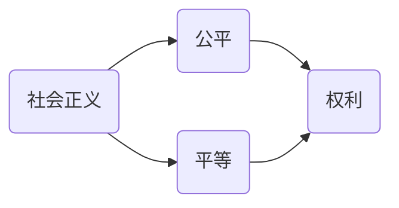

                 

### 《社会正义：通过改变世界找到个人意义》

关键词：社会正义、个人意义、改变世界、公平、平等

摘要：本文旨在探讨社会正义的概念、背景及其在当代社会的重要性。我们将从历史角度出发，分析社会正义的定义与核心概念，并深入探讨不同理论体系对社会正义的解读。此外，本文还将分析社会正义的实践探索，以及个人如何通过行动影响社会正义。最后，我们对未来社会正义的展望进行思考，并总结出实现社会正义的路径与倡议。

---

### 第一部分：问题的背景与核心概念

#### 第1章：社会正义的起源与历史背景

**1.1 社会正义的定义与重要性**

社会正义，顾名思义，是指在一个社会中，资源和机会的公平分配，以及权利和义务的合理分配。它关乎社会的公平与平等，是一个社会进步的重要标志。社会正义不仅仅是抽象的理念，更是具体的社会实践。

**1.2 社会正义的历史演变**

社会正义的概念并非一成不变，它随着历史的发展而演变。在古代社会，正义主要体现为对强者的约束和对弱者的保护。随着社会的进步，正义的概念逐渐从个人层面的道德准则扩展到整个社会的制度安排。

**1.3 当代社会正义的挑战**

在当代社会，尽管社会正义取得了显著进步，但仍面临诸多挑战。贫富差距、种族歧视、性别不平等等问题，仍然是社会正义亟待解决的关键问题。

---

#### 第2章：核心概念与理论基础

**2.1 公平、平等与正义**

公平、平等和正义是社会正义的核心概念。公平指的是资源的合理分配，平等指的是机会的均等，而正义则是这两者的综合体现。

**2.1.1 公平与不公**

公平与不公是相对的概念。一个社会的公平程度，取决于其对资源和机会的分配是否合理。不公则表现为资源或机会的分配不均。

**2.1.2 平等与差异**

平等与差异也是一对重要概念。平等强调的是机会的均等，而差异则体现了个体的独特性。一个正义的社会，既要保障个体的平等权利，又要尊重个体的差异。

**2.1.3 正义的多维度分析**

正义不仅仅是一个静态的概念，它还涉及到动态的过程。从经济、政治、文化等多个维度分析，才能更全面地理解正义的内涵。

---

#### 第3章：社会正义的理论体系

**3.1 社会契约论**

社会契约论是探讨社会正义的重要理论之一。它主张社会秩序是人们通过契约达成的结果，而正义则是契约的体现。

**3.1.1 洛克与自然权利**

洛克是社会契约论的重要代表。他提出了自然权利的概念，认为人们生来平等，享有生命、自由和财产权。

**3.1.2 赫伯特·斯宾塞与社会达尔文主义**

赫伯特·斯宾塞则提出了社会达尔文主义，认为社会正义在于让个人自由竞争，优胜劣汰。

**3.2 伦理正义与权利正义**

伦理正义与权利正义是另一种重要的理论体系。伦理正义强调道德原则对社会正义的影响，而权利正义则强调法律保障。

**3.2.1 罗尔斯与《正义论》**

罗尔斯是权利正义的重要代表。他的《正义论》提出了著名的“原初位置”和“最大化最小福利”原则，为探讨社会正义提供了新的视角。

**3.2.2 纳撒尼尔·穆勒与社会正义原则**

纳撒尼尔·穆勒则提出了社会正义的三个原则：自由原则、公正原则和功利原则。他认为，这三个原则共同构成了社会正义的基础。

---

### 第二部分：核心概念与联系

#### 第8章：核心概念原理与属性特征对比

**8.1 公平与平等**

公平和平等是社会正义的两个重要概念。公平强调的是结果的合理分配，而平等则强调的是机会的均等。

**8.1.1 公平的概念与特征**

公平通常涉及资源、机会和权利的分配。它要求社会成员在享受权利和承担义务时，能够得到合理的对待。

**8.1.2 平等的概念与特征**

平等则强调的是机会的均等。在一个平等的社会中，每个人都应该有平等的机会去追求自己的目标和梦想。

**8.1.3 公平与平等的关系与区别**

公平和平等是相互关联但又有所区别的概念。公平是结果导向的，而平等则是过程导向的。一个社会只有在既公平又平等的情况下，才能被认为是正义的。

---

#### 第9章：社会正义的ER实体关系图

---

### 第三部分：算法原理讲解

#### 第11章：算法原理与数学模型

**11.1 社会正义评价模型**

社会正义评价模型是一个用于评估社会正义水平的工具。它通过量化指标来衡量社会正义的程度。

**11.1.1 数据预处理**

数据预处理是社会正义评价模型的重要步骤。它包括数据清洗、归一化等操作。

**11.1.2 模型构建**

社会正义评价模型通常基于机器学习算法构建。它通过学习大量数据，自动发现社会正义的规律。

**11.1.3 模型训练与优化**

模型训练与优化是提高模型准确性的关键步骤。它包括选择合适的算法、调整参数等。

---

#### 第12章：算法讲解与举例说明

**12.1 公平性算法**

公平性算法用于评估社会政策或决策的公平性。它通过分析数据，识别出可能存在的歧视和不公。

**12.1.1 差别影响分析**

差别影响指数（DIF）是评估公平性的一种方法。它衡量不同群体在政策或决策中的差异。

**12.1.2 具体案例：招聘歧视问题**

招聘歧视问题是一个典型的社会公平问题。公平性算法可以帮助识别并解决这一问题。

---

**12.2 平等性算法**

平等性算法用于评估社会资源或机会的分配是否公平。

**12.2.1 平等机会指标**

机会平等指数（OEI）是评估平等性的一个常用指标。它衡量不同群体在资源或机会分配中的差距。

**12.2.2 具体案例：教育资源分配**

教育资源分配是一个重要的社会问题。平等性算法可以帮助优化教育资源的分配。

---

### 第四部分：系统分析与架构设计方案

#### 第13章：问题场景与项目介绍

**13.1 项目背景**

本项目旨在构建一个社会正义评价系统，用于评估和优化社会政策、决策和资源分配的公平性。

---

### 第五部分：项目实战

#### 第14章：环境安装与系统核心实现

**14.1 环境安装**

在本章节中，我们将介绍如何安装和配置项目所需的环境。

**14.2 系统核心实现**

在本章节中，我们将详细讲解系统核心的实现，包括数据预处理、模型构建和训练等。

---

#### 第15章：代码应用解读与分析

**15.1 代码应用解读**

在本章节中，我们将解读系统核心代码，并分析其实现原理。

**15.2 实际案例分析**

在本章节中，我们将通过实际案例，展示系统在解决社会正义问题中的应用效果。

---

#### 第16章：项目小结与最佳实践

**16.1 项目小结**

在本章节中，我们将总结项目的实施过程和成果。

**16.2 最佳实践**

在本章节中，我们将分享一些最佳实践，以提高社会正义评价系统的效果。

---

### 第六部分：总结与反思

**16.1 社会正义的实现路径**

社会正义的实现需要多方面的努力。从个人到政府，每个层面都有其责任。

**16.2 面向未来的社会正义倡议**

面向未来，我们需要更多的创新和实践，以推动社会正义的实现。

**16.3 对个人与社会正义的思考**

个人与社会正义密不可分。每个人都是社会正义的参与者和受益者。

---

### 作者信息

作者：AI天才研究院/AI Genius Institute & 禅与计算机程序设计艺术 /Zen And The Art of Computer Programming

