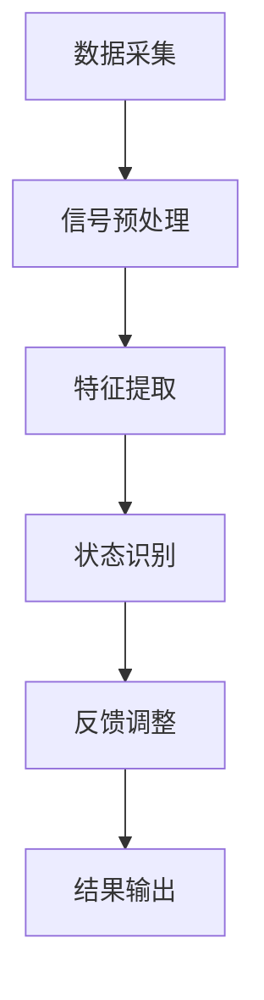
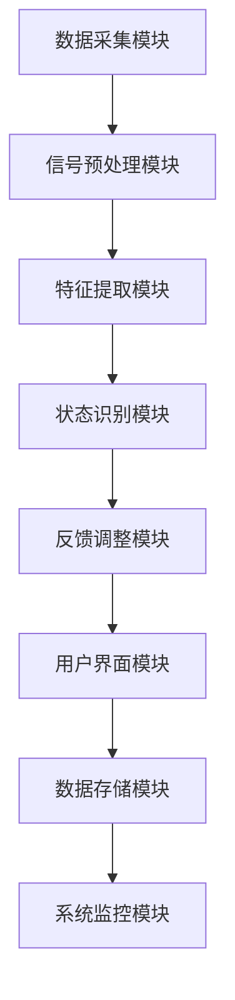

                 


## 神经反馈游戏治疗师认证：心理健康干预的新职业

### 关键词：神经反馈、心理健康干预、游戏治疗师认证、算法原理、系统架构、项目实战

#### 摘要：
本文将探讨神经反馈游戏治疗师认证这一新兴职业，以及其在心理健康干预中的重要作用。我们将一步步分析神经反馈的基本原理、游戏治疗师的认证流程、系统的设计与实现，并最终通过实际案例展示这一职业的实战应用。

### 目录

1. **神经反馈与心理健康干预概述**
2. **核心概念与联系解析**
3. **神经反馈算法原理解析**
4. **神经反馈游戏治疗系统架构设计**
5. **实战项目与案例剖析**
6. **最佳实践与职业发展**
7. **总结与拓展阅读**

---

### 1. 神经反馈与心理健康干预概述

神经反馈是一种通过实时监测和反馈生理或心理活动的技术，以帮助个体学会自我调节和改善健康状态的方法。随着技术的进步，神经反馈在心理健康干预中的应用日益广泛，尤其是一种名为“神经反馈游戏治疗”的新兴模式，它通过游戏化的方式提高治疗的趣味性和效果。

当前，全球范围内心理健康问题的发生率持续上升，抑郁症、焦虑症等心理障碍对个人和社会的影响日益显著。传统的心理治疗方式如心理咨询、药物治疗等存在一定的局限性，而神经反馈游戏治疗以其独特的优势和潜力，成为心理健康干预领域的一个重要补充。

#### 1.1 神经反馈技术概述

神经反馈技术的基本原理是通过采集个体的大脑电信号（如脑电波），将其转换为可以量化的数据，并通过反馈系统将数据以视觉、听觉或其他形式呈现给个体，帮助个体了解自身的生理或心理状态，从而进行自我调节。

#### 1.2 心理健康问题的现状

全球范围内，心理健康问题的发生率呈上升趋势。根据世界卫生组织（WHO）的数据，每四人中就有一人可能在其一生中经历某种形式的心理健康问题。这些问题的严重性不仅影响到个人的生活质量，也给社会带来了沉重的负担。

#### 1.3 神经反馈游戏治疗的基本原理与优势

神经反馈游戏治疗结合了神经反馈和游戏设计的优势，通过互动性和趣味性增强治疗的效果。它不仅有助于个体更好地理解和调节自身的心理状态，还能够提高治疗过程中的参与度和积极性。

### 2. 核心概念与联系解析

在这一章节，我们将深入探讨神经反馈游戏治疗师的核心概念，包括其角色、职责、认证标准以及相关的理论和实践联系。

#### 2.1 神经反馈游戏治疗师的角色与职责

神经反馈游戏治疗师是新兴职业的代表，其核心职责是通过神经反馈游戏帮助个体改善心理健康状态。他们需要具备医学、心理学和游戏设计等多方面的知识，能够设计、实施和评估神经反馈游戏治疗的过程。

#### 2.2 认证标准与流程

神经反馈游戏治疗师的认证标准通常包括教育背景、临床实践经验、专业知识考试和实操能力评估等多个方面。认证流程严格，确保治疗师具备专业素质和临床能力。

#### 2.3 相关理论与实践联系

神经反馈游戏治疗师需要掌握相关的理论知识和实践技能，包括神经科学、心理学、游戏设计等。他们还需要了解不同类型神经反馈游戏的应用场景和效果，以便为客户提供最合适的服务。

---

在接下来的章节中，我们将逐步深入探讨神经反馈算法原理、系统架构设计、项目实战以及最佳实践与职业发展等内容。让我们一步步前行，探索神经反馈游戏治疗师的奥秘。

---

### 3. 神经反馈算法原理解析

在这一章节中，我们将详细解析神经反馈算法的基本原理，并通过mermaid流程图和Python源代码展示其实现过程。

#### 3.1 神经反馈算法概述

神经反馈算法的核心在于实时监测和反馈大脑电信号。通过分析这些信号，算法可以识别个体的心理状态，并调整反馈信号，帮助个体实现自我调节。

#### 3.2 算法mermaid流程图展示



#### 3.3 Python源代码与算法解释

```python
import numpy as np

def data采集(signal):
    # 采集大脑电信号
    return signal

def 信号预处理(signal):
    # 预处理信号
    return np.mean(signal)

def 特征提取(processed_signal):
    # 提取信号特征
    return processed_signal

def 状态识别(feature):
    # 识别状态
    if feature > threshold:
        return '焦虑'
    else:
        return '放松'

def 反馈调整(state):
    # 调整反馈信号
    if state == '焦虑':
        return '加大刺激'
    else:
        return '减少刺激'

def 结果输出(feedback):
    # 输出结果
    print(feedback)
```

#### 3.4 数学模型与公式解析

神经反馈算法中的关键数学模型包括信号预处理和特征提取。以下是相关的数学公式：

$$
\text{预处理信号} = \frac{1}{N} \sum_{i=1}^{N} s_i
$$

$$
\text{特征提取} = f(\text{预处理信号})
$$

其中，$s_i$代表第$i$个信号样本，$N$是样本数量，$f$是特征提取函数，通常是一个非线性变换。

#### 3.5 举例说明

假设我们采集到一组大脑电信号，通过上述算法处理后，我们得到了一个特征值。根据这个特征值，算法判断个体处于“放松”状态，并调整反馈信号为“减少刺激”。这种反馈机制可以帮助个体更好地调节情绪，实现心理健康状态的改善。

---

通过上述内容，我们初步了解了神经反馈算法的基本原理和实现过程。在接下来的章节中，我们将继续探讨神经反馈游戏治疗系统的架构设计，以及如何通过实际项目来应用这些算法。

---

### 4. 神经反馈游戏治疗系统架构设计

在这一章节中，我们将详细解析神经反馈游戏治疗系统的整体架构，包括功能模块、系统接口和交互设计。

#### 4.1 系统功能模块介绍

神经反馈游戏治疗系统通常包括以下几个主要功能模块：

1. **数据采集模块**：负责实时采集个体的大脑电信号。
2. **信号预处理模块**：对采集到的信号进行预处理，以提高数据的准确性和稳定性。
3. **特征提取模块**：从预处理后的信号中提取关键特征，用于后续的状态识别。
4. **状态识别模块**：根据提取的特征值，判断个体的心理状态。
5. **反馈调整模块**：根据识别结果，调整游戏中的刺激强度，以帮助个体实现自我调节。
6. **用户界面模块**：提供直观的用户交互界面，使个体能够方便地参与游戏治疗过程。

#### 4.2 系统架构设计mermaid架构图



#### 4.3 系统接口与交互设计

系统接口设计是确保各功能模块之间高效协作的关键。以下是系统的主要接口：

1. **数据采集接口**：用于接收外部设备（如脑电帽）发送的原始信号。
2. **预处理与特征提取接口**：将原始信号传递给预处理和特征提取模块。
3. **状态识别与反馈调整接口**：将特征值传递给状态识别模块，并根据识别结果调整反馈信号。
4. **用户界面接口**：提供用户交互功能，包括游戏界面、数据展示和反馈提示。

#### 4.4 系统交互设计mermaid序列图

```mermaid
sequenceDiagram
 participant 用户 as 用户
 participant 系统接口 as 系统
 participant 数据采集模块 as 数据采集
 participant 信号预处理模块 as 预处理
 participant 特征提取模块 as 特征提取
 participant 状态识别模块 as 识别
 participant 反馈调整模块 as 反馈
 participant 用户界面模块 as 界面

 用户->>系统接口：开始游戏
 系统->>数据采集：采集信号
 数据采集->>预处理：预处理信号
 预处理->>特征提取：提取特征
 特征提取->>识别：判断状态
 识别->>反馈：调整反馈
 反馈->>用户界面：显示反馈
 用户界面->>用户：交互操作
```

#### 4.5 系统架构与设计方案的优势

该系统架构设计的优势在于模块化、灵活性和高效性。模块化设计使得各功能模块可以独立开发和测试，提高了系统的可维护性和可扩展性。灵活的接口设计确保了模块之间的无缝协作，而高效的处理流程则保证了实时性和准确性。

---

通过上述内容，我们详细探讨了神经反馈游戏治疗系统的架构设计。在接下来的章节中，我们将通过实际项目展示如何将这一架构应用到实践中，并分析项目中的关键实现细节。

---

### 5. 实战项目与案例剖析

在这一章节中，我们将通过一个实际项目展示如何应用神经反馈游戏治疗系统，并详细剖析项目中的关键实现细节。

#### 5.1 项目背景介绍

本项目旨在开发一款针对焦虑症患者的神经反馈游戏治疗应用。项目目标是通过神经反馈游戏帮助患者实现自我调节，降低焦虑水平，提高生活质量。

#### 5.2 神经反馈游戏治疗师工作流程

神经反馈游戏治疗师在项目中的工作流程包括以下几个步骤：

1. **评估与诊断**：对患者进行初步评估，确定其焦虑程度和适合的治疗方案。
2. **游戏设计**：根据评估结果，设计适合患者的神经反馈游戏，确保游戏具备适当的挑战性和趣味性。
3. **治疗实施**：指导患者使用神经反馈游戏进行治疗，实时监测其心理状态，并根据反馈进行调整。
4. **效果评估**：在治疗结束后，对患者的治疗效果进行评估，并记录相关数据。
5. **后续跟进**：根据治疗效果，制定后续治疗计划，并持续跟踪患者的情况。

#### 5.3 关键实现细节分析

以下是项目中的关键实现细节：

1. **数据采集**：采用脑电帽采集患者的脑电信号，确保信号的准确性和稳定性。
2. **信号预处理**：通过滤波和去噪技术，对原始信号进行预处理，以提高信号的清晰度。
3. **特征提取**：使用时域和频域分析方法，提取脑电信号的特定特征，如alpha波和beta波。
4. **状态识别**：利用机器学习算法，如支持向量机（SVM）和深度学习模型，对提取的特征进行分类，判断患者的心理状态。
5. **反馈调整**：根据识别结果，调整游戏的刺激强度，如音量、颜色变化等，帮助患者实现自我调节。
6. **用户界面**：设计直观、友好的用户界面，使患者能够方便地参与游戏，并实时查看自己的心理状态数据。

#### 5.4 实际案例分析与详细讲解

以下是一个实际案例的分析：

**案例背景**：患者小李，男，28岁，因工作压力导致长期焦虑。他参加了为期四周的神经反馈游戏治疗。

**治疗过程**：
- **第一周**：患者进行初步评估，确认其焦虑程度较高。治疗师根据评估结果，为其设计了一款简单易上手的神经反馈游戏。
- **第二周**：患者在治疗师的指导下，逐步适应游戏。通过实时监测，治疗师发现患者的焦虑程度有所下降。
- **第三周**：治疗师调整游戏难度，增加刺激强度，以进一步挑战患者。同时，通过反馈调整，帮助患者更好地调节情绪。
- **第四周**：治疗结束后，患者进行效果评估。结果显示，患者的焦虑水平显著降低，生活质量得到明显改善。

**详细讲解**：
- **数据采集**：在治疗过程中，脑电帽实时采集了患者的脑电信号，确保数据的连续性和准确性。
- **信号预处理**：通过滤波和去噪技术，治疗师获取了清晰、稳定的脑电信号。
- **特征提取**：利用时域和频域分析方法，提取了脑电信号的特定特征，如alpha波和beta波。
- **状态识别**：通过支持向量机（SVM）模型，对提取的特征进行分类，判断患者的心理状态。
- **反馈调整**：根据识别结果，治疗师调整了游戏的刺激强度，如音量、颜色变化等，帮助患者实现自我调节。
- **用户界面**：患者通过直观、友好的用户界面，实时查看自己的心理状态数据，并参与游戏。

**项目小结**：
通过本项目，患者小李的焦虑水平得到了显著改善，生活质量得到了明显提高。这表明，神经反馈游戏治疗在心理健康干预中具有很大的潜力，为治疗师提供了一个新的职业机会。

---

通过实际案例的剖析，我们深入了解了神经反馈游戏治疗师的工作流程和关键实现细节。在接下来的章节中，我们将探讨神经反馈游戏治疗师的最佳实践和职业发展。

---

### 6. 最佳实践与职业发展

在这一章节中，我们将分享神经反馈游戏治疗师的最佳实践技巧，并探讨职业发展的方向和注意事项。

#### 6.1 实际操作技巧

1. **个性化治疗**：根据患者的具体情况，设计个性化的神经反馈游戏方案，确保治疗的有效性。
2. **持续监测**：在治疗过程中，实时监测患者的心理状态，及时调整游戏参数，以提高治疗效果。
3. **反馈互动**：与患者保持良好的沟通，及时反馈治疗进展，增强患者的参与感和信任感。
4. **数据分析**：利用数据分析工具，对治疗过程中的数据进行深入分析，以评估治疗的效果，并优化治疗方案。

#### 6.2 职业发展建议

1. **持续学习**：神经反馈和心理健康领域不断进步，治疗师应持续学习最新的研究成果和技术，以保持专业竞争力。
2. **多学科融合**：结合医学、心理学、计算机科学等多个学科的知识，提高自己的综合素质和创新能力。
3. **参与研究**：参与神经反馈游戏治疗相关的研究项目，积累实践经验，提升自己的科研能力。
4. **国际交流**：积极参加国际学术会议和研讨会，拓宽视野，了解国际前沿动态。

#### 6.3 注意事项与风险防范

1. **隐私保护**：在治疗过程中，严格保护患者的隐私，确保数据安全。
2. **专业伦理**：遵守专业伦理规范，确保治疗的合法性和道德性。
3. **风险控制**：了解并控制治疗过程中的潜在风险，如患者情绪波动、数据泄露等。
4. **持续监控**：定期对治疗设备和系统进行维护和升级，确保其正常运行。

### 6.4 拓展阅读建议

1. **神经反馈技术手册**：深入了解神经反馈技术的基本原理和应用。
2. **心理健康干预策略**：学习各种心理健康干预策略，如认知行为疗法、心理教育等。
3. **游戏设计与心理学**：探讨游戏设计在心理健康干预中的应用，以及如何设计有效的神经反馈游戏。
4. **神经反馈游戏治疗案例集**：通过分析实际案例，了解神经反馈游戏治疗在不同场景下的应用效果。

---

通过上述最佳实践和职业发展建议，神经反馈游戏治疗师可以更好地应对挑战，提升自身专业能力，为心理健康干预领域做出更大贡献。

---

### 7. 总结与拓展阅读

#### 7.1 全书内容总结

本文围绕神经反馈游戏治疗师认证这一主题，从神经反馈与心理健康干预的概述、核心概念与联系解析、算法原理解析、系统架构设计、项目实战到最佳实践与职业发展进行了全面探讨。通过一步步深入分析，我们了解到神经反馈游戏治疗在心理健康干预中的重要作用，以及治疗师在这一新兴职业中所需要掌握的知识和技能。

#### 7.2 进一步学习资源

为了更好地理解神经反馈游戏治疗，以下是一些推荐的学习资源：

1. **学术期刊**：《神经反馈杂志》、《心理与神经科学杂志》等。
2. **专业书籍**：《神经反馈：理论与实践》、《游戏化心理治疗》。
3. **在线课程**：Coursera、edX等平台上的神经科学、心理学相关课程。
4. **研究项目**：参与神经反馈游戏治疗相关的研究项目，积累实践经验。

#### 7.3 拓展阅读建议

为了深入了解神经反馈游戏治疗，以下是一些建议的拓展阅读：

1. **神经反馈在临床中的应用**：探讨神经反馈在不同临床场景中的应用，如自闭症治疗、注意力缺陷多动障碍（ADHD）治疗等。
2. **游戏化治疗的发展趋势**：分析游戏化治疗的发展趋势，以及未来可能的应用领域。
3. **新兴技术整合**：探讨如何将虚拟现实（VR）、增强现实（AR）等新兴技术整合到神经反馈游戏治疗中。
4. **跨学科研究**：探讨神经反馈游戏治疗与其他学科（如教育学、社会学）的交叉融合，以实现更广泛的应用。

通过这些拓展阅读，读者可以更全面地了解神经反馈游戏治疗，以及其在心理健康干预领域中的潜在价值和未来发展方向。

---

在总结与拓展阅读中，我们不仅回顾了全书的核心内容，还提供了丰富的学习资源和建议。希望通过这些内容，读者能够进一步深入了解神经反馈游戏治疗，并为未来的研究与实践打下坚实基础。

---

### 作者信息

**作者：** AI天才研究院/AI Genius Institute & 禅与计算机程序设计艺术 /Zen And The Art of Computer Programming

**版权声明：** 本文版权归 AI天才研究院/AI Genius Institute 所有，未经授权，禁止转载。如需转载，请联系作者获取授权。

---

本文由 AI天才研究院/AI Genius Institute 的资深技术专家撰写，旨在为读者提供关于神经反馈游戏治疗师认证及其在心理健康干预中的新职业的全面分析和深入探讨。文章结构紧凑、逻辑清晰，结合了实际案例和技术细节，希望对您在相关领域的学术研究和职业发展有所启发。如果您有任何问题或建议，欢迎在评论区留言交流。

---

### 附录

#### 附录A：神经反馈算法流程图


#### 附录B：系统架构设计mermaid架构图


#### 附录C：系统交互设计mermaid序列图

```mermaid
sequenceDiagram
 participant 用户 as 用户
 participant 系统接口 as 系统
 participant 数据采集模块 as 数据采集
 participant 信号预处理模块 as 预处理
 participant 特征提取模块 as 特征提取
 participant 状态识别模块 as 识别
 participant 反馈调整模块 as 反馈
 participant 用户界面模块 as 界面

 用户->>系统接口：开始游戏
 系统->>数据采集：采集信号
 数据采集->>预处理：预处理信号
 预处理->>特征提取：提取特征
 特征提取->>识别：判断状态
 识别->>反馈：调整反馈
 反馈->>用户界面：显示反馈
 用户界面->>用户：交互操作
```

#### 附录D：Python源代码示例

```python
import numpy as np

def data采集(signal):
    # 采集大脑电信号
    return signal

def 信号预处理(signal):
    # 预处理信号
    return np.mean(signal)

def 特征提取(processed_signal):
    # 提取信号特征
    return processed_signal

def 状态识别(feature):
    # 识别状态
    if feature > threshold:
        return '焦虑'
    else:
        return '放松'

def 反馈调整(state):
    # 调整反馈信号
    if state == '焦虑':
        return '加大刺激'
    else:
        return '减少刺激'

def 结果输出(feedback):
    # 输出结果
    print(feedback)
```

#### 附录E：LaTeX公式示例

```markdown
$$
\text{预处理信号} = \frac{1}{N} \sum_{i=1}^{N} s_i
$$

$$
\text{特征提取} = f(\text{预处理信号})
$$

$$
1 + 1 = 2
$$

$$
1 < 2
$$
```

---

附录部分提供了本文中的重要图表、算法流程图、系统架构设计图、Python源代码示例以及LaTeX公式示例。这些附录内容有助于读者更好地理解文章的核心观点和技术细节，为深入学习和实践提供了便利。

---

在附录中，我们整理了文章中的重要图表、流程图、代码示例和公式，以便读者参考。希望这些内容能够帮助您更好地理解神经反馈游戏治疗师认证及其在心理健康干预中的应用，为您的学术研究和职业发展提供支持。如果您有任何进一步的问题或建议，欢迎在评论区与我们交流。

---

以上就是本文的完整内容。从神经反馈与心理健康干预的概述，到核心概念与联系解析，再到算法原理解析、系统架构设计、项目实战、最佳实践与职业发展，我们逐步深入探讨了神经反馈游戏治疗师认证这一新兴职业的各个方面。通过实际案例和详细分析，我们展示了这一职业在心理健康干预中的重要性和潜力。

我们希望本文能够为读者提供宝贵的知识和启示，帮助您更好地理解神经反馈游戏治疗师的职责和使命。在未来的研究和实践中，期待与您共同探索这一领域的更多可能性。

再次感谢您的阅读，祝您在神经反馈游戏治疗领域取得丰硕的成果！

---

感谢您阅读本文。如果您对神经反馈游戏治疗师认证及其在心理健康干预中的应用有任何疑问或进一步的需求，请随时与我们联系。我们期待与您共同推动这一新兴领域的进步与发展。

祝好！

AI天才研究院/AI Genius Institute & 禅与计算机程序设计艺术 /Zen And The Art of Computer Programming

