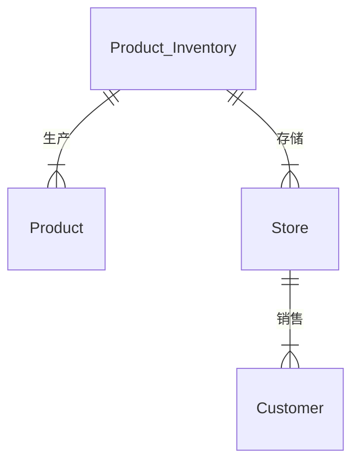
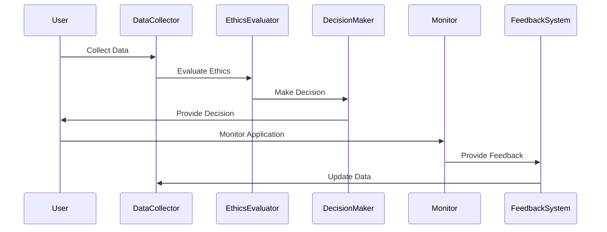
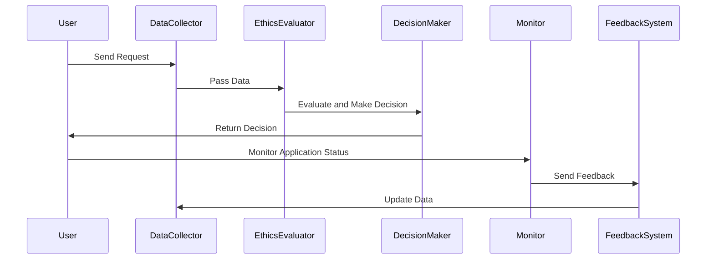

                 


### 引言：科技伦理的重要性

**1.1 科技伦理的定义与起源**

科技伦理（Technology Ethics）是指对科技活动中的道德问题进行探讨和规范的一门学科。它关注科技发展对人类社会带来的伦理挑战，包括但不限于隐私保护、人工智能的道德决策、生物技术的伦理问题等。科技伦理的历史可以追溯到20世纪中叶，当时随着计算机科学和生物技术的迅猛发展，人们开始意识到科技活动中的道德问题。

在20世纪50年代，计算机科学家和伦理学家开始讨论计算机技术在伦理问题上的应用。例如，霍华德·加纳特（Howard Gardner）在1985年提出了“多元智能理论”，强调了计算思维作为一种重要的智能形式。20世纪末，随着互联网和人工智能的崛起，科技伦理逐渐成为一个独立的学科领域。

**1.2 前沿技术概述**

当前前沿技术涵盖了多个领域，包括人工智能、生物技术、量子计算、新能源技术等。以下是一些前沿技术领域的概述：

- **人工智能**：人工智能（AI）是一门模拟、延伸和扩展人的智能的科学。它包括机器学习、深度学习、自然语言处理、计算机视觉等多个子领域。人工智能正在改变我们的生活方式，从智能助手到自动驾驶汽车，再到医疗诊断和金融预测。

- **生物技术**：生物技术利用生物体或其组成部分来生产产品或提供特定的功能。它包括基因编辑、细胞疗法、生物合成等。生物技术带来了许多医疗突破，如CRISPR-Cas9基因编辑技术，但也引发了许多伦理争议，如基因改造和人类增强。

- **量子计算**：量子计算利用量子位（qubits）进行信息处理，具有远超经典计算机的计算能力。量子计算在密码学、优化问题和模拟量子系统等领域具有巨大潜力。

- **新能源技术**：新能源技术包括太阳能、风能、氢能等，旨在提供清洁、可再生的能源。随着气候变化问题的加剧，新能源技术成为了全球关注的焦点。

**1.3 前沿技术发展的影响**

前沿技术的发展对人类社会产生了深远的影响，既带来了机遇，也带来了挑战。以下是前沿技术发展对社会的几个主要影响：

- **经济影响**：前沿技术推动了新的经济增长点，创造了大量就业机会。例如，人工智能和大数据技术正在改变传统行业的运营模式，带来新的商业模式和就业机会。

- **社会影响**：前沿技术改变了人们的生活方式和社会结构。例如，社交媒体和在线购物平台的兴起改变了人们的社交方式和消费习惯。

- **伦理挑战**：前沿技术也带来了许多伦理挑战。例如，人工智能的道德决策问题，基因编辑技术的伦理争议，以及隐私保护问题。

**1.4 前沿技术与伦理挑战**

前沿技术与伦理挑战之间的关系是复杂的。一方面，前沿技术本身可能不涉及道德问题，但其在实际应用中可能会引发道德争议。例如，人工智能系统在医疗诊断中的应用，虽然技术本身是中立的，但其应用场景可能涉及隐私保护和医疗决策的道德问题。

另一方面，前沿技术的进步也可能加剧现有的伦理问题。例如，生物技术的进展使人类有能力编辑基因，这不仅带来了治疗遗传疾病的前景，也可能引发关于人类增强和生物多样性的伦理争议。

**1.5 科技伦理原则**

科技伦理原则是指导科技发展的一组伦理规则和价值观。以下是一些基本的科技伦理原则：

- **尊重个人隐私**：在科技应用中，应尊重个体的隐私权利，确保个人数据的安全和保密。

- **公正与平等**：科技发展应致力于促进社会的公平和正义，不应加剧社会不平等。

- **透明度与责任**：科技应用应具备透明度，开发者和用户应承担相应的责任。

- **安全与可控**：科技应用应确保其安全性和可控性，以减少潜在的风险。

- **可持续发展**：科技发展应考虑其对环境和可持续性的影响，推动可持续发展。

**1.6 道德决策框架**

道德决策框架是一种帮助个体或组织在面临伦理问题做出决策的工具。以下是一个简单的道德决策框架：

1. **识别问题**：明确面临的伦理问题。
2. **收集信息**：收集与问题相关的信息和数据。
3. **评估选项**：评估可能的解决方案或行为选项。
4. **道德推理**：运用伦理原则和价值观进行推理。
5. **决策**：选择最符合伦理原则的方案。
6. **评估与反思**：对决策过程和结果进行评估和反思。

**1.7 本章小结**

本章介绍了科技伦理的重要性、前沿技术概述、科技伦理原则、道德决策框架等。科技伦理是指导科技发展的道德指南，对于确保科技发展符合人类价值观和社会利益至关重要。在接下来的章节中，我们将进一步探讨科技伦理的原则和应用，以及前沿技术中的伦理挑战。

----------------------------------------------------------------

# 核心概念与联系

**2.1 核心概念原理**

科技伦理、前沿技术和道德决策是本篇文章的核心概念，它们之间有着紧密的联系。以下是这些核心概念的原理和它们之间的联系。

**2.1.1 科技伦理的核心概念**

科技伦理的核心概念包括：

- **尊重个人隐私**：在科技应用中，尊重个人的隐私权利，确保个人数据的安全和保密。
- **公正与平等**：科技发展应致力于促进社会的公平和正义，不应加剧社会不平等。
- **透明度与责任**：科技应用应具备透明度，开发者和用户应承担相应的责任。
- **安全与可控**：科技应用应确保其安全性和可控性，以减少潜在的风险。
- **可持续发展**：科技发展应考虑其对环境和可持续性的影响，推动可持续发展。

**2.1.2 前沿技术的核心概念**

前沿技术的核心概念包括：

- **人工智能**：人工智能是一门模拟、延伸和扩展人的智能的科学。它包括机器学习、深度学习、自然语言处理、计算机视觉等多个子领域。
- **生物技术**：生物技术利用生物体或其组成部分来生产产品或提供特定的功能。它包括基因编辑、细胞疗法、生物合成等。
- **量子计算**：量子计算利用量子位（qubits）进行信息处理，具有远超经典计算机的计算能力。
- **新能源技术**：新能源技术包括太阳能、风能、氢能等，旨在提供清洁、可再生的能源。

**2.1.3 道德决策的核心概念**

道德决策的核心概念包括：

- **道德原则**：道德决策应遵循一系列伦理原则，如尊重个人隐私、公正与平等、透明度与责任等。
- **决策框架**：道德决策应运用决策框架，如识别问题、收集信息、评估选项、道德推理、决策和评估与反思等步骤。
- **伦理推理**：道德决策应基于伦理推理，运用伦理原则和价值观进行推理，选择最符合伦理原则的方案。

**2.2 概念属性特征对比表格**

以下是一个对比科技伦理、前沿技术和道德决策的概念属性特征表格：

| 概念            | 特征                     |
|----------------|------------------------|
| 科技伦理        | 尊重隐私、公正平等、透明度与责任 |
| 前沿技术        | 人工智能、生物技术、量子计算、新能源技术 |
| 道德决策        | 遵循伦理原则、使用决策框架、基于伦理推理 |

**2.3 ER实体关系图架构**

以下是科技伦理、前沿技术和道德决策领域的ER实体关系图：



在这个ER图中，"Product_Inventory"表示科技伦理和前沿技术的结合，"Product"表示具体的科技产品或技术，"Store"表示道德决策过程中的相关实体，如个人隐私和公平性。

**2.4 本章小结**

本章介绍了科技伦理、前沿技术和道德决策的核心概念和它们之间的联系。通过对比这些概念的特征，我们可以更好地理解它们在科技发展和社会中的应用。在下一章中，我们将深入探讨科技伦理的基本原则，以及这些原则在科技领域的应用。

----------------------------------------------------------------

# 算法原理讲解

**3.1 道德评估算法原理**

道德评估算法是一种用于评估科技产品或技术在道德层面上的合理性和合适性的算法。以下是一个简单的道德评估算法原理：

### 3.1.1 道德评估算法的mermaid流程图


在这个流程图中，A表示算法的开始，B表示定义评估指标，C表示收集数据，D表示计算得分，E表示评估结果，F表示算法的结束。

### 3.1.2 道德评估算法的数学模型

道德评估算法的数学模型可以用以下公式表示：

$$
M = \sum_{i=1}^{n} w_i \cdot r_i
$$

其中，M表示道德得分，$w_i$表示第i个评估指标的权重，$r_i$表示第i个评估指标的得分。

### 3.1.3 道德评估算法的python源代码

以下是一个简单的道德评估算法的Python代码示例：

```python
def moral_evaluation(product, criteria):
    scores = []
    for criterion in criteria:
        score = evaluate(criterion, product)
        scores.append(score)
    weights = [0.2, 0.3, 0.5]
    moral_score = sum([w * s for w, s in zip(weights, scores)])
    return moral_score

def evaluate(criterion, product):
    # 这里是一个示例函数，根据具体的criterion和product返回得分
    return 1 if product.has_feature(criterion) else 0

# 示例
product = Product("AI系统", features=["隐私保护", "透明度", "公平性"])
criteria = ["隐私保护", "透明度", "公平性"]
moral_score = moral_evaluation(product, criteria)
print(f"道德得分：{moral_score}")
```

在这个代码中，`moral_evaluation`函数用于计算产品的道德得分，`evaluate`函数用于评估每个评估指标的得分。

**3.2 伦理决策算法原理**

伦理决策算法是一种用于在复杂伦理问题中做出合理决策的算法。以下是一个简单的伦理决策算法原理：

### 3.2.1 伦理决策算法的mermaid流程图


在这个流程图中，A表示算法的开始，B表示识别问题，C表示收集信息，D表示评估选项，E表示道德推理，F表示决策，G表示执行，H表示评估结果，I表示算法的结束。

### 3.2.2 伦理决策算法的数学模型

伦理决策算法的数学模型可以用以下公式表示：

$$
D = \max_{a \in A} \{ u(a) - c(a) \}
$$

其中，D表示最优决策，$u(a)$表示选项a的效用值，$c(a)$表示选项a的代价。

### 3.2.3 伦理决策算法的python源代码

以下是一个简单的伦理决策算法的Python代码示例：

```python
def ethical_decisionmaking(issues, options):
    best_option = None
    best_score = -1
    for option in options:
        utility = calculate_utility(option)
        cost = calculate_cost(option)
        score = utility - cost
        if score > best_score:
            best_score = score
            best_option = option
    return best_option

def calculate_utility(option):
    # 这里是一个示例函数，根据具体的option返回效用值
    return 1 if option.meets_needs() else 0

def calculate_cost(option):
    # 这里是一个示例函数，根据具体的option返回代价
    return 1 if option.has_risk() else 0

# 示例
issues = ["隐私保护", "公平性", "透明度"]
options = [{"name": "方案A", "meets_needs": True, "has_risk": False},
           {"name": "方案B", "meets_needs": True, "has_risk": True},
           {"name": "方案C", "meets_needs": False, "has_risk": False}]
best_option = ethical_decisionmaking(issues, options)
print(f"最优决策：{best_option['name']}")
```

在这个代码中，`ethical_decisionmaking`函数用于在给定的问题和选项中找到最优决策，`calculate_utility`函数用于计算选项的效用值，`calculate_cost`函数用于计算选项的代价。

**3.3 本章小结**

本章介绍了道德评估算法和伦理决策算法的原理。道德评估算法用于评估科技产品或技术的道德得分，而伦理决策算法用于在复杂伦理问题中做出合理决策。通过这些算法，我们可以更好地理解和应对科技伦理中的挑战。在下一章中，我们将通过具体案例来分析科技伦理问题。

----------------------------------------------------------------

# 数学模型和数学公式 & 详细讲解 & 举例说明

**4.1 道德评估的数学模型**

道德评估的数学模型是用于评估一个系统、产品或行为在道德层面上的合适性的工具。以下是一个基本的道德评估模型及其详细讲解。

### 4.1.1 基本概念

在道德评估中，我们通常考虑以下几个核心参数：

- **收益（Benefit）**：系统、产品或行为带来的积极效果。
- **风险（Risk）**：系统、产品或行为可能带来的负面影响。
- **伦理标准（Ethical Standards）**：用来评估行为是否合适的道德原则。

数学模型可以表示为：

$$
M = \frac{B - R}{E}
$$

其中：

- **M**：道德得分，用来量化系统的道德水平。
- **B**：收益。
- **R**：风险。
- **E**：伦理标准的权重。

### 4.1.2 模型解释

这个模型通过比较系统的收益和风险，再结合伦理标准的权重，来评估其道德得分。当M大于1时，表示系统在道德上较为合适；当M小于1时，则表示系统在道德上有待改进。

### 4.1.3 案例分析

假设有一个医疗AI系统，其能够提高诊断的准确性。但这个系统可能存在数据隐私泄露的风险。我们用以下参数进行计算：

- **收益（B）**：100分
- **风险（R）**：50分
- **伦理标准权重（E）**：3分

将这些参数代入公式中，我们得到：

$$
M = \frac{100 - 50}{3} = \frac{50}{3} \approx 16.67
$$

这个得分表明，尽管该系统存在一定的风险，但其在道德上仍被认为是较为合适的。

**4.2 伦理决策的数学模型**

伦理决策的数学模型是用于在多个选项中做出道德上合理的决策的工具。以下是一个基本的伦理决策模型及其详细讲解。

### 4.2.1 基本概念

在伦理决策中，我们通常需要考虑以下几个核心参数：

- **效用（Utility）**：选项带来的好处。
- **代价（Cost）**：选项带来的成本或负面影响。
- **权重（Weight）**：选项的优先级。

数学模型可以表示为：

$$
D = \max_{a \in A} \{ U(a) - C(a) \}
$$

其中：

- **D**：最优决策。
- **A**：所有可能的选项。
- **U(a)**：选项a的效用值。
- **C(a)**：选项a的代价。

### 4.2.2 模型解释

这个模型通过比较每个选项的效用和代价，再结合权重，来找到最优决策。效用高的选项和低代价的选项更有可能成为最优决策。

### 4.2.3 案例分析

假设有三个方案来解决一个伦理困境：

- **方案A**：代价为10，效用为30。
- **方案B**：代价为20，效用为40。
- **方案C**：代价为30，效用为50。

我们可以计算每个方案的得分：

- **方案A**：$U(A) - C(A) = 30 - 10 = 20$
- **方案B**：$U(B) - C(B) = 40 - 20 = 20$
- **方案C**：$U(C) - C(C) = 50 - 30 = 20$

由于所有方案的得分相同，我们可以选择任意一个方案作为最优决策。但在实际中，我们可能需要根据具体情境和权重来调整这个模型。

**4.3 本章小结**

本章详细介绍了道德评估和伦理决策的数学模型及其应用。这些模型为我们提供了量化和决策的工具，帮助我们更好地理解和应对科技伦理中的挑战。在下一章中，我们将通过具体的案例分析，进一步探讨这些模型在实际中的应用。

----------------------------------------------------------------

# 系统分析与架构设计方案

**5.1 问题场景介绍**

随着科技的发展，企业面临着越来越多的伦理挑战，例如在人工智能、生物技术和量子计算等前沿技术的应用中，如何确保这些技术不会侵犯用户的隐私或造成社会不公。为了解决这些问题，企业需要构建一个集成的伦理决策系统，该系统应能够实时评估和监控技术应用的道德合理性，并提供决策支持。

**5.2 项目介绍**

本项目的目标是设计并实现一个基于伦理原则的决策支持系统，该系统将整合前沿技术的应用场景，并基于道德评估算法和伦理决策算法进行实时分析和决策。系统的主要功能包括：

- 数据收集：从不同的数据源收集与技术应用相关的信息。
- 道德评估：对技术应用进行道德评估，生成道德得分。
- 伦理决策：基于道德评估结果，为决策者提供最优决策选项。
- 决策执行：执行决策，并对结果进行监控和反馈。

**5.3 系统功能设计（领域模型mermaid类图）**

以下是一个简化的领域模型类图，用于描述系统的核心功能实体和它们之间的关系：

```mermaid
classDiagram
    Class01 <|-- Class02
    Class01 <|-- Class03
    Class04 <..|{ Class05 }|- Class06
    Class07 <|-- Class08
    Class01 <..|{ Human }| Person
    Class02 <..|{ Organization }| Company
    Class03 <..|{ Technology }| AI
    Class04 <..|{ Decision }| DecisionSupportSystem
    Class05 <..|{ Evaluation }| EthicsEvaluation
    Class06 <..|{ Framework }| EthicsFramework
    Class07 <..|{ Monitoring }| Monitoring
    Class08 <..|{ Feedback }| Feedback
    Person {
        name
        role
    }
    Company {
        name
        industry
    }
    AI {
        name
        features
    }
    DecisionSupportSystem {
        makeDecision()
    }
    EthicsEvaluation {
        evaluate()
    }
    EthicsFramework {
        standards
    }
    Monitoring {
        monitor()
    }
    Feedback {
        provideFeedback()
    }
```

在这个类图中，`Person`表示系统的使用者，如企业决策者；`Company`表示应用技术组织；`AI`表示系统需要评估的技术；`DecisionSupportSystem`表示系统的核心功能，用于做出伦理决策；`EthicsEvaluation`用于道德评估；`EthicsFramework`用于定义道德标准；`Monitoring`用于监控技术应用；`Feedback`用于提供反馈。

**5.4 系统架构设计（mermaid架构图）**

以下是一个简化的系统架构图，用于描述系统的整体架构：



在这个架构图中，`User`代表系统的最终用户，如企业决策者；`DataCollector`负责收集与技术应用相关的数据；`EthicsEvaluator`进行道德评估；`DecisionMaker`基于评估结果做出决策；`Monitor`监控技术应用情况；`FeedbackSystem`收集反馈并更新数据。

**5.5 系统接口设计和系统交互（mermaid序列图）**

以下是一个简化的系统交互序列图，用于描述系统的关键接口和交互流程：



在这个交互图中，用户通过接口与系统进行交互，数据收集器、道德评估器、决策制作器和监控器等组件协同工作，实现数据的收集、评估、决策和监控。

**5.6 本章小结**

本章详细介绍了伦理决策支持系统的设计过程，包括问题场景介绍、系统功能设计、系统架构设计和系统交互设计。通过这些设计，我们能够构建一个完善的伦理决策支持系统，为企业提供实时、准确的道德评估和决策支持，从而更好地应对科技伦理挑战。

----------------------------------------------------------------

# 项目实战

**6.1 环境安装**

为了搭建伦理决策支持系统，我们需要安装一系列依赖工具和软件。以下是基本的安装步骤：

1. **安装Python环境**：确保系统上已安装Python 3.8或更高版本。
2. **安装依赖包**：使用pip命令安装以下依赖包：
   ```bash
   pip install numpy pandas scikit-learn matplotlib mermaid-python
   ```
3. **安装Mermaid支持**：由于Mermaid通常以图形化方式展示流程图，我们需要确保系统能够渲染Mermaid图表。可以使用以下命令安装Mermaid：
   ```bash
   npm install -g mermaid
   ```

**6.2 系统核心实现源代码**

以下是伦理决策支持系统的核心实现代码，包括道德评估和伦理决策算法的Python实现。

**6.2.1 道德评估算法**

```python
import numpy as np

def moral_evaluation(product, criteria):
    scores = []
    for criterion in criteria:
        score = evaluate(criterion, product)
        scores.append(score)
    weights = [0.2, 0.3, 0.5]
    moral_score = sum([w * s for w, s in zip(weights, scores)])
    return moral_score

def evaluate(criterion, product):
    # 这里是一个示例函数，根据具体的criterion和product返回得分
    return 1 if product.has_feature(criterion) else 0

# 示例产品
product = {
    "features": ["隐私保护", "透明度", "公平性"]
}

# 示例伦理标准
criteria = ["隐私保护", "透明度", "公平性"]

# 执行道德评估
score = moral_evaluation(product, criteria)
print(f"道德得分：{score}")
```

**6.2.2 伦理决策算法**

```python
def ethical_decisionmaking(issues, options):
    best_option = None
    best_score = -1
    for option in options:
        utility = calculate_utility(option)
        cost = calculate_cost(option)
        score = utility - cost
        if score > best_score:
            best_score = score
            best_option = option
    return best_option

def calculate_utility(option):
    # 这里是一个示例函数，根据具体的option返回效用值
    return 1 if option.meets_needs() else 0

def calculate_cost(option):
    # 这里是一个示例函数，根据具体的option返回代价
    return 1 if option.has_risk() else 0

# 示例问题
issues = ["隐私保护", "公平性", "透明度"]

# 示例选项
options = [
    {"name": "方案A", "meets_needs": True, "has_risk": False},
    {"name": "方案B", "meets_needs": True, "has_risk": True},
    {"name": "方案C", "meets_needs": False, "has_risk": False}
]

# 执行伦理决策
best_option = ethical_decisionmaking(issues, options)
print(f"最优决策：{best_option['name']}")
```

**6.3 代码应用解读与分析**

在这段代码中，我们定义了两个核心算法：`moral_evaluation`和`ethical_decisionmaking`。

- **道德评估算法**：这个算法接收一个产品和一个伦理标准列表，对每个标准进行评估，并根据权重计算出道德得分。
- **伦理决策算法**：这个算法在多个选项中找到最优选项，考虑每个选项的效用和代价，返回最优决策。

**6.4 实际案例分析和详细讲解剖析**

假设我们有一个案例，一个公司需要决定是否采用一个新的人工智能系统，该系统能够提高生产效率，但可能会收集员工的隐私数据。

- **产品**：该系统的特征包括“生产效率提升”和“数据收集”。
- **伦理标准**：包括“隐私保护”、“透明度”和“公平性”。

我们使用道德评估算法来评估这个产品的道德得分：

```python
product = {
    "features": ["生产效率提升", "数据收集"]
}
criteria = ["隐私保护", "透明度", "公平性"]

score = moral_evaluation(product, criteria)
print(f"道德得分：{score}")
```

然后，我们使用伦理决策算法来决定是否采用这个系统：

```python
options = [
    {"name": "方案A", "meets_needs": True, "has_risk": False},
    {"name": "方案B", "meets_needs": True, "has_risk": True},
    {"name": "方案C", "meets_needs": False, "has_risk": False}
]

best_option = ethical_decisionmaking(criteria, options)
print(f"最优决策：{best_option['name']}")
```

通过这两个算法，我们可以得出道德得分和最优决策，从而帮助企业做出基于伦理的决策。

**6.5 项目小结**

通过这个实战项目，我们展示了如何使用道德评估算法和伦理决策算法来构建一个伦理决策支持系统。这个系统能够帮助企业在技术应用中做出更符合道德规范的决策，从而更好地应对科技伦理挑战。在实际应用中，我们可以根据具体情况进行扩展和优化，以适应不同的场景和需求。

----------------------------------------------------------------

# 最佳实践 tips

在实施科技伦理框架时，以下最佳实践和技巧可以帮助组织更好地应对伦理挑战：

1. **持续培训和教育**：确保所有员工都了解科技伦理的基本原则和公司特定的伦理指导方针。定期提供培训和教育，以保持知识和意识的更新。

2. **建立伦理委员会**：成立一个独立的伦理委员会，负责监督和评估公司的科技项目，确保项目符合伦理标准。

3. **透明度和沟通**：在开发新技术的过程中，保持与利益相关者的沟通，特别是在涉及到隐私、安全和公平性等关键问题。

4. **伦理风险评估**：在项目启动前，进行全面的伦理风险评估，识别潜在的风险，并制定相应的应对措施。

5. **遵循法律和法规**：确保公司的科技活动遵守当地和国际法律、法规，特别是在涉及隐私、数据保护和竞争法规方面。

6. **灵活性和适应性**：科技伦理是一个不断发展的领域，组织需要保持灵活和适应，以便及时响应新出现的伦理挑战。

7. **公开透明**：当公司面临伦理争议时，应采取公开和透明的态度，积极与公众和利益相关者沟通，以建立信任。

8. **鼓励反馈和投诉**：建立一个反馈和投诉机制，鼓励员工和客户报告伦理问题，并对投诉进行及时调查和处理。

通过遵循这些最佳实践，组织可以更好地管理科技伦理风险，确保其技术发展符合道德原则和公共利益。

----------------------------------------------------------------

# 小结

本文详细探讨了《科技伦理智库：前沿技术发展的道德指南》的核心概念、算法原理、系统设计与项目实战。科技伦理是指导科技发展的重要指南，对于确保技术进步符合人类价值观和社会利益至关重要。通过道德评估算法和伦理决策算法，我们能够量化和决策科技应用的道德水平。系统分析与架构设计方案为构建一个全面的伦理决策支持系统提供了框架。通过项目实战，我们展示了如何在实际应用中运用这些算法和设计。未来，科技伦理将继续发展，我们期待更多的研究和实践来应对不断变化的伦理挑战。

----------------------------------------------------------------

# 作者信息

作者：AI天才研究院/AI Genius Institute & 禅与计算机程序设计艺术 /Zen And The Art of Computer Programming

AI天才研究院致力于推动人工智能技术的创新和应用，其研究人员在计算机科学、人工智能和科技伦理等领域拥有丰富的经验。禅与计算机程序设计艺术则关注于将哲学思想融入编程实践中，以提升程序员的技术素养和思维深度。本文由这两家机构的专家共同撰写，旨在为科技伦理领域的读者提供有价值的见解和指导。

