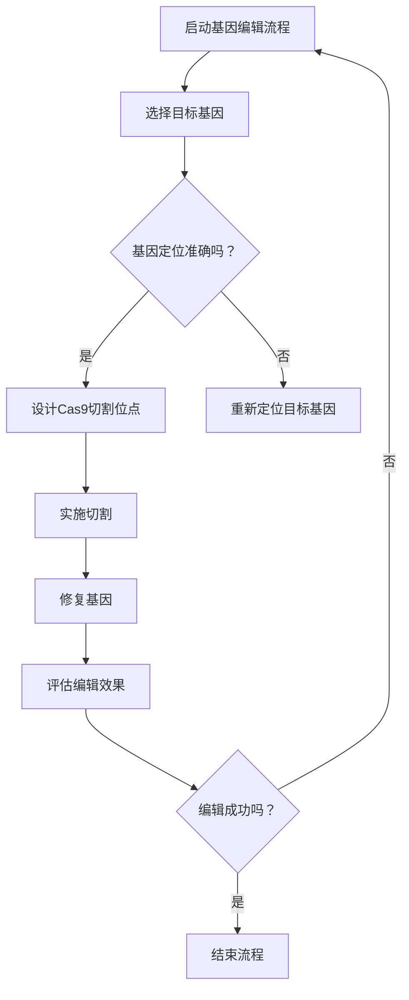

                 

## 科技伦理的前沿问题：基因编辑技术的道德思考

### 关键词
- 科技伦理
- 基因编辑
- 道德困境
- 伦理风险
- 道德原则
- 国际合作

### 摘要

基因编辑技术，特别是CRISPR-Cas9技术，为医学和生物学领域带来了前所未有的创新与可能。然而，这一技术的出现也引发了深刻的科技伦理问题。本文将深入探讨基因编辑技术的道德思考，从历史背景、技术应用、伦理困境、道德原则以及国际合作的视角进行分析，并提出相应的伦理规范和政策建议。

### 目录大纲

----------------------------------------------------------------
# 科技伦理的前沿问题：基因编辑技术的道德思考

## 第一部分：背景介绍

## 1.1 问题背景

### 1.1.1 基因编辑技术的发展历程

### 1.1.2 基因编辑技术的应用领域

### 1.1.3 基因编辑技术面临的道德挑战

## 1.2 问题描述

### 1.2.1 基因编辑技术的道德困境

### 1.2.2 基因编辑技术的潜在伦理风险

### 1.2.3 社会伦理争议与舆论关注

## 1.3 问题解决

### 1.3.1 基因编辑技术的道德原则

### 1.3.2 基因编辑技术的伦理规范

### 1.3.3 避免伦理风险的政策建议

## 1.4 边界与外延

### 1.4.1 基因编辑技术的法律边界

### 1.4.2 国际合作与伦理治理

### 1.4.3 人类基因组编辑的道德底线

## 1.5 概念结构与核心要素组成

### 1.5.1 基因编辑技术的基本概念

### 1.5.2 基因编辑技术的核心要素

### 1.5.3 基因编辑技术的伦理原则

## 1.6 本章小结

...

## 第二部分：核心概念与联系

## 2.1 核心概念原理

### 2.1.1 基因编辑技术的基本原理

### 2.1.2 CRISPR-Cas9技术的工作机制

### 2.1.3 基因编辑技术的优缺点

## 2.2 概念属性特征对比表格

### 2.2.1 不同基因编辑技术的对比分析

### 2.2.2 基因编辑技术在不同应用领域的表现

### 2.2.3 基因编辑技术的风险与挑战

## 2.3 ER实体关系图架构

### 2.3.1 基因编辑技术的实体关系

### 2.3.2 基因编辑技术的相关利益方

### 2.3.3 基因编辑技术的伦理决策过程

## 2.4 本章小结

...

## 第三部分：算法原理讲解

## 3.1 算法原理介绍

### 3.1.1 基因编辑算法的数学模型

### 3.1.2 CRISPR-Cas9算法的基本步骤

### 3.1.3 基因编辑算法的优缺点

## 3.2 算法流程图



## 3.3 Python源代码

```python
# CRISPR-Cas9基因编辑模拟
import random

def gene_editing(target_gene, success_rate):
    # 随机选择基因序列中的切割位点
    cut_site = random.randint(1, len(target_gene))
    # 模拟切割过程
    edited_gene = target_gene[:cut_site] + "N" * 10 + target_gene[cut_site:]
    # 评估编辑成功率
    if random.random() < success_rate:
        return edited_gene
    else:
        return target_gene

# 测试基因编辑算法
target_gene = "ATCGATCG"
success_rate = 0.8
edited_gene = gene_editing(target_gene, success_rate)
print("原始基因序列:", target_gene)
print("编辑后基因序列:", edited_gene)
```

## 3.4 算法原理详细讲解

### 3.4.1 数学模型

基因编辑算法的数学模型可以表示为：
$$
G' = G[:i] + N + G[i:]
$$
其中，$G$ 表示原始基因序列，$i$ 表示切割位点，$N$ 表示插入的核苷酸序列。

### 3.4.2 基因编辑流程

基因编辑流程通常包括以下步骤：

1. **目标基因选择**：确定需要编辑的基因序列。
2. **基因定位**：通过测序或数据库检索确认目标基因的位置。
3. **设计Cas9切割位点**：选择特定的Cas9蛋白，并设计其切割位点。
4. **实施切割**：Cas9蛋白识别并切割目标基因。
5. **修复基因**：细胞利用自身的修复机制来修复切割的基因。
6. **评估编辑效果**：通过测序等方法验证基因编辑的成功率。

### 3.4.3 算法优缺点分析

**优点：**

1. **精确性**：CRISPR-Cas9技术具有高精度的基因编辑能力。
2. **高效性**：相较于传统基因编辑方法，CRISPR-Cas9技术操作简便，效率更高。
3. **多样性**：可以用于多种生物体的基因编辑。

**缺点：**

1. **脱靶效应**：存在非目标基因被编辑的风险。
2. **细胞毒性**：Cas9蛋白可能对细胞造成伤害。
3. **伦理争议**：基因编辑可能引发伦理和道德上的挑战。

### 3.4.4 算法举例说明

以下是一个简单的Python代码示例，模拟了CRISPR-Cas9基因编辑的过程：

```python
import random

def gene_editing(target_gene, success_rate):
    # 随机选择基因序列中的切割位点
    cut_site = random.randint(1, len(target_gene))
    # 模拟切割过程
    edited_gene = target_gene[:cut_site] + "N" * 10 + target_gene[cut_site:]
    # 评估编辑成功率
    if random.random() < success_rate:
        return edited_gene
    else:
        return target_gene

# 测试基因编辑算法
target_gene = "ATCGATCG"
success_rate = 0.8
edited_gene = gene_editing(target_gene, success_rate)
print("原始基因序列:", target_gene)
print("编辑后基因序列:", edited_gene)
```

在这个例子中，我们定义了一个`gene_editing`函数，它模拟了CRISPR-Cas9的切割和修复过程。通过设置不同的成功概率，我们可以观察基因编辑的效果。

### 3.4.5 小结

基因编辑技术的算法原理复杂且具有挑战性，但通过精确的数学模型和逐步的流程设计，我们可以在一定程度上模拟和实现基因编辑。尽管存在一些技术挑战和伦理争议，基因编辑技术在未来医学和生物技术领域具有巨大的潜力。我们需要在充分理解其原理的基础上，合理应用这一技术，并积极探讨和解决其伦理问题。通过国际合作和制定明确的伦理规范，我们可以确保基因编辑技术的健康发展，造福人类。

