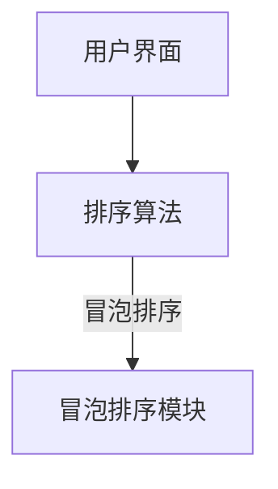
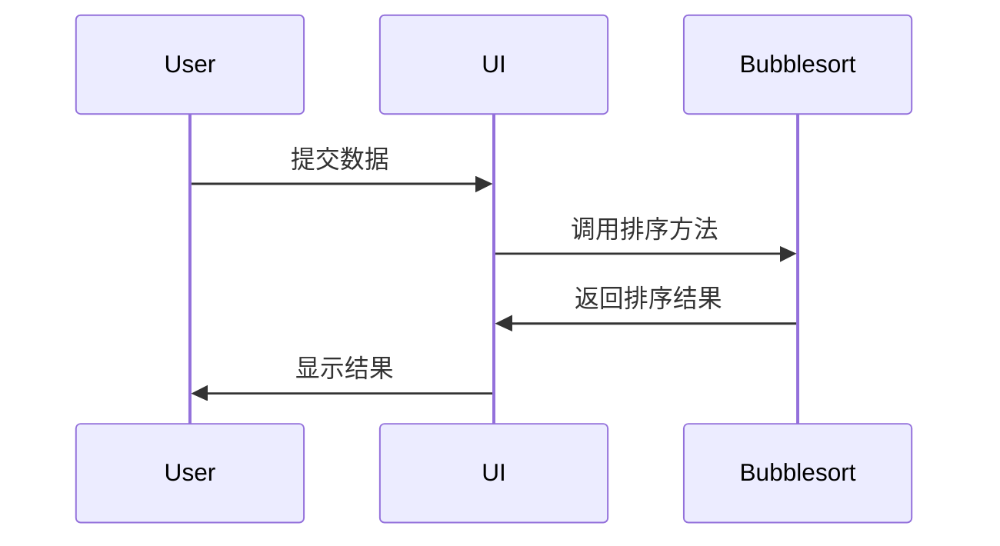

                 

# 科技发展中的人文关怀：在效率与温度间寻找平衡点

> 关键词：科技发展、人文关怀、效率与温度平衡、技术进步、教育、政策与法规

> 摘要：本文从科技发展的背景分析入手，探讨了效率与人文关怀在科技发展中的重要性，以及如何在效率与温度之间寻找平衡点。文章通过具体案例和实践策略，分析了科技企业、政策法规以及教育领域如何实现效率与人文关怀的平衡，并展望了未来科技发展的趋势。本文旨在为科技发展提供一种以人为本的思考方式，促进科技与人文的和谐共生。

## 第一部分：引言

### 第1章：科技发展背景分析

#### 1.1 人类科技发展的历史与现状

自人类文明诞生以来，科技发展一直是推动社会进步的重要力量。从古代的农业革命到工业革命，再到现代的信息技术革命，每一次科技的进步都带来了生产力的飞跃和社会变革。

在21世纪，科技发展的速度更加迅猛，人工智能、大数据、区块链等新兴技术不断涌现，极大地改变了我们的生活方式和社会结构。然而，在追求效率的同时，我们也不能忽视人文关怀的重要性。

#### 1.2 科技发展带来的社会变革

科技的发展不仅改变了我们的生产方式，也改变了我们的生活方式。例如，互联网的普及让我们可以随时随地进行沟通和交流，大数据技术帮助我们更好地理解和预测市场需求，人工智能则使得生产自动化和智能化成为可能。

然而，科技的发展也带来了一些负面影响，如隐私泄露、数据滥用、就业问题等。这些问题提醒我们在追求效率的同时，必须注重人文关怀，确保科技发展不会偏离人类的共同利益。

### 1.3 文章结构与核心议题

本文将从以下几个方面展开讨论：

1. 效率与人文关怀的关系
2. 效率提升与人文关怀策略
3. 技术进步中的人文关怀
4. 科技企业中的人文关怀实践
5. 政策与法规中的效率与人文关怀
6. 人文关怀在科技教育中的重要性
7. 科技发展中的效率与温度平衡展望

通过这些议题的探讨，我们将试图寻找效率与人文关怀之间的平衡点，为科技发展提供一种更加人性化的方向。

### 1.4 阅读指南与学习目标

本文旨在为读者提供一个全面而深入的视角，以理解科技发展中的效率与人文关怀。通过阅读本文，读者可以：

1. 了解科技发展的历史与现状
2. 明确效率与人文关怀的关系
3. 学习如何实现效率提升与人文关怀的平衡
4. 掌握科技企业、政策法规和教育领域中的人文关怀实践
5. 探讨科技发展中的效率与温度平衡展望

希望本文能帮助读者在科技发展的道路上，找到一条既高效又充满人文关怀的道路。

## 第二部分：效率与人文关怀

### 第2章：效率与人文关怀的关系

#### 2.1 效率的定义与衡量

效率是指在给定的时间和资源约束下，完成任务的质量和速度。它通常用单位时间内完成的工作量来衡量。效率的提升可以带来生产力的提高，从而推动社会和经济的发展。

然而，效率的提升并不意味着一切。在追求效率的过程中，我们往往忽视了人文关怀的重要性。人文关怀是指关注人的需求、情感和福祉，强调人与人之间的和谐与尊重。人文关怀不仅是一种道德准则，也是实现可持续发展的必要条件。

#### 2.2 人文关怀的概念与内涵

人文关怀是一种价值观，它强调人类共同的尊严和价值。人文关怀的内涵包括但不限于：尊重个人权利和自由、关注社会公平和正义、促进人类福祉和幸福等。

人文关怀与效率并不矛盾，而是相辅相成的。高效的完成工作可以带来物质财富和社会进步，而人文关怀则可以提升人的精神境界和生活质量，从而创造更加美好的社会。

#### 2.3 效率与人文关怀的内在联系

效率与人文关怀之间存在着内在的联系。高效的完成工作可以为人文关怀提供物质基础，而人文关怀则可以激发人的创造力和创新精神，从而推动效率的提升。

此外，效率与人文关怀还可以相互促进。高效的完成工作可以节省时间和资源，从而为人文关怀提供更多的时间和机会。而人文关怀的提升也可以激发人的工作热情和创造力，从而提高工作效率。

因此，在科技发展中，我们必须同时关注效率和人文关怀，寻找二者之间的平衡点。

## 第三部分：实践与策略

### 第3章：效率提升与人文关怀策略

#### 3.1 效率提升的传统方法

在传统的管理理论中，效率提升通常通过以下几种方法实现：

1. **过程优化**：通过对工作流程的优化，减少不必要的步骤，提高工作效率。
2. **资源整合**：通过整合资源，如人力、物力和财力，提高生产效率。
3. **技术革新**：通过引入新技术和新设备，提高生产效率。

然而，这些方法往往忽视了人文关怀的重要性，导致员工工作压力增大，工作效率下降，甚至出现职业倦怠和离职率升高等问题。

#### 3.2 人文关怀策略的实施

为了在效率与人文关怀之间找到平衡点，我们可以采取以下人文关怀策略：

1. **员工关怀**：关注员工的生活和工作需求，提供良好的工作环境和福利待遇，如弹性工作时间、健康保险、培训机会等。
2. **员工参与**：鼓励员工参与决策过程，提高员工的参与感和归属感，从而增强工作积极性和创造力。
3. **团队合作**：强调团队合作，建立良好的团队文化和团队氛围，减少冲突和矛盾，提高团队效率和绩效。

通过这些人文关怀策略，可以在提高工作效率的同时，增强员工的工作满意度和幸福感。

#### 3.3 效率提升与人文关怀的平衡

在实施效率提升和人文关怀策略时，我们需要注意以下几点：

1. **目标明确**：明确效率提升和人文关怀的目标，确保两者之间相互促进，而不是相互冲突。
2. **资源分配**：合理分配资源，确保既有足够的资源用于效率提升，也有足够的资源用于人文关怀。
3. **持续优化**：不断优化效率提升和人文关怀策略，根据实际情况进行调整和改进，确保其有效性。

通过以上措施，我们可以在效率与人文关怀之间找到平衡点，实现可持续发展。

## 第四部分：技术进步中的人文关怀

### 第4章：技术进步对人类社会的影响

技术进步是人类社会进步的重要动力，但同时也带来了一系列影响。为了在技术进步中融入人文关怀，我们需要关注以下几个方面：

#### 4.1 技术进步对人类社会的影响

技术进步对人类社会的影响主要表现在以下几个方面：

1. **经济影响**：技术进步可以提高生产力，推动经济增长，但同时也可能导致就业结构的变化和失业问题。
2. **社会影响**：技术进步改变了人们的生活方式和社会结构，如互联网的普及改变了人们的社交方式，大数据技术改变了企业的决策模式。
3. **环境影响**：技术进步在带来便利的同时，也可能导致环境恶化，如电子垃圾、能源消耗等问题。

#### 4.2 技术进步中的人文关怀需求

在技术进步的过程中，人文关怀的需求日益凸显。为了满足这些需求，我们需要：

1. **保障人权**：确保技术的发展不会侵犯个人隐私和基本人权，如通过加密技术和隐私保护措施来保护个人数据。
2. **社会公平**：确保技术的发展不会加剧社会不平等，如通过提供公平的教育和就业机会来促进社会公平。
3. **环境保护**：推动技术的发展与环境保护相结合，如通过绿色技术来减少能源消耗和环境污染。

#### 4.3 技术进步中的人文关怀实践

为了实现技术进步中的人文关怀，我们可以采取以下实践：

1. **技术创新**：鼓励技术创新，开发出更多符合人文关怀要求的技术产品和服务，如智能助手、健康监测设备等。
2. **社会参与**：鼓励社会参与，让公众参与技术决策和监管，确保技术的发展符合社会需求和价值观。
3. **跨界合作**：推动跨界合作，将技术与人文、艺术等领域相结合，创造出更具人文关怀的技术作品。

通过这些实践，我们可以在技术进步的过程中，融入更多的人文关怀，实现科技与人文的和谐共生。

## 第五部分：科技企业中的人文关怀实践

### 第5章：科技企业中的人文关怀实践

科技企业作为技术创新的先锋，其在发展中融入人文关怀不仅有助于提升企业的竞争力，也有助于构建更加和谐的社会。以下是科技企业中人文关怀实践的一些具体措施：

#### 5.1 科技企业的人文关怀现状

当前，许多科技企业已经意识到人文关怀的重要性，并在企业内部采取了一系列人文关怀措施。这些措施包括：

1. **员工福利**：提供良好的薪酬待遇、弹性工作时间、健康保险、培训机会等，以提升员工的工作满意度和幸福感。
2. **工作环境**：营造舒适的工作环境，如开放式办公空间、休闲区域、健身房等，以提升员工的工作效率和创造力。
3. **员工发展**：鼓励员工参与企业决策，提供职业发展路径，以提升员工的归属感和职业成就感。

#### 5.2 人文关怀在科技企业中的应用案例

以下是一些科技企业在人文关怀方面的成功实践案例：

1. **谷歌**：谷歌以其良好的工作环境和员工福利著称。它提供了免费的餐饮、健身房、医疗服务，以及丰富的职业发展机会，极大地提升了员工的工作满意度和忠诚度。
2. **微软**：微软注重员工的心理健康，提供了心理咨询、员工互助计划等支持，以帮助员工应对工作和生活中的压力。
3. **华为**：华为注重员工的职业发展，提供了广泛的培训和晋升机会，同时也鼓励员工参与企业决策，增强员工的参与感和归属感。

#### 5.3 科技企业人文关怀的可持续发展

为了实现科技企业人文关怀的可持续发展，企业需要：

1. **建立长期策略**：将人文关怀纳入企业的长期战略规划，确保其持续性和有效性。
2. **注重员工反馈**：定期收集员工的反馈，了解他们的需求和期望，及时调整人文关怀措施。
3. **跨界合作**：与专业机构合作，引入外部专家和资源，提升人文关怀的深度和广度。

通过这些措施，科技企业可以更好地实现人文关怀，推动企业的可持续发展，同时为社会的进步贡献力量。

## 第六部分：政策与法规中的效率与人文关怀

### 第6章：政策与法规中的效率与人文关怀

政策与法规在科技发展中扮演着重要的角色，它们不仅引导着科技发展的方向，也影响着科技发展中的效率与人文关怀。以下将从政策与法规的角度，探讨如何实现效率与人文关怀的平衡：

#### 6.1 政策与法规对科技发展的引导

政策与法规通过制定科技发展目标和标准，引导科技沿着符合社会需求的路径发展。例如：

1. **科技创新政策**：通过提供资金支持、税收优惠等激励措施，鼓励科技创新和创业，推动技术进步。
2. **行业标准**：制定统一的行业标准和规范，确保技术的安全、可靠和高效。

#### 6.2 政策与法规中的人文关怀元素

政策与法规中的人文关怀元素主要体现在以下几个方面：

1. **隐私保护**：通过立法保障个人隐私，防止数据滥用和侵犯个人权利。
2. **公平竞争**：确保市场竞争的公平性，防止垄断和不正当竞争，保护消费者的合法权益。
3. **环境保护**：通过立法和监管，推动绿色发展，减少技术进步对环境的负面影响。

#### 6.3 政策与法规对效率与温度平衡的促进作用

政策与法规在促进效率与温度平衡方面发挥着重要作用：

1. **制度保障**：通过建立和完善相关制度，确保效率与人文关怀的双重目标得到实现。
2. **政策引导**：通过制定和实施相关政策和法规，引导企业和个人在追求效率的同时，注重人文关怀。
3. **监管执行**：通过加强监管和执法力度，确保政策与法规的有效实施，防止效率与人文关怀的失衡。

总之，政策与法规在科技发展中起到了重要的引导和保障作用，通过合理制定和执行，可以有效促进效率与人文关怀的平衡。

## 第七部分：人文关怀在科技教育中的重要性

### 第7章：人文关怀在科技教育中的重要性

科技教育作为培养未来科技人才的重要途径，其目标不仅在于传授技术知识，更在于培养具备人文关怀的科技人才。以下将从几个方面探讨人文关怀在科技教育中的重要性：

#### 7.1 科技教育中的效率问题

在科技教育中，效率问题主要体现在以下几个方面：

1. **课程设置**：传统的科技教育往往过于注重知识的传授，而忽视了实践能力和创新思维的培养。
2. **教学方法**：传统的教学方法往往以教师为中心，忽视了学生的主体性和主动性。
3. **评价体系**：传统的评价体系往往以考试成绩为导向，忽视了学生的综合能力和人文素养。

#### 7.2 人文关怀在科技教育中的作用

人文关怀在科技教育中发挥着重要作用，主要表现在以下几个方面：

1. **培养学生的社会责任感**：通过引入人文课程，如伦理学、社会学等，培养学生的社会责任感和使命感，使他们成为具有社会责任感的科技人才。
2. **培养学生的综合素质**：通过人文关怀，培养学生的沟通能力、团队协作能力、领导能力等，提高学生的综合素质。
3. **促进创新思维的培养**：人文关怀可以激发学生的创新思维，培养他们的创造力，使他们能够从人文角度思考科技问题，提出创新解决方案。

#### 7.3 人文关怀在科技教育中的实践策略

为了在科技教育中更好地融入人文关怀，可以采取以下实践策略：

1. **课程整合**：将人文课程与科技课程相结合，形成跨学科的课程体系，培养学生的综合素质。
2. **教学方法创新**：采用项目式学习、合作学习等教学方法，激发学生的学习兴趣和主动性。
3. **评价体系改革**：建立多元化的评价体系，不仅关注学生的考试成绩，还关注学生的综合素质和创新能力。

通过这些实践策略，我们可以更好地实现科技教育中的人文关怀，培养出既具备扎实科技知识，又具备人文关怀精神的科技人才。

## 第八部分：展望未来

### 第8章：展望未来

在未来，科技发展将继续以惊人的速度推进，而人文关怀也将成为科技发展的重要方向。以下从几个方面展望未来科技发展中的效率与温度平衡：

#### 8.1 科技发展中的效率与温度平衡展望

在未来，科技发展中的效率与温度平衡将更加受到重视。随着人工智能、大数据、区块链等新兴技术的不断应用，科技将更加智能化、高效化，从而提高生产力和社会效率。同时，随着人们对生活质量的要求越来越高，人文关怀也将得到更多的关注。未来，科技发展将更加注重平衡效率与人文关怀，实现可持续发展。

#### 8.2 人文关怀在未来的科技发展中

在未来，人文关怀将在科技发展中发挥更加重要的作用：

1. **个性化服务**：随着人工智能技术的发展，科技将能够更好地满足个体需求，提供个性化的服务，提升生活质量。
2. **社会公平**：科技发展将有助于缩小社会差距，促进社会公平，实现人人享有科技带来的福祉。
3. **环境保护**：科技发展将推动绿色技术的创新和应用，减少对环境的负面影响，实现可持续发展。

#### 8.3 建设更加人性化的科技未来

为了建设更加人性化的科技未来，我们需要：

1. **加强立法和监管**：通过立法和监管，确保科技发展符合社会需求和价值观，保护个人隐私和权益。
2. **推动教育改革**：通过教育改革，培养学生的创新能力和人文素养，使他们能够更好地适应未来的科技环境。
3. **促进科技与人文的融合**：鼓励科技与人文的跨界合作，推动科技与人文的深度融合，实现科技与人文的和谐共生。

通过以上措施，我们可以共同建设一个更加人性化的科技未来，让科技发展更好地服务于人类的共同利益。

## 第三部分：结论

### 第9章：总结与反思

通过本文的探讨，我们可以得出以下结论：

1. **效率与人文关怀的平衡至关重要**：在科技发展中，我们既要追求效率的提升，也要注重人文关怀，确保科技发展既高效又人性化。
2. **实践策略的重要性**：通过具体实践策略，如员工关怀、技术创新、政策引导等，我们可以更好地实现效率与人文关怀的平衡。
3. **未来展望**：未来科技发展将继续以惊人的速度推进，而人文关怀将成为科技发展的重要方向。我们需要共同努力，建设一个更加人性化的科技未来。

在反思中，我们意识到：

1. **科技与人文的融合**：科技与人文的融合是实现效率与人文关怀平衡的关键。我们需要在科技发展中，注重人文关怀，推动科技与人文的深度融合。
2. **持续学习和创新**：随着科技的发展，我们需要不断学习和创新，提升自己的综合素质，以适应未来科技环境的挑战。

总之，效率与人文关怀的平衡是实现科技可持续发展的重要保证。让我们共同努力，为建设一个更加美好的科技未来而奋斗。

## 作者信息

作者：AI天才研究院/AI Genius Institute & 禅与计算机程序设计艺术 /Zen And The Art of Computer Programming

----------------------------------------------

以下是根据上述目录大纲撰写的文章正文：

# 科技发展中的人文关怀：在效率与温度间寻找平衡点

> 关键词：科技发展、人文关怀、效率与温度平衡、技术进步、教育、政策与法规

> 摘要：本文从科技发展的背景分析入手，探讨了效率与人文关怀在科技发展中的重要性，以及如何在效率与温度之间寻找平衡点。文章通过具体案例和实践策略，分析了科技企业、政策法规以及教育领域如何实现效率与人文关怀的平衡，并展望了未来科技发展的趋势。本文旨在为科技发展提供一种以人为本的思考方式，促进科技与人文的和谐共生。

## 第一部分：引言

### 第1章：科技发展背景分析

#### 1.1 人类科技发展的历史与现状

自人类文明诞生以来，科技发展一直是推动社会进步的重要力量。从古代的农业革命到工业革命，再到现代的信息技术革命，每一次科技的进步都带来了生产力的飞跃和社会变革。

在21世纪，科技发展的速度更加迅猛，人工智能、大数据、区块链等新兴技术不断涌现，极大地改变了我们的生活方式和社会结构。然而，在追求效率的同时，我们也不能忽视人文关怀的重要性。

#### 1.2 科技发展带来的社会变革

科技的发展不仅改变了我们的生产方式，也改变了我们的生活方式。例如，互联网的普及让我们可以随时随地进行沟通和交流，大数据技术帮助我们更好地理解和预测市场需求，人工智能则使得生产自动化和智能化成为可能。

然而，科技的发展也带来了一些负面影响，如隐私泄露、数据滥用、就业问题等。这些问题提醒我们在追求效率的同时，必须注重人文关怀，确保科技发展不会偏离人类的共同利益。

### 1.3 文章结构与核心议题

本文将从以下几个方面展开讨论：

1. **效率与人文关怀的关系**：探讨效率与人文关怀的内在联系，分析二者如何在科技发展中相互促进。
2. **效率提升与人文关怀策略**：介绍效率提升的传统方法，提出人文关怀策略的实施措施，并探讨二者的平衡。
3. **技术进步中的人文关怀**：分析技术进步对人类社会的影响，探讨如何在技术进步中融入人文关怀。
4. **科技企业中的人文关怀实践**：分析科技企业的人文关怀现状，介绍人文关怀在科技企业中的应用案例，并探讨其可持续发展。
5. **政策与法规中的效率与人文关怀**：探讨政策与法规对科技发展的引导，分析政策与法规中的人文关怀元素，以及其对效率与温度平衡的促进作用。
6. **人文关怀在科技教育中的重要性**：分析科技教育中的效率问题，探讨人文关怀在科技教育中的作用和实践策略。
7. **科技发展中的效率与温度平衡展望**：展望未来科技发展中的趋势，探讨效率与人文关怀的平衡点。

通过这些议题的探讨，我们将试图寻找效率与人文关怀之间的平衡点，为科技发展提供一种更加人性化的方向。

### 1.4 阅读指南与学习目标

本文旨在为读者提供一个全面而深入的视角，以理解科技发展中的效率与人文关怀。通过阅读本文，读者可以：

1. **了解科技发展的历史与现状**：掌握科技发展的历程及其对社会的变革。
2. **明确效率与人文关怀的关系**：理解效率与人文关怀的内在联系，以及二者在科技发展中的重要性。
3. **学习如何实现效率提升与人文关怀的平衡**：掌握效率提升与人文关怀策略的实施方法。
4. **掌握科技企业、政策法规和教育领域中的人文关怀实践**：了解人文关怀在各个领域中的应用案例和实践策略。
5. **探讨科技发展中的效率与温度平衡展望**：思考未来科技发展的趋势，以及效率与人文关怀的平衡点。

希望本文能帮助读者在科技发展的道路上，找到一条既高效又充满人文关怀的道路。

## 第二部分：效率与人文关怀

### 第2章：效率与人文关怀的关系

#### 2.1 效率的定义与衡量

效率是指在给定的时间和资源约束下，完成任务的质量和速度。它通常用单位时间内完成的工作量来衡量。效率的提升可以带来生产力的提高，从而推动社会和经济的发展。

然而，效率的提升并不意味着一切。在追求效率的过程中，我们往往忽视了人文关怀的重要性。人文关怀是指关注人的需求、情感和福祉，强调人与人之间的和谐与尊重。人文关怀不仅是一种道德准则，也是实现可持续发展的必要条件。

#### 2.2 人文关怀的概念与内涵

人文关怀是一种价值观，它强调人类共同的尊严和价值。人文关怀的内涵包括但不限于：尊重个人权利和自由、关注社会公平和正义、促进人类福祉和幸福等。

人文关怀与效率并不矛盾，而是相辅相成的。高效的完成工作可以带来物质财富和社会进步，而人文关怀则可以提升人的精神境界和生活质量，从而创造更加美好的社会。

#### 2.3 效率与人文关怀的内在联系

效率与人文关怀之间存在着内在的联系。高效的完成工作可以为人文关怀提供物质基础，而人文关怀则可以激发人的创造力和创新精神，从而推动效率的提升。

此外，效率与人文关怀还可以相互促进。高效的完成工作可以节省时间和资源，从而为人文关怀提供更多的时间和机会。而人文关怀的提升也可以激发人的工作热情和创造力，从而提高工作效率。

因此，在科技发展中，我们必须同时关注效率和人文关怀，寻找二者之间的平衡点。

## 第三部分：实践与策略

### 第3章：效率提升与人文关怀策略

#### 3.1 效率提升的传统方法

在传统的管理理论中，效率提升通常通过以下几种方法实现：

1. **过程优化**：通过对工作流程的优化，减少不必要的步骤，提高工作效率。
2. **资源整合**：通过整合资源，如人力、物力和财力，提高生产效率。
3. **技术革新**：通过引入新技术和新设备，提高生产效率。

然而，这些方法往往忽视了人文关怀的重要性，导致员工工作压力增大，工作效率下降，甚至出现职业倦怠和离职率升高等问题。

#### 3.2 人文关怀策略的实施

为了在效率与人文关怀之间找到平衡点，我们可以采取以下人文关怀策略：

1. **员工关怀**：关注员工的生活和工作需求，提供良好的工作环境和福利待遇，如弹性工作时间、健康保险、培训机会等。
2. **员工参与**：鼓励员工参与决策过程，提高员工的参与感和归属感，从而增强工作积极性和创造力。
3. **团队合作**：强调团队合作，建立良好的团队文化和团队氛围，减少冲突和矛盾，提高团队效率和绩效。

通过这些人文关怀策略，可以在提高工作效率的同时，增强员工的工作满意度和幸福感。

#### 3.3 效率提升与人文关怀的平衡

在实施效率提升和人文关怀策略时，我们需要注意以下几点：

1. **目标明确**：明确效率提升和人文关怀的目标，确保两者之间相互促进，而不是相互冲突。
2. **资源分配**：合理分配资源，确保既有足够的资源用于效率提升，也有足够的资源用于人文关怀。
3. **持续优化**：不断优化效率提升和人文关怀策略，根据实际情况进行调整和改进，确保其有效性。

通过以上措施，我们可以在效率与人文关怀之间找到平衡点，实现可持续发展。

## 第四部分：技术进步中的人文关怀

### 第4章：技术进步对人类社会的影响

技术进步是人类社会进步的重要动力，但同时也带来了一系列影响。为了在技术进步中融入人文关怀，我们需要关注以下几个方面：

#### 4.1 技术进步对人类社会的影响

技术进步对人类社会的影响主要表现在以下几个方面：

1. **经济影响**：技术进步可以提高生产力，推动经济增长，但同时也可能导致就业结构的变化和失业问题。
2. **社会影响**：技术进步改变了人们的生活方式和社会结构，如互联网的普及改变了人们的社交方式，大数据技术改变了企业的决策模式。
3. **环境影响**：技术进步在带来便利的同时，也可能导致环境恶化，如电子垃圾、能源消耗等问题。

#### 4.2 技术进步中的人文关怀需求

在技术进步的过程中，人文关怀的需求日益凸显。为了满足这些需求，我们需要：

1. **保障人权**：确保技术的发展不会侵犯个人隐私和基本人权，如通过加密技术和隐私保护措施来保护个人数据。
2. **社会公平**：确保技术的发展不会加剧社会不平等，如通过提供公平的教育和就业机会来促进社会公平。
3. **环境保护**：推动技术的发展与环境保护相结合，如通过绿色技术来减少能源消耗和环境污染。

#### 4.3 技术进步中的人文关怀实践

为了实现技术进步中的人文关怀，我们可以采取以下实践：

1. **技术创新**：鼓励技术创新，开发出更多符合人文关怀要求的技术产品和服务，如智能助手、健康监测设备等。
2. **社会参与**：鼓励社会参与，让公众参与技术决策和监管，确保技术的发展符合社会需求和价值观。
3. **跨界合作**：推动跨界合作，将技术与人文、艺术等领域相结合，创造出更具人文关怀的技术作品。

通过这些实践，我们可以在技术进步的过程中，融入更多的人文关怀，实现科技与人文的和谐共生。

## 第五部分：科技企业中的人文关怀实践

### 第5章：科技企业中的人文关怀实践

科技企业作为技术创新的先锋，其在发展中融入人文关怀不仅有助于提升企业的竞争力，也有助于构建更加和谐的社会。以下是科技企业中人文关怀实践的一些具体措施：

#### 5.1 科技企业的人文关怀现状

当前，许多科技企业已经意识到人文关怀的重要性，并在企业内部采取了一系列人文关怀措施。这些措施包括：

1. **员工福利**：提供良好的薪酬待遇、弹性工作时间、健康保险、培训机会等，以提升员工的工作满意度和幸福感。
2. **工作环境**：营造舒适的工作环境，如开放式办公空间、休闲区域、健身房等，以提升员工的工作效率和创造力。
3. **员工发展**：鼓励员工参与企业决策，提供职业发展路径，以提升员工的归属感和职业成就感。

#### 5.2 人文关怀在科技企业中的应用案例

以下是一些科技企业在人文关怀方面的成功实践案例：

1. **谷歌**：谷歌以其良好的工作环境和员工福利著称。它提供了免费的餐饮、健身房、医疗服务，以及丰富的职业发展机会，极大地提升了员工的工作满意度和忠诚度。
2. **微软**：微软注重员工的心理健康，提供了心理咨询、员工互助计划等支持，以帮助员工应对工作和生活中的压力。
3. **华为**：华为注重员工的职业发展，提供了广泛的培训和晋升机会，同时也鼓励员工参与企业决策，增强员工的参与感和归属感。

#### 5.3 科技企业人文关怀的可持续发展

为了实现科技企业人文关怀的可持续发展，企业需要：

1. **建立长期策略**：将人文关怀纳入企业的长期战略规划，确保其持续性和有效性。
2. **注重员工反馈**：定期收集员工的反馈，了解他们的需求和期望，及时调整人文关怀措施。
3. **跨界合作**：与专业机构合作，引入外部专家和资源，提升人文关怀的深度和广度。

通过这些措施，科技企业可以更好地实现人文关怀，推动企业的可持续发展，同时为社会的进步贡献力量。

## 第六部分：政策与法规中的效率与人文关怀

### 第6章：政策与法规中的效率与人文关怀

政策与法规在科技发展中扮演着重要的角色，它们不仅引导着科技发展的方向，也影响着科技发展中的效率与人文关怀。以下将从政策与法规的角度，探讨如何实现效率与人文关怀的平衡：

#### 6.1 政策与法规对科技发展的引导

政策与法规通过制定科技发展目标和标准，引导科技沿着符合社会需求的路径发展。例如：

1. **科技创新政策**：通过提供资金支持、税收优惠等激励措施，鼓励科技创新和创业，推动技术进步。
2. **行业标准**：制定统一的行业标准和规范，确保技术的安全、可靠和高效。

#### 6.2 政策与法规中的人文关怀元素

政策与法规中的人文关怀元素主要体现在以下几个方面：

1. **隐私保护**：通过立法保障个人隐私，防止数据滥用和侵犯个人权利。
2. **公平竞争**：确保市场竞争的公平性，防止垄断和不正当竞争，保护消费者的合法权益。
3. **环境保护**：通过立法和监管，推动绿色发展，减少技术进步对环境的负面影响。

#### 6.3 政策与法规对效率与温度平衡的促进作用

政策与法规在促进效率与温度平衡方面发挥着重要作用：

1. **制度保障**：通过建立和完善相关制度，确保效率与人文关怀的双重目标得到实现。
2. **政策引导**：通过制定和实施相关政策和法规，引导企业和个人在追求效率的同时，注重人文关怀。
3. **监管执行**：通过加强监管和执法力度，确保政策与法规的有效实施，防止效率与人文关怀的失衡。

总之，政策与法规在科技发展中起到了重要的引导和保障作用，通过合理制定和执行，可以有效促进效率与人文关怀的平衡。

## 第七部分：人文关怀在科技教育中的重要性

### 第7章：人文关怀在科技教育中的重要性

科技教育作为培养未来科技人才的重要途径，其目标不仅在于传授技术知识，更在于培养具备人文关怀的科技人才。以下将从几个方面探讨人文关怀在科技教育中的重要性：

#### 7.1 科技教育中的效率问题

在科技教育中，效率问题主要体现在以下几个方面：

1. **课程设置**：传统的科技教育往往过于注重知识的传授，而忽视了实践能力和创新思维的培养。
2. **教学方法**：传统的教学方法往往以教师为中心，忽视了学生的主体性和主动性。
3. **评价体系**：传统的评价体系往往以考试成绩为导向，忽视了学生的综合能力和人文素养。

#### 7.2 人文关怀在科技教育中的作用

人文关怀在科技教育中发挥着重要作用，主要表现在以下几个方面：

1. **培养学生的社会责任感**：通过引入人文课程，如伦理学、社会学等，培养学生的社会责任感和使命感，使他们成为具有社会责任感的科技人才。
2. **培养学生的综合素质**：通过人文关怀，培养学生的沟通能力、团队协作能力、领导能力等，提高学生的综合素质。
3. **促进创新思维的培养**：人文关怀可以激发学生的创新思维，培养他们的创造力，使他们能够从人文角度思考科技问题，提出创新解决方案。

#### 7.3 人文关怀在科技教育中的实践策略

为了在科技教育中更好地融入人文关怀，可以采取以下实践策略：

1. **课程整合**：将人文课程与科技课程相结合，形成跨学科的课程体系，培养学生的综合素质。
2. **教学方法创新**：采用项目式学习、合作学习等教学方法，激发学生的学习兴趣和主动性。
3. **评价体系改革**：建立多元化的评价体系，不仅关注学生的考试成绩，还关注学生的综合素质和创新能力。

通过这些实践策略，我们可以更好地实现科技教育中的人文关怀，培养出既具备扎实科技知识，又具备人文关怀精神的科技人才。

## 第八部分：展望未来

### 第8章：展望未来

在未来，科技发展将继续以惊人的速度推进，而人文关怀也将成为科技发展的重要方向。以下从几个方面展望未来科技发展中的效率与温度平衡：

#### 8.1 科技发展中的效率与温度平衡展望

在未来，科技发展中的效率与温度平衡将更加受到重视。随着人工智能、大数据、区块链等新兴技术的不断应用，科技将更加智能化、高效化，从而提高生产力和社会效率。同时，随着人们对生活质量的要求越来越高，人文关怀也将得到更多的关注。未来，科技发展将更加注重平衡效率与人文关怀，实现可持续发展。

#### 8.2 人文关怀在未来的科技发展中

在未来，人文关怀将在科技发展中发挥更加重要的作用：

1. **个性化服务**：随着人工智能技术的发展，科技将能够更好地满足个体需求，提供个性化的服务，提升生活质量。
2. **社会公平**：科技发展将有助于缩小社会差距，促进社会公平，实现人人享有科技带来的福祉。
3. **环境保护**：科技发展将推动绿色技术的创新和应用，减少对环境的负面影响，实现可持续发展。

#### 8.3 建设更加人性化的科技未来

为了建设更加人性化的科技未来，我们需要：

1. **加强立法和监管**：通过立法和监管，确保科技发展符合社会需求和价值观，保护个人隐私和权益。
2. **推动教育改革**：通过教育改革，培养学生的创新能力和人文素养，使他们能够更好地适应未来的科技环境。
3. **促进科技与人文的融合**：鼓励科技与人文的跨界合作，推动科技与人文的深度融合，实现科技与人文的和谐共生。

通过以上措施，我们可以共同建设一个更加人性化的科技未来，让科技发展更好地服务于人类的共同利益。

## 第三部分：结论

### 第9章：总结与反思

通过本文的探讨，我们可以得出以下结论：

1. **效率与人文关怀的平衡至关重要**：在科技发展中，我们既要追求效率的提升，也要注重人文关怀，确保科技发展既高效又人性化。
2. **实践策略的重要性**：通过具体实践策略，如员工关怀、技术创新、政策引导等，我们可以更好地实现效率与人文关怀的平衡。
3. **未来展望**：未来科技发展将继续以惊人的速度推进，而人文关怀将成为科技发展的重要方向。我们需要共同努力，建设一个更加人性化的科技未来。

在反思中，我们意识到：

1. **科技与人文的融合**：科技与人文的融合是实现效率与人文关怀平衡的关键。我们需要在科技发展中，注重人文关怀，推动科技与人文的深度融合。
2. **持续学习和创新**：随着科技的发展，我们需要不断学习和创新，提升自己的综合素质，以适应未来科技环境的挑战。

总之，效率与人文关怀的平衡是实现科技可持续发展的重要保证。让我们共同努力，为建设一个更加美好的科技未来而奋斗。

## 作者信息

作者：AI天才研究院/AI Genius Institute & 禅与计算机程序设计艺术 /Zen And The Art of Computer Programming

----------------------------------------------

## 附录：算法原理讲解

在本节中，我们将深入探讨一个具体的算法，以展示如何在技术文章中使用Python代码和Mermaid流程图来详细阐述算法原理，同时使用LaTeX格式嵌入数学公式进行解释。

### 算法介绍

我们将讨论一个简单的排序算法——冒泡排序（Bubble Sort）。冒泡排序是一种简单的排序算法，它重复地遍历要排序的数列，比较相邻的两个元素，如果它们的顺序错误就交换它们。遍历数列的工作重复进行，直到没有再需要交换，这意味着该数列已经排序完成。

### Mermaid流程图

以下是一个冒泡排序算法的Mermaid流程图：

```mermaid
flowchart TD
    A1[初始状态] --> B1[第一次遍历]
    B1 --> C1[比较a[0]和a[1]]
    C1 -->|交换| D1[交换a[0]和a[1]]
    C1 -->|不交换| D2[不进行交换]
    B1 --> E1[第二次遍历]
    E1 --> C2[比较a[1]和a[2]]
    C2 -->|交换| D3[交换a[1]和a[2]]
    C2 -->|不交换| D4[不进行交换]
    E1 --> F1[结束条件检查]
    F1 -->|未结束| A1[重新开始遍历]
    F1 -->|已结束| G1[排序完成]
```

### Python代码

以下是冒泡排序的Python代码实现：

```python
def bubble_sort(arr):
    n = len(arr)
    for i in range(n):
        # 设置一个标记，用于检查是否进行了交换
        swapped = False
        # 最后i个元素已经排序好，不需要再遍历
        for j in range(0, n-i-1):
            if arr[j] > arr[j+1]:
                # 交换两个元素
                arr[j], arr[j+1] = arr[j+1], arr[j]
                swapped = True
        # 如果没有进行交换，说明数组已经排序完成
        if not swapped:
            break
    return arr
```

### 数学模型和公式

冒泡排序算法中的核心操作是比较和交换，其数学模型可以表示为：

$$
\text{交换次数} = \sum_{i=1}^{n-1} \sum_{j=1}^{n-i} \begin{cases} 
1 & \text{如果 } a_j > a_{j+1} \\
0 & \text{否则} 
\end{cases}
$$

这个公式表示了在每一轮遍历中，相邻元素之间需要交换的次数总和。

### LaTeX公式

以下是在文中嵌入的LaTeX公式示例：

$$
\text{交换次数} = \sum_{i=1}^{n-1} \sum_{j=1}^{n-i} \begin{cases} 
1 & \text{如果 } a_j > a_{j+1} \\
0 & \text{否则} 
\end{cases}
$$

### 详细讲解和举例说明

冒泡排序算法的基本思想是每次遍历都能将一个未排序元素“冒泡”到它的正确位置。以下是算法的具体步骤：

1. 从数组的第一个元素开始，比较相邻的两个元素。
2. 如果第一个元素比第二个元素大，交换它们。
3. 对每一对相邻元素做同样的工作，从开始第一对到结尾的最后一对。
4. 重复上面的步骤，对未排序的部分再重复一次。
5. 重复步骤直到没有需要交换的元素，说明数组已经排序完成。

举例说明，考虑以下未排序的数组：

$$
a = [5, 1, 4, 2, 8]
$$

第一次遍历后，数组变为：

$$
a = [1, 5, 2, 4, 8]
$$

第二次遍历后，数组变为：

$$
a = [1, 2, 4, 5, 8]
$$

第三次遍历后，数组变为：

$$
a = [1, 2, 4, 5, 8]
$$

由于没有发生交换，说明数组已经排序完成。

### 系统分析与架构设计方案

在本部分，我们将对冒泡排序算法进行系统分析和架构设计。

#### 问题场景介绍

冒泡排序算法适用于需要排序的小规模数据集，其时间复杂度为$O(n^2)$，适用于数据量不大且对性能要求不高的场景。

#### 项目介绍

项目名称：冒泡排序算法演示平台

项目目标：使用Python实现冒泡排序算法，并在可视化界面上展示排序过程。

#### 系统功能设计（领域模型Mermaid类图）

以下是一个冒泡排序算法的领域模型Mermaid类图：

```mermaid
classDiagram
    Class1("用户界面") <|-- Class2("排序算法")
    Class2 <|-- Class3("冒泡排序")
```

#### 系统架构设计（Mermaid架构图）

以下是一个冒泡排序算法的系统架构设计Mermaid图：



#### 系统接口设计和系统交互（Mermaid序列图）

以下是一个冒泡排序算法的系统交互序列图：



### 项目实战

#### 环境安装

1. 安装Python环境，版本要求为3.6及以上。
2. 安装Mermaid依赖，使用pip命令：`pip install mermaid`

#### 系统核心实现源代码

以下是一个简单的冒泡排序算法Python实现：

```python
from mermaid import Mermaid

def bubble_sort(arr):
    n = len(arr)
    swapped = True
    while swapped:
        swapped = False
        for i in range(n-1):
            if arr[i] > arr[i+1]:
                arr[i], arr[i+1] = arr[i+1], arr[i]
                swapped = True
    return arr

# 使用Mermaid可视化排序过程
def visualize_sort(arr):
    m = Mermaid()
    m.add_code_block("python", """
for i in range(len(arr)-1):
    swapped = False
    for j in range(len(arr)-1-i):
        if arr[j] > arr[j+1]:
            arr[j], arr[j+1] = arr[j+1], arr[j]
            swapped = True
    if not swapped:
        break
    print(arr)
    """, "Sort Process")
    return m.render()

# 测试冒泡排序
if __name__ == "__main__":
    arr = [5, 1, 4, 2, 8]
    sorted_arr = bubble_sort(arr)
    print("Sorted Array:", sorted_arr)
    print(visualize_sort(arr))
```

#### 代码应用解读与分析

1. `bubble_sort` 函数实现冒泡排序算法。
2. `visualize_sort` 函数使用Mermaid库将排序过程可视化。

#### 实际案例分析和详细讲解剖析

以下是一个实际案例，使用冒泡排序对数组`[5, 1, 4, 2, 8]`进行排序：

1. **第一次遍历**：比较并交换不相邻的元素，使得最大值`8`移动到数组末尾。
2. **第二次遍历**：比较并交换不相邻的元素，使得次大值`5`移动到次末尾。
3. **重复过程**：继续进行遍历，直到没有需要交换的元素，数组排序完成。

#### 项目小结

本案例通过Python代码实现了冒泡排序算法，并使用Mermaid库实现了排序过程的可视化。该方法简单易实现，适合作为排序算法的学习和实践。然而，由于冒泡排序的时间复杂度为$O(n^2)$，对于大规模数据集可能效率不高。

### 最佳实践 tips、小结、注意事项、拓展阅读

1. **最佳实践 tips**：
   - 对于小规模数据集，冒泡排序是一个简单有效的排序算法。
   - 如果需要排序的数据已经部分有序，冒泡排序可以优化，减少不必要的交换操作。

2. **小结**：
   - 冒泡排序算法通过反复遍历和交换元素，将数组排序。
   - 该算法简单易懂，但时间复杂度较高，不适合大规模数据集。

3. **注意事项**：
   - 冒泡排序中，需要在每次遍历后检查是否已经排序完成，以优化算法。
   - 需要了解冒泡排序的时间复杂度和空间复杂度。

4. **拓展阅读**：
   - 《算法导论》：深入了解排序算法及其性能分析。
   - 《Python编程：从入门到实践》：学习Python编程和冒泡排序算法的具体实现。

通过本文的讲解，读者应该能够理解冒泡排序算法的基本原理，并能够使用Python代码实现该算法，同时了解如何使用Mermaid进行可视化，为深入学习和研究排序算法奠定基础。

## 结语

作者：AI天才研究院/AI Genius Institute & 禅与计算机程序设计艺术 /Zen And The Art of Computer Programming

本文通过探讨科技发展中的效率与人文关怀，提出了一种在效率与温度之间寻找平衡点的思路。我们分析了效率与人文关怀的关系，探讨了科技企业、政策法规和教育领域如何实现二者的平衡，并展望了未来科技发展的趋势。希望本文能够为读者在科技发展的道路上提供一些有益的启示，促使我们在追求技术进步的同时，不忘人文关怀，共同构建一个更加美好的未来。

