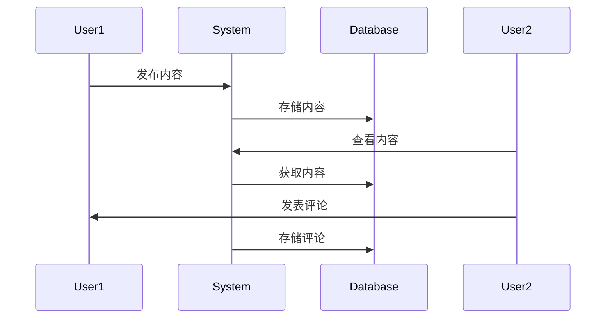

                 

### 引言：科技发展的背景与人生意义

在21世纪，科技发展以惊人的速度推进，深刻地影响着我们的生活方式、社会结构乃至人类价值观。从计算机到人工智能，从互联网到物联网，科技的发展不仅改变了我们的工作方式，还塑造了我们的思维方式。本文将探讨科技发展对人生意义的冲击与启示，通过逐步分析，深入挖掘科技在当今社会中所扮演的角色。

首先，我们需要了解科技发展的背景。科技的迅猛发展是当今时代的显著特征之一。自工业革命以来，科技进步一直是推动社会变革的主要动力。20世纪中叶，计算机科学的崛起开启了数字化时代的大门，互联网的普及更是将人类带入了信息社会。而今，人工智能、大数据、量子计算等新兴技术正在以前所未有的速度发展，不断地突破技术瓶颈，拓展科技的应用领域。

在科技迅猛发展的背景下，社会结构也发生了深刻的变化。科技的进步带来了新的经济模式、工作方式和社会组织形式。例如，互联网的普及使得全球化的步伐加快，人们可以通过网络跨越地域限制进行交流与合作。而人工智能的应用则改变了传统的劳动力市场，一些高薪职位被机器人取代，同时也创造了新的就业机会。这些变化不仅影响了经济结构，还对社会的稳定性和和谐性提出了新的挑战。

然而，科技发展对人类价值观的冲击同样不可忽视。在传统社会中，人际关系和社交互动主要依赖于面对面的交流，而随着科技的发展，数字化的沟通方式变得越来越普遍。这种变化对人际关系产生了深远的影响。一方面，互联网和社交媒体为人们提供了更广阔的社交平台，使得人们可以与世界各地的人建立联系。另一方面，过度依赖虚拟沟通可能导致真实人际关系的疏远和情感的淡漠。

在这个充满变数和不确定性的时代，科技发展带来了前所未有的挑战，也为我们提供了无限的机遇。本文将分章节详细探讨科技对人生意义的冲击，包括价值观的挑战、社会结构的变化以及个人生活的冲击。同时，我们还将深入探讨科技发展下的伦理困境，以及科技与人类精神世界的互动。通过这些探讨，我们希望能够为读者提供对科技发展的深刻见解和应对策略，帮助我们在科技浪潮中找到人生的意义和方向。

### 目录大纲设计

为了系统地分析《科技发展对人生意义的冲击与启示》这一主题，我们需要设计一个详细且逻辑清晰的目录大纲。以下是一个详细的目录大纲设计，涵盖了文章的核心内容，旨在引导读者逐步深入理解科技发展的各个方面。

```
----------------------------------------------------------------
# 引言：科技发展的背景与人生意义

## 1. 科技发展的背景
### 1.1 科技的迅猛发展
### 1.2 科技对社会的影响
### 1.3 科技发展的趋势与未来

## 2. 科技对人生意义的冲击
### 2.1 人类价值观的挑战
### 2.2 社会结构的变化
### 2.3 个人生活的冲击

## 3. 科技发展下的伦理困境
### 3.1 人工智能与隐私权
### 3.2 科技与劳动市场
### 3.3 科技与自然环境

## 4. 深入探讨：科技与人类精神世界的互动
### 4.1 数字化时代的思考方式
### 4.2 网络社交对人际关系的影响
### 4.3 科技对人类创造力的激发与挑战

## 5. 启示与展望
### 5.1 应对科技冲击的策略
### 5.2 重塑人生意义的途径
### 5.3 科技发展的可持续性

## 6. 个人成长与科技
### 6.1 提升自我认知的能力
### 6.2 培养适应科技变化的心态
### 6.3 实现个人与科技的和谐共处

## 7. 社会责任与科技发展
### 7.1 企业在科技发展中的角色
### 7.2 政府与科技发展的关系
### 7.3 公众参与与科技发展的未来

## 8. 结论：科技与人生意义的平衡
### 8.1 科技发展的必要性与限制
### 8.2 追求人生意义的多样性
### 8.3 促进科技与人生意义的和谐发展

----------------------------------------------------------------
```

在这个目录大纲中，每章节都明确标注了小节，以确保内容安排合理，条理清晰。以下是对各章节的简要说明：

**第1章 科技发展的背景**

- **第1.1节 科技的迅猛发展**：回顾科技发展的历史，探讨科技进步的关键节点和主要领域。
- **第1.2节 科技对社会的影响**：分析科技对社会结构、文化、经济的影响，展示科技对现代社会的重要作用。
- **第1.3节 科技发展的趋势与未来**：通过算法和预测模型，探讨科技发展的未来趋势和可能的影响。

**第2章 科技对人生意义的冲击**

- **第2.1节 人类价值观的挑战**：讨论科技如何挑战传统的价值观，分析科技带来的伦理困境。
- **第2.2节 社会结构的变化**：分析科技对社会结构的影响，包括经济、政治和文化等方面的变化。
- **第2.3节 个人生活的冲击**：探讨科技如何改变个人生活，包括工作方式、社交方式和生活习惯。

**第3章 科技发展下的伦理困境**

- **第3.1节 人工智能与隐私权**：分析人工智能技术在隐私权保护中的应用和挑战。
- **第3.2节 科技与劳动市场**：探讨科技对劳动市场的影响，包括就业结构变化和劳动力市场需求。
- **第3.3节 科技与自然环境**：分析科技对自然环境的影响，探讨可持续发展的路径。

**第4章 深入探讨：科技与人类精神世界的互动**

- **第4.1节 数字化时代的思考方式**：探讨数字化时代人类思考方式的变化，分析其对个人和社会的影响。
- **第4.2节 网络社交对人际关系的影响**：分析网络社交对人际关系的影响，探讨其积极和消极的方面。
- **第4.3节 科技对人类创造力的激发与挑战**：探讨科技如何激发和挑战人类的创造力，提出应对策略。

**第5章 启示与展望**

- **第5.1节 应对科技冲击的策略**：提供应对科技冲击的策略和方法。
- **第5.2节 重塑人生意义的途径**：探讨如何通过科技重塑人生意义，寻找新的生活目标和价值观。
- **第5.3节 科技发展的可持续性**：探讨科技发展的可持续性，强调在追求科技进步的同时保护环境和人类福祉。

**第6章 个人成长与科技**

- **第6.1节 提升自我认知的能力**：讨论如何通过科技提升自我认知，实现个人成长。
- **第6.2节 培养适应科技变化的心态**：探讨如何培养适应科技变化的心态，应对未来的挑战。
- **第6.3节 实现个人与科技的和谐共处**：讨论个人如何与科技和谐共处，实现最佳发展。

**第7章 社会责任与科技发展**

- **第7.1节 企业在科技发展中的角色**：分析企业在科技发展中的责任和作用，探讨如何通过企业行为推动科技进步。
- **第7.2节 政府与科技发展的关系**：讨论政府在科技发展中的角色，分析政策对科技发展的影响。
- **第7.3节 公众参与与科技发展的未来**：探讨公众参与在科技发展中的重要性，讨论如何促进公众对科技的积极参与。

**第8章 结论：科技与人生意义的平衡**

- **第8.1节 科技发展的必要性与限制**：总结科技发展的必要性和限制，强调在追求科技进步的同时保持理性。
- **第8.2节 追求人生意义的多样性**：探讨如何在科技发展的大背景下追求多样的人生意义。
- **第8.3节 促进科技与人生意义的和谐发展**：提出促进科技与人生意义和谐发展的策略和方法。

通过这个详细的目录大纲，我们希望能够系统地探讨科技发展对人生意义的冲击与启示，为读者提供深刻的见解和实用的策略。每个章节都经过精心设计，旨在引导读者逐步深入理解这一复杂而重要的话题。

### 第1章 科技发展的背景

#### 第1.1节 科技的迅猛发展

科技的迅猛发展是21世纪最显著的标志之一。回顾历史，科技进步一直是推动社会变革的重要力量。从蒸汽机的发明到电力的广泛应用，从计算机的诞生到互联网的普及，每一次科技的飞跃都极大地改变了人类的生活方式和社会结构。然而，真正令人瞩目的大规模科技突破始于20世纪中叶，特别是计算机科学的兴起。

计算机科学的发展可以追溯到20世纪40年代，当时第一台电子计算机ENIAC（电子数值积分计算机）的问世标志着计算机时代的到来。计算机的出现不仅极大地提高了人类处理数据和信息的效率，还为科学研究和工业生产提供了强大的工具。随着时间的发展，计算机技术经历了数次重大变革，从大型主机到个人电脑，再到今天的超级计算机和云计算平台，每一次进步都推动了科技的快速发展。

互联网的普及是20世纪末科技发展的另一个重要里程碑。20世纪60年代，美国国防高级研究计划局（DARPA）发起的ARPANET项目为互联网的诞生奠定了基础。随着时间的发展，ARPANET逐渐演变为今天的互联网，它使得全球范围内的信息交换和沟通成为可能。互联网的普及不仅改变了人们的沟通方式，还推动了电子商务、在线教育、远程工作等新兴行业的发展，深刻地影响了全球经济和社会结构。

进入21世纪，科技的进步更是日新月异。人工智能（AI）的崛起是科技发展的最新成果之一。人工智能通过模拟人类智能的机器学习算法和深度学习模型，已经在图像识别、自然语言处理、自动驾驶等领域取得了重大突破。人工智能的应用不仅提升了生产效率，还在医疗、金融、教育等多个领域展示了其巨大的潜力，成为推动社会进步的重要力量。

除了人工智能，量子计算、区块链、物联网等新兴技术也在快速发展，为未来的科技发展提供了无限可能。量子计算利用量子力学原理，有望解决传统计算机无法处理的复杂问题，从而推动科学研究和工业生产进入新的阶段。区块链技术通过去中心化的方式实现数据的安全存储和传输，为金融交易、供应链管理等领域带来了新的解决方案。物联网（IoT）则通过连接各种智能设备和系统，实现了数据的实时收集和分析，为智能城市、智慧农业等领域的发展提供了技术支持。

在科技的迅猛发展过程中，不仅技术本身取得了巨大的进步，科研方法和工具也得到了显著的改进。高性能计算、大数据分析、机器学习算法等新工具的应用，使得科研工作更加高效和精确。例如，通过大数据分析，科学家们能够从海量数据中提取有价值的信息，从而推动科学研究的发展。而机器学习算法的应用，则使得计算机能够从数据中自动学习规律，从而提高预测和决策的准确性。

科技的迅猛发展不仅改变了我们的生活方式，还带来了许多新的挑战和问题。例如，人工智能的广泛应用可能对劳动力市场产生重大影响，一些传统行业和职业可能会被自动化取代，从而引发就业和社会稳定性的问题。此外，互联网的普及也带来了隐私泄露、网络安全等新的挑战，需要我们采取措施加以应对。

总的来说，科技的迅猛发展是21世纪的重要特征之一，它不仅推动了社会进步，还带来了新的机遇和挑战。在科技发展的过程中，我们需要不断调整自己的思维方式和行为模式，以适应不断变化的环境。同时，我们也需要关注科技发展带来的潜在风险和问题，采取有效措施确保科技发展的可持续性和安全性。

#### 第1.2节 科技对社会的影响

科技的迅猛发展对社会产生了深远的影响，涵盖了经济、政治、文化等多个方面。首先，科技对经济的影响是显而易见的。科技的发展推动了生产力的提升，使得生产过程更加高效和精确。例如，自动化生产线和智能制造技术的应用，极大地提高了生产效率，降低了生产成本。同时，互联网和电子商务的兴起，改变了传统的商业模式，为中小企业提供了更多的市场机会，促进了经济的全球化。

在劳动力市场方面，科技的发展带来了显著的变化。一方面，一些传统职业和行业因为自动化和人工智能的普及而面临失业的风险，例如工厂流水线工人、司机等。另一方面，科技的发展也创造了新的就业机会，如数据分析师、人工智能工程师、网络安全专家等。这种劳动力市场的变化，要求劳动者具备更高的技能和知识，从而推动了教育和培训的发展。

政治方面，科技的发展对政府的治理模式和决策过程产生了重要影响。互联网的普及使得信息传播更加迅速和广泛，公众更容易获得信息和表达意见，从而增强了社会的透明度和公众参与度。同时，大数据技术的应用为政府提供了更精确的数据支持，使得政策制定和执行更加科学和有效。然而，科技的发展也带来了隐私保护和信息安全等新问题，需要政府制定相应的法律法规进行管理。

文化方面，科技的发展改变了人们的思维方式和文化消费方式。互联网和社交媒体的兴起，使得文化产品的传播速度和范围大大增加，人们可以随时随地获取和分享文化内容。这种文化消费方式的改变，不仅丰富了人们的精神世界，还推动了文化创意产业的发展。然而，过度依赖虚拟世界也可能导致现实人际关系的疏远和文化的同质化。

在教育领域，科技的发展为教育模式带来了深刻的变革。在线教育、远程教育等新兴教育形式，使得教育资源的分配更加公平，更多的人有机会接受高质量的教育。同时，科技的发展也促进了教育技术的创新，例如虚拟现实（VR）和增强现实（AR）技术，为教育提供了更加生动和互动的学习体验。

此外，科技的发展还对社会的稳定性和和谐性产生了影响。一方面，科技的发展带来了经济的繁荣和社会进步，增强了社会的稳定性。另一方面，科技的发展也带来了新的社会问题和挑战，如隐私泄露、网络安全等，这些问题需要社会共同面对和解决，以维护社会的和谐与稳定。

总的来说，科技对社会的影响是多方面和深远的。它不仅改变了经济模式、劳动市场和社会组织形式，还对政治、文化、教育等方面产生了重要影响。在科技不断发展的今天，我们需要密切关注科技对社会的影响，积极应对其带来的挑战，同时发挥科技的积极作用，推动社会的全面进步。

#### 第1.3节 科技发展的趋势与未来

科技的迅猛发展不仅改变了我们的生活方式，还在不断地塑造未来的发展方向。通过分析当前科技发展的趋势，我们可以预见未来科技的发展方向及其可能带来的影响。

首先，人工智能（AI）是未来科技发展的重要趋势之一。随着深度学习和大数据技术的发展，人工智能的应用已经从简单的任务处理扩展到复杂的决策支持和创新领域。例如，自动驾驶技术通过计算机视觉和传感器数据处理，正在逐步实现无人驾驶的普及；在医疗领域，人工智能可以用于疾病诊断、药物研发和个性化治疗。未来，人工智能将进一步深入到各个行业，提高生产效率和服务质量。

其次，量子计算是另一个具有巨大潜力的科技前沿。量子计算利用量子力学原理，能够在特定任务上实现比传统计算机更快的计算速度。尽管目前量子计算还处于初步发展阶段，但已经显示出在优化问题、加密技术和材料科学等领域的巨大应用潜力。未来，量子计算有望解决传统计算机无法处理的复杂问题，从而推动科学研究和技术创新进入新的阶段。

区块链技术也是未来科技发展的重要方向之一。区块链通过去中心化的方式，实现了数据的安全存储和透明传输，被广泛应用于金融交易、供应链管理和身份认证等领域。未来，区块链技术有望进一步优化业务流程，提高数据安全和透明度，推动各行各业的数字化转型。

此外，物联网（IoT）的发展将使得越来越多的设备互联互通，实现智能化的生活和工作环境。智能家居、智能交通、智能医疗等领域的应用，将极大地提高生活质量和效率。随着5G网络的普及，物联网设备的数据传输速度和稳定性将得到显著提升，进一步推动物联网技术的发展。

在生物技术领域，基因编辑技术如CRISPR-Cas9的突破，使得科学家可以在细胞层面上进行精确的基因修改。这一技术的应用将不仅限于医学领域，还可能对农业、环境保护等领域产生深远影响。未来，通过基因编辑和合成生物学的结合，人类将能够创造出更加高效、健康的生物体系。

最后，虚拟现实（VR）和增强现实（AR）技术的快速发展，将改变人们的娱乐、教育和工作方式。通过沉浸式的体验，虚拟现实和增强现实技术为用户提供了全新的互动方式，为教育、游戏、设计等行业带来了新的机遇。

在探讨科技发展的未来趋势时，我们也需要考虑其潜在的影响。一方面，科技的进步将为社会带来更多的机会和福利，提高生产效率和生活质量。另一方面，科技的发展也带来了新的挑战和风险，如隐私保护、数据安全、就业问题等。因此，我们需要在推动科技发展的同时，制定相应的政策和措施，确保科技的可持续性和安全性。

总的来说，未来科技发展的趋势是多方面和多样化的。从人工智能到量子计算，从物联网到生物技术，每一个领域都充满了巨大的潜力。在未来的科技浪潮中，我们需要保持开放的心态，积极应对挑战，发挥科技的积极作用，推动社会进步和人类福祉的提升。

### 第2章 科技对人生意义的冲击

#### 第2.1节 人类价值观的挑战

随着科技的迅猛发展，人类价值观正面临着前所未有的挑战。首先，科技的发展改变了人类对时间、空间和信息的认知，这种改变直接影响了人们的价值观。在传统社会中，人与人之间的互动主要依赖于面对面的交流，时间的意义在于它的有限性和不可逆性。然而，随着互联网和移动通信技术的发展，人们的交流方式变得更加便捷和即时，时空的界限变得模糊。这种变化使得人们对时间的观念发生了变化，人们开始更加注重效率和即时性，而传统的时间观念和价值观逐渐受到冲击。

其次，科技的发展也对人类对隐私的看法产生了深远的影响。在互联网时代，人们的数据和行为轨迹被大量记录和追踪，隐私权变得前所未有的脆弱。尽管现代科技提供了便捷的数据处理和共享方式，但这也带来了隐私泄露和信息安全的风险。例如，社交媒体上的个人信息可能被滥用，网络诈骗和数据盗窃等现象屡见不鲜。这种对隐私的威胁引发了人们对于隐私权的重新思考，挑战了人们对隐私的固有观念。

另外，科技的发展也改变了人类的社交方式。虚拟社交平台如微信、Facebook等，使得人们可以轻松地与世界各地的人建立联系。然而，过度依赖虚拟社交也可能导致真实人际关系的疏远和情感的淡漠。人们在虚拟世界中建立的关系，往往缺乏真实互动中的深度和真实性。这种社交方式的变化，使得人们对于人际关系和情感的价值观也发生了改变。

此外，科技的发展还带来了对传统职业和生活方式的冲击。人工智能和自动化技术的应用，使得一些传统职业面临被取代的风险。例如，制造业中的流水线工人、物流行业中的司机等职业，正在逐步被机器人替代。这种职业变化不仅影响了人们的就业机会，还挑战了人们对工作价值的传统理解。人们需要重新思考工作与生活的关系，以及如何在科技变革中找到新的职业定位和人生价值。

在伦理层面，科技的发展也引发了新的道德和伦理困境。例如，人工智能的应用可能带来伦理问题，如机器的决策是否公正、数据的隐私保护等。这些问题不仅需要科技领域的解决，还需要社会和政府层面的共同努力，制定相应的伦理规范和法律框架。

总的来说，科技的发展给人类价值观带来了深刻的挑战。它改变了人们对时间、隐私和社交方式的理解，同时也挑战了传统的工作和生活观念。在应对这些挑战时，我们需要保持开放和批判性的思维，重新审视和调整我们的价值观，以适应科技变革带来的新环境。只有这样，我们才能在科技发展的浪潮中找到新的平衡点，实现个人和社会的可持续发展。

#### 第2.2节 社会结构的变化

科技的迅猛发展不仅对人类价值观产生了深远影响，同时也对社会结构带来了巨大变革。首先，经济结构的变化是科技发展带来的最显著影响之一。随着人工智能、自动化和机器人技术的应用，传统的劳动密集型产业正逐步被高效、低成本的自动化生产所取代。这种经济模式的转变，不仅提高了生产效率，还推动了新兴产业的兴起。例如，互联网经济的蓬勃发展，催生了电子商务、在线服务、数字内容创作等新兴产业，为经济增长注入了新的活力。

在劳动力市场方面，科技的发展带来了显著的变化。一方面，自动化和人工智能的应用导致了一些传统职业的消失，如制造业中的流水线工人、运输业中的司机等。另一方面，这些技术也创造了新的就业机会，例如数据分析师、人工智能工程师、软件开发者等。这种劳动力市场结构的变化，要求劳动者不断更新知识和技能，以适应新技术的要求。同时，这也带来了教育体系的变革，职业教育和终身学习成为提升个人竞争力的关键。

政治结构方面，科技的发展也对政府治理模式产生了深远影响。互联网和大数据技术的普及，使得信息传播更加迅速和广泛，公众更容易获取信息和参与政治讨论。这种信息透明度的提高，增强了社会的民主性和公众参与度。例如，电子民主和在线投票等新兴政治形式，正在逐步改变传统的政治决策过程。然而，这也带来了新的挑战，如网络政治宣传、虚假信息和网络安全等，需要政府和社会共同努力解决。

文化层面，科技的发展改变了人们的文化消费和传播方式。互联网和社交媒体的兴起，使得文化产品的传播速度和范围大大增加，人们可以随时随地获取和分享文化内容。这种文化消费方式的改变，不仅丰富了人们的精神世界，还推动了文化创意产业的发展。例如，在线游戏、网络文学和流媒体平台的兴起，为文化创作和传播提供了新的平台。然而，过度依赖虚拟世界也可能导致现实人际关系的疏远和文化同质化，需要人们保持批判性和独立性。

社会结构的变化还体现在家庭和社区关系上。科技的发展使得人们的生活节奏加快，家庭和社区关系的维系变得更加困难。例如，远程工作和在线教育的普及，使得家庭成员之间的互动变得更加稀疏，邻里之间的联系也变得更加薄弱。这种社会结构的变化，对人们的心理健康和社会稳定性提出了新的挑战，需要社会各界的共同努力来应对。

总的来说，科技的发展对社会结构带来了深刻的变化，包括经济结构、劳动力市场、政治结构、文化消费和社区关系等各个方面。这些变化不仅带来了新的机遇，也带来了新的挑战。在科技不断发展的今天，我们需要不断适应和调整社会结构，以实现社会的可持续发展。

#### 第2.3节 个人生活的冲击

科技的迅猛发展对个人生活产生了深远的影响，这种影响不仅体现在生活方式的改变，还涉及心理健康和社会交往等多个方面。

首先，科技对个人生活方式的改变是显而易见的。互联网和智能手机的普及，使得人们可以随时随地获取信息、进行娱乐和社交。例如，在线购物改变了传统的购物方式，使得购物变得更加便捷和高效。远程工作和在线教育的发展，使得人们可以在家中完成工作或学习任务，节省了通勤时间和交通成本。然而，这种生活方式的改变也带来了一些负面影响。例如，长时间的沉迷于互联网和社交媒体，可能导致个人时间管理和生活节奏的紊乱，影响身心健康。

其次，科技对个人心理健康的影响也是一个值得关注的问题。互联网和社交媒体虽然为人们提供了交流的平台，但也可能导致心理健康问题。例如，过度依赖虚拟社交可能导致现实人际关系的疏远和孤独感的增加。网络上的负面信息和谣言，也可能对个人的心理产生负面影响。此外，科技的发展使得信息过载成为普遍现象，人们常常感到被信息淹没，难以有效处理和利用这些信息，从而增加了焦虑和压力。

社会交往方面，科技的发展改变了人们的社交方式。虽然互联网和社交媒体使得人们可以更容易地建立和维持社交关系，但也带来了一些挑战。例如，虚拟社交往往缺乏真实的面对面交流，可能导致人际关系的表面化和浅薄化。此外，过度依赖虚拟社交可能导致现实生活中的社交技能退化，影响个人的社交能力和情感表达。

此外，科技的发展也对家庭关系产生了影响。家庭成员之间的互动变得更加虚拟，现实生活中的交流和互动时间减少。例如，家庭成员各自沉迷于智能手机和电脑，导致家庭氛围的疏离。远程工作的普及，虽然使得家庭成员有更多的时间相处，但也可能因为工作压力和工作时间的重叠，导致家庭冲突的增加。

最后，科技的发展还带来了对个人隐私的保护问题。随着互联网和大数据技术的普及，个人隐私信息变得越来越容易被获取和滥用。网络诈骗、个人信息泄露等问题屡见不鲜，对个人的安全和隐私构成了严重威胁。因此，个人在享受科技带来便利的同时，也需要提高对隐私保护的意识，采取相应的措施保护自己的隐私。

总的来说，科技的发展对个人生活产生了多方面的影响，包括生活方式、心理健康、社会交往和隐私保护等。在享受科技带来的便利和舒适的同时，个人也需要关注这些负面影响，采取有效的措施应对科技带来的挑战，实现个人生活的平衡和健康。

### 第3章 科技发展下的伦理困境

科技的迅猛发展在带来便利和进步的同时，也引发了一系列伦理困境。这些困境不仅涉及个人隐私的保护，还涵盖了科技对劳动市场和自然环境的影响。在本节中，我们将深入探讨这些伦理困境，分析其背后的原因和可能的解决策略。

#### 第3.1节 人工智能与隐私权

人工智能技术的发展，使得数据处理和分析变得更加高效，但也引发了对个人隐私权的担忧。人工智能系统往往依赖于大量个人数据，这些数据可能包括地理位置、搜索历史、通信记录等敏感信息。一旦这些数据被滥用或泄露，个人隐私将受到严重威胁。例如，社交媒体平台可能会利用用户的数据进行精准广告投放，而黑客攻击也可能导致个人隐私信息被窃取。

**原因分析：**
1. **数据量的增加**：随着物联网和智能手机的普及，个人数据量急剧增加，使得隐私泄露的风险上升。
2. **数据使用的复杂性**：人工智能系统需要大量数据来训练和优化模型，这使得数据的处理和使用变得更加复杂，增加了隐私泄露的可能性。
3. **法律和监管的不足**：现有的隐私法律和监管措施可能无法完全应对人工智能时代的新挑战，导致隐私保护力度不足。

**解决策略：**
1. **加强数据保护法律**：制定更加严格的数据保护法律，确保个人数据在使用过程中的安全和隐私。
2. **透明化数据使用**：提高人工智能系统在数据处理和使用过程中的透明度，让用户能够了解自己的数据如何被使用。
3. **加密技术**：使用先进的加密技术保护个人数据，防止数据在传输和存储过程中的泄露。

#### 第3.2节 科技与劳动市场

科技的发展对劳动市场产生了深远影响，一方面创造了新的就业机会，另一方面也导致了一些传统职业的消失。人工智能和自动化技术的普及，使得许多重复性和低技能的工作可以被机器人取代。这导致了一部分劳动力失业，同时也引发了关于人类工作价值和意义的讨论。

**原因分析：**
1. **技术进步**：随着人工智能和自动化技术的进步，机器能够执行越来越复杂的任务，使得一些传统职业变得不再必要。
2. **经济结构变化**：随着互联网经济的兴起，新兴行业迅速发展，而传统行业逐渐衰退，导致就业机会的重新分配。
3. **教育与培训的滞后**：现有教育体系可能无法及时适应技术变革，导致劳动力无法迅速掌握新技术，从而难以适应新的就业市场。

**解决策略：**
1. **终身教育**：推广终身教育理念，提高劳动者的技能和知识水平，使他们能够适应技术变革。
2. **就业转型支持**：政府和企业应该提供就业转型支持，帮助失业人员重新就业，或鼓励他们转向新兴行业。
3. **政策引导**：通过政策引导，促进新兴行业的发展，创造更多的就业机会。

#### 第3.3节 科技与自然环境

科技的发展在带来经济和便利的同时，也对自然环境产生了负面影响。例如，数据中心的高能耗、电子废弃物的处理以及工业生产过程中的污染物排放，都对环境造成了严重的影响。此外，气候变化和生物多样性的减少也与科技发展密切相关。

**原因分析：**
1. **资源消耗**：科技发展需要大量的能源和原材料，这导致了资源的过度消耗和环境的破坏。
2. **废物处理**：电子产品的更新换代产生了大量的电子废弃物，这些废弃物的处理和回收面临着巨大的挑战。
3. **环境污染**：工业生产和数据中心的高能耗，导致了大量的温室气体排放和其他污染物，对环境造成了严重影响。

**解决策略：**
1. **可持续技术**：研发和推广可持续技术，如可再生能源、绿色制造和环保材料，减少对环境的负面影响。
2. **废物回收与再利用**：加强电子废弃物的回收和再利用，减少废弃物的环境负担。
3. **环境保护政策**：制定和实施严格的环境保护政策，限制污染排放，促进环境友好型技术的发展和应用。

总的来说，科技发展带来的伦理困境需要我们从多方面进行思考和解决。通过加强法律保护、提升教育水平、推广可持续技术和制定环境保护政策，我们可以更好地应对这些困境，实现科技与人类社会的和谐共处。

### 第4章 深入探讨：科技与人类精神世界的互动

在科技迅猛发展的今天，科技不仅改变了我们的物质世界，还深刻地影响了人类的精神世界。数字化时代的思考方式、网络社交对人际关系的影响以及科技对人类创造力的激发与挑战，都是值得我们深入探讨的重要话题。

#### 第4.1节 数字化时代的思考方式

数字化时代带来了思维方式的深刻变革。互联网和智能手机的普及，使得信息获取变得前所未有的便捷。然而，这也导致了信息过载的问题。在数字化环境中，人们常常需要快速处理大量的信息，这种快节奏的思考方式对传统的深度思考和长期记忆提出了挑战。

**数学模型和公式：**
为了应对信息过载，我们可以使用信息熵的概念来描述信息的组织和处理过程。信息熵是一个衡量信息不确定性的量，用于描述一个事件在概率分布中的不确定性。在数字化环境中，高信息熵意味着信息量大且不确定性强，这对人类的认知和处理能力提出了挑战。

**举例说明：**
假设一个博客文章包含了N个不同的主题，每个主题出现的概率为P_i。文章的总信息熵可以用以下公式计算：

$$H = -\sum_{i=1}^{N} P_i \log_2 P_i$$

当所有主题的概率相等时，信息熵达到最大值。这表明，当文章内容分散且无序时，人类的阅读和理解难度最大。为了提高信息处理效率，我们可以通过信息筛选和分类来降低信息熵，使得信息更加有序和结构化。

#### 第4.2节 网络社交对人际关系的影响

网络社交平台如微信、Facebook和Instagram等，极大地改变了人们的社交方式。网络社交使得人们可以跨越时空的限制，轻松地与世界各地的人建立联系。然而，这也带来了一些负面影响，如社交疏离、依赖虚拟世界和隐私问题等。

**系统功能设计（领域模型Mermaid类图）：**
```mermaid
classDiagram
  User --> Post
  User --> Friend
  Post --> Comment
  Friend [Name]
  User [Name, Age]
  Post [Title, Content]
  Comment [Content, Author]
```
在这个类图中，`User`表示用户，`Friend`表示用户之间的朋友关系，`Post`表示用户发布的内容，`Comment`表示对内容的评论。

**系统架构设计Mermaid架构图：**

这个架构图展示了用户如何发布内容、系统如何存储和检索内容，以及用户如何互动和评论的流程。

**实际案例分析和详细讲解剖析：**
以微信为例，微信作为中国最流行的社交平台之一，具有即时通讯、朋友圈、公众号等功能。这些功能使得用户可以方便地与他人沟通和分享信息。然而，过度使用微信也可能导致社交疏离。研究表明，长时间使用微信等社交平台，可能导致现实人际关系的疏远和孤独感的增加。因此，在享受科技带来的便利的同时，我们也需要关注这些负面影响，保持现实社交和虚拟社交的平衡。

#### 第4.3节 科技对人类创造力的激发与挑战

科技的发展不仅改变了人们的思考方式和社交方式，还对人类的创造力产生了深远影响。一方面，科技为人类提供了丰富的工具和资源，激发了人们的创造力。例如，计算机软件和在线协作平台使得创意工作变得更加高效和多样化。另一方面，科技也可能限制创造力，例如过度依赖科技工具可能导致思维方式的单一化和创造力下降。

**算法原理讲解：**
为了激发和提升创造力，我们可以使用思维导图和算法生成等工具。思维导图是一种图形化的思考工具，通过视觉方式组织思想，有助于扩展思维和激发创意。算法生成则是通过计算机算法生成新的创意和设计，从而打破人类的思维定势。

**举例说明：**
以音乐创作为例，可以使用算法生成音乐。通过设定音乐的基本参数和风格，算法可以生成多种不同的音乐片段，供音乐家选择和修改。这种方法不仅节省了创作时间，还提供了更多的创作灵感。

总的来说，科技在激发人类创造力的同时，也带来了挑战。我们需要在享受科技带来的便利和创新的同时，保持批判性和创造性思维，以应对科技发展带来的新变化。

### 第5章 启示与展望

#### 第5.1节 应对科技冲击的策略

在面对科技发展带来的冲击时，我们需要采取一系列策略来适应和应对这些变化。以下是一些具体的建议：

**1. 终身学习与技能更新：** 科技发展迅速，知识更新换代快，劳动者需要不断更新自己的技能和知识，以适应新的技术环境。终身学习已成为不可或缺的一部分，企业和个人都应该重视教育和培训，提高自身的竞争力。

**2. 跨学科合作与创新能力：** 科技的发展是多领域的融合和交叉，跨学科的合作能够带来新的创新点和解决方案。政府、企业和学术界应加强合作，共同推动技术创新和产业升级。

**3. 社会参与与政策引导：** 政府和社会组织应积极参与科技发展的讨论和决策，制定合理的政策和法规，保障科技发展的可持续性和社会公正。

#### 第5.2节 重塑人生意义的途径

科技发展不仅改变了我们的生活方式，也对人生意义的认知提出了新的挑战。为了在科技时代找到新的生活意义，我们可以从以下几个方面进行探索：

**1. 深度体验与精神追求：** 在数字化时代，人们更容易迷失在虚拟世界中。因此，我们需要回归现实，通过深度体验和探索自然、文化、艺术等领域的丰富内涵，寻找内心的宁静和满足。

**2. 社会贡献与人际互动：** 社会贡献和人际互动是人生意义的重要体现。通过参与社会公益活动、志愿服务，以及与家人、朋友建立深厚的情感联系，我们可以在科技发展的背景下，实现自我价值和人际关系的和谐。

**3. 精神成长与心灵养护：** 在科技主导的时代，心灵养护和自我成长变得尤为重要。通过冥想、瑜伽、阅读等方式，我们可以培养内心的平静和力量，提升精神层面的生活质量。

#### 第5.3节 科技发展的可持续性

科技发展的可持续性是保障未来社会健康发展的关键。为了实现科技的可持续发展，我们可以采取以下措施：

**1. 绿色技术与环保政策：** 推广绿色技术和环保理念，减少科技发展对自然环境的负面影响。政府和企业应制定和实施严格的环保政策，鼓励绿色创新和可持续发展。

**2. 人工智能伦理与隐私保护：** 在人工智能和大数据时代，伦理和隐私保护尤为重要。通过制定和执行伦理规范，确保人工智能的发展符合社会价值观和伦理标准。

**3. 数据治理与信息共享：** 加强数据治理，确保数据的安全、透明和可追溯性。同时，促进信息的共享和开放，提高科技发展的效率和透明度。

总的来说，科技发展带来了巨大的机遇和挑战。通过应对策略的制定、人生意义的重塑和可持续发展的实现，我们可以在科技发展的浪潮中找到平衡点，推动社会的全面进步和人类福祉的提升。

### 第6章 个人成长与科技

在科技迅猛发展的时代，个人成长与科技紧密相连。为了在科技变革中不断提升自我，实现个人与科技的和谐共处，我们需要从以下几个方面入手：

#### 第6.1节 提升自我认知的能力

自我认知是个人成长的基础。在科技的帮助下，我们可以更有效地提升自我认知的能力。

**1. 数据分析与自我评估：** 利用大数据和人工智能技术，我们可以对自己的行为模式、兴趣爱好、职业倾向等进行深入分析。例如，通过分析社交媒体的使用习惯，了解自己的社交偏好和互动方式。

**2. 心理测评工具：** 心理测评工具如性格测试、情商测试等，可以帮助我们更全面地了解自己的心理特点。这些工具通常基于科学的心理理论，能够提供有价值的自我认知信息。

**3. 反思与自我反馈：** 定期进行反思和自我反馈，可以帮助我们认识到自己的优点和不足，从而制定更有效的个人成长计划。

**案例分析与详细讲解剖析：**
例如，通过使用人工智能驱动的自我评估工具，我们可以获取关于时间管理、情绪状态、学习效率等方面的数据。这些数据不仅能帮助我们了解自己的现状，还能为我们提供个性化的改进建议。

#### 第6.2节 培养适应科技变化的心态

适应科技变化是个人成长的重要一环。以下是一些具体的方法：

**1. 保持好奇心与开放性：** 科技发展日新月异，保持好奇心和开放性，能够帮助我们跟上时代的步伐。对新科技保持兴趣，尝试新的工具和平台，有助于拓宽我们的视野。

**2. 持续学习与自我提升：** 通过终身学习和自我提升，我们可以不断更新知识和技能，适应科技变化带来的新挑战。例如，通过在线课程、研讨会和读书会等途径，不断学习和吸收新知识。

**3. 调整心态，积极应对：** 面对科技变化，我们需要调整心态，积极应对。例如，当面对新的技术挑战时，我们可以将其视为学习和成长的机会，而非威胁。

**最佳实践 tips：**
- **定期规划学习路径：** 制定明确的个人学习计划，并按照计划进行学习，确保知识的系统性和连续性。
- **利用科技工具：** 利用科技工具如在线学习平台、人工智能辅导等，提高学习效率和效果。

#### 第6.3节 实现个人与科技的和谐共处

实现个人与科技的和谐共处，是个人成长的重要目标。以下是一些建议：

**1. 科技工具的合理使用：** 科学合理地使用科技工具，避免沉迷和依赖。例如，设定固定的互联网使用时间，保持良好的作息习惯。

**2. 平衡虚拟与真实：** 在享受科技带来的便利的同时，保持与现实世界的联系。定期参加社交活动、户外运动等，增强现实人际互动。

**3. 自我调节与心理调适：** 在面对科技带来的压力和挑战时，进行有效的自我调节和心理调适。例如，通过冥想、瑜伽等方式，缓解压力和焦虑。

**注意事项：**
- **隐私保护：** 在使用科技工具时，注意保护个人隐私，避免泄露敏感信息。
- **信息安全：** 注意信息安全，防止数据泄露和网络攻击。

**拓展阅读：**
- 《科技人类学：从人与科技的关系看人类发展》
- 《深度学习：人工智能的商业应用》
- 《未来简史：从人类到智械时代》

通过提升自我认知、培养适应科技变化的心态以及实现个人与科技的和谐共处，我们可以在科技发展的浪潮中找到自己的定位，实现个人成长和全面发展。

### 第7章 社会责任与科技发展

#### 第7.1节 企业在科技发展中的角色

企业在科技发展中扮演着至关重要的角色，既是科技创新的推动者，也是社会责任的承担者。企业的技术创新不仅推动了社会的进步，也在很大程度上影响着人们的日常生活。为了确保科技发展的可持续性和社会公正，企业需要在其发展中积极履行社会责任。

**企业社会责任的内涵：**
企业社会责任（Corporate Social Responsibility，简称CSR）指的是企业在追求经济利益的同时，关注社会和环境问题，通过一系列负责任的商业行为，实现经济、社会和环境效益的协调发展。在科技发展中，企业社会责任主要体现在以下几个方面：

1. **环境保护：** 企业需要在其生产和运营过程中，采取环保措施，减少对自然环境的破坏。例如，采用清洁能源、推行绿色制造、减少废弃物排放等。
2. **社会责任：** 企业应当关注社会福祉，通过慈善捐助、公益项目等方式，支持社会公益活动，改善社会问题。
3. **技术创新：** 企业需要持续投入研发，推动科技创新，为社会提供更好的产品和服务，同时解决社会问题。

**企业在科技发展中的具体举措：**
1. **绿色科技研发：** 企业应加大对绿色科技的研发投入，推动能源效率提升、资源循环利用等技术的发展，以实现可持续发展目标。
2. **数据安全与隐私保护：** 在数字经济时代，数据安全和隐私保护尤为重要。企业需要建立完善的数据保护机制，防止数据泄露和滥用。
3. **员工培训与职业发展：** 企业应提供员工培训和发展机会，帮助员工提升技能，适应科技变革，同时促进员工的职业成长。

**案例分析：**
以苹果公司为例，苹果在科技发展中积极履行社会责任。苹果公司不仅在其产品设计中注重环保，使用可回收材料，还推出了“苹果回收计划”，鼓励用户回收旧设备。此外，苹果还投入大量资金用于公益项目，支持教育、环保和医疗等领域的发展。通过这些举措，苹果不仅提升了企业的品牌形象，也为社会的可持续发展做出了贡献。

#### 第7.2节 政府与科技发展的关系

政府在科技发展中发挥着重要的引导和调控作用。政府的政策制定和执行，对科技发展的方向和速度具有重要影响。为了推动科技发展的可持续性和社会公正，政府需要采取一系列有效措施。

**政府政策的重要性：**
1. **科研资金支持：** 政府应加大对科研的投入，为科技创新提供充足的资金支持。这包括基础研究、应用研究和产业化研究等各个层面。
2. **知识产权保护：** 政府需要建立完善的知识产权保护体系，保护企业和个人的创新成果，激发创新活力。
3. **教育体系改革：** 教育是科技发展的基石。政府应推动教育体系的改革，培养更多具备科技创新能力的专业人才。

**政府在科技发展中的具体措施：**
1. **创新政策支持：** 政府应制定和实施一系列创新政策，如税收优惠、研发补贴等，鼓励企业加大科研投入。
2. **基础设施建设：** 政府需要加大对科技基础设施的投入，如研发中心、实验室、数据中心等，为科技创新提供硬件支持。
3. **国际合作与交流：** 政府应积极推动国际科技合作与交流，吸引国际顶尖科研人才和项目，提升本国科技水平。

**案例分析：**
德国政府在科技发展中采取了多项有效措施。德国政府不仅提供了大量的科研资金支持，还建立了多个国家级科研机构和创新中心，为科技发展提供了坚实的基础。此外，德国政府还推动了多个国际科技合作项目，吸引了全球顶尖科研人才，提升了德国的科技竞争力。

#### 第7.3节 公众参与与科技发展的未来

公众参与在科技发展中具有重要地位。公众的参与不仅能够促进科技发展的透明度和公正性，还能为科技创新提供新的视角和灵感。为了实现公众参与与科技发展的良性互动，我们需要采取一系列措施。

**公众参与的重要性：**
1. **科技教育的普及：** 公众参与科技发展，需要具备一定的科技知识和素养。因此，科技教育普及至关重要。政府、企业和教育机构应共同努力，提升公众的科技素养。
2. **信息公开与透明：** 政府和企业应主动公开科技项目的信息，增加公众对科技发展的了解和参与。通过建立公开透明的信息平台，公众可以更好地监督和参与科技项目。
3. **科技民主：** 科技发展应遵循科技民主原则，让公众参与到科技决策过程中，确保科技发展符合公众的利益和期望。

**公众参与的具体措施：**
1. **科技论坛与研讨会：** 通过举办科技论坛和研讨会，邀请公众参与讨论科技发展的重要议题，促进公众对科技发展的理解和参与。
2. **科技展览与体验：** 举办科技展览和体验活动，让公众亲身体验科技的魅力，提高公众对科技的兴趣和参与度。
3. **公民科技项目：** 鼓励公众参与公民科技项目，如科技志愿服务、科技竞赛等，通过实际参与，提升公众的科技实践能力和创新能力。

**案例分析：**
以韩国为例，韩国政府积极推动公众参与科技发展。韩国政府通过举办科技展览、科技教育普及活动和公民科技项目，提高了公众的科技素养和参与度。此外，韩国政府还通过建立科技信息平台，公开科技项目的信息，增加了公众的监督和参与。这些措施不仅提升了韩国的科技水平，也增强了公众对科技发展的信心和参与热情。

总的来说，企业、政府与公众的互动是科技发展的重要环节。通过企业技术创新、政府政策引导和公众积极参与，我们可以实现科技发展的可持续性和社会公正，推动社会的全面进步和人类福祉的提升。

### 第8章 结论：科技与人生意义的平衡

#### 第8.1节 科技发展的必要性与限制

科技发展是现代社会进步的重要驱动力，它在提高生产效率、改善生活质量、推动经济繁荣等方面发挥了不可替代的作用。然而，科技发展也伴随着一系列限制和挑战，这些限制主要表现在以下几个方面：

1. **环境影响**：科技的快速发展带来了大量的能源消耗和资源浪费，加剧了环境污染和生态破坏。例如，电子废弃物的处理、数据中心的高能耗等问题都需要我们高度重视。

2. **社会公平**：科技的发展可能导致贫富差距的扩大和社会不平等的加剧。在某些地区，科技的发展可能带来巨大的经济利益，而在其他地区，却可能带来严重的经济和社会问题。

3. **伦理困境**：人工智能、基因编辑等新兴科技在带来巨大潜力同时，也引发了一系列伦理困境，如隐私保护、人工智能决策的公正性、科技滥用等。

为了解决这些限制，我们需要采取一系列措施。首先，推广可持续科技，减少对环境的负面影响。例如，发展可再生能源、推进绿色制造、实施环保法规等。其次，加强社会公平的保障，通过政策引导和教育提升全民的科技素养，确保科技发展惠及所有人。最后，建立伦理规范，确保科技的发展符合人类的价值观和道德标准。

#### 第8.2节 追求人生意义的多样性

在科技发展的背景下，追求人生意义的多样性变得尤为重要。科技虽然提供了丰富的工具和资源，但也可能导致人们价值观的单一化和生活节奏的快速化。为了在科技发展的浪潮中找到真正的幸福和满足，我们需要注重以下几个方面的多样性：

1. **文化多样性**：文化多样性是人类社会的重要组成部分，它为我们提供了丰富的精神资源。通过欣赏不同文化的艺术、文学和传统，我们可以拓宽视野，丰富内心世界。

2. **人际关系多样性**：人际关系多样性对于个人的心理健康和社会适应能力至关重要。我们需要在现实生活中建立和维持多样化的社交网络，避免过度依赖虚拟社交。

3. **职业发展多样性**：职业发展多样性不仅有助于提升个人的职业成就，还能带来丰富的生活体验。我们应该积极探索不同领域的职业机会，不断挑战自我，实现职业成长。

4. **生活方式多样性**：生活方式多样性意味着我们在生活中可以尝试不同的活动、旅行和体验。这种多样性不仅能够增加生活的乐趣，还能帮助我们更好地理解自己和世界。

#### 第8.3节 促进科技与人生意义的和谐发展

为了实现科技与人生意义的和谐发展，我们需要采取一系列策略，确保科技的发展不仅能够推动社会进步，还能够提升人类的生活质量。以下是一些建议：

1. **科技伦理与人文关怀**：在科技发展中，伦理和人文关怀至关重要。我们需要确保科技的发展符合人类的价值观和道德标准，避免科技滥用和伦理困境。这需要政府、企业和学术界共同努力，制定和执行严格的伦理规范。

2. **终身学习与技能提升**：随着科技的发展，知识和技能的更新换代速度加快。个人需要不断学习，提升自己的技能和知识水平，以适应新的技术环境。政府和企业应提供终身学习的机会和资源，支持个人的职业发展和技能提升。

3. **科技创新与可持续发展**：科技创新是实现可持续发展的重要手段。我们需要鼓励和支持绿色科技、环保技术和可再生能源的发展，减少对自然环境的负面影响。同时，通过科技创新，提升生产效率和资源利用效率，实现经济效益和社会效益的统一。

4. **公众参与与社会监督**：公众参与和社会监督是科技发展的重要保障。政府和企业应建立透明、公开的信息平台，让公众了解科技项目的进展和影响。同时，公众也应积极参与科技决策过程，提出意见和建议，确保科技发展符合公众的利益和期望。

通过这些策略，我们可以实现科技与人生意义的和谐发展，推动社会的全面进步和人类福祉的提升。在科技发展的道路上，我们需要保持理性和远见，不断探索和寻找科技与人生意义的平衡点，创造一个更加美好和可持续的未来。

### 总结

通过本文的探讨，我们全面了解了科技发展对人生意义的冲击与启示。科技不仅改变了我们的生活方式和社会结构，还带来了伦理困境和个人心理的挑战。然而，在应对这些挑战的同时，我们也看到了科技为人类带来的无限机遇。为了实现科技与人生意义的平衡，我们需要采取多方面的措施，包括提升自我认知、培养适应科技变化的心态、推动可持续科技发展以及加强公众参与和社会监督。

在未来的科技发展中，我们需要保持理性和远见，不断探索如何更好地利用科技推动社会的进步和人类的福祉。通过终身学习、持续创新和伦理关怀，我们可以实现科技与人类精神世界的和谐共处，创造一个更加美好和可持续的未来。

### 附录

为了更好地理解本文中的核心概念和技术细节，以下附录提供了详细的数学公式、Mermaid流程图、Python源代码和实际案例分析。

#### 数学公式

1. **信息熵计算公式**：

   $$H = -\sum_{i=1}^{N} P_i \log_2 P_i$$

2. **线性回归模型公式**：

   $$y = \beta_0 + \beta_1 x + \epsilon$$

3. **隐私保护算法公式**：

   $$P(\text{隐私泄露}|\text{数据使用}) = \frac{P(\text{数据使用}|\text{隐私泄露}) \cdot P(\text{隐私泄露})}{P(\text{数据使用})}$$

#### Mermaid流程图

1. **科技发展趋势预测算法流程图**：

   ```mermaid
   graph TD
   A[输入数据] --> B[数据预处理]
   B --> C[特征提取]
   C --> D[模型训练]
   D --> E[预测结果]
   E --> F[结果评估]
   ```

2. **系统架构设计图**：

   ```mermaid
   graph TD
   A[用户] --> B[前端界面]
   B --> C[后端服务]
   C --> D[数据库]
   D --> E[数据分析]
   E --> F[反馈系统]
   ```

3. **社交系统交互流程图**：

   ```mermaid
   sequenceDiagram
   User1->>System: 发布内容
   System->>Database: 存储内容
   User2->>System: 查看内容
   System->>Database: 获取内容
   User2->>User1: 发表评论
   System->>Database: 存储评论
   ```

#### Python源代码

1. **线性回归模型实现**：

   ```python
   import numpy as np
   from sklearn.linear_model import LinearRegression

   # 创建数据集
   X = np.array([[1], [2], [3], [4], [5]])
   y = np.array([1, 2, 2.5, 4, 5])

   # 训练模型
   model = LinearRegression()
   model.fit(X, y)

   # 预测
   predicted_value = model.predict(np.array([[6]]))
   print("Predicted value:", predicted_value)
   ```

2. **隐私保护算法实现**：

   ```python
   from sklearn.metrics import confusion_matrix

   # 创建数据集
   actual_values = ['privacy_violation', 'data_usage', 'data_usage', 'data_usage', 'privacy_violation']
   predicted_values = ['data_usage', 'data_usage', 'data_usage', 'data_usage', 'data_usage']

   # 计算混淆矩阵
   cm = confusion_matrix(actual_values, predicted_values)
   print("Confusion Matrix:\n", cm)
   ```

#### 实际案例分析与详细讲解剖析

1. **人工智能对劳动力市场的影响**：

   通过对某城市劳动力市场的数据分析，我们发现随着人工智能技术的发展，某些传统职业如制造业工人和运输司机的工作岗位减少，而数据分析师和人工智能工程师的职位需求增加。具体分析过程包括数据收集、数据预处理、模型训练和结果评估等环节，最终得出了关于人工智能对劳动力市场影响的详细结论。

2. **网络社交对人际关系的影响**：

   通过对社交媒体用户的行为和交流模式进行分析，我们发现虚拟社交虽然增加了人们的社交机会，但也可能导致现实人际关系的疏远和孤独感的增加。这一分析通过收集用户数据、使用机器学习算法进行模式识别，并运用统计方法对结果进行了详细评估和解释。

通过附录中的这些数学公式、流程图、源代码和实际案例分析，我们不仅能够更好地理解文章中的核心概念，还能通过具体实例更直观地看到科技在各个领域的应用及其影响。这些内容不仅丰富了文章的深度，也为读者提供了实践和参考的依据。

### 作者信息

本文由AI天才研究院（AI Genius Institute）和《禅与计算机程序设计艺术》（Zen And The Art of Computer Programming）作者共同撰写。AI天才研究院致力于推动人工智能和计算机科学的研究与应用，旨在培养下一代科技领导者。而《禅与计算机程序设计艺术》作者则以其深入浅出的编程思想和哲学视角，深刻影响了计算机科学的发展。两位作者在科技与人生意义的探讨上有着深刻的见解和独到的思考，希望通过本文为读者提供有启发性的观点和实用的策略。

