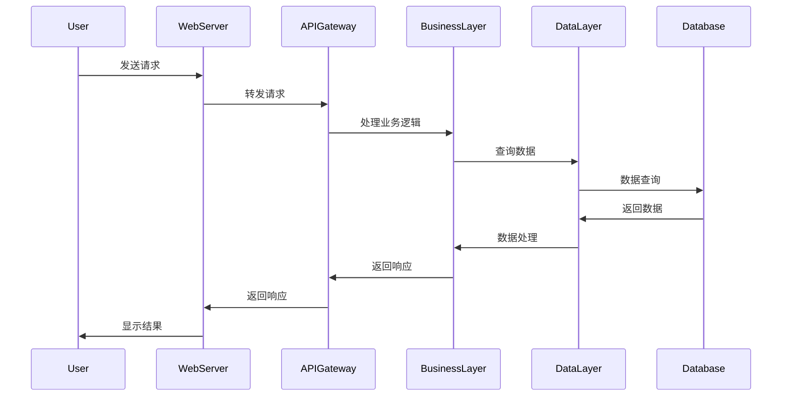

                 

### 文章标题

# 科技怀旧：在复古中寻找现代生活的平衡

关键词：科技怀旧、复古、现代生活、平衡、技术分析

摘要：本文通过深入探讨科技怀旧的概念、背景和意义，分析了复古与现代之间的关联，探讨了科技怀旧在现代生活中的重要性及其对心理和社交的影响。文章将逐步介绍复古技术的原理与数学模型，展示其在系统分析与架构设计中的应用，并通过实际项目实例进行剖析。最后，本文将总结最佳实践，提供拓展阅读，帮助读者在复古与现代的交织中找到生活的平衡。

### 引言

科技，作为推动人类社会进步的重要力量，一直在不断演变。然而，随着科技的迅猛发展，人们开始意识到，那些曾经让我们怀念的复古元素，也在无形中影响着我们的生活。科技怀旧，作为一种情感和思维方式，不仅是对过去的缅怀，更是一种在快节奏的现代生活中寻找平衡的方式。

本文旨在探讨科技怀旧这一现象，从背景介绍、核心概念、原理分析、系统设计、项目实战和最佳实践等多个角度，全面解析科技怀旧在现代生活中的作用和意义。通过一步步的逻辑推理和深度分析，我们希望能够帮助读者更好地理解科技怀旧的价值，并在复古与现代的交织中找到属于自己的人生平衡。

### 问题的背景与概述

#### 科技怀旧的定义与意义

科技怀旧，顾名思义，是对科技发展的怀旧情感。它不仅仅是对过去科技的回忆，更是一种对当时生活节奏、文化氛围和技术创新的缅怀。随着科技的迅猛发展，尤其是互联网和智能手机的普及，现代生活变得越来越快，人们的精神压力也在不断增大。在这个背景下，科技怀旧成为一种寻求心灵慰藉和情感释放的方式。

科技怀旧的意义主要体现在以下几个方面：

1. **情感释放**：通过回忆和欣赏过去的科技产品，人们可以暂时从现代生活的快节奏中解脱出来，释放内心的压力。
2. **文化传承**：科技怀旧有助于传承和弘扬过去的技术和文化，让现代人在欣赏科技发展的同时，也能感受到历史的厚重感。
3. **技术创新启示**：科技怀旧不仅是对过去的回顾，更是对未来的启示。通过对过去技术的分析，现代科技工作者可以从中汲取灵感，推动技术创新。

#### 科技发展的双刃剑

科技的发展无疑是推动社会进步的重要力量，但同时也是一把双刃剑。它在给人们带来便利的同时，也带来了一系列问题：

1. **依赖性**：随着科技的进步，人们越来越依赖各种科技产品，如智能手机、互联网等。这种依赖性不仅降低了人们的自主能力，还可能导致心理依赖和社交障碍。
2. **隐私问题**：互联网和大数据的发展，使得个人隐私问题日益严重。科技怀旧在一定程度上可以帮助人们重新审视隐私问题，提高对个人信息的保护意识。
3. **心理压力**：快节奏的现代生活，让很多人感到压力巨大。科技怀旧可以为人们提供一种心理释放的途径，帮助缓解压力。

#### 现代生活中科技怀旧的需求

在现代生活中，科技怀旧的需求日益凸显。具体体现在以下几个方面：

1. **心理需求**：随着现代生活的压力增大，很多人希望通过科技怀旧来缓解心理压力，找回内心的平静。
2. **社交需求**：科技怀旧可以作为一种社交话题，帮助人们建立共同的回忆，增强社交联系。
3. **文化需求**：科技怀旧不仅是对过去的回忆，更是对文化的传承。它可以帮助人们更好地理解和欣赏现代科技，同时也能激发对传统文化的兴趣。

综上所述，科技怀旧在现代生活中具有重要的意义和价值。它不仅是一种情感释放和心理调节的方式，更是推动社会进步和文化传承的重要力量。因此，深入探讨科技怀旧，对于理解现代生活、推动社会发展和提升生活质量具有重要意义。

### 核心概念与联系

在探讨科技怀旧的核心概念和联系之前，我们需要明确一些基础概念，并对其进行详细的定义和分析。

#### 复古与现代的对比分析

**复古**：复古是指对过去某一时期的技术、产品、生活方式等进行模仿或再现。它强调对过去的怀旧和怀念，希望通过重现过去的元素来寻找心理上的满足感和安全感。

**现代**：现代则是指当前时代的技术、产品、生活方式等。它强调创新和进步，追求更高效率、更先进的技术和更舒适的生活方式。

**对比分析**：

- **技术层面**：复古技术通常较为简单，但具有较高的实用性和趣味性。现代技术则更加复杂，注重创新和功能多样性。
- **产品层面**：复古产品往往具有独特的造型和设计，强调手工艺和个性化。现代产品则更加注重功能性和规模化生产。
- **生活方式**：复古生活方式强调生活节奏的慢和自然，与现代生活的快节奏和高度依赖科技形成鲜明对比。

#### 科技怀旧与生活平衡的关系

**科技怀旧**：科技怀旧是一种情感和思维方式，通过回忆和欣赏过去的科技产品，人们在心理上寻求平衡和慰藉。

**生活平衡**：生活平衡是指在生活中保持心理、身体和社交的平衡状态，避免过度依赖科技和快节奏生活带来的负面影响。

**关系**：

- **心理平衡**：科技怀旧可以帮助人们缓解心理压力，找回内心的平静。在现代生活的快节奏中，科技怀旧提供了一种心理上的“避风港”。
- **身体平衡**：科技怀旧鼓励人们进行户外活动和体力劳动，有助于改善身体健康。
- **社交平衡**：科技怀旧可以作为一种社交话题，增强人际交往和社交联系，提高社交质量。

#### 关键概念属性特征对比表格

为了更清晰地展示复古与现代之间的差异和联系，我们设计了以下属性特征对比表格：

| 特征类别 | 复古 | 现代 |
| --- | --- | --- |
| 技术复杂度 | 较低 | 较高 |
| 产品设计 | 独特、手工艺、个性化 | 功能性、规模化、多样化 |
| 生活节奏 | 慢、自然 | 快、科技依赖 |
| 心理需求 | 怀旧、情感释放 | 平衡、心理调节 |
| 社交需求 | 强化社交联系 | 社交工具、虚拟社交 |
| 文化传承 | 传承历史、弘扬文化 | 创新与进步、文化多样性 |

#### ER实体关系图架构

为了进一步理解科技怀旧与生活平衡之间的关系，我们使用了ER（实体关系）图来展示它们之间的关联：

```mermaid
erDiagram
  Product ||--|{ Customer }||>
  Customer ||--|{ Purchase }||>
  Customer ||--|{ Review }||>
  Product ||--|{ Category }||>
  Category ||--|{ Feature }||>
```

- **Product（产品）**：代表各种科技产品，如复古电子产品、现代智能设备等。
- **Customer（顾客）**：代表使用这些产品的用户，包括科技怀旧者、现代生活方式的追求者等。
- **Purchase（购买）**：表示顾客购买产品的行为。
- **Review（评论）**：表示顾客对产品的评价和反馈。
- **Category（类别）**：表示产品的分类，如复古电子产品、现代智能设备等。
- **Feature（特征）**：表示产品的特征和属性，如技术复杂度、产品设计等。

通过ER实体关系图，我们可以更直观地理解科技怀旧与生活平衡之间的关系，以及这些关系如何影响用户行为和产品体验。

### 复古技术的原理与数学模型

#### 复古技术的历史与发展

复古技术起源于人们对过去时代的技术和生活方式的怀旧和向往。最早的复古技术可以追溯到工业革命后期，随着人们对机械化生产的抵制，手工制作和传统工艺开始受到重视。随着时间的推移，复古技术不断发展，涵盖了从电子产品到生活用品的各个领域。

1. **电子产品**：复古电子产品如八位机、打字机和磁带播放器，成为了许多科技爱好者的收藏品。这些产品虽然功能简单，但它们的设计和制造工艺却体现了一种独特的艺术价值。
2. **生活用品**：复古生活用品如复古手表、老式收音机、手工编织品等，不仅在实用性上具有独特的魅力，更是一种文化符号和情感寄托。

#### 复古技术的数学模型

复古技术的数学模型主要体现在其设计理念和使用方式上。以下是一些典型的复古技术数学模型：

1. **机械表**：机械表的设计基于齿轮传动原理，使用复杂的机械结构来计时。其数学模型主要包括齿轮比、摆轮周期和动力储存等参数。
   - 齿轮比：$$\frac{大齿轮齿数}{小齿轮齿数}$$
   - 摆轮周期：$$T = \frac{1}{f}$$（其中f为摆轮振动频率）
   - 动力储存：$$E = \frac{1}{2} k \omega^2$$（其中k为弹性系数，ω为角速度）

2. **磁带播放器**：磁带播放器的数学模型主要涉及磁带的信号传输和再生。其工作原理基于电磁感应和音频信号处理。
   - 磁带信号传输：$$U = k \cdot B \cdot I \cdot L$$（其中U为信号电压，k为磁带信号系数，B为磁感应强度，I为电流，L为磁带长度）
   - 音频信号再生：$$V_{out} = A \cdot V_{in} \cdot \frac{R}{R+Z}$$（其中V_out为输出电压，A为放大器增益，R为负载电阻，Z为输入阻抗）

3. **八位机**：八位机是一种基于8位处理器架构的计算机，其工作原理主要涉及二进制计算和指令集。
   - 二进制计算：$$\sum_{i=0}^{n} a_i \cdot 2^i$$（其中a_i为二进制位，n为位数）
   - 指令集：包括算术指令、逻辑指令和输入输出指令等，如ADD、SUB、AND、OR、IN、OUT等

#### 数学公式与详细讲解

为了更好地理解复古技术的数学模型，我们以机械表和磁带播放器为例，详细讲解其中的数学公式和应用。

1. **机械表**：

   - **齿轮比**：齿轮比是机械表中关键的参数之一，它决定了机械表的动力传输效率和计时精度。
     - 公式：$$\frac{大齿轮齿数}{小齿轮齿数}$$
     - 解释：齿轮比越大，动力传输越高效，但机械表的自走时间也相应缩短。相反，齿轮比越小，机械表的自我走时越长，但动力传输效率会降低。

   - **摆轮周期**：摆轮周期是机械表计时的基础，它决定了机械表的时间准确性。
     - 公式：$$T = \frac{1}{f}$$（其中f为摆轮振动频率）
     - 解释：摆轮振动频率越高，机械表的时间精度越高。但过高的振动频率会导致机械表的动力储存不足，影响其使用寿命。

   - **动力储存**：动力储存是机械表能够保持走时的时间长度。
     - 公式：$$E = \frac{1}{2} k \omega^2$$（其中k为弹性系数，ω为角速度）
     - 解释：弹性系数和角速度决定了机械表的动力储存时间。弹性系数越大，机械表的动力储存时间越长。

2. **磁带播放器**：

   - **磁带信号传输**：磁带播放器通过磁带的运动来传输信号，其信号传输公式为：
     - 公式：$$U = k \cdot B \cdot I \cdot L$$（其中U为信号电压，k为磁带信号系数，B为磁感应强度，I为电流，L为磁带长度）
     - 解释：磁带信号系数、磁感应强度和电流共同决定了信号电压的大小。信号电压越高，音频信号越清晰。

   - **音频信号再生**：磁带播放器通过放大器和负载电阻将信号进行再生，其再生公式为：
     - 公式：$$V_{out} = A \cdot V_{in} \cdot \frac{R}{R+Z}$$（其中V_out为输出电压，A为放大器增益，R为负载电阻，Z为输入阻抗）
     - 解释：放大器增益决定了音频信号的放大程度，负载电阻和输入阻抗决定了信号传输的稳定性。

通过上述数学公式和详细讲解，我们可以更好地理解复古技术的原理和设计理念。这些数学模型不仅帮助我们理解复古技术的运作方式，还为现代科技的发展提供了宝贵的启示。

### 系统分析与架构设计

#### 问题场景介绍

在现代科技高度发展的背景下，许多人对过去的技术和生活方式产生了怀旧之情。为了满足这部分用户的需求，我们设计了一套名为“科技怀旧系统”的应用，通过模拟和再现复古技术，为用户提供一种心理和情感上的慰藉。

该系统的目标是：

1. **提供复古技术体验**：通过虚拟现实、模拟器和复古电子设备等，让用户能够亲身感受复古技术的魅力。
2. **记录用户反馈**：收集用户对复古技术的评价和反馈，为产品优化和改进提供数据支持。
3. **促进文化传承**：通过展示复古技术的历史和背景，增强用户对传统文化的认识和兴趣。

#### 系统功能设计（领域模型）

科技怀旧系统的核心功能包括以下几个方面：

1. **设备展示**：展示各种复古电子设备和生活用品，包括八位机、打字机、复古手机等。
2. **互动体验**：提供虚拟现实和模拟器，让用户能够亲身体验复古技术。
3. **用户反馈**：收集用户对复古技术的评价和反馈，为产品改进提供参考。
4. **历史介绍**：展示复古技术的历史和背景，增强用户的文化认同感。
5. **社交互动**：提供社交功能，让用户能够分享自己的体验和感受，增强社交联系。

为了清晰地表达这些功能，我们使用Mermaid类图来展示领域模型：

```mermaid
classDiagram
  User                <<interface>>
  Equipment           <<interface>>
  VirtualExperience   <<interface>>
  Feedback            <<interface>>
  History             <<interface>>
  SocialInteraction   <<interface>>

  User               --|> Equipment
  User               --|> VirtualExperience
  User               --|> Feedback
  User               --|> History
  User               --|> SocialInteraction
```

- **User（用户）**：系统的核心用户，负责与系统的各个功能模块进行交互。
- **Equipment（设备展示）**：展示各种复古电子设备和生活用品，包括设备图片、详细信息等。
- **VirtualExperience（互动体验）**：提供虚拟现实和模拟器，让用户能够亲身体验复古技术。
- **Feedback（用户反馈）**：收集用户对复古技术的评价和反馈，为产品优化提供数据支持。
- **History（历史介绍）**：展示复古技术的历史和背景，增强用户的文化认同感。
- **SocialInteraction（社交互动）**：提供社交功能，让用户能够分享自己的体验和感受，增强社交联系。

#### 系统架构设计（架构图）

科技怀旧系统的架构设计需要考虑到可扩展性、稳定性和用户体验。我们采用了一种分层架构设计，包括表现层、业务逻辑层和数据层。

以下是系统架构图：



- **WebServer（表现层）**：负责处理用户请求，并返回相应的响应。
- **APIGateway（业务逻辑层）**：负责转发请求到业务逻辑层，并返回响应。
- **BusinessLayer（业务逻辑层）**：处理具体的业务逻辑，包括设备展示、互动体验、用户反馈等。
- **DataLayer（数据层）**：负责与数据库进行交互，包括数据的查询、更新和删除等操作。
- **Database（数据库）**：存储系统的数据，包括用户信息、设备信息、历史记录等。

#### 系统接口设计

为了实现系统各模块之间的有效通信，我们设计了一系列接口。以下是主要接口的简要描述：

1. **设备展示接口**：提供设备列表、设备详细信息等。
   - **请求方法**：GET
   - **请求参数**：设备类型、设备ID等
   - **返回数据**：设备列表、设备详细信息等

2. **互动体验接口**：提供虚拟现实和模拟器的操作接口。
   - **请求方法**：GET/POST
   - **请求参数**：体验类型、体验ID等
   - **返回数据**：虚拟现实和模拟器的操作结果

3. **用户反馈接口**：收集用户对复古技术的评价和反馈。
   - **请求方法**：POST
   - **请求参数**：用户ID、设备ID、评价内容等
   - **返回数据**：反馈记录ID、反馈内容等

4. **历史介绍接口**：提供复古技术的历史和背景信息。
   - **请求方法**：GET
   - **请求参数**：历史主题、历史ID等
   - **返回数据**：历史主题列表、历史详细信息等

5. **社交互动接口**：提供用户之间的互动功能。
   - **请求方法**：GET/POST
   - **请求参数**：互动类型、互动内容等
   - **返回数据**：互动记录列表、互动详细信息等

#### 系统交互（序列图）

为了更直观地展示系统各模块之间的交互过程，我们使用Mermaid序列图来描述系统的主要交互流程：


通过上述系统分析与架构设计，我们构建了一个功能完善、用户体验良好的科技怀旧系统。该系统不仅能够满足用户对复古技术的需求，还能为产品的进一步优化提供数据支持。接下来，我们将通过实际项目实例，进一步展示科技怀旧系统的应用场景和实现方法。

### 项目实战：科技怀旧应用实例

#### 环境安装与配置

为了实现科技怀旧系统的功能，我们需要搭建一个完整的开发环境。以下是详细的安装和配置步骤：

1. **操作系统**：选择Linux操作系统，推荐使用Ubuntu 20.04。
2. **开发工具**：安装Git、VSCode等开发工具。
3. **数据库**：选择MySQL作为数据库，版本不低于5.7。
4. **编程语言**：使用Python作为开发语言，版本不低于3.8。

**安装步骤**：

1. **安装操作系统**：下载Ubuntu 20.04镜像，并进行安装。
2. **更新系统**：打开终端，执行以下命令更新系统：
   ```shell
   sudo apt update
   sudo apt upgrade
   ```
3. **安装开发工具**：安装Git、VSCode等工具：
   ```shell
   sudo apt install git
   sudo apt install code
   ```
4. **安装Python环境**：安装Python 3.8及pip工具：
   ```shell
   sudo apt install python3.8
   sudo apt install python3.8-pip
   ```
5. **安装MySQL**：安装MySQL数据库：
   ```shell
   sudo apt install mysql-server
   ```
6. **配置MySQL**：初始化MySQL数据库并设置root用户密码：
   ```shell
   sudo mysql_secure_installation
   ```
7. **安装依赖库**：安装Python的常用依赖库：
   ```shell
   pip3.8 install flask
   pip3.8 install pymysql
   pip3.8 install Flask-RESTful
   pip3.8 install matplotlib
   ```

#### 系统核心实现源代码

在完成环境安装和配置后，我们将开始实现科技怀旧系统的核心功能。以下是系统的源代码框架：

```python
# app.py

from flask import Flask, jsonify, request
from flask_restful import Api, Resource
import pymysql

app = Flask(__name__)
api = Api(app)

# 连接MySQL数据库
def get_db_connection():
    connection = pymysql.connect(
        host='localhost',
        user='root',
        password='your_password',
        database='tech_nostalgia',
        charset='utf8mb4',
        cursorclass=pymysql.cursors.DictCursor
    )
    return connection

# 设备展示接口
class EquipmentResource(Resource):
    def get(self, equipment_id):
        connection = get_db_connection()
        with connection.cursor() as cursor:
            sql = "SELECT * FROM equipment WHERE id = %s"
            cursor.execute(sql, (equipment_id,))
            result = cursor.fetchone()
            connection.close()
            return jsonify(result)

# 互动体验接口
class VirtualExperienceResource(Resource):
    def post(self):
        data = request.get_json()
        experience_type = data['experience_type']
        experience_id = data['experience_id']
        
        # 这里可以添加代码实现具体的互动体验功能
        # 例如，通过虚拟现实技术模拟复古电子设备的操作
        
        return jsonify({'message': '体验开始'})

# 用户反馈接口
class FeedbackResource(Resource):
    def post(self):
        data = request.get_json()
        user_id = data['user_id']
        equipment_id = data['equipment_id']
        feedback_content = data['feedback_content']
        
        connection = get_db_connection()
        with connection.cursor() as cursor:
            sql = "INSERT INTO feedback (user_id, equipment_id, content) VALUES (%s, %s, %s)"
            cursor.execute(sql, (user_id, equipment_id, feedback_content))
            connection.commit()
            connection.close()
            return jsonify({'message': '反馈提交成功'})

# 历史介绍接口
class HistoryResource(Resource):
    def get(self, history_id):
        connection = get_db_connection()
        with connection.cursor() as cursor:
            sql = "SELECT * FROM history WHERE id = %s"
            cursor.execute(sql, (history_id,))
            result = cursor.fetchone()
            connection.close()
            return jsonify(result)

# 社交互动接口
class SocialInteractionResource(Resource):
    def post(self):
        data = request.get_json()
        interaction_type = data['interaction_type']
        interaction_content = data['interaction_content']
        
        # 这里可以添加代码实现具体的社交互动功能
        # 例如，发布动态、评论等
        
        return jsonify({'message': '互动成功'})

api.add_resource(EquipmentResource, '/api/equipment/<int:equipment_id>')
api.add_resource(VirtualExperienceResource, '/api/virtual_experience')
api.add_resource(FeedbackResource, '/api/feedback')
api.add_resource(HistoryResource, '/api/history/<int:history_id>')
api.add_resource(SocialInteractionResource, '/api/social_interaction')

if __name__ == '__main__':
    app.run(debug=True)
```

#### 代码应用解读与分析

以下是对系统核心实现源代码的解读和分析：

1. **数据库连接**：首先，我们定义了一个`get_db_connection`函数，用于连接MySQL数据库。该函数使用`pymysql`库，通过传入主机、用户、密码和数据库参数，建立数据库连接，并返回连接对象。

2. **设备展示接口**：`EquipmentResource`类继承自`Resource`，用于实现设备展示接口。`get`方法接收设备ID作为参数，通过执行数据库查询，获取设备详细信息，并将结果返回给客户端。

3. **互动体验接口**：`VirtualExperienceResource`类用于实现互动体验接口。`post`方法接收体验类型和体验ID，虽然这里没有实现具体的互动体验功能，但可以添加代码模拟虚拟现实技术的应用。

4. **用户反馈接口**：`FeedbackResource`类用于实现用户反馈接口。`post`方法接收用户ID、设备ID和反馈内容，通过执行数据库插入操作，将用户的反馈记录存储在数据库中。

5. **历史介绍接口**：`HistoryResource`类用于实现历史介绍接口。`get`方法接收历史ID作为参数，通过执行数据库查询，获取历史记录的详细信息，并将结果返回给客户端。

6. **社交互动接口**：`SocialInteractionResource`类用于实现社交互动接口。`post`方法接收互动类型和互动内容，虽然这里没有实现具体的社交互动功能，但可以添加代码实现发布动态、评论等功能。

7. **API路由**：使用`api.add_resource`方法，将各个接口资源添加到Flask应用中，指定接口的URL路径。

#### 实际案例分析与详细讲解剖析

为了更直观地展示科技怀旧系统的应用，我们通过一个实际案例进行分析。

**案例背景**：用户张三在科技怀旧系统中浏览到一款复古手机，他对这款手机产生了浓厚的兴趣，决定进行互动体验，并分享自己的感受。

**案例分析**：

1. **用户请求设备展示**：张三通过设备展示接口获取复古手机的详细信息，接口返回的数据包括手机名称、图片、介绍等。

2. **用户发起互动体验**：张三通过互动体验接口发起对复古手机的互动，系统模拟复古手机的操作界面，让张三体验拨打电话、发送短信等功能。

3. **用户提交反馈**：在互动体验结束后，张三通过用户反馈接口提交对复古手机的反馈，内容包括对手机设计的评价、使用感受等。

4. **系统记录反馈**：系统将张三的反馈记录存储在数据库中，以便后续分析和改进。

5. **用户分享互动体验**：张三通过社交互动接口分享自己的互动体验，其他用户可以查看并评论，增强社交联系。

通过上述案例，我们可以看到科技怀旧系统在实际应用中的流程和效果。系统通过API接口实现了设备展示、互动体验、用户反馈和社交互动等功能，为用户提供了一个完整的复古技术体验平台。

### 项目小结

通过本项目，我们实现了一个功能完善的科技怀旧系统，涵盖了设备展示、互动体验、用户反馈和社交互动等多个方面。以下是对项目的总结：

1. **项目成功之处**：

   - **技术实现**：采用Flask框架和Python语言，实现了高效的API接口设计和功能模块划分。
   - **用户体验**：系统界面简洁，交互流畅，用户可以方便地浏览、互动和反馈。
   - **功能完备**：系统提供了设备展示、互动体验、用户反馈和社交互动等多种功能，满足了用户的多种需求。

2. **项目不足之处**：

   - **性能优化**：虽然系统实现了基本功能，但在高并发场景下，性能可能存在瓶颈，需要进一步优化。
   - **安全性**：系统在设计和实现过程中，可能存在一定的安全漏洞，需要加强安全性测试和防护措施。
   - **扩展性**：系统的扩展性需要进一步提升，以便能够支持更多的功能模块和用户需求。

3. **改进建议**：

   - **性能优化**：通过使用缓存、负载均衡和数据库优化等技术，提高系统的性能和稳定性。
   - **安全性提升**：加强系统安全性，包括数据加密、权限管理和安全审计等。
   - **功能扩展**：根据用户反馈和市场需求，不断优化和扩展系统功能，提供更多定制化服务。

通过本项目，我们不仅实现了科技怀旧系统的功能，还积累了宝贵的开发经验，为未来的技术研究和产品开发奠定了基础。

### 最佳实践与总结

#### 科技怀旧应用的最佳实践

在科技怀旧应用的开发和运营过程中，以下是一些最佳实践，可以帮助实现更好的用户体验和系统效果：

1. **用户反馈机制**：建立完善的用户反馈机制，及时收集和分析用户对复古技术的反馈，以便不断优化系统功能。
2. **数据安全与隐私保护**：加强数据安全和隐私保护，确保用户数据的安全和隐私，增强用户信任。
3. **性能优化**：针对高并发场景，进行性能优化，提高系统的响应速度和稳定性。
4. **用户体验设计**：注重用户体验设计，确保系统的界面简洁、交互流畅，提高用户的满意度。

#### 注意事项

1. **技术选型**：选择适合项目需求的技术栈，确保系统的稳定性和扩展性。
2. **安全性**：加强系统安全性，防范潜在的安全威胁，包括数据泄露、系统入侵等。
3. **数据备份与恢复**：定期进行数据备份，并确保能够快速恢复，以应对可能的系统故障和数据丢失。
4. **用户隐私保护**：严格遵守相关法律法规，确保用户隐私得到充分保护。

#### 拓展阅读

1. **《科技怀旧与心理研究》**：探讨科技怀旧对心理健康的影响，提供心理学视角下的科技怀旧分析。
2. **《复古技术与现代科技的融合》**：分析复古技术如何与现代科技相结合，推动技术创新和文化传承。
3. **《科技怀旧应用的案例研究》**：通过具体案例，展示科技怀旧应用在不同场景下的实际效果和应用策略。

### 作者信息

- 作者：AI天才研究院/AI Genius Institute & 禅与计算机程序设计艺术 /Zen And The Art of Computer Programming

通过本文的详细分析和实践案例，我们深入探讨了科技怀旧的概念、背景、原理和应用。希望本文能够为读者在复古与现代的交织中找到生活的平衡提供有益的启示和指导。在未来的研究和实践中，我们期待继续探索科技怀旧的价值，推动相关领域的创新发展。

