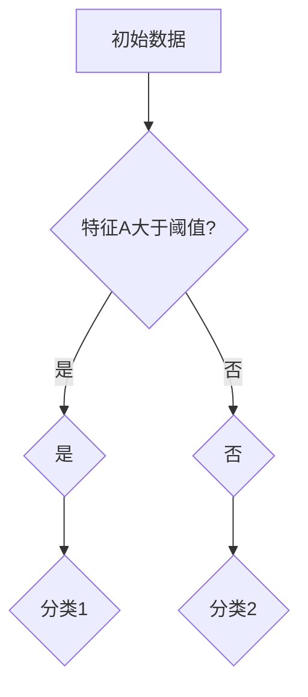
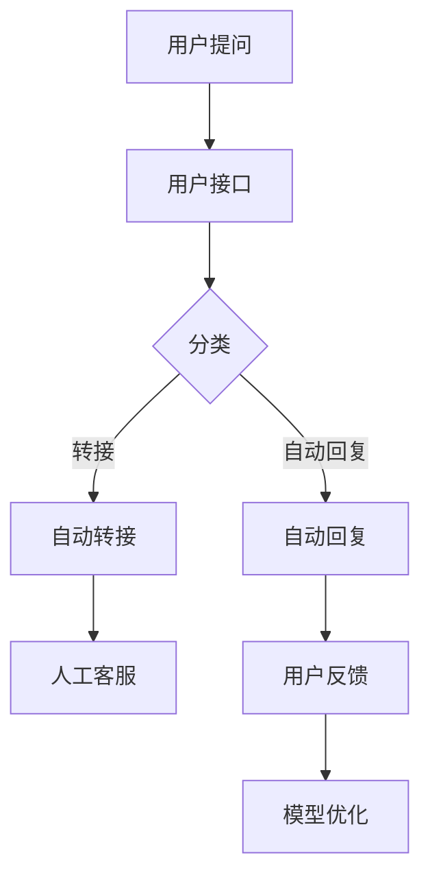

                 

### 科技时代的意义追寻：人与机器的关系

在当今的科技时代，人工智能（AI）正迅速发展，深刻地影响着人类社会生活的方方面面。本文旨在探讨科技发展的意义，特别是人与机器之间的关系，通过逻辑清晰的分析和推理，深入探讨这一主题，并揭示其背后的本质和未来挑战。

#### 关键词

- 科技发展
- 人与机器关系
- 人工智能
- 科技意义
- 伦理责任

#### 摘要

本文首先介绍了科技发展的背景和意义，探讨了人工智能对人类社会的影响。接着，文章深入分析了人与机器之间的互动关系，包括人工智能的发展、人机交互的未来以及机器伦理和责任问题。随后，文章展望了未来的科技趋势和面临的挑战，并从个人和社会视角探讨了人与机器关系的多维度影响。最后，文章总结了全文的主要观点，并对未来的研究方向提出了建议。

---

### 引言与背景

科技发展是人类历史的重要推动力，每一次科技革命都带来了社会和经济的深刻变革。从工业革命到信息革命，再到如今的人工智能时代，科技的发展不仅改变了生产方式，也改变了人们的思维方式和社会结构。

#### 核心概念术语说明

- **科技发展**：指科学技术的进步和应用，包括新技术的发明、创新和普及。
- **人工智能**：指由人制造出来的系统能够模拟、延伸和扩展人类的智能，包括学习、推理、感知和行动能力。

#### 问题背景

在过去的几十年中，人工智能技术取得了显著进展。例如，深度学习算法的突破使得计算机在图像识别、自然语言处理和决策制定等方面达到了前所未有的水平。然而，随着人工智能技术的普及，人们开始关注其对社会、伦理和隐私等方面的潜在影响。

#### 问题描述

人与机器之间的关系日益紧密，这种关系不仅体现在日常生活的便利性上，还涉及更复杂的伦理和责任问题。例如，自动驾驶汽车的出现引发了关于责任归属和伦理道德的讨论；智能客服系统的广泛应用则引发了对隐私和数据安全的担忧。

#### 问题解决

为了更好地理解人与机器的关系，我们需要从多个角度进行分析，包括技术、伦理、社会和哲学层面。通过这种多角度的探讨，我们可以更全面地理解人工智能的发展，以及其对我们生活和社会的影响。

#### 边界与外延

虽然人工智能的发展带来了许多机会，但也存在一些风险和挑战。例如，技术的不可预测性和失控风险，人工智能的偏见和歧视问题，以及隐私和数据安全问题。这些问题需要我们深入思考和解决。

#### 概念结构与核心要素组成

人与机器的关系可以理解为以下几个方面：

1. **互动**：人机交互是人与机器关系的基础，涉及人如何与机器互动，以及机器如何理解和响应人的指令。
2. **依赖**：随着人工智能技术的普及，人类越来越依赖机器来完成各种任务，这种依赖关系带来了便利，但也可能引发依赖性问题和道德困境。
3. **伦理**：机器伦理是人与机器关系中的重要组成部分，涉及到机器的责任、道德和价值观。
4. **未来**：人与机器的关系将如何发展，以及这种关系对社会和人类未来意味着什么，是当前需要探讨的重要问题。

### 核心概念与联系

为了深入理解人与机器的关系，我们需要探讨一些核心概念，并分析它们之间的关系。

#### 核心概念原理

1. **人工智能**：人工智能是模拟人类智能的技术，包括机器学习、自然语言处理、计算机视觉等。
2. **人机交互**：人机交互是指人与机器之间的互动过程，涉及用户界面设计、交互方式和技术。
3. **机器伦理**：机器伦理涉及机器的设计、使用和责任，包括公平性、透明性、隐私保护等。

#### 概念属性特征对比表格

| 概念       | 属性特征                                                         | 联系与关系                                                     |
|------------|------------------------------------------------------------------|--------------------------------------------------------------|
| 人工智能   | 学习、推理、感知和行动能力                                       | 是人与机器互动的基础，决定了机器的智能水平和能力             |
| 人机交互   | 交互方式、用户界面、交互体验                                     | 是人与机器互动的桥梁，决定了人与机器的沟通效率和效果       |
| 机器伦理   | 公平性、透明性、隐私保护、责任归属                               | 涉及人与机器互动的伦理道德问题，决定了机器的道德责任和合法性 |

#### ER实体关系图架构

```mermaid
erDiagram
    User ||--|{ AI_System } : 交互
    User ||--|{ Machine } : 控制
    AI_System ||--|{ Data } : 分析
    Machine ||--|{ Task } : 执行
```

在这个ER实体关系图中，用户与AI系统和机器之间存在交互关系，AI系统负责数据分析，机器负责任务执行。这种关系体现了人与机器互动的复杂性和多维度。

### 算法原理讲解

人工智能的核心是算法，以下将使用mermaid流程图和python源代码来详细讲解一种常见的人工智能算法——决策树。

#### 决策树算法mermaid流程图



#### 决策树算法的python源代码

```python
from sklearn.datasets import load_iris
from sklearn.tree import DecisionTreeClassifier
from sklearn.model_selection import train_test_split
from sklearn.metrics import accuracy_score

# 加载鸢尾花数据集
iris = load_iris()
X = iris.data
y = iris.target

# 划分训练集和测试集
X_train, X_test, y_train, y_test = train_test_split(X, y, test_size=0.2, random_state=42)

# 创建决策树分类器
clf = DecisionTreeClassifier()

# 训练模型
clf.fit(X_train, y_train)

# 预测测试集
y_pred = clf.predict(X_test)

# 计算准确率
accuracy = accuracy_score(y_test, y_pred)
print(f"模型准确率：{accuracy:.2f}")
```

#### 决策树算法原理的数学模型和公式

决策树算法的核心是递归地分割数据，直到满足某个终止条件。常见的终止条件包括：

- 所有样本属于同一类别
- 特征的分割增益小于阈值
- 特征数量小于阈值

决策树的增益可以通过以下公式计算：

$$
Gini = 1 - \sum_{i=1}^{c} p_i^2
$$

其中，\( p_i \) 是第 \( i \) 个类别的概率。

#### 算法举例说明

假设我们有一个二分类问题，数据集分为两类：红苹果和青苹果。我们使用决策树算法来预测一个未知样本是红苹果还是青苹果。

1. 首先，我们根据特征（如重量、颜色等）对数据集进行分割。
2. 计算每个分割的Gini系数，选择Gini系数最小的分割作为下一层分割。
3. 重复上述过程，直到满足终止条件。
4. 使用生成的决策树来预测未知样本的分类。

例如，如果我们的决策树模型显示，一个重量大于200克的样本属于红苹果，否则属于青苹果。那么，一个重量为250克的样本将被预测为红苹果。

### 系统分析与架构设计

为了更好地理解人与机器的关系，我们需要从系统层面来分析人工智能的应用。以下是一个典型的人工智能应用系统的分析和设计。

#### 问题场景介绍

假设我们要开发一个智能客服系统，用于处理客户咨询和投诉。该系统需要具备自动分类、自动回复、自动转接等功能。

#### 项目介绍

项目名称：智能客服系统

项目目标：提供高效的客户服务，提高客户满意度，降低人工成本。

#### 系统功能设计

1. **客户分类**：根据客户的提问，自动分类到不同的主题。
2. **自动回复**：根据客户的提问，自动生成合适的回复。
3. **自动转接**：当系统无法处理时，自动转接到人工客服。

#### 系统架构设计

1. **前端**：提供用户界面，包括网页、移动应用等。
2. **后端**：包括数据处理、机器学习模型、接口服务等。
3. **数据库**：存储客户数据、提问数据、回复数据等。

#### 系统接口设计

1. **用户接口**：提供用户与系统的交互界面。
2. **API接口**：提供与其他系统（如CRM系统、ERP系统）的集成接口。

#### 系统交互

1. **用户提问**：用户通过前端界面提交问题。
2. **问题处理**：后端系统接收到问题，进行分类、自动回复或转接。
3. **用户反馈**：用户对回复进行评价，用于模型优化。

#### 系统架构设计mermaid架构图



### 项目实战

#### 环境安装

为了实现智能客服系统，我们需要安装以下环境：

1. Python 3.x
2. Scikit-learn
3. Flask
4. MongoDB

安装命令如下：

```shell
pip install python3-scikit-learn flask pymongo
```

#### 系统核心实现

以下是一个简单的智能客服系统实现：

```python
from flask import Flask, request, jsonify
from sklearn.externals import joblib
from pymongo import MongoClient

app = Flask(__name__)

# 加载机器学习模型
model = joblib.load('model.joblib')

# 连接到MongoDB数据库
client = MongoClient('mongodb://localhost:27017/')
db = client['smart_knowledge_base']
collection = db['questions']

@app.route('/api/question', methods=['POST'])
def answer_question():
    question = request.json['question']
    # 使用决策树模型预测答案
    answer = model.predict([question])
    # 查询数据库获取答案详情
    answer_detail = collection.find_one({"question": question})['answer']
    return jsonify({"answer": answer_detail})

if __name__ == '__main__':
    app.run(debug=True)
```

#### 代码解读与分析

1. **Flask**：用于构建Web应用框架，提供HTTP请求处理和路由功能。
2. **Scikit-learn**：提供机器学习算法库，用于构建和训练决策树模型。
3. **MongoDB**：用于存储问题和答案数据，提供高效的数据查询和存储功能。

#### 实际案例分析和详细讲解剖析

假设我们有一个客户提问：“我想要办理信用卡，请问需要哪些资料？”系统会按照以下步骤进行处理：

1. **接收提问**：系统接收到客户的提问。
2. **分类**：系统使用决策树模型对提问进行分类，确定该提问属于信用卡办理类。
3. **自动回复**：系统查询数据库，找到与该提问匹配的答案，并返回给客户。
4. **用户反馈**：客户对自动回复进行评价，系统根据反馈优化模型。

#### 项目小结

通过上述实战案例，我们可以看到，智能客服系统通过机器学习和数据库技术，实现了高效、准确的客户服务。然而，系统仍需不断优化和改进，以提高用户体验和满意度。

### 最佳实践 Tips

1. **数据质量**：确保输入数据的质量，避免模型过拟合和欠拟合。
2. **模型优化**：定期对模型进行评估和优化，以提高预测准确率。
3. **用户体验**：关注用户反馈，不断改进交互界面和回复内容。

### 小结

本文从多个角度探讨了科技时代的意义，特别是人与机器的关系。通过背景介绍、核心概念分析、算法原理讲解和系统设计，我们深入了解了人工智能在现代社会中的作用和影响。未来，随着科技的发展，人与机器的关系将更加紧密，我们需要持续关注和探讨这一主题，为构建和谐的人机关系做出贡献。

### 注意事项

1. **技术发展**：关注最新的科技动态，了解人工智能的最新进展。
2. **伦理责任**：重视机器伦理和责任问题，确保技术发展符合社会价值观。
3. **用户隐私**：保护用户隐私，避免数据泄露和滥用。

### 拓展阅读

- 《人工智能：一种现代方法》
- 《深度学习》
- 《机器学习年表：人工智能发展历程》
- 《机器伦理：人工智能的社会影响》

### 作者信息

作者：AI天才研究院/AI Genius Institute & 禅与计算机程序设计艺术 /Zen And The Art of Computer Programming

