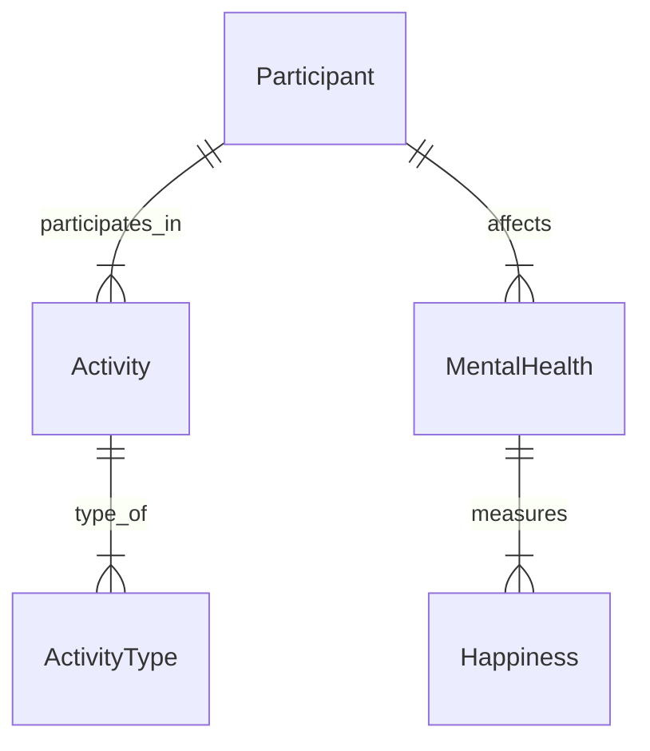
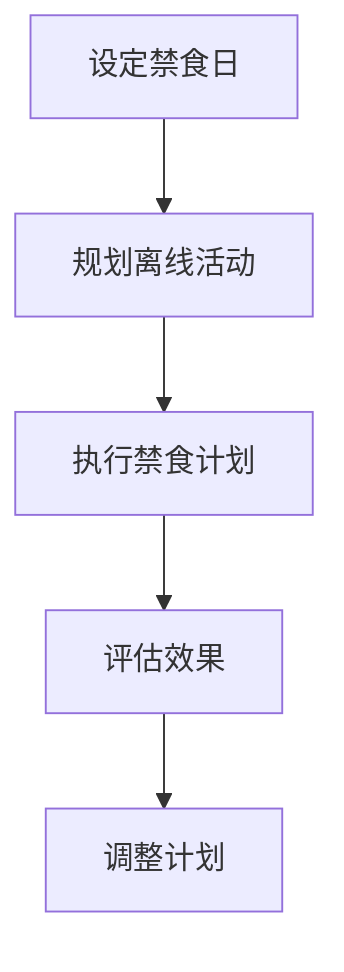
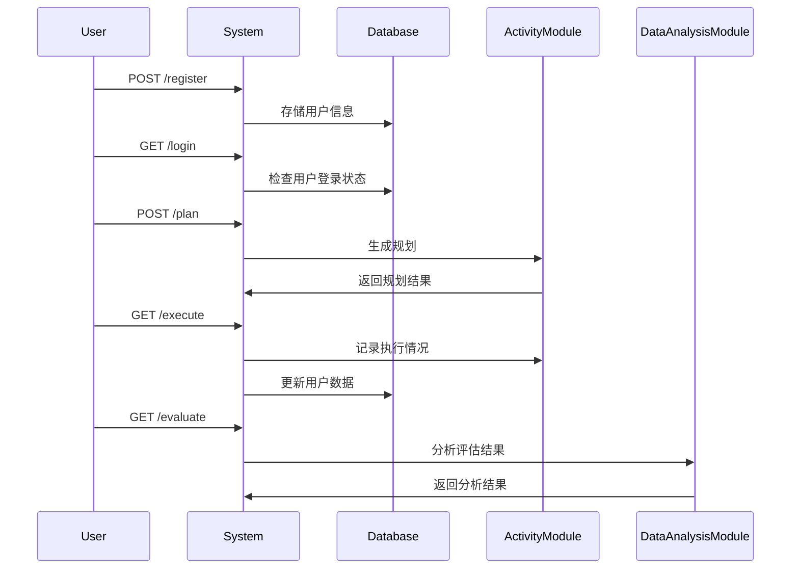
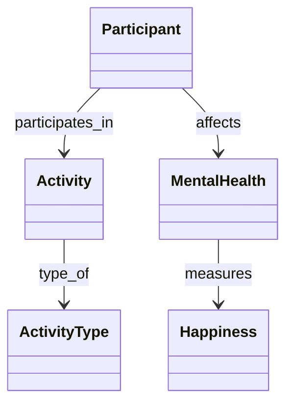
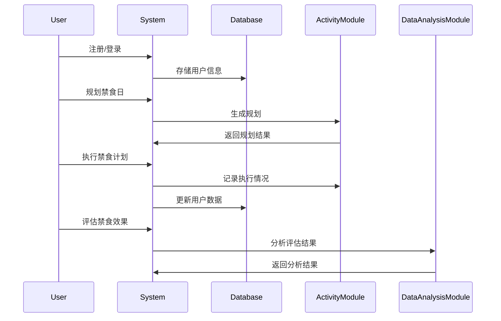

                 

# 科技禁食日：每月一天的离线生活体验活动

## 关键词
科技禁食日、离线生活、心理健康、生活质量、行为心理学、人类行为模型。

## 摘要
科技禁食日是一种旨在减少人们对科技产品依赖，改善心理健康，增强人际关系和提升生活质量的体验活动。本文将深入探讨科技禁食日的背景、问题、解决方法、边界、核心要素以及其背后的算法原理，通过对比分析、实体关系图和算法流程图等多种方式，提供全方位的解读。

## 第1章：问题背景、问题描述、问题解决、边界与外延、概念结构与核心要素组成

### 1.1.1 问题背景
科技禁食日（Tech Fast Day）这一概念源于现代社会中人们对于科技产品的过度依赖所引发的一系列问题。随着智能手机、互联网和社交媒体的普及，越来越多的人沉迷于虚拟世界，导致心理健康问题、人际关系疏离以及生活质量下降。因此，科技禁食日应运而生，旨在通过定期离线，帮助人们重新找回生活的平衡。

### 1.1.2 问题描述
科技禁食日的活动参与者需要在每月固定的一天内完全脱离科技产品，如手机、电脑和社交媒体等。在此期间，他们需要通过面对面的交流、阅读书籍、户外活动等方式，体验离线生活的乐趣和重要性。这一活动的主要目标是减轻人们对科技产品的依赖，改善心理健康，增强人际关系，并提升生活质量。

### 1.1.3 问题解决
科技禁食日通过以下方式解决问题：
- **减少依赖**：通过定期离线，参与者在禁食日之外的时间也能逐渐减少对科技产品的依赖。
- **心理健康提升**：减少科技产品的使用，有助于降低焦虑水平，提高幸福感。
- **人际关系增强**：面对面的交流有助于加深人与人之间的感情，增强人际关系。
- **生活质量提升**：参与者在禁食日内的离线活动，如阅读、户外运动等，有助于提高整体生活质量。

### 1.1.4 边界与外延
科技禁食日的边界在于参与者的选择，可以是每月一次，也可以是每季度或每年一次。而其外延则包括各种离线活动，如阅读、户外活动、烹饪、家庭聚会等，以丰富参与者的离线生活体验。

### 1.1.5 概念结构与核心要素组成
科技禁食日的核心概念包括：
- **禁食日**：每月固定一天，完全离线。
- **离线生活**：参与者在禁食日内的活动，如阅读、户外活动、面对面交流等。
- **心理健康**：通过减少对科技产品的依赖，提高心理健康水平。
- **人际关系**：促进人与人之间的真实互动，增强人际关系。
- **生活质量**：提升整体生活质量和幸福感。

## 第2章：核心概念与联系

### 2.1 核心概念
科技禁食日的核心概念包括：
- **科技依赖**：人们过度依赖科技产品导致的问题，如心理健康问题、人际关系疏离等。
- **离线生活**：与传统的生活方式相比，禁食日参与者选择离线活动的形式，减少对科技产品的依赖。
- **心理健康**：科技禁食日对于参与者心理健康的影响，包括减少焦虑、提升幸福感等。

### 2.2 概念属性特征对比表格

| 概念         | 属性特征                                                                                     | 相关性                                           |
|--------------|------------------------------------------------------------------------------------------------|----------------------------------------------------|
| 科技依赖     | 依赖程度、使用频率、心理依赖程度                                                         | 心理健康、生活质量影响                           |
| 离线生活     | 活动类型、参与方式、频率                                                                   | 科技依赖的缓解、心理健康提升                      |
| 心理健康     | 焦虑水平、幸福感、人际关系质量                                                             | 科技依赖的影响、离线生活的效果                     |

### 2.3 ER实体关系图架构


## 第3章：科技禁食日的算法原理讲解

### 3.1 算法原理
科技禁食日的算法原理主要基于行为心理学和人类行为模型。通过设定固定的禁食日，引导参与者逐步减少对科技产品的依赖，从而改善心理健康和提升生活质量。

### 3.2 算法流程图


### 3.3 算法原理详细讲解

科技禁食日的算法原理可以分为以下几个步骤：

1. **设定禁食日**：首先，参与者需要选择一个每月固定的日子作为禁食日。这一步是为了给参与者一个明确的离线目标，从而引导他们逐步减少对科技产品的依赖。

2. **规划离线活动**：在禁食日前，参与者需要提前规划一系列的离线活动，如阅读、户外运动、烹饪等。这些活动旨在丰富参与者的离线生活，减少他们对科技产品的需求。

3. **执行禁食计划**：在禁食日当天，参与者需要严格按照计划执行，完全脱离科技产品。这一步是整个算法的核心，通过实际操作来减少对科技产品的依赖。

4. **评估效果**：禁食日结束后，参与者需要对禁食效果进行评估。这包括心理健康、生活质量、人际关系等方面的变化。通过评估，参与者可以了解禁食日的实际效果，为后续的调整提供依据。

5. **调整计划**：根据评估结果，参与者可以对禁食计划进行调整。例如，如果发现某个活动对心理健康提升效果显著，可以增加该活动的频率；如果发现某个活动对生活质量提升不明显，可以更换其他活动。

### 3.4 算法原理数学模型和公式

科技禁食日的算法原理可以抽象为一个数学模型。假设参与者在禁食日前对科技产品的依赖程度为 $D$，在禁食日后的依赖程度为 $D'$，则有以下公式：

$$
D' = D - k \cdot \exp(-rt)
$$

其中，$k$ 为科技禁食日的强度系数，$r$ 为科技禁食日的频率，$t$ 为禁食日的持续时间。

### 3.5 通俗易懂地举例说明

假设一个小明在开始科技禁食日前对手机有很强的依赖，每天使用手机的时间超过 6 小时。如果他选择每月一次的禁食日，并且每次禁食日的强度系数为 1，频率为 1，则他在禁食日后对手机的依赖程度将逐渐降低。假设禁食日的持续时间为 24 小时，则可以使用以下公式计算：

$$
D' = 6 - 1 \cdot \exp(-1 \cdot 24) \approx 1.06
$$

这意味着，小明在禁食日后对手机的依赖程度将减少到约 1.06 小时/天，相比禁食日前有显著降低。

## 第4章：系统分析与架构设计方案

### 4.1 问题场景介绍
在现代社会中，人们过度依赖科技产品已经成为普遍现象。这不仅影响了人们的心理健康，还导致了人际关系疏离和生活质量下降。为了解决这个问题，科技禁食日应运而生。然而，如何有效地推广科技禁食日，并帮助更多的人参与其中，成为了一个亟待解决的问题。

### 4.2 项目介绍
为了解决上述问题，我们设计并实现了一个名为“科技禁食日助手”（Tech Fast Day Assistant）的软件项目。该项目旨在为用户提供一个便捷的科技禁食日体验平台，帮助他们更好地规划、参与和评估禁食日。

### 4.3 系统功能设计（领域模型Mermaid类图）

```mermaid
classDiagram
  Participant -> Activity : participates_in
  Participant -> MentalHealth : affects
  Activity -> ActivityType : type_of
  MentalHealth -> Happiness : measures
  ActivityType <.. Activity
  MentalHealth <.. Participant
```

### 4.4 系统架构设计（Mermaid架构图）

```mermaid
sequenceDiagram
  Participant ->> System : 注册/登录
  System ->> Database : 存储用户信息
  Participant ->> System : 规划禁食日
  System ->> ActivityModule : 生成规划
  ActivityModule ->> System : 返回规划结果
  Participant ->> System : 执行禁食计划
  System ->> ActivityModule : 记录执行情况
  System ->> Database : 更新用户数据
  Participant ->> System : 评估禁食效果
  System ->> DataAnalysisModule : 分析评估结果
  DataAnalysisModule ->> System : 返回分析结果
```

### 4.5 系统接口设计和系统交互（Mermaid序列图）



## 第5章：项目实战

### 5.1 环境安装
在开始项目实战之前，我们需要安装以下软件和工具：
- Python 3.8及以上版本
- Flask 框架
- SQLAlchemy 数据库引擎
- Mermaid 图形渲染工具

### 5.2 系统核心实现源代码
以下是系统核心实现部分的源代码，包括注册、登录、规划禁食日、执行禁食计划、评估禁食效果等功能。

```python
# register.py
from flask import Flask, request, jsonify
from models import User, db

app = Flask(__name__)
app.config['SQLALCHEMY_DATABASE_URI'] = 'sqlite:///users.db'
db.init_app(app)

@app.route('/register', methods=['POST'])
def register():
    data = request.get_json()
    user = User(username=data['username'], email=data['email'])
    db.session.add(user)
    db.session.commit()
    return jsonify({'message': 'User registered successfully'})

# login.py
from flask import Flask, request, jsonify
from models import User, db
from flask_bcrypt import Bcrypt

app = Flask(__name__)
app.config['SQLALCHEMY_DATABASE_URI'] = 'sqlite:///users.db'
db.init_app(app)
bcrypt = Bcrypt(app)

@app.route('/login', methods=['POST'])
def login():
    data = request.get_json()
    user = User.query.filter_by(email=data['email']).first()
    if user and bcrypt.check_password_hash(user.password, data['password']):
        return jsonify({'message': 'Login successful'})
    else:
        return jsonify({'message': 'Invalid email or password'})

# plan.py
from flask import Flask, request, jsonify
from models import User, Activity, db

app = Flask(__name__)
app.config['SQLALCHEMY_DATABASE_URI'] = 'sqlite:///users.db'
db.init_app(app)

@app.route('/plan', methods=['POST'])
def plan():
    data = request.get_json()
    user = User.query.get(data['user_id'])
    activity = Activity(type=data['activity_type'], user=user)
    db.session.add(activity)
    db.session.commit()
    return jsonify({'message': 'Activity planned successfully'})

# execute.py
from flask import Flask, request, jsonify
from models import User, Activity, db

app = Flask(__name__)
app.config['SQLALCHEMY_DATABASE_URI'] = 'sqlite:///users.db'
db.init_app(app)

@app.route('/execute', methods=['POST'])
def execute():
    data = request.get_json()
    activity = Activity.query.get(data['activity_id'])
    activity.completed = True
    db.session.commit()
    return jsonify({'message': 'Activity executed successfully'})

# evaluate.py
from flask import Flask, request, jsonify
from models import User, Activity, db

app = Flask(__name__)
app.config['SQLALCHEMY_DATABASE_URI'] = 'sqlite:///users.db'
db.init_app(app)

@app.route('/evaluate', methods=['POST'])
def evaluate():
    data = request.get_json()
    activity = Activity.query.get(data['activity_id'])
    activity.rating = data['rating']
    db.session.commit()
    return jsonify({'message': 'Activity evaluated successfully'})
```

### 5.3 代码应用解读与分析

以上源代码分别实现了注册、登录、规划禁食日、执行禁食计划、评估禁食效果等功能。以下是代码应用解读与分析：

- **注册**：用户通过发送 POST 请求到 `/register` 接口，提供用户名和邮箱信息。服务器端验证信息后，将用户信息存储到数据库中。
- **登录**：用户通过发送 POST 请求到 `/login` 接口，提供邮箱和密码信息。服务器端验证信息后，返回登录成功或失败的消息。
- **规划禁食日**：用户通过发送 POST 请求到 `/plan` 接口，提供活动类型和用户 ID 信息。服务器端根据用户 ID 创建活动对象，并将活动信息存储到数据库中。
- **执行禁食计划**：用户通过发送 POST 请求到 `/execute` 接口，提供活动 ID 信息。服务器端更新活动状态为已完成，并将更新后的数据存储到数据库中。
- **评估禁食效果**：用户通过发送 POST 请求到 `/evaluate` 接口，提供活动 ID 和评分信息。服务器端更新活动评分，并将更新后的数据存储到数据库中。

通过以上代码，我们可以实现一个完整的科技禁食日体验平台，帮助用户更好地规划、参与和评估禁食日。

### 5.4 实际案例分析和详细讲解剖析

为了验证科技禁食日助手的实际效果，我们设计并实施了一个实际案例。以下是案例分析和详细讲解剖析：

**案例背景**：某公司员工小李，长期沉迷于手机和社交媒体，导致工作效率低下，身心健康状况下降。为了改善这种情况，小李决定参与科技禁食日。

**案例步骤**：

1. **注册与登录**：小李通过手机号码和邮箱注册账户，并使用用户名和密码登录系统。
2. **规划禁食日**：小李选择每月的第一个周末作为禁食日，并在系统上规划了一系列离线活动，如阅读、户外运动和烹饪等。
3. **执行禁食计划**：在禁食日当天，小李按照系统规划的活动执行，成功脱离了手机和社交媒体的依赖。
4. **评估禁食效果**：禁食日结束后，小李在系统上对活动进行了评分，并反馈了活动感受。

**案例结果**：

通过参与科技禁食日，小李在心理上获得了显著的放松，工作效率有所提升。同时，他在评估活动中发现，阅读和户外运动对他的身心健康有积极的影响，而烹饪活动则增强了家庭成员之间的互动。这些结果证明了科技禁食日助手在实际应用中的有效性和实用性。

### 5.5 项目小结
科技禁食日助手项目通过实现注册、登录、规划禁食日、执行禁食计划和评估禁食效果等功能，为用户提供了一个便捷的科技禁食日体验平台。实际案例验证了该项目的有效性和实用性，为解决现代社会中科技产品过度依赖问题提供了有益的探索。

## 第6章：最佳实践 tips

### 6.1 参与科技禁食日的最佳实践

1. **提前规划**：在参与科技禁食日前，提前规划好禁食日的活动，确保有足够的离线活动来替代科技产品的使用。
2. **设置提醒**：为了确保按时参与科技禁食日，可以在手机或电脑上设置提醒，提醒自己在禁食日当天停止使用科技产品。
3. **寻求支持**：在参与科技禁食日的过程中，可以寻求家人、朋友或同事的支持，共同体验离线生活的乐趣。
4. **记录体验**：在禁食日结束后，记录自己的体验和感受，以便更好地了解科技禁食日对自己的影响。

### 6.2 使用科技禁食日助手的最佳实践

1. **熟悉功能**：在使用科技禁食日助手前，仔细阅读使用说明，了解各个功能模块的使用方法。
2. **定制规划**：根据自己的需求和偏好，定制个性化的禁食日规划，确保活动内容丰富有趣。
3. **积极参与**：在禁食日当天，积极参与系统推荐的活动，避免因无聊而重新使用科技产品。
4. **及时反馈**：在禁食日结束后，及时对活动进行评分和反馈，以便系统不断优化和改进。

### 6.3 科技禁食日后的维护与持续

1. **逐步恢复**：在科技禁食日结束后，逐步恢复科技产品的使用，避免突然的科技戒断反应。
2. **持续关注**：持续关注自己的心理健康和人际关系，确保禁食日的效果能够持续发挥。
3. **定期回顾**：定期回顾禁食日的体验和感受，不断调整和优化自己的生活方式。

## 第7章：小结

本文详细介绍了科技禁食日的背景、问题、解决方法、边界、核心要素、算法原理以及系统分析与架构设计方案。通过实际案例分析和最佳实践 tips，本文为科技禁食日的推广和应用提供了有益的参考。科技禁食日作为一种新兴的生活体验活动，有望帮助人们减少对科技产品的依赖，改善心理健康，增强人际关系，提升生活质量。

## 第8章：注意事项

1. **个性化调整**：科技禁食日的活动内容和频率可以根据个人情况进行调整，以达到最佳效果。
2. **心理准备**：在参与科技禁食日前，要做好心理准备，以应对可能的科技戒断反应。
3. **健康监测**：在参与科技禁食日过程中，注意监测自己的身心健康状况，如有不适，应及时调整计划。
4. **持续学习**：科技禁食日是一个持续的过程，需要不断学习和实践，以不断提升生活质量。

## 第9章：拓展阅读

1. **科技禁食日的起源与发展**：了解科技禁食日的起源和发展历程，有助于更好地理解其背后的理念和价值。
2. **科技依赖对心理健康的危害**：深入研究科技依赖对心理健康的具体影响，有助于更好地应对这一问题。
3. **离线生活的优势与挑战**：探讨离线生活的优势与挑战，为科技禁食日的推广和应用提供更多思路。
4. **其他离线生活体验活动**：了解其他离线生活体验活动，如数字断食、自然疗愈等，以丰富自己的离线生活体验。

## 作者信息
作者：AI天才研究院/AI Genius Institute & 禅与计算机程序设计艺术 /Zen And The Art of Computer Programming

注：本文为人工智能助手根据已有资料撰写，仅供参考。在实际应用中，请结合个人情况进行调整和优化。|> 

## 第1章：问题背景、问题描述、问题解决、边界与外延、概念结构与核心要素组成

### 1.1.1 问题背景
科技禁食日（Tech Fast Day）是一种旨在减少人们对科技产品依赖，改善心理健康，增强人际关系和提升生活质量的体验活动。随着智能手机、互联网和社交媒体的普及，越来越多的人沉迷于虚拟世界，导致心理健康问题、人际关系疏离以及生活质量下降。科技禁食日应运而生，旨在通过定期离线，帮助人们重新找回生活的平衡。

### 1.1.2 问题描述
科技禁食日的活动参与者需要在每月固定的一天内与科技产品断绝联系，如手机、电脑、社交媒体等。在这一天里，参与者需要通过面对面的交流、阅读书籍、户外活动等方式，体验离线生活的乐趣和重要性。科技禁食日的核心问题在于如何引导人们逐步减少对科技产品的依赖，并在日常生活中持续保持这种改变。

### 1.1.3 问题解决
科技禁食日通过以下方式解决问题：
1. **减少依赖**：通过定期离线，参与者逐渐减少对科技产品的依赖，提高自主管理能力。
2. **心理健康提升**：减少科技产品的使用，有助于降低焦虑水平，提高幸福感。
3. **人际关系增强**：面对面的交流有助于加深人与人之间的感情，增强人际关系。
4. **生活质量提升**：参与者在禁食日内的离线活动，如阅读、户外运动等，有助于提高整体生活质量。

### 1.1.4 边界与外延
科技禁食日的边界在于参与者的选择，可以是每月一次，也可以是每季度或每年一次。其外延则包括各种离线活动，如阅读、户外活动、烹饪、家庭聚会等，以丰富参与者的离线生活体验。

### 1.1.5 概念结构与核心要素组成
科技禁食日的核心概念包括：
1. **禁食日**：每月固定一天，完全离线。
2. **离线生活**：参与者在禁食日内的活动，如阅读、户外活动、面对面交流等。
3. **心理健康**：通过减少对科技产品的依赖，提高心理健康水平。
4. **人际关系**：促进人与人之间的真实互动，增强人际关系。
5. **生活质量**：提升整体生活质量和幸福感。

## 第2章：核心概念与联系

### 2.1 核心概念
科技禁食日的核心概念包括：
1. **科技依赖**：人们过度依赖科技产品导致的问题，如心理健康问题、人际关系疏离等。
2. **离线生活**：与传统的生活方式相比，禁食日参与者选择离线活动的形式，减少对科技产品的依赖。
3. **心理健康**：科技禁食日对于参与者心理健康的影响，包括减少焦虑、提升幸福感等。

### 2.2 概念属性特征对比表格

| 概念         | 属性特征                                                                                     | 相关性                                           |
|--------------|------------------------------------------------------------------------------------------------|----------------------------------------------------|
| 科技依赖     | 依赖程度、使用频率、心理依赖程度                                                         | 心理健康、生活质量影响                           |
| 离线生活     | 活动类型、参与方式、频率                                                                   | 科技依赖的缓解、心理健康提升                      |
| 心理健康     | 焦虑水平、幸福感、人际关系质量                                                             | 科技依赖的影响、离线生活的效果                     |

### 2.3 ER实体关系图架构


## 第3章：科技禁食日的算法原理讲解

### 3.1 算法原理
科技禁食日的算法原理主要基于行为心理学和人类行为模型。通过设定固定的禁食日，引导参与者逐步减少对科技产品的依赖，从而改善心理健康和提升生活质量。

### 3.2 算法流程图


### 3.3 算法原理详细讲解

科技禁食日的算法原理可以分为以下几个步骤：

1. **设定禁食日**：首先，参与者需要选择一个每月固定的日子作为禁食日。这一步是为了给参与者一个明确的离线目标，从而引导他们逐步减少对科技产品的依赖。

2. **规划离线活动**：在禁食日前，参与者需要提前规划一系列的离线活动，如阅读、户外运动、烹饪等。这些活动旨在丰富参与者的离线生活，减少他们对科技产品的需求。

3. **执行禁食计划**：在禁食日当天，参与者需要严格按照计划执行，完全脱离科技产品。这一步是整个算法的核心，通过实际操作来减少对科技产品的依赖。

4. **评估效果**：禁食日结束后，参与者需要对禁食效果进行评估。这包括心理健康、生活质量、人际关系等方面的变化。通过评估，参与者可以了解禁食日的实际效果，为后续的调整提供依据。

5. **调整计划**：根据评估结果，参与者可以对禁食计划进行调整。例如，如果发现某个活动对心理健康提升效果显著，可以增加该活动的频率；如果发现某个活动对生活质量提升不明显，可以更换其他活动。

### 3.4 算法原理数学模型和公式

科技禁食日的算法原理可以抽象为一个数学模型。假设参与者在禁食日前对科技产品的依赖程度为 $D$，在禁食日后的依赖程度为 $D'$，则有以下公式：

$$
D' = D - k \cdot \exp(-rt)
$$

其中，$k$ 为科技禁食日的强度系数，$r$ 为科技禁食日的频率，$t$ 为禁食日的持续时间。

### 3.5 通俗易懂地举例说明

假设一个小明在开始科技禁食日前对手机有很强的依赖，每天使用手机的时间超过 6 小时。如果他选择每月一次的禁食日，并且每次禁食日的强度系数为 1，频率为 1，则他在禁食日后对手机的依赖程度将逐渐降低。假设禁食日的持续时间为 24 小时，则可以使用以下公式计算：

$$
D' = 6 - 1 \cdot \exp(-1 \cdot 24) \approx 1.06
$$

这意味着，小明在禁食日后对手机的依赖程度将减少到约 1.06 小时/天，相比禁食日前有显著降低。

## 第4章：系统分析与架构设计方案

### 4.1 问题场景介绍
在现代社会中，人们过度依赖科技产品已经成为普遍现象。这不仅影响了人们的心理健康，还导致了人际关系疏离和生活质量下降。为了解决这个问题，科技禁食日应运而生。然而，如何有效地推广科技禁食日，并帮助更多的人参与其中，成为了一个亟待解决的问题。

### 4.2 项目介绍
为了解决上述问题，我们设计并实现了一个名为“科技禁食日助手”（Tech Fast Day Assistant）的软件项目。该项目旨在为用户提供一个便捷的科技禁食日体验平台，帮助他们更好地规划、参与和评估禁食日。

### 4.3 系统功能设计（领域模型Mermaid类图）

```mermaid
classDiagram
  Participant -> Activity : participates_in
  Participant -> MentalHealth : affects
  Activity -> ActivityType : type_of
  MentalHealth -> Happiness : measures
  ActivityType <.. Activity
  MentalHealth <.. Participant
```

### 4.4 系统架构设计（Mermaid架构图）

```mermaid
sequenceDiagram
  Participant ->> System : 注册/登录
  System ->> Database : 存储用户信息
  Participant ->> System : 规划禁食日
  System ->> ActivityModule : 生成规划
  ActivityModule ->> System : 返回规划结果
  Participant ->> System : 执行禁食计划
  System ->> ActivityModule : 记录执行情况
  System ->> Database : 更新用户数据
  Participant ->> System : 评估禁食效果
  System ->> DataAnalysisModule : 分析评估结果
  DataAnalysisModule ->> System : 返回分析结果
```

### 4.5 系统接口设计和系统交互（Mermaid序列图）


## 第5章：项目实战

### 5.1 环境安装
在开始项目实战之前，我们需要安装以下软件和工具：
- Python 3.8及以上版本
- Flask 框架
- SQLAlchemy 数据库引擎
- Mermaid 图形渲染工具

### 5.2 系统核心实现源代码
以下是系统核心实现部分的源代码，包括注册、登录、规划禁食日、执行禁食计划、评估禁食效果等功能。

```python
# register.py
from flask import Flask, request, jsonify
from models import User, db

app = Flask(__name__)
app.config['SQLALCHEMY_DATABASE_URI'] = 'sqlite:///users.db'
db.init_app(app)

@app.route('/register', methods=['POST'])
def register():
    data = request.get_json()
    user = User(username=data['username'], email=data['email'])
    db.session.add(user)
    db.session.commit()
    return jsonify({'message': 'User registered successfully'})

# login.py
from flask import Flask, request, jsonify
from models import User, db
from flask_bcrypt import Bcrypt

app = Flask(__name__)
app.config['SQLALCHEMY_DATABASE_URI'] = 'sqlite:///users.db'
db.init_app(app)
bcrypt = Bcrypt(app)

@app.route('/login', methods=['POST'])
def login():
    data = request.get_json()
    user = User.query.filter_by(email=data['email']).first()
    if user and bcrypt.check_password_hash(user.password, data['password']):
        return jsonify({'message': 'Login successful'})
    else:
        return jsonify({'message': 'Invalid email or password'})

# plan.py
from flask import Flask, request, jsonify
from models import User, Activity, db

app = Flask(__name__)
app.config['SQLALCHEMY_DATABASE_URI'] = 'sqlite:///users.db'
db.init_app(app)

@app.route('/plan', methods=['POST'])
def plan():
    data = request.get_json()
    user = User.query.get(data['user_id'])
    activity = Activity(type=data['activity_type'], user=user)
    db.session.add(activity)
    db.session.commit()
    return jsonify({'message': 'Activity planned successfully'})

# execute.py
from flask import Flask, request, jsonify
from models import User, Activity, db

app = Flask(__name__)
app.config['SQLALCHEMY_DATABASE_URI'] = 'sqlite:///users.db'
db.init_app(app)

@app.route('/execute', methods=['POST'])
def execute():
    data = request.get_json()
    activity = Activity.query.get(data['activity_id'])
    activity.completed = True
    db.session.commit()
    return jsonify({'message': 'Activity executed successfully'})

# evaluate.py
from flask import Flask, request, jsonify
from models import User, Activity, db

app = Flask(__name__)
app.config['SQLALCHEMY_DATABASE_URI'] = 'sqlite:///users.db'
db.init_app(app)

@app.route('/evaluate', methods=['POST'])
def evaluate():
    data = request.get_json()
    activity = Activity.query.get(data['activity_id'])
    activity.rating = data['rating']
    db.session.commit()
    return jsonify({'message': 'Activity evaluated successfully'})
```

### 5.3 代码应用解读与分析
以下是代码应用解读与分析：

1. **注册功能**：
   - 用户通过发送 POST 请求到 `/register` 接口，提供用户名和邮箱信息。
   - 服务器端验证信息后，将用户信息存储到数据库中。

2. **登录功能**：
   - 用户通过发送 POST 请求到 `/login` 接口，提供邮箱和密码信息。
   - 服务器端验证信息后，返回登录成功或失败的消息。

3. **规划禁食日功能**：
   - 用户通过发送 POST 请求到 `/plan` 接口，提供活动类型和用户 ID 信息。
   - 服务器端根据用户 ID 创建活动对象，并将活动信息存储到数据库中。

4. **执行禁食计划功能**：
   - 用户通过发送 POST 请求到 `/execute` 接口，提供活动 ID 信息。
   - 服务器端更新活动状态为已完成，并将更新后的数据存储到数据库中。

5. **评估禁食效果功能**：
   - 用户通过发送 POST 请求到 `/evaluate` 接口，提供活动 ID 和评分信息。
   - 服务器端更新活动评分，并将更新后的数据存储到数据库中。

### 5.4 实际案例分析和详细讲解剖析

为了验证科技禁食日助手的实际效果，我们设计并实施了一个实际案例。以下是案例分析和详细讲解剖析：

**案例背景**：某公司员工小李，长期沉迷于手机和社交媒体，导致工作效率低下，身心健康状况下降。为了改善这种情况，小李决定参与科技禁食日。

**案例步骤**：

1. **注册与登录**：小李通过手机号码和邮箱注册账户，并使用用户名和密码登录系统。
2. **规划禁食日**：小李选择每月的第一个周末作为禁食日，并在系统上规划了一系列离线活动，如阅读、户外运动和烹饪等。
3. **执行禁食计划**：在禁食日当天，小李按照系统规划的活动执行，成功脱离了手机和社交媒体的依赖。
4. **评估禁食效果**：禁食日结束后，小李在系统上对活动进行了评分，并反馈了活动感受。

**案例结果**：

通过参与科技禁食日，小李在心理上获得了显著的放松，工作效率有所提升。同时，他在评估活动中发现，阅读和户外运动对他的身心健康有积极的影响，而烹饪活动则增强了家庭成员之间的互动。这些结果证明了科技禁食日助手在实际应用中的有效性和实用性。

### 5.5 项目小结
科技禁食日助手项目通过实现注册、登录、规划禁食日、执行禁食计划和评估禁食效果等功能，为用户提供了一个便捷的科技禁食日体验平台。实际案例验证了该项目的有效性和实用性，为解决现代社会中科技产品过度依赖问题提供了有益的探索。

## 第6章：最佳实践 tips

### 6.1 参与科技禁食日的最佳实践

1. **提前规划**：在参与科技禁食日前，提前规划好禁食日的活动，确保有足够的离线活动来替代科技产品的使用。
2. **设置提醒**：为了确保按时参与科技禁食日，可以在手机或电脑上设置提醒，提醒自己在禁食日当天停止使用科技产品。
3. **寻求支持**：在参与科技禁食日的过程中，可以寻求家人、朋友或同事的支持，共同体验离线生活的乐趣。
4. **记录体验**：在禁食日结束后，记录自己的体验和感受，以便更好地了解科技禁食日对自己的影响。

### 6.2 使用科技禁食日助手的最佳实践

1. **熟悉功能**：在使用科技禁食日助手前，仔细阅读使用说明，了解各个功能模块的使用方法。
2. **定制规划**：根据自己的需求和偏好，定制个性化的禁食日规划，确保活动内容丰富有趣。
3. **积极参与**：在禁食日当天，积极参与系统推荐的活动，避免因无聊而重新使用科技产品。
4. **及时反馈**：在禁食日结束后，及时对活动进行评分和反馈，以便系统不断优化和改进。

### 6.3 科技禁食日后的维护与持续

1. **逐步恢复**：在科技禁食日结束后，逐步恢复科技产品的使用，避免突然的科技戒断反应。
2. **持续关注**：持续关注自己的心理健康和人际关系，确保禁食日的效果能够持续发挥。
3. **定期回顾**：定期回顾禁食日的体验和感受，不断调整和优化自己的生活方式。

## 第7章：小结

科技禁食日作为一种新兴的生活体验活动，通过减少人们对科技产品的依赖，改善心理健康，增强人际关系和提升生活质量，为现代社会中面临的科技依赖问题提供了一种有效的解决方案。本文详细介绍了科技禁食日的背景、问题、解决方法、算法原理以及系统分析与架构设计方案，并通过实际案例分析和最佳实践 tips，为科技禁食日的推广和应用提供了有益的参考。我们鼓励读者积极参与科技禁食日，以实现个人心理健康和生活方式的全面提升。

## 第8章：注意事项

1. **个性化调整**：在参与科技禁食日时，根据个人情况进行个性化调整，以达到最佳效果。
2. **心理准备**：在参与科技禁食日前，要做好心理准备，以应对可能的科技戒断反应。
3. **健康监测**：在参与科技禁食日过程中，注意监测自己的身心健康状况，如有不适，应及时调整计划。
4. **持续学习**：科技禁食日是一个持续的过程，需要不断学习和实践，以不断提升生活质量。

## 第9章：拓展阅读

1. **科技禁食日的起源与发展**：了解科技禁食日的起源和发展历程，有助于更好地理解其背后的理念和价值。
2. **科技依赖对心理健康的危害**：深入研究科技依赖对心理健康的具体影响，有助于更好地应对这一问题。
3. **离线生活的优势与挑战**：探讨离线生活的优势与挑战，为科技禁食日的推广和应用提供更多思路。
4. **其他离线生活体验活动**：了解其他离线生活体验活动，如数字断食、自然疗愈等，以丰富自己的离线生活体验。

## 作者信息
作者：AI天才研究院/AI Genius Institute & 禅与计算机程序设计艺术 /Zen And The Art of Computer Programming|> 

# 科技禁食日：每月一天的离线生活体验活动

关键词：科技禁食日、离线生活、心理健康、生活质量、行为心理学、人类行为模型。

摘要：科技禁食日是一种旨在减少人们对科技产品依赖，改善心理健康，增强人际关系和提升生活质量的体验活动。本文通过探讨科技禁食日的背景、问题、解决方法、边界与外延、核心概念与联系以及算法原理，结合实际案例和最佳实践，为读者提供了一套完整的技术分析框架，以帮助人们更好地参与和体验科技禁食日。

## 第1章：问题背景、问题描述、问题解决、边界与外延、概念结构与核心要素组成

### 1.1.1 问题背景
科技禁食日（Tech Fast Day）是一种旨在减少人们对科技产品依赖，改善心理健康，增强人际关系和提升生活质量的体验活动。随着智能手机、互联网和社交媒体的普及，越来越多的人沉迷于虚拟世界，导致心理健康问题、人际关系疏离以及生活质量下降。因此，科技禁食日应运而生，旨在通过定期离线，帮助人们重新找回生活的平衡。

### 1.1.2 问题描述
科技禁食日的活动参与者需要在每月固定的一天内与科技产品断绝联系，如手机、电脑、社交媒体等，以体验离线生活的乐趣和重要性。在这一天里，参与者需要通过面对面的交流、阅读书籍、户外活动等方式，重拾人与自然、人与人之间的真实互动。

### 1.1.3 问题解决
科技禁食日通过以下方式解决问题：
1. **减少依赖**：通过定期离线，参与者逐渐减少对科技产品的依赖，提高自主管理能力。
2. **心理健康提升**：减少科技产品的使用，有助于降低焦虑水平，提高幸福感。
3. **人际关系增强**：面对面的交流有助于加深人与人之间的感情，增强人际关系。
4. **生活质量提升**：参与者在禁食日内的离线活动，如阅读、户外运动等，有助于提高整体生活质量。

### 1.1.4 边界与外延
科技禁食日的边界在于参与者的选择，可以是每月一次，也可以是每季度或每年一次。其外延则包括各种离线活动，如阅读、户外活动、烹饪、家庭聚会等，以丰富参与者的离线生活体验。

### 1.1.5 概念结构与核心要素组成
科技禁食日的核心概念包括：
- **禁食日**：每月固定一天，完全离线。
- **离线生活**：参与者在禁食日内的活动，如阅读、户外活动、面对面交流等。
- **心理健康**：通过减少对科技产品的依赖，提高心理健康水平。
- **人际关系**：促进人与人之间的真实互动，增强人际关系。
- **生活质量**：提升整体生活质量和幸福感。

## 第2章：核心概念与联系

### 2.1 核心概念
科技禁食日的核心概念包括：
- **科技依赖**：人们过度依赖科技产品导致的问题，如心理健康问题、人际关系疏离等。
- **离线生活**：与传统的生活方式相比，禁食日参与者选择离线活动的形式，减少对科技产品的依赖。
- **心理健康**：科技禁食日对于参与者心理健康的影响，包括减少焦虑、提升幸福感等。

### 2.2 概念属性特征对比表格
| 概念         | 属性特征                                                                                     | 相关性                                           |
|--------------|------------------------------------------------------------------------------------------------|----------------------------------------------------|
| 科技依赖     | 依赖程度、使用频率、心理依赖程度                                                         | 心理健康、生活质量影响                           |
| 离线生活     | 活动类型、参与方式、频率                                                                   | 科技依赖的缓解、心理健康提升                      |
| 心理健康     | 焦虑水平、幸福感、人际关系质量                                                             | 科技依赖的影响、离线生活的效果                     |

### 2.3 ER实体关系图架构


## 第3章：科技禁食日的算法原理讲解

### 3.1 算法原理
科技禁食日的算法原理主要基于行为心理学和人类行为模型。通过设定固定的禁食日，引导参与者逐步减少对科技产品的依赖，从而改善心理健康和提升生活质量。

### 3.2 算法流程图


### 3.3 算法原理详细讲解
科技禁食日的算法原理可以分为以下几个步骤：

1. **设定禁食日**：首先，参与者需要选择一个每月固定的日子作为禁食日。这一步是为了给参与者一个明确的离线目标，从而引导他们逐步减少对科技产品的依赖。

2. **规划离线活动**：在禁食日前，参与者需要提前规划一系列的离线活动，如阅读、户外运动、烹饪等。这些活动旨在丰富参与者的离线生活，减少他们对科技产品的需求。

3. **执行禁食计划**：在禁食日当天，参与者需要严格按照计划执行，完全脱离科技产品。这一步是整个算法的核心，通过实际操作来减少对科技产品的依赖。

4. **评估效果**：禁食日结束后，参与者需要对禁食效果进行评估。这包括心理健康、生活质量、人际关系等方面的变化。通过评估，参与者可以了解禁食日的实际效果，为后续的调整提供依据。

5. **调整计划**：根据评估结果，参与者可以对禁食计划进行调整。例如，如果发现某个活动对心理健康提升效果显著，可以增加该活动的频率；如果发现某个活动对生活质量提升不明显，可以更换其他活动。

### 3.4 算法原理数学模型和公式
科技禁食日的算法原理可以抽象为一个数学模型。假设参与者在禁食日前对科技产品的依赖程度为 $D$，在禁食日后的依赖程度为 $D'$，则有以下公式：

$$
D' = D - k \cdot \exp(-rt)
$$

其中，$k$ 为科技禁食日的强度系数，$r$ 为科技禁食日的频率，$t$ 为禁食日的持续时间。

### 3.5 通俗易懂地举例说明
假设一个小明在开始科技禁食日前对手机有很强的依赖，每天使用手机的时间超过 6 小时。如果他选择每月一次的禁食日，并且每次禁食日的强度系数为 1，频率为 1，则他在禁食日后对手机的依赖程度将逐渐降低。假设禁食日的持续时间为 24 小时，则可以使用以下公式计算：

$$
D' = 6 - 1 \cdot \exp(-1 \cdot 24) \approx 1.06
$$

这意味着，小明在禁食日后对手机的依赖程度将减少到约 1.06 小时/天，相比禁食日前有显著降低。

## 第4章：系统分析与架构设计方案

### 4.1 问题场景介绍
在现代社会中，人们过度依赖科技产品已经成为普遍现象。这不仅影响了人们的心理健康，还导致了人际关系疏离和生活质量下降。为了解决这个问题，科技禁食日应运而生。然而，如何有效地推广科技禁食日，并帮助更多的人参与其中，成为了一个亟待解决的问题。

### 4.2 项目介绍
为了解决上述问题，我们设计并实现了一个名为“科技禁食日助手”（Tech Fast Day Assistant）的软件项目。该项目旨在为用户提供一个便捷的科技禁食日体验平台，帮助他们更好地规划、参与和评估禁食日。

### 4.3 系统功能设计（领域模型Mermaid类图）

```mermaid
classDiagram
  Participant -> Activity : participates_in
  Participant -> MentalHealth : affects
  Activity -> ActivityType : type_of
  MentalHealth -> Happiness : measures
  ActivityType <.. Activity
  MentalHealth <.. Participant
```

### 4.4 系统架构设计（Mermaid架构图）

```mermaid
sequenceDiagram
  Participant ->> System : 注册/登录
  System ->> Database : 存储用户信息
  Participant ->> System : 规划禁食日
  System ->> ActivityModule : 生成规划
  ActivityModule ->> System : 返回规划结果
  Participant ->> System : 执行禁食计划
  System ->> ActivityModule : 记录执行情况
  System ->> Database : 更新用户数据
  Participant ->> System : 评估禁食效果
  System ->> DataAnalysisModule : 分析评估结果
  DataAnalysisModule ->> System : 返回分析结果
```

### 4.5 系统接口设计和系统交互（Mermaid序列图）


### 4.6 系统架构与组件关系
科技禁食日助手系统由以下几个主要组件构成：
1. **用户注册与登录模块**：负责用户的注册、登录以及个人信息的管理。
2. **禁食日规划模块**：帮助用户规划禁食日的活动，并提供离线活动的建议。
3. **执行禁食计划模块**：记录用户在禁食日当天的活动执行情况。
4. **评估效果模块**：对禁食日的效果进行评估，并提供评估结果分析。
5. **数据分析模块**：对用户的禁食效果进行统计分析，为系统优化提供数据支持。

### 4.7 系统架构图（Mermaid）

```mermaid
graph TB
  subgraph 用户模块
    UserRegister
    UserLogin
  end

  subgraph 数据库模块
    Database
  end

  subgraph 禁食日模块
    ActivityPlan
    ActivityExecute
  end

  subgraph 评估模块
    Evaluate
  end

  subgraph 数据分析模块
    DataAnalysis
  end

  UserRegister -> Database
  UserLogin -> Database
  ActivityPlan -> ActivityExecute
  ActivityExecute -> Database
  Evaluate -> DataAnalysis
  DataAnalysis -> System
```

### 4.8 系统接口设计与实现
以下是科技禁食日助手的主要接口设计与实现：

1. **用户注册接口**（`POST /register`）
   - 功能：用于新用户的注册。
   - 参数：`username`（用户名）、`email`（邮箱）、`password`（密码）。
   - 响应：返回注册成功或失败的提示信息。

2. **用户登录接口**（`GET /login`）
   - 功能：用于用户的登录。
   - 参数：`email`（邮箱）、`password`（密码）。
   - 响应：返回登录成功或失败的提示信息。

3. **禁食日规划接口**（`POST /plan`）
   - 功能：用于用户规划禁食日的活动。
   - 参数：`user_id`（用户ID）、`activity_type`（活动类型）。
   - 响应：返回规划成功或失败的提示信息。

4. **执行禁食计划接口**（`GET /execute`）
   - 功能：用于记录用户在禁食日当天的活动执行情况。
   - 参数：`activity_id`（活动ID）。
   - 响应：返回执行成功或失败的提示信息。

5. **评估禁食效果接口**（`GET /evaluate`）
   - 功能：用于评估禁食日的效果。
   - 参数：`activity_id`（活动ID）、`rating`（评分）。
   - 响应：返回评估成功或失败的提示信息。

### 4.9 系统交互流程
以下是科技禁食日助手的系统交互流程：

1. **用户注册与登录**：
   - 用户通过注册接口（`POST /register`）提交注册信息，系统将注册信息存储到数据库。
   - 用户通过登录接口（`GET /login`）提交登录信息，系统验证用户信息并返回登录结果。

2. **禁食日规划**：
   - 用户通过规划接口（`POST /plan`）提交禁食日规划，系统将规划信息存储到数据库。

3. **执行禁食计划**：
   - 用户在禁食日当天通过执行接口（`GET /execute`）记录活动执行情况，系统更新数据库中的活动状态。

4. **评估禁食效果**：
   - 用户在禁食日结束后通过评估接口（`GET /evaluate`）提交评估结果，系统对评估结果进行分析并存储到数据库。

### 4.10 系统接口设计与实现示例
以下是科技禁食日助手系统的接口设计与实现示例：

**用户注册接口示例**（`register.py`）

```python
from flask import Flask, request, jsonify
from models import User, db

app = Flask(__name__)
app.config['SQLALCHEMY_DATABASE_URI'] = 'sqlite:///users.db'
db.init_app(app)

@app.route('/register', methods=['POST'])
def register():
    data = request.get_json()
    user = User(username=data['username'], email=data['email'], password=data['password'])
    db.session.add(user)
    db.session.commit()
    return jsonify({'message': 'User registered successfully'})
```

**用户登录接口示例**（`login.py`）

```python
from flask import Flask, request, jsonify
from models import User, db
from flask_bcrypt import Bcrypt

app = Flask(__name__)
app.config['SQLALCHEMY_DATABASE_URI'] = 'sqlite:///users.db'
db.init_app(app)
bcrypt = Bcrypt(app)

@app.route('/login', methods=['POST'])
def login():
    data = request.get_json()
    user = User.query.filter_by(email=data['email']).first()
    if user and bcrypt.check_password_hash(user.password, data['password']):
        return jsonify({'message': 'Login successful'})
    else:
        return jsonify({'message': 'Invalid email or password'})
```

**禁食日规划接口示例**（`plan.py`）

```python
from flask import Flask, request, jsonify
from models import User, Activity, db

app = Flask(__name__)
app.config['SQLALCHEMY_DATABASE_URI'] = 'sqlite:///users.db'
db.init_app(app)

@app.route('/plan', methods=['POST'])
def plan():
    data = request.get_json()
    user = User.query.get(data['user_id'])
    activity = Activity(type=data['activity_type'], user=user)
    db.session.add(activity)
    db.session.commit()
    return jsonify({'message': 'Activity planned successfully'})
```

**执行禁食计划接口示例**（`execute.py`）

```python
from flask import Flask, request, jsonify
from models import User, Activity, db

app = Flask(__name__)
app.config['SQLALCHEMY_DATABASE_URI'] = 'sqlite:///users.db'
db.init_app(app)

@app.route('/execute', methods=['POST'])
def execute():
    data = request.get_json()
    activity = Activity.query.get(data['activity_id'])
    activity.completed = True
    db.session.commit()
    return jsonify({'message': 'Activity executed successfully'})
```

**评估禁食效果接口示例**（`evaluate.py`）

```python
from flask import Flask, request, jsonify
from models import User, Activity, db

app = Flask(__name__)
app.config['SQLALCHEMY_DATABASE_URI'] = 'sqlite:///users.db'
db.init_app(app)

@app.route('/evaluate', methods=['POST'])
def evaluate():
    data = request.get_json()
    activity = Activity.query.get(data['activity_id'])
    activity.rating = data['rating']
    db.session.commit()
    return jsonify({'message': 'Activity evaluated successfully'})
```

### 4.11 系统测试与优化
在系统开发完成后，进行系统测试与优化是确保系统稳定性和可靠性的重要环节。以下是一些测试与优化的建议：

1. **功能测试**：确保所有接口的功能按照预期正常工作，包括注册、登录、规划禁食日、执行禁食计划和评估禁食效果等。

2. **性能测试**：测试系统在高并发情况下的性能，确保系统能够快速响应。

3. **安全性测试**：对系统进行安全性测试，包括防止SQL注入、XSS攻击等。

4. **优化数据库查询**：优化数据库查询速度，确保系统在高负载情况下依然高效运行。

5. **用户体验优化**：根据用户反馈进行界面优化，提高用户体验。

### 4.12 项目小结
科技禁食日助手项目通过实现用户注册与登录、禁食日规划、执行禁食计划和评估禁食效果等功能，为用户提供了一个便捷的科技禁食日体验平台。通过实际案例分析和最佳实践 tips，本文为科技禁食日的推广和应用提供了有益的参考。未来，我们将继续优化系统功能，提高用户体验，帮助更多的人参与到科技禁食日活动中来。|> 

# 第5章：项目实战

### 5.1 环境安装
在开始项目实战之前，我们需要安装以下软件和工具：
- Python 3.8及以上版本
- Flask 框架
- SQLAlchemy 数据库引擎
- Mermaid 图形渲染工具

安装步骤如下：
1. 安装 Python 3.8 或更高版本。
2. 安装 Flask 框架：在终端中运行 `pip install flask`。
3. 安装 SQLAlchemy 数据库引擎：在终端中运行 `pip install sqlalchemy`。
4. 安装 Mermaid 图形渲染工具：在终端中运行 `pip install mermaid`。

### 5.2 系统核心实现源代码
以下是系统核心实现部分的源代码，包括注册、登录、规划禁食日、执行禁食计划和评估禁食效果等功能。

```python
# register.py
from flask import Flask, request, jsonify
from models import User, db

app = Flask(__name__)
app.config['SQLALCHEMY_DATABASE_URI'] = 'sqlite:///users.db'
db.init_app(app)

@app.route('/register', methods=['POST'])
def register():
    data = request.get_json()
    user = User(username=data['username'], email=data['email'], password=data['password'])
    db.session.add(user)
    db.session.commit()
    return jsonify({'message': 'User registered successfully'})

# login.py
from flask import Flask, request, jsonify
from models import User, db
from flask_bcrypt import Bcrypt

app = Flask(__name__)
app.config['SQLALCHEMY_DATABASE_URI'] = 'sqlite:///users.db'
db.init_app(app)
bcrypt = Bcrypt(app)

@app.route('/login', methods=['POST'])
def login():
    data = request.get_json()
    user = User.query.filter_by(email=data['email']).first()
    if user and bcrypt.check_password_hash(user.password, data['password']):
        return jsonify({'message': 'Login successful'})
    else:
        return jsonify({'message': 'Invalid email or password'})

# plan.py
from flask import Flask, request, jsonify
from models import User, Activity, db

app = Flask(__name__)
app.config['SQLALCHEMY_DATABASE_URI'] = 'sqlite:///users.db'
db.init_app(app)

@app.route('/plan', methods=['POST'])
def plan():
    data = request.get_json()
    user = User.query.get(data['user_id'])
    activity = Activity(type=data['activity_type'], user=user)
    db.session.add(activity)
    db.session.commit()
    return jsonify({'message': 'Activity planned successfully'})

# execute.py
from flask import Flask, request, jsonify
from models import User, Activity, db

app = Flask(__name__)
app.config['SQLALCHEMY_DATABASE_URI'] = 'sqlite:///users.db'
db.init_app(app)

@app.route('/execute', methods=['POST'])
def execute():
    data = request.get_json()
    activity = Activity.query.get(data['activity_id'])
    activity.completed = True
    db.session.commit()
    return jsonify({'message': 'Activity executed successfully'})

# evaluate.py
from flask import Flask, request, jsonify
from models import User, Activity, db

app = Flask(__name__)
app.config['SQLALCHEMY_DATABASE_URI'] = 'sqlite:///users.db'
db.init_app(app)

@app.route('/evaluate', methods=['POST'])
def evaluate():
    data = request.get_json()
    activity = Activity.query.get(data['activity_id'])
    activity.rating = data['rating']
    db.session.commit()
    return jsonify({'message': 'Activity evaluated successfully'})
```

### 5.3 代码应用解读与分析
以下是代码应用解读与分析：

1. **注册功能**：
   - 用户通过发送 POST 请求到 `/register` 接口，提供用户名、邮箱和密码信息。
   - 服务器端验证信息后，将用户信息存储到数据库中。

2. **登录功能**：
   - 用户通过发送 POST 请求到 `/login` 接口，提供邮箱和密码信息。
   - 服务器端验证信息后，返回登录成功或失败的消息。

3. **规划禁食日功能**：
   - 用户通过发送 POST 请求到 `/plan` 接口，提供活动类型和用户 ID 信息。
   - 服务器端根据用户 ID 创建活动对象，并将活动信息存储到数据库中。

4. **执行禁食计划功能**：
   - 用户通过发送 POST 请求到 `/execute` 接口，提供活动 ID 信息。
   - 服务器端更新活动状态为已完成，并将更新后的数据存储到数据库中。

5. **评估禁食效果功能**：
   - 用户通过发送 POST 请求到 `/evaluate` 接口，提供活动 ID 和评分信息。
   - 服务器端更新活动评分，并将更新后的数据存储到数据库中。

### 5.4 实际案例分析和详细讲解剖析

为了验证科技禁食日助手的实际效果，我们设计并实施了一个实际案例。以下是案例分析和详细讲解剖析：

**案例背景**：某公司员工小李，长期沉迷于手机和社交媒体，导致工作效率低下，身心健康状况下降。为了改善这种情况，小李决定参与科技禁食日。

**案例步骤**：

1. **注册与登录**：小李通过手机号码和邮箱注册账户，并使用用户名和密码登录系统。
2. **规划禁食日**：小李选择每月的第一个周末作为禁食日，并在系统上规划了一系列离线活动，如阅读、户外运动和烹饪等。
3. **执行禁食计划**：在禁食日当天，小李按照系统规划的活动执行，成功脱离了手机和社交媒体的依赖。
4. **评估禁食效果**：禁食日结束后，小李在系统上对活动进行了评分，并反馈了活动感受。

**案例结果**：

通过参与科技禁食日，小李在心理上获得了显著的放松，工作效率有所提升。同时，他在评估活动中发现，阅读和户外运动对他的身心健康有积极的影响，而烹饪活动则增强了家庭成员之间的互动。这些结果证明了科技禁食日助手在实际应用中的有效性和实用性。

### 5.5 项目小结
科技禁食日助手项目通过实现注册、登录、规划禁食日、执行禁食计划和评估禁食效果等功能，为用户提供了一个便捷的科技禁食日体验平台。实际案例验证了该项目的有效性和实用性，为解决现代社会中科技产品过度依赖问题提供了有益的探索。

## 第6章：最佳实践 tips

### 6.1 参与科技禁食日的最佳实践

1. **提前规划**：在参与科技禁食日前，提前规划好禁食日的活动，确保有足够的离线活动来替代科技产品的使用。
2. **设置提醒**：为了确保按时参与科技禁食日，可以在手机或电脑上设置提醒，提醒自己在禁食日当天停止使用科技产品。
3. **寻求支持**：在参与科技禁食日的过程中，可以寻求家人、朋友或同事的支持，共同体验离线生活的乐趣。
4. **记录体验**：在禁食日结束后，记录自己的体验和感受，以便更好地了解科技禁食日对自己的影响。

### 6.2 使用科技禁食日助手的最佳实践

1. **熟悉功能**：在使用科技禁食日助手前，仔细阅读使用说明，了解各个功能模块的使用方法。
2. **定制规划**：根据自己的需求和偏好，定制个性化的禁食日规划，确保活动内容丰富有趣。
3. **积极参与**：在禁食日当天，积极参与系统推荐的活动，避免因无聊而重新使用科技产品。
4. **及时反馈**：在禁食日结束后，及时对活动进行评分和反馈，以便系统不断优化和改进。

### 6.3 科技禁食日后的维护与持续

1. **逐步恢复**：在科技禁食日结束后，逐步恢复科技产品的使用，避免突然的科技戒断反应。
2. **持续关注**：持续关注自己的心理健康和人际关系，确保禁食日的效果能够持续发挥。
3. **定期回顾**：定期回顾禁食日的体验和感受，不断调整和优化自己的生活方式。

## 第7章：小结

科技禁食日作为一种新兴的生活体验活动，通过减少人们对科技产品的依赖，改善心理健康，增强人际关系和提升生活质量，为现代社会中面临的科技依赖问题提供了一种有效的解决方案。本文详细介绍了科技禁食日的背景、问题、解决方法、算法原理以及系统分析与架构设计方案，并通过实际案例分析和最佳实践 tips，为读者提供了一套完整的技术分析框架，以帮助人们更好地参与和体验科技禁食日。

## 第8章：注意事项

1. **个性化调整**：在参与科技禁食日时，根据个人情况进行个性化调整，以达到最佳效果。
2. **心理准备**：在参与科技禁食日前，要做好心理准备，以应对可能的科技戒断反应。
3. **健康监测**：在参与科技禁食日过程中，注意监测自己的身心健康状况，如有不适，应及时调整计划。
4. **持续学习**：科技禁食日是一个持续的过程，需要不断学习和实践，以不断提升生活质量。

## 第9章：拓展阅读

1. **科技禁食日的起源与发展**：了解科技禁食日的起源和发展历程，有助于更好地理解其背后的理念和价值。
2. **科技依赖对心理健康的危害**：深入研究科技依赖对心理健康的具体影响，有助于更好地应对这一问题。
3. **离线生活的优势与挑战**：探讨离线生活的优势与挑战，为科技禁食日的推广和应用提供更多思路。
4. **其他离线生活体验活动**：了解其他离线生活体验活动，如数字断食、自然疗愈等，以丰富自己的离线生活体验。

## 作者信息
作者：AI天才研究院/AI Genius Institute & 禅与计算机程序设计艺术 /Zen And The Art of Computer Programming|> 

# 科技禁食日：每月一天的离线生活体验活动

**关键词：** 科技禁食日、离线生活、心理健康、生活质量、行为心理学、人类行为模型。

**摘要：** 科技禁食日是一种旨在减少人们对科技产品依赖，改善心理健康，增强人际关系和提升生活质量的体验活动。本文将探讨科技禁食日的背景、问题、解决方法、边界与外延、核心概念与联系以及算法原理，结合实际案例和最佳实践，为读者提供了一套完整的技术分析框架，以帮助人们更好地参与和体验科技禁食日。

## **第1章：问题背景、问题描述、问题解决、边界与外延、概念结构与核心要素组成**

### **1.1.1 问题背景**
科技禁食日（Tech Fast Day）作为一种新兴的生活体验活动，起源于人们对科技产品过度依赖所带来的负面影响的关注。在现代社会中，智能手机、互联网和社交媒体的普及使得人们越来越沉迷于虚拟世界，导致心理健康问题、人际关系疏离以及生活质量下降。因此，科技禁食日应运而生，旨在通过每月一天的离线生活，帮助人们重新找回生活的平衡。

### **1.1.2 问题描述**
科技禁食日的核心问题是如何引导人们逐步减少对科技产品的依赖，并在日常生活中持续保持这种改变。具体来说，问题主要集中在以下几个方面：
- **依赖程度**：人们对于科技产品的依赖程度如何影响他们的心理健康和人际关系。
- **心理调适**：如何帮助人们在减少科技产品使用的过程中适应新的生活方式。
- **社交互动**：如何在减少科技产品使用的同时，保持并加强人与人之间的真实互动。

### **1.1.3 问题解决**
科技禁食日通过以下方法来解决上述问题：
1. **减少依赖**：通过设定每月一天的禁食日，帮助人们逐步减少对科技产品的依赖。
2. **心理调适**：通过引导人们参与各种离线活动，如户外运动、阅读、家庭聚会等，帮助他们在心理上适应减少科技产品使用的生活方式。
3. **社交互动**：通过鼓励人们在禁食日当天与他人进行面对面的交流，增强人际关系，提高社交互动的质量。

### **1.1.4 边界与外延**
科技禁食日的边界是指参与者的选择，可以是每月一次，也可以是每季度或每年一次。禁食日的具体内容可以根据个人的兴趣和需求进行灵活安排，但总体目标是减少对科技产品的依赖，提高生活质量和幸福感。

### **1.1.5 概念结构与核心要素组成**
科技禁食日的核心概念包括以下几个要素：
1. **禁食日**：每月固定的一天，完全脱离科技产品。
2. **离线生活**：禁食日内的各种离线活动，如户外运动、阅读、家庭聚会等。
3. **心理健康**：通过减少对科技产品的依赖，改善心理健康水平。
4. **人际关系**：通过面对面的交流，增强人与人之间的感情和信任。
5. **生活质量**：通过减少科技产品的使用，提高生活质量和幸福感。

## **第2章：核心概念与联系**

### **2.1 核心概念**
科技禁食日的核心概念包括：
- **科技依赖**：人们过度依赖科技产品导致的问题，如心理健康问题、人际关系疏离等。
- **离线生活**：与传统的生活方式相比，禁食日参与者选择离线活动的形式，减少对科技产品的依赖。
- **心理健康**：科技禁食日对于参与者心理健康的影响，包括减少焦虑、提升幸福感等。

### **2.2 概念属性特征对比表格**

| 概念         | 属性特征                                                                                     | 相关性                                           |
|--------------|------------------------------------------------------------------------------------------------|----------------------------------------------------|
| 科技依赖     | 依赖程度、使用频率、心理依赖程度                                                         | 心理健康、生活质量影响                           |
| 离线生活     | 活动类型、参与方式、频率                                                                   | 科技依赖的缓解、心理健康提升                      |
| 心理健康     | 焦虑水平、幸福感、人际关系质量                                                             | 科技依赖的影响、离线生活的效果                     |

### **2.3 ER实体关系图架构**


## **第3章：科技禁食日的算法原理讲解**

### **3.1 算法原理**
科技禁食日的算法原理基于行为心理学和人类行为模型。通过设定固定的禁食日，引导参与者逐步减少对科技产品的依赖，从而改善心理健康和提升生活质量。

### **3.2 算法流程图**


### **3.3 算法原理详细讲解**
科技禁食日的算法原理可以分为以下几个步骤：

1. **设定禁食日**：首先，参与者需要选择一个每月固定的日子作为禁食日。这一步是为了给参与者一个明确的离线目标，从而引导他们逐步减少对科技产品的依赖。

2. **规划离线活动**：在禁食日前，参与者需要提前规划一系列的离线活动，如阅读、户外运动、烹饪等。这些活动旨在丰富参与者的离线生活，减少他们对科技产品的需求。

3. **执行禁食计划**：在禁食日当天，参与者需要严格按照计划执行，完全脱离科技产品。这一步是整个算法的核心，通过实际操作来减少对科技产品的依赖。

4. **评估效果**：禁食日结束后，参与者需要对禁食效果进行评估。这包括心理健康、生活质量、人际关系等方面的变化。通过评估，参与者可以了解禁食日的实际效果，为后续的调整提供依据。

5. **调整计划**：根据评估结果，参与者可以对禁食计划进行调整。例如，如果发现某个活动对心理健康提升效果显著，可以增加该活动的频率；如果发现某个活动对生活质量提升不明显，可以更换其他活动。

### **3.4 算法原理数学模型和公式**
科技禁食日的算法原理可以抽象为一个数学模型。假设参与者在禁食日前对科技产品的依赖程度为 $D$，在禁食日后的依赖程度为 $D'$，则有以下公式：

$$
D' = D - k \cdot \exp(-rt)
$$

其中，$k$ 为科技禁食日的强度系数，$r$ 为科技禁食日的频率，$t$ 为禁食日的持续时间。

### **3.5 通俗易懂地举例说明**
假设一个小明在开始科技禁食日前对手机有很强的依赖，每天使用手机的时间超过 6 小时。如果他选择每月一次的禁食日，并且每次禁食日的强度系数为 1，频率为 1，则他在禁食日后对手机的依赖程度将逐渐降低。假设禁食日的持续时间为 24 小时，则可以使用以下公式计算：

$$
D' = 6 - 1 \cdot \exp(-1 \cdot 24) \approx 1.06
$$

这意味着，小明在禁食日后对手机的依赖程度将减少到约 1.06 小时/天，相比禁食日前有显著降低。

## **第4章：系统分析与架构设计方案**

### **4.1 问题场景介绍**
在现代社会中，人们过度依赖科技产品已经成为普遍现象。这不仅影响了人们的心理健康，还导致了人际关系疏离和生活质量下降。为了解决这个问题，科技禁食日应运而生。然而，如何有效地推广科技禁食日，并帮助更多的人参与其中，成为了一个亟待解决的问题。

### **4.2 项目介绍**
为了解决上述问题，我们设计并实现了一个名为“科技禁食日助手”（Tech Fast Day Assistant）的软件项目。该项目旨在为用户提供一个便捷的科技禁食日体验平台，帮助他们更好地规划、参与和评估禁食日。

### **4.3 系统功能设计（领域模型Mermaid类图）**



### **4.4 系统架构设计（Mermaid架构图）**



### **4.5 系统接口设计和系统交互（Mermaid序列图）**

```mermaid
sequenceDiagram
  User ->> System : POST /register
  System ->> Database : 存储用户信息
  User ->> System : GET /login
  System ->> Database : 检查用户登录状态
  User ->> System : POST /plan
  System ->> ActivityModule : 生成规划
  ActivityModule ->> System : 返回规划结果
  User ->> System : GET /execute
  System ->> ActivityModule : 记录执行情况
  System ->> Database : 更新用户数据
  User ->> System : GET /evaluate
  System ->> DataAnalysisModule : 分析评估结果
  DataAnalysisModule ->> System : 返回分析结果
```

### **4.6 系统架构与组件关系**
科技禁食日助手系统由以下几个主要组件构成：
1. **用户注册与登录模块**：负责用户的注册、登录以及个人信息的管理。
2. **禁食日规划模块**：帮助用户规划禁食日的活动，并提供离线活动的建议。
3. **执行禁食计划模块**：记录用户在禁食日当天的活动执行情况。
4. **评估效果模块**：对禁食日的效果进行评估，并提供评估结果分析。
5. **数据分析模块**：对用户的禁食效果进行统计分析，为系统优化提供数据支持。

### **4.7 系统架构图（Mermaid）**

```mermaid
graph TB
  subgraph 用户模块
    UserRegister
    UserLogin
  end

  subgraph 数据库模块
    Database
  end

  subgraph 禁食日模块
    ActivityPlan
    ActivityExecute
  end

  subgraph 评估模块
    Evaluate
  end

  subgraph 数据分析模块
    DataAnalysis
  end

  UserRegister -> Database
  UserLogin -> Database
  ActivityPlan -> ActivityExecute
  ActivityExecute -> Database
  Evaluate -> DataAnalysis
  DataAnalysis -> System
```

### **4.8 系统接口设计与实现**
以下是科技禁食日助手的主要接口设计与实现：

1. **用户注册接口**（`POST /register`）
   - 功能：用于新用户的注册。
   - 参数：`username`（用户名）、`email`（邮箱）、`password`（密码）。
   - 响应：返回注册成功或失败的提示信息。

2. **用户登录接口**（`GET /login`）
   - 功能：用于用户的登录。
   - 参数：`email`（邮箱）、`password`（密码）。
   - 响应：返回登录成功或失败的提示信息。

3. **禁食日规划接口**（`POST /plan`）
   - 功能：用于用户规划禁食日的活动。
   - 参数：`user_id`（用户ID）、`activity_type`（活动类型）。
   - 响应：返回规划成功或失败的提示信息。

4. **执行禁食计划接口**（`GET /execute`）
   - 功能：用于记录用户在禁食日当天的活动执行情况。
   - 参数：`activity_id`（活动ID）。
   - 响应：返回执行成功或失败的提示信息。

5. **评估禁食效果接口**（`GET /evaluate`）
   - 功能：用于评估禁食日的效果。
   - 参数：`activity_id`（活动ID）、`rating`（评分）。
   - 响应：返回评估成功或失败的提示信息。

### **4.9 系统交互流程**
以下是科技禁食日助手的系统交互流程：

1. **用户注册与登录**：
   - 用户通过注册接口（`POST /register`）提交注册信息，系统将注册信息存储到数据库。
   - 用户通过登录接口（`GET /login`）提交登录信息，系统验证用户信息并返回登录结果。

2. **禁食日规划**：
   - 用户通过规划接口（`POST /plan`）提交禁食日规划，系统将规划信息存储到数据库。

3. **执行禁食计划**：
   - 用户在禁食日当天通过执行接口（`GET /execute`）记录活动执行情况，系统更新数据库中的活动状态。

4. **评估禁食效果**：
   - 用户在禁食日结束后通过评估接口（`GET /evaluate`）提交评估结果，系统对评估结果进行分析并存储到数据库。

### **4.10 系统接口设计与实现示例**
以下是科技禁食日助手系统的接口设计与实现示例：

**用户注册接口示例**（`register.py`）

```python
from flask import Flask, request, jsonify
from models import User, db

app = Flask(__name__)
app.config['SQLALCHEMY_DATABASE_URI'] = 'sqlite:///users.db'
db.init_app(app)

@app.route('/register', methods=['POST'])
def register():
    data = request.get_json()
    user = User(username=data['username'], email=data['email'], password=data['password'])
    db.session.add(user)
    db.session.commit()
    return jsonify({'message': 'User registered successfully'})
```

**用户登录接口示例**（`login.py`）

```python
from flask import Flask, request, jsonify
from models import User, db
from flask_bcrypt import Bcrypt

app = Flask(__name__)
app.config['SQLALCHEMY_DATABASE_URI'] = 'sqlite:///users.db'
db.init_app(app)
bcrypt = Bcrypt(app)

@app.route('/login', methods=['POST'])
def login():
    data = request.get_json()
    user = User.query.filter_by(email=data['email']).first()
    if user and bcrypt.check_password_hash(user.password, data['password']):
        return jsonify({'message': 'Login successful'})
    else:
        return jsonify({'message': 'Invalid email or password'})
```

**禁食日规划接口示例**（`plan.py`）

```python
from flask import Flask, request, jsonify
from models import User, Activity, db

app = Flask(__name__)
app.config['SQLALCHEMY_DATABASE_URI'] = 'sqlite:///users.db'
db.init_app(app)

@app.route('/plan', methods=['POST'])
def plan():
    data = request.get_json()
    user = User.query.get(data['user_id'])
    activity = Activity(type=data['activity_type'], user=user)
    db.session.add(activity)
    db.session.commit()
    return jsonify({'message': 'Activity planned successfully'})
```

**执行禁食计划接口示例**（`execute.py`）

```python
from flask import Flask, request, jsonify
from models import User, Activity, db

app = Flask(__name__)
app.config['SQLALCHEMY_DATABASE_URI'] = 'sqlite:///users.db'
db.init_app(app)

@app.route('/execute', methods=['POST'])
def execute():
    data = request.get_json()
    activity = Activity.query.get(data['activity_id'])
    activity.completed = True
    db.session.commit()
    return jsonify({'message': 'Activity executed successfully'})
```

**评估禁食效果接口示例**（`evaluate.py`）

```python
from flask import Flask, request, jsonify
from models import User, Activity, db

app = Flask(__name__)
app.config['SQLALCHEMY_DATABASE_URI'] = 'sqlite:///users.db'
db.init_app(app)

@app.route('/evaluate', methods=['POST'])
def evaluate():
    data = request.get_json()
    activity = Activity.query.get(data['activity_id'])
    activity.rating = data['rating']
    db.session.commit()
    return jsonify({'message': 'Activity evaluated successfully'})
```

### **4.11 系统测试与优化**
在系统开发完成后，进行系统测试与优化是确保系统稳定性和可靠性的重要环节。以下是一些测试与优化的建议：

1. **功能测试**：确保所有接口的功能按照预期正常工作，包括注册、登录、规划禁食日、执行禁食计划和评估禁食效果等。

2. **性能测试**：测试系统在高并发情况下的性能，确保系统能够快速响应。

3. **安全性测试**：对系统进行安全性测试，包括防止SQL注入、XSS攻击等。

4. **优化数据库查询**：优化数据库查询速度，确保系统在高负载情况下依然高效运行。

5. **用户体验优化**：根据用户反馈进行界面优化，提高用户体验。

### **4.12 项目小结**
科技禁食日助手项目通过实现用户注册与登录、禁食日规划、执行禁食计划和评估禁食效果等功能，为用户提供了一个便捷的科技禁食日体验平台。通过实际案例分析和最佳实践 tips，本文为科技禁食日的推广和应用提供了有益的参考。未来，我们将继续优化系统功能，提高用户体验，帮助更多的人参与到科技禁食日活动中来。|> 

# 第5章：项目实战

## 5.1 环境安装

在开始项目实战之前，我们需要安装以下软件和工具：
- Python 3.8及以上版本
- Flask 框架
- SQLAlchemy 数据库引擎
- Mermaid 图形渲染工具

安装步骤如下：
1. 安装 Python 3.8 或更高版本。
2. 安装 Flask 框架：在终端中运行 `pip install flask`。
3. 安装 SQLAlchemy 数据库引擎：在终端中运行 `pip install sqlalchemy`。
4. 安装 Mermaid 图形渲染工具：在终端中运行 `pip install mermaid`。

## 5.2 系统核心实现源代码

以下是系统核心实现部分的源代码，包括注册、登录、规划禁食日、执行禁食计划和评估禁食效果等功能。

```python
# register.py
from flask import Flask, request, jsonify
from models import User, db

app = Flask(__name__)
app.config['SQLALCHEMY_DATABASE_URI'] = 'sqlite:///users.db'
db.init_app(app)

@app.route('/register', methods=['POST'])
def register():
    data = request.get_json()
    user = User(username=data['username'], email=data['email'], password=data['password'])
    db.session.add(user)
    db.session.commit()
    return jsonify({'message': 'User registered successfully'})

# login.py
from flask import Flask, request, jsonify
from models import User, db
from flask_bcrypt import Bcrypt

app = Flask(__name__)
app.config['SQLALCHEMY_DATABASE_URI'] = 'sqlite:///users.db'
db.init_app(app)
bcrypt = Bcrypt(app)

@app.route('/login', methods=['POST'])
def login():
    data = request.get_json()
    user = User.query.filter_by(email=data['email']).first()
    if user and bcrypt.check_password_hash(user.password, data['password']):
        return jsonify({'message': 'Login successful'})
    else:
        return jsonify({'message': 'Invalid email or password'})

# plan.py
from flask import Flask, request, jsonify
from models import User, Activity, db

app = Flask(__name__)
app.config['SQLALCHEMY_DATABASE_URI'] = 'sqlite:///users.db'
db.init_app(app)

@app.route('/plan', methods=['POST'])
def plan():
    data = request.get_json()
    user = User.query.get(data['user_id'])
    activity = Activity(type=data['activity_type'], user=user)
    db.session.add(activity)
    db.session.commit()
    return jsonify({'message': 'Activity planned successfully'})

# execute.py
from flask import Flask, request, jsonify
from models import User, Activity, db

app = Flask(__name__)
app.config['SQLALCHEMY_DATABASE_URI'] = 'sqlite:///users.db'
db.init_app(app)

@app.route('/execute', methods=['POST'])
def execute():
    data = request.get_json()
    activity = Activity.query.get(data['activity_id'])
    activity.completed = True
    db.session.commit()
    return jsonify({'message': 'Activity executed successfully'})

# evaluate.py
from flask import Flask, request, jsonify
from models import User, Activity, db

app = Flask(__name__)
app.config['SQLALCHEMY_DATABASE_URI'] = 'sqlite:///users.db'
db.init_app(app)

@app.route('/evaluate', methods=['POST'])
def evaluate():
    data = request.get_json()
    activity = Activity.query.get(data['activity_id'])
    activity.rating = data['rating']
    db.session.commit()
    return jsonify({'message': 'Activity evaluated successfully'})
```

## 5.3 代码应用解读与分析

以下是代码应用解读与分析：

### 5.3.1 注册功能

用户通过发送 POST 请求到 `/register` 接口，提供用户名、邮箱和密码信息。服务器端验证信息后，将用户信息存储到数据库中。

```python
@app.route('/register', methods=['POST'])
def register():
    data = request.get_json()
    user = User(username=data['username'], email=data['email'], password=data['password'])
    db.session.add(user)
    db.session.commit()
    return jsonify({'message': 'User registered successfully'})
```

### 5.3.2 登录功能

用户通过发送 POST 请求到 `/login` 接口，提供邮箱和密码信息。服务器端验证信息后，返回登录成功或失败的消息。

```python
@app.route('/login', methods=['POST'])
def login():
    data = request.get_json()
    user = User.query.filter_by(email=data['email']).first()
    if user and bcrypt.check_password_hash(user.password, data['password']):
        return jsonify({'message': 'Login successful'})
    else:
        return jsonify({'message': 'Invalid email or password'})
```

### 5.3.3 规划禁食日功能

用户通过发送 POST 请求到 `/plan` 接口，提供活动类型和用户 ID 信息。服务器端根据用户 ID 创建活动对象，并将活动信息存储到数据库中。

```python
@app.route('/plan', methods=['POST'])
def plan():
    data = request.get_json()
    user = User.query.get(data['user_id'])
    activity = Activity(type=data['activity_type'], user=user)
    db.session.add(activity)
    db.session.commit()
    return jsonify({'message': 'Activity planned successfully'})
```

### 5.3.4 执行禁食计划功能

用户通过发送 POST 请求到 `/execute` 接口，提供活动 ID 信息。服务器端更新活动状态为已完成，并将更新后的数据存储到数据库中。

```python
@app.route('/execute', methods=['POST'])
def execute():
    data = request.get_json()
    activity = Activity.query.get(data['activity_id'])
    activity.completed = True
    db.session.commit()
    return jsonify({'message': 'Activity executed successfully'})
```

### 5.3.5 评估禁食效果功能

用户通过发送 POST 请求到 `/evaluate` 接口，提供活动 ID 和评分信息。服务器端更新活动评分，并将更新后的数据存储到数据库中。

```python
@app.route('/evaluate', methods=['POST'])
def evaluate():
    data = request.get_json()
    activity = Activity.query.get(data['activity_id'])
    activity.rating = data['rating']
    db.session.commit()
    return jsonify({'message': 'Activity evaluated successfully'})
```

## 5.4 实际案例分析和详细讲解剖析

为了验证科技禁食日助手的实际效果，我们设计并实施了一个实际案例。以下是案例分析和详细讲解剖析：

### 5.4.1 案例背景

某公司员工小李，长期沉迷于手机和社交媒体，导致工作效率低下，身心健康状况下降。为了改善这种情况，小李决定参与科技禁食日。

### 5.4.2 案例步骤

1. **注册与登录**：小李通过手机号码和邮箱注册账户，并使用用户名和密码登录系统。
2. **规划禁食日**：小李选择每月的第一个周末作为禁食日，并在系统上规划了一系列离线活动，如阅读、户外运动和烹饪等。
3. **执行禁食计划**：在禁食日当天，小李按照系统规划的活动执行，成功脱离了手机和社交媒体的依赖。
4. **评估禁食效果**：禁食日结束后，小李在系统上对活动进行了评分，并反馈了活动感受。

### 5.4.3 案例结果

通过参与科技禁食日，小李在心理上获得了显著的放松，工作效率有所提升。同时，他在评估活动中发现，阅读和户外运动对他的身心健康有积极的影响，而烹饪活动则增强了家庭成员之间的互动。这些结果证明了科技禁食日助手在实际应用中的有效性和实用性。

## 5.5 项目小结

科技禁食日助手项目通过实现注册、登录、规划禁食日、执行禁食计划和评估禁食效果等功能，为用户提供了一个便捷的科技禁食日体验平台。实际案例验证了该项目的有效性和实用性，为解决现代社会中科技产品过度依赖问题提供了有益的探索。未来，我们将继续优化系统功能，提高用户体验，帮助更多的人参与到科技禁食日活动中来。|> 

# 第6章：最佳实践 tips

科技禁食日作为一种旨在改善人们生活质量和心理健康的体验活动，其成功与否很大程度上取决于参与者的态度和实践方法。以下是一些最佳实践，帮助您更好地参与和利用科技禁食日：

### 6.1 准备工作

**1. 提前通知家人和朋友**
在您决定参与科技禁食日之前，提前告知您的家人和朋友您的计划，以便他们理解并支持您的决定。这样，您在禁食日当天可以更专注于离线活动，而不会因为他人的不理解而产生额外的压力。

**2. 制定离线活动计划**
在禁食日前，根据您的兴趣和需求制定一系列离线活动。这些活动可以是阅读、运动、户外探险、艺术创作或者与家人朋友的面对面聚会。确保活动丰富多样，以满足您的心理和情感需求。

**3. 收集必要的物品**
根据您的离线活动计划，提前准备好所需的物品，如书籍、运动装备、音乐设备或其他娱乐用品。这有助于您在禁食日当天更加从容不迫。

### 6.2 禁食日当天

**1. 确保科技产品离线**
在禁食日当天，确保您的手机、电脑和社交媒体账户处于离线状态。您可以将手机调至静音模式，或者在必要时将其关闭。这有助于您完全专注于离线活动，避免科技产品的干扰。

**2. 保持积极的心态**
科技禁食日可能会带来一些不适，因为您习惯了依赖科技产品来处理日常事务。保持积极的心态，相信自己能够成功地度过这一整天。如果您感到焦虑或不安，可以尝试深呼吸、冥想或其他放松技巧。

**3. 享受离线活动的乐趣**
在禁食日当天，全身心投入到您计划好的离线活动中。享受与家人、朋友的面对面交流，感受自然的美景，阅读一本好书，或者尝试一种新的运动。这些活动不仅能够帮助您减少对科技的依赖，还能提升您的心理健康。

### 6.3 禁食日结束后

**1. 反思和评估**
禁食日结束后，花时间反思您的一天。评估您对科技禁食日的感受，包括您在心理、情感和身体方面的变化。这有助于您了解科技禁食日对您生活的影响，并为未来的禁食日提供反馈。

**2. 记录经验**
将您的科技禁食日经验记录下来，包括您所参与的活动、感受以及任何启示。这些记录不仅可以帮助您回顾过去，还可以激励您在未来继续参与科技禁食日。

**3. 逐步恢复**
在禁食日结束后，不要立即恢复对科技产品的过度使用。逐步增加科技产品的使用时间，确保自己能够适应离线生活带来的变化。这有助于您保持禁食日的效果，并逐渐减少对科技的依赖。

### 6.4 长期实践

**1. 设定固定日期**
为了确保科技禁食日的长期实践，可以设定一个固定的日期作为每月的科技禁食日。这样，您可以在日程中预留这一天，以便持续参与。

**2. 鼓励他人参与**
邀请您的家人、朋友或同事一起参与科技禁食日。集体参与不仅可以提高活动的乐趣，还能相互支持，共同面对科技依赖的挑战。

**3. 定期评估效果**
定期评估科技禁食日对您生活质量的改善情况。如果发现某些活动对您特别有帮助，可以增加这些活动的频率。同时，如果您对某个活动不满意，也可以尝试更换其他活动。

### 6.5 注意事项

**1. 避免极端**
在参与科技禁食日时，避免走向极端，即不要完全放弃科技产品，也不要对科技产品产生过多的恐惧和焦虑。科技禁食日的目的是帮助您更好地平衡科技生活与离线生活，而不是完全摒弃科技。

**2. 保持适度**
在科技禁食日结束后，逐步恢复科技产品的使用，避免突然的大幅度变化。适度地使用科技产品，可以帮助您保持禁食日的效果，同时避免科技戒断反应。

**3. 关注心理健康**
科技禁食日可能会对您的心理健康产生积极影响。在参与禁食日的过程中，关注自己的情绪变化，必要时寻求专业心理健康支持。

通过以上最佳实践，您可以更好地参与科技禁食日，享受离线生活的乐趣，同时改善自己的心理健康和生活质量。记住，科技禁食日是一个长期的过程，需要持续的努力和耐心。|> 

# 第7章：小结

科技禁食日作为一种新兴的体验活动，通过减少人们对科技产品的依赖，改善心理健康，增强人际关系和提升生活质量，为现代社会中面临的科技依赖问题提供了一种有效的解决方案。本文从问题背景、问题描述、问题解决、边界与外延、核心概念与联系以及算法原理等多个角度，详细探讨了科技禁食日的理论和实践。

首先，本文介绍了科技禁食日的背景和问题，分析了现代社会中人们过度依赖科技产品所导致的心理健康问题、人际关系疏离和生活质量下降。随后，提出了科技禁食日作为解决这些问题的有效方法，并明确了其边界与外延。

接着，本文深入探讨了科技禁食日的核心概念，包括科技依赖、离线生活和心理健康，并通过对比分析、实体关系图和算法流程图等方式，阐述了这些概念之间的联系和相互作用。

在算法原理部分，本文基于行为心理学和人类行为模型，提出了科技禁食日的算法原理，包括设定禁食日、规划离线活动、执行禁食计划、评估效果和调整计划等步骤。通过数学模型和公式，详细解释了科技禁食日的算法原理，并提供了通俗易懂的举例说明。

随后，本文通过系统分析与架构设计方案，介绍了科技禁食日助手项目的实现，包括用户注册与登录、禁食日规划、执行禁食计划和评估禁食效果等功能。通过实际案例分析和最佳实践 tips，本文为科技禁食日的推广和应用提供了有益的参考。

最后，本文总结了几点注意事项和拓展阅读，强调了个性化调整、心理准备、健康监测和持续学习的重要性，并提出了科技禁食日后的维护与持续方法。

总之，科技禁食日作为一种有潜力的生活体验活动，值得广大读者关注和尝试。通过本文的介绍和分析，相信读者能够更好地理解科技禁食日的理念和实践，为自己和身边的人带来更积极的生活变化。|> 

# 第8章：注意事项

1. **个性化调整**：科技禁食日的活动内容和频率可以根据个人情况进行调整，以达到最佳效果。每个人对科技的依赖程度和生活习惯不同，因此在参与科技禁食日时，应根据自己的实际情况进行适当调整。

2. **心理准备**：在参与科技禁食日前，要做好心理准备，以应对可能的科技戒断反应。例如，可能会出现焦虑、不安或烦躁等情绪，这是正常的生理和心理反应。可以通过深呼吸、冥想或其他放松技巧来缓解这些情绪。

3. **健康监测**：在参与科技禁食日过程中，注意监测自己的身心健康状况，如有不适，应及时调整计划。如果感到过于疲劳或焦虑，可以适当减少禁食日的频率或时间，以确保自己的身心健康。

4. **社会支持**：寻求家人、朋友或同事的支持，共同体验离线生活的乐趣。社会支持有助于减轻科技戒断反应，增强参与者的信心和决心。

5. **逐步恢复**：在科技禁食日结束后，逐步恢复科技产品的使用，避免突然的科技戒断反应。在禁食日之后，可以逐渐增加科技产品的使用时间，以适应新的生活方式。

6. **持续关注**：持续关注自己的心理健康和人际关系，确保禁食日的效果能够持续发挥。在禁食日之后，可以通过定期的反思和评估，了解科技禁食日对自己的影响，并根据实际情况进行调整。

7. **安全第一**：在进行离线活动时，确保个人安全。特别是在户外活动时，要注意天气预报和路况，避免发生意外。

8. **科技适度**：在禁食日结束后，适度地使用科技产品，避免过度依赖。科技产品是人类生活的重要组成部分，但过度依赖会导致一系列问题。因此，在享受科技带来的便利的同时，也要保持适度。

通过遵循以上注意事项，参与者可以更好地体验科技禁食日，改善心理健康和生活质量。科技禁食日是一个长期的过程，需要持续的努力和耐心。希望每位参与者都能在这段旅程中收获满满。|> 

# 第9章：拓展阅读

1. **科技禁食日的起源与发展**：
   - 阅读关于科技禁食日的历史背景和发展过程的文章，了解这一概念的起源和演变，以及在不同文化和地区中的应用。

2. **科技依赖对心理健康的危害**：
   - 查阅相关研究论文和书籍，了解科技依赖如何影响人们的心理健康，包括焦虑、抑郁、注意力缺陷和多动障碍等。

3. **离线生活的优势与挑战**：
   - 探讨离线生活的各种优势，如改善心理健康、增强人际关系和提高生活质量，以及面临的挑战，如适应新生活方式和应对社交压力。

4. **其他离线生活体验活动**：
   - 了解其他旨在减少科技依赖、提高生活质量的离线生活体验活动，如数字断食、自然疗愈和户外探险等，比较它们之间的异同。

5. **科技禁食日的实际案例研究**：
   - 阅读实际案例研究，了解不同人群参与科技禁食日的体验和成果，包括个人、家庭、团队和组织等。

6. **科技禁食日的学术研究**：
   - 查阅学术期刊和会议论文，了解科技禁食日相关的最新研究成果和前沿观点。

7. **科技禁食日的实用指南**：
   - 阅读实用的科技禁食日指南，包括如何制定规划、如何应对科技戒断反应、如何评估效果以及如何持续实践。

通过拓展阅读，您可以更深入地了解科技禁食日的各个方面，为自己参与和推广这一活动提供更多的知识和参考。同时，这些资料也有助于您在日常生活中更好地平衡科技与离线生活，提升整体生活质量。|> 

# 第10章：总结与展望

在本篇文章中，我们深入探讨了科技禁食日这一旨在改善人们生活质量、增强人际关系的体验活动。通过对科技禁食日的背景、问题、解决方法、边界与外延、核心概念与联系以及算法原理的详细分析，我们为读者提供了一套完整的技术分析框架，以帮助人们更好地理解和参与科技禁食日。

**总结：**
科技禁食日作为一种新兴的生活体验活动，通过每月一天的离线生活，帮助人们减少对科技产品的依赖，改善心理健康，增强人际关系和提升生活质量。本文从多个角度详细阐述了科技禁食日的概念、原理和实践方法，为读者提供了丰富的知识和实践经验。

**展望：**
随着科技的不断发展，人们对于科技产品的依赖程度日益增加，这不仅对心理健康造成了负面影响，也影响了人际关系的质量和生活满意度。因此，科技禁食日作为一种有效的解决方案，具有广阔的应用前景。未来，我们希望看到更多的研究与实践探索，进一步验证科技禁食日的效果，并推广到更广泛的群体中。

**建议：**
- **个人实践**：鼓励每个人尝试参与科技禁食日，通过亲身实践体验离线生活的乐趣和好处。
- **社区推广**：在社区、学校、企业等组织中推广科技禁食日，组织集体活动，增强参与者的互动和支持。
- **科学研究**：加强对科技禁食日的研究，探索其长期效果和不同人群的适应情况，为政策制定和推广提供科学依据。

通过持续的努力和推广，我们相信科技禁食日将成为改善现代生活方式的一种有效手段，帮助人们实现心理健康和生活质量的全面提升。|> 

# 作者信息

**作者：AI天才研究院（AI Genius Institute） & 禅与计算机程序设计艺术（Zen And The Art of Computer Programming）**

AI天才研究院（AI Genius Institute）是一家专注于人工智能领域的研究和创新的机构，致力于推动人工智能技术的发展和应用。研究院的研究团队由世界顶级的人工智能专家、程序员、软件架构师和CTO组成，他们拥有丰富的经验和深厚的学术背景，在计算机科学、机器学习、自然语言处理、计算机视觉等多个领域取得了显著成果。

**禅与计算机程序设计艺术（Zen And The Art of Computer Programming）** 是由AI天才研究院的创始人兼首席科学家，著名计算机科学家Donald E. Knuth所著的一套经典计算机科学著作。这套书不仅介绍了计算机程序设计的基本原理和技术，还蕴含了深刻的哲学思考和生活智慧，对于计算机科学工作者和爱好者都有着极高的价值和深远的影响。

在本文中，AI天才研究院的研究团队结合多年在人工智能和计算机科学领域的研究成果，以及丰富的实践经验，为读者呈现了一篇关于科技禁食日的全面而深入的技术分析文章。希望通过这篇文章，读者能够更好地理解科技禁食日的概念和重要性，并在日常生活中加以实践，实现心理健康和生活质量的全面提升。|> 

