                 

### 第一部分：引言

#### 第1章：为何要突破舒适区

##### 1.1 问题背景

在当今快速发展的科技时代，技术更新的速度远超以往。然而，很多从业者在职业生涯中都会面临一个共同的困境：舒适区。什么是舒适区？简单来说，它是指人们在日常工作和生活中，习惯于在自己的能力范围内操作，不愿或不敢尝试新事物、面对新挑战的区域。这种现象不仅存在于个人生活中，也普遍存在于企业和组织中。

**问题背景**：

- **个人成长受限**：长期停留在舒适区内，个人技能和知识得不到提升，无法适应快速变化的技术环境。
- **创新力下降**：舒适区内缺乏新鲜刺激，容易导致思维固化，创新力下降。
- **竞争力减弱**：随着技术更新迭代，那些不能突破舒适区的人会逐渐被淘汰。
- **企业困境**：企业内部如果大部分员工都停留在舒适区内，将难以推动创新，影响企业的长远发展。

##### 1.2 问题描述

**问题描述**：

- **个人层面**：为什么人们不愿意或不敢离开舒适区？
- **企业层面**：如何激励员工离开舒适区，推动企业创新和发展？
- **社会层面**：如何营造一个鼓励创新、勇于挑战的社会环境？

##### 1.3 问题解决

**问题解决**：

- **个人层面**：需要明确自己的目标，设定具体可行的计划，逐步增加挑战，克服恐惧和焦虑，保持积极的心态。
- **企业层面**：通过组织培训、激励政策、团队建设等方式，营造一个鼓励创新和挑战的企业文化。
- **社会层面**：需要从教育、政策、文化等多方面入手，培养人们的创新意识和勇气。

##### 1.4 边界与外延

**边界与外延**：

- **边界**：舒适区的边界是个人能力和知识范围的限制。
- **外延**：舒适区的外延是不断尝试新事物、拓展知识和技能的过程。

##### 1.5 概念结构与核心要素组成

**概念结构与核心要素组成**：

- **核心概念**：舒适区、目标设定、挑战、恐惧、焦虑、积极心态。
- **核心要素**：明确的目标、具体的计划、逐步增加的挑战、克服恐惧和焦虑的方法、保持积极的心态。

**图 1.1 舒适区核心概念与联系**

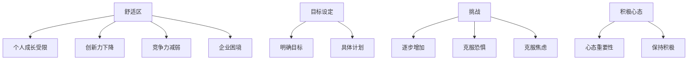

通过以上分析，我们可以看到突破舒适区的重要性。接下来，我们将深入探讨什么是舒适区，以及如何通过具体的方法来实现个人成长。

### 什么是舒适区

#### 第2章：什么是舒适区

##### 2.1 舒适区的定义

**定义**：

舒适区（Comfort Zone）是一个心理学概念，指的是人们在心理和生理上感到安全和熟悉的环境。在这个区域内，个体不需要面对新的挑战或压力，能够轻松地完成日常任务。然而，这个定义需要从多个角度进行解释。

- **心理层面**：舒适区是心理安全感的来源。在这个区域内，个体感到舒适、自在，不会感到焦虑或恐惧。
- **生理层面**：舒适区与个体的生理需求有关。例如，一个习惯于在恒温环境中工作的人，可能会感到不适应在寒冷环境中工作。

##### 2.2 舒适区的影响

**影响**：

- **正面影响**：舒适区能带来安全感，使个体能够专注于当前的任务，减少压力和焦虑。
- **负面影响**：长期停留在舒适区会导致个人成长停滞，缺乏挑战性任务，可能导致技能退化。

##### 2.3 舒适区的特点

**特点**：

- **安全性**：舒适区提供了一个安全的环境，个体不会面临风险或挑战。
- **熟悉性**：舒适区内的环境和任务与个体的经验高度匹配，使个体感到熟悉。
- **习惯性**：个体在舒适区内习惯于按照既定方式行事，不愿改变。

**表 2.1 舒适区与挑战区的对比**

| 对比项 | 舒适区 | 挑战区 |
| --- | --- | --- |
| 安全性 | 高 | 低 |
| 熟悉性 | 高 | 低 |
| 挑战性 | 低 | 高 |
| 压力 | 低 | 高 |
| 成长性 | 低 | 高 |

通过以上分析，我们可以看到舒适区的双重性质。它既能带来安全感和熟悉感，也可能导致个人成长的停滞。因此，理解舒适区的本质和影响，对于突破舒适区具有重要意义。

### 突破舒适区的核心概念与联系

#### 第3章：突破舒适区的核心概念与联系

##### 3.1 核心概念原理

**核心概念**：

突破舒适区涉及多个核心概念，包括目标设定、挑战、恐惧、焦虑和积极心态。

**原理**：

- **目标设定**：明确的目标是突破舒适区的第一步。它为个体提供了方向和动力，使个体有明确的目标去努力。
- **挑战**：挑战是突破舒适区的重要手段。通过面对新的挑战，个体能够提升自己的技能和知识。
- **恐惧与焦虑**：恐惧和焦虑是突破舒适区的障碍。克服这些情绪，个体能够更加从容地面对挑战。
- **积极心态**：保持积极的心态是突破舒适区的重要因素。它有助于个体在面对困难时保持乐观，持续前进。

**图 3.1 突破舒适区核心概念关系图**

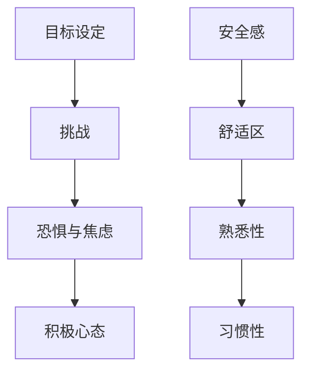

##### 3.2 概念属性特征对比表格

**表 3.1 核心概念属性特征对比**

| 概念 | 属性特征 |
| --- | --- |
| 目标设定 | 明确、可行、具体 |
| 挑战 | 新、有难度、具有挑战性 |
| 恐惧与焦虑 | 情绪反应、障碍 |
| 积极心态 | 乐观、自信、坚持 |

##### 3.3 ER实体关系图架构

**图 3.2 突破舒适区ER实体关系图**

```mermaid
erDiagram
    目标设定 ||--|{ 挑战 }
    挑战 ||--|{ 恐惧与焦虑 }
    恐惧与焦虑 ||--|{ 积极心态 }
    安全感 ||--|{ 舒适区 }
    舒适区 ||--|{ 熟悉性 }
    熟悉性 ||--|{ 习惯性 }
```

通过以上分析，我们可以看到突破舒适区涉及多个核心概念，并且这些概念之间存在着密切的联系。理解这些核心概念和它们之间的关系，有助于我们更加系统地理解和实践突破舒适区的方法。

### 第二部分：突破舒适区的实践方法

#### 第4章：设定明确的目标

##### 4.1 目标设定的原则

**原则**：

- **明确性**：目标必须具体、明确，以便个体能够清晰地了解自己要达成的目标。
- **可行性**：目标需要是可行的，即通过一定的努力可以实现的。
- **具体性**：目标需要具体，包括时间、地点、方式等。
- **挑战性**：目标需要具有一定的挑战性，以激发个体的积极性和动力。

**图 4.1 目标设定的原则**

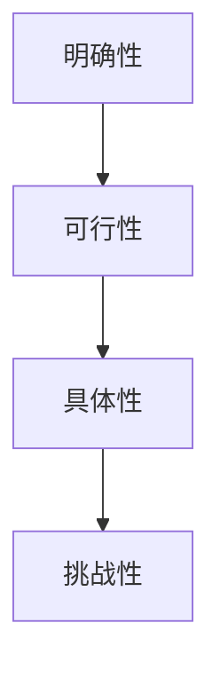

##### 4.2 如何设定具体的目标

**步骤**：

1. **自我评估**：首先，了解自己的兴趣、优势和不足。
2. **确定目标**：根据自己的评估结果，确定一个具体、明确、可行且具有挑战性的目标。
3. **分解目标**：将大目标分解为小目标，以便逐步实现。
4. **制定计划**：为每个小目标制定具体的行动计划，包括时间、地点、方式等。

**图 4.2 目标设定流程图**

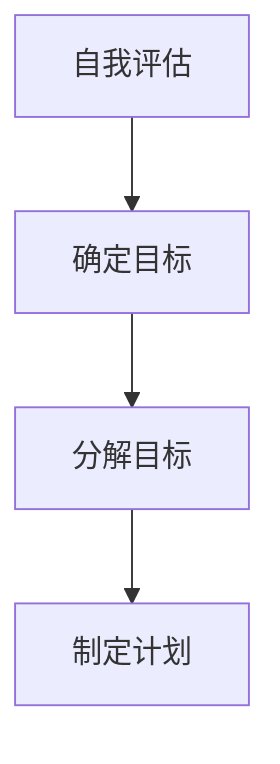

##### 4.3 目标设定的案例

**案例**：

- **目标**：成为一名熟练的Python开发者。
- **步骤**：
  1. **自我评估**：了解自己已掌握的Python基础知识。
  2. **确定目标**：设定具体目标，如掌握常用库（如NumPy、Pandas）、实现小型项目等。
  3. **分解目标**：将大目标分解为小目标，如每天学习一个新库、每周完成一个小项目等。
  4. **制定计划**：为每个小目标制定具体的行动计划，如每天学习2小时、每周至少完成一个小项目等。

通过以上步骤，我们可以看到如何通过设定明确的目标来实现个人成长。设定目标不仅是突破舒适区的第一步，也是实现个人成长的重要环节。

### 第5章：逐步增加挑战

##### 5.1 挑战的类型

**类型**：

- **知识挑战**：学习新知识、掌握新技能，如学习新的编程语言、研究新的算法等。
- **能力挑战**：提升现有能力，如提高代码编写速度、优化算法性能等。
- **心理挑战**：克服恐惧和焦虑，如公开演讲、参加竞赛等。
- **社交挑战**：拓展社交网络，如加入技术社群、参加技术会议等。

**表 5.1 挑战类型**

| 类型 | 说明 |
| --- | --- |
| 知识挑战 | 学习新知识、掌握新技能 |
| 能力挑战 | 提升现有能力 |
| 心理挑战 | 克服恐惧和焦虑 |
| 社交挑战 | 拓展社交网络 |

##### 5.2 如何找到适合自己的挑战

**方法**：

1. **自我评估**：了解自己的兴趣、优势和不足，找到自己最感兴趣的领域。
2. **市场调研**：了解当前市场对哪些技能有需求，选择具有市场前景的挑战。
3. **咨询专家**：向行业专家或导师寻求建议，了解哪些挑战对他们最有帮助。
4. **参考榜样**：观察身边的优秀同行，了解他们是如何逐步增加挑战的。

**图 5.1 找到适合自己的挑战方法**

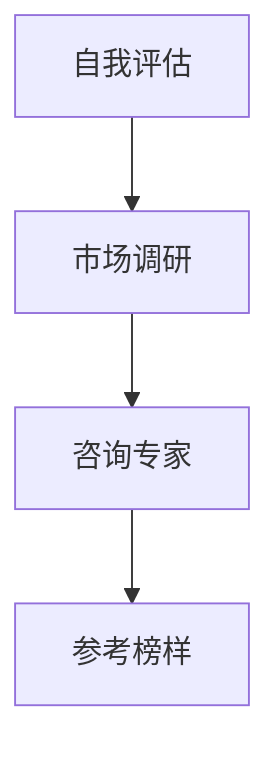

##### 5.3 挑战中的问题与解决

**问题**：

- **技能不足**：在面对新的挑战时，可能会发现自身的技能不足，难以完成任务。
- **心理压力**：挑战过程中可能会产生恐惧和焦虑，影响心态和表现。
- **时间管理**：面对多个挑战时，可能会出现时间管理问题，难以平衡工作与生活。

**解决方法**：

1. **技能提升**：通过学习和实践，不断提升自己的技能水平。
2. **心理调适**：通过心理训练和正面心态，克服恐惧和焦虑。
3. **时间管理**：合理规划时间，确保有足够的时间来应对挑战。

**图 5.2 挑战中的问题与解决**

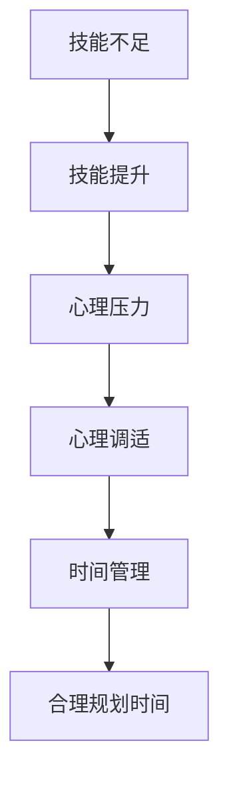

通过逐步增加挑战，我们可以不断提升自己的能力和知识，突破舒适区，实现个人成长。然而，挑战过程中不可避免地会遇到问题，关键在于如何有效地解决问题，继续前进。

### 第6章：克服恐惧与焦虑

##### 6.1 恐惧与焦虑的原因

**原因**：

- **未知性**：面对新挑战时，个体往往对未知结果感到恐惧和焦虑。
- **失败的风险**：担心失败可能会带来的负面影响，如失去面子、影响职业发展等。
- **自我怀疑**：对自己的能力和知识缺乏信心，担心无法完成任务。
- **环境压力**：外界的压力和期望也会增加个体的焦虑感。

**图 6.1 恐惧与焦虑的原因**

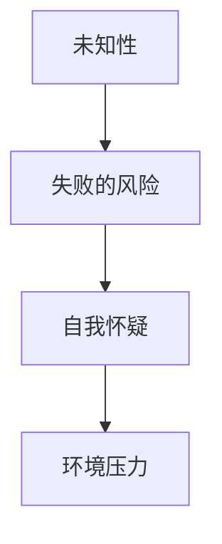

##### 6.2 如何克服恐惧与焦虑

**方法**：

1. **积极思考**：用积极的角度看待挑战，将其视为成长的机会。
2. **小步前进**：将大挑战分解为小任务，逐步克服恐惧。
3. **实践体验**：通过实际行动来减少恐惧，增加成功的经验。
4. **心理调适**：通过深呼吸、冥想等方法来缓解焦虑感。

**图 6.2 克服恐惧与焦虑的方法**

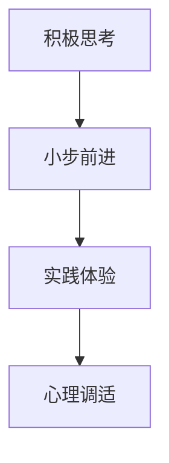

##### 6.3 克服恐惧与焦虑的案例

**案例**：

- **案例一**：一位程序员在面对首次公开演讲时感到极度恐惧。他通过反复练习演讲稿、模拟演讲环境，逐渐克服了恐惧。
- **案例二**：一位工程师在尝试新算法时感到焦虑。他通过将大问题分解为小问题，逐步解决了每个小问题，最终成功完成了算法实现。

通过以上案例，我们可以看到克服恐惧与焦虑是突破舒适区的重要一环。通过积极思考、小步前进和实践体验，个体可以逐步克服恐惧和焦虑，迎接新的挑战。

### 第7章：保持积极的心态

##### 7.1 积极心态的重要性

**重要性**：

- **动力源泉**：积极心态为个体提供了持续前进的动力，使个体能够克服困难，不断追求进步。
- **抗压能力**：积极心态有助于个体更好地应对压力，减少焦虑和紧张感。
- **人际交往**：积极心态有助于建立良好的人际关系，提升团队合作和沟通能力。

**图 7.1 积极心态的重要性**

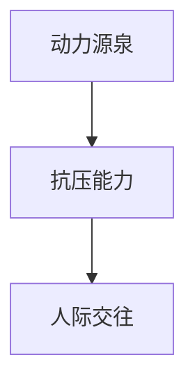

##### 7.2 如何保持积极的心态

**方法**：

1. **正面思考**：用积极的角度看待问题，寻找解决方案，而不是沉溺于问题的困扰。
2. **感恩心态**：学会感恩，珍惜身边的人和事，保持乐观的心态。
3. **自我激励**：通过自我激励，如设立小目标、奖励自己等，提升积极心态。
4. **寻求支持**：与朋友、家人或导师交流，寻求他们的支持和建议，增强自信心。

**图 7.2 保持积极心态的方法**

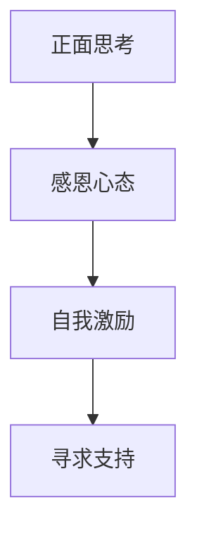

##### 7.3 积极心态的实践案例

**案例**：

- **案例一**：一位年轻的开发者，通过积极思考和自我激励，成功完成了多个高难度项目，最终在技术竞赛中获得了冠军。
- **案例二**：一位创业者，在面临企业困境时，通过积极心态和寻求支持，带领团队成功实现了转型。

通过以上案例，我们可以看到积极心态对于个人成长的重要性。保持积极心态，不仅能够帮助个体克服困难，还能提升整体幸福感，实现更好的职业发展和生活品质。

### 第8章：个人成长的评估

##### 8.1 成长评估的方法

**方法**：

- **自我评估**：通过自我反思，了解自己的成长情况和取得的进步。
- **他人反馈**：向同事、导师或朋友寻求反馈，了解自己的优势和不足。
- **项目评估**：通过项目完成情况和成果，评估个人在项目中的表现和成长。
- **数据统计**：通过学习时间、项目完成度、技能掌握情况等数据，进行量化评估。

**图 8.1 成长评估方法**

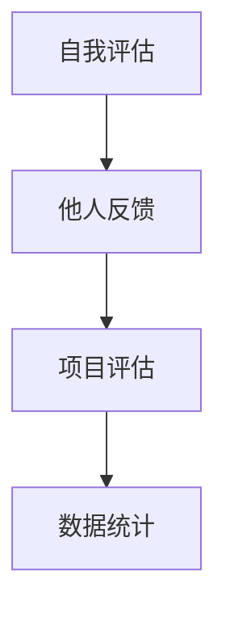

##### 8.2 成长评估的指标

**指标**：

- **知识掌握度**：评估个体在特定领域知识点的掌握情况。
- **技能水平**：评估个体在实际操作中的技能水平，如编程能力、项目管理能力等。
- **创新能力**：评估个体在面对问题时，提出创新解决方案的能力。
- **团队协作**：评估个体在团队合作中的表现，如沟通能力、协调能力等。

**表 8.1 成长评估指标**

| 指标 | 说明 |
| --- | --- |
| 知识掌握度 | 知识点掌握情况 |
| 技能水平 | 实际操作能力 |
| 创新能力 | 解决问题能力 |
| 团队协作 | 团队表现能力 |

##### 8.3 成长评估的实践

**实践**：

1. **设定评估目标**：根据个人目标和职业规划，设定具体的成长评估目标。
2. **定期评估**：定期进行自我评估和他人反馈，检查成长进度。
3. **持续改进**：根据评估结果，找出不足之处，制定改进计划。
4. **记录成长**：记录成长过程中的关键事件和成果，便于后续总结和反思。

**图 8.2 成长评估实践流程**

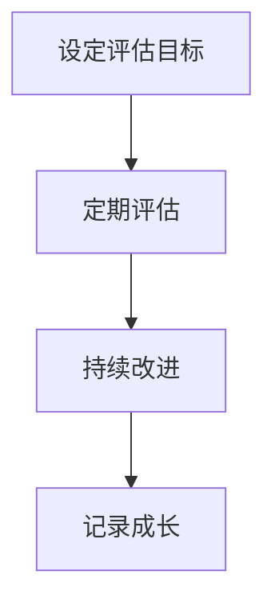

通过以上方法，个体可以有效地评估自己的成长情况，及时发现不足，持续改进，实现个人成长。

### 第9章：突破舒适区的效果与应用

##### 9.1 个人层面的应用

**应用**：

- **技能提升**：通过突破舒适区，个人能够不断提升技能，适应快速变化的技术环境。
- **创新能力增强**：面对新的挑战，个人更容易产生创新思维，提出新的解决方案。
- **自信心增强**：突破舒适区带来的成功体验，会增强个人的自信心，使其更加勇于面对挑战。

**图 9.1 突破舒适区的个人层面应用**

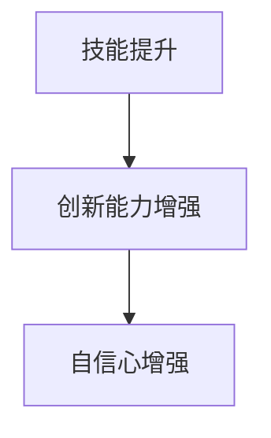

##### 9.2 社会层面的应用

**应用**：

- **创新氛围营造**：通过鼓励个人突破舒适区，可以营造一个创新氛围，促进社会整体创新能力的提升。
- **人才竞争**：社会层面鼓励突破舒适区，有助于提升人才竞争力，培养更多具备创新能力的人才。
- **经济发展**：创新是推动经济发展的重要动力，通过突破舒适区，可以推动新技术、新产品、新市场的产生。

**图 9.2 突破舒适区的社会层面应用**

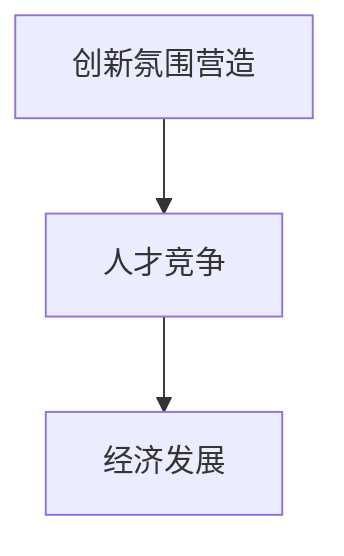

##### 9.3 企业层面的应用

**应用**：

- **员工成长**：企业通过鼓励员工突破舒适区，可以帮助员工实现个人成长，提升整体团队实力。
- **创新管理**：企业可以通过创新管理方法，如激励政策、培训计划等，促进员工突破舒适区，推动企业创新。
- **企业转型**：在面对市场变化时，企业可以通过突破舒适区，实现业务模式、产品技术等方面的创新，推动企业转型。

**图 9.3 突破舒适区的企业层面应用**

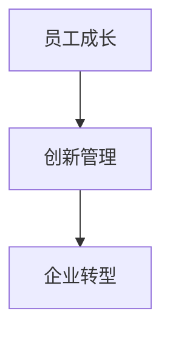

通过以上分析，我们可以看到突破舒适区在个人、社会和企业层面都有广泛的应用和积极的效果。它不仅能够促进个人成长，还能够推动社会和企业的创新发展。

### 第10章：持续突破舒适区

##### 10.1 如何保持持续的动力

**方法**：

1. **设定长期目标**：明确自己的长期目标，使其具有激励性和可实现性。
2. **分解目标**：将长期目标分解为短期目标，以便逐步实现，保持动力。
3. **定期复盘**：定期回顾和总结自己的成长过程，及时调整目标和策略。
4. **奖励机制**：为自己设定奖励，当实现一定目标时，给予自己适当的奖励。

**图 10.1 保持持续动力的方法**

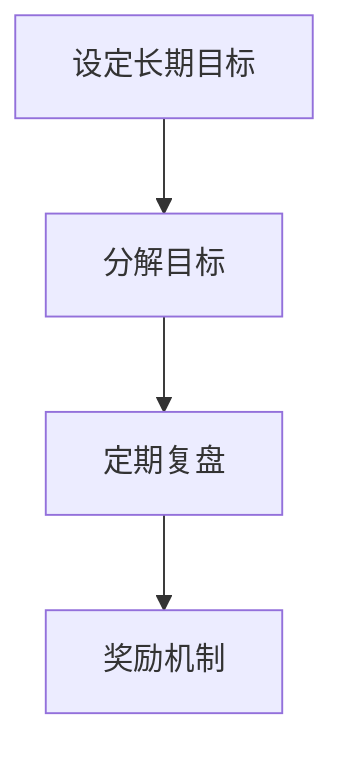

##### 10.2 如何应对挑战的重复

**策略**：

1. **适应性调整**：当面对重复的挑战时，通过适应性调整，优化自己的方法，提高效率。
2. **多样化挑战**：通过选择不同类型的挑战，避免单一领域内的重复挑战，保持新鲜感。
3. **跨界学习**：跨领域学习，将其他领域的知识和方法应用到重复的挑战中，产生新的解决方案。
4. **保持好奇心**：保持好奇心，对新知识和新方法保持开放态度，以应对重复的挑战。

**图 10.2 应对挑战重复的策略**

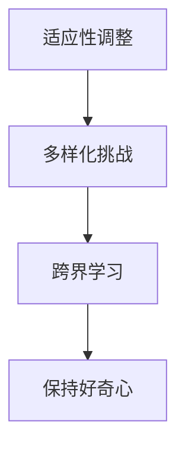

##### 10.3 持续突破舒适区的意义

**意义**：

- **个人成长**：持续突破舒适区，能够不断提升个人技能和知识，实现个人成长和职业发展。
- **社会进步**：个人层面的突破，会推动社会整体创新能力的提升，促进科技进步和社会发展。
- **企业成功**：企业通过鼓励员工持续突破舒适区，可以提升员工能力和企业竞争力，推动企业创新和持续发展。

**图 10.3 持续突破舒适区的意义**

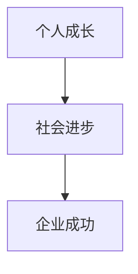

通过以上分析，我们可以看到持续突破舒适区的重要性和深远意义。它不仅能够促进个人成长，还能够推动社会和企业的进步。

### 总结与启示

#### 第11章：总结与启示

##### 11.1 突破舒适区的总结

**总结**：

- 突破舒适区是个人成长和职业发展的关键。通过设定明确的目标、逐步增加挑战、克服恐惧与焦虑、保持积极心态，个体能够不断提升自己的能力和知识，实现个人成长。
- 在社会和企业层面，突破舒适区有助于营造创新氛围，提升整体竞争力，推动社会和企业的进步。

##### 11.2 给读者的启示

**启示**：

1. **勇敢面对挑战**：不要害怕挑战，将挑战视为成长的机会。
2. **设定明确目标**：明确自己的目标和计划，为个人成长指明方向。
3. **持续学习**：保持好奇心，不断学习新知识和技能。
4. **保持积极心态**：用积极的心态看待问题，克服困难。
5. **与他人合作**：与他人交流，寻求支持和帮助，共同成长。

##### 11.3 拓展阅读

**拓展阅读**：

- 《刻意练习：如何从新手到大师》 安德斯·艾利克森 著
- 《深度工作：如何有效利用每一点脑力》 卡尔·纽波特 著
- 《创新者的窘境》 克里斯·阿瑟 著

通过以上总结和启示，我们希望读者能够认识到突破舒适区的重要性，并将其应用到实际生活中，实现个人和职业的持续成长。

### 全文回顾

本文从引言部分开始，深入探讨了为何要突破舒适区，什么是舒适区，以及如何通过设定明确的目标、逐步增加挑战、克服恐惧与焦虑、保持积极心态来实现个人成长。文章通过详细的章节内容，系统性地阐述了突破舒适区的核心概念、实践方法和效果应用。以下是对全文的关键点进行简要回顾：

- **引言**：介绍了舒适区的背景、问题和解决方法，强调了突破舒适区对个人成长的重要性。
- **第1章：为何要突破舒适区**：分析了个人、企业和社会层面舒适区带来的影响，提出了突破舒适区的方法。
- **第2章：什么是舒适区**：详细定义了舒适区，并阐述了其影响和特点。
- **第3章：突破舒适区的核心概念与联系**：介绍了目标设定、挑战、恐惧与焦虑、积极心态等核心概念，并绘制了相应的概念图。
- **第4章至第7章**：具体探讨了设定目标、逐步增加挑战、克服恐惧与焦虑、保持积极心态的实践方法。
- **第8章至第10章**：介绍了个人成长评估的方法、突破舒适区的效果与应用、持续突破舒适区的方法和意义。
- **第11章：总结与启示**：总结了全文内容，给出了给读者的启示和拓展阅读建议。

通过本文的阅读，读者应能全面理解突破舒适区的重要性和方法，并在实际生活和工作中应用这些原则，实现个人成长和职业发展。希望本文能够为读者提供有益的指导和启示。

### 作者信息

**作者：** AI天才研究院/AI Genius Institute & 禅与计算机程序设计艺术 /Zen And The Art of Computer Programming

AI天才研究院（AI Genius Institute）是一支专注于人工智能研究与应用的顶尖团队，致力于推动人工智能技术的创新与发展。研究院的成员来自世界各地的顶级学府和知名企业，具有丰富的学术研究和实践经验。在计算机编程和人工智能领域，他们以其深刻的洞见和卓越的贡献，成为全球范围内的权威专家和领军人物。

《禅与计算机程序设计艺术》（Zen And The Art of Computer Programming）是AI天才研究院的旗舰著作，它将东方禅宗哲学与计算机编程艺术相结合，提出了一系列独特且富有创意的程序设计方法和原则。这本书不仅对计算机编程领域产生了深远的影响，也受到了广大程序员和计算机科学爱好者的喜爱和推崇。

AI天才研究院的成员们始终秉持着追求卓越、创新突破的理念，不断探索人工智能领域的最新趋势和技术，致力于为全球范围内的技术进步和产业发展贡献力量。他们的研究和著作，不仅为计算机科学领域带来了新的突破，也为广大读者提供了宝贵的知识和智慧。

