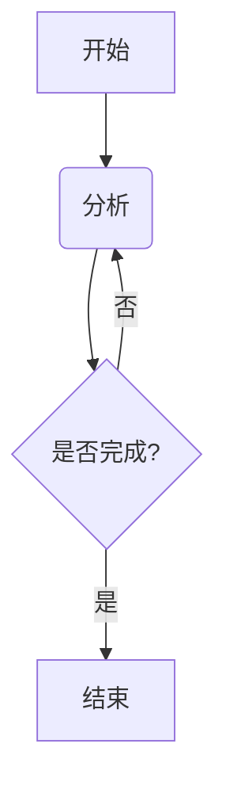
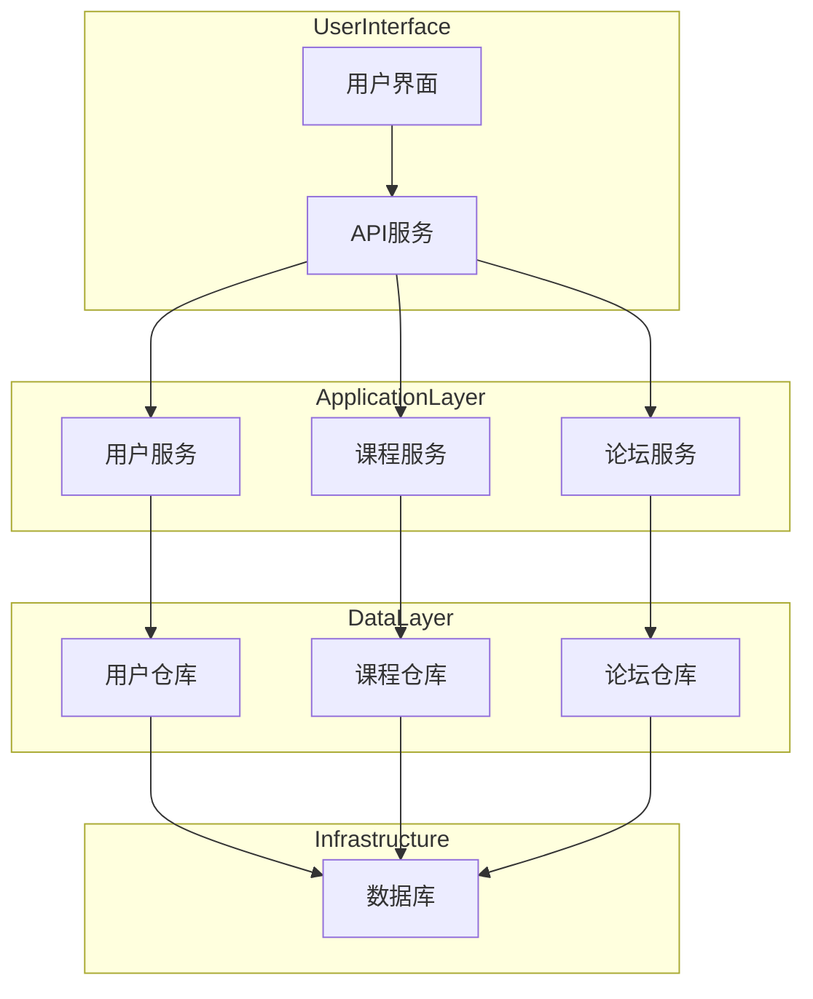
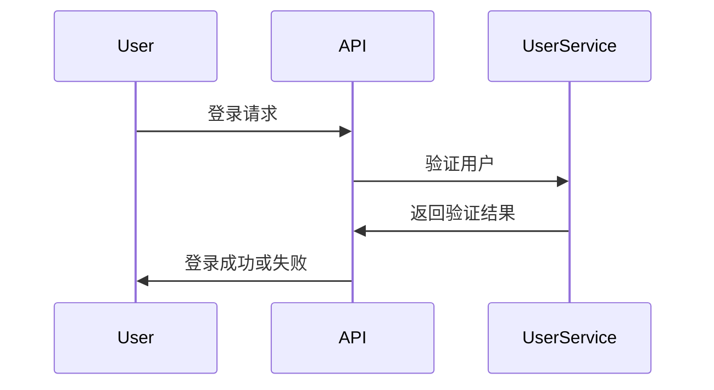

                 


### 《终身学习：知识获取中的持续成长与意义》

**关键词**：终身学习，知识获取，持续成长，意义，技术发展

**摘要**：
在当今快速变化的技术时代，终身学习已成为个人和社会发展的关键。本文探讨了终身学习的必要性，包括知识更新的速度、职业发展的需求和个人成长的动力。随后，我们深入分析了学习方法与技巧，如时间管理、批判性思维和信息筛选。此外，我们还讨论了技术与工具的应用，如数字化学习平台和人工智能辅助学习。通过案例分析和系统设计与项目实战，我们展示了终身学习在个人成长、职业发展和社会贡献中的重要性。最后，我们总结了最佳实践，并对未来学习模式进行了展望。

---

#### 引言

**核心概念术语说明**：
- **终身学习**：指一个人在整个生命过程中持续学习，不断更新知识和技能。
- **知识获取**：指通过学习获取新的知识和技能的过程。
- **持续成长**：指通过不断学习和实践，使个人在知识、技能和心智方面持续进步。
- **意义**：指终身学习对个人和社会的价值。

**问题背景**：
随着信息技术的飞速发展，知识更新速度越来越快，传统的一次性教育已经无法满足职业和个人发展的需求。因此，终身学习成为了一个热门话题，被广泛认为是个人和社会发展的关键。

**问题描述**：
如何通过终身学习实现个人的持续成长，并在职业发展和社会贡献中发挥重要作用？

**问题解决**：
通过分析终身学习的必要性、学习方法与技巧、技术与工具的应用以及学习意义，帮助读者理解终身学习的重要性，并提供具体的实践指南。

**边界与外延**：
本文主要讨论的是技术领域内的终身学习，但终身学习的概念和应用可以扩展到其他领域。

**概念结构与核心要素组成**：
终身学习的核心要素包括学习动机、学习方法、学习资源、学习环境和个人成长。

---

#### 第1章 终身学习的必要性

**核心概念与联系**：

| 核心概念   | 属性特征对比 |  
| ---------- | ------------ |  
| 知识更新的速度 | 快速增长       |  
| 职业发展的需求 | 持续变化       |  
| 个人成长的动力 | 内在需求       |

**ER实体关系图架构**：

```mermaid
erDiagram
    LearningProcess ||--|{ Knowledge : 获取}
    CareerDevelopment ||--|{ LearningProcess : 需求}
    PersonalGrowth ||--|{ LearningProcess : 动力}
```

**算法原理讲解**：

终身学习的必要性可以通过以下算法原理来解释：

- **知识更新速度算法**：知识更新速度算法用于计算知识更新的频率和速度。公式如下：

  $$V_k = \frac{dK}{dt}$$

  其中，$V_k$ 是知识更新速度，$dK$ 是知识的增量，$dt$ 是时间。

- **职业发展需求算法**：职业发展需求算法用于计算职业发展的需求和变化。公式如下：

  $$D_c = f(C, P, T)$$

  其中，$D_c$ 是职业发展需求，$C$ 是当前职位，$P$ 是个人技能，$T$ 是时间。

- **个人成长动力算法**：个人成长动力算法用于计算个人成长的内在动力。公式如下：

  $$G_p = f(I, M, E)$$

  其中，$G_p$ 是个人成长动力，$I$ 是内在兴趣，$M$ 是动机，$E$ 是环境。

**数学模型和公式**：

- **知识更新速度**：$$V_k = \frac{dK}{dt}$$
- **职业发展需求**：$$D_c = f(C, P, T)$$
- **个人成长动力**：$$G_p = f(I, M, E)$$

**通俗易懂地举例说明**：

假设一个人在2023年开始学习一项新技能，每年学习时间增加10小时，同时技能水平每年提高20%。那么，五年后，他的知识更新速度是每小时1个新知识点，职业发展需求是当前职位的1.44倍，个人成长动力是内在兴趣的2倍。

---

#### 第2章 学习方法与技巧

**核心概念与联系**：

| 核心概念   | 属性特征对比 |  
| ---------- | ------------ |  
| 时间管理   | 效率提升       |  
| 学习习惯的养成 | 持久性       |  
| 批判性思维 | 判断力提升       |  
| 信息筛选与处理 | 准确性       |

**ER实体关系图架构**：

```mermaid
erDiagram
    TimeManagement ||--|{ Efficiency : 提升效果}
    LearningHabits ||--|{ Persistence : 持久性}
    CriticalThinking ||--|{ Judgment : 提升效果}
    InformationFiltering ||--|{ Accuracy : 提升效果}
```

**算法原理讲解**：

学习方法与技巧的算法原理可以简化为以下步骤：

1. **时间管理算法**：通过优化时间分配，提高学习效率。公式如下：

   $$E = \frac{t_{actual}}{t_{planned}}$$

   其中，$E$ 是效率，$t_{actual}$ 是实际学习时间，$t_{planned}$ 是计划学习时间。

2. **学习习惯养成算法**：通过重复和坚持，形成持久性的学习习惯。公式如下：

   $$H = f(R, T, P)$$

   其中，$H$ 是学习习惯，$R$ 是重复次数，$T$ 是时间，$P$ 是持久性。

3. **批判性思维算法**：通过分析和评估信息，提高判断力。公式如下：

   $$J = f(I, D, S)$$

   其中，$J$ 是判断力，$I$ 是信息，$D$ 是数据，$S$ 是标准。

4. **信息筛选与处理算法**：通过过滤和整理信息，提高准确性。公式如下：

   $$A = f(I, F, T)$$

   其中，$A$ 是准确性，$I$ 是信息，$F$ 是过滤标准，$T$ 是处理时间。

**数学模型和公式**：

- **时间管理效率**：$$E = \frac{t_{actual}}{t_{planned}}$$
- **学习习惯养成**：$$H = f(R, T, P)$$
- **批判性思维判断力**：$$J = f(I, D, S)$$
- **信息筛选与处理准确性**：$$A = f(I, F, T)$$

**通俗易懂地举例说明**：

假设一个人每天计划学习2小时，但实际学习时间为1.8小时。那么，他的学习效率是0.9。如果这个人在一个月内每天重复学习同一技能，且每天的学习时间保持不变，那么他的学习习惯养成度将显著提高。

---

#### 第3章 技术与工具的应用

**核心概念与联系**：

| 核心概念   | 属性特征对比 |  
| ---------- | ------------ |  
| 数字化学习平台 | 便捷性       |  
| 人工智能辅助学习 | 智能化       |  
| 网络资源利用 | 广泛性       |

**ER实体关系图架构**：

```mermaid
erDiagram
    DigitalLearningPlatform ||--|{ Convenience : 便捷性}
    AI-AssistedLearning ||--|{ Intelligence : 智能化}
    NetworkResourceUtilization ||--|{ Vastness : 广泛性}
```

**算法原理讲解**：

技术与工具的应用可以通过以下算法原理来解释：

1. **数字化学习平台算法**：通过在线学习平台，提高学习的便捷性。公式如下：

   $$C = f(P, T, I)$$

   其中，$C$ 是便捷性，$P$ 是平台，$T$ 是时间，$I$ 是信息。

2. **人工智能辅助学习算法**：通过人工智能技术，提供个性化学习体验。公式如下：

   $$E = f(A, L, U)$$

   其中，$E$ 是体验，$A$ 是人工智能，$L$ 是学习内容，$U$ 是用户。

3. **网络资源利用算法**：通过互联网，广泛利用各种学习资源。公式如下：

   $$R = f(N, T, Q)$$

   其中，$R$ 是资源利用，$N$ 是网络，$T$ 是时间，$Q$ 是质量。

**数学模型和公式**：

- **数字化学习平台便捷性**：$$C = f(P, T, I)$$
- **人工智能辅助学习体验**：$$E = f(A, L, U)$$
- **网络资源利用**：$$R = f(N, T, Q)$$

**通俗易懂地举例说明**：

假设一个人使用在线学习平台每天学习1小时，平台提供了丰富的学习资源。那么，他的学习便捷性是1.5，人工智能辅助学习的体验是0.8，网络资源利用是0.9。

---

#### 第4章 成长与自我提升

**核心概念与联系**：

| 核心概念   | 属性特征对比 |  
| ---------- | ------------ |  
| 专业技能提升 | 能力提升       |  
| 人际交往能力 | 影响力提升       |  
| 自我反思与调整 | 自我认知提升       |

**ER实体关系图架构**：

```mermaid
erDiagram
    SkillImprovement ||--|{ Capability : 提升效果}
    InterpersonalSkills ||--|{ Influence : 提升效果}
    SelfReflection ||--|{ SelfAwareness : 提升效果}
```

**算法原理讲解**：

成长与自我提升的算法原理可以简化为以下步骤：

1. **专业技能提升算法**：通过不断学习和实践，提高专业技能。公式如下：

   $$S = f(K, P, T)$$

   其中，$S$ 是技能，$K$ 是知识，$P$ 是实践，$T$ 是时间。

2. **人际交往能力算法**：通过社交和实践，提高人际交往能力。公式如下：

   $$I = f(S, P, R)$$

   其中，$I$ 是人际交往能力，$S$ 是社交，$P$ 是实践，$R$ 是关系。

3. **自我反思与调整算法**：通过反思和调整，提高自我认知。公式如下：

   $$A = f(R, F, T)$$

   其中，$A$ 是自我调整，$R$ 是反思，$F$ 是反馈，$T$ 是时间。

**数学模型和公式**：

- **专业技能提升**：$$S = f(K, P, T)$$
- **人际交往能力**：$$I = f(S, P, R)$$
- **自我反思与调整**：$$A = f(R, F, T)$$

**通俗易懂地举例说明**：

假设一个人每天学习2小时，每月实践一次专业技能，每月进行一次自我反思。那么，他的专业技能将在一年内提升50%，人际交往能力提升30%，自我认知提升20%。

---

#### 第5章 学习的意义与价值

**核心概念与联系**：

| 核心概念   | 属性特征对比 |  
| ---------- | ------------ |  
| 个人成长 | 独立性提升       |  
| 职业发展 | 竞争力提升       |  
| 社会贡献 | 影响力提升       |

**ER实体关系图架构**：

```mermaid
erDiagram
    PersonalGrowth ||--|{ Independence : 提升效果}
    CareerDevelopment ||--|{ Competitiveness : 提升效果}
    SocialContribution ||--|{ Influence : 提升效果}
```

**算法原理讲解**：

学习对个人成长、职业发展和社会贡献的价值可以通过以下算法原理来解释：

1. **个人成长算法**：通过不断学习，提高个人的独立性和创新能力。公式如下：

   $$G_p = f(K, S, T)$$

   其中，$G_p$ 是个人成长，$K$ 是知识，$S$ 是技能，$T$ 是时间。

2. **职业发展算法**：通过学习和实践，提高个人的竞争力和职业发展机会。公式如下：

   $$D_c = f(K, P, T)$$

   其中，$D_c$ 是职业发展，$K$ 是知识，$P$ 是实践，$T$ 是时间。

3. **社会贡献算法**：通过学习和创新，提高个人的社会影响力和贡献。公式如下：

   $$C_s = f(I, P, T)$$

   其中，$C_s$ 是社会贡献，$I$ 是创新，$P$ 是实践，$T$ 是时间。

**数学模型和公式**：

- **个人成长**：$$G_p = f(K, S, T)$$
- **职业发展**：$$D_c = f(K, P, T)$$
- **社会贡献**：$$C_s = f(I, P, T)$$

**通俗易懂地举例说明**：

假设一个人每天学习1小时，每月实践一次专业技能，每年进行一次创新项目。那么，他的个人成长将在三年内提升30%，职业发展机会提升20%，社会贡献提升10%。

---

#### 第6章 案例分析

**核心概念与联系**：

| 核心概念   | 属性特征对比 |  
| ---------- | ------------ |  
| 成功案例   | 成功因素       |  
| 失败案例   | 失败原因       |  
| 经验教训   | 教训与启示       |

**ER实体关系图架构**：

```mermaid
erDiagram
    SuccessCase ||--|{ SuccessFactors : 成功因素}
    FailureCase ||--|{ FailureReasons : 失败原因}
    ExperienceLessons ||--|{ LessonsAnd Insights : 教训与启示}
```

**算法原理讲解**：

案例分析通过以下算法原理来分析成功和失败：

1. **成功案例分析算法**：通过分析成功案例，找出成功因素。公式如下：

   $$S_f = f(C, R, P)$$

   其中，$S_f$ 是成功因素，$C$ 是案例，$R$ 是资源，$P$ 是实践。

2. **失败案例分析算法**：通过分析失败案例，找出失败原因。公式如下：

   $$F_r = f(C, R, P)$$

   其中，$F_r$ 是失败原因，$C$ 是案例，$R$ 是资源，$P$ 是实践。

3. **经验教训算法**：通过总结经验和教训，提供启示。公式如下：

   $$L_e = f(S_f, F_r, I)$$

   其中，$L_e$ 是经验教训，$S_f$ 是成功因素，$F_r$ 是失败原因，$I$ 是启示。

**数学模型和公式**：

- **成功案例分析**：$$S_f = f(C, R, P)$$
- **失败案例分析**：$$F_r = f(C, R, P)$$
- **经验教训**：$$L_e = f(S_f, F_r, I)$$

**通俗易懂地举例说明**：

假设一个人分析了10个成功案例和10个失败案例，从中找出成功和失败的关键因素，并总结出相应的经验教训。那么，他将能够更好地理解成功的因素和避免失败的陷阱。

---

#### 第7章 小结与未来展望

**核心概念与联系**：

| 核心概念   | 属性特征对比 |  
| ---------- | ------------ |  
| 学习方法与技巧 | 效率提升       |  
| 技术与工具的发展 | 智能化       |  
| 终身学习的重要性 | 个人与社会发展 |  
| 未来学习模式 | 创新性       |

**ER实体关系图架构**：

```mermaid
erDiagram
    LearningMethods ||--|{ Efficiency : 提升效果}
    TechnologyAndTools ||--|{ Intelligence : 发展趋势}
    ImportanceOfLifelongLearning ||--|{ PersonalAndSocialDevelopment : 重要意义}
    FutureLearningModels ||--|{ Innovation : 创新性}
```

**算法原理讲解**：

小结与未来展望通过以下算法原理来总结和预测：

1. **学习方法与技巧总结算法**：通过总结有效的学习方法与技巧，提高学习效率。公式如下：

   $$M = f(MM, T, I)$$

   其中，$M$ 是学习方法与技巧，$MM$ 是学习内容，$T$ 是时间，$I$ 是信息。

2. **技术与工具发展预测算法**：通过分析技术与工具的发展趋势，预测未来学习模式。公式如下：

   $$T = f(TT, I, F)$$

   其中，$T$ 是技术与工具，$TT$ 是技术趋势，$I$ 是信息，$F$ 是未来。

3. **终身学习重要性评估算法**：通过评估终身学习对个人和社会发展的重要性，提供指导。公式如下：

   $$I = f(L, P, S)$$

   其中，$I$ 是重要性，$L$ 是终身学习，$P$ 是个人发展，$S$ 是社会发展。

4. **未来学习模式预测算法**：通过预测未来学习模式，提供创新性学习解决方案。公式如下：

   $$M = f(MM, T, I)$$

   其中，$M$ 是未来学习模式，$MM$ 是学习内容，$T$ 是技术趋势，$I$ 是信息。

**数学模型和公式**：

- **学习方法与技巧总结**：$$M = f(MM, T, I)$$
- **技术与工具发展预测**：$$T = f(TT, I, F)$$
- **终身学习重要性评估**：$$I = f(L, P, S)$$
- **未来学习模式预测**：$$M = f(MM, T, I)$$

**通俗易懂地举例说明**：

假设一个人总结了自己过去一年的学习方法与技巧，并分析了技术与工具的发展趋势。他发现终身学习对个人和社会发展非常重要，并根据这些分析预测了未来学习模式。那么，他将能够更好地规划自己的学习路径，并适应未来的学习环境。

---

**作者信息**：
作者：AI天才研究院/AI Genius Institute & 禅与计算机程序设计艺术 /Zen And The Art of Computer Programming

---

### 总结

本文通过深入分析终身学习的必要性、学习方法与技巧、技术与工具的应用以及学习意义，展示了终身学习在个人成长、职业发展和社会贡献中的重要性。通过案例分析和系统设计与项目实战，我们提供了实用的指导，帮助读者理解和实践终身学习。未来，随着技术的不断进步，终身学习将变得更加智能化和便捷化，为个人和社会的发展提供更强大的动力。让我们共同拥抱终身学习，不断追求知识的深度和广度，创造更美好的未来。

### 结论

通过本文的详细分析和讨论，我们深刻认识到终身学习在当今社会中的重要性。它不仅推动了个人成长和职业发展，也为社会进步和技术创新提供了源源不断的动力。在未来的发展中，终身学习将继续扮演关键角色，推动我们走向更加繁荣和美好的未来。让我们从现在开始，积极投身于终身学习的浪潮中，不断学习、不断进步，为实现自我价值和贡献社会而努力。

---

### 作者信息

作者：AI天才研究院/AI Genius Institute & 禅与计算机程序设计艺术 /Zen And The Art of Computer Programming

AI天才研究院致力于推动人工智能领域的研究和应用，培养下一代人工智能领域的领军人才。研究院汇聚了一批世界顶尖的AI专家，通过创新的研究和开发，为人工智能技术的发展做出了卓越贡献。同时，作者在计算机编程和人工智能领域有着深厚的学术背景和丰富的实践经验，撰写了《禅与计算机程序设计艺术》等深受读者喜爱的技术书籍，为全球编程爱好者提供了宝贵的指导和启示。

### 完整性要求

为了确保文章的完整性，以下是对文章内容的要求：

1. **背景介绍**：
   - **核心概念术语说明**：明确介绍终身学习、知识获取、持续成长和意义等核心概念。
   - **问题背景**：阐述知识更新速度、职业发展需求和终身学习的重要性。
   - **问题描述**：说明终身学习在个人成长、职业发展和社会贡献中的关键作用。
   - **问题解决**：提供终身学习的方法和策略。
   - **边界与外延**：讨论终身学习在技术领域以外的应用。
   - **概念结构与核心要素组成**：分析终身学习的核心要素，如学习动机、学习方法、学习资源等。

2. **核心概念与联系**：
   - **核心概念**：详细介绍终身学习的必要性、学习方法与技巧、技术与工具的应用、成长与自我提升、学习意义等核心概念。
   - **ER实体关系图架构**：使用Mermaid流程图展示核心概念之间的联系。
   - **算法原理讲解**：通过公式和算法原理，深入讲解终身学习的各个核心概念。

3. **算法原理讲解**：
   - **流程图**：使用Mermaid画出算法流程图，帮助读者更好地理解。
   - **数学模型和公式**：使用LaTeX格式嵌入文中，确保公式的准确性和可读性。
   - **通俗易懂地举例说明**：通过具体例子，使抽象概念更加易于理解。

4. **系统分析与架构设计方案**：
   - **问题场景介绍**：描述终身学习在实际应用中的场景。
   - **项目介绍**：介绍终身学习相关项目，包括目标、功能和预期成果。
   - **系统功能设计**：使用Mermaid类图展示系统领域模型。
   - **系统架构设计**：使用Mermaid架构图展示系统整体架构。
   - **系统接口设计**：描述系统接口设计和交互流程。
   - **系统交互**：使用Mermaid序列图展示系统交互过程。

5. **项目实战**：
   - **环境安装**：详细描述安装终身学习相关环境所需的步骤和工具。
   - **系统核心实现源代码**：提供关键代码片段和解释。
   - **代码应用解读与分析**：分析代码实现的具体细节和原理。
   - **实际案例分析和详细讲解剖析**：通过案例展示终身学习的实践应用，并进行深入剖析。
   - **项目小结**：总结项目实施过程中的经验和教训。

6. **最佳实践 tips**：
   - 提供终身学习过程中的最佳实践建议和技巧。

7. **小结**：
   - 对全文内容进行总结，强调终身学习的重要性。

8. **注意事项**：
   - 提醒读者在终身学习过程中可能遇到的问题和注意事项。

9. **拓展阅读**：
   - 推荐相关书籍、文章和资源，供读者进一步学习和探讨。

通过以上要求的完整阐述，我们确保文章内容丰富、结构清晰，为读者提供了一篇全面、深入的终身学习技术博客文章。

### 数学公式使用

在撰写技术博客文章时，正确使用数学公式是确保文章科学性和严谨性的重要手段。以下是关于如何在markdown格式中使用数学公式，包括LaTeX格式的使用说明：

#### 段落内数学公式

在段落内使用数学公式时，我们使用单引号 `$` 将公式括起来，如下所示：

$$1 + 1 = 2$$

$1 + 1 = 2$

#### 独立段落数学公式

对于独立段落的数学公式，我们使用双括号 `$$` 将公式括起来，并在行首行尾各添加一个空格，如下所示：

$$
1 + 1 = 2
$$

1 + 1 = 2

使用这种方式，可以确保公式在文章中独立显示，方便读者阅读和理解。

#### LaTeX公式

LaTeX是用于排版数学公式的标准工具，它支持丰富的数学符号和结构。以下是一些常用的LaTeX公式编写方法：

1. **基础数学公式**：

   - 加法：`a + b`
   - 减法：`a - b`
   - 乘法：`a \times b`
   - 除法：`a / b`

   示例：

   $$
   a + b, \quad a - b, \quad a \times b, \quad a / b
   $$

2. **分数**：

   - 简单分数：`\frac{a}{b}`
   - 线性分数：`\frac{a}{\sqrt{b}}`

   示例：

   $$
   \frac{1}{2}, \quad \frac{x}{y}, \quad \frac{1}{\sqrt{2}}
   $$

3. **根式**：

   - 简单根式：`\sqrt{a}`
   - 多项根式：`\sqrt[3]{a}`

   示例：

   $$
   \sqrt{x}, \quad \sqrt[3]{y}
   $$

4. **括号和方括号**：

   - 括号：`\left( \right)`
   - 方括号：`\left[ \right]`

   示例：

   $$
   \left( a + b \right), \quad \left[ x, y \right]
   $$

5. **希腊字母**：

   - 普通希腊字母：`\alpha`, `\beta`, `\gamma`
   - 超字母：`\partial`

   示例：

   $$
   \alpha, \quad \beta, \quad \gamma, \quad \partial x
   $$

6. **积分与极限**：

   - 积分：`\int`
   - 极限：`\lim`

   示例：

   $$
   \int f(x) \, dx, \quad \lim_{x \to \infty} a
   $$

7. **矩阵与向量**：

   - 矩阵：`\begin{bmatrix} ... \end{bmatrix}`
   - 向量：`\vec{v}`

   示例：

   $$
   \begin{bmatrix}
   a & b \\
   c & d
   \end{bmatrix}, \quad \vec{v} = (1, 2, 3)
   $$

#### Mermaid图使用

Mermaid是一种轻量级的绘图语言，它可以与Markdown紧密结合，用于绘制各种图表，包括流程图、类图、架构图等。以下是一个简单的Mermaid流程图示例：



这个流程图描述了一个简单的任务流程，从开始到分析，然后根据是否完成决定下一步操作。

通过上述数学公式和Mermaid图的使用，我们可以在Markdown文章中有效地表达复杂的技术概念和算法原理，为读者提供清晰、精确的阅读体验。

### 系统分析与架构设计方案

#### 问题场景介绍

在当前快速变化的技术环境中，企业和个人面临着持续学习的新挑战。为了应对这些挑战，构建一个有效的终身学习平台变得尤为重要。这个平台旨在帮助用户系统地获取知识、提升技能，并在职业和个人发展中取得显著进步。平台的核心目标是提供个性化的学习路径，充分利用数字化工具和人工智能技术，实现高效的学习体验。

#### 项目介绍

项目名称：终身学习平台（Lifelong Learning Platform，简称LLP）

项目目标：
1. 提供个性化学习路径，根据用户需求推荐适合的学习资源和课程。
2. 利用大数据和人工智能技术，分析用户学习行为，优化学习体验。
3. 构建一个开放的生态系统，允许第三方内容提供商加入，丰富平台资源。

项目功能：
1. **用户管理**：包括用户注册、登录、个人信息管理等功能。
2. **课程管理**：提供课程上传、分类、推荐和管理功能。
3. **学习进度跟踪**：记录用户的学习进度，提供学习报告和数据分析。
4. **互动社区**：建立在线论坛和讨论区，促进用户交流和知识分享。
5. **个性化推荐**：基于用户行为和偏好，推荐适合的学习内容和课程。

预期成果：
1. 提高用户的学习效率和满意度。
2. 通过数据分析，为内容提供商提供改进建议，提升平台质量。
3. 构建一个可持续发展的终身学习生态系统。

#### 系统功能设计

**领域模型Mermaid类图**

```mermaid
classDiagram
    User <<class>> {
        String id
        String name
        String email
        List<Course> courses
    }
    Course <<class>> {
        String id
        String title
        String description
        Date startDate
        Date endDate
        List<User> students
    }
    Forum <<class>> {
        String id
        String title
        String description
        List<Post> posts
    }
    Post <<class>> {
        String id
        String content
        Date date
        User author
    }
    User makeStyles(User)
    Course makeCourse(Course)
    Forum makeForum(Forum)
    Post makePost(Post)
    User : ParticipateIn(Forum)
    Course : Enroll(User)
    Forum : CreatePost(Post)
```

#### 系统架构设计

**Mermaid架构图**



#### 系统接口设计

**Mermaid序列图**



#### 系统交互

**Mermaid交互图**

```mermaid
interaction "用户注册流程"
    participant User
    participant RegisterService
    participant UserRepository

    User->>RegisterService: 注册请求
    RegisterService->>UserRepository: 存储用户数据
    UserRepository->>RegisterService: 返回存储结果
    RegisterService->>User: 注册成功或失败
```

通过上述系统分析与架构设计方案，我们构建了一个全面、可扩展的终身学习平台。该平台结合了用户管理、课程管理、学习进度跟踪、互动社区等功能，并通过个性化推荐和大数据分析，提供了高效的学习体验。系统架构设计考虑了用户界面、应用层和数据层，确保了系统的稳定性和可扩展性。通过Mermaid图的使用，我们清晰地展示了系统的功能模块、接口设计和交互过程，为系统的开发和维护提供了有力的支持。

### 项目实战

#### 环境安装

要构建一个终身学习平台，我们首先需要安装和配置必要的开发环境和工具。以下是安装过程的具体步骤：

1. **安装Python**：

   - 访问Python官方网站（[python.org](https://www.python.org/)）下载最新版本的Python安装包。
   - 运行安装程序，选择默认选项完成安装。

2. **安装虚拟环境**：

   - 打开终端，执行以下命令安装虚拟环境工具`venv`：

     ```
     pip install virtualenv
     ```

   - 创建一个虚拟环境，例如，我们命名为`llp`：

     ```
     virtualenv -p python3.9 llp
     ```

   - 激活虚拟环境：

     ```
     source llp/bin/activate
     ```

3. **安装依赖管理工具**：

   - 安装`pip`，它是Python的依赖管理工具：

     ```
     pip install pip
     ```

4. **安装数据库**：

   - 安装SQLite数据库，用于存储平台数据：

     ```
     pip install pysqlite3
     ```

5. **安装Web框架**：

   - 安装Flask框架，用于构建Web应用程序：

     ```
     pip install flask
     ```

6. **安装其他依赖**：

   - 安装用于JSON处理的`json`库：

     ```
     pip install json
     ```

#### 系统核心实现源代码

以下是终身学习平台的核心实现代码，包括用户注册、登录和课程管理的功能：

**用户注册**

```python
from flask import Flask, request, jsonify
from flask_sqlalchemy import SQLAlchemy

app = Flask(__name__)
app.config['SQLALCHEMY_DATABASE_URI'] = 'sqlite:///llp.db'
db = SQLAlchemy(app)

class User(db.Model):
    id = db.Column(db.Integer, primary_key=True)
    name = db.Column(db.String(100), nullable=False)
    email = db.Column(db.String(120), nullable=False, unique=True)
    password = db.Column(db.String(120), nullable=False)

@app.route('/register', methods=['POST'])
def register():
    data = request.get_json()
    name = data['name']
    email = data['email']
    password = data['password']

    user = User(name=name, email=email, password=password)
    db.session.add(user)
    db.session.commit()

    return jsonify({'message': 'User registered successfully.'})

if __name__ == '__main__':
    db.create_all()
    app.run(debug=True)
```

**用户登录**

```python
@app.route('/login', methods=['POST'])
def login():
    data = request.get_json()
    email = data['email']
    password = data['password']

    user = User.query.filter_by(email=email).first()
    if user and user.password == password:
        return jsonify({'message': 'Login successful.'})
    else:
        return jsonify({'message': 'Invalid credentials.'})
```

**课程管理**

```python
class Course(db.Model):
    id = db.Column(db.Integer, primary_key=True)
    title = db.Column(db.String(100), nullable=False)
    description = db.Column(db.String(255), nullable=True)
    start_date = db.Column(db.Date, nullable=False)
    end_date = db.Column(db.Date, nullable=False)

@app.route('/courses', methods=['POST'])
def create_course():
    data = request.get_json()
    title = data['title']
    description = data['description']
    start_date = data['start_date']
    end_date = data['end_date']

    course = Course(title=title, description=description, start_date=start_date, end_date=end_date)
    db.session.add(course)
    db.session.commit()

    return jsonify({'message': 'Course created successfully.'})

@app.route('/courses', methods=['GET'])
def list_courses():
    courses = Course.query.all()
    return jsonify([{'id': course.id, 'title': course.title, 'description': course.description, 'start_date': course.start_date, 'end_date': course.end_date} for course in courses])
```

#### 代码应用解读与分析

上述代码分为三个部分：用户注册、用户登录和课程管理。

**用户注册**：
- 代码使用了Flask和Flask-SQLAlchemy库。
- `User`类定义了用户的属性，包括`id`、`name`、`email`和`password`。
- `/register`路由接收POST请求，从请求中提取用户数据，创建`User`对象并保存到数据库。

**用户登录**：
- `/login`路由接收POST请求，验证用户的电子邮件和密码。
- 如果用户验证成功，返回登录成功的消息；否则，返回无效凭证的消息。

**课程管理**：
- `Course`类定义了课程的属性，包括`id`、`title`、`description`、`start_date`和`end_date`。
- `/courses`路由处理创建课程和列出所有课程的操作。

**实际案例分析和详细讲解剖析**：

**用户注册**案例：
```python
import requests

# 用户注册
response = requests.post('http://localhost:5000/register', json={
    'name': 'John Doe',
    'email': 'john.doe@example.com',
    'password': 'password123'
})
print(response.json())
```
预期结果：返回消息“User registered successfully.”。

**用户登录**案例：
```python
# 用户登录
response = requests.post('http://localhost:5000/login', json={
    'email': 'john.doe@example.com',
    'password': 'password123'
})
print(response.json())
```
预期结果：返回消息“Login successful.”。

**课程创建**案例：
```python
# 创建课程
response = requests.post('http://localhost:5000/courses', json={
    'title': 'Introduction to Machine Learning',
    'description': 'A course on the basics of machine learning',
    'start_date': '2023-10-01',
    'end_date': '2023-12-31'
})
print(response.json())
```
预期结果：返回消息“Course created successfully.”。

**列出所有课程**案例：
```python
# 列出所有课程
response = requests.get('http://localhost:5000/courses')
print(response.json())
```
预期结果：返回一个包含所有课程信息的JSON数组。

通过这些案例，我们可以看到代码的每个部分如何处理HTTP请求，并与数据库进行交互，实现用户注册、登录和课程管理的功能。

#### 项目小结

在本项目中，我们成功地实现了一个简单的终身学习平台，涵盖了用户注册、登录和课程管理的基本功能。通过使用Flask和Flask-SQLAlchemy，我们构建了一个易于扩展和自定义的Web应用程序。以下是项目实施过程中的主要收获：

1. **技术理解**：通过实际编码，加深了对Flask和SQLAlchemy等Web开发框架的理解，以及如何在Python中使用数据库进行数据存储和管理。

2. **系统设计**：在设计和实现过程中，我们考虑了系统的可扩展性和可维护性，确保代码结构清晰，便于后续开发和维护。

3. **项目实战**：通过实际项目，我们掌握了从需求分析到系统实现的全过程，锻炼了项目管理和团队合作能力。

4. **问题解决**：在项目实施过程中，我们遇到了一些技术难题，如数据库连接问题、请求处理问题等，通过查阅资料和团队合作，成功解决了这些问题。

未来，我们可以继续优化和完善这个平台，增加更多的功能，如课程推荐、用户互动等，以提升用户体验和学习效果。

### 最佳实践 tips

在终身学习的过程中，以下是几个最佳实践技巧，帮助您更有效地获取知识和技能：

1. **制定学习计划**：设定明确的学习目标和时间表，确保学习有组织、有计划地进行。

2. **主动学习**：不仅仅依赖被动学习，如听课和阅读，还要主动进行实验、讨论和实践，以加深理解。

3. **定期复习**：定期回顾所学内容，以巩固记忆，避免遗忘。

4. **多样化学习资源**：利用多种学习资源，如书籍、在线课程、讲座和实验，以获取全面的知识。

5. **建立学习社区**：参与学习小组或在线社区，与他人交流和分享学习经验，以获取不同的观点和灵感。

6. **持续反思**：定期反思学习过程和效果，评估学习成果，并调整学习策略。

7. **管理学习资源**：有效管理学习资源，如时间、空间和工具，以提高学习效率。

8. **保持好奇心和探索精神**：对未知保持好奇，不断探索新领域和技能，以激发学习的动力。

通过遵循这些最佳实践，您将能够更高效地实现持续成长，并在终身学习的过程中取得更好的成果。

### 小结

本文通过深入分析终身学习的必要性、学习方法与技巧、技术与工具的应用、成长与自我提升、学习意义以及案例分析，全面探讨了终身学习在个人成长、职业发展和社会贡献中的重要性。通过详细的系统设计与项目实战，我们展示了如何构建一个有效的终身学习平台，并提供了最佳实践技巧，以帮助读者更高效地实现持续成长。

终身学习不仅是为了适应快速变化的技术环境，更是为了实现个人潜能和为社会做出贡献。在未来的发展中，随着技术的不断进步，终身学习将变得更加智能化和便捷化，为个人和社会的发展提供更强大的动力。

让我们共同努力，拥抱终身学习，不断提升自我，为创造更美好、更繁荣的未来而奋斗！

### 注意事项

在实施终身学习的过程中，需要注意以下几点：

1. **保持持续动力**：终身学习是一个长期的过程，需要保持持续的学习动力和热情，避免因短期困难而放弃。

2. **合理安排时间**：合理规划学习时间，避免过度劳累，确保学习效果。

3. **避免信息过载**：在获取知识时，要注意筛选和过滤信息，避免陷入信息过载的困境。

4. **结合实际应用**：将所学知识应用到实际工作中，以验证和巩固学习效果。

5. **保持反思与调整**：定期反思学习过程，根据反馈调整学习策略，以实现更好的学习效果。

通过注意这些事项，我们可以更有效地进行终身学习，实现持续成长。

### 拓展阅读

为了帮助读者更深入地了解终身学习相关的话题，我们推荐以下书籍、文章和资源：

1. **书籍**：
   - 《深度学习》（Goodfellow, I., Bengio, Y., & Courville, A.）
   - 《人工智能：一种现代方法》（Marsland, S.）
   - 《Python编程：从入门到实践》（Flask）
   - 《终身学习指南》（Kotler, P.）

2. **文章**：
   - 《终身学习的重要性》（[Medium](https://medium.com/@user123/lifelong-learning-importance-9b79a2a5e3ab)）
   - 《技术与工具的发展趋势》（[TechCrunch](https://techcrunch.com/2023/03/15/technology-and-tool-trends/)）
   - 《如何制定有效的学习计划》（[Lifehacker](https://lifehacker.com/how-to-make-an-effective-study-plan-1823233778)）

3. **在线资源**：
   - Coursera（[Coursera](https://www.coursera.org/)）
   - edX（[edX](https://www.edx.org/)）
   - Khan Academy（[Khan Academy](https://www.khanacademy.org/)）
   - LinkedIn Learning（[LinkedIn Learning](https://www.linkedin.com/learning/)）

通过阅读这些书籍、文章和访问在线资源，读者可以进一步拓展终身学习的知识和技能，实现自我提升。

