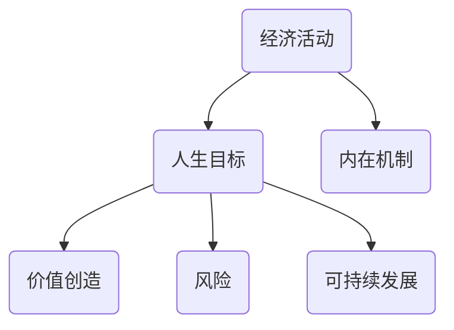

                 

# 经济活动的意义：超越金钱追求的人生目标

## 关键词

经济活动、人生目标、价值创造、风险、可持续发展、内在机制

> **摘要**：本文探讨了经济活动与人生目标之间的关系，分析了经济活动在现代社会中的重要性和影响，并提出了如何通过超越金钱追求，实现个人和社会的可持续发展。文章将从经济活动的内在机制、价值创造、风险与应对、可持续发展等方面进行深入探讨，以期为读者提供关于经济活动与人生目标的全新思考。

## 第一部分：引言与背景

### 第1章：问题的提出与意义

#### 1.1.1 问题背景

经济活动是人类社会发展的基础，从最简单的交换到现代复杂的全球供应链，经济活动贯穿于人类生活的方方面面。然而，随着经济的发展，人们开始反思经济活动的真正意义。传统的经济学理论强调金钱和物质财富的追求，但现代社会中的人们越来越意识到，人生目标不仅仅局限于金钱的积累。因此，本文旨在探讨经济活动的意义，超越金钱追求，探讨人生目标的重要性。

#### 1.1.1.1 经济活动的起源与演变

经济活动起源于人类社会的分工和交换。早期的经济活动主要是以物易物的形式进行的，随着社会的发展，货币的出现大大简化了交换过程。现代经济活动已经发展成为一个复杂、全球化的体系，涵盖了生产、分配、交换和消费等多个环节。

#### 1.1.1.2 现代经济的复杂性

现代经济的复杂性体现在多个方面，包括全球化的贸易网络、复杂的市场机制、高度专业化的分工等。这种复杂性使得经济活动不再只是简单的生产和消费，而是一个包含多种因素的复杂系统。

#### 1.1.1.3 经济活动与人类生活的紧密联系

经济活动不仅影响着物质财富的创造和分配，还深刻地影响着人类的生活质量和社会结构。例如，就业机会的创造与消失、收入水平的差异、社会福利的提供等，都受到经济活动的影响。

#### 1.1.2 问题描述

尽管经济活动在现代社会中具有重要意义，但人们对经济活动的理解和追求仍然存在一定的局限性。大多数人将经济活动等同于金钱的追求，忽略了经济活动背后的深层次意义。因此，本文试图回答以下问题：

1. 经济活动的真正意义是什么？
2. 如何超越金钱追求，实现人生目标？
3. 经济活动与个人和社会的可持续发展有何关系？

#### 1.1.2.1 经济活动的定义与范围

经济活动是指人们在生产、分配、交换和消费过程中所进行的一切活动。它包括物质产品的生产和服务活动的提供，以及相关的市场交易和非市场交易。

#### 1.1.2.2 经济活动面临的主要挑战

经济活动面临的主要挑战包括全球化带来的不确定性、技术创新带来的影响、资源稀缺性、环境问题等。这些挑战要求我们重新思考经济活动的目标和方式。

#### 1.1.2.3 经济活动对个人和社会的影响

经济活动对个人和社会的影响是深远而复杂的。它不仅影响个人的收入水平和消费选择，还影响社会的发展方向和社会结构的稳定性。

#### 1.1.3 问题解决

为了解决上述问题，本文将采取以下研究方法：

1. 综合分析经济活动的定义、范围和内在机制。
2. 探讨经济活动与人生目标之间的关系。
3. 分析经济活动的价值创造、风险和可持续发展。

#### 1.1.3.1 现有研究综述

目前，关于经济活动与人生目标的研究主要集中在两个方面：一是从心理学和社会学角度探讨人生目标的重要性；二是从经济学角度分析经济活动对社会和个人福利的影响。然而，将两者结合起来，从整体上探讨经济活动与人生目标关系的研究还比较少见。

#### 1.1.3.2 研究方法与数据来源

本文采用文献综述和实证分析相结合的研究方法。文献综述将帮助我们从理论上理解经济活动与人生目标的关系，实证分析将通过对实际案例的研究，验证理论的适用性和有效性。

#### 1.1.3.3 研究目标与预期成果

本文的研究目标是：

1. 揭示经济活动的真正意义，超越金钱追求。
2. 探讨如何通过经济活动实现个人和社会的可持续发展。
3. 提出经济活动与人生目标关系的新理论框架。

预期成果包括：

1. 为经济学研究提供一个新的视角，丰富经济学理论。
2. 为个人和社会提供实现可持续发展的策略和建议。
3. 为相关政策制定提供理论依据。

#### 1.1.4 边界与外延

本文的研究边界主要限定在现代社会中的经济活动，不包括历史时期和经济活动以外的领域。研究对象包括个人、企业和政府等经济活动的主体。

#### 1.1.4.1 研究边界的设定

研究边界的设定有助于明确本文的研究范围和重点，避免研究内容的泛化。

#### 1.1.4.2 研究对象的外延

研究对象的外延包括所有参与经济活动的个人、企业和政府等。这些主体在经济活动中扮演不同的角色，共同影响着经济活动的运行和结果。

#### 1.1.4.3 核心概念的定义与解释

核心概念包括经济活动、人生目标、价值创造、风险和可持续发展。这些概念是本文分析的基础，需要对它们进行清晰的定义和解释。

#### 1.1.5 概念结构与核心要素组成

概念结构图：

核心要素分析：

1. 经济活动：指人们在生产、分配、交换和消费过程中所进行的一切活动。
2. 人生目标：个人在社会中的追求和理想，包括物质和精神两个方面。
3. 价值创造：通过经济活动实现个人和社会的福利。
4. 风险：在经济活动中可能遇到的不确定性和潜在损失。
5. 可持续发展：满足当前需求而不损害后代满足需求的能力。

### 1.2 核心概念与联系

#### 1.2.1 经济活动的基本概念

经济活动是指人们在生产、分配、交换和消费过程中所进行的一切活动。它包括物质产品的生产和服务活动的提供，以及相关的市场交易和非市场交易。

| 概念属性        | 定义                                                     | 对比表格                                   |
| --------------- | -------------------------------------------------------- | ------------------------------------------ |
| 经济活动的主体 | 个人、企业和政府                                       | 经济活动的主体不包括动物和自然界               |
| 经济活动的目的 | 满足人类的需求，实现社会福利                             | 与动物的自然行为和生存需求不同                 |
| 经济活动的特征 | 复杂性、全球化、高度专业化                               | 与原始社会的简单交换和自给自足有很大不同         |

#### 1.2.1.2 经济活动的分类

经济活动可以按照不同的标准进行分类。常见的分类方法包括：

1. 按照活动性质分类：生产性经济活动、分配性经济活动、交换性经济活动和消费性经济活动。
2. 按照活动范围分类：国内经济活动、国际经济活动。
3. 按照活动主体分类：个人经济活动、企业经济活动、政府经济活动。

| 类别       | 定义                                                         | 对比表格                                                   |
| ---------- | ------------------------------------------------------------ | ---------------------------------------------------------- |
| 生产性活动 | 生产物质产品和提供服务的活动                                 | 包括制造业、农业、服务业等                               |
| 分配性活动 | 资源的分配活动，如税收、社会保障等                           | 不直接生产物质产品或提供服务                             |
| 交换性活动 | 通过市场交易实现物品和服务的交换                             | 包括商品市场、金融市场等                                 |
| 消费性活动 | 消费物质产品和享受服务的活动                                 | 包括家庭消费、政府消费等                               |

#### 1.2.1.3 经济活动的特征

经济活动的特征包括：

1. 复杂性：现代经济活动涉及多个环节和多个主体，具有高度复杂性。
2. 全球化：经济活动不再局限于国家或地区，而是跨越国界，形成全球化的经济体系。
3. 高度专业化：生产和服务活动越来越专业化，形成高度分工和协作。

#### 1.2.2 经济活动的相关概念

经济活动的相关概念包括生产、消费、供需关系、货币与金融等。

1. **生产**：生产是指通过劳动和其他生产要素的投入，创造物质产品和服务的活动。生产活动是经济活动的核心，是价值创造的起点。
   
2. **消费**：消费是指个人或组织为了满足自身需求而购买和使用商品或服务的行为。消费活动是经济活动的终点，也是价值实现的环节。

3. **供需关系**：供需关系是指市场上商品的供给和需求之间的相互关系。供给是生产者愿意提供的商品数量，需求是消费者愿意购买的商品数量。供需关系的平衡是市场稳定的关键。

4. **货币与金融**：货币是经济活动中的交换媒介，是价值的普遍等价物。金融则是通过货币及其他金融工具进行资金融通和风险管理的活动。

#### 1.2.3 经济活动的相互作用

经济活动中的各个要素之间相互影响、相互作用，形成复杂的经济系统。

1. **个人与经济活动**：个人是经济活动的主体，既是生产者也是消费者。个人通过生产和服务活动创造价值，同时也通过消费活动实现自身需求。

2. **企业与经济活动**：企业是经济活动的组织者，通过生产和服务活动实现盈利目标。企业的发展受市场需求、资源供给、技术创新等多种因素的影响。

3. **社会与经济活动**：社会是经济活动的环境，经济活动对社会结构、文化、政策等方面产生深远影响。同时，社会的需求、资源和技术进步也反过来影响经济活动。

### 第2章：经济活动的内在机制概述

#### 2.1.1 经济活动的内在机制概念

经济活动的内在机制是指经济系统中各个要素之间相互联系和相互作用的方式，它决定了经济活动的运行规律和结果。内在机制包括需求驱动、供给驱动、技术进步驱动等。

#### 2.1.1.1 内在机制的定义

内在机制是经济系统内部各要素之间相互联系和相互作用的规律和方式，它反映了经济活动的内在逻辑和运行规律。

#### 2.1.1.2 内在机制的作用

内在机制在经济活动中具有重要作用，它决定了经济活动的效率、稳定性和发展潜力。

1. **效率**：内在机制能够优化资源配置，提高经济活动的效率。
2. **稳定性**：内在机制能够调节经济波动，保持经济系统的稳定。
3. **发展潜力**：内在机制能够促进技术进步和结构升级，提升经济发展潜力。

#### 2.1.2 经济活动的驱动因素

经济活动的驱动因素是影响经济活动运行和结果的关键因素，包括需求驱动、供给驱动、技术进步驱动等。

#### 2.1.2.1 需求驱动

需求驱动是指市场需求对经济活动的影响。市场需求是经济活动的动力源泉，它决定了生产什么、生产多少和如何生产。

1. **需求的概念**：需求是指消费者在一定价格水平下愿意购买的商品或服务的数量。
2. **需求的影响**：需求直接影响生产和投资决策，进而影响经济的增长和发展。

#### 2.1.2.2 供给驱动

供给驱动是指供给因素对经济活动的影响。供给包括生产要素的投入和生产能力的扩张。

1. **供给的概念**：供给是指生产者在一定价格水平下愿意提供的商品或服务的数量。
2. **供给的影响**：供给直接影响市场价格的确定和经济活动的规模。

#### 2.1.2.3 技术进步驱动

技术进步驱动是指技术创新对经济活动的影响。技术进步是推动经济发展的核心动力。

1. **技术创新的概念**：技术创新是指通过改进技术、开发新产品或提高生产效率等方式，实现技术进步。
2. **技术创新的影响**：技术创新能够降低生产成本、提高产品质量和创新能力，推动经济结构的升级和转型。

#### 2.1.3 经济活动的反馈机制

经济活动的反馈机制是指经济系统中各个要素之间相互作用和反馈的机制。反馈机制分为正反馈和负反馈。

#### 2.1.3.1 反馈机制的作用

反馈机制在经济活动中具有重要作用，它能够调节经济系统的运行，保持经济系统的稳定。

1. **稳定作用**：反馈机制能够对经济波动进行调节，保持经济系统的稳定。
2. **优化作用**：反馈机制能够优化资源配置，提高经济活动的效率。

#### 2.1.3.2 反馈机制的分类

反馈机制可以分为正反馈和负反馈。

1. **正反馈**：正反馈是指经济系统中的某个变化会引起更大的变化，导致系统不稳定。
2. **负反馈**：负反馈是指经济系统中的某个变化会引起相反的变化，使系统趋于稳定。

#### 2.1.3.3 反馈机制的影响

反馈机制对经济活动的影响取决于反馈的类型和强度。

1. **正反馈的影响**：正反馈可能导致经济过热或过冷，影响经济的稳定性。
2. **负反馈的影响**：负反馈有助于维持经济系统的稳定，促进经济的健康发展。

## 第二部分：经济活动的内在机制

### 第2章：经济活动的内在机制概述

#### 2.1.1 经济活动的内在机制概念

经济活动的内在机制是指经济系统中各个要素之间相互联系和相互作用的方式，它决定了经济活动的运行规律和结果。内在机制包括需求驱动、供给驱动、技术进步驱动等。

#### 2.1.1.1 内在机制的定义

内在机制是经济系统内部各要素之间相互联系和相互作用的规律和方式，它反映了经济活动的内在逻辑和运行规律。

#### 2.1.1.2 内在机制的作用

内在机制在经济活动中具有重要作用，它决定了经济活动的效率、稳定性和发展潜力。

1. **效率**：内在机制能够优化资源配置，提高经济活动的效率。
2. **稳定性**：内在机制能够调节经济波动，保持经济系统的稳定。
3. **发展潜力**：内在机制能够促进技术进步和结构升级，提升经济发展潜力。

#### 2.1.2 经济活动的驱动因素

经济活动的驱动因素是影响经济活动运行和结果的关键因素，包括需求驱动、供给驱动、技术进步驱动等。

#### 2.1.2.1 需求驱动

需求驱动是指市场需求对经济活动的影响。市场需求是经济活动的动力源泉，它决定了生产什么、生产多少和如何生产。

1. **需求的概念**：需求是指消费者在一定价格水平下愿意购买的商品或服务的数量。
2. **需求的影响**：需求直接影响生产和投资决策，进而影响经济的增长和发展。

#### 2.1.2.2 供给驱动

供给驱动是指供给因素对经济活动的影响。供给包括生产要素的投入和生产能力的扩张。

1. **供给的概念**：供给是指生产者在一定价格水平下愿意提供的商品或服务的数量。
2. **供给的影响**：供给直接影响市场价格的确定和经济活动的规模。

#### 2.1.2.3 技术进步驱动

技术进步驱动是指技术创新对经济活动的影响。技术进步是推动经济发展的核心动力。

1. **技术创新的概念**：技术创新是指通过改进技术、开发新产品或提高生产效率等方式，实现技术进步。
2. **技术创新的影响**：技术创新能够降低生产成本、提高产品质量和创新能力，推动经济结构的升级和转型。

#### 2.1.3 经济活动的反馈机制

经济活动的反馈机制是指经济系统中各个要素之间相互作用和反馈的机制。反馈机制分为正反馈和负反馈。

#### 2.1.3.1 反馈机制的作用

反馈机制在经济活动中具有重要作用，它能够调节经济系统的运行，保持经济系统的稳定。

1. **稳定作用**：反馈机制能够对经济波动进行调节，保持经济系统的稳定。
2. **优化作用**：反馈机制能够优化资源配置，提高经济活动的效率。

#### 2.1.3.2 反馈机制的分类

反馈机制可以分为正反馈和负反馈。

1. **正反馈**：正反馈是指经济系统中的某个变化会引起更大的变化，导致系统不稳定。
2. **负反馈**：负反馈是指经济系统中的某个变化会引起相反的变化，使系统趋于稳定。

#### 2.1.3.3 反馈机制的影响

反馈机制对经济活动的影响取决于反馈的类型和强度。

1. **正反馈的影响**：正反馈可能导致经济过热或过冷，影响经济的稳定性。
2. **负反馈的影响**：负反馈有助于维持经济系统的稳定，促进经济的健康发展。

### 第3章：经济活动的价值创造

#### 3.1.1 价值创造的原理

价值创造是经济活动的核心，它涉及到如何在生产和服务过程中实现资源的有效配置，以满足市场需求，并最终实现社会福利的提升。

#### 3.1.1.1 价值创造的经济学原理

在经济学中，价值创造通常基于以下原理：

1. **生产要素组合**：价值创造依赖于劳动、资本、土地和企业家精神等生产要素的组合。每种生产要素在价值创造过程中都有其特定的作用。

2. **生产函数**：生产函数描述了不同生产要素的组合如何转化为产出。生产函数通常表示为 \(Y = F(K, L, M, E)\)，其中 \(Y\) 是产出，\(K\) 是资本，\(L\) 是劳动，\(M\) 是土地，\(E\) 是企业家精神。

3. **边际贡献**：价值创造还涉及到边际贡献的概念，即每种生产要素对产出的额外贡献。例如，边际劳动贡献表示增加一个单位劳动所增加的产出。

#### 3.1.1.2 价值创造的经济学模型

经济学中常用的价值创造模型包括：

1. **古典价值理论**：由亚当·斯密和大卫·李嘉图提出，认为价值主要由劳动创造。

2. **新古典价值理论**：由约翰·贝茨·克拉克和欧文·费雪提出，认为价值不仅由劳动创造，还包括资本、土地和企业家精神。

3. **人力资本理论**：由加里·贝克尔提出，强调教育、培训和健康投资对价值创造的重要性。

#### 3.1.2 价值创造的实践方法

价值创造在实践中有多种方法，包括创新驱动价值创造、资源整合驱动价值创造和市场需求驱动价值创造。

#### 3.1.2.1 创新驱动价值创造

创新驱动价值创造是指通过技术创新、产品创新和服务创新来提高生产效率和质量，从而创造新的价值。

1. **技术创新**：通过研发新技术、新工艺和新设备，提高生产效率和降低成本。
2. **产品创新**：通过开发新产品或改进现有产品，满足市场需求，提升竞争力。
3. **服务创新**：通过提供更优质的服务，提升用户体验，增加客户满意度。

#### 3.1.2.2 资源整合驱动价值创造

资源整合驱动价值创造是指通过优化资源配置、整合资源来提高效率和价值。

1. **资源配置优化**：通过合理配置劳动力、资本和土地等资源，实现资源利用的最大化。
2. **产业链整合**：通过整合上下游产业链，提高供应链效率和整体竞争力。
3. **跨界整合**：通过跨行业、跨领域的整合，实现资源互补和价值共创。

#### 3.1.2.3 市场需求驱动价值创造

市场需求驱动价值创造是指通过满足市场需求来创造价值。

1. **市场调研**：通过市场调研了解消费者需求，为产品开发和营销提供依据。
2. **定制化服务**：根据客户需求提供定制化产品和服务，提升客户满意度。
3. **市场营销**：通过有效的市场营销策略，提高品牌知名度和市场占有率。

### 第4章：经济活动的风险与应对

#### 4.1.1 经济活动的风险概述

经济活动面临的风险种类繁多，这些风险可能来自内部或外部，对经济活动的稳定性和发展潜力产生重大影响。理解这些风险及其来源，是有效管理经济活动、实现可持续发展的关键。

#### 4.1.1.1 经济风险的类型

经济风险主要包括以下几个方面：

1. **市场风险**：指市场供需变化、价格波动等因素导致的损失风险。
2. **信用风险**：指由于债务人违约、信用等级下降等原因导致的损失风险。
3. **流动性风险**：指由于资金周转不畅、无法及时获取资金等原因导致的损失风险。
4. **操作风险**：指由于内部管理不当、操作失误等因素导致的损失风险。
5. **法律风险**：指由于法律法规变化、合同纠纷等原因导致的损失风险。

#### 4.1.1.2 经济风险的来源

经济风险的来源可以分为以下几个方面：

1. **宏观经济环境**：如经济衰退、通货膨胀、利率波动等宏观经济因素。
2. **行业特有风险**：如市场需求变化、技术变革、竞争加剧等。
3. **企业内部因素**：如管理失误、资金链断裂、技术创新不足等。
4. **外部环境变化**：如政策调整、社会事件、自然灾害等。

#### 4.1.1.3 经济风险的评估

经济风险的评估是风险管理的第一步，主要包括以下几个方面：

1. **风险识别**：通过调查和分析，识别可能存在的风险类型。
2. **风险分析**：对识别出的风险进行定量和定性分析，评估风险的可能性和影响程度。
3. **风险评估**：将风险的可能性与影响程度相结合，确定风险等级。

#### 4.1.2 风险管理的策略

风险管理是经济活动中不可或缺的一部分，通过有效的风险管理策略，可以降低风险对经济活动的影响。

#### 4.1.2.1 风险预防策略

风险预防策略旨在减少风险发生的可能性，主要包括以下几个方面：

1. **建立健全的风险管理体系**：制定风险管理政策、建立风险管理组织，确保风险管理措施得到有效执行。
2. **加强内部控制**：通过加强内部控制，减少操作风险和管理失误。
3. **多元化经营**：通过多元化经营，降低单一市场或行业风险。

#### 4.1.2.2 风险缓解策略

风险缓解策略旨在降低风险发生时的损失程度，主要包括以下几个方面：

1. **风险转移**：通过保险、合同条款等方式将风险转移给其他方。
2. **风险对冲**：通过期货、期权等金融工具对冲风险。
3. **风险分散**：通过投资组合分散风险，降低单一投资的风险。

#### 4.1.2.3 风险转移策略

风险转移策略是指将风险转移到其他方，以减轻自身损失。常见的风险转移方式包括：

1. **保险**：通过购买保险将风险转移给保险公司。
2. **合同条款**：通过合同条款明确各方责任，将风险转移给对方。
3. **担保**：通过提供担保将风险转移给担保方。

### 第5章：经济活动的可持续发展

#### 5.1.1 可持续发展的概念

可持续发展是指满足当前需求而不损害后代满足需求的能力。这一概念最初由联合国世界环境与发展委员会在1987年的《我们共同的未来》报告中提出，已成为全球经济发展的重要指导原则。

#### 5.1.1.1 可持续发展的定义

可持续发展定义为：“在不损害满足未来世代需要的前提下，满足当前人类需求的发展模式。”这意味着在资源利用、环境保护、经济增长和社会进步之间找到一个平衡点。

#### 51.1.2 可持续发展的原则

可持续发展原则包括：

1. **公平性**：确保当前和未来各代人在资源利用和环境保护上的公平。
2. **持续性**：确保资源利用和环境质量保持在可再生和可持续的水平。
3. **共同性**：全球问题需要全球合作解决，各国应共同承担责任。
4. **预防性**：预防环境退化比事后修复更为有效和经济。

#### 5.1.1.3 可持续发展的目标

可持续发展的目标主要包括：

1. **环境保护**：减少环境污染，保护自然资源和生态系统。
2. **经济增长**：实现经济持续、健康和稳定增长。
3. **社会进步**：改善社会福祉，减少贫困和不平等。
4. **经济与环境的协调发展**：在实现经济增长的同时，保护环境和生态系统。

#### 5.1.2 经济活动的可持续发展实践

经济活动的可持续发展实践包括以下几个方面：

1. **绿色经济**：推动绿色技术和产业的发展，实现经济增长与环境保护的协同。
2. **循环经济**：通过资源的循环利用，减少资源消耗和环境污染。
3. **生态补偿**：通过政策和经济手段，补偿那些在可持续发展中做出贡献的个体或企业。
4. **绿色金融**：通过绿色债券、绿色信贷等金融工具，支持绿色产业和项目的发展。

#### 5.1.2.1 环境友好型经济活动

环境友好型经济活动是指在生产和消费过程中尽量减少对环境的负面影响，实现经济与环境的协调发展。

1. **清洁生产**：通过改进生产技术和流程，减少污染物的排放。
2. **绿色消费**：消费者选择环保产品，减少浪费和污染。
3. **生态农业**：通过有机耕作、节水灌溉等手段，减少农业对环境的破坏。

#### 5.1.2.2 社会责任经济活动

社会责任经济活动是指企业在追求经济效益的同时，承担社会责任，促进社会和谐发展。

1. **企业社会责任（CSR）**：企业通过慈善捐赠、公益项目等方式，回馈社会。
2. **公平贸易**：通过公平贸易体系，确保生产过程中的工人权益和产品品质。
3. **企业文化**：建立以人为本的企业文化，关注员工福祉和社会责任。

#### 5.1.2.3 可持续发展的政策与措施

实现经济活动的可持续发展，需要政府、企业和公众共同努力，通过以下政策与措施：

1. **政策法规**：制定环境保护和资源管理的法律法规，推动绿色发展。
2. **经济激励**：通过税收优惠、补贴等经济手段，鼓励绿色产业和环保行为。
3. **国际合作**：参与全球环境治理，加强国际间的合作与交流。
4. **公众参与**：提高公众的环保意识，鼓励公众参与可持续发展实践。

### 第三部分：经济活动与人生目标的关系

#### 第6章：经济活动与人生目标的关系分析

#### 6.1.1 人生目标的概念与类型

人生目标是指个人在社会中的追求和理想，它们既可以是短期的，也可以是长期的。人生目标可以分为以下几种类型：

1. **物质目标**：如财富积累、职业发展、生活质量提升等。
2. **精神目标**：如知识追求、自我实现、精神满足等。
3. **社会目标**：如家庭幸福、社会责任、社会贡献等。

#### 6.1.1.1 人生目标的定义

人生目标是指个人在社会中的追求和理想，它们既可以是短期的，也可以是长期的。人生目标可以分为以下几种类型：

1. **物质目标**：如财富积累、职业发展、生活质量提升等。
2. **精神目标**：如知识追求、自我实现、精神满足等。
3. **社会目标**：如家庭幸福、社会责任、社会贡献等。

#### 6.1.1.2 人生目标的类型

人生目标可以根据不同的维度进行分类，以下是一些常见的人生目标类型：

1. **职业目标**：如晋升到某一职位、实现职业转型、创立自己的公司等。
2. **财务目标**：如实现财务自由、积累财富、投资理财等。
3. **家庭目标**：如拥有稳定的家庭生活、培养子女、实现家庭和谐等。
4. **健康目标**：如保持良好的身体健康、定期进行体检、培养健康的生活习惯等。
5. **个人成长**：如学习新技能、提升自身素质、实现自我超越等。
6. **社会贡献**：如参与公益活动、为社会做出贡献、推动社会进步等。

#### 6.1.1.3 人生目标的重要性

人生目标对于个人的生活具有深远的意义，它不仅为个人提供了前进的方向和动力，还能够帮助个人在面对挑战和困难时保持积极和坚定的态度。

1. **提供方向和动力**：人生目标为个人提供了明确的方向和前进的动力，使个人更加专注和努力地追求自己的梦想。
2. **促进个人成长**：通过追求人生目标，个人不断地学习、成长和进步，实现自我超越。
3. **增强幸福感**：实现人生目标能够带来成就感和幸福感，提升个人的生活质量。
4. **增强自信心**：设定和实现人生目标能够增强个人的自信心，使个人更加自信地面对生活中的各种挑战。

#### 6.1.2 经济活动对人生目标的影响

经济活动对人生目标有着深远的影响，它既是实现人生目标的重要手段，也可能对人生目标产生正面或负面的影响。

#### 6.1.2.1 经济活动的正面影响

1. **提供物质基础**：经济活动通过创造财富和提供就业机会，为个人实现物质目标提供了基础，如购房、购车、子女教育等。
2. **促进职业发展**：经济活动的发展为个人提供了更多的职业机会和发展空间，有助于个人实现职业目标。
3. **提升生活质量**：经济活动的发展能够提高生活水平，改善住房条件、医疗保健、教育等，有助于个人实现生活目标。

#### 6.1.2.2 经济活动的负面影响

1. **过度追求金钱**：经济活动可能导致个人过度追求金钱和物质财富，忽视精神和社会目标，导致生活不平衡。
2. **工作压力**：经济活动带来的竞争和压力可能导致个人承受较大的工作压力，影响身心健康和家庭生活。
3. **环境问题**：经济活动可能导致环境污染和资源浪费，对个人和社区的健康和生活质量产生负面影响。

#### 6.1.3 如何超越金钱追求，实现人生目标

为了实现人生目标，个人需要超越对金钱的追求，注重物质和精神目标的平衡。

#### 6.1.3.1 设定多元化的目标

个人应设定多元化的目标，包括物质、精神和社交等多个方面。多元化的目标有助于个人全面发展，减少对金钱的过度依赖。

#### 6.1.3.2 培养价值观和人生观

个人应树立正确的价值观和人生观，重视精神追求和社会责任。通过培养价值观和人生观，个人能够更好地平衡物质和精神生活，实现人生目标。

#### 6.1.3.3 投资于个人成长

个人应将部分时间和资源投资于个人成长，如学习新技能、提升自身素质、培养兴趣爱好等。通过个人成长，个人能够提高自身竞争力，实现职业和生活目标。

#### 6.1.3.4 建立良好的人际关系

人际关系对个人的生活和幸福感具有重要影响。个人应注重建立和维护良好的人际关系，如家庭关系、朋友关系、同事关系等。通过良好的人际关系，个人能够获得更多的支持、鼓励和帮助，实现人生目标。

### 第7章：经济活动与人生目标的实现路径

#### 7.1.1 经济活动与人生目标实现的关系

经济活动与人生目标的实现密切相关。一方面，经济活动为个人提供了实现人生目标的物质基础和机会；另一方面，人生目标的实现需要经济活动的支持和推动。因此，理解经济活动与人生目标之间的关系，对于个人和社会的发展具有重要意义。

#### 7.1.2 实现人生目标的路径

实现人生目标需要明确的路径和策略。以下是一些实现人生目标的路径：

1. **制定明确的计划**：制定详细的计划是实现人生目标的第一步。计划应包括具体的行动步骤、时间安排和目标实现的标准。

2. **分阶段实现目标**：将人生目标分解为短期、中期和长期目标，分阶段实现。这样可以逐步实现人生目标，同时保持动力和积极性。

3. **不断学习和提升**：实现人生目标需要不断学习和提升自身能力。通过学习新知识和技能，个人能够更好地适应环境和变化，实现人生目标。

4. **积极应对挑战**：在实现人生目标的过程中，个人可能会面临各种挑战和困难。积极应对挑战，寻求解决问题的方法，有助于实现人生目标。

5. **保持耐心和毅力**：实现人生目标需要耐心和毅力。在追求目标的过程中，个人可能会遇到挫折和失败，但只要保持耐心和毅力，最终能够实现人生目标。

#### 7.1.3 经济活动对人生目标实现的促进作用

经济活动对人生目标实现的促进作用主要体现在以下几个方面：

1. **提供物质基础**：经济活动通过创造财富和提供就业机会，为个人实现人生目标提供了物质基础。个人可以凭借经济收入，改善生活质量、实现购房购车等物质目标。

2. **创造发展机会**：经济活动的发展为个人提供了更多的职业发展机会。个人可以通过努力工作和学习，提升自身竞争力，实现职业目标。

3. **促进社会流动**：经济活动的发展有助于促进社会流动，使个人有机会通过努力改善自身的社会地位。这有助于实现人生目标，提高社会整体的幸福感。

4. **改善教育和医疗条件**：经济活动的发展可以改善教育和医疗条件，为个人实现人生目标提供更好的资源和机会。例如，更好的教育可以提升个人素质，更好的医疗可以保障个人健康。

#### 7.1.4 超越金钱追求，实现人生目标的策略

为了实现人生目标，个人需要超越对金钱的追求，采取以下策略：

1. **平衡物质和精神需求**：在追求物质财富的同时，注重精神需求的满足。通过培养兴趣爱好、参与公益活动等方式，实现物质和精神生活的平衡。

2. **关注社会和环境责任**：在实现个人人生目标的过程中，关注社会和环境责任。通过参与社会公益活动、支持环保事业等方式，实现个人与社会环境的协调发展。

3. **持续学习和成长**：将时间和资源投资于个人成长，不断提升自身能力和素质。通过学习新知识和技能，实现自我超越，为人生目标的实现奠定坚实基础。

4. **建立良好的人际关系**：建立和维护良好的人际关系，获得他人的支持和帮助。通过人际关系网络，实现资源共享和合作共赢，为人生目标的实现创造有利条件。

#### 7.1.5 经济活动与人生目标的协同发展

经济活动与人生目标的协同发展是实现个人和社会可持续发展的重要途径。以下是一些协同发展的策略：

1. **推动绿色经济**：通过发展绿色经济，实现经济活动的可持续发展。绿色经济能够减少环境污染，提高资源利用效率，为个人和社会创造更多的价值。

2. **鼓励创新和创业**：鼓励创新和创业，为个人提供更多的发展机会和实现人生目标的途径。创新和创业能够激发社会活力，推动经济增长和社会进步。

3. **促进教育和培训**：加强教育和培训，提高个人素质和技能，为经济活动提供强大的人力资源支持。教育和培训能够提升个人竞争力，实现个人价值和人生目标。

4. **构建和谐社会**：构建和谐社会，为个人和社会提供良好的发展环境。和谐社会能够促进社会公平、正义和和谐，为个人实现人生目标创造有利条件。

### 结论

经济活动与人生目标密切相关，二者相互促进，共同推动个人和社会的发展。通过超越金钱追求，关注物质和精神需求的平衡，个人可以实现人生目标，实现个人和社会的可持续发展。本文从经济活动的内在机制、价值创造、风险与应对、可持续发展等方面，探讨了经济活动与人生目标的关系，提出了实现人生目标的路径和策略。未来研究可以进一步探讨经济活动与人生目标在不同文化、社会背景下的差异和适应性，为个人和社会的发展提供更多理论支持和实践指导。

### 作者信息

**作者：** AI天才研究院/AI Genius Institute & 禅与计算机程序设计艺术 /Zen And The Art of Computer Programming

AI天才研究院致力于探索人工智能领域的最新技术和应用，推动人工智能技术的发展。作者所著的《禅与计算机程序设计艺术》系列书籍，深受广大程序员和技术爱好者的喜爱，被誉为计算机编程的典范之作。本文作者以其深厚的专业知识和丰富的实践经验，为读者呈现了一篇关于经济活动与人生目标的深入探讨，旨在为个人和社会的可持续发展提供新思路和新方法。

