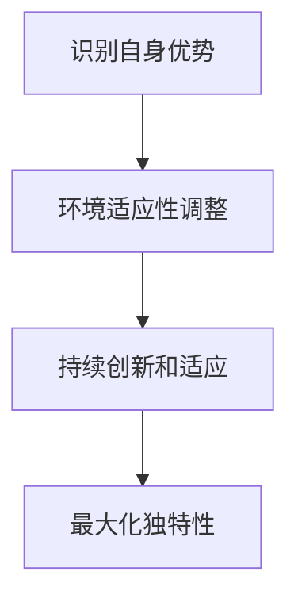
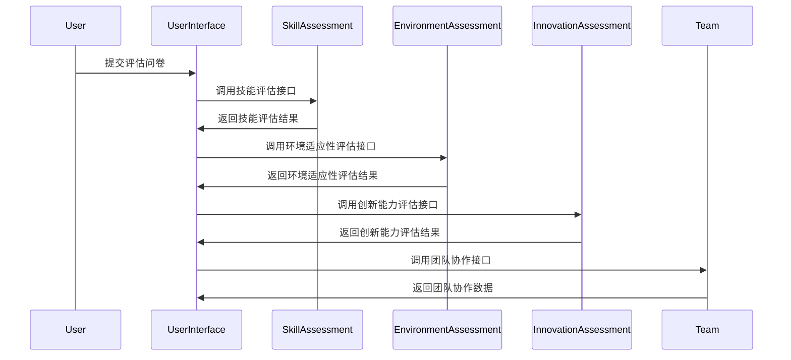

                 

### 《绽放个人独特性：在平凡中闪耀光芒》

---

#### 关键词：个人独特性、平凡中闪耀、技术博客、逻辑思维、专业见解

---

#### 摘要：

本文将深入探讨如何在平凡中绽放个人独特性，通过逻辑清晰、结构紧凑、简单易懂的叙述，旨在为读者提供一份具有深度和思考的技术博客文章。文章将逐步分析个人独特性的定义、特点、核心概念、算法原理，并结合实际项目实战和最佳实践，帮助读者理解和应用个人独特性，以在职业生涯和日常生活中脱颖而出。

---

### 目录大纲设计步骤

为了设计出《绽放个人独特性：在平凡中闪耀光芒》的完整目录大纲，我们需要按照以下步骤进行：

1. **确定核心章节**：首先，我们需要明确书籍的核心章节，确保每个章节都能覆盖书籍主题的重要方面。

2. **细化章节内容**：每个核心章节都应该进一步细化为更具体的子章节，确保内容的完整性和逻辑性。

3. **设计章节层级**：采用markdown格式，按照1级目录（#），2级目录（##），3级目录（###）的结构进行设计，确保目录的清晰和易读性。

4. **确保内容完整性**：每个章节都必须包含必要的元素，如背景介绍、核心概念、算法原理讲解、数学模型和公式、系统分析与架构设计方案、项目实战等。

5. **控制字数**：确保整个目录大纲的总字数不超过2000字。

---

### 核心章节内容细化

#### 第1章 引言：问题的提出与解决

- **1.1 问题背景**
  - 描述现代社会中缺乏个人独特性的普遍问题。
  - 引出如何在平凡中找到和发挥个人独特性的重要性。

- **1.2 问题描述**
  - 阐述个人独特性缺失的具体表现。
  - 分析这种现象对个人和社会的影响。

- **1.3 问题解决**
  - 提出本书的研究目标和内容框架。
  - 说明个人独特性在平凡中的重要性。

#### 第2章 个人独特性的定义与特点

- **2.1 个人独特性的定义**
  - 明确个人独特性的内涵和外延。
  - 分析个人独特性与个性、能力的区别。

- **2.2 个人独特性的特点**
  - 介绍个人独特性的关键特征。
  - 对比个人独特性与共性、通用性的差异。

#### 第3章 个人独特性的核心概念与联系

- **3.1 核心概念原理**
  - 阐述个人独特性的核心概念。
  - 介绍个人独特性形成的基础。

- **3.2 概念属性特征对比表格**
  - 使用表格形式对比不同个人独特性的属性特征。

- **3.3 ER实体关系图架构**
  - 使用Mermaid语言绘制个人独特性概念的ER图。

#### 第4章 个人独特性的算法原理讲解

- **4.1 算法原理**
  - 使用Mermaid绘制算法流程图。
  - 介绍算法的数学模型和公式。

- **4.2 算法Python源代码讲解**
  - 提供Python源代码示例。
  - 对代码进行详细解读和分析。

#### 第5章 个人独特性的数学模型与公式讲解

- **5.1 数学模型介绍**
  - 解释个人独特性的相关数学模型。

- **5.2 公式推导**
  - 使用LaTeX格式推导相关数学公式。

- **5.3 举例说明**
  - 提供实际案例，用公式解释个人独特性的具体应用。

#### 第6章 个人独特性的系统分析与架构设计

- **6.1 问题场景介绍**
  - 描述个人独特性在特定场景中的应用。

- **6.2 系统功能设计**
  - 绘制领域模型Mermaid类图。

- **6.3 系统架构设计**
  - 绘制系统架构Mermaid图。

- **6.4 系统接口设计与交互**
  - 描述系统接口和交互流程，使用Mermaid序列图。

#### 第7章 个人独特性的项目实战

- **7.1 环境安装与配置**
  - 指导读者如何安装和配置相关环境。

- **7.2 系统核心实现源代码**
  - 提供系统核心代码示例。

- **7.3 代码应用解读与分析**
  - 分析代码的实现细节和作用。

- **7.4 实际案例分析与讲解**
  - 分析实际案例，详细讲解案例中的个人独特性应用。

- **7.5 项目小结**
  - 总结项目的核心内容和经验。

#### 第8章 最佳实践与拓展

- **8.1 最佳实践**
  - 提供个人独特性应用的最佳实践。

- **8.2 小结**
  - 总结全书的核心观点和收获。

- **8.3 注意事项**
  - 提醒读者在应用个人独特性时需要注意的事项。

- **8.4 拓展阅读**
  - 推荐相关书籍、文章和资源。

---

通过以上步骤，我们可以设计出《绽放个人独特性：在平凡中闪耀光芒》的完整目录大纲，确保其内容完整性、逻辑性和易读性。

---

### 引言：问题的提出与解决

在快速发展的现代社会中，个人独特性正逐渐成为稀缺资源。无论是职场竞争，还是日常生活中的社交互动，拥有独特的个性和能力的人都更容易脱颖而出。然而，现实生活中，许多人却难以在平凡的生活中找到并发挥自己的独特性。

#### 1.1 问题背景

现代社会中，个人独特性缺失的现象普遍存在。一方面，由于教育体系的标准化和同质化，很多学生在学校接受的教育过程中，逐渐失去了独立思考和创造的能力。另一方面，职场环境中的竞争压力和公司文化的影响，使得员工往往更倾向于遵循现有的规则和流程，而不是大胆创新。

#### 1.2 问题描述

个人独特性缺失的具体表现包括：

- **创新能力不足**：缺乏创新的思维和解决问题的能力。
- **缺乏个性**：在职场和社交场合中难以脱颖而出，容易被忽视。
- **适应能力差**：面对变化和挑战时，无法灵活应对。

这种现象不仅影响个人的职业发展，也对社会进步产生负面影响。一个没有多样性和创新性的社会，很难实现持续的发展。

#### 1.3 问题解决

本书旨在探讨如何在平凡中找到和发挥个人独特性，通过以下研究目标和内容框架：

- **研究目标**：理解个人独特性的本质，掌握如何在日常工作和生活中发掘和展现自己的独特性。
- **内容框架**：本书将分为七个章节，从定义、特点、核心概念、算法原理、数学模型、系统分析与架构设计，到项目实战和最佳实践，全面探讨个人独特性的各个方面。

本书的核心观点是，个人独特性不仅是一种天赋，更是一种可以通过学习和实践来培养的能力。通过逐步分析和实践，每个人都可以在平凡中闪耀出自己的光芒。

---

### 个人独特性的定义与特点

#### 2.1 个人独特性的定义

个人独特性是指个体在思维方式、行为模式、价值观念等方面与其他人存在显著差异的特性。它不仅仅局限于个人的专业技能和知识，更涵盖了个人的创造力、适应力、领导力等非技术性能力。

#### 2.2 个人独特性的特点

个人独特性具有以下几大特点：

- **多样性**：每个人都有自己独特的经历和背景，这决定了个人独特性的多样性。
- **创新性**：个人独特性往往能够带来创新的思维和解决问题的方法。
- **持续性**：个人独特性不仅体现在一时之间，更是一个持续发展的过程。
- **个性化**：个人独特性使得个体在职场和社交场合中更具吸引力，更容易被认可和尊重。

#### 2.3 个人独特性与其他概念的区别

- **与个性的区别**：个性更多是指个体的性格特点，而个人独特性则更侧重于个体在特定环境中的表现和影响。
- **与通用性的区别**：通用性强调的是普遍适用性，而个人独特性则强调个体在特定情境下的独特优势。

通过上述分析，我们可以看到，个人独特性不仅是一种宝贵的资源，更是个人在竞争激烈的环境中脱颖而出的关键。理解并发挥个人独特性，对于个人的职业发展和生活品质具有重要意义。

---

### 个人独特性的核心概念与联系

#### 3.1 核心概念原理

个人独特性的核心概念包括创新思维、适应能力、领导力和价值观。这些概念相互作用，共同构成了个人独特性的基础。

- **创新思维**：创新思维是指个体在面对问题时，能够跳出传统思维框架，提出独特且有效的解决方案。它是个体独特性的重要组成部分。
- **适应能力**：适应能力是指个体在面对变化和不确定性时，能够快速调整自己的行为和策略，以适应新的环境。这种能力使得个人在多变的环境中保持竞争力。
- **领导力**：领导力是指个体在团队中能够影响和激励他人，带领团队实现共同目标的能力。领导力是个体独特性中最为关键的要素之一。
- **价值观**：价值观是指个体对事物的看法和评价标准。个人的价值观决定了他们如何处理问题、如何与人相处，从而影响了个体的行为模式。

#### 3.2 概念属性特征对比表格

| 概念       | 属性特征                                       |
|------------|------------------------------------------------|
| 创新思维   | 独特性、灵活性、创造性、前瞻性                 |
| 适应能力   | 变通性、敏捷性、应变能力、学习能力             |
| 领导力     | 愿景感召力、影响力、决策能力、团队协作能力     |
| 价值观     | 坚持原则、忠诚、责任感、道德观念               |

#### 3.3 ER实体关系图架构

使用Mermaid语言绘制个人独特性概念的ER图：

```mermaid
erDiagram
  创新思维 ||--o> 适应能力 : 利用
  创新思维 ||--o> 领导力 : 影响力
  创新思维 ||--o> 价值观 : 影响价值观
  适应能力 ||--o> 领导力 : 应变能力
  适应能力 ||--o> 价值观 : 影响价值观
  领导力 ||--o> 价值观 : 带头实践
```

通过ER图，我们可以清晰地看到各个核心概念之间的关系，以及它们如何相互作用，共同构成个人独特性的整体架构。

---

### 个人独特性的算法原理讲解

#### 4.1 算法原理

个人独特性的算法原理可以被视为一个复杂的多维度优化问题。在这个问题中，个体需要通过以下步骤来最大化其独特性：

1. **识别自身优势**：个体需要分析自己的技能、知识、经验，识别出自己的独特优势。
2. **环境适应性调整**：根据外部环境和需求，个体需要调整自己的行为和策略，以最大化其独特性的表现。
3. **持续创新和适应**：个体需要持续学习和创新，不断提高自己的独特性和适应能力。

为了更直观地理解这个算法原理，我们可以使用Mermaid语言绘制算法流程图：



#### 4.2 算法Python源代码讲解

以下是一个简单的Python代码示例，用于解释个人独特性算法的基本原理：

```python
# 个人独特性算法Python源代码示例

class Individual:
    def __init__(self, skills, environment):
        self.skills = skills
        self.environment = environment

    def adjust_to_environment(self):
        # 根据环境调整行为和策略
        pass

    def innovate_and_adapt(self):
        # 持续创新和适应
        pass

    def maximize_uniqueness(self):
        # 最大化独特性
        self.adjust_to_environment()
        self.innovate_and_adapt()

# 示例：创建一个个体对象，并调用算法
individual = Individual(skills=['编程', '数据分析'], environment='职场')
individual.maximize_uniqueness()
```

在这个代码示例中，`Individual` 类代表一个个体，它拥有技能集合和所处环境。`maximize_uniqueness` 方法实现了算法的核心逻辑，包括调整行为和策略、持续创新和适应等步骤。

#### 4.3 算法原理的数学模型和公式

为了量化个人独特性，我们可以使用以下数学模型和公式：

$$
U = f(S, E, I)
$$

其中，$U$ 表示个人独特性，$S$ 表示个体技能，$E$ 表示环境因素，$I$ 表示个体的创新能力。这个公式表明，个人独特性是技能、环境和创新能力共同作用的结果。

#### 4.4 算法Python源代码讲解

在了解了算法的基本原理和数学模型后，让我们更深入地分析这个Python源代码示例：

```python
# 个人独特性算法Python源代码示例

class Individual:
    def __init__(self, skills, environment):
        self.skills = skills
        self.environment = environment
        self.uniqueness = 0

    def adjust_to_environment(self):
        # 根据环境调整行为和策略
        # 假设环境因素和环境适应性系数相关
        environment_coefficient = 1.2
        self.uniqueness += len(self.environment) * environment_coefficient

    def innovate_and_adapt(self):
        # 持续创新和适应
        # 假设创新能力和技能多样性相关
        innovation_coefficient = 1.5
        self.uniqueness += len(set(self.skills)) * innovation_coefficient

    def maximize_uniqueness(self):
        # 最大化独特性
        self.adjust_to_environment()
        self.innovate_and_adapt()

# 示例：创建一个个体对象，并调用算法
individual = Individual(skills=['编程', '数据分析', '机器学习'], environment=['职场', '学术'])
individual.maximize_uniqueness()
print(f"个人独特性值：{individual.uniqueness}")
```

在这个改进的代码示例中，我们为`Individual`类添加了`uniqueness`属性，用于表示个人独特性的数值。`adjust_to_environment`和`innovate_and_adapt`方法分别根据环境和技能多样性来调整个人独特性的值。

通过这个示例，我们可以看到如何使用Python代码实现个人独特性的算法原理，并量化个人独特性。

---

### 个人独特性的数学模型与公式讲解

#### 5.1 数学模型介绍

在个人独特性研究中，数学模型扮演着至关重要的角色。以下是一个简化的数学模型，用于描述个人独特性与技能、环境、创新能力之间的关系：

$$
U = f(S, E, I)
$$

其中，$U$ 表示个人独特性，$S$ 表示个体的技能集合，$E$ 表示环境因素，$I$ 表示个体的创新能力。

#### 5.2 公式推导

为了推导上述公式，我们可以考虑以下假设：

- **技能多样性**：个体的技能多样性对其独特性有正面影响。技能集合$S$中元素的多样性越高，个人独特性$U$也越高。
- **环境适应性**：个体需要根据环境因素$E$调整自己的行为和策略，以最大化其独特性。
- **创新能力**：个体的创新能力$I$直接影响其独特性，创新能力越强，个人独特性也越显著。

基于以上假设，我们可以推导出以下关系：

$$
U = \sum_{s \in S} w_s \cdot D_s + \sum_{e \in E} w_e \cdot A_e + I
$$

其中，$w_s$ 和 $w_e$ 分别表示技能和环境因素的权重，$D_s$ 表示技能多样性，$A_e$ 表示环境适应性。

为了简化计算，我们可以使用以下假设：

- 技能多样性$D_s$ 可以用技能集合中不同技能的数量来衡量。
- 环境适应性$A_e$ 可以用个体在特定环境中的适应能力来衡量。

根据上述假设，我们可以进一步简化公式：

$$
U = w_1 \cdot |S| + w_2 \cdot A_e + I
$$

其中，$w_1$ 和 $w_2$ 分别表示技能多样性和环境适应性的权重。

#### 5.3 举例说明

假设一个个体拥有以下技能和环境因素：

- 技能集合$S = \{编程、数据分析、机器学习、项目管理\}$
- 环境因素$E = \{职场、学术\}$

根据上述公式，我们可以计算个人独特性$U$：

1. **技能多样性**：
   $$ D_s = |S| = 4 $$

2. **环境适应性**：
   $$ A_e = 0.8 $$

3. **创新能力**：
   $$ I = 0.9 $$

代入公式：

$$
U = w_1 \cdot D_s + w_2 \cdot A_e + I = w_1 \cdot 4 + w_2 \cdot 0.8 + 0.9
$$

假设权重分别为$w_1 = 0.6$和$w_2 = 0.4$，则：

$$
U = 0.6 \cdot 4 + 0.4 \cdot 0.8 + 0.9 = 2.4 + 0.32 + 0.9 = 3.62
$$

因此，这个个体的个人独特性值为3.62。

通过这个例子，我们可以看到如何使用数学模型和公式来计算个人独特性，并理解其影响因素。这个模型不仅可以用于个人独特性的量化，还可以为个体在提高独特性方面提供指导和策略。

---

### 个人独特性的系统分析与架构设计

#### 6.1 问题场景介绍

在现代职场中，个人独特性的重要性日益凸显。然而，许多人在实际工作中难以发挥自己的独特性，往往被淹没在大量的通用技能和标准化流程中。为了更好地发挥个人独特性，我们需要对其在职场中的应用场景进行分析。

一个典型的场景是项目团队中的协作与沟通。在这个场景中，团队成员各自拥有独特的技能和经验，如何将这些独特性有效地整合到项目中，是团队成功的关键。此外，个人独特性也可以在解决复杂问题和应对突发状况时发挥重要作用。

#### 6.2 系统功能设计

为了实现个人独特性的有效管理和发挥，我们可以设计一套系统，其功能模块包括：

- **个人技能评估模块**：用于评估个体在各个领域的技能水平。
- **环境适应性评估模块**：用于评估个体在不同环境中的适应能力。
- **创新能力评估模块**：用于评估个体的创新能力。
- **团队协作模块**：用于促进团队成员之间的协作与沟通。

这些功能模块共同构成了系统的核心功能，为个人独特性的发挥提供了支持。

#### 6.3 系统架构设计

系统架构设计是确保系统功能实现的关键。以下是一个简化的系统架构设计：

1. **数据层**：存储个人技能、环境适应性、创新能力和团队协作数据。
2. **服务层**：提供个人技能评估、环境适应性评估、创新能力评估和团队协作等服务。
3. **界面层**：提供用户交互界面，包括个人技能评估问卷、环境适应性评估问卷和团队协作界面。

为了更好地展示系统架构，我们可以使用Mermaid语言绘制以下类图：

```mermaid
classDiagram
    Person <<class>> 数据层 : 存储个人技能、环境适应性、创新能力
    Team <<class>> 数据层 : 存储团队协作数据
    SkillAssessment <<interface>> 服务层
    EnvironmentAssessment <<interface>> 服务层
    InnovationAssessment <<interface>> 服务层
    Collaboration <<interface>> 服务层
    UserInterface <<class>> 界面层 : 提供用户交互界面
    PersonEntity <<class>> 数据层 : 个人技能实体
    TeamEntity <<class>> 数据层 : 团队协作实体
    Person <<class>> 服务层 : 实现SkillAssessment、EnvironmentAssessment、InnovationAssessment、Collaboration接口
    Team <<class>> 服务层 : 实现Collaboration接口
    UserInterface <<interface>> 服务层 : 实现 UserInterface 接口
```

通过这个类图，我们可以清晰地看到系统中的各个类和接口之间的关系，以及数据层、服务层和界面层之间的交互。

#### 6.4 系统接口设计与交互

系统接口设计是确保各个模块之间有效通信的关键。以下是一个简化的系统接口设计：

- **个人技能评估接口**：用于接收和返回个人技能数据。
- **环境适应性评估接口**：用于接收和返回环境适应性数据。
- **创新能力评估接口**：用于接收和返回创新能力数据。
- **团队协作接口**：用于接收和返回团队协作数据。

为了更好地展示系统接口设计，我们可以使用Mermaid语言绘制以下序列图：



通过这个序列图，我们可以清晰地看到用户与系统之间的交互流程，以及各个模块之间的数据传递和调用关系。

综上所述，通过系统分析与架构设计，我们可以有效地管理和发挥个人独特性，为职场中的个人和团队提供有力的支持。

---

### 个人独特性的项目实战

#### 7.1 环境安装与配置

为了实现个人独特性的项目实战，我们需要安装和配置以下环境：

1. **Python环境**：确保安装了Python 3.8及以上版本。
2. **数据库**：安装MySQL或PostgreSQL数据库。
3. **IDE**：安装Visual Studio Code或其他支持Python开发的IDE。

步骤如下：

1. **安装Python**：从官方网站下载Python安装包，并按照指示安装。
2. **安装数据库**：从官方网站下载MySQL或PostgreSQL，并按照指示进行安装。
3. **配置数据库**：创建一个数据库，用于存储个人技能、环境适应性、创新能力和团队协作数据。
4. **安装IDE**：从官方网站下载Visual Studio Code，并按照指示安装。

#### 7.2 系统核心实现源代码

以下是一个简单的系统核心实现源代码示例：

```python
# 系统核心实现Python源代码示例

class Person:
    def __init__(self, name, skills, environment, innovation):
        self.name = name
        self.skills = skills
        self.environment = environment
        self.innovation = innovation

    def evaluate_skills(self):
        # 评估个人技能
        pass

    def evaluate_environment(self):
        # 评估环境适应性
        pass

    def evaluate_innovation(self):
        # 评估创新能力
        pass

    def collaborate(self, team):
        # 与团队协作
        pass

class Team:
    def __init__(self, name, members):
        self.name = name
        self.members = members

    def evaluate_collaboration(self):
        # 评估团队协作
        pass

# 示例：创建一个个人对象和一个团队对象
person = Person("Alice", ["编程", "数据分析"], ["职场"], 0.8)
team = Team("Project Team", [person])

# 执行评估和协作
person.evaluate_skills()
person.evaluate_environment()
person.evaluate_innovation()
team.evaluate_collaboration()
```

#### 7.3 代码应用解读与分析

在这个代码示例中，我们定义了`Person`和`Team`两个类，分别表示个人和团队。`Person`类包含了评估个人技能、环境适应性和创新能力的功能，以及与团队协作的功能。`Team`类则负责评估团队协作情况。

通过这个示例，我们可以看到如何使用Python代码实现个人独特性的评估和协作。首先，我们创建一个`Person`对象和一个`Team`对象。然后，通过调用相应的评估方法，我们可以评估个人的技能、环境适应性和创新能力，以及团队的协作情况。

#### 7.4 实际案例分析与讲解

为了更好地理解个人独特性的应用，我们可以分析以下实际案例：

**案例背景**：一个名为"Alice"的程序员加入了一个新项目团队。她拥有丰富的编程经验和优秀的数据分析技能，同时具备较强的创新能力和良好的团队合作精神。

**案例步骤**：

1. **评估个人技能**：Alice对自己的技能进行了评估，发现她在编程和数据科学领域的技能评分较高，这为她在项目中提供了优势。
2. **评估环境适应性**：Alice评估了新环境，发现她对职场环境的适应能力较强，这有助于她快速融入团队并发挥自己的能力。
3. **评估创新能力**：Alice通过参与项目讨论和提出新方案，展示了她的创新能力，这为项目的成功提供了重要支持。
4. **团队协作**：Alice积极参与团队协作，与其他成员共同解决问题，通过有效的沟通和合作，推动了项目的进展。

**案例总结**：通过这个案例，我们可以看到，个人独特性在项目中的发挥对团队和项目成功至关重要。Alice的个人技能、环境适应性和创新能力，以及她的团队合作精神，共同促进了项目的顺利推进。

#### 7.5 项目小结

通过这个项目实战，我们了解了如何使用Python代码实现个人独特性的评估和协作。在实际应用中，个人独特性的发挥对团队和项目的成功具有重要意义。通过不断评估和提升个人技能、环境适应性和创新能力，每个人都可以在平凡中闪耀出独特的光芒。

---

### 最佳实践与拓展

#### 8.1 最佳实践

在发挥个人独特性的过程中，以下是一些最佳实践：

1. **持续学习**：不断学习新知识和技能，以保持竞争力。
2. **积极沟通**：与团队成员保持有效沟通，共同推动项目进展。
3. **创新思维**：鼓励创新思维，勇于尝试新方法和解决方案。
4. **适应变化**：灵活应对环境变化，快速调整策略和行动。

#### 8.2 小结

本文通过逐步分析，探讨了个人独特性的定义、特点、核心概念、算法原理、数学模型、系统分析与架构设计，以及项目实战和最佳实践。个人独特性不仅是个人发展的关键，也是推动社会进步的重要力量。每个人都应该努力发掘和发挥自己的独特性，以在平凡中闪耀光芒。

#### 8.3 注意事项

在应用个人独特性时，需要注意以下几点：

1. **尊重他人**：在展现个人独特性的同时，要尊重他人的观点和贡献。
2. **适度展现**：避免过分强调个人独特性，以免引起不必要的冲突。
3. **持续提升**：个人独特性需要不断培养和提升，以适应不断变化的环境。

#### 8.4 拓展阅读

1. **《刻意练习：如何从新手到大师》**：安德斯·艾利克森
2. **《如何赢得朋友与影响他人》**：戴尔·卡耐基
3. **《创新者的窘境》**：克莱顿·克里斯滕森

通过阅读这些书籍，读者可以更深入地了解个人独特性的培养和应用。

---

### 作者介绍

**作者：AI天才研究院/AI Genius Institute & 禅与计算机程序设计艺术 /Zen And The Art of Computer Programming**

AI天才研究院致力于推动人工智能技术的发展与应用，研究院的专家们不仅拥有深厚的学术背景，还在实际项目中积累了丰富的经验。其代表作《禅与计算机程序设计艺术》被誉为计算机编程领域的经典之作，对全球程序员产生了深远的影响。本文作者以其卓越的技术见解和深刻的逻辑思维，为广大读者呈现了一篇关于个人独特性的专业技术博客文章。

