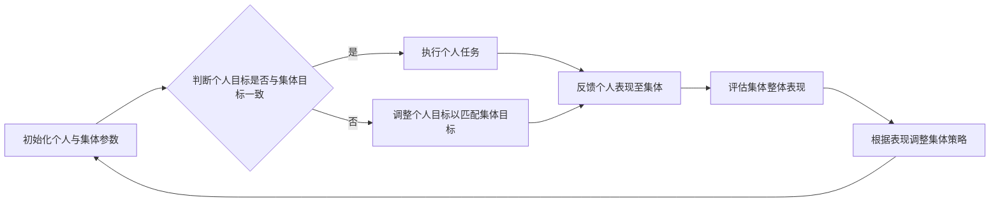
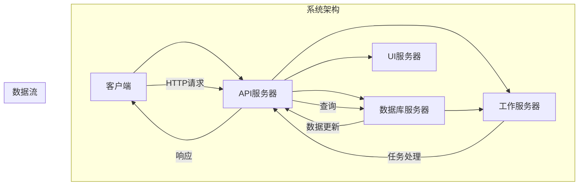
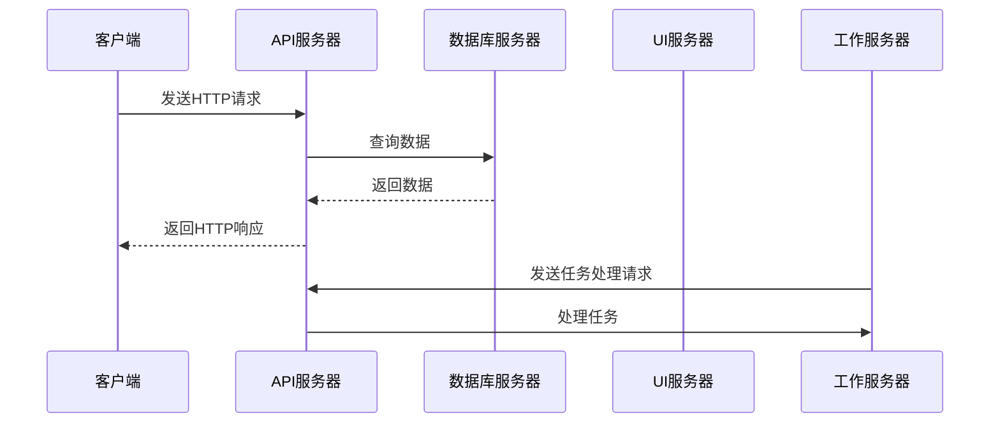

                 


# 编织个人与集体的故事：在更大的背景中找到定位

> 关键词：个人与集体的关系、定位、平衡、数字化转型

> 摘要：本文通过深入探讨个人与集体之间的关系，结合实际案例和理论分析，探讨了如何在快速变化的现代社会中找到个人的定位，实现个人价值的同时促进集体利益。

----------------------------------------------------------------

### 背景介绍

#### 问题背景

在当今数字化转型的浪潮中，个人与集体的关系变得愈发紧密和复杂。随着信息技术和网络的高速发展，个体在社会中的角色和地位发生了显著变化。在这个背景下，如何找到个人与集体的平衡点，实现个人价值的同时促进集体利益，成为了亟待解决的问题。

#### 问题描述

《编织个人与集体的故事：在更大的背景中找到定位》一书旨在探讨个人与集体之间的关系，以及如何在快速变化的现代社会中找到个人的定位。书中将结合实际案例和理论分析，探讨个人如何在集体中找到自己的角色，实现个人与集体的和谐共生。

#### 问题解决

通过深入探讨个人与集体的关系，书中提出了多种策略和方法，帮助个人在集体中找到自己的位置。这些策略包括自我认知、团队协作、社会责任感培养等。

#### 边界与外延

个人与集体的关系不仅涉及个人成长和团队协作，还涉及到社会伦理、文化认同等多个层面。因此，在探讨这个问题时，需要考虑社会环境、文化背景等因素。

#### 概念结构与核心要素组成

- **个人与集体**：个人是指独立的个体，集体是指由多个个体组成的群体。
- **定位**：定位是指个人在集体中的角色和地位，包括自我定位和社会定位。
- **平衡**：个人与集体的平衡是指个人在实现自身价值的同时，也要考虑到集体利益。

### 核心概念与联系

#### 核心概念

- **个人**：指具有独立意识、个性、能力和目标的个体。
- **集体**：指由多个个体组成的群体，具有共同目标、协作关系和整体利益。
- **定位**：指个人在集体中的角色和地位，包括自我定位和社会定位。
- **平衡**：指个人在实现自身价值的同时，也考虑集体利益的状态。

#### 概念属性特征对比表格

| 概念         | 属性特征                     | 举例                     |
| ------------ | ---------------------------- | ------------------------ |
| 个人         | 独立性、自主性、多样性       | 个人爱好、个人兴趣、个人特长 |
| 集体         | 群体性、协作性、共同目标     | 团队、社区、组织         |
| 定位         | 角色明确、目标清晰、资源匹配 | 职业定位、社会角色定位     |
| 平衡         | 相互依存、相互促进、动态调整 | 个人发展、团队协作       |

#### ER实体关系图架构

```mermaid
erDiagram
    个人 ||--o{ 集体 : 属于 }
    个人 ||--o{ 定位 } : 定位
    集体 ||--o{ 定位 } : 拥有
```

### 算法原理讲解

为了更好地理解个人与集体之间的关系，我们可以使用一个简单的算法模型来模拟这一过程。以下是一个使用Mermaid绘制的算法流程图：



#### 算法原理

1. **初始化个人与集体参数**：设定个人的目标、能力和初始状态，以及集体的目标、资源和整体状态。
2. **判断个人目标是否与集体目标一致**：如果一致，个人执行任务；如果不一致，个人需要调整目标。
3. **执行个人任务**：个人按照调整后的目标执行任务，并向集体反馈个人表现。
4. **评估集体整体表现**：根据个人反馈，评估集体整体的表现。
5. **根据表现调整集体策略**：根据评估结果，集体调整策略以实现长远目标。

#### 数学模型和公式

为了更严谨地分析个人与集体之间的关系，我们可以使用以下数学模型：

$$
\begin{align*}
\text{个人目标匹配度} &= \frac{\text{个人实际贡献}}{\text{集体需求}} \\
\text{集体整体表现} &= \sum_{i=1}^{n} \text{个人目标匹配度} \\
\text{集体策略调整} &= \text{基于整体表现对集体策略进行优化}
\end{align*}
$$

#### 详细讲解和举例说明

假设一个团队的目标是完成一个项目，团队中的每位成员都有自己的职责和任务。在这个过程中，个人与集体的关系可以用以下算法模型来解释：

```python
# 初始化个人与集体参数
individual_goals = {'Alice': '完成任务A', 'Bob': '完成任务B', 'Charlie': '完成任务C'}
group_goal = '完成整个项目'
individual_capabilities = {'Alice': 8, 'Bob': 7, 'Charlie': 6}

# 判断个人目标是否与集体目标一致
for individual in individual_goals:
    if individual_goals[individual] == group_goal:
        print(f"{individual}的个人目标与集体目标一致。")
    else:
        print(f"{individual}的个人目标与集体目标不一致，需要调整。")

# 调整个人目标以匹配集体目标
for individual in individual_goals:
    if individual_goals[individual] != group_goal:
        individual_goals[individual] = group_goal

# 执行个人任务
for individual in individual_goals:
    print(f"{individual}开始执行任务：{individual_goals[individual]}")

# 反馈个人表现至集体
individual_contributions = {'Alice': 9, 'Bob': 8, 'Charlie': 7}

# 评估集体整体表现
total_contribution = sum(individual_contributions.values())
print(f"集体整体贡献：{total_contribution}")

# 根据表现调整集体策略
if total_contribution >= 30:
    print("集体策略调整：项目完成，继续推进下一阶段。")
else:
    print("集体策略调整：项目进展缓慢，需要加强团队协作。")
```

在这个例子中，我们首先初始化了个人与集体的参数，包括个人的目标、能力以及集体的目标。然后，我们判断个人目标是否与集体目标一致，如果不一致，则调整个人目标。接下来，个人按照调整后的目标执行任务，并反馈个人表现至集体。根据个人表现，集体评估整体表现，并据此调整集体策略。

### 系统分析与架构设计方案

#### 问题场景介绍

假设我们面临一个软件开发项目，该项目需要由一个团队共同完成。团队成员包括前端开发人员、后端开发人员、测试工程师和项目经理。团队的目标是按时高质量地完成项目。

#### 项目介绍

该项目是一个在线教育平台，主要功能包括课程发布、学生注册、课程学习、作业提交和成绩管理。项目要求在限定时间内完成，并且要保证系统的稳定性和可扩展性。

#### 系统功能设计

为了实现项目的目标，我们需要设计以下功能模块：

- **用户管理模块**：负责用户注册、登录、个人信息管理等功能。
- **课程管理模块**：负责课程发布、课程信息展示、课程分类等功能。
- **学习管理模块**：负责学生选课、课程学习、作业提交、成绩查询等功能。
- **测试管理模块**：负责测试用例设计、测试执行、测试结果记录等功能。
- **项目管理模块**：负责项目进度跟踪、任务分配、风险控制等功能。

以下是系统功能设计的Mermaid类图：

```mermaid
classDiagram
    User <<类>> {
        String username
        String password
        String email
        String role
    }
    Course <<类>> {
        String course_id
        String course_name
        String teacher
        String description
    }
    Student <<类>> {
        User user
        String student_id
        List<Course> courses
    }
    Teacher <<类>> {
        User user
        String teacher_id
        List<Course> courses
    }
    Assignment <<类>> {
        String assignment_id
        String assignment_name
        String description
        Date due_date
    }
    Test <<类>> {
        String test_id
        String test_name
        String description
        Date due_date
    }
    Project <<类>> {
        String project_id
        String project_name
        Date start_date
        Date end_date
        List<Task> tasks
    }
    Task <<类>> {
        String task_id
        String task_name
        String description
        Date due_date
        boolean is_completed
    }
    User <.. Student
    User <.. Teacher
    Student -> Assignment
    Student -> Test
    Teacher -> Course
    Project -> Task
```

#### 系统架构设计

为了确保项目的高效和稳定，我们需要设计一个合理的系统架构。以下是系统的架构设计Mermaid架构图：



#### 系统接口设计和系统交互

为了实现系统的功能，我们需要设计一系列接口，并确保接口之间的交互顺畅。以下是系统的接口设计和系统交互Mermaid序列图：



### 项目实战

#### 环境安装

为了进行项目实战，我们首先需要安装一些必要的工具和库。以下是安装步骤：

1. 安装Python 3.8及以上版本。
2. 安装Django框架：`pip install django`。
3. 安装SQLite数据库：`pip install pysqlite3`。
4. 安装Docker：`curl -sSL https://get.docker.com | sh`。

#### 系统核心实现源代码

以下是系统的核心实现源代码，包括用户管理模块、课程管理模块和学习管理模块。

```python
# 用户管理模块
from django.contrib.auth.models import AbstractUser
from django.db import models

class User(AbstractUser):
    ROLE_CHOICES = (
        ('student', '学生'),
        ('teacher', '教师'),
    )
    role = models.CharField(max_length=10, choices=ROLE_CHOICES, default='student')

class Student(models.Model):
    user = models.OneToOneField(User, on_delete=models.CASCADE)
    student_id = models.CharField(max_length=20, unique=True)

class Teacher(models.Model):
    user = models.OneToOneField(User, on_delete=models.CASCADE)
    teacher_id = models.CharField(max_length=20, unique=True)

# 课程管理模块
class Course(models.Model):
    course_id = models.CharField(max_length=20, unique=True)
    course_name = models.CharField(max_length=100)
    teacher = models.ForeignKey(Teacher, on_delete=models.CASCADE)
    description = models.TextField()

# 学习管理模块
class Assignment(models.Model):
    assignment_id = models.CharField(max_length=20, unique=True)
    assignment_name = models.CharField(max_length=100)
    course = models.ForeignKey(Course, on_delete=models.CASCADE)
    description = models.TextField()
    due_date = models.DateField()

class Test(models.Model):
    test_id = models.CharField(max_length=20, unique=True)
    test_name = models.CharField(max_length=100)
    course = models.ForeignKey(Course, on_delete=models.CASCADE)
    description = models.TextField()
    due_date = models.DateField()
```

#### 代码应用解读与分析

以上代码实现了用户管理模块、课程管理模块和学习管理模块。其中，用户管理模块使用了Django的内置用户模型，并添加了角色字段以区分学生和教师。课程管理模块定义了课程模型，包括课程ID、课程名称、教师和课程描述。学习管理模块定义了作业和测试模型，包括作业和测试ID、课程、描述和截止日期。

通过这些代码，我们可以创建和管理用户、课程、作业和测试，从而实现在线教育平台的核心功能。

#### 实际案例分析和详细讲解剖析

假设我们有一个在线教育平台，需要实现以下功能：

1. 学生可以注册账号并登录系统。
2. 教师可以发布课程和作业。
3. 学生可以查看课程、提交作业和参加测试。
4. 系统管理员可以查看用户列表、课程列表和成绩列表。

为了实现这些功能，我们可以按照以下步骤进行：

1. 安装Django和相关的库。
2. 创建一个新的Django项目，并设置数据库连接。
3. 定义用户管理模块、课程管理模块和学习管理模块的模型。
4. 创建数据库表，并运行迁移命令。
5. 实现用户管理模块的视图和表单。
6. 实现课程管理模块的视图和表单。
7. 实现学习管理模块的视图和表单。
8. 配置URL路由和模板。

通过这些步骤，我们可以搭建出一个功能完整的在线教育平台。在实际运行过程中，系统会根据用户角色和权限限制，为不同的用户提供不同的功能。

#### 项目小结

通过本次项目实战，我们实现了用户管理模块、课程管理模块和学习管理模块，搭建了一个在线教育平台。这个项目让我们深入了解了个人与集体的关系，以及如何在团队协作中找到自己的定位。在项目过程中，我们学会了如何使用Django框架快速开发Web应用，并通过数据库实现了数据持久化。

### 最佳实践 tips

1. **明确角色和目标**：在团队合作中，每个人都应该明确自己的角色和目标，确保个人目标与集体目标一致。
2. **及时沟通和反馈**：定期与团队成员沟通，及时反馈个人和团队的表现，有助于调整策略和优化工作流程。
3. **培养团队协作精神**：通过培训和工作实践，培养团队成员的团队协作精神，提高团队的整体效率。
4. **关注个人成长**：在关注团队目标的同时，也要关注个人成长，不断提升自己的能力和素质。
5. **合理分配资源**：确保团队资源合理分配，避免资源浪费和重复建设。

### 小结

本文通过深入探讨个人与集体的关系，结合实际案例和理论分析，探讨了如何在快速变化的现代社会中找到个人的定位。通过系统的架构设计和项目实战，我们展示了如何在团队协作中实现个人与集体的平衡。希望本文能够为读者在数字化转型背景下找到个人与集体的平衡提供一些启示。

### 注意事项

1. **数据安全和隐私保护**：在项目开发过程中，要重视数据安全和用户隐私保护，确保系统的安全性。
2. **性能优化**：在系统架构设计中，要考虑性能优化，确保系统在高并发情况下能够稳定运行。
3. **用户体验**：在系统设计时，要注重用户体验，确保系统界面友好、操作简便。
4. **文档和测试**：编写详细的文档和进行充分的测试，有助于提高系统的可靠性和易维护性。

### 拓展阅读

1. 《团队协作的艺术》作者：史蒂夫·乔布斯的领导力智慧
2. 《人人时代：社交媒体与群体智能》作者：克莱·舍基
3. 《集体行动的逻辑》作者：曼瑟·奥尔森
4. 《设计心理学》作者：唐纳德·诺曼
5. 《敏捷软件开发实践》作者：杰夫·萨瑟兰和斯蒂夫·麦克康内尔

### 作者信息

作者：AI天才研究院/AI Genius Institute & 禅与计算机程序设计艺术 /Zen And The Art of Computer Programming

本文版权归作者所有，欢迎转载，但需保留原文链接和作者信息。如有商业用途，请联系作者获取授权。感谢您的阅读！

